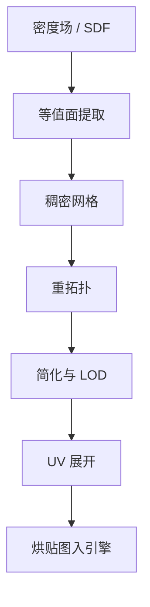

# 网格生成

一句话:NeRF 出的是密度场、3DGS 出的是椭球云、多视角扩散出的是图,它们都能渲染得很好看——但游戏引擎、DCC 软件和 3D 打印机吃的都是**三角网格**,而且是有干净拓扑和可用 UV 的网格。本篇讲的就是怎么跨过这道坎,以及为什么到现在都没跨利索。

## 一、立论:前三篇的产出,工业管线其实用不了

### 缺的不是精度,是结构

先把账摆开。同一个子领域的另外三篇,产出各不相同,但缺口是同一个:

| 前三篇的产出 | 渲染质量 | 有显式连通性吗 | 能进 DCC 软件改吗 | 缺什么 |
|---|---|---|---|---|
| NeRF 的密度场 | 高 | 没有,它是一个连续函数 | 不能 | 根本没有表面,只有"哪里比较实" |
| 3DGS 的椭球云 | 高,而且实时 | 没有,几百万个椭球各自独立 | 不能 | 基元不贴合表面,也没有可靠法向 |
| 多视角扩散的图 | 高 | 就是二维图 | 不能 | 还没到三维 |
| 三角网格 | 取决于面数与贴图 | **有:顶点 + 面片,谁和谁连着写死了** | 能 | —— |

**"渲染出来对"和"拿去能改能用"是两条不同的标准。** PSNR 刷得再高,也不保证第二条成立。网格在整个 3D 表示谱系里的定位(和体素、点云、隐式场各自的取舍)见 NeRF 篇,本篇不重列那张表。

### 为什么偏偏是三角网格

三条理由,一条比一条硬:

1. **硬件只为三角形优化过。** 显卡三十年的固定功能管线就是"顶点变换 → 三角形光栅化 → 片元着色",三角形是唯一有硬件直通路径的图元。任意曲面、点云、体素都得先转成它。
2. **它是唯一显式记下连通性的表示。** 有了"这三个顶点组成一个面"这条信息,才谈得上"选中这一圈边往外拉"这种编辑操作。点云和密度场里没有"边"这个东西可以选。
3. **整条下游工具链都建在网格拓扑上**:UV 展开、贴图烘焙、骨骼蒙皮、LOD、碰撞体、布料与形变解算,全部以顶点和面片为操作对象。换表示等于把这套几十年的工具链全部作废。



生成模型目前能把这条链路走通的只有前三步,后面四步至今仍需要人。下面两节分别讲"质量到底指什么"和"这三步怎么做的"。

## 二、网格质量到底指什么

这是本篇最该讲透的一节,因为外行只看渲染图,而渲染图对上面这六个维度里的五个都不敏感。

### 六个维度

| 维度 | 具体在问什么 | 不达标会怎样 |
|---|---|---|
| 面数预算 | 这个资产在目标平台上允许多少个三角形 | 超预算直接掉帧;而预算是按整个场景分配的,一件道具吃掉主角的份额就得砍别处 |
| 三角形长宽比 | 有没有又细又长的针状三角形 | 顶点属性插值精度差、光照出条带;物理与形变解算容易发散 |
| 流形性 | 是否水密、每条边是否恰好被两个面共用、有无自交与重面 | 布尔运算、3D 打印切片、体积计算全部失败或给出错误结果 |
| 边流 | 边的走向是否顺着形体的结构走 | 变形时表面撕裂或起皱,只在会动的资产上要命 |
| UV | 展开后有无重叠、拉伸多大、接缝放在哪 | 重叠 = 两块表面抢同一片贴图像素;拉伸 = 纹理在某些地方被拉糊 |
| 法线与切线 | 法线朝向是否一致、有无反面;切线是否与 UV 对齐 | 面翻黑;法线贴图方向错,凹凸打反 |

**流形性(manifold)** 说人话就是"这个网格能不能对应一个真实存在的物体表面":每条边只被两个面共用(不多不少)、面不穿过面、没有孤立的顶点和悬空的边。**为什么它是硬指标而不是加分项**:切片器要判断"这一层的截面里,哪块是实心",靠的就是数一条扫描线穿过表面的次数;表面破了个洞,内外就分不清,整个算法失去定义。

### 边流:为什么面数和拓扑一起决定了能不能改

**边流(edge flow)** 指的是边的走向。同样是一万个面,可以撒得毫无章法,也可以让边环绕着眼睛、嘴、关节一圈一圈排布。差别在两个地方:

- **形变。** 关节处需要几圈环绕关节的**边环(edge loop)**,弯曲时表面才会沿着这些环均匀折叠。边的走向和关节方向无关时,弯胳膊肘那一片会塌成一团——这是"拓扑不是设计出来的"最直观的后果。
- **简化与 LOD。** LOD 是同一资产按远近切换几档面数,通常从高模自动简化下来(经典算法是二次误差度量,把一条边坍缩成一个点、用一个二次型累计几何误差)。简化算法**只看几何误差,不知道哪几条边是造型的关键边**。在有边流的模型上它会顺着结构收;在杂乱拓扑上它是随机地啃,轮廓先崩。

所以"面数高"和"拓扑乱"不是两个独立的毛病,它们叠在一起才致命:面数高本来可以靠简化解决,但简化质量又依赖拓扑。

> 🖼️ 占位:同一个人头模型的拓扑对照——左边是等值面提取出来的密集三角面(方向杂乱、五官处无边环),右边是美术做的拓扑(边环绕眼睛和嘴排布、面数少一两个数量级)

### UV 展开为什么做不到自动无痛

UV 展开是把三维表面剪开、摊平到一张二维平面上,好让贴图的每个像素都能对应到表面上一个位置。难点不在算法,在数学:

**除了可展曲面(圆柱、圆锥这类),任何有高斯曲率的曲面摊平必然产生形变。** 这是微分几何的结论,不是工程没做好——把橘子皮压平一定会撕裂或起皱,地图投影几百年也没绕过这件事。于是自动展开只能在两件坏事之间权衡:**切更多接缝**(缝越多、每块越平坦、拉伸越小),或者**忍受更大的拉伸**(纹理在曲率大的地方被拉糊)。

接缝放哪则是个手艺活:**接缝两侧的贴图像素在纹理空间里不连续**,双线性过滤和 mipmap 会在那里露出一条细线。所以人会把它藏在腋下、内侧、材质本来就断开的边界处。自动算法没有"哪里显眼"这个概念,它只按几何指标切,接缝经常横穿脸中间。

> 🖼️ 占位:UV 展开示意——左边球面上标出切开的接缝线,右边是摊平后的几块 UV 岛,把拉伸最大的区域高亮出来

### 光照烘死的贴图 vs 可重新打光的 PBR 材质

这是"能渲染"和"能生产"分野最刺眼的一处。

重建和生成出来的贴图,记的是**拍照那天的光照下这块表面呈现什么颜色**:阴影、高光、环境反射全被烙进去了。把它放进新场景,太阳换个方向,贴图上那道阴影纹丝不动,一眼假。

生产资产要的是 PBR(基于物理的渲染)那套**分解开的**属性:基础色(不含任何光照)、粗糙度、金属度、法线,渲染时由引擎按当前光照现算。**从一张烘死的图反推出这几张分离的贴图,是一个欠定问题**——同一个像素的暗,可能是这块材质本来就深,也可能是它当时在阴影里,单看一张图分不开。要拆开就得引入额外约束:多光照条件下的观测、材质先验,或者像 nvdiffrec 那样把几何、材质、环境光**联合优化**,让三者互相牵制。这也是为什么"贴图看着不错"和"材质能用"是两回事。

## 三、路线一:从场里把网格提取出来

### Marching Cubes:按格子查表连面

输入是一个**标量场**加一个阈值:SDF 取零等值面,占用场取 0.5,NeRF 的密度场取一个自己拍的密度阈值。三步:

1. 把空间切成规则的立方体格子,在每个格子的 8 个角点上各查一次场值,和阈值比大小,得到 8 个 0/1——这个角点在物体里面还是外面。
2. 8 个二进制位拼成一个 0–255 的编号,**查一张预先建好的表**,表里写着这种内外组合下三角形该怎么连。$2^8 = 256$ 种组合,靠旋转对称和内外互补对称,原文归并到 14 种基本模式。
3. 三角形的顶点落在格子的棱上,具体位置按棱两端的场值做**线性插值**定出来。所以表面不完全卡在格点上,能比格子本身精细一点。

```python
# Marching Cubes 的内层循环:每个格子完全独立,可以并行
for cell in grid:                                  # 规则立方体格子
    corners = [field(p) for p in cell.corners]     # 8 个角点各查一次场值
    code = 0
    for i, v in enumerate(corners):
        if v < iso:                                # 小于阈值 = 在物体内部
            code |= (1 << i)                       # 8 个 0/1 拼成 0-255 的编号
    for edge_triple in TRI_TABLE[code]:            # 查表:这种组合连哪几条棱
        tri = [lerp_on_edge(e, corners, iso)       # 棱上线性插值定顶点位置
               for e in edge_triple]
        emit(tri)
```

**它凭什么从 1987 年活到现在:每个格子完全独立,不需要任何全局信息。** 于是它天然可并行、内存只需要驻留一层格子、实现不到两百行、没有需要调的参数。任何一个新的 3D 生成管线要在最后一步"出个网格",它都是默认选项。

### 它的四种病

1. **面数按分辨率的平方涨,而且极高。** 只有被表面穿过的那层格子才出面片,所以面数正比于表面积除以格子截面积——分辨率翻倍,面数涨四倍。更要命的是:**面数由格子密度决定,和形体复杂度无关**。一块平板和一座精细雕塑,只要表面积一样,提出来的面数就一样多。面数花在了它不该花的地方。
2. **阶梯状伪影。** 平缓斜面上,表面在相邻格子之间只能跳一格,渲出来是台阶。线性插值缓解了一部分但消不掉,想消只能提分辨率——**而这正好和上一条打架**:降伪影的唯一旋钮同时也是让面数爆炸的旋钮。
3. **薄结构丢失。** 比一个格子还薄的东西——叶片、电线、镂空花纹——可能整个格子的 8 个角点全被判在外面,查表结果是"什么都没有",那块结构直接消失;或者更糟,断断续续留一串碎片。
4. **拓扑歧义。** 某些角点组合(比如面上对角相对的两个角在内、另两个在外)有多种合法连法,选错就在本该连通处开个洞,或把本该分开的两块粘上。原始查表法没处理这件事,**产出不保证是流形**;asymptotic decider(1991)及后续一系列变体就是来补这个洞的。

**归结成一句:Marching Cubes 提出来的拓扑是扫描出来的,不是设计出来的。** 三角形怎么排,只反映采样格子怎么摆,不反映形体本身的结构。算法从头到尾没有"这是眼睛、这是关节"这个概念,所以边流是随机的、结构线是糊的、面数是平均撒的。**美术拿到这样一个网格,改它比重做还慢**——这就是为什么它渲染得对,却进不了生产管线。

### 变体谱系:从"把场画出来"到"这一步要能反传"

| 方法 | 年份 | 改了什么 | 拿到了什么 |
|---|---|---|---|
| Marching Cubes | 1987 | —— | 简单、可并行,事实标准 |
| Dual Contouring | 2002 | 顶点放在格子**内部**,位置由格内的法向信息解一个最小二乘定出来 | 能还原尖锐的边和角,原版会把它们磨圆 |
| Marching Tetrahedra / DMTet | 2021 | 立方体换成四面体,并让格点位置本身也可训练 | 查表情况少、无歧义;可微,几何能端到端优化 |
| Neural MC / Neural DC | 2021–22 | 把"该怎么连、顶点放哪"从手写规则换成学出来的 | 在训练分布内保细节更好 |
| FlexiCubes | 2023 | 在 Dual Marching Cubes 上加一组可训练的局部参数,让提取出的几何**与连通性**都能被下游目标调 | 专为"优化一个未知的场"设计,数值更稳 |

**注意这条线在往哪走**:用法变了。早年是"先重建好一个场,再提一次网格",提取是离线的最后一步;现在是**把提网格塞进优化循环**,让渲染损失一路传回去改场。这就要求提取算子对场可微,而原版查表是离散的、拓扑一变梯度就断——DMTet 和 FlexiCubes 补的正是这条。

顺带一件常被追问的事:**从 NeRF 的密度场提面,阈值是手调的**,因为体密度没有"表面在哪"的定义,调高了细节被吃掉、调低了浮空的雾也被提成面片。NeuS、VolSDF 那条线的做法是把密度改成由一个 SDF 参数化,零等值面天然就是表面,提出来的几何干净得多。

### 从 3DGS 提面为什么更难

密度场好歹是定义在全空间上的连续标量函数,选个阈值就能跑。高斯不行,两条根因:

1. **椭球不贴合真实表面。** 它们是悬在空间里的雾团,训练目标里没有任何一项要求它们贴面——一堵墙可能被十几层前后错开的扁椭球叠出来,渲染结果完全正确,但"表面在哪"没有唯一答案。
2. **没有可靠法向。** 常见做法是拿椭球最短半轴的方向当法向,但这只在椭球确实被压成薄片、且确实躺在表面上时才成立,而优化不保证这两件事。**所有表面重建算法都吃法向**(泊松重建尤其),法向不可靠,后面全塌。

所以主流做法是**先改训练、再提面**:2DGS 把椭球压成有朝向的圆盘,直接消灭"厚度"这个自由度;SuGaR 加一项正则把高斯往表面上推,再跑泊松重建。代价一致:为了几何,让出一点渲染指标。高斯基元的参数化、可微光栅化与自适应密度控制见 3DGS 篇。

## 四、路线二:直接把网格生成出来

### 把网格当成 token 序列

思路和图像侧"先离散化、再自回归预测下一个 token"是同一套(图像那边的路线之争见 图像Tokenizer 篇,本篇只借这个类比)。网格这边:

- **最朴素的做法**:顶点坐标量化到离散格点,一个三角形写成 3 个顶点 × 3 个坐标 = 9 个 token,$N$ 个面就是 $9N$ 个 token,让 Transformer 一个一个吐。PolyGen(2020)是起点,它把顶点序列和面序列拆成两个模型分别生成。
- **MeshGPT(2023)** 换掉 token 本身:先用图卷积把每个面的**局部几何与拓扑**编码成特征,再用残差量化学一个码本,Transformer 在这个学出来的码本上做 next-token 预测。论文自报相比当时的方法,shape coverage 提升 9%、FID 降 30 分。

### 它凭什么能给出像人做的拓扑

一句话:**因为它的训练数据就是人做的网格,它学的是"下一个面该接在哪",不是"这块空间实不实"**。

拆开就是两个完全不同的建模对象:

- Marching Cubes 建模的是**场**。拓扑是采样格子的副产品,算法根本不知道拓扑还能有好坏之分。
- 自回归生成建模的是**面片序列本身**。训练集里美术的习惯——结构线上放密面、平坦区放疏面、关节处摆边环——全部体现在"给定前面这些面,下一个面接在哪"的条件分布里,模型学的就是这个分布。

所以它的面数是**按形体复杂度分配的**,不是按格子密度平均撒的。MeshAnything 的论文口径是:同样的形状,它生成的网格比提取法少数百倍的面。

### 三笔代价

1. **面数上限是硬的。** 序列长度直接卡住面数:MeshGPT 训练时把数据过滤到 **800 面以下**,理由写得很直白——要让整个网格塞进上下文窗口;MeshAnything(2024)同样卡在 800 面,并在局限里明说超过上限的大场景和复杂物体做不了。后续进展**全在压 tokenization,不在换模型**:MeshAnything V2 用相邻面共享顶点的编码,平均把序列砍掉约一半,面数上限翻倍;BPT(2024)用分块索引加 patch 聚合压掉约 75%,把可生成面数推过 8k 面。
2. **慢,而且是自回归那种慢。** MeshGPT 论文自报生成一个网格要 30–90 秒,因为面片只能一个一个吐,没法并行。对比提取法在同样规模上是毫秒到秒级。
3. **顺序歧义。** 同一个网格有 $N!$ 种合法的面片遍历顺序(还没算每个面内三个顶点索引的循环排列),而自回归模型必须先有一个唯一的顺序,"下一个"才有定义。解法是**强行规定一套排序约定**:PolyGen 的做法是顶点按 z-y-x 从低到高排、面按其最小顶点索引排、面内索引循环移位让最小的排在最前,MeshGPT 沿用了这套。代价有两层——模型要额外花容量去记住这套人为约定,而且**局部改一个顶点可能让整条序列的编号全变**,不像图像 token 那样有天然的空间局部性。

### 两条路线怎么选

| | 提取(Marching Cubes 一族) | 直接生成(自回归) |
|---|---|---|
| 输入是什么 | 一个标量场(SDF / 占用 / 密度) | 点云、单图或文本条件 |
| 面数由什么决定 | **格子分辨率**,与形体复杂度无关 | **形体复杂度**,模型自己分配 |
| 拓扑质量 | 扫描出来的,边流随机 | 接近美术习惯,有结构感 |
| 规模上限 | 基本没有,拉分辨率就行(代价是面数爆炸) | **硬上限**,当前公开工作在千级到 8k 面 |
| 速度 | 快,格子之间完全并行 | 慢,逐面自回归,几十秒量级 |
| 可微 | 原版不可微;DMTet / FlexiCubes 专门补了这条 | 训练可微,推理是离散采样 |
| 现状定位 | **默认选项**,几乎所有 3D 生成管线最后一步都还是它 | 上限受限,更多作为"重拓扑"接在提取之后 |

**实践里这两条是串起来的,不是二选一**:先用提取拿到一个稠密但完整的网格,再交给自回归模型或传统的四边面场对齐类工具重做拓扑,然后简化到目标面数、展 UV、烘贴图。

截至 2026 年中的现状口径:TRELLIS(2024.12)、Hunyuan3D 2.0(2025.01)这类工作已经能几秒出一个带贴图的网格,质量够进"概念草模"这一档;但它们出的仍是提取式的稠密网格,面数高、拓扑乱、UV 不可用、贴图是烘死的颜色。**上面那条管线的后半段至今仍需要人工介入**,这也是"3D 生成还没颠覆美术管线"最实在的原因。这两个工作在生成侧的定位见 多视角扩散 篇。

## 五、面试考点串联

**本篇题库里暂无同名真题**,下表全部为补充题。

| 高频问法 | 本文哪一节 |
|---|---|
| NeRF 和 3DGS 渲染得挺好,工业上为什么还是非要网格不可? | 一 |
| 判断一个网格能不能用,你会看哪些东西?只看渲染图够吗? | 二(六个维度) |
| Marching Cubes 是怎么工作的?它凭什么从 1987 年用到现在? | 三(查表机制 + 格子独立) |
| Marching Cubes 提出来的拓扑,美术为什么不爱要? | 三(扫描出来的拓扑)、二(边流与形变) |
| 提取出来的网格面数为什么那么高?提高分辨率能治阶梯伪影吗? | 三(面数按平方涨,和降伪影的旋钮打架) |
| 为什么后来要把提网格这一步改成可微的?DMTet、FlexiCubes 在补什么? | 三(变体谱系:提取被塞进优化循环) |
| 从 3DGS 提网格比从 NeRF 提更难,难在哪? | 三(不贴面 + 没有可靠法向) |
| UV 展开为什么做不到全自动?接缝该放在哪、为什么? | 二(高斯曲率的死结 + 接缝) |
| 生成出来的贴图为什么换个光就假?PBR 材质缺的是什么? | 二(烘死的颜色 vs 分解开的属性) |
| 自回归网格生成是怎么回事?它凭什么能出像人做的拓扑? | 四(建模对象不同) |
| 自回归生成网格的代价是什么?为什么它现在只能做小物体? | 四(三笔代价) |
| 同一个网格有很多种遍历顺序,自回归模型怎么处理这个歧义? | 四(排序约定及其两层代价) |
| 提取和直接生成两条路线怎么选?真实管线里是怎么用的? | 四(对照表 + 串联管线) |

## 相关文献

- Marching Cubes: A High Resolution 3D Surface Construction Algorithm(SIGGRAPH 1987,非 arXiv)— https://doi.org/10.1145/37402.37422
- The Asymptotic Decider: Resolving the Ambiguity in Marching Cubes(IEEE Visualization 1991,非 arXiv)— https://doi.org/10.1109/VISUAL.1991.175782
- Dual Contouring of Hermite Data(SIGGRAPH 2002,非 arXiv)— https://doi.org/10.1145/566570.566586
- Surface Simplification Using Quadric Error Metrics(SIGGRAPH 1997,非 arXiv)— https://doi.org/10.1145/258734.258849
- Screened Poisson Surface Reconstruction(ACM TOG 2013,非 arXiv)— https://doi.org/10.1145/2487228.2487237
- Least Squares Conformal Maps for Automatic Texture Atlas Generation(ACM TOG 2002,非 arXiv)— https://doi.org/10.1145/566654.566590
- Instant Field-Aligned Meshes(ACM TOG 2015,非 arXiv)— https://doi.org/10.1145/2816795.2818078
- Boundary First Flattening — [arXiv:1704.06873](https://arxiv.org/abs/1704.06873)
- Deep Marching Tetrahedra: a Hybrid Representation for High-Resolution 3D Shape Synthesis — [arXiv:2111.04276](https://arxiv.org/abs/2111.04276)
- Flexible Isosurface Extraction for Gradient-Based Mesh Optimization(FlexiCubes)— [arXiv:2308.05371](https://arxiv.org/abs/2308.05371)
- Neural Marching Cubes — [arXiv:2106.11272](https://arxiv.org/abs/2106.11272)
- Neural Dual Contouring — [arXiv:2202.01999](https://arxiv.org/abs/2202.01999)
- NeuS: Learning Neural Implicit Surfaces by Volume Rendering for Multi-view Reconstruction — [arXiv:2106.10689](https://arxiv.org/abs/2106.10689)
- Volume Rendering of Neural Implicit Surfaces(VolSDF)— [arXiv:2106.12052](https://arxiv.org/abs/2106.12052)
- Extracting Triangular 3D Models, Materials, and Lighting From Images(nvdiffrec)— [arXiv:2111.12503](https://arxiv.org/abs/2111.12503)
- Delicate Textured Mesh Recovery from NeRF via Adaptive Surface Refinement — [arXiv:2303.02091](https://arxiv.org/abs/2303.02091)
- PolyGen: An Autoregressive Generative Model of 3D Meshes — [arXiv:2002.10880](https://arxiv.org/abs/2002.10880)
- MeshGPT: Generating Triangle Meshes with Decoder-Only Transformers — [arXiv:2311.15475](https://arxiv.org/abs/2311.15475)
- MeshAnything: Artist-Created Mesh Generation with Autoregressive Transformers — [arXiv:2406.10163](https://arxiv.org/abs/2406.10163)
- MeshAnything V2: Artist-Created Mesh Generation With Adjacent Mesh Tokenization — [arXiv:2408.02555](https://arxiv.org/abs/2408.02555)
- Scaling Mesh Generation via Compressive Tokenization(BPT)— [arXiv:2411.07025](https://arxiv.org/abs/2411.07025)
- 2D Gaussian Splatting for Geometrically Accurate Radiance Fields — [arXiv:2403.17888](https://arxiv.org/abs/2403.17888)
- SuGaR: Surface-Aligned Gaussian Splatting for Efficient 3D Mesh Reconstruction and High-Quality Mesh Rendering — [arXiv:2311.12775](https://arxiv.org/abs/2311.12775)
- Structured 3D Latents for Scalable and Versatile 3D Generation(TRELLIS)— [arXiv:2412.01506](https://arxiv.org/abs/2412.01506)
- Hunyuan3D 2.0: Scaling Diffusion Models for High Resolution Textured 3D Assets Generation — [arXiv:2501.12202](https://arxiv.org/abs/2501.12202)
