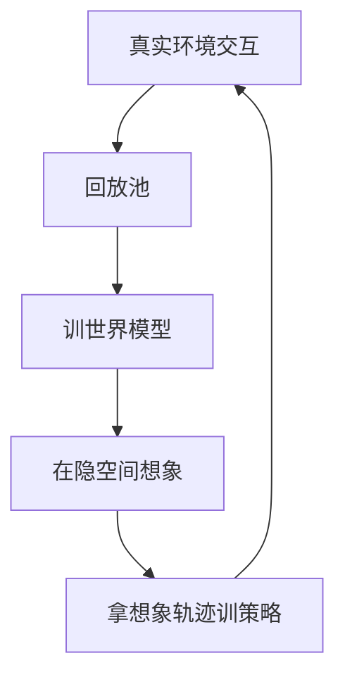

# 世界模型范式

一句话:世界模型是一台**学出来的环境模拟器**——喂给它当前状态和一个动作,它预测下一个状态和这一步的奖励;有了它,智能体就能**在脑子里试错,而不必在真实环境里试错**。本篇是这个子领域的地基:讲清它由哪几块组成、为什么想象要发生在隐空间、以及它会在什么地方骗人。

## 一、它解决的是什么问题

### 真实交互贵在哪

强化学习最贵的东西不是算力,是**真实交互的次数**。这笔账有三种形态:**时间**(机器人跑一小时就只能采到一小时数据,没法加速)、**钱**(真车、真机械臂、真用户流量)、**风险**(摔坏一台四足机器人的成本是实打实的)。而 model-free 方法对样本的胃口很大——PETS 那篇的口径是,同一个 half-cheetah 任务上它比 SAC 少用约 **8 倍**样本、比 PPO 少用约 **125 倍**,反过来读就是 model-free 那边要多烧这么多真实交互。

> **类比**:老司机在路口不会真把车开出去试试会不会撞——他脑子里先过一遍"这时候踩油门会怎样"。世界模型就是把这个"脑子里过一遍"做成一个可训练的网络。

### 一句话定义

世界模型就是学出来的一对函数:**给定当前状态和动作,预测下一个状态,以及这一步的奖励**。有了它,策略优化的数据来源就从"必须去环境里走一步"变成"在模型里想一步"——想象轨迹的边际成本只有一次网络前向,而真实交互的边际成本是一秒钟的机器人时间。

### 它就是 model-based RL 里的那个 model

这句话得先说死,因为它是本篇和 03 章的分界线。**世界模型不是一条新赛道,它就是 model-based RL 里的"模型"那一块**,只是换了一个更现代的形态。MDP 的五个要素、value-based / policy-based / actor-critic 三条路线的分野、DQN、DDPG/TD3/SAC、探索策略怎么设计,全部见 强化学习基础 篇,本篇一概不重讲。

那"世界模型"这个词为什么还要另起一篇?因为它换了输入:

| | 经典 model-based RL | 世界模型 |
|---|---|---|
| 模型的输入 | 低维状态向量(关节角、速度,已由人整理好) | 高维原始观测(图像、视频帧) |
| 模型建在哪 | 直接建在状态空间上 | **先学一个隐空间,再在隐空间里建** |
| 谁定义"状态" | 人 | 表征模块自己学出来 |
| 典型代表 | PETS、Dyna 一系 | World Models、PlaNet、Dreamer、TD-MPC2 |

差别就落在加粗那一行:**因为输入是像素,世界模型比经典 model-based RL 多了一整块"表征"**。至于"模型准不准、误差可不可控"那套通用取舍,两边完全一样(见 强化学习基础 篇)。

## 二、三块结构:表征、动力学、奖励头

### 各管什么,少了会怎样

| 模块 | 输入 → 输出 | 干什么 | 少了它会怎样 |
|---|---|---|---|
| 表征(编码器) | 观测 → 隐状态 | 把上万个像素压成几百个数 | 动力学只能在像素上预测,算力和误差一起爆 |
| 动力学 | (隐状态, 动作) → 下一隐状态 | rollout 里唯一被反复调用的部件 | 剩下的只是个自编码器,压根不能预测未来 |
| 奖励头 | 隐状态 → 标量分 | 把"预测"接到"决策"上 | 想象出的轨迹没有分数,策略无从优化 |
| 解码器(可选) | 隐状态 → 重建观测 | 给表征提供训练信号,顺便能肉眼看 | 表征容易只留下跟当前奖励相关的信息 |

**奖励头是最容易被漏掉、却最有决定性的一块**。因为一个只会预测画面的模型是**生成模型**,不是世界模型:它能告诉你"接下来看起来像什么",答不出"这么做好不好"。世界模型必须能给想象出来的每一步打分,策略那边才有梯度可用。DreamerV3 还额外配了一个 continue predictor,专门预测"这一集是不是结束了"——因为在想象里没有环境来告诉你 done,不自己预测就会把"死后"的奖励也算进回报。

动作是以**条件**的身份进入动力学的:动力学的输入永远是"状态 + 动作"这一对。至于动作空间怎么表示、条件从哪一层注入、离散和连续动作差在哪,见 动作条件与交互 篇,本篇一律不展开。

### RSSM:隐状态为什么要拆成两半

Dreamer 一系用的动力学叫 **RSSM**(Recurrent State-Space Model,循环状态空间模型),由 PlaNet 首次提出。它的核心动作只有一个:把隐状态拆成**一条确定性主干**和**一小块随机变量**,两者拼起来才算完整的"模型状态"。

$$
h_t = f_\theta(h_{t-1},\, z_{t-1},\, a_{t-1}),\qquad z_t \sim q_\theta(z_t \mid h_t,\, o_t),\qquad \hat z_t \sim p_\theta(\hat z_t \mid h_t)
$$

三个式子的分工很清楚。第一式是**确定性主干**,一个 GRU,把"到目前为止发生的一切"压进 $h_t$,里面没有任何随机性。第二式是**后验**,也就是编码器,它**看得到当前这一帧观测** $o_t$。第三式是**先验**,也就是动力学预测器,它**看不到观测**,只能从 $h_t$ 猜这一步的随机部分。训练时两条都算,并把先验往后验上对齐;**想象的时候只有第三式可用**——所以"先验能不能替代后验"这件事,直接决定了这个模型在想象里能走多远。

两半各管什么、少一半会怎样:

| | 确定性主干 $h_t$ | 随机部分 $z_t$ |
|---|---|---|
| 管什么 | 跨多步稳定地把信息记住 | 表达"下一步可能有好几种" |
| 去掉它会怎样 | 纯随机的转移很难可靠地记住多步信息 | 模型只能给出唯一未来,而且**规划器很容易钻它的不准之处** |

PlaNet 把两条路各自拆开跑过消融:纯确定性的 GRU 变体表达不了多种未来,纯随机的 SSM 变体记不住多步信息,两个都比完整 RSSM 差;论文口径是**随机那一半更关键——去掉它,智能体基本学不起来**。一句话记法:确定性负责**别忘事**,随机性负责**别嘴硬**。

$z_t$ 的随机性怎么反传?PlaNet 和第一代 Dreamer 用的是高斯后验加重参数化(这套机制见 VAE 篇)。DreamerV2 起换成了**离散的分类分布**,论文给的理由很直白:分类分布的混合还是分类分布,先验能精确拟合聚合后验;高斯先验拟合不了多个高斯的混合,遇到多模态的变化就不好预测。消融口径是 55 款 Atari 里有 **42 款**上离散潜变量明显更好。

> 🖼️ 占位:RSSM 一步展开图,横向画确定性主干 h 的链,竖向画后验(看观测)与先验(不看观测)两条分支,并标出想象时只走先验那条

## 三、为什么想象要发生在隐空间

### 三笔账

**算力账。** 一次想象 rollout 要往前推十几步——DreamerV2 用 15 步、DreamerV3 用 16 步,而且每次更新都要对**一整批**起点同时展开。若在像素空间做,每一步都得解码出整张图再重新编码回去;隐状态是几百维,一张 64×64 的图是上万维,差的不是常数倍。在隐空间里,一步就是一次小 GRU 加几个 MLP,可以整批并行,全程不碰卷积解码器。

**误差账。** 像素级损失会逼模型去还原它其实不需要还原的东西:草地纹理的相位、远处的噪点。这些细节对"往左打方向会不会撞"毫无影响,却吃掉绝大部分重建误差(和"VAE 出图糊"是同一个道理,见 VAE 篇)。在隐空间预测,等于**只对决策相关的那部分负责**。

**接口账。** 策略、价值函数、奖励头读的是同一个隐状态,rollout 出来的轨迹可以**直接**喂给 actor-critic,不必再编码一次。

把画面本身当状态、用视频生成模型充当环境的那一路,是另一种取舍(可玩世界那一支),见 视频世界模型 篇。

### 代价:漂了没人发现

隐空间的代价和它的好处是同一件事:**rollout 中途没有人检查隐状态还对不对**。像素空间起码肉眼能看出"车已经开进墙里了";隐空间里一个漂掉的状态和一个正常状态长得一模一样,照样能被奖励头打出高分。第四节两个失败模式的物理来源就在这里。

工程上的常规做法只有一条,而且很朴素:**别走太远**。MBPO 的做法是从真实数据里的状态出发,只往前分支很短的几步;Dreamer 一系把想象长度钉在 15–16 步,再靠 critic 的 bootstrap 去接管这个视野之外的回报——**用一个学出来的价值函数,替掉那些不敢再让模型往前推的步数**。

### 样本效率是从哪省出来的

闭环长这样:

省下来的是**真实交互的次数**,不是总算力。同一批真实数据被用了两次:一次训世界模型,一次(经由模型)生成几乎无限多条想象轨迹去训策略。几个可核对的量级:

- **PETS**:half-cheetah 上比 SAC 少约 8 倍样本、比 PPO 少约 125 倍(论文口径)
- **IRIS**:Atari 100k 上只用相当于**两小时游戏时长**的数据,人类归一化均分 1.046,26 款游戏里 10 款超过人类(论文口径)
- **DayDreamer**:四足机器人从零学会站立行走只用了 **1 小时**真实交互,无模拟器、无人工复位;被推之后 10 分钟内学会扛住扰动(论文口径)

代价是三条:多训一个模型、每步多一次模型前向,以及最要命的——**多了一个会骗人的中间层**。

## 四、评价与失败模式

### 预测得准 ≠ 对决策有用

这是世界模型最反直觉、也最常被问的一条:**一步预测误差和最终控制表现之间没有稳定的相关性**。Objective Mismatch 那篇的说法是,对某个任务好用的动力学模型不必全局准确,反过来也成立。

原因不难想:重建 loss 对所有维度一视同仁,而决策只关心其中很小一部分。一个把背景云彩预测得完美、却把"前面有没有障碍"预测错的模型,重建指标可以非常漂亮。

反过来的极端是 MuZero 与 TD-MPC2 那一路:**它们根本不重建观测**,隐空间只对奖励、价值和策略负责。Value Equivalence 那篇把这件事上升成了原则——两个模型只要给出相同的贝尔曼更新就算等价,学模型该以"对基于价值的规划有用"为目标,而不是以"预测状态转移准"为目标。TD-MPC2 用同一套超参在 104 个任务上训练,并把一个 3.17 亿参数的智能体做到覆盖 80 个任务(论文口径),说明这条不重建的路线本身是能放大的。

### 复合误差:自回归 rollout 越走越偏

**复合误差**(compounding error)是这么来的:第一步的预测偏了一点点,第二步就得从这个**已经偏了的状态**继续往下推。模型训练时见到的全是真实状态,推理时喂进去的却是自己上一步的输出——训练与推理的输入分布对不上,而且**每一步都往分布外多走一点**,误差不是线性累加,是被逐步放大。

这也解释了几个看似无关的现象为什么长一个样:长 rollout 里画面逐渐糊掉、物体凭空消失;短 rollout 好用、把长度调大反而变差;模拟器里验证得好好的模型,一上真实系统就崩。

对策就那么几条,而且每一条都是在"承认它治不好":**限制 rollout 长度**(短分支 + critic 接管远端)、**保留随机性**(RSSM 里 $z_t$ 那一半,以及别把采样温度压得太低)、**从真实状态重新起步**而不是让模型一路自己往下跑。

### 模型利用:策略会主动去钻模型的漏洞

比复合误差更阴的一种。策略优化的工作本来就是**在模型给的评分里找最高分**,而模型评分最虚高的地方,恰恰是它最不准、也最容易被搜到的地方——这和 critic 高估被 actor 一头扎进去是同一种病(见 强化学习基础 篇)。

World Models 那篇给了一个极干净的实证。在 VizDoom 上调整生成模型的采样温度 $\tau$:$\tau$ 压到 0.1 时模型变得更确定、也更好骗,智能体在梦里能刷到 **2086** 分,拿到真实环境只有 **193** 分——**比 210 分的随机策略还差**;把 $\tau$ 提到 1.15、让梦更嘈杂更难,梦里的分掉到 918,真实环境的成绩反而涨到 **1092**(均为论文口径)。论文还直接描述了智能体学出的对抗策略:走到某个位置,让模拟出来的怪物在整段 rollout 里干脆一发火球都不放。

**诊断信号很明确**:想象里的回报一路走高、真实环境里的回报不动甚至下滑。这个 gap 本身就该被当成一个必看指标。对策是三条——别为了"看着稳"把噪声压到 0、用模型集成在分歧大的地方保守打分、以及最根本的那条:**定期回真实环境取数**,别让策略在一个不再更新的模型里跑太久。

### 怎么设计评测

结论先行:**别只报重建 loss**,那是最不相关的一个数。分三层看,越往下越接近验收口径。

| 层 | 看什么 | 注意 |
|---|---|---|
| 模型侧 | 预测误差随 rollout 步数的曲线;奖励预测的准确率 | **一定要按步数分档报**,只报一步误差会把复合误差整个盖住 |
| 想象侧 | 想象回报与真实回报的 gap;想象轨迹的多样性 | gap 持续变大 = 模型利用正在发生 |
| 决策侧 | 用这个模型训出的策略在**真实环境**里的回报与样本效率 | **这一层才是验收**,前两层只是定位手段 |

两条容易踩的:一是**只在训练分布内评测等于没评**——必须专门测没见过的初始状态和罕见动作序列,因为策略恰恰会往那些地方钻;二是**要和一个诚实的 model-free 基线比同样的真实交互预算**,否则"省下来的样本效率"根本无从判断。可控性那一侧的评测(同一个初始画面下不同动作是否真的导出不同后果)见 动作条件与交互 篇。

> 🖼️ 占位:同一条轨迹在 1/5/15/50 步 rollout 下的预测误差曲线,与"想象回报 vs 真实回报"gap 曲线并排

### 什么时候干脆别上

判据和通用的 model-based 取舍是同一套,只是换到高维观测上卡得更紧:**动力学好不好学**(刚体、规则明确的游戏好学,接触碰撞多、随机性强的真实场景难);**误差能不能被检测和限制**(能不能只信短 rollout、能不能在模型不确定时退回真实数据);**真实交互到底贵不贵**——能随便开几千个并行环境的纯模拟任务,直接堆 model-free 往往更省心,毕竟世界模型本身也要训、也会错。规模这一侧倒是有正面证据:DreamerV3 在 12M 到 400M 参数之间做过缩放,论文口径是模型越大,任务表现越好、需要的数据反而越少;它也是用一套配置在 150 多个任务上跑通、并在 Minecraft 里用 1 亿环境步(单 GPU 约 9 天)从零挖到钻石的那一代。

## 五、面试考点串联

**本篇题库里暂无同名真题**,下表全部是按本篇边界补出的问法。

| 高频问法 | 本文哪一节 |
|---|---|
| 补充题:世界模型到底是什么?有了它,智能体能少做什么? | 一(一句话定义) |
| 补充题:世界模型和 model-based RL 是什么关系?为什么还要另起一个名字? | 一(输入换成高维观测,多了表征这一块) |
| 补充题:一个世界模型由哪几块组成?只会预测画面的模型算不算世界模型? | 二(奖励头那一段) |
| 补充题:RSSM 为什么要把隐状态拆成确定性和随机性两半?去掉任一半会怎样? | 二(两半各管什么 + PlaNet 消融) |
| 补充题:训练时的后验和想象时的先验差在哪?这个差别为什么决定了模型能想多远? | 二(三个式子的读法) |
| 补充题:DreamerV2 为什么把高斯潜变量换成离散的? | 二(末段) |
| 补充题:为什么想象要在隐空间里做,不直接预测下一帧画面?代价是什么? | 三(三笔账;漂了没人发现) |
| 补充题:在想象里训策略,样本效率具体是从哪省出来的? | 三(闭环图与三个量级) |
| 补充题:一个世界模型重建 loss 很低,能说明它好用吗? | 四(预测得准 ≠ 有用) |
| 补充题:复合误差是怎么回事?为什么自回归 rollout 会越走越偏? | 四(复合误差) |
| 补充题:什么是模型利用?策略为什么会主动去钻世界模型的漏洞? | 四(模型利用;VizDoom 的温度实验) |
| 补充题:世界模型该怎么评测?只报一步预测误差有什么问题? | 四(三层评测表) |
| 补充题:想象的 rollout 长度调长调短,各有什么后果? | 三(别走太远)、四(复合误差) |
| 补充题:什么情况下不该上世界模型? | 四(什么时候干脆别上) |

邻篇分工:把视频生成模型直接当环境、让画面本身充当状态的那一路,见 视频世界模型 篇;动作空间怎么表示、条件注入到哪一层、交互延迟怎么算,见 动作条件与交互 篇;经典 RL 谱系与 model-free / model-based 的通用取舍,见 强化学习基础 篇。

## 相关文献

- World Models(V-M-C 三件套;VizDoom 温度实验与对抗策略)— [arXiv:1803.10122](https://arxiv.org/abs/1803.10122)
- Learning Latent Dynamics for Planning from Pixels(PlaNet,RSSM 出处与确定性/随机消融)— [arXiv:1811.04551](https://arxiv.org/abs/1811.04551)
- Dream to Control: Learning Behaviors by Latent Imagination(Dreamer 第一代,20 个视觉控制任务)— [arXiv:1912.01603](https://arxiv.org/abs/1912.01603)
- Mastering Atari with Discrete World Models(DreamerV2;想象长度 15,离散潜变量在 55 款中的 42 款更好)— [arXiv:2010.02193](https://arxiv.org/abs/2010.02193)
- Mastering Diverse Domains through World Models(DreamerV3;想象长度 16、12M–400M 缩放、Minecraft 钻石)— [arXiv:2301.04104](https://arxiv.org/abs/2301.04104)
- Deep Reinforcement Learning in a Handful of Trials using Probabilistic Dynamics Models(PETS;8× / 125× 样本口径)— [arXiv:1805.12114](https://arxiv.org/abs/1805.12114)
- Transformers are Sample-Efficient World Models(IRIS;Atari 100k 两小时游戏时长)— [arXiv:2209.00588](https://arxiv.org/abs/2209.00588)
- DayDreamer: World Models for Physical Robot Learning(四足 1 小时学会行走)— [arXiv:2206.14176](https://arxiv.org/abs/2206.14176)
- Objective Mismatch in Model-based Reinforcement Learning(预测准 ≠ 控制好)— [arXiv:2002.04523](https://arxiv.org/abs/2002.04523)
- The Value Equivalence Principle for Model-Based Reinforcement Learning(该按"对规划有用"学模型)— [arXiv:2011.03506](https://arxiv.org/abs/2011.03506)
- When to Trust Your Model: Model-Based Policy Optimization(MBPO;从真实状态出发的短分支 rollout)— [arXiv:1906.08253](https://arxiv.org/abs/1906.08253)
- TD-MPC2: Scalable, Robust World Models for Continuous Control(不重建观测的隐空间世界模型)— [arXiv:2310.16828](https://arxiv.org/abs/2310.16828)
