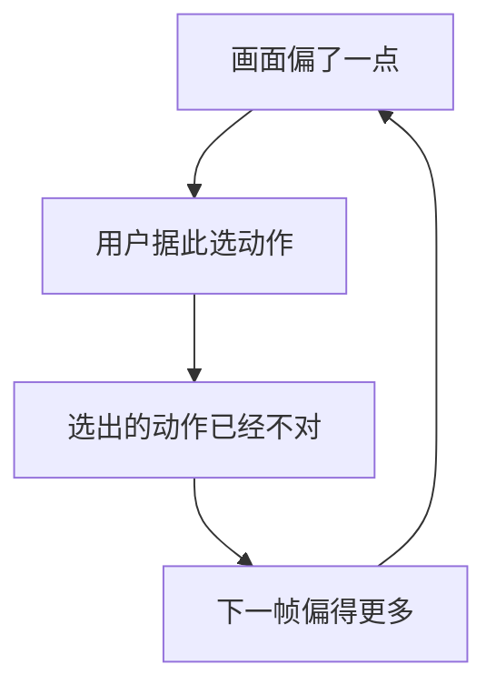

# 动作条件与交互

一句话:动作是所有条件里最难伺候的一个——它**每一步换一个新值、维度低到只有几个数、而且必须被当场遵守**,这三条性质决定了它该怎么编码、从哪一层进网络,以及为什么它的错会在交互闭环里被放大成雪崩。

世界模型的概念框架(表征 + 动力学 + 奖励、隐空间 rollout、复合误差、模型利用)见 世界模型范式 篇;把视频生成模型当可交互环境用会撞上的因果性、可回访一致性与帧率预算见 视频世界模型 篇;cross-attention、adaLN、FiLM、ControlNet 这些注入机制**本身**怎么工作见 条件控制 篇。本篇只回答一件事:**动作这个条件有什么特殊,以及这份特殊怎么贯穿表示、注入、延迟与评测**。

## 一、动作是个什么样的条件

### 和文本、深度图并排看

| | 文本提示 | 深度图 / 边缘图 | 动作 |
|---|---|---|---|
| 时间上 | 整段固定,一次给完 | 逐帧给一张,但可以预先备齐 | **每步换一个新值,下一步的值此刻还不存在** |
| 空间上 | 不对齐,靠注意力自己找位置 | **逐像素对齐**,位置白给 | 不对齐,也没有位置可对 |
| 维度 | 几十到几百个 token | 和输出图一样大 | **几个到几十个数** |
| 没遵守会怎样 | 观众未必看得出来 | 拿检测器回测才看得出 | **用户按了键没反应,当场就知道** |

这张表的三行加起来是一个很难受的组合:**信息量极低,约束却极强**。信息量低意味着它在网络里天然打不过整帧的视觉上下文,极容易被淹没;约束强意味着淹没的后果一秒钟就被用户抓住。第二节所有的注入设计,解决的都是这一个矛盾。

还有一条更阴的:**未来帧本来就能从视觉惯性里猜个八九不离十**。物体保持原来的速度、镜头保持原来的推移方向,光靠这些规律就能把训练损失压得很低——于是模型完全可以走这条捷径,**让画面根本不依赖动作**。CoCo 那篇(2026-08)把这个失败模式说得很直白:换个动作画面差不多,不给动作画面照样在动。这条捷径是第四节要专门设计反事实评测的根本原因。

### 动作空间的三种形态

| 形态 | 例子 | 怎么编码 | 麻烦在哪 |
|---|---|---|---|
| **离散** | 游戏按键、手柄的有限指令集、Genie 学出来的潜在动作 | 一个 embedding 查表 | 表达不了"同时按两个键":要么当成新的组合动作(组合爆炸),要么各占一维变成多热向量 |
| **连续** | 相机 6-DoF 位姿增量、机械臂关节角、鼠标位移 | MLP 投影成向量,或**分桶后当离散 token** | 各维尺度不统一(平移是米、旋转是弧度),不归一化就会有一维压过其余 |
| **混合** | 键盘的离散键 + 鼠标的连续位移;机械臂连续位姿 + 夹爪的离散模式位 | 分头编码再拼起来 | 两头的梯度尺度和学习难度不一样,容易一边学会一边没动静 |

**分桶那条要单独讲,因为它是当前具身策略的主流做法。** RT-1(2022-12)把 11 维动作(7 维机械臂、3 维底盘、1 维模式位)的**每一维各自均匀切成 256 个桶**,当成一个 256 词的词表,用交叉熵去训。好处是直接白拿语言模型那一整套:自回归解码、多模态动作分布天然表达得了、和文本 token 混在同一条序列里也不别扭,所以 RT-2 沿用了同一套离散化。代价是**一个动作要吐好几个 token,控制频率被 token 数卡死**——RT-1 的论文口径是 35M 参数、闭环 3 Hz。

反方向的证据是 π₀(2024-10):它不分桶,用流匹配直接出连续动作块,论文口径是能撑到 50 Hz 的高频动作块。这条对照说明**离散与连续之争不是审美之争,是频率之争**:分桶换来的是"能塞进语言模型",代价就是每一步要多解好几个 token。

### 为什么有些系统宁可丢掉游戏特有的动作

Hunyuan-GameCraft(2025-06)做了一个看起来很亏的选择:把标准的键盘和鼠标输入**统一映射进一个共享的相机表示空间**,训练数据是 100 多款 3A 游戏、超过一百万条录像(均为论文口径)。

它图的是三件事:

1. **跨游戏可迁移。** W 键在不同游戏里含义不同(前进 / 加速 / 翻页),而"相机往前推"在所有第一人称游戏里是同一件事。统一到相机空间,动作就从"这个游戏的键位"变成了"世界里的位姿变化",一份模型才吃得下上百款游戏的录像。
2. **连续可插值。** 按键只有按和不按两档,相机表示是连续的,"轻轻往前一点"和"猛推一把"之间可以平滑过渡——论文把这条明确写成了动机。
3. **监督信号现成。** 相机位姿能从视频里估出来,不需要按键日志;而按键日志恰恰是互联网录像里最缺的东西。

代价同样直接:**游戏特有的语义动作全丢了**。开枪、跳跃、开门、切换武器——这些要么不改变相机位姿,要么改变的方式和位姿无关,在相机表示里根本没有位置。所以这条路做出来的是一个能在任意游戏画面里走动和张望的模型,**不是一个能玩这个游戏的模型**。

一句话判据:**动作表示的抽象层次,决定了模型的泛化半径与能力上限**——越抽象(相机位姿、潜在动作)越通用,越贴近具体环境(原始键位、电机指令)越能干活,两头不可兼得。GameFactory(2025-01)提的是第三条路:用一个域适配器把"游戏风格"和"动作控制"解耦,让在小规模带标注数据上学到的控制,迁移到开放域的场景上去。

## 二、注入到哪一层

### 四个位置,各自的账

机制本身见 条件控制 篇,这里只算**动作用它们时**多出来的那笔账:

| 位置 | 具体做法 | 动作用它的好处 | 动作用它的坏处 |
|---|---|---|---|
| **拼进输入序列** | 动作 embedding 当序列里的一个 token,和帧 token 排在一起 | 和帧严格时间对齐;自回归骨干天生是这个形态(iVideoGPT 就把观测、动作、奖励摊进同一条序列) | 几千个视觉 token 里只有它一个,**最容易被稀释** |
| **通道拼接** | 把动作广播成一张常数图,拼在输入通道上 | 从第一层就可见,信息一点不丢 | 输入形状变了,主干必须重训;换一种动作空间就得再出一份模型 |
| **cross-attention 的 K/V** | 动作序列作 Key/Value,画面特征作 Query | 天然吃变长动作序列,能逐位置各查各的 | 动作只有几维,做成 K/V 是杀鸡用牛刀,注意力权重容易退化成几乎均匀 |
| **adaLN 调制** | 动作向量过一个 MLP,生成每层的缩放与平移 | 便宜(不加序列长度),而且**每层都作用一次**,不容易被冲淡 | 只能做全局调制,表达不了"只影响画面左半边" |

**当前主流是逐帧的 adaLN 调制**:动作是低维全局向量,正好落在 条件控制 篇里"全局向量进调制层"那一格;而它逐帧变化这一点,额外要求调制参数也**逐帧重算**,不能像文本那样整段共用一份缓存。

### 进得早还是进得晚

一句话:**进得越早影响越全局,也越容易在深层被冲淡;进得越晚控制越直接,但改不动已经定下来的高层布局。**

为什么会这样:

- **早注入**(输入层、前几个 block):动作参与了所有后续计算,理论上什么都改得动。但网络前几层还在处理低层纹理,那几个数要穿过十几层残差才影响得到最终输出,中间每一层都在混入大量视觉上下文——这就是"稀释"的物理含义。
- **晚注入**(靠近输出的几层):这时候"这一帧大致长什么样"已经定了,动作只能微调局部细节。想让往左转真的把整个场景横移,晚注入做不到,因为它改不动构图。这和 条件控制 篇里"扩散前段决定构图、后段决定纹理"是同一个道理的深度版本。

所以实践中的答案通常不是二选一,而是**每一层都注入一份**。adaLN 这类调制天生就是逐层的,把动作在每一层都重新提醒一次,既拿到全局影响,又不至于走到深层就没声了。**动作条件为什么常常要加到每一层,答案就是这条:它太低维,只加一次撑不住。**

### 动作比别的条件多出来的三条硬要求

1. **必须严格因果。** 第 t 帧只能看到第 t 步及以前的动作,未来的动作此刻还不存在(这条硬约束的完整来龙去脉见 视频世界模型 篇)。文本条件没有这个问题,它一开始就全给了。
2. **必须有一个显式的空动作。** 玩家不按键也是合法输入,而且要求画面**接着惯性走**,不是冻住。所以零动作得是动作空间里实实在在的一个值,不能用"这一步没给条件"代替——否则模型学到的是"没条件时随便画"。CoCo 报的失败模式正在这里:零动作下画面照样在动。
3. **强度旋钮基本不好用。** 图像条件可以靠调引导强度换取听话程度,动作这里换不来:调大就过冲(按一下前进冲出去十米),调小就不响应。根子在于**动作多半是离散事件,过冲和不响应都是错的,中间没有"稍微听一点"这个合法答案**。

> 🖼️ 占位:同一个动作分别在输入层、中间层、末层注入时,注意力/调制幅度随深度衰减的对照示意,标出早注入到深层已经接近本底的位置

## 三、闭环里的延迟与误差

先划界:**本节全是语义层面的账**——动作和画面之间的对应关系怎么错位、错位怎么被放大。一帧的时间预算怎么摊、NFE 和 KV 缓存怎么砍,那是算力账,见 视频世界模型 篇。

### 延迟的真正代价不是慢,是错位

玩家看到第 t 帧后按下动作,模型要过一段时间才把它的效果画出来。这段时间里发生三件坏事:

1. **归属错位。** 按下跳跃那一刻画面还停在按键前的状态,等跳跃真出现时,玩家可能已经按了别的键。人判断"我做了什么导致了什么"靠的是时间邻近性,**延迟一大,因果归属就断了**——玩家的抱怨会变成"这游戏不跟手",而不是"这游戏跳得不高"。
2. **状态过期。** 决策是基于第 t 帧做的,而动作生效时世界已经走到第 t+k 帧。这正是经典 MDP 那条隐含假设被打破的地方:标准 MDP 默认选动作的时候环境不动。Real-Time Reinforcement Learning(2019)把这条假设明确点出来,改成状态与动作同时演化的框架;Thinking While Moving(2020)处理的是它的机器人版本——上一个动作还没做完,就得决定下一个。
3. **补偿失效。** 人会自己去补延迟(提前按键)。一旦延迟**不稳定**,这套补偿就白学了,体感比稳定的高延迟还差。所以延迟必须报分布,只报均值等于没报。

> 🖼️ 占位:一条按键与画面响应的时间轴对照,上排是玩家的按键序列,下排是画面里实际出现该动作效果的时刻,标出固定延迟与抖动两种情况下用户提前量补偿的成败

### 误差在动作闭环里是怎么被放大的

世界模型范式 篇已经讲过**复合误差**:自回归 rollout 里第一步偏一点,第二步就得从偏了的状态继续往下推,训练与推理的输入分布对不上,误差逐步放大。那是**开环**版本——动作序列是外部给定的,只有状态在漂。

本篇要加的是**闭环**那一层:动作不是外生的,**它是用户或策略看着画面选出来的**。于是链条闭合了:

两者的区别要能一句话说死:

| | 复合误差(见 世界模型范式 篇) | 动作闭环里的放大(本篇) |
|---|---|---|
| 谁在漂 | 只有状态 | **状态和动作一起漂** |
| 动作序列 | 外部给定,固定不变 | **由已经偏了的画面反过来决定** |
| 怎么断链 | 缩短 rollout、从真实状态重新起步 | 缩短没用,**用户不会中途重启**;只能让每一步都尽量对得上 |
| 最坏情况 | 画面越来越糊 | **画面看着正常,但已经不是用户以为的那个世界** |

最后一行是本篇独有的坑,也最该记:**开环漂移是看起来不对,闭环漂移是看起来对但对不上**。一个被忽略掉的动作不留下任何视觉痕迹,用户却已经据它做了后面所有决策——从这一步起,用户脑子里的世界和模型里的世界分了叉,而且**不会自己合回来**。

这个结构在模仿学习那边更早被形式化过。DAgger 那篇(Ross 等,2011)讲的就是"策略犯一点小错 → 走到训练时没见过的状态 → 错得更多",对策是把专家拉回来、在**策略自己走出的状态上**重新标注。搬到这边,对应的做法是训练时就让模型在**自己生成的画面上**继续接动作,而不是永远喂真实历史(视频那侧的具体手段见 视频世界模型 篇的加噪历史帧,以及 长视频一致性 篇的暴露偏差)。

### 动作分块:一次出一串,把延迟和误差一起摊

这是延迟与误差累积在**策略侧**最干净的解法,而且两头都占。

ACT(2023-04)的做法是一次预测未来 $k$ 步动作,而不是一步一出。论文的消融口径很有说服力:50 Hz 控制下,$k=1$(不分块)成功率只有 1%,$k=100$ 涨到 44%,再往上到 200、400 反而掉下来。作者给的解释分两半——分块把有效决策步数缩短了 $k$ 倍(500 步的任务变成 5 步),**复合误差跟着缩了 $k$ 倍**;但块太长就失去反应能力,而且一长串动作本身也难建模。推理时它还配了一手时序集成:每步都重出一整块,把最近若干块里对当前时刻的预测按指数权重平均,免得相邻两块之间跳变。

分块在延迟这一侧同样是硬通货:**出一次能用 $k$ 步,等于把每步一次模型前向摊成每 $k$ 步一次**,单步延迟预算直接松一个量级。π₀ 用流匹配一次出一块连续动作、能撑到 50 Hz,靠的也是这条。

代价必须一起说:**块内是开环的**。块发出去之后那 $k$ 步里新观测进不来,环境突变也来不及改——这就是"块越长越省、但反应越迟钝"这条曲线的来源,ACT 在 $k=200$、$k=400$ 上掉下去就是它。

## 四、可控性怎么评

现成的视频指标为什么全都测不了这件事:FVD、FID 看的是生成分布像不像真实分布,VBench 那类看的是观感和文本对齐。**这些指标里没有任何一项知道用户按了什么**——一个把动作输入整个忽略、只管把画面画好看的模型,在它们上面可以拿高分。

### 三件必须分开量的事

| 量什么 | 问的是 | 怎么设计 |
|---|---|---|
| **响应有没有发生** | 我按了,画面动了吗? | 拿"喂真动作"和"喂随机动作 / 喂零动作"两组生成做对照,比它们各自与真值序列的差距。Vid2World(2025-05)验可控性用的就是这个对照,并把逐步的差值指标做成了归一化形式 |
| **响应的方向对不对** | 我按右,它往右了吗? | 从生成帧里反解运动(相机位姿、主体位移),和下达的动作**逐帧**比对。WorldRoamBench(2026-06)专门强调要逐帧,因为按整条轨迹对齐会把中间的漏响应平均掉 |
| **响应的幅度对不对** | 推一格,它推了一格还是十格? | 最容易漏的一项。跨模型比尤其麻烦:PlayWorld(2026-08)指出同一个控制信号在不同模型里位移幅度不同,不先做尺度对齐,就会把"幅度不准"误判成"几何不一致" |

### 同一个状态、不同动作:反事实构造

这是可控性评测的核心构造,也是 世界模型范式 篇明确交给本篇的那条:**从同一个初始状态出发,下不同的动作,看后果是不是真的不同。**

为什么非这么测不可:第一节讲过,未来帧从视觉惯性里就能猜个大概,模型不看动作也能把损失压得很低。单条轨迹的指标抓不到这一点——它只问"这条像不像真的",不问"换个动作会不会变"。**只有把同一个前缀分叉成多条,动作带来的差异才被单独量了出来。**

落地时的三条要点:

- **配对要严格。** 同一段历史 + 同一个随机种子 + 两个不同动作,只让动作这一个变量变。种子不固定,量到的差异里就混着采样噪声。Twin Rollouts(2026-08)把这条推到了极致:让事实分支与反事实分支共享同一段前缀和**同一串未来噪声**,只在干预点上分叉,于是"改动是不是最小"变成了可以逐样本验证的性质。注意这篇目前只给出框架、指标定义与定位,**论文自己写明实验尚未完成**,面试里提到它要带上这句。
- **两个方向都要量。** 一是**分叉够不够**(不同动作导出的未来必须真的不同),二是**分叉对不对**(往右那条真的往右了)。只量前者会奖励乱变,只量后者会漏掉根本没变。
- **反向动作与零动作是最好用的两个探针。** CoCo 就是围着这两个探针建的:参考 rollout、反向动作 rollout、零动作 rollout 三条一起约束,并提出动作响应一致性与漂移能量两个指标,配一个同状态多动作的小基准。论文口径:在它自己的 Mini-SSMB 上完整模型的两项 ARC 分别为 0.412 和 0.483,漂移能量相对基线降 17.07%,VP2 视觉规划平均成功率 73.1%。

### 怎么把可控性和画质分开

1. **先固定画质那侧的所有变量再比可控性**:分辨率、采样步数、上下文长度、动作强度旋钮,任何一项变了响应正确率就不可比。
2. **可控性必须和动态程度成对报。** 这是 视频世界模型 篇那三种刷分姿势在动作这侧的版本:一个几乎不动的模型,一致性满分,响应正确率也可能靠"什么都不做也没错"混过去。
3. **响应正确不等于响应合理**(按前进确实往前了,但是穿墙过去的)——这条 视频世界模型 篇已经写过,这里只补一句:它在**幅度**这一维同样成立,幅度对了不代表这个幅度物理上做得到。

现状口径截至 2026-09:这个方向的基准 2024 到 2026 每几个月翻一次,**还没有公认的可控性指标**。相对稳定的共识只有三条——逐帧报、和画质解绑、用同状态多动作的配对构造。跨模型直接比可控性分数尤其危险:不同模型的动作表示不一样(文本指令 / 键盘 / 轨迹),一句"前进"可以对应好几种低层控制,不做对齐的单步比较不公平。

## 五、和具身策略学习的衔接

### 一个学环境会怎么变,一个学我该做什么

| | 世界模型 / 动作条件模型 | 策略(VLA 那一类) |
|---|---|---|
| 学的映射 | (状态, 动作) → 下一状态 | (状态, 指令) → 动作 |
| 动作的身份 | **输入**,是条件 | **输出**,是要预测的东西 |
| 训练信号 | 预测出来的未来观测对不对 | 模仿专家轨迹,或最大化回报 |
| 少了它会怎样 | 只能回真实环境里试错 | 有环境但没人开车 |

**动作在两边的身份正好反过来**,这句是最好记也最常被追问的。也正因如此,同一批数据能同时喂两边:一条带动作标注的机器人轨迹,正着读是策略的监督信号,把动作当条件读就是世界模型的训练数据。Open X-Embodiment(2023-10)把 22 种机器人本体、527 项技能的数据拼成统一格式(论文口径),两边都在吃它;OpenVLA(2024-06)就是在这批数据上训的 7B 策略,论文口径是用了 97 万条真实机器人轨迹。

### 三种互相用的方式

1. **世界模型当模拟器,给策略供数。** UniSim(2023-10)是这条路最直白的一篇:用生成模型把真实世界的交互学出来,再在里面训高层视觉-语言策略和低层 RL 策略,论文口径是训完之后**零样本直接部署到真实世界**。iVideoGPT(2024-05)是同一思路的另一种形态,把观测、动作、奖励摊进同一条 token 序列做下一 token 预测,同时服务动作条件预测、视觉规划和 model-based RL。
2. **世界模型当评分器,替策略做筛选。** 它不必真的产出训练数据,也可以只用来判断一个动作好不好:把候选动作各自往前 rollout 一段,挑后果最好的那个。Vista(2024-05)在自动驾驶上就用模型自己搭了一个可泛化的奖励去评价真实动作,论文强调这套评价**不需要真值动作**。
3. **策略反过来给世界模型供数据。** 世界模型需要动作覆盖得够广的轨迹,而纯随机动作采不到有意义的状态,所以常见做法是先训一个 RL agent 去玩、把它的轨迹连同按键一起录下来(GameNGen 的数据就是这么来的,见 视频世界模型 篇)。这里藏着一个循环依赖:**策略越好,采到的数据越集中在好动作附近,世界模型在坏动作上就越不准**——而策略优化偏偏最爱往模型没见过的地方钻(模型利用那条见 世界模型范式 篇)。

### 动作表示上,两边的偏好是反的

这一条最容易出题:**世界模型偏爱抽象的、跨环境通用的动作表示,策略偏爱贴近执行器的动作表示。**

原因很朴素。世界模型要吃互联网规模的异构数据(上百款游戏、几十种机器人本体),动作表示不统一就拼不起来,而统一就得抽象——于是有了 Hunyuan-GameCraft 的相机空间,和 Genie 那种从无标注视频里学出来的潜在动作(机制见 视频世界模型 篇,论文口径是码本只有 8 个码)。策略这边最终要往电机上发指令,抽象动作解不成具体控制就等于没用。

所以两边在同一个系统里往往需要一层翻译,当前的常见做法有两种:让世界模型直接吃低层动作,代价是**换个本体就得重训**;或者先在无标注视频上学一套潜在动作,再用少量带标注数据把潜在动作对齐到真实控制上,GameFactory 用域适配器解耦风格与控制走的就是后一条。机器人那边的地图、规划与传感器融合归计划文章 机器人系统(尚未成文),本篇不展开。

## 六、面试考点串联

**本篇题库里暂无同名真题**,下表全部是按本篇正文出的补充题。

| 高频问法 | 本文哪一节 |
|---|---|
| 动作作为条件,和文本、深度图这些条件比特殊在哪?为什么说它最难伺候? | 一(三行对照表) |
| 动作维度那么低,为什么反而更难注入? | 一(信息量低、约束强)+ 二(稀释) |
| 一个模型可以完全不看动作还把损失压得很低,它是怎么做到的? | 一(视觉惯性捷径)+ 四(反事实构造) |
| 游戏里的键鼠动作怎么表示?离散和连续各有什么麻烦? | 一(三种形态表) |
| 有的系统把键盘鼠标统一成相机表示,图什么?又丢了什么? | 一(统一表示那一段) |
| 把动作每维切 256 个桶当 token,好处和代价分别是什么? | 一(分桶那一段) |
| 动作条件该从哪一层注入?进得早和进得晚各有什么问题? | 二(四个位置 + 早晚取舍) |
| 为什么动作条件常常每层都要加一遍,而文本条件不用? | 二(早晚取舍收尾) |
| 动作这个条件比文本多了哪些约束?为什么必须有一个显式的零动作? | 二(三条硬要求) |
| 交互延迟大了到底坏在哪?就是"慢"这么简单吗?为什么延迟不能只报均值? | 三(三件坏事) |
| 复合误差和交互闭环里的误差累积,是一回事吗? | 三(开环与闭环对照表) |
| 一步动作没被响应,后果为什么比画面糊掉更严重? | 三(看起来对但对不上) |
| 动作分块为什么能同时缓解延迟和误差累积?块开多长合适? | 三(ACT 的 $k$ 曲线与块内开环) |
| 怎么测一个交互式生成模型听不听话?FVD 为什么测不出来? | 四(三件分开量的事) |
| 同一初始状态、不同动作,这个测法为什么是必需的?怎么配对? | 四(反事实构造) |
| 可控性分数很高,可能是怎么刷出来的? | 四(和动态程度成对报) |
| 世界模型和 VLA 这类策略模型是什么关系?动作在两边分别是什么身份? | 五(动作身份反过来) |
| 它们怎么互相用?中间有没有循环依赖? | 五(三种用法 + 循环依赖) |
| 世界模型和策略在动作表示上的偏好为什么相反? | 五(抽象半径与能力上限) |

邻篇分工:概念框架、隐空间 rollout 与复合误差见 世界模型范式 篇;把视频模型当环境、Genie 与 GameNGen、可回访一致性、帧率预算与 NFE 见 视频世界模型 篇;条件注入机制本身见 条件控制 篇;经典 RL 谱系与策略优化算法见 强化学习基础 篇。

## 相关文献

- Action-Conditional Video Prediction using Deep Networks in Atari Games(动作条件预测的起点)— [arXiv:1507.08750](https://arxiv.org/abs/1507.08750)
- Genie: Generative Interactive Environments(潜在动作,码本 8 个码)— [arXiv:2402.15391](https://arxiv.org/abs/2402.15391)
- Hunyuan-GameCraft: High-dynamic Interactive Game Video Generation with Hybrid History Condition(键鼠统一进共享相机表示空间)— [arXiv:2506.17201](https://arxiv.org/abs/2506.17201)
- GameFactory: Creating New Games with Generative Interactive Videos(域适配器解耦游戏风格与动作控制)— [arXiv:2501.08325](https://arxiv.org/abs/2501.08325)
- RT-1: Robotics Transformer for Real-World Control at Scale(每维 256 桶,35M / 3 Hz)— [arXiv:2212.06817](https://arxiv.org/abs/2212.06817)
- RT-2: Vision-Language-Action Models Transfer Web Knowledge to Robotic Control(动作当文本 token)— [arXiv:2307.15818](https://arxiv.org/abs/2307.15818)
- OpenVLA: An Open-Source Vision-Language-Action Model(7B,97 万条真实轨迹)— [arXiv:2406.09246](https://arxiv.org/abs/2406.09246)
- π₀: A Vision-Language-Action Flow Model for General Robot Control(流匹配出连续动作块,最高 50 Hz)— [arXiv:2410.24164](https://arxiv.org/abs/2410.24164)
- Learning Fine-Grained Bimanual Manipulation with Low-Cost Hardware(ACT;动作分块 $k$ 的消融与时序集成)— [arXiv:2304.13705](https://arxiv.org/abs/2304.13705)
- Diffusion Policy: Visuomotor Policy Learning via Action Diffusion(连续多模态动作分布)— [arXiv:2303.04137](https://arxiv.org/abs/2303.04137)
- Open X-Embodiment: Robotic Learning Datasets and RT-X Models(22 种本体、527 项技能)— [arXiv:2310.08864](https://arxiv.org/abs/2310.08864)
- Real-Time Reinforcement Learning(状态与动作同时演化)— [arXiv:1911.04448](https://arxiv.org/abs/1911.04448)
- Thinking While Moving: Deep Reinforcement Learning with Concurrent Control — [arXiv:2004.06089](https://arxiv.org/abs/2004.06089)
- A Reduction of Imitation Learning and Structured Prediction to No-Regret Online Learning(DAgger)— [arXiv:1011.0686](https://arxiv.org/abs/1011.0686)
- Learning Interactive Real-World Simulators(UniSim;模拟里训策略后零样本上真机)— [arXiv:2310.06114](https://arxiv.org/abs/2310.06114)
- iVideoGPT: Interactive VideoGPTs are Scalable World Models(观测/动作/奖励同序列)— [arXiv:2405.15223](https://arxiv.org/abs/2405.15223)
- Vid2World: Crafting Video Diffusion Models to Interactive World Models(因果化 + 动作引导)— [arXiv:2505.14357](https://arxiv.org/abs/2505.14357)
- Vista: A Generalizable Driving World Model with High Fidelity and Versatile Controllability(用世界模型当奖励评价动作)— [arXiv:2405.17398](https://arxiv.org/abs/2405.17398)
- Overcoming Statistical Bias in Action-Controllable World Models(CoCo;反事实一致性、ARC 与漂移能量)— [arXiv:2608.04653](https://arxiv.org/abs/2608.04653)
- Twin Rollouts: Noise-Coupled Counterfactual Branching in Interactive Video World Models — [arXiv:2608.08982](https://arxiv.org/abs/2608.08982)
- WorldRoamBench: An Open-World Benchmark for Long-Horizon Stability of Interactive World Models(逐帧动作指标)— [arXiv:2606.31672](https://arxiv.org/abs/2606.31672)
- PlayWorld: Benchmarking World Models with Agent Players over Long-Horizon Objectives(跨模型位移幅度不一致)— [arXiv:2608.13552](https://arxiv.org/abs/2608.13552)
