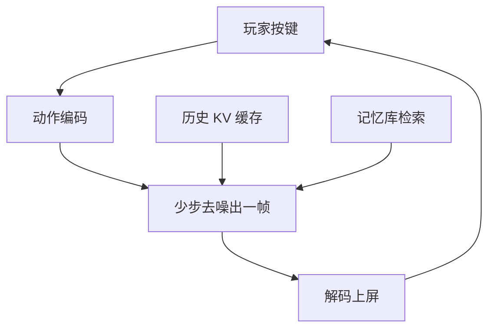

# 视频世界模型

一句话:普通视频生成是**一次性把一整段视频出完给你看**,视频世界模型要做的是**逐帧生成、每一帧都接住用户当下的动作、而且要实时**——这个转变把视频生成的整套指标都换掉了:不再问"这段视频好不好看",而是问它**响不响应我的操作、响应得对不对、能不能一直玩下去**。

世界模型的概念框架(表征 + 动力学 + 奖励怎么分工、隐空间 rollout、想象中训练、和 model-based RL 的关系)见 世界模型范式 篇;**动作空间怎么表示、条件注入到哪一层、离散还是连续、交互延迟与误差怎么摊**,全部见 动作条件与交互 篇。本篇只回答一个问题:**把一个视频生成模型当成可交互环境来用,会撞上哪些新问题**。

## 一、从"一段视频"到"一个环境":三条硬约束

### 差别不在画质,在接口

两者的骨干可以是同一个 DiT,但**用法完全不同**,而用法差异倒逼架构差异:

| | 离线视频生成 | 视频世界模型 |
|---|---|---|
| 输出粒度 | 一次出完整段(如 49 帧) | **一帧一帧地出,出一帧交付一帧** |
| 条件何时到齐 | 生成开始前全部给定 | **每帧到达一个新动作,未来的动作此刻还不存在** |
| 注意力方向 | 双向,末帧和首帧互相看得见 | **只能看过去,严格因果** |
| 时间预算 | 分钟级也可接受 | **单帧几十毫秒,超了就不成立** |
| 用户角色 | 观众 | 玩家 |
| 失败判据 | 画质、文本对齐、别漂移 | 动作不响应、走回头路场景变了、跑几分钟崩掉 |

### 因果性是硬约束,不是为了省算力

离线扩散视频模型之所以身份一致性好,是因为**整段被联合去噪,第 49 帧和第 1 帧在同一次前向里互相看得见**(这笔账见 视频扩散架构 篇)。这个前提在交互场景里**语义上就不成立**:第 t+1 帧取决于玩家看到第 t 帧之后按了什么键,而那个键在生成第 t 帧时**还没有被按下**。

所以这里的因果注意力不是"更省的近似",而是**双向注意力在这里根本拿不到输入**。这一条直接判掉了当今主流视频基座的默认配置,要用就必须先改造成因果的——CausVid、Self Forcing 这条把双向模型蒸馏成因果自回归模型的线,做的就是这件事(机制见 长视频一致性 篇)。

### 实时性从"锦上添花"变成"不达标就不成立"

离线视频慢十倍,只是等得久;交互式生成慢十倍,**就不是同一个东西了**。因为交互的定义就是"我按键 → 我看到反馈 → 我据此按下一个键"这个闭环;闭环一慢过阈值,玩家的下一个动作就不再是基于当前画面做出的,**反馈回路直接断掉**,模型退化成一个可以插嘴的视频播放器。

工程上这条约束是硬的:30 FPS 意味着每帧只有 33 ms,20 FPS 意味着 50 ms 内要跑完"读动作 → 去噪 → 解码 → 上屏"的全部工作。**这就是为什么第四节的所有手段不是优化项,是及格线。**

图里 F→A 那条回边是全篇的主语:**它闭合得够快,才叫环境;闭不上,就还是视频。**

## 二、两条代表路线:Genie 和 GameNGen 解决的不是同一个问题

这两篇经常被并列提起,但它们的**输入假设、要克服的困难、产出的东西完全不同**,面试里混着说会露馅。

| | Genie(2024-02) | GameNGen(2024-08) |
|---|---|---|
| 数据 | 无动作标注的网络游戏录像 | 单个游戏(DOOM),RL agent 自己玩出的带动作轨迹 |
| 动作从哪来 | **从视频里学出来** | 现成的,就是游戏的按键 |
| 覆盖范围 | 开放:一张图或一句话就能开一个新世界 | 单一游戏,出不了这个游戏 |
| 主要难点 | **没有标签,怎么学出可控性** | **实时,而且长时间不崩** |
| 产出 | 通用的可交互世界生成器 | 一个跑得动的神经游戏引擎 |

### Genie 这一路:动作标注为什么可以不要

难点先说清楚:互联网上有海量游戏录像,但**没有任何一条录像标着"这一帧玩家按了什么键"**,人工标注在这个量级上不可能。

做法是训一个**潜在动作模型**:编码器拿"过去若干帧 + 下一帧",吐出一个编码;解码器拿"过去若干帧 + 这个编码",要求重建出下一帧。中间用 VQ 把编码压进一个**极小的离散码本**——Genie 论文的口径是 **8 个码**。

为什么这样能逼出"动作":重建下一帧需要的信息分两部分,**一部分从过去帧就能推出来**(背景、已有物体、惯性运动),**一部分推不出来**(玩家这一刻的意图)。码本窄到只有 8 个码,编码器根本塞不下画面细节,**只能把"过去帧推不出来的那一点点"塞进去,而那点东西恰好就是动作**。瓶颈本身就是监督信号,一条标注都不需要。

边界要说明白:

- 学出来的动作是**模型自己定义的**,不保证对应"跳""左"这种人话语义;可解释性来自码本小,不来自任何显式约束
- 它证明的是"无标注能学出可控性",**不是"能实时玩"**。论文口径是 160×90、10 FPS、11B 参数,训练数据是 24.4 万小时原始素材过滤到 **3 万小时**的 2D 平台跳跃类录像
- 更早的 Playable Video Generation(2021)已经用同一个"离散动作瓶颈"的思路做过小规模验证,Genie 是把它推到了互联网数据规模

后续两代把这条路推到了 3D 和实时,但**只有 DeepMind 博客口径,没有论文、没有第三方复现**,面试里必须说明这一点:Genie 2(2024-12)官方说法是"可保持一致的世界最长到一分钟,展示的多数例子是 10–20 秒",并明确说它**能记住已经离开视野的部分,再看回去时还原得上**;Genie 3(2025-08)官方说法是 **720p、24 FPS、可连续交互几分钟,视觉记忆能回溯到大约一分钟前**。

### GameNGen 这一路:把一个具体游戏实时模拟出来

问题换了一副面孔:动作标签不缺(让 RL agent 去玩 DOOM,轨迹和按键一起录下来),缺的是**速度**和**长时间不崩**。

论文口径(ICLR 2025)的几个关键数字:**单张 TPU-v5 上 20 FPS**、**4 步 DDIM 采样**、上下文是**自己前 64 帧的预测 + 前 64 个动作**、分辨率 320×240;下一帧预测 PSNR 29.4,论文自己把它类比成有损 JPEG 的水平;人类评委在短片段上区分真实游戏和模拟,**只是略好于随机猜**。

这三个数字要读出三件事:

1. **4 步不是图省事,是被 50 ms 逼的**。20 FPS 给每帧 50 ms 预算,而标准扩散那 20–50 步的骨干前向,在 50 ms 里根本排不下(采样步数怎么压见 Diffusion 篇、蒸馏 篇)。
2. **64 帧上下文在 20 FPS 下只有 3 秒多**。这个数字直接决定了第三节的记忆问题:超出 64 帧的一切,模型**在架构上就看不见**。
3. **它靠给历史帧加噪来防漂**:训练时对上下文帧加不同强度的高斯噪声,并把噪声档位一起告诉模型。这样模型知道"历史是脏的、可以纠正",而不是把上一帧的瑕疵当真值忠实延续。这和 长视频一致性 篇讲的暴露偏差是同一个病、同一族解法,只是在这里**每帧都发生一次,不是每段一次**。

### 现状口径(截至 2026-09)

- **开源侧**:Oasis(Decart + Etched,2024-10)把 Minecraft 做进浏览器,发布方口径是 20 FPS 实时、开源了 500M 的缩水版,并把"长时记忆有限"直接写进已知缺陷——现象是挖个洞可能掉回地面、放一块土可能凭空长出一片新地形。Matrix-Game 2.0(2025-08)用少步自回归蒸馏加 KV 缓存做到 **25 FPS 的分钟级流式生成**,训练数据约 1200 小时 UE / GTA5 录像;Matrix-Game 3.0(2026-04)报到 **720p、最高 40 FPS(5B 档)**,并加了相机感知的记忆检索。Hunyuan-GameCraft(2025-06)走的是另一个取向:把键鼠输入统一成相机表示,用 100 多款 3A 游戏、超百万条录像训一个通用的可交互生成器。
- **闭源侧**:Genie 3 是当前公开演示的天花板,但如上所述只有博客口径。
- **学术侧**:DIAMOND(NeurIPS 2024)从强化学习那侧过来,证明用扩散当世界模型在 Atari 100k 上能拿到 1.46 的人类归一化分,并顺手把 CS:GO 做成了可交互引擎。微软的 WHAM(Nature,2025-02)是第三种取向:1.6B、300×180、上下文只有 1 秒,目标是**给游戏设计师做玩法构思**而不是实时游玩;到 WHAMM(2025-04)才把 Quake II 做到 640×360、10+ FPS。
- **游戏之外**:同一套"视频模型当环境"的构造也被搬到了自动驾驶与机器人导航(NVIDIA Cosmos,2025-01;Navigation World Models,CVPR 2025),差别在于那边生成的画面主要是**拿去做规划**,不是拿去玩,评价标准也跟着换成任务成功率。这条线归 世界模型范式 篇,本篇不展开。

**跨模型直接比 FPS 没有意义**——这些数字全都绑死在特定的分辨率、模型规模、上下文长度和硬件上,口径见第四节最后一段。

## 三、可回访一致性:视频世界模型独有的那个坑

### 它和长视频漂移不是一回事

这是本篇和 长视频一致性 篇的分界线,必须能一句话切开:

| | 长视频的漂移 | 视频世界模型的可回访一致性 |
|---|---|---|
| 问的是什么 | 一段不可交互的视频,是不是越走越歪 | **走出房间再走回来,房间还是不是那个房间** |
| 谁来判 | 观众顺着看,只觉得"怎么慢慢变了" | **玩家可以主动回头验货** |
| 错误性质 | 缓慢累积、单向、渐变 | **离散的对/错判定,能被精确抓住** |
| 时间尺度 | 秒到分钟的单调劣化 | 任意时刻回访任意早的位置 |

一句话概括差别:**长视频的观众永远看不到正确答案,而世界模型的玩家可以随时转身把正确答案调出来对质**。这让一致性从一个模糊的观感问题,变成了一个**可以被硬性证伪**的问题——所以它比长视频漂移更难混过去。

### 为什么纯自回归的有限上下文必然遗忘

GameNGen 的 64 帧是个具体例子,但结论是通用的:**上下文窗口一有限,超出窗口的历史在架构上就不存在了**。玩家转身走开五秒再走回来,如果这五秒超出了窗口,模型手里只剩"现在眼前这几帧",它**必须重新猜**背后那面墙上有什么——而猜出来的东西和五秒前那个,是两回事。

这不是训练不够,是架构决定的。把窗口开大这条路又被两重约束堵死:

1. **算力**:注意力是平方复杂度,窗口开大到覆盖几分钟直接爆炸(账见 视频扩散架构 篇)
2. **实时性**:窗口每长一帧,单帧延迟就涨一点,而单帧延迟有硬预算。**这是普通长视频没有的第二重约束**——那边把窗口开大最多是"生成得慢",这边是"直接不成立"

### 三条思路,各自守住什么

| 思路 | 做法 | 守住什么 | 代价 |
|---|---|---|---|
| **加长有效上下文** | 因果注意力 + KV 缓存把窗口尽量拉长;或按重要性分配上下文预算,越近的帧留越多 token(FramePack 那类) | 几十秒量级的连续性 | **只是把墙推远,没有拆墙**;缓存本身吃显存,还要跟单帧延迟预算抢时间 |
| **显式记忆库** | 把见过的帧连同当时的位姿、时间戳存下来,回访时按当前视角检索相关的几帧注入回去(WorldMem 那类) | **真正的可回访**:离开多久都能调回来 | 要维护和检索;检索错了是硬性注错,后面每帧都会忠实地画错 |
| **几何锚定的空间记忆** | 维护一个显式的三维场景表示,回访时从它渲染出条件图 | 几何一致性成了硬约束,而不是学出来的倾向 | 依赖三维重建,而重建本身还没做好(表示见 NeRF 篇、3DGS 篇) |

三条**不是三选一**,当前系统基本是短程靠缓存、长程靠检索。方向上的共识是:**帧序列本身不是合适的状态载体**——它把"这个世界是什么样"和"这一帧长什么样"糊在了一起,而只有前者需要被长期保存。这也是"视频模型 vs 世界模型"这个说法的实质分歧点:前者存的是像素历史,后者要存的是世界状态。

> 🖼️ 占位:同一条交互轨迹的"离开 → 走远 → 回访"三帧对照,左列是无记忆模型回访时凭空重画的场景,右列是带记忆检索的回访结果,圈出对不上的陈设

## 四、算力账:为什么扩散在这里天然吃亏

### 帧率预算怎么拆

把一帧的时间预算摊开看(30 FPS = 33 ms;20 FPS = 50 ms):

| 环节 | 干什么 | 怎么压 |
|---|---|---|
| 动作编码 | 把这一帧的键鼠输入变成条件 | 几乎不花时间 |
| **骨干去噪** | NFE 次前向,**绝对大头** | **蒸馏到 1–4 步**,砍的是 NFE |
| **历史注意力** | 让当前帧看到过去若干帧 | **KV 缓存**:历史帧的 K/V 算过一次就存下来复用 |
| VAE 解码 | latent 还原成像素 | 轻量 decoder、降分辨率、和去噪流水化重叠 |
| 传输与上屏 | 云端方案还有一次网络往返 | 压不动,它给整条链路设了延迟下限 |

**能砍的就是 NFE 和历史重算这两项。** 两项都不是可选项。

### 扩散吃亏在哪

一句话:**扩散的单次输出天生带一个 NFE 乘数,自回归天生不带**。语言模型出一个 token 是一次前向;扩散出一帧是 NFE 次前向。同样规模的骨干,交互式扩散的每帧成本先天高一个量级。所以这条线上几乎所有工作都在做同一个动作——**把 NFE 压到个位数,同时不让画质崩**(蒸馏与少步采样的机制见 Diffusion 篇、蒸馏 篇)。

但扩散也不是没牌:画质和条件接口是现成的,而纯离散自回归被 tokenizer 的重建上限锁死。所以当前主流是**折中形态**:帧与帧之间因果(拿到流式输出和 KV 缓存),帧内部用少步扩散(拿到画质)。Matrix-Game 2.0 那套"因果架构 + 少步蒸馏 + KV 缓存"就是这个形态的标准配置。

### KV 缓存在这里能用,而离线扩散不能

这条值得单独记,因为它和 视频扩散架构 篇的结论正好相反,是高频追问点。

**离线扩散视频模型没有跨步 KV 缓存**:每一步去噪都要重算整段序列,序列形状从第一步起就固定,没有"已经定稿、可以缓存"的部分。而视频世界模型是**沿时间轴自回归**的:第 t 帧一旦出完就定稿了,它的 K/V 对后面每一帧都有效,**这才有了缓存的前提**。

所以"扩散模型不能用 KV 缓存"这句话在这里是错的。**能不能缓存,取决于时间维是不是因果自回归的,不取决于帧内部用什么方式生成。**

### 一条报数纪律

任何 FPS 都必须连**分辨率、模型规模、上下文长度、采样步数、硬件型号**一起报:GameNGen 的 20 FPS 是 320×240、4 步、单张 TPU-v5;Matrix-Game 3.0 报的 40 FPS 是 720p、5B 档。**这五项不给全,两个 FPS 数字之间不可比**,这也是这类论文最容易被追问的地方。

## 五、评测:画面好看只是及格线

### 三类必须单独测的东西

| 维度 | 问的是 | 怎么测 | 为什么现成的视频指标测不出来 |
|---|---|---|---|
| **动作响应正确率** | 我按了"右",画面真往右了吗?幅度对吗? | 从生成帧里反解相机或主体运动,和实际下达的动作逐帧比对,算通过率 | FVD、VBench 看的是分布和观感,和"有没有听我的"完全无关 |
| **可回访一致性** | 走出去再走回来,场景对得上吗? | 构造回环轨迹(原地转一圈、走远再折返),把回访帧和最初那几帧对比 | 单向播放的指标根本不构造"回访"这个动作 |
| **能玩多久不崩** | 五分钟以后还成样子吗? | 长时 rollout,画分数随已交互时长的曲线,记录首次崩溃时刻 | 短片段的平均分会把崩溃时刻直接平均掉 |

和 长视频一致性 篇的分工:那边讲的是**单向长视频**的漂移曲线怎么画;这边多出来的是**回环**和**动作对不对**这两件它测不了的事。

### 三种刷分姿势,必须在设计评测时就堵掉

这一节最该记,因为**优化器比评测者更擅长找漏洞**:

1. **把画面冻住**。让按键几乎不改变画面,所有一致性指标立刻接近满分——因为帧间根本没变化。这是长视频那个老坑在交互场景里的版本,**修法也一样:一致性必须和动态程度、动作响应正确率成对报,单独报一致性等于奖励模型别动**。
2. **只在原地打转的短轨迹上测**。不走远就不会超出上下文窗口,不超窗口就不会遗忘,可回访一致性天然满分。**所以回环测试必须规定最小离开时长和最小位移**,否则测的是"有没有出窗口",不是"有没有记忆"。
3. **只报平均分,不报崩溃时刻**。一个前 30 秒完美、第 31 秒雪崩的模型,和一个全程勉强及格的模型,平均分可能一样,可用性天差地别。**必须报曲线,以及第一次崩掉是在第几秒。**

还有一条最容易漏的:**动作响应正确不等于响应合理**。按"前进"画面确实往前推了,但推的是穿墙过去的——轨迹指标满分,物理错得离谱。所以响应正确率必须再配一路物理与规则合理性判断,不能单独看。

### 基准的现状(截至 2026-09)

这个方向的评测在快速换代。WorldScore(ICCV 2025)按给定相机轨迹把世界生成拆成逐场景任务,把可控性、质量、动态分开报;更近的 WorldRoamBench(2026-06)和 PlayWorld(2026-08)把动作执行、视觉漂移、记忆保持、物理合理性拆成互相独立的维度来测。**几家基准共同的结论是:目前没有模型在所有维度上都好**,短板集中在长时空间一致性和状态持久性上。这是当前口径,**不要当成永恒结论讲**——这个方向 2024–2026 每几个月就翻一次。

> 🖼️ 占位:一张"分数 vs 已交互时长"的曲线示意,三条线分别是画面质量、动作响应正确率、可回访一致性,标出后两条先崩、且崩点远早于画面质量的位置

## 六、面试考点串联

本篇题库里暂无同名真题,下表全部是按本篇正文出的**补充题**。

| 高频问法 | 本文哪一节 |
|---|---|
| 视频世界模型和普通视频生成模型,根本差别在哪? | 一(接口对照表) |
| 为什么这类模型必须用因果注意力?能不能沿用整段双向去噪? | 一(因果那一节) |
| 实时性为什么是这类模型的硬约束,而不是一个优化项? | 一(闭环断掉)+ 四(帧率预算) |
| Genie 没有动作标注,怎么学出可控性的?为什么码本要卡得那么小? | 二(潜在动作瓶颈) |
| Genie 和 GameNGen 解决的是同一个问题吗?各自的难点是什么? | 二(路线对照表) |
| GameNGen 只用 4 步采样,是为了省事吗?代价是什么? | 二(三个数字)+ 四(NFE) |
| 世界模型的"可回访一致性"和长视频的"漂移"是一回事吗? | 三(分界表) |
| 走出房间再走回来,场景就变了——这是训练不够还是架构问题? | 三(有限上下文必然遗忘) |
| 把上下文窗口开大能解决遗忘吗?交互场景比离线多了哪重约束? | 三(两重约束) |
| 让模型记住已经离开视野的东西,有哪几条思路?各自的代价? | 三(三条思路表) |
| 为什么扩散模型在实时交互场景天然吃亏?现在怎么绕? | 四(NFE 乘数 + 折中形态) |
| 扩散视频模型不是不能用 KV 缓存吗?这里为什么能用? | 四(因果自回归才有缓存前提) |
| 论文报了 30 FPS,你会追问哪几项才敢信? | 四(报数纪律五项) |
| 这类模型该怎么评测?画面质量指标为什么不够? | 五(三类必测) |
| 一致性分数很高,是不是就说明模型好?这套评测有哪些能被刷的漏洞? | 五(三种刷分姿势 + 穿墙那条) |

延伸阅读顺序:世界模型范式(概念框架)→ 本篇(视频模型怎么当环境用)→ 动作条件与交互(动作怎么进去、延迟怎么摊)→ 长视频一致性(单向长视频的漂移)。

## 相关文献

- Genie: Generative Interactive Environments(潜在动作模型,11B,3 万小时过滤数据)— [arXiv:2402.15391](https://arxiv.org/abs/2402.15391)
- Genie 2: A large-scale foundation world model(DeepMind 博客,2024-12)— https://deepmind.google/discover/blog/genie-2-a-large-scale-foundation-world-model/
- Genie 3: A new frontier for world models(DeepMind 博客,2025-08,720p / 24 FPS)— https://deepmind.google/discover/blog/genie-3-a-new-frontier-for-world-models/
- Diffusion Models Are Real-Time Game Engines(GameNGen)— [arXiv:2408.14837](https://arxiv.org/abs/2408.14837)
- Playable Video Generation(离散动作瓶颈的早期验证)— [arXiv:2101.12195](https://arxiv.org/abs/2101.12195)
- Diffusion for World Modeling: Visual Details Matter in Atari(DIAMOND)— [arXiv:2405.12399](https://arxiv.org/abs/2405.12399)
- World and Human Action Models towards gameplay ideation(WHAM / Muse,Nature 2025-02)— https://www.nature.com/articles/s41586-025-08600-3
- WHAMM! Real-time world modelling of interactive environments(Quake II,640×360)— https://www.microsoft.com/en-us/research/articles/whamm-real-time-world-modelling-of-interactive-environments/
- Oasis: A Universe in a Transformer(Decart + Etched,2024-10)— https://oasis-model.github.io/
- Matrix-Game 2.0: An Open-Source, Real-Time, and Streaming Interactive World Model — [arXiv:2508.13009](https://arxiv.org/abs/2508.13009)
- Matrix-Game 3.0: Real-Time and Streaming Interactive World Model with Long-Horizon Memory — [arXiv:2604.08995](https://arxiv.org/abs/2604.08995)
- Hunyuan-GameCraft: High-dynamic Interactive Game Video Generation with Hybrid History Condition — [arXiv:2506.17201](https://arxiv.org/abs/2506.17201)
- WorldMem: Long-term Consistent World Simulation with Memory — [arXiv:2504.12369](https://arxiv.org/abs/2504.12369)
- Video World Models with Long-term Spatial Memory — [arXiv:2506.05284](https://arxiv.org/abs/2506.05284)
- Frame Context Packing and Drift Prevention in Next-Frame-Prediction Video Diffusion Models(FramePack)— [arXiv:2504.12626](https://arxiv.org/abs/2504.12626)
- Self Forcing: Bridging the Train-Test Gap in Autoregressive Video Diffusion — [arXiv:2506.08009](https://arxiv.org/abs/2506.08009)
- Navigation World Models — [arXiv:2412.03572](https://arxiv.org/abs/2412.03572)
- Cosmos World Foundation Model Platform for Physical AI — [arXiv:2501.03575](https://arxiv.org/abs/2501.03575)
- WorldScore: A Unified Evaluation Benchmark for World Generation — [arXiv:2504.00983](https://arxiv.org/abs/2504.00983)
- WorldRoamBench: An Open-World Benchmark for Long-Horizon Stability of Interactive World Models — [arXiv:2606.31672](https://arxiv.org/abs/2606.31672)
- PlayWorld: Benchmarking World Models with Agent Players over Long-Horizon Objectives — [arXiv:2608.13552](https://arxiv.org/abs/2608.13552)
