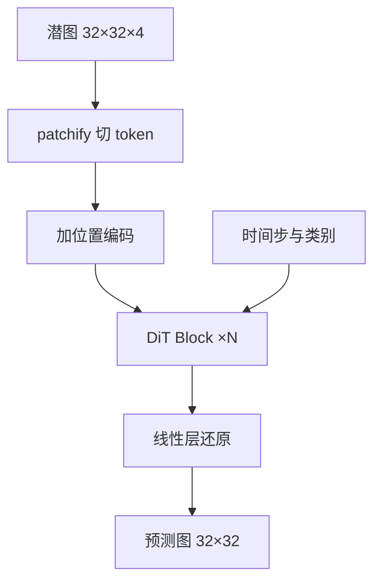

# DiT

一句话:DiT(Diffusion Transformer)把扩散模型里那个卷积 U-Net 骨干整个换成 Transformer——潜空间特征切成 patch 当 token,时间步和类别用 adaLN-Zero 灌进每一层;换来的是一条干净的 scaling 曲线,算力堆上去,生成质量就跟着涨。

本篇只讲**骨干网络这一环**。加噪去噪与采样器见 Diffusion 篇,流匹配那一层的训练目标见 FlowMatching 篇,把图像压进潜空间的编解码器见 VAE 篇。这是**互相正交的三层**,换骨干不影响另外两层怎么选。

## 一、为什么要把 U-Net 换掉

### U-Net 强在哪

扩散骨干的活很单一:吃进带噪的特征图和时间步,吐出一张同样大小的预测图(噪声、$x_0$ 或 $v$,选哪个见 Diffusion 篇)。U-Net 天生适配这种「进出同形」的任务,它带着三条对图像很划算的归纳偏置:

- **局部卷积**:默认相邻像素才相关,一个 3×3 卷积核就把这条先验写死了,不用从数据里学
- **多尺度编解码**:一路下采样把感受野撑大、让网络在低分辨率上决定构图,再一路上采样还原细节
- **长跳连**:把编码侧的高分辨率特征直接接到解码侧对应层,补回下采样丢掉的细节

这三条让 U-Net 在小数据、小算力下收敛得又快又稳,所以它统治了扩散模型的头三年。

### 那问题出在哪

DiT 的出发点不是「Transformer 画得更好看」,而是一个更工程的问题:**扩散模型的质量,能不能被算力单调地预测?** U-Net 在这件事上不好用:

1. **它没有一个单调旋钮**。想把 U-Net 放大,你得同时决定每个分辨率级放几个残差块、通道数怎么倍增、在哪几级插注意力、注意力头开多少——这些选择互相耦合,加了算力不一定换来质量,试错成本很高。
2. **归纳偏置是一把双刃剑**。偏置省的是数据和算力;当数据和算力都管够时,这笔省下来的钱就不值得再拿架构自由度去换了。这是 ViT 在图像分类上已经验证过一遍的剧本。
3. **多尺度结构和「序列」这个抽象对不上**。序列建模这几年被大语言模型推得最狠,U-Net 一样都吃不到。

DiT 给出的结论是一句很硬的话:**U-Net 的归纳偏置不是扩散模型成功的必要条件**。把它整个换成一摞标准 Transformer block,质量不掉,而且第一次得到了一条「Gflops 越高、FID 越低」的干净曲线。同期还有另一条折中路线 U-ViT,把 Transformer 和长跳连缝在一起;DiT 这条更彻底,后来也走得更远。

## 二、patchify:把潜图变成 token 序列

Transformer 只吃序列,所以第一步要把二维特征图拍平。

DiT 的输入不是像素,是 VAE 编码出的潜图:一张 $256\times256$ 的图经过 8 倍下采样的 VAE,变成 $32\times32\times4$(为什么先压潜空间见 VAE 篇)。patchify 的动作是:按 $p\times p$ 切格子,每格连同通道一起拉平成一个向量,过一个线性层投影到隐藏维 $d$,就是一个 token。

$$
T = \left(\frac{I}{p}\right)^2
$$

$I$ 是潜图边长、$p$ 是 patch 边长,$T$ 是序列长度。读法:**patch 边长减半,token 数变 4 倍**。

| patch size $p$ | token 网格 | 序列长度 $T$ |
|---|---|---|
| 2 | 16×16 | 256 |
| 4 | 8×8 | 64 |
| 8 | 4×4 | 16 |

### patch size 是一个纯算力旋钮

这是本节最该记住的一条:**改 $p$ 几乎不改参数量**。patchify 只是入口处的一个线性层,换 $p$ 只换这一层的输入维度($p^2C$),后面几十个 Transformer block 一个参数都没动。但算力变化很大:

- 逐 token 的部分(QKV 投影、FFN)与 $T$ **线性**相关 → $p$ 减半,算力 ×4
- 注意力矩阵那部分与 $T^2$ 相关 → $p$ 减半,这一项 ×16

所以 DiT-XL/2($p=2$)是这一族里最贵的配置,单次前向 118.64 Gflops。反过来说,$p$ 提供了一个「不动参数、只加算力」的实验变量——这正是 DiT 用 Gflops 而不是参数量作 scaling 横轴的原因,第四节展开。

### 出口与位置编码

输出端做反向操作:每个 token 过一个线性层输出 $p\times p\times 2C$ 个数,再拼回 $32\times32$ 的图。之所以是 $2C$ 而不是 $C$,是因为 DiT 沿用了 ADM 的做法,同时预测噪声和逐通道的对角方差。



有一个坑必须提:**patch 一打散,token 之间的空间关系就没了,全靠位置编码找回来**。DiT 用的是固定的二维正弦位置编码。这条直接决定了「换分辨率」的代价——潜图边长一变,token 网格尺寸跟着变,位置编码要插值或外推,序列长度也变了。卷积吃任意尺寸是白吃的,Transformer 这里要额外花钱(具体手段见 任意分辨率与高分辨率 篇)。

## 三、条件注入:adaLN 与 adaLN-Zero

### 条件长什么样

扩散骨干至少要知道**时间步 $t$**,否则它不知道当前这张图脏到什么程度、该擦多狠。类条件模型还要知道类别 $y$。这两样的共同点是:**都能压成一个全局向量**。$t$ 走正弦嵌入加一个小 MLP,$y$ 查一张嵌入表,两者相加得到条件向量 $c$。

### adaLN:让条件去调制归一化层

标准 LayerNorm 里的缩放 $\gamma$ 和平移 $\beta$ 是学出来的固定参数,对所有样本一视同仁。adaLN(adaptive LayerNorm)把它们改成条件的函数:

$$
\mathrm{adaLN}(h, c) = \gamma(c) \odot \frac{h - \mu}{\sigma} + \beta(c)
$$

人话:先按老规矩把特征标准化,再让条件决定**每个通道放大多少、平移多少**。这就是 FiLM 那套逐通道调制搬到 LayerNorm 上(FiLM 与 AdaIN 的横向区分见 条件控制 篇)。

**为什么这个位置特别适合放全局条件?** 因为归一化本来就把每个通道的尺度信息洗掉了,再由条件重新注回去,等于让条件掌管「这一层该用多大力气、什么风格」;而且它**不占任何序列长度**,算力开销几乎为零。

### adaLN-Zero:再加一个从零打开的门

DiT 在 adaLN 之上又加了一层:给每个残差分支配一个同样由条件生成的门控 $\alpha$。

$$
h \leftarrow h + \alpha(c) \odot \mathrm{Attn}\big(\mathrm{adaLN}(h, c)\big)
$$

意思是:注意力分支算完之后,先乘上一个由条件决定的系数再加回主干。关键在于**这个条件 MLP 的最后一层权重和偏置全部零初始化**,所以训练第一步 $\alpha = 0$,整个 DiT block 退化成恒等映射 $h \to h$。论文的原话是:把 MLP 初始化成对所有 $\alpha$ 输出零向量,这就把整个 DiT block 初始化成了恒等函数。

```python
# 一个 DiT block 的前向;c 是「时间步嵌入 + 类别嵌入」相加得到的全局条件向量
def dit_block(h, c):
    # 一次 MLP 出 6 组调制量,该 MLP 的末层权重与偏置全部零初始化
    s1, b1, a1, s2, b2, a2 = cond_mlp(c).chunk(6, dim=-1)

    # 注意力分支:无参数 LayerNorm 之后,由条件做缩放和平移
    # 写成 (1 + s) 是为了让 s=0 时 adaLN 本身也是恒等
    x = layernorm(h) * (1 + s1) + b1
    h = h + a1 * attention(x)        # a1 初始为 0,这一支起步时不生效

    # MLP 分支同理,复用同一个条件向量
    x = layernorm(h) * (1 + s2) + b2
    h = h + a2 * feedforward(x)      # a2 初始为 0
    return h
```

**为什么零初始化这么关键?** 三层理由:

1. **给深网络一个干净的起点**。一个二十多层的 Transformer 随机初始化时,每层残差分支都往主干上叠一份随机噪声,层数一深信号就被搅乱,早期梯度方向基本是噪声。从恒等出发意味着先把主干信号通路打通,再由梯度决定哪一层该睁眼、睁多大。
2. **把「要不要用这一层」变成可学的连续量**,而不是一上来就强行全开。
3. **这是一类通用手法,不是 DiT 独有的**。ControlNet 的零卷积、LoRA 把 $B$ 初始化为零、ResNet 把残差块最后一个归一化的 $\gamma$ 置零,全是同一招:**让新加的模块从恒等开始,不破坏已经通的信号路径**。面试问到这条,能横向举例比只答 DiT 加分。

代价在参数量上:每个 block 要 6 组调制量(注意力和 MLP 各一份 $\gamma$、$\beta$、$\alpha$),条件 MLP 是 $d \to 6d$,按层算多出约 $6d^2$ 参数,和一层注意力的投影矩阵同量级。所以准确的说法是:**adaLN-Zero 省的是算力和序列长度,不是参数量**。

### DiT 试过的四种条件注入方式

| 变体 | 条件怎么进来 | 额外算力 | 论文结论 |
|---|---|---|---|
| in-context | 把 $t$、$y$ 当两个额外 token 拼进序列 | 几乎为零,序列只长 2 | 四种里最差 |
| cross-attention | 每个 block 加一层交叉注意力,条件作 K/V | **最贵,约 15% Gflops 开销** | 好于 in-context,不如 adaLN 系 |
| adaLN | 条件生成 $\gamma$、$\beta$ 调制两处 LayerNorm | 最省 | 明显优于前两者 |
| adaLN-Zero | adaLN 再加零初始化的残差门控 $\alpha$ | 与 adaLN 同量级 | **FID 最低,同时算力最省** |

论文的结论句是:adaLN-Zero block 的 FID 低于 cross-attention 和 in-context,同时是最省算力的一种。

### 这个结论有适用范围,别直接搬到文生图

DiT 的实验条件只有**时间步加一个 1000 类的类别标签**——本来就是能压进单个向量的全局量。文本提示是**变长序列**,压成一个向量等于把逐词信息丢光。所以后来的文生图模型没有一个只靠 adaLN:

- **PixArt-α** 保留 cross-attention 读文本,只让 adaLN 管时间步,并把调制参数在层间共享以省参数
- **SD3 那一代的 MMDiT** 干脆让图像 token 和文本 token 各带一套权重、在同一个注意力里互相看,相当于把 in-context 和 cross-attention 揉在一起

一句话:**adaLN-Zero 赢的是全局标量条件这条赛道,不是所有条件**。按条件形态选注入方式,见 条件控制 篇;空间对齐类条件(边缘、深度、姿态)也在那篇。

## 四、scaling 行为与骨干选型

### 四档配置与两个旋钮

DiT 的规模阶梯直接沿用 ViT 的命名:

| 配置 | 层数 | 隐藏维 | 头数 | $p=2$ 时的 Gflops |
|---|---|---|---|---|
| DiT-S | 12 | 384 | 6 | 6.06 |
| DiT-B | 12 | 768 | 12 | 23.01 |
| DiT-L | 24 | 1024 | 16 | 80.71 |
| DiT-XL | 28 | 1152 | 16 | 118.64 |

论文摘要给的结论是:**Gflops 越高、FID 越低,不管这份算力是靠加深加宽拿到的,还是靠减小 patch 增加 token 数拿到的**。两个旋钮落在同一条曲线上,这才是「干净的 scaling」的含义——你不需要知道算力花在哪,只要知道花了多少。

**为什么横轴必须是 Gflops 而不是参数量?** 因为减小 patch 几乎不增参数却大幅增算力(第二节)。用参数量作横轴,同一个模型的三种 patch 配置会全部叠在同一个点上,曲线直接散掉。

最大的 DiT-XL/2 在 class-conditional ImageNet $256\times256$ 上取得 FID 2.27,当时超过所有先前的扩散模型;$512\times512$ 上同样最好。一条实践推论顺带出来:**同样的训练算力预算,花在更大的模型上比花在更多训练步数上更划算**,小模型训久了追不上大模型。

> 🖼️ 占位:DiT 的 scaling 图——横轴累计训练 Gflops、纵轴 FID,四档规模 × 三种 patch size 的点落在同一条下降趋势上

### 和 U-Net 骨干比,差在哪

| 维度 | U-Net 骨干 | Transformer 骨干(DiT) |
|---|---|---|
| 归纳偏置 | 局部性加多尺度,天然贴合图像 | 几乎没有,靠位置编码和数据补 |
| 小数据小算力 | 占便宜,收敛快 | 吃亏 |
| 放大的旋钮 | 每级块数、通道倍率、注意力放在哪级,互相耦合 | 层数、宽度、patch 三个旋钮基本正交 |
| 感受野 | 靠下采样一层层攒 | 第一层就是全局 |
| 换分辨率 | 卷积吃任意尺寸,基本白给 | 序列长度和位置编码都要处理 |
| 高分辨率算力 | 多尺度天然摊薄 | 注意力随 token 数平方增长 |
| 工程复用 | 自成一套 | 直接吃序列建模那一整套优化 |

### 为什么主流换到了 Transformer 骨干

截至 2026 年 9 月,新发布的文生图与文生视频基座几乎都是 Transformer 骨干。四条原因,按重要性排:

1. **scaling 可预测**。商业训练最怕的是钱花下去不知道换不换得来质量;DiT 把这件事变成一条能外推的曲线。
2. **序列这个抽象能一路复用**。图像是 patch token;视频只是把 patch 沿时间再切一刀,序列变长而已,骨干代码不用重写。U-Net 想扩到视频就得重新设计三维卷积和时间层。时空这一层的具体做法见 时空注意力 篇,整体架构选型见 视频扩散架构 篇。
3. **多模态天然能拼**。文本 token 和图像 token 进同一个注意力就行,这是 MMDiT 那条路的前提。
4. **工程红利**。FlashAttention、序列并行、变长打包这些为大语言模型做的优化,DiT 直接继承(通用机制见 Transformer整体架构 篇、注意力基础 篇)。

代价也要说清:**没有多尺度结构兜底,高分辨率下的账全压在注意力上**——序列长度平方增长这条,在视频侧尤其疼。所以实际系统里通常还得叠上更强的潜空间压缩、窗口或分解注意力。

> 🖼️ 占位:同一张潜图在 U-Net 与 DiT 两种骨干下的数据流对比示意,标出多尺度层级与等长 token 序列的差别

## 五、面试考点串联

| 高频问法 | 本文哪一节 |
| --- | --- |
| DiT 里 cross-attention 和 adaLN 各适合什么条件? | 三(四变体表与适用范围);多条件横向选型见 条件控制 篇 |
| 扩散模型为什么要把 U-Net 换成 Transformer?换完好在哪、差在哪?(补充题) | 一、四 |
| patchify 是怎么把潜图变成 token 的?patch size 调大调小分别影响什么?(补充题) | 二 |
| DiT 的 scaling 结论为什么用 Gflops 当横轴而不是参数量?(补充题) | 二(patch 不改参数)、四 |
| adaLN 是怎么把条件注进去的?为什么它特别适合时间步?(补充题) | 三 |
| adaLN-Zero 里那个「零初始化」到底零了什么?去掉会怎样?(补充题) | 三 |
| 让新模块从恒等开始这一招,你还在哪儿见过?(补充题) | 三(零卷积、LoRA 的 $B$、残差块末位归一化) |
| 论文说 adaLN-Zero 最好,那文生图模型为什么还留着 cross-attention?(补充题) | 三(结论的适用范围) |
| 同样的训练算力,是训久一点还是把模型做大?(补充题) | 四 |
| 换成 Transformer 骨干后,原来 U-Net 靠多尺度做的事谁来做?(补充题) | 一、四(代价那一段) |
| 视频生成为什么普遍走 DiT 而不是三维 U-Net?(补充题) | 四(序列抽象);时空建模那一层见 时空注意力 篇 |
| DiT 换个输入分辨率,哪些东西必须跟着改?(补充题) | 二(序列长度与位置编码) |

## 相关文献

- Scalable Diffusion Models with Transformers(DiT 原论文)— [arXiv:2212.09748](https://arxiv.org/abs/2212.09748)
- An Image is Worth 16x16 Words: Transformers for Image Recognition at Scale(ViT,patchify 与 S/B/L/XL 阶梯的来源)— [arXiv:2010.11929](https://arxiv.org/abs/2010.11929)
- U-Net: Convolutional Networks for Biomedical Image Segmentation(被替换掉的那个骨干)— [arXiv:1505.04597](https://arxiv.org/abs/1505.04597)
- High-Resolution Image Synthesis with Latent Diffusion Models(DiT 所处的潜空间设定)— [arXiv:2112.10752](https://arxiv.org/abs/2112.10752)
- Diffusion Models Beat GANs on Image Synthesis(ADM:被对标的 U-Net 基线,可学方差的来源)— [arXiv:2105.05233](https://arxiv.org/abs/2105.05233)
- All are Worth Words: A ViT Backbone for Diffusion Models(U-ViT:同期保留长跳连的折中路线)— [arXiv:2209.12152](https://arxiv.org/abs/2209.12152)
- FiLM: Visual Reasoning with a General Conditioning Layer(逐通道调制的来源)— [arXiv:1709.07871](https://arxiv.org/abs/1709.07871)
- PixArt-α: Fast Training of Diffusion Transformer for Photorealistic Text-to-Image Synthesis — [arXiv:2310.00426](https://arxiv.org/abs/2310.00426)
- Scaling Rectified Flow Transformers for High-Resolution Image Synthesis(SD3 与 MMDiT)— [arXiv:2403.03206](https://arxiv.org/abs/2403.03206)
