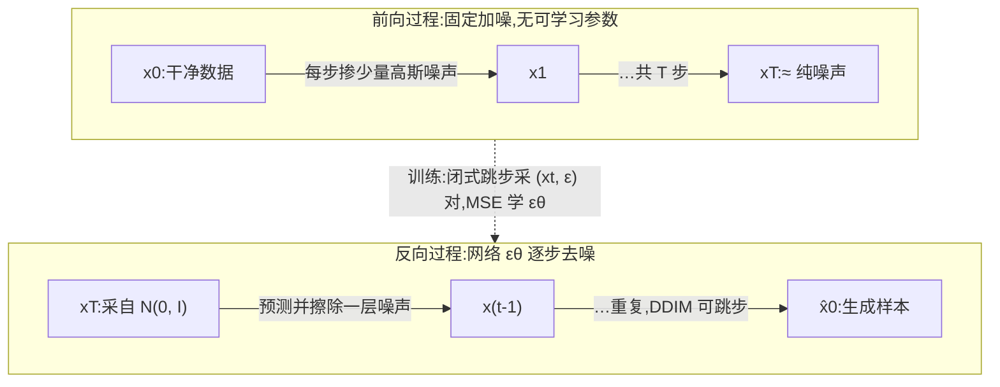

# Diffusion(扩散模型)

> ⚠️ 旧版:本篇写于写作契约确立之前,尚未按新标准审查重写。标准见 docs/05-知识库写作契约.md,样板见「GPU架构与执行模型」。

一句话:**把「生成」变成「去噪」**——前向过程按固定规则把数据一步步加噪成纯高斯噪声(无需学习),模型只学一件事:逆着把噪声一步步擦回去。学成之后从纯噪声出发反复去噪,就能采样出服从数据分布的新样本。这是当今图像/视频生成(Stable Diffusion、Sora 一系)的基石。

## 一、前向过程:墨水滴入清水

类比:一滴墨水(数据)滴进清水,分子随机碰撞让它逐渐散开,最终整杯水均匀浑浊(纯噪声)。前向过程就是人为执行这场「扩散」:每一步往数据里掺一点高斯噪声,构成一条马尔可夫链:

$$
q(x_t \mid x_{t-1}) = \mathcal{N}\!\left(x_t;\ \sqrt{1-\beta_t}\, x_{t-1},\ \beta_t I\right)
$$

- $\beta_t \in (0,1)$:第 $t$ 步的加噪强度,$t$ 从 1 走到 $T$(DDPM 经典设定 $T=1000$);
- $\sqrt{1-\beta_t}$ 先把旧信号缩小一点、再叠上方差为 $\beta_t$ 的新噪声——两者配平,整条链方差不爆炸(方差保持,VP);
- $T$ 足够大时,$x_T$ 与标准高斯 $\mathcal{N}(0, I)$ 几乎不可区分,原始信息被彻底洗掉。

高斯套高斯仍是高斯,逐步递推可合并成**闭式跳步公式**(面试要求默写):记 $\alpha_t = 1-\beta_t$、$\bar{\alpha}_t = \prod_{s=1}^{t}\alpha_s$,则

$$
x_t = \sqrt{\bar{\alpha}_t}\, x_0 + \sqrt{1-\bar{\alpha}_t}\,\epsilon, \qquad \epsilon \sim \mathcal{N}(0, I)
$$

不必逐步模拟:任取时刻 $t$,一次采样即可从 $x_0$ 直达 $x_t$。$\bar{\alpha}_t$ 单调递减,可读作「第 $t$ 步还剩多少原始信号」。训练正是靠它对每个样本**随机抽一个 $t$ 并行监督**,而不用走完整条链。

**噪声调度(schedule)**决定加噪节奏:

- **linear**:$\beta_t$ 线性增大(DDPM 原设定),简单,但后段信号毁得过快,不少步数在近似纯噪声里空转;
- **cosine**:让 $\bar{\alpha}_t$ 沿余弦曲线平滑下降(Improved DDPM 提出),破坏节奏更均匀,中低分辨率上明显更好。

> 🖼️ 占位:linear 与 cosine 调度下 $\bar{\alpha}_t$ 随 $t$ 衰减的对比曲线(cosine 更平缓)

## 二、反向过程与训练目标:学会擦噪声

生成 = 倒放这场扩散,学 $p_\theta(x_{t-1} \mid x_t)$。关键性质:**步长足够小时,逆向条件分布同样近似高斯**,于是网络每步只需预测一个高斯的均值(方差常取固定)。类比:把水变浑的录像带一帧帧倒放,每帧只擦薄薄一层,难度被 $T$ 步摊薄。

按变分下界(ELBO)展开对数似然,核心项是让 $p_\theta$ 对齐真后验 $q(x_{t-1} \mid x_t, x_0)$(条件在 $x_0$ 上时有高斯闭式),各项 KL 均可解析计算;DDPM 再把逐项加权系数干脆丢掉,化简成朴素到出人意料的目标:

$$
\mathcal{L}_{simple} = \mathbb{E}_{t,\, x_0,\, \epsilon}\left[\left\| \epsilon - \epsilon_\theta(x_t,\ t) \right\|^2\right]
$$

训练循环:抽样本 $x_0$、抽时刻 $t$、抽噪声 $\epsilon$ → 用闭式跳步合成 $x_t$ → 让网络看着脏图和时刻 $t$(正弦时间嵌入注入),**猜出当初掺进去的那份噪声**,做 MSE。整套训练本质是超大规模的「看图猜噪声」监督学习,没有对抗、没有 rollout,稳定性远好于 GAN。

### 三种参数化

网络具体回归什么,有三种可经闭式互换的选择:

| 参数化 | 预测目标 | 直觉 | 取舍 |
| --- | --- | --- | --- |
| $\epsilon$-prediction | 掺入的噪声 | 猜「噪声底片」 | DDPM 默认;低噪声端信号稳,但高噪声端换算回 $x_0$ 要除以 $\sqrt{\bar{\alpha}_t}\approx 0$,误差被放大 |
| $x_0$-prediction | 干净数据 | 直接猜原图 | 高噪声端稳(猜个大概均值即可);低噪声端输出 ≈ 输入,浪费容量 |
| $v$-prediction | $v=\sqrt{\bar{\alpha}_t}\,\epsilon-\sqrt{1-\bar{\alpha}_t}\,x_0$ | 前两者的角度插值 | 两端都不退化;蒸馏与零终端 SNR 场景标配 |

### 与 score matching 的联系

对闭式跳步取对数梯度:$\nabla_{x_t}\log q(x_t \mid x_0) = -\epsilon/\sqrt{1-\bar{\alpha}_t}$,即**预测噪声 ≈ 预测负 score**(只差一个缩放)。score 是「往数据密度更高处走」的指南针,擦噪声就是沿着它回家。Score-Based SDE 进一步统一:前向加噪是一条 SDE,反向存在对应的逆 SDE 与概率流 ODE,DDPM/DDIM 都是它的不同离散化——这也是扩散通往 Flow Matching 的桥(见第七节)。

### 训练细节与常见坑

- **EMA 权重**:采样一律用指数滑动平均后的权重,用原始权重出图质量明显更差;
- **损失加权**:不同 $t$ 的 MSE 量级差异大,均匀加权会让个别噪声段主导训练,min-SNR 等重加权收敛更快;
- **零终端 SNR**:常见调度在 $t=T$ 处 $\bar{\alpha}_T \neq 0$,训练从未见过纯噪声、推理却从纯噪声起步,train/test 不一致会伤亮度与构图;修法是把终端 SNR 拉到 0 并改用 v-prediction;
- **分辨率变了调度要跟着变**:分辨率越高信息冗余越大,同等噪声「毁容」程度越轻,需整体加重加噪(schedule shift),是高分辨率训练的标准操作。

## 三、采样:从 1000 步到几步

**DDPM 祖先采样**:严格沿马尔可夫链倒放,每步网络前向一次、再注入新随机噪声:

$$
x_{t-1} = \frac{1}{\sqrt{\alpha_t}}\left(x_t - \frac{\beta_t}{\sqrt{1-\bar{\alpha}_t}}\,\epsilon_\theta(x_t, t)\right) + \sigma_t z, \qquad z \sim \mathcal{N}(0, I)
$$

读法:按预测的噪声把 $x_t$ 擦干净一小步,再补一点随机扰动。$T=1000$ 次前向,一张图分钟级——太慢。

**DDIM**:关键观察是训练目标只依赖边缘分布 $q(x_t \mid x_0)$(闭式跳步),与链条具体怎么走无关,因此可换一族**非马尔可夫**过程,免重训复用同一个 $\epsilon_\theta$。每步先估出终点、再重新瞄准:

$$
x_{t-1} = \sqrt{\bar{\alpha}_{t-1}}\,\hat{x}_0 + \sqrt{1-\bar{\alpha}_{t-1}}\,\epsilon_\theta(x_t, t), \qquad \hat{x}_0 = \frac{x_t - \sqrt{1-\bar{\alpha}_t}\,\epsilon_\theta(x_t, t)}{\sqrt{\bar{\alpha}_t}}
$$

更新式里只出现 $\bar{\alpha}$、不含相邻步的 $\beta_t$,把 $t-1$ 换成任意更早的 $t'$ 依然成立——**这就是能跳步的原因**(1000 步压到 20–50 步)。类比:DDPM 是每站都停的慢车,DDIM 是只停大站的直达车,共用同一条轨道(边缘分布)。

上式不含随机项、全程**确定性**:同一个 $x_T$ 永远生成同一张图;反向运行还能把真实图片编码回噪声(DDIM inversion),是一大类图像编辑方法的基础。

| 维度 | DDPM 祖先采样 | DDIM |
| --- | --- | --- |
| 链条 | 马尔可夫,每步注入新噪声 | 非马尔可夫,可全程确定性 |
| 步数 | ~1000 | 20–50(任意跳步) |
| 固定 $x_T$ 重采 | 每次不同 | 每次相同(可逆 → 支持编辑) |
| 是否重训 | — | 不需要,复用同一 $\epsilon_\theta$ |

**更高阶 solver**:把采样彻底看成解概率流 ODE,用为扩散定制的高阶数值积分器(DPM-Solver 等)可压到 10 步量级——同一个模型,换更聪明的积分器。

## 四、引导:让生成听话(CFG)

无条件模型只会「随便画」;条件生成要「照题作画」,还要能调贴合程度。

**Classifier guidance**:额外训练一个能看懂加噪图像的分类器 $p_\phi(y \mid x_t)$,采样时把 $\nabla_{x_t}\log p_\phi(y \mid x_t)$ 加进 score,把样本往「更像类别 $y$」的方向推。缺点:要多训一个模型,且高噪声下分类器梯度又吵又弱。

**CFG(classifier-free guidance,当前默认)**:训练时以小概率(约 10%)把条件 $c$ 置空,让**同一个网络**同时学会条件与无条件两种预测;推理时对两者之差做外推:

$$
\hat{\epsilon} = \epsilon_\theta(x_t, \varnothing) + w\left[\epsilon_\theta(x_t, c) - \epsilon_\theta(x_t, \varnothing)\right]
$$

类比:$\epsilon_c - \epsilon_\varnothing$ 是「条件所指的方向」,$w$ 是把提示词音量拧大的旋钮。$w=1$ 退回普通条件生成;$w$ 越大越贴题、单图质量越高,但**多样性随之下降**,过大还会过饱和、出伪影——经典的质量–多样性权衡,文生图常用 5–8。代价:每步要前向两次(条件 + 无条件)。工程小知识:negative prompt 就是把无条件分支的空条件换成「不想要的描述」。

## 五、潜空间与骨干:LDM 与 DiT

**LDM / Stable Diffusion**:在 $512 \times 512 \times 3$ 的像素空间逐步去噪太贵。LDM 先训一个 VAE 把图像压约 8 倍到潜空间(如 $64 \times 64 \times 4$),扩散只在潜空间进行,出图后由 VAE decoder 还原像素。类比:在小草稿纸上构图,放大誊清交给专职誊写员——感知上无关的高频细节不值得让扩散模型操心。算力直降约**两个数量级**,是扩散能在消费级显卡上跑起来(Stable Diffusion 开源爆发)的关键。代价:生成上限受 VAE 重建质量约束(小字、手指等细节问题的一个来源)。

**骨干从 U-Net 到 DiT**:DDPM 时代标配是带注意力的 U-Net;DiT 把潜空间特征切成 patch 序列交给标准 Transformer,并验证扩散骨干同样**遵循 scaling laws**——算力堆上去,FID 可预期地单调下降。

| 维度 | U-Net | DiT |
| --- | --- | --- |
| 结构 | 多尺度卷积 + skip 连接 | patchify + 标准 Transformer 堆叠 |
| 条件注入 | 时间嵌入相加、cross-attention | adaLN-Zero |
| 扩展性 | scaling 规律不明晰 | 明确遵循 scaling laws |
| 代表 | DDPM、SD 1.x/2.x | SD3、Sora 一系视频模型 |

**adaLN 一句**:时间步与条件嵌入经小 MLP 回归出每层 LayerNorm 的缩放/平移及残差门控(adaLN-Zero 初始化为恒等),比把条件拼进 token 序列更稳更省,是 DiT 的默认条件注入方式。视频生成把时空一起切 patch,同一套 DiT 配方直接放大——这正是骨干 Transformer 化的红利。

## 六、全流程一张图

前向只在训练期用来造监督样本;推理期只跑反向,从纯噪声起步。

## 七、与语言模型的碰撞

- **扩散语言模型(离散扩散)**:把「加高斯噪声」换成对 token 的 mask/随机替换,生成即多轮并行「填空还原全文」,换来并行解码与天然双向上下文,是自回归之外被认真押注的路线;
- **多模态分工**:当前主流格局——文本与理解走自回归(逐 token 因果生成),图像/视频等连续信号的生成走扩散(整体迭代细化);统一模型的常见做法是 AR 主干产出语义条件,扩散头负责「渲染」成像素;
- **与 Flow Matching 的关系**:Flow Matching 把弯曲的去噪轨迹换成噪声与数据间的直线插值,目标更简单、少步采样更稳,SD3/Flux 等新一代模型已切换;在概率流 ODE 视角下两者同源,细节见 FlowMatching 篇(本篇姊妹篇)。

## 八、面试考点串联

1. 默写前向单步与闭式跳步公式,解释 $\bar{\alpha}_t$ 含义 →「一、前向过程」
2. 为什么目标是预测噪声?ε/x0/v 三种参数化怎么选 →「二、三种参数化」
3. 预测噪声与 score 的关系 →「二、与 score matching 的联系」
4. DDIM 为什么不重训就能跳步?确定性带来什么(inversion/编辑)→「三、采样」
5. 默写 CFG 公式;训练怎么配合;$w$ 调大调小各发生什么 →「四、引导」
6. LDM 为什么快约两个数量级?代价是什么 →「五、潜空间与骨干」
7. 骨干为何从 U-Net 换成 DiT、adaLN 是什么 →「五、潜空间与骨干」
8. 图像生成用扩散、文本用自回归的原因?与 Flow Matching 的关系 →「七、与语言模型的碰撞」

## 相关文献

- DDPM(简单损失与 ε-prediction 奠基)— [arXiv:2006.11239](https://arxiv.org/abs/2006.11239)
- DDIM(非马尔可夫确定性采样、跳步与 inversion)— [arXiv:2010.02502](https://arxiv.org/abs/2010.02502)
- Score-Based Generative Modeling through SDEs(SDE/概率流 ODE 统一视角)— [arXiv:2011.13456](https://arxiv.org/abs/2011.13456)
- Classifier-Free Diffusion Guidance(CFG)— [arXiv:2207.12598](https://arxiv.org/abs/2207.12598)
- LDM / Stable Diffusion(潜空间扩散)— [arXiv:2112.10752](https://arxiv.org/abs/2112.10752)
- DiT(Scalable Diffusion Models with Transformers)— [arXiv:2212.09748](https://arxiv.org/abs/2212.09748)
- DPM-Solver(扩散定制的高阶 ODE 求解器,约 10 步采样)— [arXiv:2206.00927](https://arxiv.org/abs/2206.00927)
