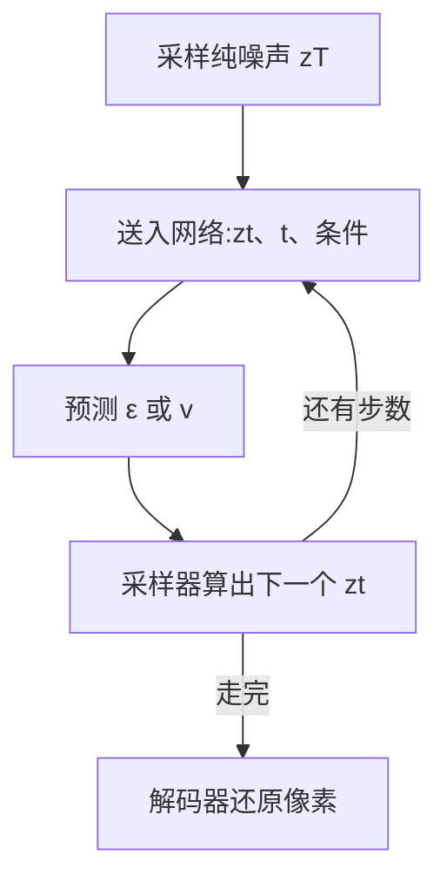

# Diffusion(扩散模型)

一句话:扩散模型把「生成」这件难事换成了「去噪」这件容易事——先用一套**固定的、不用学的**规则把干净数据搅成纯高斯噪声,再训一个网络专门做逆运算;推理时从随机噪声出发反复擦,擦出一张新样本。

## 一、把生成变成去噪:前向过程与噪声调度

### 为什么要绕这一圈

直接学一个 512×512 图像的分布很难,因为它有二十多万维、高度多峰,让网络一次输出就得同时搞定构图、结构和纹理。扩散的做法是**把这道难题切成上千道小题**:每一步只要求网络把图变干净一点点,难度被步数摊薄了。代价也很直白——推理要跑上百次网络,这是扩散慢的根源,后面第三、五节专门算这笔账。

> **类比**:一滴墨水滴进清水,分子乱撞让它散开,最后整杯均匀浑浊。前向过程就是人为地执行这场扩散,生成则是把这段录像倒着放。

### 前向:固定加噪,一个参数都不用学

每一步往数据里掺一点高斯噪声,构成一条马尔可夫链:

$$
q(x_t \mid x_{t-1}) = \mathcal{N}\!\left(x_t;\ \sqrt{1-\beta_t}\, x_{t-1},\ \beta_t I\right)
$$

这行的意思是:先把上一步的信号按 $\sqrt{1-\beta_t}$ 缩小一点点,再叠上方差为 $\beta_t$ 的新噪声。两个系数是配平的,所以整条链的总方差不会越滚越大(术语叫 variance preserving,方差保持)。DDPM 的经典设定是 $T=1000$ 步、$\beta_t$ 从 $10^{-4}$ 线性涨到 $0.02$。

**这半边一个可学参数都没有**,因为噪声是我们自己按公式掺进去的——掺了多少,我们精确知道。这正是扩散训练稳的根本原因:它把生成问题变成了一道**有标准答案的监督题**,不像 GAN 那样要跟判别器互相追着跑。

高斯套高斯还是高斯,所以把前 $t$ 步递推合并能得到一个**闭式跳步公式**。记 $\alpha_t = 1-\beta_t$、$\bar{\alpha}_t = \prod_{s \le t}\alpha_s$:

$$
x_t = \sqrt{\bar{\alpha}_t}\, x_0 + \sqrt{1-\bar{\alpha}_t}\,\epsilon, \qquad \epsilon \sim \mathcal{N}(0, I)
$$

读法:任意时刻 $t$ 的脏图 = 缩小后的原图 + 一份噪声,一次采样直达,**不用真的走 $t$ 步**。$\bar{\alpha}_t$ 可以读成「第 $t$ 步还剩多少原始信号」,从 1 单调掉到接近 0。

这个公式的工程意义比它的数学意义大得多:训练时每个样本**随机抽一个 $t$** 就能直接合成训练对,一个 batch 里不同样本可以处在完全不同的噪声档位,**全部并行**。如果没有它,训练一个样本就得模拟 1000 步链条,这条路线根本跑不起来。

### 噪声调度:节奏没排好会白白浪费步数

调度(schedule)决定 $\bar{\alpha}_t$ 掉得多快,也就是「什么时候把信号毁掉」。

| 调度 | 做法 | 问题 / 收益 |
|---|---|---|
| linear(DDPM 原设定) | $\beta_t$ 线性增大 | Improved DDPM 指出:**最后四分之一的中间态几乎已是纯噪声**,这段时间网络在空转 |
| cosine(Improved DDPM) | 让 $\bar{\alpha}_t$ 沿余弦曲线平滑下降 | 信息破坏得更均匀,中低分辨率上明显更好 |

有多浪费?Improved DDPM 直接量过:用 linear 调度训出来的模型,**反向过程跳过前 20% 也几乎不掉 FID**——说明这 200 步基本没干活。因为 linear 在高噪声端毁得太狠,网络在那里除了「输出一个大概的均值」没别的可学。

还有一条工程上必须知道的:**分辨率变了,调度要跟着变**。因为分辨率越高,相邻像素越冗余,同样强度的噪声「毁容」效果越弱——1024×1024 上加到看不清的噪声量,放到 256×256 上早就糊成一片了。所以高分辨率训练要整体加重加噪(常叫 schedule shift),否则模型在高噪声端见不到真正的难样本。

> 🖼️ 占位:linear 与 cosine 调度下 $\bar{\alpha}_t$ 随 $t$ 衰减的对比曲线,标出 linear 末段贴近 0 的那一段

## 二、反向过程:为什么训练目标是「猜噪声」

生成就是倒放这场扩散,要学的是 $p_\theta(x_{t-1} \mid x_t)$。这里有一个关键性质撑着整套方法:**只要单步足够小,反向的条件分布也近似是高斯**。因为步子小,一步之内数据可能的去向被限制在很窄的范围里,用一个高斯就够描述。于是网络每步只需要吐出这个高斯的均值,方差 DDPM 干脆固定成常数——论文试过让它可学,结果训练不稳、样本更差。

按变分下界展开对数似然,各项都是可解析计算的 KL;DDPM 再把各项前面的加权系数**整个丢掉**,得到一个朴素得出人意料的目标:

$$
\mathcal{L}_{\text{simple}} = \mathbb{E}_{t,\, x_0,\, \epsilon}\left[\left\| \epsilon - \epsilon_\theta(x_t,\ t) \right\|^2\right]
$$

翻译成人话:随机抽一张图、抽一个时刻 $t$、抽一份噪声,用跳步公式合成脏图 $x_t$,让网络看着脏图和 $t$ **把当初掺进去的那份噪声猜出来**,做 MSE。就这么简单。

**为什么丢掉加权反而更好?** 因为原始加权会让极小 $t$(几乎干净的图)那些项主导损失,而那一段对最终画质贡献很小;去掉加权相当于把权重挪给中高噪声段,那里才是决定构图的地方。这是个经验结论,论文自报能明显改善样本质量。

**为什么是猜噪声而不是别的?** 一个漂亮的对应:对跳步公式取对数梯度可得 $\nabla_{x_t}\log q(x_t \mid x_0) = -\epsilon / \sqrt{1-\bar{\alpha}_t}$。也就是说**预测噪声 ≈ 预测负 score**,只差一个缩放。score 是「往数据密度更高的方向走」的指南针,擦噪声就是沿着指南针回家。Score-Based SDE 那篇把这件事推到底:前向加噪是一条 SDE,反向有对应的逆 SDE 和一条确定性的概率流 ODE,DDPM/DDIM 只是它的不同离散化。

### ε / x₀ / v:三种参数化怎么选

网络到底回归什么,有三个可以互相闭式换算的选择——**换的不是模型能力,是数值稳定性**。

| 参数化 | 网络输出 | 什么时候不稳 | 典型用处 |
|---|---|---|---|
| $\epsilon$-prediction | 掺进去的噪声 | **高噪声端**:换算回 $x_0$ 要除以 $\sqrt{\bar{\alpha}_t}\approx 0$,误差被放大 | DDPM/SD 1.x 默认 |
| $x_0$-prediction | 干净数据本身 | **低噪声端**:输入已经几乎是答案,网络退化成复读,浪费容量 | 少步、高噪声段 |
| $v$-prediction | $v=\sqrt{\bar{\alpha}_t}\,\epsilon-\sqrt{1-\bar{\alpha}_t}\,x_0$ | 两端都不退化 | 蒸馏、少步采样、零终端 SNR |

$v$ 可以理解成前两者的「角度插值」:$t$ 小时它更像 $\epsilon$,$t$ 大时它更像 $-x_0$,所以两头都有信号可学。Progressive Distillation 提出它,正是因为**步数一少,数值误差就藏不住了**——每步跨度大,$\epsilon$ 参数化在高噪声端那个除法会直接把误差炸开。

### 训练里最容易被追问的三个坑

- **EMA 权重**:采样一律用指数滑动平均后的权重。因为损失里 $t$ 是随机抽的,单步梯度噪声很大,瞬时权重在最优点附近来回晃;EMA 把这层抖动平掉,出图质量差别肉眼可见。
- **损失加权**:不同 $t$ 的 MSE 量级差好几倍,均匀取平均会让某个噪声段主导梯度。min-SNR 一类重加权按信噪比给各段配权,收敛更快。
- **零终端 SNR**:常见调度在 $t=T$ 处 $\bar{\alpha}_T$ 并不等于 0,还残留一丝原图信息——于是**模型训练时从没见过纯噪声,推理却偏偏从纯噪声起步**。这个 train/test 错位的后果很具体:模型默认最终图像的均值亮度跟训练集一致,画不出全黑或全白的画面。修法是把终端 SNR 强行拉到 0,并换成 $v$-prediction(因为 $\epsilon$ 参数化在 $\bar{\alpha}_T=0$ 处直接除零)。

## 三、采样:从 1000 步压到 10 步

推理成本的公式很简单:**总耗时 ≈ 每次网络前向的开销 × 网络被调用的次数**。所以提速只有两条路——让每一步更便宜(第五节),或者让步数更少(本节)。

**DDPM 祖先采样**严格沿马尔可夫链倒放,每步都要网络前向一次、再补一点新的随机噪声。$T=1000$ 意味着出一张图要跑 1000 次网络,这是扩散早期完全没法产品化的直接原因。

**DDIM 的关键观察**:训练目标 $\mathcal{L}_{\text{simple}}$ 只依赖边缘分布 $q(x_t \mid x_0)$,也就是那个跳步公式,**和「链条具体怎么一步步走」毫无关系**。既然如此,就可以换一族非马尔可夫的反向过程,只要它的边缘分布对得上——**同一个 $\epsilon_\theta$,不用重训**。DDIM 每步先估出终点、再重新瞄准:

$$
x_{t'} = \sqrt{\bar{\alpha}_{t'}}\,\hat{x}_0 + \sqrt{1-\bar{\alpha}_{t'}}\,\epsilon_\theta(x_t, t)
$$

其中 $\hat{x}_0 = (x_t - \sqrt{1-\bar{\alpha}_t}\,\epsilon_\theta(x_t,t))/\sqrt{\bar{\alpha}_t}$ 是网络当前认为的「干净图长什么样」。注意这个更新式里**只出现 $\bar{\alpha}$,不出现相邻步的 $\beta_t$**,所以 $t'$ 不必是紧挨着的 $t-1$,取任意更早的时刻它照样成立——**这就是能跳步的全部原因**。

> **类比**:DDPM 是每站都停的慢车,DDIM 是只停大站的直达车,两者跑在同一条轨道(同一组边缘分布)上,所以直达车不用重新铺路。

上式里没有随机项,全程**确定性**:同一个 $x_T$ 永远出同一张图。这带来一个副产品——反着跑可以把真实图片编码回噪声(DDIM inversion),这是一大类图像编辑方法的地基(具体手段见 图像编辑 篇)。

| 维度 | DDPM 祖先采样 | DDIM |
|---|---|---|
| 链条 | 马尔可夫,每步注入新噪声 | 非马尔可夫,可全程确定性 |
| 网络调用次数 | ~1000 | 20–50(任意跳步) |
| 固定 $x_T$ 重采 | 每次不同 | 每次相同,可逆 → 支持编辑 |
| 要不要重训 | — | **不要**,复用同一个 $\epsilon_\theta$ |

DDIM 论文自报的收益是同等质量下墙钟时间快 **10–50 倍**——省的全是网络调用,每次调用本身没变便宜。

**再往下压:高阶 solver**。把采样彻底当成解概率流 ODE,就能用为扩散量身定制的高阶数值积分器。DPM-Solver 论文自报:CIFAR-10 上 10 次网络求值 FID 4.70、20 次 2.87——同一个模型,只换积分器。

这里有一条容易被追问的分层:**采样器改的是「训练完之后怎么数值求解」,不是训练目标本身**。Flow Matching 改的则是另一层——用什么概率路径和回归目标去训,两者不在同一层,可以叠加使用(那一层见 FlowMatching 篇)。所以比较速度时要按 **NFE(网络求值次数)** 而不是「步数」:一个高阶步内部可能调用网络两三次,只报步数会把账算漏。

## 四、条件与引导:让模型照题作画

### 条件从哪进网络

扩散网络至少要吃两样东西:当前的 $x_t$,和**时间步 $t$**——因为同一个网络要处理从「几乎干净」到「几乎纯噪」的所有档位,不告诉它现在处在哪一档,它没法决定该擦多狠。$t$ 通常先做正弦位置嵌入再过一个小 MLP,然后送进每一层——U-Net 骨干里常用直接相加,Transformer 骨干里用 adaLN 做逐通道缩放/平移。

外部条件按形态分工:

| 条件形态 | 常见注入方式 | 为什么 |
|---|---|---|
| 时间步、类别标签 | 调制归一化层(FiLM / adaLN) | 是单个全局向量,不需要逐位置对齐 |
| 文本提示(变长序列) | cross-attention,文本作 K/V | 要让图像的每个位置各自去读它关心的那几个词 |
| 边缘、深度、姿态等空间图 | 独立控制支路 | 要求像素级对齐,全局向量表达不了 |

后两类的展开、以及 adaLN-Zero 在 Transformer 骨干里的具体做法,分别见 条件控制 篇和 DiT 篇。

### CFG:一个把「贴题程度」做成旋钮的技巧

早期做法是 **classifier guidance**:额外训一个能看懂加噪图的分类器,把 $\nabla_{x_t}\log p(y \mid x_t)$ 加进 score,把样本往「更像类别 $y$」推。缺点是要多训一个模型,而且高噪声下分类器的梯度又吵又弱。

**CFG(classifier-free guidance)** 把这个外挂去掉了:训练时以一定概率(论文比较过 0.1 / 0.2 / 0.5,发现 0.1–0.2 明显好于 0.5)把条件置空,让**同一个网络**顺便学会无条件预测;推理时对两者之差做外推:

$$
\hat{\epsilon} = \epsilon_\theta(x_t, \varnothing) + s\left[\epsilon_\theta(x_t, c) - \epsilon_\theta(x_t, \varnothing)\right]
$$

读法:方括号里是「条件相对于不给条件,把去噪方向掰了多少」,$s$ 就是把这个掰动量放大的旋钮。$s=1$ 退化成普通条件生成,$s$ 越大越贴题。(注意口径:论文原文写成 $(1+w)\epsilon_c - w\epsilon_\varnothing$,和这里的 $s$ 差 1;工程框架里的 guidance scale 是本式的 $s$,SD 系默认 7.5,文生图常用 5–8。)

**为什么会更贴题、代价是什么?** 因为外推是把样本往「条件模型比无条件模型更偏爱的方向」硬推,推得越远越像提示词描述的东西,但也越远离真实数据分布本身。后果有两层:

- **多样性下降**:分布被压向条件下的高密度区域,同一个提示词换种子出来的图越来越像。CFG 论文自报的现象很典型——小 $s$(约 1.1–1.3 的等效强度)FID 最好,强引导下 IS 最好,两个指标反着走,这就是保真度与多样性的经典权衡。
- **过饱和与伪影**:外推没有任何保证结果还落在合法像素范围内,$s$ 大到一定程度会把数值推出正常区间,表现为颜色过艳、边缘出现油画感的伪影。实践中常配合动态阈值截断来压这个问题。

**代价是算力直接翻倍**:每一步要跑条件和无条件两次前向。工程上通常把两者拼成一个 2 倍大的 batch 一次算完,省的是调度开销,**算力还是两份**。顺带一提,negative prompt 就是把无条件那一支的空条件换成「不想要的描述」,让外推方向额外远离它。

## 五、隐空间与一次完整推理

### LDM:为什么要挪到隐空间

在 512×512 的像素空间上逐步去噪太贵了。LDM 的做法是先训一个自编码器把图压到隐空间(论文比较了 $f \in \{1,2,4,8,16,32\}$ 倍下采样,结论是 $f=4$ 到 $f=8$ 之间最划算,文生图模型用 $f=8$),扩散只在隐空间跑,最后由 decoder 还原成像素。

省在哪很好算:$f=8$ 时边长缩到 1/8,**空间位置数从 $512^2 \approx 26$ 万降到 $64^2 = 4096$,少 64 倍**;而注意力是位置数的平方复杂度,那一部分省得更多。LDM 论文自报的口径是:训练资源约为同期像素空间模型 ADM 的四分之一(参数量还只有一半),inpainting 上至少 2.7× 加速。这就是扩散能在消费级显卡上跑起来的直接原因。

**为什么可以这么压?** 因为图像里绝大部分比特花在人眼几乎不敏感的高频细节上,让扩散模型去操心这些既贵又没必要——自编码器负责「誊清」,扩散只负责在小草稿纸上构图。**代价**也来自同一处:生成质量的天花板被自编码器的重建能力锁死,小字、手指、密集纹理这类失真,有一部分根本不是扩散模型的锅(编码解码机制见 VAE 篇)。

### 一次推理长什么样

前向加噪只在训练期用来造监督样本,推理期完全不出现。开了 CFG 的话,图里的 B→C 每轮要跑两遍。

### 加速手段各自牺牲什么

真题爱追这一条,因为每种手段的代价都不一样:

| 手段 | 省的是 | 牺牲什么 |
|---|---|---|
| 换高阶 solver | 网络调用次数 | 步数压太狠时误差没机会被后续步修正,先坏在细节和结构一致性 |
| 少步/一致性蒸馏 | 网络调用次数 | 多样性和细节通常下降,且要额外一轮训练成本 |
| 跨步特征缓存 | 每步的实际计算 | 依赖相邻步特征变化足够小,变化快的时段直接出错 |
| 低精度 kernel、编译、算子融合 | 每步的实际计算 | 误差会沿迭代累积;收益依赖硬件和形状,不一定兑现 |
| 挪到隐空间、降分辨率 | 每步的实际计算 | 受编码器重建上限约束;降分辨率直接损失内容 |

验收要点是**固定分辨率、提示词、随机种子**后,同时报质量(FID / 人工偏好)、单样本延迟、吞吐和显存——只报步数或只报 FID 都不算数。视频侧的加速账见 视频扩散架构 篇。

## 六、面试考点串联

| 高频问法 | 本文哪一节 |
|---|---|
| 扩散模型的推理过程是什么?初始噪声、时间步、去噪网络、采样器、条件引导与潜空间解码怎样协作? | 五(全流程);细节散在一、三、四 |
| 常见的推理加速方法会牺牲什么? | 五(加速手段表) |
| 预测 $\epsilon$、$x_0$ 和 $v$ 的目标有什么区别?怎么选? | 二 |
| DDIM 为什么能减少步数,而且不用重新训练原模型? | 三 |
| CFG 为什么会增加计算?scale 过大时为什么损失多样性、出伪影? | 四 |
| DPM-Solver++ 这类采样器和 Flow Matching 各改了哪一层? | 三(采样器侧);训练目标那一层见 FlowMatching 篇 |
| 前向加噪那半边为什么不用训练?它给训练带来了什么便利?(补充题) | 一 |
| 噪声调度从 linear 换成 cosine 是为了解决什么?不换会浪费在哪?(补充题) | 一 |
| DDPM 的训练目标为什么能化简成一个朴素 MSE?丢掉的加权项有影响吗?(补充题) | 二 |
| 训练时从没见过纯噪声、推理却从纯噪声起步,会出什么问题?(补充题) | 二(零终端 SNR) |
| 同一个模型把采样步数从 50 降到 10,会先坏在哪?怎么补救?(补充题) | 三、五 |
| 文本条件是怎么进到去噪网络里的?和时间步的注入方式一样吗?(补充题) | 四 |
| 扩散为什么要挪到隐空间做?代价是什么?(补充题) | 五 |

## 相关文献

- Denoising Diffusion Probabilistic Models — [arXiv:2006.11239](https://arxiv.org/abs/2006.11239)
- Denoising Diffusion Implicit Models — [arXiv:2010.02502](https://arxiv.org/abs/2010.02502)
- Improved Denoising Diffusion Probabilistic Models(cosine 调度)— [arXiv:2102.09672](https://arxiv.org/abs/2102.09672)
- Score-Based Generative Modeling through Stochastic Differential Equations — [arXiv:2011.13456](https://arxiv.org/abs/2011.13456)
- Diffusion Models Beat GANs on Image Synthesis(classifier guidance)— [arXiv:2105.05233](https://arxiv.org/abs/2105.05233)
- Classifier-Free Diffusion Guidance — [arXiv:2207.12598](https://arxiv.org/abs/2207.12598)
- High-Resolution Image Synthesis with Latent Diffusion Models — [arXiv:2112.10752](https://arxiv.org/abs/2112.10752)
- Progressive Distillation for Fast Sampling of Diffusion Models(v-prediction)— [arXiv:2202.00512](https://arxiv.org/abs/2202.00512)
- DPM-Solver: A Fast ODE Solver for Diffusion Probabilistic Model Sampling in Around 10 Steps — [arXiv:2206.00927](https://arxiv.org/abs/2206.00927)
- Common Diffusion Noise Schedules and Sample Steps are Flawed(零终端 SNR)— [arXiv:2305.08891](https://arxiv.org/abs/2305.08891)
