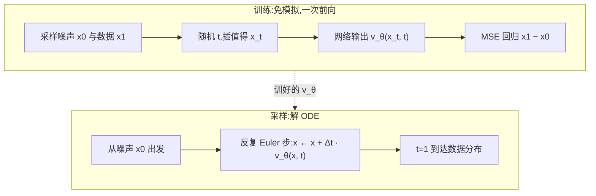

# Flow Matching(流匹配)

> ⚠️ 旧版:本篇写于写作契约确立之前,尚未按新标准审查重写。标准见 docs/05-知识库写作契约.md,样板见「GPU架构与执行模型」。

Flow Matching 用回归来学习把噪声分布搬到数据分布的速度场。以线性插值为例,在噪声与数据之间采样中间点,让网络预测二者的差向量;训练无需逐条求解 ODE,生成时仍需沿学到的速度场积分。

## 一、背景:CNF 的 ODE 视角与「免模拟」动机

生成建模可以看成一场**连续搬运**:把简单分布(标准高斯)里的点,沿时间 $t \in [0,1]$ 连续推到数据分布上。描述这场搬运的是一个常微分方程(ODE):

$$
\frac{dx}{dt} = v_\theta(x, t)
$$

$v_\theta$ 是神经网络参数化的**速度场**——站在时刻 $t$、位置 $x$,它告诉你下一瞬间往哪挪。这套框架叫连续正规化流(CNF),数值基础设施来自 Neural ODE。

类比:一锅正在流动的水。水中每个位置、每个时刻都有一支流速箭头;把一片叶子(噪声样本)放进去顺流漂到 $t=1$,漂到哪、就生成了什么。

CNF 的老大难在**训练**:极大似然要沿整条轨迹积分对数密度的变化(瞬时变量替换公式,含散度项 $-\mathrm{tr}(\partial v / \partial x)$),等于每个训练 step 都要解一遍 ODE 外加估计散度——慢到无法规模化。

Flow Matching(FM)的破局点:**训练时完全不解 ODE**(simulation-free)。既然要学速度场,那就人为规定好每条轨迹长什么样,把「标准答案速度」直接写出来,用回归抄下来。

## 二、核心机制:条件路径 + CFM 回归

### 规定一条条件路径

配一对点:噪声 $x_0 \sim \mathcal{N}(0, I)$、数据 $x_1 \sim p_{\text{data}}$。人为规定二者之间的插值路径,最常用**线性插值**:

$$
x_t = (1-t)\, x_0 + t\, x_1,\qquad u_t = \frac{dx_t}{dt} = x_1 - x_0
$$

即:让这对点沿直线匀速走,任意时刻的条件目标速度都是同一个常向量 $x_1 - x_0$。

### CFM 目标:一行回归

采样 $t, x_0, x_1$,算出插值点 $x_t$,让网络在该点的输出拟合条件速度:

$$
\mathcal{L}_{CFM} = \mathbb{E}_{t,\, x_0,\, x_1}\left[\left\| v_\theta(x_t, t) - (x_1 - x_0) \right\|^2\right]
$$

```python
# 训练一步(伪代码)
x1 = sample_data()             # 数据
x0 = randn_like(x1)            # 噪声,独立采样即可
t  = rand(batch)               # U(0,1);SD3 改用 logit-normal 加权
xt = (1 - t) * x0 + t * x1     # 插值
loss = mse(v_theta(xt, t), x1 - x0)
```

一次前向 + MSE,没有 ODE 求解、没有散度估计、也没有噪声调度推导。

### 为什么这样学是对的:边际速度场

疑问:同一个位置 $x_t$ 会被**无数对** $(x_0, x_1)$ 的直线穿过,每对给的目标速度都不一样,网络最后学到了什么?

答案:MSE 回归的最优解是**条件期望**。固定 $(x, t)$,网络收敛到「所有恰好路过这里的直线速度的平均」:

$$
v^*(x, t) = \mathbb{E}\left[\, x_1 - x_0 \;\middle|\; x_t = x \,\right]
$$

FM 的核心定理:这个平均场恰好就是能把噪声分布整体输运成数据分布的**边际速度场**——条件目标的期望 = 边际目标,二者梯度等价。这与 DDPM 的条件化技巧如出一辙:边际 score 写不出来,就让网络回归条件加噪的 $\varepsilon$,期望自动凑出边际 score。

类比:**学每滴墨水的直线路径,合起来就是整锅水的流场**。往清水里滴一亿滴墨,每滴各走各的直线;你在锅中任意一点插一支流速计,读数是「路过此点的所有墨滴速度的平均」。所有点的读数拼起来就是宏观流场——没有一滴墨真按宏观流场走,但按它搬运整锅水,分布的演化分毫不差。

### 训练与采样全景



## 三、Rectified Flow:同一思想 + reflow 直线化

Rectified Flow(RF)与 FM 几乎同期独立提出,训练目标一致(线性插值 + 回归差向量),额外贡献了关键操作 **reflow**:

1. 用训好的模型从噪声 $x_0$ 解 ODE 得到生成结果 $\hat{x}_1$,组成新配对 $(x_0, \hat{x}_1)$;
2. 用这些**模型自己产生的配对**重新训练一遍,可迭代多轮。

第一轮随机配对的条件直线可能经过相近位置,却给出不同速度。网络学到的是条件平均速度,对应的实际采样轨迹通常不是这些直线。reflow 用模型生成的起终点重新配对,目标是让后续轨迹更直、更容易用少步近似;有限数据和模型下,不能保证做一轮就得到精确直线或一步无损生成。

另一种做法是 minibatch OT:先在一批噪声与数据之间寻找较低搬运代价的配对,再回归条件速度。**每对点之间走直线,不等于配对本身实现了分布间的全局最优传输**;批内近似也不等于全局最优。更好的配对可能减少目标速度的分歧,同时增加配对计算成本。

## 四、与 Diffusion 的关系(高频考点)

FM 可以使用扩散对应的高斯概率路径。对同一条可转换的路径,噪声、score 与速度可以换算;训练损失的时间权重也要一起考虑,不能把任意两种配方直接视为同一个目标。扩散侧的完整推导见 Diffusion 篇。

| 维度 | 怎样区分 |
|---|---|
| 路径 | FM 可选线性插值,也可选扩散路径;条件路径形状不直接决定实际采样轨迹 |
| 参数化 | 网络可以预测噪声、score或速度;换参数化时需匹配时间约定和损失权重 |
| 采样 | 扩散存在随机SDE与对应的probability-flow ODE;确定性ODE并非FM独有 |
| 表示空间 | 像素或latent与FM/扩散是两种选择,FM同样能在潜空间训练 |

“确定性ODE难以表示多模态分布”并非普遍结论:初始噪声本身随机,其不同起点可被搬运到不同数据模式。实际模式覆盖仍受数据、网络近似与数值求解影响。

## 五、采样:解 ODE 与步数-质量

采样 = 数值积分,最简单的 Euler 法:

$$
x_{t+\Delta t} = x_t + \Delta t \cdot v_\theta(x_t, t)
$$

轨迹弯曲或速度变化快时,大步长可能产生较大离散误差;更直、更平滑的轨迹更容易少步近似。但没有FM一律需要多少步的常数,高阶求解器也可能每步多次调用网络。公平比较要同时报告网络求值次数(NFE)、实际时延和生成质量。

### 效率、稳定性与质量如何分别改进

| 问题 | 改进方向 | 需要付出的代价或验证 |
|---|---|---|
| 积分调用太多 | 步长与求解器、reflow、少步蒸馏 | NFE和画质曲线;reflow/蒸馏的新增训练成本 |
| 部分时间段难学 | 时间采样、损失权重、配对策略 | 各时间段误差及训练波动;不能只看平均loss |
| 高维计算成本大 | 潜空间压缩、降低模型计算量 | 编码器重建上限、显存与细节损失 |
| 模式覆盖或细节不足 | 数据覆盖、模型容量及求解精度 | 质量与多样性一起评,不把确定性ODE认定为固有缺陷 |

例如比较潜空间FM与潜空间扩散时,固定编码器、训练数据、模型规模与生成预算,再测质量、覆盖率和时延。否则编码器或训练量的变化也会被误算成训练目标的优势。自适应求解器、蒸馏或正则项都应与简单基线对照,没有“实时应用必用隐式Adams”的通用规则。

## 六、应用版图

- **图像**:Stable Diffusion 3、Flux 以(加权)Rectified Flow 为训练目标,配 MMDiT 架构,是当前文生图的主流配方。
- **视频/音频**:新一代视频生成与 TTS/音乐模型广泛沿用 FM 目标——连续信号 + 少步推理的诉求与之天然契合。
- **机器人**:flow policy 用 FM 建模动作分布,相比 diffusion policy 显著减少控制回路里的推理步数。

## 七、面试考点串联

| 问法 | 正文小节 |
| --- | --- |
| FM为什么训练时不用解ODE,生成时却要解? | 一、背景;二、核心机制 |
| 条件轨迹是直线,实际生成为什么仍可能要多步? | 二、核心机制;三、Rectified Flow |
| 效率、训练稳定性和质量各有什么改进空间? | 五、采样:解 ODE 与步数-质量 |
| FM与DDPM怎样从概率路径和参数化上联系起来? | 四、与 Diffusion 的关系(高频考点) |
| OT配对为什么可能帮助训练,保证全局最优吗? | 三、Rectified Flow:同一思想 + reflow 直线化 |
| FM与Latent Diffusion是互斥选项吗,怎样公平比较? | 四、与 Diffusion 的关系(高频考点);五、采样:解 ODE 与步数-质量 |
| 比较少步生成为什么要看NFE而不只看步数? | 五、采样:解 ODE 与步数-质量 |

> 本篇仍保留旧稿重写状态。

## 相关文献

- Flow Matching for Generative Modeling — [arXiv:2210.02747](https://arxiv.org/abs/2210.02747)
- Rectified Flow(Flow Straight and Fast)— [arXiv:2209.03003](https://arxiv.org/abs/2209.03003)
- Stable Diffusion 3(Scaling Rectified Flow Transformers,RF 大规模实践)— [arXiv:2403.03206](https://arxiv.org/abs/2403.03206)
- Neural Ordinary Differential Equations(CNF/ODE 背景)— [arXiv:1806.07366](https://arxiv.org/abs/1806.07366)

- Minibatch Optimal Transport — [arXiv:2302.00482](https://arxiv.org/abs/2302.00482)
- Score-Based Generative Modeling through SDEs — [arXiv:2011.13456](https://arxiv.org/abs/2011.13456)
