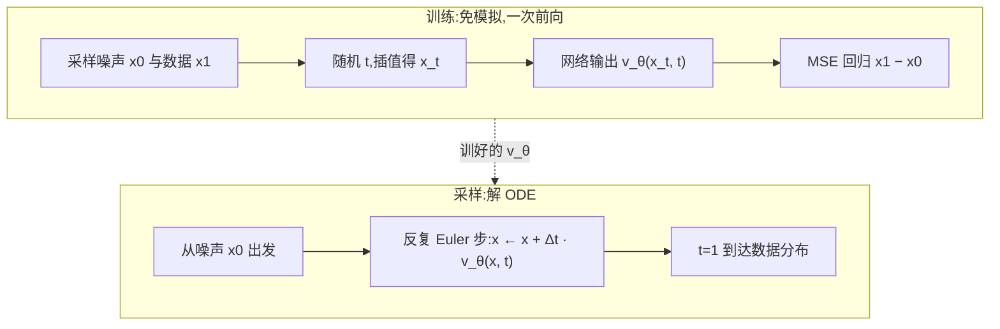

# Flow Matching(流匹配)

> ⚠️ 旧版:本篇写于写作契约确立之前,尚未按新标准审查重写。标准见 docs/04-知识库写作契约.md,样板见「GPU架构与执行模型」。

一句话:**不学「怎么去噪」,直接学「从噪声流向数据的速度场」**——把生成建模变成一道回归题:在噪声与数据的插值点上,回归二者的差向量。训练目标一行写完、天然免模拟、路径还能拉直到少步采样,是 Stable Diffusion 3 / Flux 这一代模型的默认生成框架。

## 一、背景:CNF 的 ODE 视角与「免模拟」动机

生成建模可以看成一场**连续搬运**:把简单分布(标准高斯)里的点,沿时间 $t \in [0,1]$ 连续推到数据分布上。描述这场搬运的是一个常微分方程(ODE):

$$
\frac{dx}{dt} = v_\theta(x, t)
$$

$v_\theta$ 是神经网络参数化的**速度场**——站在时刻 $t$、位置 $x$,它告诉你下一瞬间往哪挪。这套框架叫连续正规化流(CNF),数值基础设施来自 Neural ODE。

类比:一锅正在流动的水。水中每个位置、每个时刻都有一支流速箭头;把一片叶子(噪声样本)放进去顺流漂到 $t=1$,漂到哪、就生成了什么。

CNF 的老大难在**训练**:极大似然要沿整条轨迹积分对数密度的变化(瞬时变量替换公式,含散度项 $-\mathrm{tr}(\partial v / \partial x)$),等于每个训练 step 都要解一遍 ODE 外加估计散度——慢到无法规模化。

Flow Matching(FM)的破局点:**训练时完全不解 ODE**(simulation-free)。既然要学速度场,那就人为规定好每条轨迹长什么样,把「标准答案速度」直接写出来,用回归抄下来。

## 二、核心机制:条件路径 + CFM 回归

### 规定一条条件路径

配一对点:噪声 $x_0 \sim \mathcal{N}(0, I)$、数据 $x_1 \sim p_{\text{data}}$。人为规定二者之间的插值路径,最常用**线性插值**:

$$
x_t = (1-t)\, x_0 + t\, x_1,\qquad u_t = \frac{dx_t}{dt} = x_1 - x_0
$$

即:让这对点沿直线匀速走,任意时刻的条件目标速度都是同一个常向量 $x_1 - x_0$。

### CFM 目标:一行回归

采样 $t, x_0, x_1$,算出插值点 $x_t$,让网络在该点的输出拟合条件速度:

$$
\mathcal{L}_{CFM} = \mathbb{E}_{t,\, x_0,\, x_1}\left[\left\| v_\theta(x_t, t) - (x_1 - x_0) \right\|^2\right]
$$

```python
# 训练一步(伪代码)
x1 = sample_data()             # 数据
x0 = randn_like(x1)            # 噪声,独立采样即可
t  = rand(batch)               # U(0,1);SD3 改用 logit-normal 加权
xt = (1 - t) * x0 + t * x1     # 插值
loss = mse(v_theta(xt, t), x1 - x0)
```

一次前向 + MSE,没有 ODE 求解、没有散度估计、也没有噪声调度推导。

### 为什么这样学是对的:边际速度场

疑问:同一个位置 $x_t$ 会被**无数对** $(x_0, x_1)$ 的直线穿过,每对给的目标速度都不一样,网络最后学到了什么?

答案:MSE 回归的最优解是**条件期望**。固定 $(x, t)$,网络收敛到「所有恰好路过这里的直线速度的平均」:

$$
v^*(x, t) = \mathbb{E}\left[\, x_1 - x_0 \;\middle|\; x_t = x \,\right]
$$

FM 的核心定理:这个平均场恰好就是能把噪声分布整体输运成数据分布的**边际速度场**——条件目标的期望 = 边际目标,二者梯度等价。这与 DDPM 的条件化技巧如出一辙:边际 score 写不出来,就让网络回归条件加噪的 $\varepsilon$,期望自动凑出边际 score。

类比:**学每滴墨水的直线路径,合起来就是整锅水的流场**。往清水里滴一亿滴墨,每滴各走各的直线;你在锅中任意一点插一支流速计,读数是「路过此点的所有墨滴速度的平均」。所有点的读数拼起来就是宏观流场——没有一滴墨真按宏观流场走,但按它搬运整锅水,分布的演化分毫不差。

### 训练与采样全景



## 三、Rectified Flow:同一思想 + reflow 直线化

Rectified Flow(RF)与 FM 几乎同期独立提出,训练目标一致(线性插值 + 回归差向量),额外贡献了关键操作 **reflow**:

1. 用训好的模型从噪声 $x_0$ 解 ODE 得到生成结果 $\hat{x}_1$,组成新配对 $(x_0, \hat{x}_1)$;
2. 用这些**模型自己产生的配对**重新训练一遍,可迭代多轮。

为什么有效:第一轮的 $(x_0, x_1)$ 是随机配对,大量直线互相**交叉**;交叉点上的平均速度指不清方向,所以边际 ODE 轨迹是弯的,采样必须小步多走。reflow 的配对来自确定性的 ODE 映射,轨迹之间互不相交,再训一遍路径就**越来越直**;直线用 Euler 一大步就能走完,于是 2–4 步甚至**一步生成**成为可能(常再配蒸馏收尾)。

类比:第一天搬家,广场上的人随机抽签分房,路线横七竖八互相绕;第二天按「昨天你实际走到了哪」重新登记配对,人人一条直线各走各的,一步到位。

> 🖼️ 占位:二维 toy 分布上,随机配对训练后的弯曲采样轨迹 vs reflow 一轮后的近直线轨迹对比图

延伸:不动路径、只改配对也能「预直化」——minibatch OT 在每个 batch 内先做最优传输匹配再连线,减少交叉,与 reflow 殊途同归。

## 四、与 Diffusion 的关系(高频考点)

结论先行:**扩散模型 ≈ Flow Matching 在特定弯曲路径 + 特定参数化下的特例**;FM 把「路径」从推导结果升级为可自由设计的超参。(扩散侧的完整推导另见 Diffusion 篇。)

- 扩散的 VP 加噪过程对应路径 $x_t = \alpha_t x_1 + \sigma_t x_0$,$\alpha_t, \sigma_t$ 由噪声调度决定,是一条**弯**路;FM 的线性路径把它换成直线。
- **v-prediction 就是路径速度**:扩散的三角参数化 $x_\phi = \cos(\phi)\, x_{\text{data}} + \sin(\phi)\, \varepsilon$ 下,v-pred 的目标 $v \equiv \cos(\phi)\,\varepsilon - \sin(\phi)\, x_{\text{data}}$ 恰好就是 $\frac{dx_\phi}{d\phi}$。所以训 v-pred 的扩散模型,本质是在弯路径上做 FM(只是时间方向约定相反:扩散从数据走向噪声);RF 无非把弯路换成直路。

| 维度 | Diffusion(DDPM 系) | Flow Matching / RF |
| --- | --- | --- |
| 训练目标 | $\varepsilon$-/v-预测,形式绑定调度推导 | 回归 $x_1 - x_0$,一行 |
| 概率路径 | 由前向加噪过程固定(弯) | 自由设计,线性最常用(直) |
| 噪声调度 | $\alpha_t/\sigma_t$ 需精心设计调参 | 线性路径无调度负担,只剩 $t$ 的采样权重 |
| 采样 | SDE/ODE 皆可,常需几十步起 | ODE,天然少步友好;reflow 后 1–4 步 |
| 理论姿势 | 学习逆转一个固定的加噪过程 | 直接设计并回归噪声→数据的传输 |

SD3 的实践一笔:训练时对 $t$ 不做均匀采样,而用 **logit-normal 加权**把算力压向中段 $t$——两端(近噪声、近数据)的速度好猜,中段最难、对画质最关键。

## 五、采样:解 ODE 与步数-质量

采样 = 数值积分,最简单的 Euler 法:

$$
x_{t+\Delta t} = x_t + \Delta t \cdot v_\theta(x_t, t)
$$

- **几何直觉**:数值积分是用折线逼近曲线。轨迹越弯,大步长的折线偏得越远,只能小步多走;轨迹越直,Euler 大步几乎零误差。这就是 FM/RF **天然适合少步**的原因——路径的「直」是可以被设计与优化的,而扩散的路径天生是弯的。
- 实践量级:线性路径 FM 通常 20–30 步到高质量;reflow/蒸馏后 1–4 步。
- 可换高阶求解器(Heun、中点法)在同样步数下减小误差,但收益通常不如把路拉直本身。
- CFG 照常可用:对条件/无条件**速度场**做外插 $\tilde{v} = v_{\text{uncond}} + w\,(v_{\text{cond}} - v_{\text{uncond}})$,与扩散中的用法同构。

## 六、应用版图

- **图像**:Stable Diffusion 3、Flux 以(加权)Rectified Flow 为训练目标,配 MMDiT 架构,是当前文生图的主流配方。
- **视频/音频**:新一代视频生成与 TTS/音乐模型广泛沿用 FM 目标——连续信号 + 少步推理的诉求与之天然契合。
- **机器人**:flow policy 用 FM 建模动作分布,相比 diffusion policy 显著减少控制回路里的推理步数。

## 七、面试考点串联

1. 默写线性路径与 CFM 目标,讲清每个符号 →「核心机制」
2. FM 为什么免模拟、CNF 慢在哪 →「背景」
3. 回归条件速度为何能学出边际速度场(与 DDPM 条件化技巧对照)→「边际速度场」小节
4. FM 与扩散的关系、v-prediction 怎么对应到速度场 →「与 Diffusion 的关系」
5. reflow 为什么能把步数压到 1–4(配对交叉 → 直线化)→「Rectified Flow」
6. SD3 为什么对 $t$ 做 logit-normal 加权 →「与 Diffusion 的关系」末段
7. 少步采样的几何解释(直线 + Euler 大步)→「采样」

## 相关文献

- Flow Matching for Generative Modeling — [arXiv:2210.02747](https://arxiv.org/abs/2210.02747)
- Rectified Flow(Flow Straight and Fast)— [arXiv:2209.03003](https://arxiv.org/abs/2209.03003)
- Stable Diffusion 3(Scaling Rectified Flow Transformers,RF 大规模实践)— [arXiv:2403.03206](https://arxiv.org/abs/2403.03206)
- Neural Ordinary Differential Equations(CNF/ODE 背景)— [arXiv:1806.07366](https://arxiv.org/abs/1806.07366)
