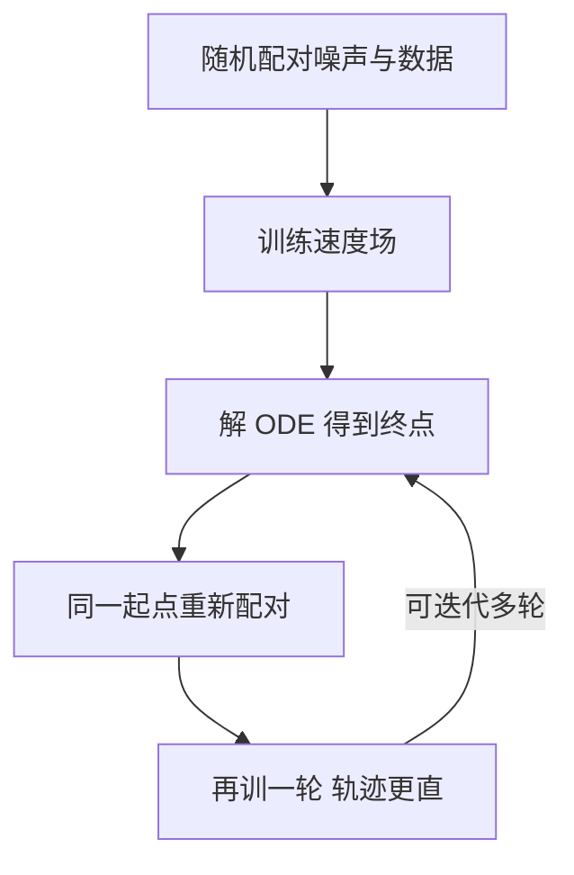

# Flow Matching(流匹配)

一句话:**把「学一个生成模型」变成「学一张流速图」**——在噪声和数据之间人为拉一条路径,让网络回归这条路径上每一点该有的速度;训练只是一次前向加一个 MSE,不解任何微分方程,生成时才沿着学到的速度场把噪声积分成样本。SD3、Flux 这一代文生图模型用的就是它。

## 一、出发点:CNF 的账算不过来

把生成想成一次**连续搬运**:标准高斯里的一个点,沿时间 $t \in [0,1]$ 被一路推到数据分布上。描述这场搬运的是一个常微分方程(ODE):

$$
\frac{dx}{dt} = v_\theta(x, t)
$$

这句话是说:站在时刻 $t$、位置 $x$,网络 $v_\theta$ 告诉你下一瞬间往哪个方向、以多快的速度挪。$v_\theta$ 叫**速度场**,这套框架叫连续归一化流(CNF,continuous normalizing flow)。

> **类比**:一锅正在流动的水。锅里每个位置、每个时刻都有一支流速箭头;把一片叶子(噪声样本)扔进去顺流漂到 $t=1$,漂到哪就生成了什么。

CNF 的表达力没问题,卡死它的是**训练**。CNF 原本按极大似然训练,而算一个样本的对数似然要沿整条轨迹积分密度的变化(瞬时变量替换公式),被积项里有一个速度场的散度 $\mathrm{tr}(\partial v/\partial x)$。两笔账都很贵:

| 开销 | 为什么贵 |
|---|---|
| 解一遍 ODE | 每个训练 step 都要跑一次数值积分,自适应求解器动辄几十到上百次网络前向 |
| 算散度 | 精确算要对每一维各做一次反向传播,$D$ 维数据就是 $D$ 次(一张 32×32×3 的小图就已经是 3072 次) |

散度那一项实践里可以用 Hutchinson 迹估计压到 1 次反传,但 **「每个 step 解一遍 ODE」这条绕不过去**,因为似然本身就定义在整条轨迹上。结果是 CNF 长期做不大。

Flow Matching(FM)的破局点只有一句:**训练时根本不解 ODE(simulation-free)**。既然最终要的只是速度场,那就人为把每条轨迹长什么样规定死,把「标准答案速度」直接写出来,让网络照抄。

## 二、核心机制:条件流匹配把不可算的目标变成一行回归

### 想直接回归,却写不出标准答案

假设我们已经知道理想的速度场 $u_t(x)$,训练目标一行就够:

$$
\mathcal{L}_{\text{FM}} = \mathbb{E}_{t,\, x \sim p_t}\left[\left\| v_\theta(x, t) - u_t(x) \right\|^2\right]
$$

意思是:在概率路径 $p_t$(从噪声分布连续变形到数据分布的那一族中间分布)上采点,让网络输出对齐这一点上的真实速度。

问题是 $u_t(x)$ **写不出来**。它是「所有数据点对这个位置的贡献取平均」的结果,依赖未知的数据分布,这个期望没有闭式。目标看着漂亮,一步都跑不了。

### 条件路径:先把一对点之间的答案规定死

FM 的办法是**降一层**:不问「整个分布该怎么流」,只问「这一对点该怎么走」。配一对点——噪声 $x_0 \sim \mathcal{N}(0, I)$ 和数据 $x_1 \sim p_{\text{data}}$,人为规定它们之间的路径,最常用的就是直接连直线:

$$
x_t = (1-t)\, x_0 + t\, x_1, \qquad u_t(x_t \mid x_0, x_1) = \frac{dx_t}{dt} = x_1 - x_0
$$

第一式说这对点匀速走直线;第二式说这条直线上**任意时刻的目标速度都是同一个常向量** $x_1 - x_0$——起点终点一采样出来就知道了,不用解任何方程。

### CFM 目标:一次前向 + 一个 MSE

把条件目标塞回损失,就是条件流匹配(conditional flow matching,CFM):

$$
\mathcal{L}_{\text{CFM}} = \mathbb{E}_{t,\, x_0,\, x_1}\left[\left\| v_\theta(x_t, t) - (x_1 - x_0) \right\|^2\right]
$$

读法:随机抽一个时刻、抽一对噪声–数据,算出插值点,让网络在那个点上把差向量猜出来。没有 ODE 求解,没有散度估计,也没有噪声调度要推。

```python
# 训练一步
x1 = sample_data()                    # 数据端
x0 = randn_like(x1)                   # 噪声端,独立采样即可
t  = rand(batch).view(-1, 1, 1, 1)    # 时刻,分布可换(见第五节)
xt = (1 - t) * x0 + t * x1            # 直线上的插值点
loss = mse(v_theta(xt, t), x1 - x0)   # 目标速度是常向量,直接写得出来
```

### 为什么抄条件答案能学出边际速度场

马上会有一个疑问:同一个位置 $x_t$ 会被**无数对** $(x_0, x_1)$ 的直线穿过,每对给的目标都不一样,网络到底学到了什么?

答案藏在 MSE 的性质里:**平方损失的最优解是条件期望**。固定 $(x, t)$,网络收敛到「所有恰好路过这里的直线速度的平均」:

$$
v^*(x, t) = \mathbb{E}\left[\, x_1 - x_0 \;\middle|\; x_t = x \,\right]
$$

这句话是说,网络自动替你做了一次加权平均。而 FM 的核心定理正是:**这个平均场恰好就是能把噪声分布整体输运成数据分布的边际速度场** $u_t(x)$;两个损失关于参数的梯度相同,所以优化那个能算的,等于优化那个算不出来的。

> **类比**:学每一滴墨水的直线,合起来就是整锅水的流场。往清水里滴一亿滴墨,每滴各走各的直线;你在锅里任意一点插一支流速计,读数就是「路过此点的所有墨滴速度的平均」。所有点的读数拼起来就是宏观流场——**没有一滴墨真按宏观流场走**,但拿它去搬运整锅水,分布的演化分毫不差。

这个「条件化」的把戏不是 FM 独有的:扩散写不出边际 score,就让网络回归条件加噪的 $\varepsilon$,期望自动凑出边际 score(推导见 Diffusion 篇)。同一招换了个壳。

## 三、三种「直」不是一回事

面试里最容易被追问穿的就是这里。「直线」这个词在 FM 语境下有三层意思,层层不等价:

| 说的是哪一种「直」 | 成立吗 | 为什么 |
|---|---|---|
| 条件插值路径是直线 | ✅ 定义如此 | 是我们自己规定的 $x_t=(1-t)x_0+tx_1$ |
| 实际采样轨迹是直线 | ❌ 一般不是 | 网络学的是**条件平均**;不同直线在同一点交叉,平均出来的场会把轨迹带弯 |
| 配对实现了全局最优传输 | ❌ 随机配对做不到 | 「每对点之间走最短路」和「两个分布之间总搬运代价最小」是两件事 |

第二条是关键:**条件轨迹再直,采样时也可能要几十步**,因为你积分的是那个被平均过的场,不是任何一条原始直线。

### reflow:让轨迹真的变直

Rectified Flow(RF)和 FM 几乎同期独立提出,训练目标一致(线性插值 + 回归差向量),额外贡献了 **reflow** 这个操作:



关键在第三步:$(x_0, \hat{x}_1)$ 是**模型自己的 ODE 把这个起点送到的终点**,同一个起点只对应一个终点,配对不再交叉。交叉少了,同一位置上的目标速度分歧就小,平均出来的场更接近直线。

### 一步生成为什么可能

轨迹越直,一阶 Euler 的**截断误差**越小;极限情况下轨迹是完美直线,一步走到底也没有误差,因为直线上速度处处相同。所以 reflow 不是玄学加速,它是在**给一阶求解器铺路**。

数字上,InstaFlow(在 SD 1.5 上做 reflow 再蒸馏)论文自报一步生成在 MS COCO 2017-5k 上 FID 23.3,而同期 progressive distillation 是 37.2;COCO 2014-30k 上一步 13.1 FID、0.09 秒(均为论文自报口径)。但代价要说清:**reflow 得先用旧模型生成大批配对再重训,蒸馏还要再训一个学生**——省的是推理,花的是训练。有限数据、有限容量下,也没有「做一轮就得到精确直线、一步无损」这回事。

### minibatch OT:另一条路,同样不免费

另一种减少交叉的做法是在配对上动手:一个 batch 内先算噪声与数据之间的搬运代价矩阵,解一个指派问题把「近的配近的」,再回归条件速度。好处是目标速度的方差降下来,回归更好学、积分更好走。

但要说清它保证不了什么:**这是批内近似,不是两个分布之间的全局最优传输**,batch 越小近似越糙。代价是每个 batch 多一个 $O(B^2)$ 的距离矩阵和一次指派求解(匈牙利或 Sinkhorn),batch 大时不可忽略。所以 OT 配对是「可能有帮助、要实测」的选项,不是免费的稳定性。

## 四、和扩散的关系:改的不是同一层

生成模型有两层可以分别改,混在一起谈就会得出「FM 比 DDIM 快」这种不成立的结论:

| 层 | 决定什么 | 代表 |
|---|---|---|
| 训练层 | 用什么概率路径、网络回归什么目标 | DDPM 的 $\varepsilon$-预测、FM/RF 的速度回归 |
| 采样层 | 训好之后怎么数值求解 | DDIM、DPM-Solver++ 等高阶积分器 |

**DPM-Solver++ 改的是采样层,Flow Matching 改的是训练层,两者可以叠着用,不是互斥算法。** 顺带一个常见的题面陷阱:RULER 是长上下文语言模型的评测基准,不是扩散采样器,题目把它列进采样器时要先纠正前提。

### 两者怎么统一

对可以互相转换的高斯路径,「预测噪声」「预测 score」「预测速度」只是**同一件事的不同参数化**,彼此有闭式换算。但换参数化时有两样东西必须跟着换,否则就不是同一个目标了:

- **时间方向的约定**。Lipman 的 FM 论文里 $t=0$ 是噪声、$t=1$ 是数据;SD3 论文写的是 $z_t=(1-t)x_0+t\varepsilon$($x_0$ 是数据),$t=0$ 是数据、$t=1$ 是噪声。方向正好相反,读论文或对代码前先确认哪一端是噪声。
- **损失的时间权重**。同一条路径在不同参数化下的隐含加权不同,权重不对齐,收敛速度和最终质量都会变——这也是「两种配方看着等价、跑出来不一样」的常见原因。

### 三个容易说错的结论

- **「确定性 ODE 只能生成单一模式」——错**。起点 $x_0$ 本身是随机的,不同起点被搬到不同的数据模式上,整体依然是多模态;模式覆盖不足是数据、容量和积分精度的问题,不是确定性本身的原罪。反过来,扩散那边也早有确定性的 probability-flow ODE(见 Diffusion 篇),确定性不是 FM 的专利,随机性也不是扩散的专利。
- **「FM 和 Latent Diffusion 二选一」——错**。latent 说的是**在哪个表示空间**生成(像素还是 VAE 潜空间,压缩机制见 VAE 篇),FM/扩散说的是**怎么训练这个生成过程**,两个维度正交。SD3 本身就是「潜空间 + 整流流 + Transformer 骨干」的组合(骨干见 DiT 篇)。
- **「换成 FM 就更快更好」——要看怎么比**。公平比较得先固定四样东西:编码器、训练数据、模型容量、生成预算;然后同时看质量、覆盖率(多样性)和实测时延。否则换了个更好的 VAE、或者多训了一倍数据,功劳都会被算到训练目标头上。

## 五、工程口径:时间调度、噪声先验与少步采样

### 采样就是数值积分,速度按 NFE 算

最朴素的 Euler 步:

$$
x_{t+\Delta t} = x_t + \Delta t \cdot v_\theta(x_t, t)
$$

意思是:当前位置加上「速度 × 这一小段时间」就是下一个位置——和中学物理的匀速位移公式一模一样,只是速度由网络现算。

比较速度时**必须报网络求值次数(NFE),不能只报步数**:二阶单步法(如 Heun)每步要调两次网络,「20 步」实际是 40 NFE;多步法会复用历史求值,每步仍是 1 NFE。只比步数,能把两倍的开销比没了。同理,少步蒸馏的账要连训练成本一起报,不能只亮推理那一栏。

### $t$ 怎么采:均匀不是最优

训练时 $t$ 的分布决定了模型在哪个时间段上花的样本多。均匀采样 $U(0,1)$ 是默认,但中间时刻(信噪比接近 1、既不是明显的噪声也不是明显的图)最难学,该多分配。SD3 系统对比了 **61 种配方**,结论是 **logit-normal 采样**(对 $t$ 的 logit 取正态,把样本堆在 $t=0.5$ 附近)排名稳定靠前,优于均匀采样的整流流基线。

### 分辨率变了,$t$ 要跟着平移

同样的插值系数,分辨率越高、像素冗余越多,同等噪声「毁容」的程度越轻,于是高分辨率下要把时间整体往噪声端推。SD3 给的换算是:

$$
t_m = \frac{\sqrt{m/n}\; t_n}{1 + (\sqrt{m/n} - 1)\, t_n}
$$

它把分辨率 $n$ 下用的时刻 $t_n$ 映射成分辨率 $m$ 下的等效时刻 $t_m$:$m$ 越大,同一个 $t_n$ 被推得越靠近噪声端。SD3 在 $1024\times1024$ 上训练与采样统一取 shift 系数 3.0。

### 噪声先验:FM 比扩散多一份自由

扩散的前向过程锁死了终点必须是高斯,FM 没有这个约束——两端只要能采样就行。所以同一套目标可以直接拿来做**分布到分布的搬运**(比如图到图的转换),把 $x_0$ 换成另一个数据分布即可。顺带一个好处:FM 的 $t=0$ 就是纯噪声,不存在扩散那边「终端信噪比不为零、训练从没见过纯噪声而推理偏偏从纯噪声起步」的错配(该问题见 Diffusion 篇)。

### 还剩哪些改进空间

| 想改进什么 | 为什么还是问题 | 怎么做,代价是什么 |
|---|---|---|
| 采样速度 | 条件直线不代表实际轨迹直,大步长积分误差大 | 换求解器、reflow、少步蒸馏;后两者新增「生成配对 + 训学生」的成本,且不保证无损 |
| 训练稳定性 | 各时间段难度不同,配对方式还会影响目标速度的方差 | 调时间分布与损失权重、改配对(OT);OT 有 $O(B^2)$ 开销,验收要看分时间段误差而不是平均 loss |
| 生成质量 | 数据、潜空间压缩、网络近似、积分误差都会丢细节 | 固定数据与算力,联合看质量、覆盖率和时延;潜空间省算力,但受编码器重建上限约束 |

把流匹配拿去做 RL 微调(得先把确定性 ODE 换成 SDE 才有策略密度可言)是另一条线,见 多模态RL 篇。

> 🖼️ 占位:同一模型在 1 / 2 / 4 / 8 / 25 NFE 下的出图对比,并附 reflow 前后的 FID–NFE 曲线

## 六、面试考点串联

| 高频问法 | 本文哪一节 |
| --- | --- |
| 扩散的 DPM-Solver++ 这类采样器和 Flow Matching 是什么关系?各自改的是哪一层? | 四(训练层 / 采样层) |
| Flow Matching 在效率、稳定性、生成质量上还有哪些改进空间? | 五(改进空间表);三(直线的三层含义) |
| Flow Matching 和 DDPM 在数学上怎么统一理解? | 二(条件化技巧);四(参数化换算与时间约定) |
| Optimal Transport 配对为什么能提升训练稳定性?它保证得了全局最优传输吗? | 三(minibatch OT) |
| 实际图像生成里,Flow Matching 相比 Latent Diffusion 的优劣势如何? | 四(latent 与训练目标正交,怎么比才公平) |
| 推理预算相同时,怎样公平比较 DPM-Solver++ 和 FM 模型的采样效率? | 五(NFE 口径) |
| 训练时不用解 ODE,生成时为什么还得解?(补充题) | 一(CNF 的两笔账);二(CFM 目标) |
| 同一个点上收到无数个互相矛盾的目标速度,网络为什么还能学对?(补充题) | 二(MSE 最优解是条件期望) |
| 条件路径都规定成直线了,采样轨迹为什么还是弯的?reflow 在做什么?(补充题) | 三(交叉配对与 reflow) |
| 确定性的 ODE 采样,会不会只能生成单一模式?(补充题) | 四(三个容易说错的结论) |
| 训练时 $t$ 为什么不用均匀采样?换了分辨率还要动什么?(补充题) | 五(logit-normal 与分辨率 shift) |

## 相关文献

- Flow Matching for Generative Modeling — [arXiv:2210.02747](https://arxiv.org/abs/2210.02747)
- Flow Straight and Fast: Learning to Generate and Transfer Data with Rectified Flow — [arXiv:2209.03003](https://arxiv.org/abs/2209.03003)
- Scaling Rectified Flow Transformers for High-Resolution Image Synthesis(SD3:61 种配方对比、logit-normal 时间采样、分辨率 shift)— [arXiv:2403.03206](https://arxiv.org/abs/2403.03206)
- Improving and generalizing flow-based generative models with minibatch optimal transport — [arXiv:2302.00482](https://arxiv.org/abs/2302.00482)
- InstaFlow: One Step is Enough for High-Quality Diffusion-Based Text-to-Image Generation(reflow + 蒸馏做一步生成)— [arXiv:2309.06380](https://arxiv.org/abs/2309.06380)
- Neural Ordinary Differential Equations(CNF 与免模拟动机的背景)— [arXiv:1806.07366](https://arxiv.org/abs/1806.07366)
- Score-Based Generative Modeling through Stochastic Differential Equations(probability-flow ODE)— [arXiv:2011.13456](https://arxiv.org/abs/2011.13456)
- Stochastic Interpolants: A Unifying Framework for Flows and Diffusions(流与扩散的统一框架)— [arXiv:2303.08797](https://arxiv.org/abs/2303.08797)
- Flow Matching Guide and Code(系统性教程与实现)— [arXiv:2412.06264](https://arxiv.org/abs/2412.06264)
