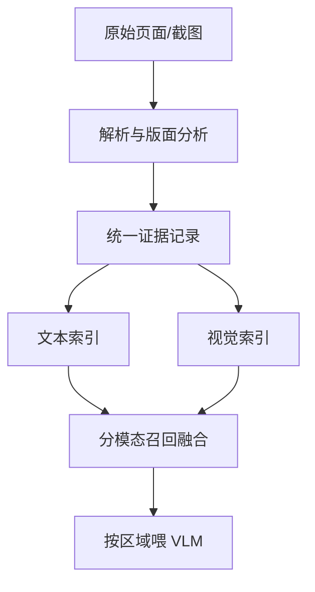

# 多模态RAG

一句话:当答案藏在图表、表格、界面截图和扫描件里时,把这些材料变成**检索得到、读得懂、还能指回原页面哪一块**的证据——本篇只讲多模态特有的那几段。

先划清边界,这几件事一律不在本篇展开:查询改写、混合检索与 BM25、重排、多路召回的融合算法见 检索优化 篇;通用切块策略与 ANN 索引选型见 切块与索引 篇;向量维度、离线建库与检索指标的通用口径见 Embedding 篇;一次请求里弱 VLM 与强文本模型怎么级联、怎么发定向复查见 多模态推理系统 篇——**那篇讲两个模型怎么协同推理,本篇讲材料怎么进库、怎么被捞出来**;视觉特征怎么接进 LLM、视觉 token 预算怎么算见 VLM结构 篇。

## 一、比文本 RAG 多了什么

### 多的不是一个模态,是一道有损且不报错的转换

文本 RAG 里,原始文件本身就是最终形态,切块只是把它切开。多模态材料不一样:一张财报页、一张界面截图,**必须先被"读"一遍**才能进索引,而这一遍读是压缩——版面、颜色、控件的空间关系、图里的趋势,只要没被读出来,后面任何环节都拿不回来。

这道转换最麻烦的性质是**它不报错**。OCR 把"1,358"读成"1.358",解析器把双栏论文按行串读,表格丢了表头——产出的都是合法字符串,索引照建、向量照算、检索照跑,只是答案开始悄悄地错。所以多模态 RAG 相对文本 RAG 多出的三类难点,第一类就是它:

1. **解析与 OCR 的错误会级联污染下游的一切**,而症状统一表现成"召回率低""数字对不上",看不出根因在最上游;
2. **同一个对象要跨模态对齐**——截图里那个按钮,和文档里那段说明,系统得知道它俩是同一件东西,否则检索出来的两条证据拼不到一起;
3. **高分辨率吃上下文和算力**,一张 4K 长截图原样喂进去就能占掉几千个视觉 token,延迟和成本都随之涨。

### 统一证据记录:本篇所有做法的地基

**一条硬原则:凡是不能指回「哪个文档、哪一页、哪个区域」的证据,后面就没法引用、没法复查、没法失效。** 所以图文材料进库时,索引单元不是一段文本,而是一条记录:

| 字段 | 长什么样 | 少了会怎样 |
|---|---|---|
| 原图引用 + 内容哈希 | 对象存储路径 + `sha256` | 无法回看原件,也判不出这张图变没变 |
| 位置 | 页码 + `[x0,y0,x1,y1]`,视频再加时间段 | 引用只能给到"某一页",人工核不动 |
| OCR / 抽出的文本 | 逐条 value + 各自的框与识别分数 | 数字、编号这类要逐字对的东西没法核验 |
| 结构化属性 | 元素类型(表格/图表/控件)、表头、图表种类 | 过滤不了,也没法按类型路由到不同解析器 |
| 出处与版本 | 文档版本号、界面版本号、生效时间 | 改版后旧证据混着召回,答案指向已经不存在的控件 |
| 权限标签 | 租户、密级 | 只能在生成侧"别说",而那不是隔离 |

一次界面截图问答的完整链路长这样:

离线把产品文档、组件说明、历史截图拆成上面那种记录并双路建索引;在线先识别截图里的文字与控件,再按问题决定走文本路、视觉路还是两路并行,融合后**只把命中的区域和对应说明**交给 VLM,并要求它引用具体的证据编号。

## 二、解析与建库:整条链路最大的静默错误源

### 为什么解析值得单独当一节讲

因为它是唯一一个"错了却不会有任何信号"的环节,而且下游全部依赖它。OHRBench 是第一个专门量化这条级联的基准:它把 OCR 的错误分成**语义噪声**(字认错)和**格式噪声**(结构读错,比如表格塌成一行流水),按不同强度注入后观察 RAG 的表现,结论直白——**当时没有任何一款 OCR 方案能撑起一个高质量的 RAG 知识库**。这不是说 OCR 没用,是说**必须把解析质量当成一个要被监控的指标**,而不是默认它对。

可操作的自检就三件,不需要人工标注:解析失败率与空块比例、抽出文本的**结构完整度**(表格有没有表头、行列数对不对得上)、以及关键字段的**双引擎交叉核对**(同一个数字用两个 OCR 各读一遍,不一致的挑出来)。

### 版面分析和阅读顺序,比认字更容易出事

认字错是局部的,**阅读顺序错是全局的**:双栏论文左右交错读一遍,得到的每一句都是通顺的,但整段的逻辑全乱了;跨页表格断成两半,后半页就是一堆没有列名的数字。所以解析的目标是"拿到带层级和顺序的内容",不是"把字都抠出来"。

版面分析本身也不是已解决的问题。DocLayNet 用 8 万多页人工标注、11 类版面标签(标题、正文、表格、图片、图注、脚注、公式、页眉页脚等),覆盖财报、专利、手册、法规、招标、论文六类来源;论文报告的检测基线 mAP 比标注者之间的一致性还低约 10 个点。**在版面规整的论文上表现好的解析器,换到财报和招标文件上会明显掉**,因为后者的版面变化大得多。

按材料分三路处理:

| 材料 | 怎么处理 | 主要坑 |
|---|---|---|
| 有文本层的数字 PDF | 直接抽字,但要**按坐标聚成栏再读**;表格走结构识别 | 双栏交错、跨页表、页眉页脚混进正文 |
| 扫描件与拍照 | 先做倾斜/去噪等预处理再 OCR(手段见 图像预处理 篇) | 低分辨率小字直接读错;印章、手写覆盖正文 |
| 幻灯片与界面截图 | 走控件/元素检测,保留空间关系与层级 | 文字散在几十个小框里,按坐标聚合不好就语义碎裂 |

公式和复杂版面还有第三条路:**用视觉模型直接把整页转成标记语言**,Nougat 就是这一路(Swin 编码器 + 自回归解码成 Markdown/LaTeX)。它对公式友好,但边界很实在——官方说明它主要面向英文学术文档,中日俄不支持。**别把一个论文场景的解析器直接搬到中文合同上。**

> 🖼️ 占位:同一张含图表的财报页在「纯文本抽取 / 版面分析后按区域切块 / 整页截图」三种表示下的对照示意

### 图和它的 caption 必须绑在同一条记录里

这是多模态建库里最容易漏、也最好修的一条。**一张脱离说明文字的图,向量里几乎没有可被查询命中的语义**——用户问"营收环比怎么变的",而那张折线图的视觉向量里没有"营收""环比"这些词的落点,除非图注里写着。反过来,图注被切进了别的块,这张图就永远召回不到。

三种绑法,按成本排:

| 做法 | 索引里放什么 | 代价与适用 |
|---|---|---|
| 就近拼接 | 图注 + 上下文若干句,和图共用一个证据 ID | 最便宜,依赖版面分析把图注归对了图 |
| 让 VLM 写一句摘要 | "这是一张 2019—2024 年营收折线图,趋势为…"再一起编码 | 每张图一次模型调用,建库成本随图数线性涨 |
| 图区域独立成块 | 图的视觉向量单独入库,但和文本块共享证据 ID | 支持"以图搜图",但要处理两路分数的量程问题(见第三节) |

表格怎么切、要不要每块重复表头,是通用切块问题,见 切块与索引 篇;本篇只强调一句:**表格与图的块边界要按版面切,不能按长度切**,因为按长度切必然会从中间劈开一个结构。

## 三、检索:三条技术路线,以及模态鸿沟

### 三条路线的取舍

这是本篇的核心选择题。"多模态材料怎么被检索到"只有三个答案:

| | ① 全部转成文字 | ② 统一图文嵌入 | ③ 页面截图当检索单元 |
|---|---|---|---|
| 检索单元 | 文本块 | 文本块 + 图/区域向量 | 整页(或整屏)的截图 |
| 怎么建库 | 解析 + OCR + 图注生成,然后走纯文本 RAG | CLIP 类双塔或指令式多模态检索器(UniIR)把两种模态压进同一空间 | VLM 直接编码页面图像,常配后期交互多向量(ColPali、DSE、VisRAG) |
| 适合什么 | 文字为主、版面规整、要精确匹配编号型号 | 以图搜图、图文互搜、素材库 | 版面复杂、图表密集、解析器本来就啃不动的材料 |
| 主要代价 | **解析损失是天花板**,图里的信息全靠转写质量 | 模态鸿沟(下一小节);细粒度定位弱 | **存储和在线打分贵**;引用只能到页级,还得二次定位到区域 |
| 成熟度 | 最成熟,工具链最全 | 成熟,但对文档类材料不如另外两条 | 较新,建库省事但检索侧要专门的索引 |

路线③ 值得多说两句,因为它最反直觉:**跳过解析,直接把页面截图编码成向量来检索**。ColPali 的做法是用 VLM 把一页编成 $32\times32=1024$ 个 patch 向量再加 6 个指令 token,共 1030 条 128 维向量,查询时用 ColBERT 式的后期交互逐 patch 取最大相似度再求和(机制见 检索优化 篇)。论文报告它在 ViDoRe 的十项任务上平均 nDCG@5 是 81.3,而同一篇论文里去掉后期交互、每页只压成一个向量的版本只有 58.8;建索引比 OCR 流水线快 10 倍以上,端到端检索延迟在 50 ms 以内(L4 GPU,论文口径)。DSE 走的是单向量版本的同一思路,在 130 万张维基页面截图上 top-1 命中率比 BM25 高 17 个点,在幻灯片这种图文混排材料上比"先 OCR 再文本检索"高 15 个点以上的 nDCG@10。VisRAG 把这条路接到生成侧,自报端到端相对文本 RAG 提升 20–40%(不同版本口径略有出入);M3DocRAG 则把它扩到多页多文档的开放域场景。

**代价必须一起记住**:多向量表示的存储可以直接算,

$$
S_{\text{page}} = n_{\text{vec}} \times d \times b
$$

每页占用 = 每页向量条数 × 维度 × 每个数的字节数。代入 ColPali 的 $1030 \times 128 \times 2\,\text{B}$,一页约 257 KB——这是单向量稠密表示(每页几 KB 量级)的近百倍。所以百万页级别的库不能裸用,论文自己也指出要靠聚类与池化把向量条数压下来。

**选型判据一句话**:**看信息密度和解析器啃不啃得动**。合同、法条、API 文档这类文字为主的材料,路线① 又准又便宜,别为了时髦上视觉检索;财报、论文、幻灯片、仪表盘截图这类"关键结论在图表里"的材料,解析损失是硬天花板,路线③ 收益最大。实践里最常见的其实是**混合**:用路线③ 做粗召回(页级、免解析、召得全),命中的那几页再解析出结构化证据做精排和引用定位——**把贵的解析只花在被选中的几页上,而不是全库**。

### 模态鸿沟:两路分数不在同一个量程

跨模态检索最常见的翻车,不是模型不准,是**把两种相似度当成同一种数来用**。

现象是几何性的:CLIP 这类双塔模型训完之后,图像向量和文本向量在共享空间里**各自聚成一团、隔着一段距离**。"Mind the Gap" 那篇把成因拆成两条——**锥效应**:深网络的表示天然挤在一个窄锥里,两个塔在训练开始前就已经分开了;**对比目标本身**:损失在一个非零间距处取到最小,所以训练也不会把两团拉到一起,间距大小还受温度影响。

三条直接后果:

- **image-text 相似度的整体量程明显低于 image-image**。同模态两条向量本来就近,跨模态天生远。所以"余弦大于 0.7 算命中"这种阈值**换个模态就失效**;
- **两路分数不能直接相加**,加起来等于让量程大的那一路说了算,另一路只是噪声;
- **top-k 会被单一模态整体占满**,因为同模态内部彼此更近,排序时会连成一片。

三条可行做法,按稳妥程度排:

1. **分模态各自召回,按名次融合**。RRF 只用排名不用分数,对量程差天然免疫(机制见 检索优化 篇);再给每个模态设**固定配额**(如文本 6 条、视觉 4 条),防止一路吃掉整个 top-k。这是默认选项。
2. **非要用分数,就分模态各自校准**。用一批真实查询统计每个模态的分数分布,做 z-score 或分位数映射,把两路拉到同一尺度再加权。注意这只是缓解——分布一漂就要重标,而且批内归一化的分数不能跨查询比。
3. **在末端消掉这个问题**:上一个跨模态 reranker,把两路候选塞进同一个模型重新打一次分;或者干脆走路线③,让检索从头到尾只有一种打分方式。

**永远不要做的事:把 image-text 分数和 text-text 分数写进同一个阈值判据。** 因为这两个数根本不是同一个量纲下的东西,阈值定高就全空、定低就全过,而且这个 bug 在分数曲线上看起来完全正常。

## 四、证据融合、引用定位与评测

### 只喂命中的区域,不喂整页

生成侧的原则和文本 RAG 同构但更极端:**检索单元不等于阅读单元**。页级检索命中之后,应该二次定位到页里的哪几个区域,只把这些区域的裁图 + 对应 OCR 文本 + 说明文档交给 VLM。因为整页原图既贵又稀释注意力——真正回答问题的可能只是右下角那个价签。

**高分辨率长截图怎么省 token 和延迟**,四条按收益排:

1. **检索先行**。先用文本/元素索引把范围收到具体控件或段落,只裁那一块送模型。这一条省下的量级最大,因为它把"整页几千个视觉 token"变成"一块几十个"。
2. **两级喂图**:一张低分辨率的整页缩略图给全局位置感,加上命中区域的高清裁剪给细节。比"整页高清"便宜得多,又不丢上下文。
3. **长图按版面切段,不按固定像素切**。像素切会把一个表格或一个卡片劈成两半,切出来的两段都答不了问题。
4. **缓存视觉编码结果**:同一张截图被多轮追问时只编码一次;缓存键必须带预处理配置,否则同图不同长边会取到错的读数(这条的展开见 多模态推理系统 篇)。

视觉 token 数怎么随分辨率与帧数变化、连接器怎么压,见 VLM结构 篇;切图与任意分辨率的具体策略见 任意分辨率与高分辨率 篇。

### 引用要指回区域,而且要能被机器核

多模态 RAG 的引用不能只写"来自第 12 页",要写成 `(doc_id, page, bbox, evidence_id)` 这样的三元组加编号。因为**只有带区域的引用才能被核验**,而核验有三道可执行的检查:

- 答案里引用的 `evidence_id` 是不是真在这次的候选集里(不在 = 模型编的);
- `bbox` 是不是落在它声称的那个对象上(引用落域);
- 答案里的数字和该条 OCR 记录里的值是不是**逐字一致**(改一位就是幻觉)。

前端再把框画回原截图,人一眼能核。这三道检查都是确定性的代码,不需要模型参与。

> 🖼️ 占位:界面截图问答的引用回显——答案右侧列出证据条目,原截图上对应控件被框出并编号

### 界面或文档改版之后,怎么不引用到过期说明

三件事一起做:

- **版本必须是检索时的前过滤条件,不是后过滤**。因为后过滤是"先取出来再遮住",只要有一条代码路径忘了遮就会引用到旧组件;前过滤直接不让旧版本进候选。通用的前过滤/分片取舍见 切块与索引 篇。
- **改版等于坐标全部作废**。这是多模态特有的:即使某个按钮的文案一个字没改,它挪了位置,旧的 `bbox` 就指向了别的东西。所以失效必须**按页面版本整批作废**,不能按"文本变没变"来判断——按文本判会漏掉纯布局改动,而那恰恰是最危险的一类,因为它留下的是"看起来对、指错地方"的引用。
- **新旧同时存在时按版本排序,并把版本号写进 prompt**。历史截图不是垃圾,用户可能就在用旧版本;但模型必须知道自己看的是哪一版,答案里也要说出来。

权限同理,必须在检索层用前过滤或物理分片解决,不能指望生成侧"别说"。

### 多模态 RAG 特有的评测

通用的 Recall@K / MRR / nDCG 口径见 Embedding 篇,这里只讲多出来的那几层。

| 层 | 测什么 | 为什么不能省 |
|---|---|---|
| 解析 | 抽出文本的字符准确率、表格结构完整率、版面元素召回 | 上游错了,下面所有指标都在测一个错的库 |
| 检索(**分模态报**) | 文本证据、图表证据、区域证据各自的命中率 | 一个总的 Recall 会把"图表类问题一条都没召回"平均掉 |
| 定位 | 引用落域率、bbox 的 IoU 达标率 | 检到了正确的页但指错区域,人工核查会当成错答 |
| 跨模态对齐 | 同一对象的文本证据与视觉证据是否指向同一个东西 | 对不齐时两条证据会被拼成一个自相矛盾的答案 |
| 答案 | 任务成功率 + **引用支持率**(结论有没有被引用的证据支持) | 只看答对率会放过"答案对但引用是编的" |
| 时延与成本 | P95/P99、每请求视觉编码次数、平均喂进去的视觉 token | 多模态链路的成本大头在这里 |

**图表类问题是本领域最稳定的失败面**。CharXiv 把图表题拆成"描述性"(读坐标轴、图例、标题)和"推理性"(跨元素综合、判断趋势)两类,当时最强的 GPT-4o 描述性拿到 84.5%,推理性只有 47.1%,而**人类在推理题上是 80.5%**——同一个模型,换一类问法就掉了 37 个点,**"读得出坐标轴"和"看得懂趋势"完全是两件事**(这是 2024 年那一代模型的口径,新模型已明显提升,但两类题的差距结构仍在)。这条直接决定评测怎么切片:图表题要单独一档报,不能混进总分。

长文档是另一个失败面。MMLongBench-Doc 用 130 份 PDF、平均 49.4 页、1062 道专家标注题,其中 **33.2% 需要跨页取证**——而跨页恰恰是页级检索最容易漏的:两页各命中一半,融合时被 top-k 截断掉一页,答案就缺了半边。

归因顺序和文本 RAG 一样从上游查,但多一步:**先抽检解析产物**。拿几十条失败样本,直接看解析出来的文本和结构对不对;对了再往下查检索,不对就别调向量模型了——那一步救不回来。

## 五、面试考点串联

| 高频问法 | 本文哪一节 |
| --- | --- |
| 什么是多模态 RAG?以界面截图问答为例,图像解析、知识库、跨模态检索和生成怎么组成完整系统?它比文本 RAG 多了哪些难点? | 一、二、三、四 |
| 图片和文本向量不在同一空间时怎么融合检索? | 三(模态鸿沟:名次融合 + 分模态配额 + 分模态校准) |
| 高分辨率长截图怎么减少视觉 token 和延迟? | 四(检索先行、两级喂图、按版面切段、缓存编码) |
| 界面版本变化后怎么避免引用过期的组件说明? | 四(版本前过滤、改版即坐标作废、按版本排序) |
| 补充题:图文材料进库有哪几条路线?什么材料该走哪条,各自的代价是什么? | 三(三条路线对比表) |
| 补充题:解析这一步坏了,为什么在检索指标上看不出来?你怎么发现? | 二(静默错误;三件免标注自检) |
| 补充题:为什么图和它的 caption 必须绑在同一条记录里? | 二(脱离说明的图向量没有可命中的语义) |
| 补充题:双栏 PDF 和跨页表格为什么比"字认错"更麻烦? | 二(阅读顺序错是全局的) |
| 补充题:直接拿页面截图做检索,省掉了什么、付出了什么? | 三(ColPali 那一路的收益与存储账) |
| 补充题:引用怎么做到能被机器核验,而不是只写"见第 12 页"? | 四(三元组引用 + 三道确定性检查) |
| 补充题:多模态 RAG 的检索命中率为什么不能只报一个数? | 四(分模态报;图表题单独一档) |

延伸阅读顺序:切块与索引(离线建库的通用链路)→ 本篇(图文材料怎么进库与被检索)→ 多模态推理系统(取出来之后两个模型怎么协同)→ VLM结构(证据怎么喂进模型)。

## 相关文献

- MuRAG: Multimodal Retrieval-Augmented Generator for Open Question Answering over Images and Text — [arXiv:2210.02928](https://arxiv.org/abs/2210.02928)
- ColPali: Efficient Document Retrieval with Vision Language Models(含 ViDoRe 基准)— [arXiv:2407.01449](https://arxiv.org/abs/2407.01449)
- Unifying Multimodal Retrieval via Document Screenshot Embedding(DSE)— [arXiv:2406.11251](https://arxiv.org/abs/2406.11251)
- VisRAG: Vision-based Retrieval-augmented Generation on Multi-modality Documents — [arXiv:2410.10594](https://arxiv.org/abs/2410.10594)
- M3DocRAG: Multi-modal Retrieval is What You Need for Multi-page Multi-document Understanding — [arXiv:2411.04952](https://arxiv.org/abs/2411.04952)
- UniIR: Training and Benchmarking Universal Multimodal Information Retrievers — [arXiv:2311.17136](https://arxiv.org/abs/2311.17136)
- Mind the Gap: Understanding the Modality Gap in Multi-modal Contrastive Representation Learning — [arXiv:2203.02053](https://arxiv.org/abs/2203.02053)
- OCR Hinders RAG: Evaluating the Cascading Impact of OCR on Retrieval-Augmented Generation(OHRBench)— [arXiv:2412.02592](https://arxiv.org/abs/2412.02592)
- DocLayNet: A Large Human-Annotated Dataset for Document-Layout Analysis — [arXiv:2206.01062](https://arxiv.org/abs/2206.01062)
- Nougat: Neural Optical Understanding for Academic Documents — [arXiv:2308.13418](https://arxiv.org/abs/2308.13418)
- CharXiv: Charting Gaps in Realistic Chart Understanding in Multimodal LLMs — [arXiv:2406.18521](https://arxiv.org/abs/2406.18521)
- MMLongBench-Doc: Benchmarking Long-context Document Understanding with Visualizations — [arXiv:2407.01523](https://arxiv.org/abs/2407.01523)
- ColBERT: Efficient and Effective Passage Search via Contextualized Late Interaction over BERT(后期交互机制的出处)— [arXiv:2004.12832](https://arxiv.org/abs/2004.12832)
