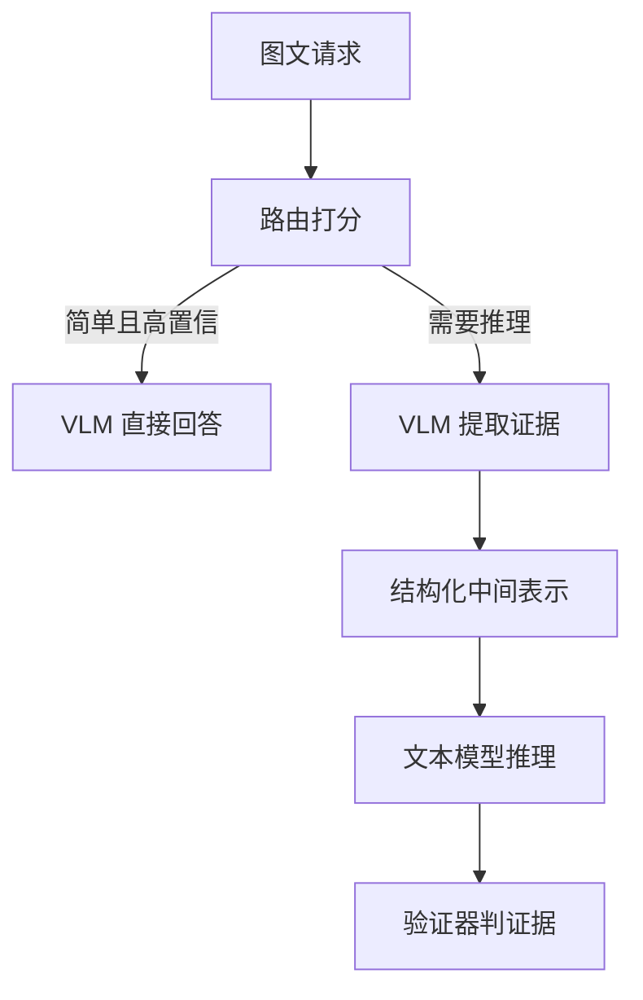
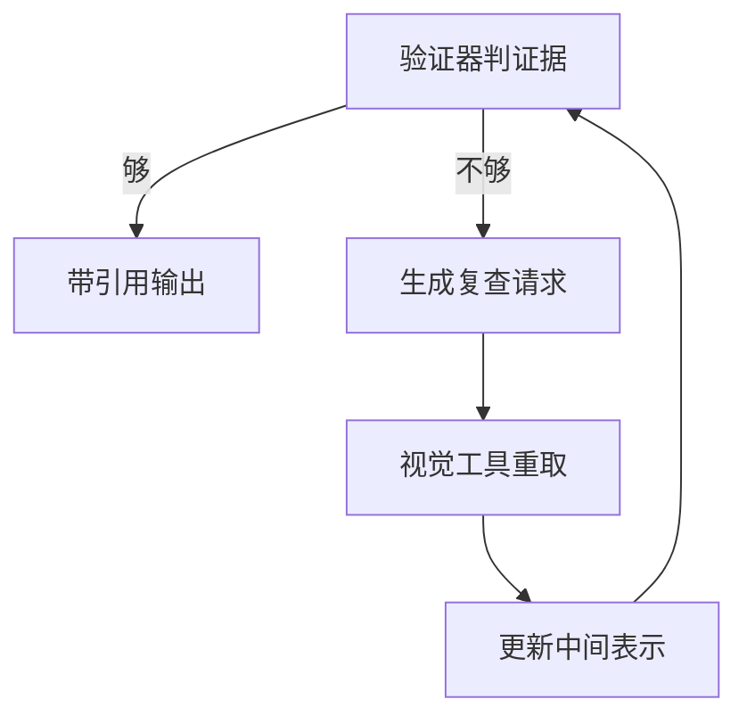

# 多模态推理系统

一句话:手上只有一个**看得见但推不动**的多模态模型和一个**推得动但看不见**的文本模型时,把它们串成一条链路——VLM 只做能被验证的视觉提取,文本模型只在给定证据里推理,中间用结构化证据连接,证据不够就回原图做定向复查。

本篇只讲这条链路。工具 schema 契约、五道校验闸、失败回喂与重试归 工具调用 篇;摆几个 Agent、怎么连线、什么时候是负优化归 多智能体 篇;视觉特征从哪一层汇入、视觉 token 预算怎么算归 VLM结构 篇;连续批处理、PD 分离的机制以及 P95/P99 这些指标本身的定义,分别归 连续批处理 篇、PD分离 篇和 推理服务指标 篇,本篇只讲它们在这条链路上怎么用;图文素材建库、跨模态检索与证据引用归计划文章 多模态RAG。

## 一、为什么要级联,以及谁负责什么

### 两个模型各缺一半

能力有限的 VLM 缺的是**推理深度**:它看得见,但多步计算、领域规则、长尾知识不在它的强项里。因为开源 VLM 的语言主干通常比同期最强的纯文本模型小一到两档(7B–13B 对上百 B),而视觉指令数据的难度和规模也远不如纯文本推理语料。

强文本模型缺的是**眼睛**:它拿到的每一条视觉信息都是别人转述的,**转述里没有的东西,对它等于不存在**。这不是"提示写得好就能补上"的问题,是信息在进入它之前就已经没了。

所以级联买到的东西只有一句话:**让每一方只做自己能被验证的那部分**。"能被验证"是重点。VLM 说"右下角价签写着 12.80,框在 (620,455,700,480)",这句可以用第二个 OCR 去核对、可以让人回看那个框;VLM 说"这家店看起来挺划算",这句谁也验不了,它只会被下游当成事实继续用。

代价也只有一句话:**多了一道有损转换**。原图变成结构化证据这一步是压缩,压掉的东西下游永远拿不回来,除非回原图重取。这是级联相对端到端 VLM 唯一的、也是最要命的新增风险,第三节整节都在处理它。

### 四个模块,以及它们绝对不该做的事

| 模块 | 负责什么 | 不该做什么 | 出错的典型症状 |
|---|---|---|---|
| VLM 与视觉工具(OCR、检测、分割、关键帧选择) | 把像素变成带位置和置信度的**事实候选** | 下结论、做算术、补常识 | 一段流畅、读起来很像真的描述 |
| 强文本模型 | 在给定证据集内做规则、计算、多步推理、组织答案 | 补充证据集里没有的视觉事实 | 把转述当原图,把幻觉推成结论 |
| 路由器 | 判断要不要视觉、要不要强模型、要不要二次取证 | 承担业务判断 | 漏判(该升级没升级)、误判(白花钱) |
| 验证器 | 跑**可执行**的检查:结构、算术、引用落域、跨源一致 | 判断"图里还有没有别的东西" | 放过高置信的视觉事实错误 |

一条容易被忽略的分工:**验证器优先是代码,不是第三个模型**。因为它的全部价值在于确定性——同一份中间表示进去必须得到同一个结论,这样才能进 CI、才能回放复现。用模型兜底只在规则表达不了时才上,而且"这次是模型判的"要落日志。

### 什么时候根本不该级联

两种任务不该级联:**一个够强的 VLM 直接就能做对的**(简单 VQA、单图描述),级联只是多两次网络往返和一次有损转换,纯亏;**视觉信息说不清也框不住的**(审美判断、氛围识别、风格相似度),中间表示表达不了,强行结构化只是把信息丢掉。判据可以写死成一句话:**能不能把这个任务需要的视觉事实,写成一张字段有限的表**。写得出来就适合级联;写不出来,该整体上 VLM,或者回去改任务定义。

成本这一侧有公开参照,但要小心口径:纯文本的模型级联里,FrugalGPT 报告在部分数据集上以最高 98% 的成本降幅追平当时最强的单个模型,Hybrid LLM 报告在不掉质量的前提下对大模型的调用减少最多 40%——这两个都是论文自报的、任务特定的数字,不能当成通用倍数搬到多模态链路上。多模态的账还更难算,因为**视觉编码那一段无论走哪条路径都躲不掉**。

## 二、中间表示:结构化证据是这条链路的地基

### 一段流畅的描述是最坏的接口

因为它把"看到的"和"推出来的"混进同一串字里,下游再也分不开。"货架上有三瓶饮料,最右边那瓶在打折"——"三瓶"是数出来的,"打折"可能是从一个模糊色块猜的,而文本模型收到的是同等可信的一句话。**视觉幻觉在这一步被漂白成了事实。** 次生问题还有两个:没有坐标就**没法回查**,复查请求无处可指;没有字段就**没法局部更新**,复查回来一条新事实,你只能整段重写描述,而不是改一个字段。

### 六类字段,少一类漏一类错

| 字段 | 长什么样 | 少了会怎样 |
|---|---|---|
| 对象与属性 | 标签、颜色/数量/状态、所属关系 | 只剩一句话,归属关系全靠猜 |
| 文字(OCR) | 逐条 value + 框 + 识别分数 | 价格、单位、编号这类要逐字对的东西没法核对 |
| 位置:框坐标,视频再加时间段 | `[x0,y0,x1,y1]` / `[t0,t1]` | 没有回查路径,定向复查根本发不出去 |
| 证据来源 | 哪个工具、哪个版本产出的 | 交叉核验时判不出两条证据是不是同源 |
| 置信度 | **逐条一个**,不是整体一个数 | 冲突时没有排序依据,只能数票 |
| 未识别项 | 看不清的区域 + 原因 + 疑似是什么 | 缺失变成不可见 |

最后一条值得单独说透:**没有"未识别项"这个字段,信息缺失就是不可见的**。文本模型面对一份没有它的证据集,只能默认"没提到 = 不存在",于是"图里其实还有第四个价签,但那一块糊了"这件事,会以"一共三个价签"的形式被当成事实用掉。把它显式写出来,文本模型才有机会说"这里不够,去把右上角放大再看一遍"——**整个复查机制是靠这个字段启动的**。

```json
{
  "schema_version": "2.1",
  "image_version": "sha256:9f3a...",
  "preproc": { "long_side": 1024, "ocr": "ocr-v3", "det": "det-v3" },
  "objects": [ { "id": "o1", "label": "价签", "bbox": [612, 430, 780, 498],
                 "attrs": { "color": "黄" }, "conf": 0.91, "source": "det-v3" } ],
  "texts":   [ { "id": "t1", "value": "12.80", "bbox": [620, 455, 700, 480],
                 "conf": 0.62, "source": "ocr-v3", "belongs_to": "o1" } ],
  "relations": [ { "subj": "t1", "pred": "位于", "obj": "o1" } ],
  "unresolved": [ { "region": [780, 430, 960, 500],
                    "reason": "分辨率不足", "guess": "疑似第 4 个价签" } ]
}
```

坐标之外还有一种更好用的引用方式:**先在图上画标记,再让模型指名道姓**。Set-of-Mark 的做法是用分割模型把图切成区域、叠上编号,模型只要说"3 号区域"就完成了定位;这条在 GPT-4V 上零样本就超过了当时 RefCOCOg 上全量微调的专用模型。放在协同链路里,它的意义是让复查请求可以写成"重看 3 号区域",而不是让文本模型去凭空拼一组它看不见的坐标。

### 置信度不能直接拿来当阈值

**模型自报的置信度普遍偏高,而且分辨力差**——公开评测里,LLM 和 VLM 的口头置信度大多数时候都是过度自信的。所以三条处理按可靠性排:**换成外部的代理量**(OCR 识别分数、检测框分数、两个独立工具是否给出一致结果、目标框的像素面积——这些是可测的外部量,不是模型对自己的评价);**离线校准**(拿一批有标注的请求统计"自报 0.9 的那批实际对了多少",拟合一张映射表,线上按表纠偏);**限制用途**(置信度只用于排序和路由,不作为"要不要执行"的唯一门槛,真门槛交给验证器里那些可执行的检查)。

中间表示同时是两个模型之间的**契约**,所以要带 `schema_version`,老版本不许就地改语义——因为缓存键、评测基线和审计日志全挂在版本上。版本悄悄漂了怎么发现,见第四节最后一小节。

## 三、动态路由与定向复查

### 三条路径,不多不少



| 路径 | 什么时候走 | 成本量级 |
|---|---|---|
| VLM 直答 | 单图、单跳、问的就是"图里有什么" | 一次视觉前向 |
| 提取证据 + 一次强模型 | 需要规则、算术或领域知识,但证据一次能取全 | 加一次文本模型调用 |
| 提取 + 复查 + 再推理 | 证据冲突、关键字段置信度低、有未识别项落在答案路径上 | 每多一轮就再加一次视觉调用 |

**判据要分两层,顺序不能反**:先看**任务需求**——这道题需不需要多步推理、领域规则、外部知识?不需要就没必要惊动强模型,这一层用规则和一个轻量分类器就够,而且判得准。再看**不确定性**——关键字段的置信度、多个视觉工具之间有没有冲突、未识别项是不是压在答案必经的路上。任务需求那一层便宜且稳定,不确定性那一层贵且噪声大,所以先便宜的再贵的。

### 路由器的样本和标签怎么造

关键认知:**标签不该由人来标"这条该走哪条路"**,因为人也不知道便宜路径够不够用。正确做法是**离线把每条路径都跑一遍**,记下每条路径的质量分、成本和时延,再由这三个量推出标签。

$$
y = \mathbb{1}\left[\, q_{\text{强}} - q_{\text{弱}} > \lambda \cdot \Delta c \,\right]
$$

人话:只有强链路多挣的质量,超过它多花的成本乘一个折算系数时,这条样本才标成"该升级"。$\lambda$ 就是"愿意为一分质量付多少钱"的旋钮——**调它等于在质量-成本曲线上换工作点,而不是重新训一个模型**,所以线上按预算调档只改这一个数。质量分从哪来?有标准答案的任务直接自动判分,开放式的用一个固定的评审模型或人工偏好对,RouteLLM 那条路线就是直接拿偏好数据训路由器。

三个坑必须一起处理。**选择偏差**:线上日志里只有"实际走过的那条路"的结果,没走的那条永远没有标签,所以要**留一小比例流量随机分流**,专门用来产出无偏样本。**冷启动**:先用规则跑起来收集数据,别指望第一天就有分类器。**分布漂移**:图片来源、清晰度、题型都会变,路由器要定期重训,并盯着阈值对应的实际升级率有没有跑偏。

### 两类错误的代价不对称

**漏判(该升级没升级)比误判(白升级)贵得多**。误判只是多花一次强模型的钱;漏判是直接输出一个错答案,而且带着高置信度。所以阈值应该偏保守,评测时也不能只看"路由准确率"——那个指标会奖励"永远走便宜路径"的策略。要同时看**漏判率、误判率和升级比例**三个数。

### 证据不够时:发定向复查,不要让两个模型自由对话

"两个模型互相讨论到达成一致"这条路基本没用:纯文本模型手上没有原图,**没有外部反馈的自我纠错在推理任务上并不能稳定提升,有时反而变差**;此前显示有效的一批结果,拿掉"用标准答案判断要不要改"这个外挂之后收益就消失了。放到这里,外部反馈只有一个来源——**回原图重新取证**。

所以复查请求必须是一条**可执行的动作**,而不是一句抱怨。四个字段:动作名 + 目标区域或时间段 + 期望产出 + 为什么要查。



这张图接的是上一张的末端:**回路只在验证器判定证据不足时才转,而且必须有轮数上限**;两个模型之间没有自由对话的边。

| 复查动作 | 什么时候发 | 期望产出 |
|---|---|---|
| 放大指定区域重新 OCR | 关键文字的识别分数低,或该区域进了未识别项 | 该区域的逐条文字 + 新分数 |
| 换一个独立工具重取 | 两条证据冲突,或结论要害押在一条低分证据上 | 同一区域的第二份读数 |
| 取相邻帧 / 换关键帧 | 视频里动作或状态判不准 | 指定时间段的补充帧证据 |
| 要求逐项枚举并计数 | 答案依赖"一共有几个" | 带框的完整列表,不允许省略 |

"放大再看"不是土办法,它是有据可依的:高分辨率、目标很小的图上,即便语言主干强得多的模型也照样看不清细节,把区域裁出来重看是当前最直接的补救,V\* 这类工作就是把"该看哪、怎么放大"做成了一个受 LLM 引导的搜索过程。

**复查要有预算**:通常 1–2 轮封顶,而且每一轮必须**缩小不确定集合**——如果一轮下来未识别项没减少、冲突没消解,再来一轮也不会。超预算就降级成"信息不足,还缺 XX",绝不允许把"系统不知道"伪装成"系统知道"。

### 文本模型看不见图,它到底能查什么

能查的是**证据集内部的自洽性**,查不了的是**证据集外的事实**。这条线划清楚,面试里这个问题就答完了:

| 能查 | 怎么查 |
|---|---|
| 算术与量纲 | 单价 × 数量对不对得上总价、百分比加起来是不是 100、单位有没有混 |
| 结构完整性 | schema 必填项是否齐全、引用的 `id` 是不是真在证据集里 |
| 引用落域 | 结论引用的框是否落在它声称的对象上,而不是随手编一个坐标 |
| 跨源一致 | 同一区域两个独立工具的读数是否吻合,同源的要按一条计权 |
| 与领域规则冲突 | 价格越界、日期不可能、状态组合非法 |
| **查不了** | "图里还有没有第四件商品"——证据集里没有的东西不可判定,只能发复查 |

工程上最成型的一套是 Woodpecker 式的五步:抽取结论里的关键概念 → 针对每条概念生成一个视觉问题 → 用视觉工具回答 → 汇成视觉断言 → 拿断言改写原结论。它是训练无关的后置修补,而且中间产物可读,所以每一步都能单独评测——这正是级联结构相对端到端 VLM 唯一的、实打实的好处。

### 怎么区分"文本模型推理错"和"VLM 最初就看错"

**离线定因用替换实验**,这是唯一干净的办法:把中间表示换成**人工标注的金标证据**、重跑文本模型,还错就是推理错;反过来只把文本模型换成更强的一档(证据仍用 VLM 的),还错就是感知错;两边都换才对,说明两处都有问题,**先修感知,因为它在上游**。

**线上只能定位不能定因**,靠三条:结论引用的证据 `id` 在不在证据集里(不在 → 文本模型编的);引用那条证据的置信度和跨源一致性如何(低 → 大概率感知错);同一份中间表示重跑一次结论稳不稳(不稳 → 推理侧的随机性)。把这三条落进日志,离线才有得可查。

## 四、效率、评测与最危险的失败模式

### 延迟账本:先砍轮数,再砍单步

$$
T_{\text{e2e}} \approx T_{\text{route}} + T_{\text{vis}} + T_{\text{text}} + k \cdot \left(T_{\text{vis}}' + T_{\text{text}}'\right)
$$

$k$ 是复查轮数。这个式子只说一件事:**复查轮数是乘法项,单步耗时是加法项**,所以优化第一顺位永远是把 $k$ 压到 0 或 1——办法是让第一次取证就取全(按题型预判要哪些字段),而不是让某个 OCR 快 20 毫秒。这和 Agent 链路里"先减跳数再优化单个工具"是同一条道理,那一侧的展开归 工具调用 篇。

### 缓存:三层都能缓,但键错一个字段就是事故

| 缓存什么 | 命中场景 | 失效由什么触发 |
|---|---|---|
| 图像编码结果 / 视觉特征 | 同一张图被多轮追问 | 会话结束或容量淘汰 |
| OCR、检测、分割结果 | 同图不同问题 | 工具版本升级 |
| 整份结构化中间表示 | 同图同题型重复请求 | schema 版本或工具版本变更 |

缓存键至少要有四项:**图片内容哈希 + 预处理配置 + 工具/模型版本 + 租户**。少哪一项都要出事,其中最容易漏的是预处理配置——**同一张图按长边 512 和长边 1024 预处理,OCR 出来根本不是同一份结果**,复用等于拿错分辨率的读数去回答;少了租户就是越权读到别人的图。还有两招纯工程的提速,没有论文,就是实践:**预取**——用户一上传就开始编码,把视觉那一段挪到他还在打字的时间里,这对端到端感知延迟的改善往往比任何 kernel 优化都大;**同配置组批**——只有预处理配置一致的请求才能进同一个视觉批次,所以线上最好把分辨率收敛成有限几档,否则批次永远凑不满。批次怎么调度、显存怎么排,归 连续批处理 篇。不依赖视觉结果的准备工作(检索材料、用户画像、模板)应该和视觉提取**并发**跑,别排成一条直线。这三招值不值得上,判据不是缓存命中率好不好看,而是**端到端 P95/P99 有没有真的降下来**——命中率高但只命中了本来就快的那批请求,尾延迟一点不会动。

### 直播这类低时延场景怎么砍链路

思路是**把不确定性从在线挪到离线**,四刀按顺序砍:

1. **砍掉复查轮**:$k$ 强制为 0,把复查改成异步的事后修正——先出结果,几百毫秒后如果修正到了就替换字幕/标注。
2. **路由退化成规则**:模型路由本身就要几十毫秒,直播场景直接按题型和画面类型硬编码。
3. **降采样与增量**:按固定间隔抽帧,并且只对**画面变化的区域**重新取证,静止区域复用上一帧的证据。
4. **分级输出**:先流式给出高置信的那部分,低置信字段标成"识别中",别等全链路收敛。

再给一个 800 ms 端到端预算的分法示意(**数字是示意,必须按自己的链路实测**):抽帧与预处理 50 ms、视觉提取 250 ms、序列化与路由 30 ms、文本模型首 token 200 ms、其余生成与渲染 270 ms。这里没有给复查留位置,这就是低时延场景的本质取舍——**用可纠错性换时延**。

### 两个模型升级之后,怎么发现中间表示悄悄不兼容了

危险在于**它不会报错**:字段还在、JSON 还合法,只是 `label` 的取值集合换了一批,或者 `conf` 从"检测分数"变成了"校准后概率"。四道防线:

- **契约测试**:一份固定的 golden 图片集,每次升级重放,对中间表示做**逐字段 diff**,不只比最终答案——最终答案可能碰巧还对。
- **字段级分布监控**:每个字段的非空率、枚举取值分布、置信度直方图、未识别项比例。**分布漂移比准确率先动**,因为准确率是被多个字段平均掉的结果。
- **版本矩阵**:VLM 版本 × 文本模型版本 × schema 版本,只允许声明过兼容的组合上线,不兼容就并行跑两个 schema 版本做过渡。
- **影子流量**:新版本先只写日志不出结果,和老版本逐条比对,差异超阈值才人工介入。

### 分层评测:五层各测各的

| 层 | 测什么 | 典型口径 |
|---|---|---|
| 视觉事实 | 提取出的对象、文字、数量对不对 | 逐字段准确率;对象幻觉可用 POPE 式的"图里有没有 X"二分探针,负样本要按随机/高频/共现三档分开报 |
| 证据定位 | 框和时间段指得准不准 | IoU 达标率、引用落域率 |
| 路由 | 该升级的有没有升级 | 漏判率、误判率、升级比例三个一起看 |
| 最终答案 | 端到端质量 | 任务成功率;图文纠缠类错误可参考 HallusionBench 的成对提问设计 |
| 时延与成本 | 每请求花了多少 | P95/P99、每请求视觉调用次数、复查轮数分布 |

**只看最后一层会被平均数骗**:感知层掉了 5 个点,可能被文本模型的常识兜回来一部分,端到端只掉 1 个点,等到某天题型一变就集中爆发。

### 最危险的失败模式:高置信但视觉事实错误

它危险不是因为频率高,而是因为**下游没有任何线索该怀疑它**:证据结构完整、置信度 0.95、算术自洽、答案通顺,验证器全绿。公开诊断也支持这条——HallusionBench 那套 346 张图、1129 道题的成对提问里,当时最强的 GPT-4V 只拿到 31.42% 的成对准确率,其余模型全部低于 16%——而这类错误在答案文本层面读起来完全正常,正是这一点让它们在链路里一路畅通。

四条应对,按有效性排:**保留原始区域和图片版本**,任何时候都能回查——没有这条,后面三条都无从谈起;**关键字段跨源交叉核验**,价格、数量、日期这类押着结论的字段强制用第二个独立工具再读一遍,不一致就进复查;**允许文本模型主动发定向复查**,并把"它发过复查"这件事本身记进日志,高频复查的区域类型就是下一轮该改进的感知短板;**高风险请求走人工**,金额、医疗、合规类的判断,置信度再高也设人工闸门。

反过来有一条必须写在脸上:**不要指望纯文本模型靠语言常识纠正所有视觉幻觉**。它能拦住"三件商品单价加起来对不上总价"这种自相矛盾,拦不住"图里其实是四件商品"这种它压根看不见的事。

## 五、面试考点串联

| 高频问法 | 本文哪一节 |
| --- | --- |
| 给一个能力有限的多模态模型和一个更强的纯文本模型,协同推理系统怎么设计?模块分工、信息传递、动态路由、纠错和性能优化各怎么做,收益和风险是什么? | 一、二、三、四 |
| 路由器的训练样本和标签应该怎么构造? | 三(离线跑遍全部路径 + 成本感知标签 + 随机分流去偏) |
| 怎么区分"文本模型推理错"和"VLM 最初就看错"? | 三(离线替换实验;线上三条定位线索) |
| 强文本模型看不到原图时,能采用哪些可靠的纠错机制? | 三(能查什么/查不了什么那张表;Woodpecker 式五步) |
| 直播这类低时延场景怎么缩短协同链路? | 四(四刀 + 预算示意) |
| 两个模型升级后,怎么发现中间表示发生了不兼容变化? | 四(契约测试、字段级分布监控、版本矩阵、影子流量) |
| 中间表示为什么必须是结构化证据,而不是一段自然语言描述?哪个字段最不能省? | 二(六类字段;未识别项) |
| 这条链路最危险的失败模式是什么?为什么它比一般的错误更难兜? | 四(高置信但视觉事实错误) |
| 补充题:让两个模型互相讨论到达成一致,为什么通常不管用? | 三(无外部反馈的自我纠错) |
| 补充题:VLM 自报的置信度能直接当路由阈值用吗?不能的话用什么替代? | 二(外部代理量、离线校准、限制用途) |
| 补充题:图片结果的缓存键里为什么必须带预处理配置? | 四(同图不同长边不是同一份 OCR) |
| 补充题:什么样的任务不该做级联,直接上一个 VLM 更好? | 一(能不能写成一张有限字段的表) |

延伸阅读顺序:VLM结构(视觉怎么接进语言模型)→ 本篇(两个模型怎么协同)→ 工具调用(动作怎么落地与兜底)→ 多智能体(要不要拆成多个 Agent)。

## 相关文献

- FrugalGPT: How to Use Large Language Models While Reducing Cost and Improving Performance — [arXiv:2305.05176](https://arxiv.org/abs/2305.05176)
- Hybrid LLM: Cost-Efficient and Quality-Aware Query Routing — [arXiv:2404.14618](https://arxiv.org/abs/2404.14618)
- RouteLLM: Learning to Route LLMs with Preference Data — [arXiv:2406.18665](https://arxiv.org/abs/2406.18665)
- Visual Programming: Compositional visual reasoning without training(VisProg,程序化编排视觉模块)— [arXiv:2211.11559](https://arxiv.org/abs/2211.11559)
- ViperGPT: Visual Inference via Python Execution for Reasoning — [arXiv:2303.08128](https://arxiv.org/abs/2303.08128)
- MM-REACT: Prompting ChatGPT for Multimodal Reasoning and Action(文本模型 + 视觉专家池的级联范式)— [arXiv:2303.11381](https://arxiv.org/abs/2303.11381)
- Set-of-Mark Prompting Unleashes Extraordinary Visual Grounding in GPT-4V — [arXiv:2310.11441](https://arxiv.org/abs/2310.11441)
- V\*: Guided Visual Search as a Core Mechanism in Multimodal LLMs(定向放大与区域重看)— [arXiv:2312.14135](https://arxiv.org/abs/2312.14135)
- Woodpecker: Hallucination Correction for Multimodal Large Language Models(训练无关的五步后置校正)— [arXiv:2310.16045](https://arxiv.org/abs/2310.16045)
- Evaluating Object Hallucination in Large Vision-Language Models(POPE 探针)— [arXiv:2305.10355](https://arxiv.org/abs/2305.10355)
- HallusionBench: An Advanced Diagnostic Suite for Entangled Language Hallucination and Visual Illusion in LVLMs — [arXiv:2310.14566](https://arxiv.org/abs/2310.14566)
- Large Language Models Cannot Self-Correct Reasoning Yet(无外部反馈的自我纠错为何失效)— [arXiv:2310.01798](https://arxiv.org/abs/2310.01798)
- Overconfidence is Key: Verbalized Uncertainty Evaluation in Large Language and Vision-Language Models — [arXiv:2405.02917](https://arxiv.org/abs/2405.02917)
