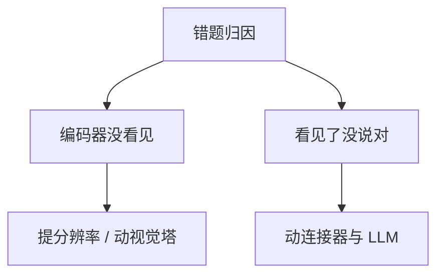

# 多模态训练

一句话:多模态训练要解决的是**两个各自训好的模型说不到一块去**——视觉塔和语言模型的坐标系互不相通,训练要做的是备好图文数据、选一组对齐信号、按阶段决定谁能动谁不能动,最后用分层评测确认模型是"真看见了"而不是"说得顺"。**这件事没有唯一配方**,本篇讲的就是那些配方各自在解什么问题。

结构侧的问题——视觉特征在哪一层汇入、连接器怎么设计、要不要原生早融合——见 VLM结构 篇;视觉塔本身怎么训(ViT、CLIP 的对比机制、SigLIP、MAE、DINO)见 视觉编码器 篇。本篇只管数据、目标、阶段、系统瓶颈、评测这五件事。

## 一、图文数据治理:训练信号的上限在这里定

### 一条样本要留住什么

一条图文样本至少保留四样东西:**图像身份**(能去重、能按实体切分的稳定 ID)、**原始文本**、**区域与时间关系**(框坐标、帧号、时间戳)、**来源与许可**。因为后面每个训练目标都从这四样里取信号——对比目标只要图和文,定位目标非要框不可,视频目标非要时间戳不可,合规审计要来源。这些字段在入库时丢了,后面任何阶段都补不回来,只能重新采一遍。

数据配比本身也是变量,不是"能收多少收多少"。MM1 的大规模消融把结论写在了摘要里:**图文对、图文交错语料、纯文本三种数据的配比是拿到 SOTA few-shot 结果的关键**。直觉上不难理解——图文对教"这张图对应哪句话",交错语料教"多张图和上下文怎么混着读",纯文本负责不让语言能力退化。

### 三把清洗刀,和它们各自的反噬

**第一把:按图文相似度硬过滤。** LAION-5B 的口径最具体:用 CLIP ViT-B/32 算图文余弦相似度,英文对低于 0.28、其余语言低于 0.26 全部丢弃,从约 500 亿张 Common Crawl 候选里砍掉约九成。

这一刀的反噬有两层,面试常问的就是这个:

- **它请了一个已有模型当唯一裁判。** 相似度低的那批恰恰包含"难但正确"的样本——小字、图表、罕见概念、长而具体的描述,CLIP 本来就不擅长它们,于是打分低、被删掉。删完的数据集刚好绕开了现有模型的盲区,**下一代模型只能继承同一批盲区**。
- **它奖励字面重合而不是视觉理解。** T-MARS 的测量是:LAION 里近 40% 的图片,图中印着的文字和 caption 高度重合。这类样本给高分,是因为模型在做 OCR,不是在看图。把"文字压过视觉内容"的那批剔掉之后,DataComp 中等规模上 ImageNet 涨 6.5 分、VTAB 涨 4.7 分。

所以结论不是"别用相似度",而是**别让它单独决定去留**:要和分辨率、图中文字占比、caption 长度与句法、来源域这些正交信号一起投票。

**第二把:语义去重。** 网页图文里有大量同一张图的裁剪版、水印版、转载版,留着只会让某几个模式的梯度被反复加权。SemDeDup 在 LAION 子集上删掉 50% 数据,性能损失很小,训练时间直接减半。关键是**必须在嵌入空间做**——像素哈希抓不到"同一场景换个水印、换个裁剪"。

**第三把:重写 caption。** alt-text 大多是关键词堆,不适合训生成。ShareGPT4V 的路子是先用 GPT-4V 产 10 万条高质量描述,再拿它训一个描述模型扩到 120 万条。代价很直接:**描述模型自己会幻觉**,合成描述里"看着合理但图里没有"的细节会原样变成训练标签。所以合成 caption 必须配抽检和一致性校验,不能无限自举——每一轮自举都把上一轮的幻觉当成事实固化进去。

### 跨集泄漏:按实体隔离,不按样本隔离

同一段视频的相邻帧、同一份文档的不同页、同一张图的不同裁剪,如果按样本随机划分,验证集里几乎必然出现训练集见过的画面。**切分单位应该是图像 / 文档 / 视频这个实体**,再往上是拍摄事件或来源域。

但泄漏的杀伤力分场景,这一点值得记准:

- **大规模预训练里少量泄漏影响有限。** CLIP 自己做过重叠分析:4 亿训练对与 35 个评测集的重叠中位数 2.2%、均值 3.2%,剔除重叠后总体准确率很少变动超过 0.1%,最大的一例是 Birdsnap 涨 0.6%(它的重叠率 12.1%,排第二)。
- **致命的是微调与评测那一侧。** 指令数据只有几十万条,单条样本的权重比预训练大几个数量级,一次泄漏就足以把某个基准刷上去。
- **最隐蔽的一类泄漏在语言侧。** MMStar 那篇的测量:**不给图**,GeminiPro 在 MMMU 上仍有 42.9%,Sphinx-X-MoE 有 43.6%。也就是说一部分"多模态成绩"是语言模型背下来的常识。所以评测集也要查一遍"把图去掉还能答对多少"。

### 许可、隐私与可复现

LAION-5B 交付的是 **URL 加元数据,不是图片本身**,论文自己写明无法保证这些链接还在。这推出两条工程要求:复现要锁下载快照与时间戳,否则两次实验的训练集就不是一份;删除请求要能沿 URL 或图像 ID 反查,并从训练集与后续训练里剔除。

数据集另外给了水印概率和 NSFW 概率两个标签,因为**这两类内容模型会直接学走**(生成侧尤其明显,水印会长在输出图上)。人脸、车牌、票据、聊天截图这类要在入库前过检测器,按策略打码或丢弃——等评测阶段才发现,已经在权重里了。通用的数据清洗与配比方法见 数据工程 篇,本节只讲图文特有的那几条。

## 二、对齐目标:四种信号各解决什么问题

| 目标 | 一句话 | 学到什么 | 单独用的短板 |
|---|---|---|---|
| 图文对比(ITC) | 批内 $N\times N$ 认领配对 | 全局向量空间的配对结构,两塔可离线编码 | 只管整体像不像;计数、方位、属性绑定学不到 |
| 图文匹配(ITM) | 一对图文过融合层做二分类 | 细粒度判别,能用跨模态注意力看局部 | 必须逐对前向、不能预计算;没有难负例就没信号 |
| 视觉条件生成 | 看着图预测下一个 token | 把视觉表示真的接到语言输出端 | 容易学成"说得顺"而不是"说得对" |
| 多模态指令监督 | 按任务与对话模板回答、定位、调工具 | 任务遵循与输出格式 | 能力上限由数据覆盖和模板偏差决定 |
| 偏好 / 可验证奖励 | 按人类偏好或规则打分再优化 | 修风格、修事实、修安全 | 可选后训练;评审看不到图就是在奖励幻觉 |

对比目标的机制(InfoNCE、温度、批内负例、假负例工程)见 对比学习 篇,指令阶段的损失掩码与遗忘对策见 SFT 篇,本节只讲**这些目标之间的分工与叠加时机**。

### 对比和生成为什么常常要一起用

两者的监督方向根本不同:**对比是判别式的,把配对推近、不配对推远,信号粗但直接作用在"分不分得开"上;生成是逐 token 的,信号细,但它只要求下一个词概率高,不要求视觉表示和文本空间对齐。**

于是各自单独用会得到两种残缺的模型:只做对比,得到 CLIP 那种能检索、开不了口的模型;只做生成,视觉表示可能压根没对齐,语言模型就退化成靠语言先验作答——这正是 MMStar 测出来的病,遮住图还能答对四成。

BLIP-2 的第一阶段是"一起用"的标准样板:同一个 Q-Former 上跑三个目标,靠**换注意力掩码**切换——ITC 用单模态掩码(query 和文本互相看不见),ITG(图像条件文本生成)用因果掩码(文本只能看 query 和自己前面的词),ITM 用双向掩码(全都能互相看)。三个目标共享一套参数,分别负责拉开空间、接通输出端、和做细粒度判别。

### ITM 的负例必须是难负例

随机配对的负例太好认:一张狗的图配"一辆红色卡车",看一眼全局语义就能否掉,梯度很快归零,ITM 就白算了。ALBEF 的做法是**用 ITC 的相似度当采样分布,在批内挑最像的那条当负例**——给每张图挑一条最像的错文本,给每条文本挑一张最像的错图。这样 ITM 被逼着去看"这只狗是不是在草地上、是不是三只",而不是"这是不是狗"。代价是难负例里混进真配对(假负例)的概率同步上升,批越大越明显。

### 什么时候叠加,按产品接口定

不按"论文都这么做"定:只做图文检索,ITC 一个就够,而且要的正是双塔可预计算这个性质;要做重排,再加 ITM;要开放式问答,生成与指令监督是必需的;要控风格、降幻觉、保安全,才轮到偏好训练。**每加一个目标,就多一份数据成本和一次训练不稳定的风险**,所以"能不能不加"永远是第一个问题。

## 三、分阶段与冻结:为什么不存在唯一配方

### 五个代表模型,第一阶段训的对象全都不一样

| 模型 | 阶段与训练对象 |
|---|---|
| CLIP | **一个阶段**。4 亿图文对端到端训双塔,不冻任何东西,也没有第二阶段 |
| BLIP-2 | 两阶段。① 冻图像塔,只训 Q-Former,ITC + ITG + ITM;② 冻 LLM,训 Q-Former 做生成 |
| LLaVA-1.5 | 两阶段。① 558K 图文对,**只训 MLP 连接器**,视觉塔与 LLM 全冻;② 665K 指令数据,训连接器 + LLM,视觉塔仍冻 |
| Qwen-VL | 三阶段。① 50 亿对清洗到 14 亿,224px,**冻 LLM**,训视觉塔与适配器;② 448px,**全部解冻**做多任务预训练;③ 35 万条指令数据,**冻视觉塔**,训 LLM 与适配器 |
| Qwen2-VL | 三阶段。① **只训 ViT**;② 全部解冻;③ 锁 ViT,只微调 LLM |

把第一列横着读一遍就够了:第一阶段 CLIP 全训、BLIP-2 训中间模块、LLaVA 训连接器、Qwen-VL 训视觉侧、Qwen2-VL 只训 ViT。**"VLM 训练 = 对齐预训练 + 指令微调 + RLHF 三段式"这种背法是错的**,五个模型没有一个完全符合。

成本口径顺便记两个,方便判断量级:LLaVA-1.5 的 13B 全程在单台 8×A100 上约一天(预训练约 6 小时 + 指令微调约 20 小时);Qwen2-VL 前两个预训练阶段合计约 1.4 万亿 token(一阶段约 6000 亿、二阶段约 8000 亿,含图像 token,但只对文本 token 计损失)。**差着三个数量级的两件事,不可能共用一张配方。**

### 分岔由三个变量决定

1. **产品接口是什么。** 输出一个向量(检索)还是一段话(问答)。CLIP 不需要第二阶段,因为它的输出端就没有解码器。
2. **哪些模块是现成的、允许改多少。** BLIP-2 把两端都锁死是为了压可训练参数——论文口径是比 Flamingo-80B 少 54 倍可训练参数,零样本 VQAv2 反而高 8.7 分;代价是中间那个模块必须自己撑起两轮训练。LLaVA 允许改 LLM,连接器就能退化成一层 MLP。
3. **要补的能力缺在哪一层。** Qwen-VL 第二阶段把分辨率从 224 提到 448 并全部解冻,是因为文字读取和定位这类能力在 224px 下**根本没有原料**。

### 冻结策略:先归因,再决定动谁

"为什么必须分阶段""连接器为什么是唯一的随机初始化模块""全解冻为什么会训崩"这几条是结构侧的论证,见 VLM结构 篇。训练侧要补的是**怎么判断该动哪一层**——判据是把错题先归因,而不是凭"冻着更安全"。

归因有两个便宜的判别实验:把图放大或换高分辨率重测,分数跳起来说明是**编码器没看见**;把图换成一段足够详细的文字描述喂给纯语言模型,能答对说明视觉信息其实够用,病在**没说对**这一侧。前者才轮到动视觉塔,后者动连接器和 LLM,顺序反了就是白烧算力。

冻结本身省的是梯度与优化器状态——按 Adam 口径这两项通常是参数量的几倍显存,它直接决定同样的卡能开多大 batch、多高分辨率(显存账见 显存管理与OOM 篇)。

### 视觉塔冻不冻,怎么用实验判断

固定数据、固定有效 token 预算、固定训练步数,**只改视觉塔的可训练范围**,跑四组对照:

| 组 | 做法 | 主要看什么 |
|---|---|---|
| A | 全冻 | 基线;显存与吞吐的上限参照 |
| B | 只解冻最后 N 层 | 高层语义能不能补上,底层特征保住没有 |
| C | LoRA | 用最小的更新幅度换多少收益(机制见 LoRA 篇) |
| D | 全量更新 | 天花板在哪,以及代价有多大 |

每组读四类指标,缺一不可:**目标域任务分**、**旧视觉任务的回归**(遗忘的代价)、**训练稳定性**(loss 尖峰、grad norm 走势)、**显存与吞吐**。判据不是"哪组分最高",而是**涨的那几分值不值那份显存和那份遗忘**。

两个必须同时做的控制:视觉侧用比 LLM 更小的学习率(它已经训好了,大步长会把特征打散),以及四组跑到相同的有效 token 数——否则比的是训练量,不是冻结策略。

## 四、系统瓶颈与分层评测

### 视觉 token 膨胀:训练侧疼的地方和推理侧不一样

视觉 token 数对边长是平方关系、对帧数是线性关系(账本公式见 VLM结构 篇,切图方案见 任意分辨率与高分辨率 篇)。但**训练侧和推理侧疼的不是同一处**:推理侧疼的是首 token 延迟和 KV cache;训练侧疼的是**激活显存**——反向传播要留住每层的激活,序列一长,激活量按层数乘序列长度增长,注意力那部分还带平方项。

Qwen2-VL 的两个工程读数说明这件事是被当硬预算管的:单图 token 上限写成 `max_pixels = 16384 × 28 × 28`;视频按 2 fps 抽帧后**动态压低每帧分辨率,把整段视频的 token 总数压在 16384 以内**。注意这是**牺牲每帧清晰度来保住帧数**的取舍,不是免费午餐——要判断"先后顺序"就得多要帧,要读清画面里的字就得多要分辨率,两者共用同一个预算。

### 样本长度方差:多模态训练特有的病

纯文本语料可以切成等长块,图文样本不行:一张 224px 的图是几十个 token,一份高分辨率文档是几千,一段视频上万,**同一批数据里长短差两三个数量级**。按最长样本 padding 的浪费可以直接算:

$$
\text{pad 浪费率} = 1 - \frac{\sum_i L_i}{B \cdot \max_i L_i}
$$

意思是:一个 batch 真正有效的计算量,只是"所有样本实际长度之和"除以"批大小乘最长样本长度"。代进一组现实数字——32 条样本里 31 条是 100 token、1 条是 10000 token——有效率只有约 4%,**九成以上的算力花在 pad 上**。更麻烦的是峰值显存由最长那条决定,为了不 OOM 只能把 batch 压得很小,短样本那部分吞吐也一起丢了。

三种手段,各有各的坑:

| 手段 | 做法 | 要注意什么 |
|---|---|---|
| 分桶 | 按 token 数分进若干长度桶,同桶内组 batch | 桶内采样破坏随机性;长度和数据类型相关时(文档都很长)会让某类数据集中在某些 step,要靠桶间随机调度补回来 |
| 动态批处理 | 不固定 batch size,固定**每批 token 总数** | 有效 batch size 每步都在变,学习率与梯度累积要按实际 token 数归一,否则等于在偷偷改学习率 |
| 序列打包 | 把多条短样本拼进一条定长序列 | **必须切断跨样本注意力**,否则一张图会去看另一条样本的文本,学到的是错关联。无交叉污染的打包在 BERT 二阶段预训练上报到约 2 倍加速 |

还有一层容易被忽略:**视觉塔与 LLM 的计算量比例随分辨率漂移**。低分辨率时视觉塔可以忽略不计,高分辨率或长视频时它可能反过来成为主要开销,这时按 LLM 切的并行方案未必还合适(并行方案见 并行策略 篇,长序列的切法见 长上下文训练 篇)。

### 分层评测:一个总分说明不了任何事

| 层 | 问的是 | 典型口径 |
|---|---|---|
| 感知 | 编码器看没看清 | 目标 / 属性 / 计数 / OCR / 位置的细粒度题;也可直接测视觉特征的可分性 |
| 对齐 | 图文空间对得齐不齐 | 图文检索 R@K、ITM 分数的校准。注意 image-image 与 image-text 相似度不在同一量程,别用同一个阈值(见 视觉编码器 篇) |
| 生成忠实度 | 说的和图对不对得上 | CHAIR:统计生成描述里提到、但图中并不存在的物体比例 |
| 幻觉 | 会不会硬答 | POPE:轮询式提问"图里有没有 X",正负例配平,规避提示词与生成风格带来的干扰 |
| 综合推理 | 会不会做需要学科知识的题 | MMMU:6 大学科、30 个学门、183 个子领域、1.15 万题,30 种图像类型 |
| 时延与成本 | 值不值 | 视觉 token 数、首 token 时延、P95/P99、峰值显存、每样本训练成本 |

**怎么说明"跨模态对齐得更好",而不是只报最终回答分数**——最终分是视觉能力、语言能力、指令遵循、评分器偏好四件事的合成,涨了也说不清哪儿涨的。三条可操作的做法:

1. **拆层看**。上表的感知层和对齐层不经过语言输出端,它们涨了才叫视觉侧真的变好。
2. **做去图对照**。同一题把图去掉再问一遍,**"给图"减"不给图"的分差**才是视觉真正贡献的部分。MMStar 正是靠这个测出不给图也有四成多的分,只报"给图"分数时,涨的可能全是语言先验。
3. **按错误类型分类而不是只看总分**。把错题分成看不清(感知)、看清了说错(忠实度)、答非所问(指令)、格式坏(解析)。总分持平但错误结构变了,通常说明改动有效、只是被另一项抵消。

### 多模态幻觉:训练信号怎么造,评测怎么保持独立

训练侧三件事,按性价比排序:

- **先别在数据里教它幻觉。** 合成 caption 和"图里根本看不到的描述"是幻觉最直接的来源,第一节的抽检就是为这个。
- **必须有能说"看不出来"的样本。** 模糊图、被遮挡的对象、问了图里没有的东西,标准答案就是拒答或说明不确定;否则模型学到的规则是"任何问题都得给一个答案"。
- **偏好信号必须带视觉证据。** LLaVA-RLHF 的做法叫 factually augmented RLHF——给奖励模型额外喂图像描述和标准选项,理由就是纯文本奖励模型评不了事实、会被 reward hacking。RLHF-V 走另一条路,收**段落级的人工纠正**而不是整句偏好,1.4k 条标注就把基座模型的幻觉率降了 34.8%,而 LLaVA-RLHF 需要 10k 条才达到相当水平。**细粒度纠正比粗粒度偏好排序省数据**,因为它直接指出错在哪一段(奖励模型机制见 RLHF与RM 篇,离线偏好见 DPO 篇,多模态 RL 的展开见 多模态RL 篇)。

评测侧的独立性有两条硬要求:**评审必须看得到图、或拿到可核验的视觉证据**,拿纯文本 judge 打分等于在给流畅度打分;以及**幻觉集要和训练数据同源隔离**,用同一批图训又用同一批图评,测的是记忆不是忠实度。OCR、定位这类有标准答案的任务可以直接用规则打分,不必训奖励模型。

## 五、面试考点串联

| 高频问法 | 本文哪一节 |
| --- | --- |
| VLM 的典型训练流程是什么(数据、架构、对齐目标、分阶段、评测)?为什么不能把所有模型概括成同一个固定配方? | 一~四通读;三(五模型阶段表 + 三个分岔变量);架构选择见 VLM结构 篇 |
| 对比损失和生成损失分别负责什么?什么时候需要一起用? | 二(目标表、对比与生成一节) |
| 视觉塔应该冻结、部分解冻还是全量训练?怎么用实验判断? | 三(先归因,再四组对照实验) |
| 高分辨率图像和长视频会改变哪些训练瓶颈? | 四(视觉 token 膨胀、样本长度方差) |
| 多模态幻觉应该怎么构造训练信号、怎么做独立评测? | 四(幻觉一节) |
| 怎么衡量"跨模态对齐得更好",避免只看最终回答分数? | 四(分层评测表、去图对照) |
| 补充题:用 CLIP 相似度清洗图文数据有什么反噬?该配哪些信号一起用? | 一(三把清洗刀) |
| 补充题:图文数据的训练集和评测集该按什么单位切?按样本随机划分会漏掉什么? | 一(跨集泄漏) |
| 补充题:ITM 的负例怎么造才有信号?难负例的代价是什么? | 二(难负例) |
| 补充题:一个 batch 里样本长度差两三个数量级,训练上怎么处理? | 四(分桶 / 动态批处理 / 打包) |
| 补充题:合成 caption 能不能无限自举?代价是什么? | 一(重写 caption) |

阅读顺序建议:视觉编码器(眼睛怎么来的)→ VLM结构(怎么接上)→ 本篇(怎么把它训出来)。

## 相关文献

- Learning Transferable Visual Models From Natural Language Supervision(CLIP,含数据重叠分析)— [arXiv:2103.00020](https://arxiv.org/abs/2103.00020)
- Align before Fuse: Vision and Language Representation Learning with Momentum Distillation(ALBEF,ITM 难负例)— [arXiv:2107.07651](https://arxiv.org/abs/2107.07651)
- BLIP: Bootstrapping Language-Image Pre-training for Unified Vision-Language Understanding and Generation(CapFilt)— [arXiv:2201.12086](https://arxiv.org/abs/2201.12086)
- BLIP-2: Bootstrapping Language-Image Pre-training with Frozen Image Encoders and Large Language Models — [arXiv:2301.12597](https://arxiv.org/abs/2301.12597)
- Improved Baselines with Visual Instruction Tuning(LLaVA-1.5,两阶段与训练成本)— [arXiv:2310.03744](https://arxiv.org/abs/2310.03744)
- Qwen-VL: A Versatile Vision-Language Model for Understanding, Localization, Text Reading, and Beyond(三阶段)— [arXiv:2308.12966](https://arxiv.org/abs/2308.12966)
- Qwen2-VL: Enhancing Vision-Language Model's Perception of the World at Any Resolution(动态分辨率与视频 token 预算)— [arXiv:2409.12191](https://arxiv.org/abs/2409.12191)
- MM1: Methods, Analysis & Insights from Multimodal LLM Pre-training(数据配比消融)— [arXiv:2403.09611](https://arxiv.org/abs/2403.09611)
- LAION-5B: An open large-scale dataset for training next generation image-text models — [arXiv:2210.08402](https://arxiv.org/abs/2210.08402)
- DataComp: In search of the next generation of multimodal datasets — [arXiv:2304.14108](https://arxiv.org/abs/2304.14108)
- SemDeDup: Data-efficient learning at web-scale through semantic deduplication — [arXiv:2303.09540](https://arxiv.org/abs/2303.09540)
- T-MARS: Improving Visual Representations by Circumventing Text Feature Learning — [arXiv:2307.03132](https://arxiv.org/abs/2307.03132)
- ShareGPT4V: Improving Large Multi-Modal Models with Better Captions — [arXiv:2311.12793](https://arxiv.org/abs/2311.12793)
- Object Hallucination in Image Captioning(CHAIR 指标出处)— [arXiv:1809.02156](https://arxiv.org/abs/1809.02156)
- Evaluating Object Hallucination in Large Vision-Language Models(POPE)— [arXiv:2305.10355](https://arxiv.org/abs/2305.10355)
- Aligning Large Multimodal Models with Factually Augmented RLHF(LLaVA-RLHF,MMHal-Bench)— [arXiv:2309.14525](https://arxiv.org/abs/2309.14525)
- RLHF-V: Towards Trustworthy MLLMs via Behavior Alignment from Fine-grained Correctional Human Feedback — [arXiv:2312.00849](https://arxiv.org/abs/2312.00849)
- MMMU: A Massive Multi-discipline Multimodal Understanding and Reasoning Benchmark for Expert AGI — [arXiv:2311.16502](https://arxiv.org/abs/2311.16502)
- Are We on the Right Way for Evaluating Large Vision-Language Models?(MMStar,去图对照)— [arXiv:2403.20330](https://arxiv.org/abs/2403.20330)
- Efficient Sequence Packing without Cross-contamination: Accelerating Large Language Models without Impacting Performance — [arXiv:2107.02027](https://arxiv.org/abs/2107.02027)
