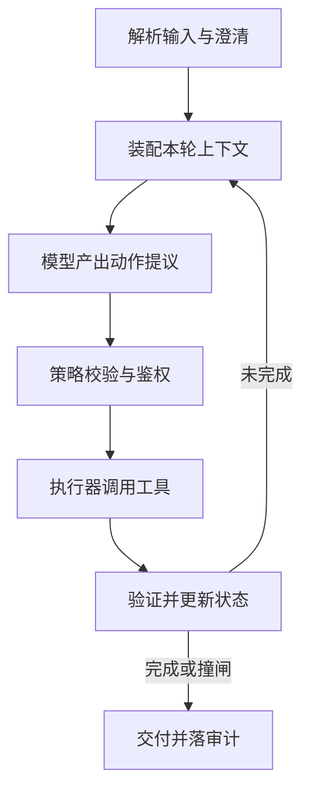

# Agent架构

一句话:能上生产的 Agent 不是「一个会用工具的大模型」,而是**模型决策 + 外部状态机 + 受控执行器**这三段——模型只在每一步提议做什么,状态、权限和「停不停」全在模型外面;本篇讲这台机器由哪些零件组成、怎么转,以及自主度这条轴该切在哪一层。

> **边界**:每个零件自己的机制都有专篇,本篇一律不重讲。循环怎么组织(ReAct、Plan-and-Execute、反思、树搜索、死循环护栏)见 规划模式 篇;工具 schema、五道校验闸、重试与级联超时见 工具调用 篇;记忆分层、上下文预算与向量召回见 记忆与上下文 篇;多个 Agent 怎么连线与算账见 多智能体 篇;LangChain 与 LlamaIndex 怎么选见 Agent框架 篇;把编排换成训出来的策略见 AgenticRL 篇。「这件事该不该交给 Agent、上生产怎么兜住风险」是另一半,见 Agent选型与治理 篇。

## 一、零件与闭环:决策在模型,控制权在模型外面

**LLM 在这台机器里是一个会说话的零件:它产出的是「下一步的提议」,不是「已经生效的动作」。** 为什么必须这么切?因为模型输出永远是可能出错、可能被诱导的不可信文本。把状态、权限和终止判定放进模型,等于把系统的正确性押在一次采样上——同一段提示词换个温度就可能给出另一个答案,而权限校验不能有「大概率通过」这种语义。

| 零件 | 它必须回答的问题 | 交给模型自己做会怎样 |
|---|---|---|
| 输入解析 | 这一轮进来的是什么,缺什么,是不是换话题了 | 缺失和歧义被悄悄脑补成默认值 |
| 编排器 | 现在第几步、还剩多少预算、要不要再来一步 | 模型没有跨轮记账能力,步数与花费它自己数不准 |
| 规划器 | 下一步做什么 | 这一格**本来就该**交给模型,怎么组织见 规划模式 篇 |
| 状态存储 | 目标、槽位、已完成步骤、检查点 | 上下文一截断状态就没了,而且不知道丢的是什么 |
| 证据层 | 每条事实从哪来、什么时候的、可不可信 | 参数化知识既没有来源也没有时间戳 |
| 工具网关 | 这个动作允不允许、参数合不合法 | 只要说服模型跳过校验就全线失守 |
| 验证器 | 这一步、这件事,到底算不算做完了 | 模型自评与正确性的相关性很弱 |

### 一次任务怎么转

图上有四个位置最容易被画错,它们恰好是「模型不该越界」的那几条线:

- **B 不是「把历史接上去」,是每一轮重新装配的一张读取视图**。装什么、砍什么由预算决定,机制见 记忆与上下文 篇。
- **D 必须在服务端,不能靠提示词**。这一格判的是「这个用户、这个租户、这个配额能不能做这件事」,机制见 工具调用 篇。
- **E 失败之后是重试、换等价工具、降级还是明确失败,这个决定归执行器和编排器,不归模型**。错误是不是瞬时的、这次调用幂不幂等,模型判不了,它只该收到一条剥过敏感信息的结构化错误摘要。分类与退避策略见 工具调用 篇。
- **F 的终止判定属于编排器,不属于模型**。模型只能发一个「我想结束」的显式动作,真正判定结束的是验证器加四道闸(最大步数、deadline、成本预算、重复检测),四道闸的定法见 规划模式 篇。少了这一格,循环在数学上就是不停机的。

### 检索和记忆是证据层的两种来源,不是两种架构

把 Agent 和 RAG 摆成二选一是个错位的问法:**RAG 在 Agent 里就是挂在证据层的一个只读工具**。两者解决的问题不在一个层面——检索解决「模型不知道这件事」,Agent 解决「这件事不是一次生成能做完的」。所以组合方式是包含关系:检索作为工具进循环,由模型决定要不要查、查什么、查几次。更上层的「这个需求配不配得上一个 Agent」是选型问题,见 Agent选型与治理 篇。

同一格里的两种来源也要分开摆:长期记忆和检索库共用同一套召回与重排管线,但**必须分成两个命名空间**,因为它们的归属不同:记忆是某个用户或租户的私有事实,带主体、生效区间和权限标签;检索库是共享的公共知识,带文档来源与版本。混进同一个索引,一次跨租户召回就是数据泄漏。至于记忆怎么防膨胀——分层落盘、摘要只当索引、原文靠指针回查、预算超了按「砍掉之后还能取回来的先砍」的顺序裁——见 记忆与上下文 篇。

## 二、架构谱系:分界只有一条

**常见 Agent 架构的真正分界不是谁更先进,而是「下一步做什么」由人写的控制流决定,还是由模型决定。** 按模型自主度从低到高排,只有四档:

| 架构 | 谁决定下一步 | 适合什么 | 靠什么停机 |
|---|---|---|---|
| 固定 Workflow | 人写的编排图 | 流程已知稳定、要逐步审计、单步错误代价高 | 图本身是有限的 |
| Plan-and-Execute | 模型先出一张计划,执行器按表跑 | 步骤能提前拆清、依赖稳定、要并行或要审批 | 计划长度有限,加重规划次数封顶 |
| ReAct | 模型每步看完观察再定 | 路径依赖中间结果,预先规划只能靠猜 | 完全靠外部四道闸 |
| 多 Agent | 主管分派,子 Agent 各自决策 | 子任务异构、可并行、上下文互相干扰 | 以上各档,再加并发与派生深度上限 |

自主度是一条明确的取舍轴:**越往下能力上限越高,可预测性、可调试性和成本可控性越差**。ReAct 能接住没预料到的分支,代价是步数不可预测;多 Agent 买到并行和上下文隔离,代价是 token、失败面和一整类「Agent 之间对不上」的新故障(账怎么算见 多智能体 篇)。每一档「适合什么任务」上表已经答完,而每一档循环内部的机制不在本篇——ReAct 的三段式、Plan-and-Execute(即 Plan-and-Solve 那一路)的计划怎么出、反思为什么有时完全没用,见 规划模式 篇。两条最常被追问的——**ReAct 陷进循环有哪些工程手段能兜住、计划中途失效该重规划还是回退**——规划模式 篇第四节和第二节已经完整回答,本篇不重复。

### 什么条件下该选 Workflow 型

满足其一就该优先考虑,不必四条齐全:

1. 流程本身已经确定且稳定,**变化频率低于迭代提示词的成本**
2. 需要逐步可审计,金融、医疗、风控里这常是合规硬要求
3. 单步错误代价高,必须在固定位置插入人工确认或规则校验
4. 延迟和成本有硬预算,不能接受模型多轮试探

### 「失败可自动检测」是放开自主度的那把尺

反过来,当长尾分支多到写规则不划算、**并且失败可以自动检测**时,固定编排就成了瓶颈,该往上放自主度;第二个条件是硬条件,判据只有一句——**有没有一个不依赖模型自评的信号,能说出「刚才那步错了」**。按可靠性分三档:

| 信号强度 | 长什么样 | 能支撑多大自主度 |
|---|---|---|
| 可程序化判定 | 编译器、单元测试、schema 校验、约束求解器、接口返回码、业务不变量 | 可以放开,让模型自己循环重试 |
| 统计上有效但单条不可信 | 用户是否重问、是否点撤销、下游转化率 | 只够做离线策略改进,不能当运行时的闸 |
| 没有信号 | 开放式写作、主观判断、无标准答案的建议 | 不放开,靠固定流程加人审 |

还有一条容易漏的补充条件:**信号必须在动作生效之前拿到,或者动作必须撤得回来**。事后才知道错、又撤不回来,等于没有信号——机票订了就是订了。所以「失败可自动检测」实际上是两个条件的合取:**可检测 且 (可回滚 或 可预提交)**。这也解释了为什么同一个模型在写代码场景能放很大自主度、在转账场景一步都不能放:前者有编译器和测试,而且 commit 之前一切可弃。

### 混合架构的边界画在哪一层

现实系统几乎都是分层混合,但边界不该按业务模块画,也不该按「哪一步更难」画,而是**画在上面那条「可检测且可回滚」的线上**:线的这一侧放开自主度让模型循环,另一侧用确定性编排加规则校验加人工确认点。落到工程上有三条具体规则:

1. **不可逆动作一律留在自主段之外**。自主段只产出带幂等键的**变更提案**,执行交给独立执行器校验后再做,不可逆的那一步前面挂人工确认(执行侧的做法见 工具调用 篇,多 Agent 场景的审批点见 多智能体 篇)。
2. **边界上必须是结构化交接**。自主段交出去的不能是一段自然语言,得是带字段的状态对象,否则确定性那一段根本无从校验,「边界」就只是画在文档上。
3. **一条链路上只放一个自主段**。自主循环里面再派生自主循环,会让停机条件失去合成性——外层的步数闸和 deadline 管不到内层,内层跑飞了外层只看见「这一步还没回来」。要嵌套,就得把预算显式往下传,并由内层强制检查。

## 三、Skill、Memory、Harness:三个被叫混的词

**Skill 说「这类任务该怎么做」,Memory 说「过去发生过什么」,Harness 说「模型在什么环境里做事、被谁管着」。** 三者不在一个层级,所以「哪个更重要」是个假问题。

| 组件 | 典型内容 | 它的生命周期 | 边界 |
|---|---|---|---|
| Skill | 任务说明、步骤规程、领域规则、模板与脚本 | 版本化,跟着业务改 | 是可复用的做法,不是某次运行的状态 |
| Memory | 用户偏好、既成事实、历史结果、阶段摘要及其时间与来源 | 按条过期、可失效可重建 | 要检索、更新、隔离,不能默认全塞进上下文 |
| Harness | agent loop、上下文装配、工具协议、沙箱、权限、重试、持久化、追踪与评测 | 跟着系统走 | 是运行系统,不等于模型,也不等于某个框架名 |

一次执行里三者这样咬合:harness 按任务和权限挑出相关 Skill、检索出相关 Memory,一起装配进上下文;模型据此选工具、出动作;harness 校验参数、记录观察、控预算、管失败恢复,最后把**经过验证的**结果写回 Memory。三种最常见的叫混:把一长段 prompt 叫 harness(判据一句话——prompt 改不了「这次调用允不允许」,harness 能)、把工具 API 叫 skill(差别见下)、把完整聊天历史叫 memory(历史是原始日志,记忆是从日志里抽出来、带元数据、能被按条检索的事实)。

### Skill 和 Tool 差在哪,一个 Skill 能编排多个 Tool 吗

**Tool 是一次可执行的动作,Skill 是一段可复用的做法。** 判据很干脆:Tool 有副作用或有返回值,它进程序;Skill 没有执行能力,它进上下文。所以一个 Skill 当然可以编排多个 Tool——「先查 A,拿到单号再调 B,B 失败就走 C」这段规程本身就是 Skill 的正文。但要钉死一条:**Skill 编排 Tool,不等于 Skill 拥有 Tool 的权限**。权限只挂在工具网关上,否则「加载一个 Skill」就变成了一个提权动作,而 Skill 通常是最容易被人随手添加的那一层。

Skill 也不是免费的:全部 Skill 常驻上下文会把预算吃光。生产做法是**分级披露**——常驻的只有名字加一句话说明,命中之后才把正文读进来,再需要才拉附带的参考材料。Anthropic 公开的 Agent Skills 就是这三层结构;它和工具目录的延迟加载是同一个手法(见 工具调用 篇)。

### Memory 什么时候写,经验又该往哪一层沉淀

召回、淘汰、冲突仲裁与版本保留的机制见 记忆与上下文 篇;架构上要钉死的只有一条:**写入是 harness 的动作,不是模型的动作**。模型只能提议「这条值得记」,进不进由写回闸判,闸至少三道——必须是被验证过的事实(工具返回或用户确认),不能是模型的推断;必须带主体、来源、生效时间和权限标签;必须先查有没有冲突的旧版本。防污染最关键的推论也在这里:**反思结论和模型推断只进本轮上下文,不进长期记忆**。一旦让推测以事实身份落库,这个错误就获得了跨会话传播的能力,而且后面每一次召回都会给它加一次可信度。

顺着同一条线往下,反思、记忆写回、持续学习经常被混成一件事,但它们改的东西完全不同:

| 手段 | 改的是什么 | 活多久 | 怎么撤 |
|---|---|---|---|
| 反思 | 本轮上下文里的一段自我批评 | 这一轮任务 | 清掉即可,零代价 |
| 记忆写回 | Memory 层里一条带元数据的记录 | 跨会话,直到被覆盖或过期 | 标记失效,可审计可回滚 |
| 持续学习 | 模型参数 | 直到下一次训练 | 只能回滚到上一个检查点,代价最高 |

判据顺着这张表就出来了:**能用上下文解决的别写进记忆,能用记忆解决的别去动参数**。因为越往下走,见效越慢、验证越贵、错了越难撤。反思本身为什么有时完全没用,见 规划模式 篇;把轨迹训进参数见 AgenticRL 篇。

### Harness 里哪些约束必须写成可执行检查

判据同样只有一条:**这条约束被违反之后,后果是不是不可逆或不可见**。是,就必须是代码;不是,才可以留在提示词里。因为提示词只是建议,它和用户输入、工具返回同处一个不可信的文本空间,任何一段被注入的内容都能跟它竞争。

必须落成代码的:权限与配额、副作用与幂等(写操作带幂等键、不可逆动作走确认)、预算与停机(最大步数、deadline、成本上限、重复检测)、参数合法性(schema、值域、字段间约束)、输出契约(最终答案只允许引用已校验的事实)。可以留在提示词里的:语气与格式偏好、工具选择的倾向性、什么时候该主动问用户。一个反例值得记住——在系统提示里写「不要删除生产数据」,这不是约束,是祈祷。

分层验收也顺着这三个词切:**Skill 测任务成功率与规程被遵守的比例,Memory 测召回正确性与新鲜度,Harness 测权限拦截率、故障恢复成功率、可归因性与端到端完成率**。只报一个端到端数字,任何一层退化看起来都长得一样。公开基准里 AgentBench 覆盖多环境的决策与指令遵循,GAIA 侧重真实助理任务的工具使用,可以当外部参照,但定型必须用自己的回放集。

## 四、多模型选型:一个 Agent 里不止一个模型

**主模型、Memory 模型、多模态模型在调用频率、延迟敏感度和错误代价上差一个量级,用同一套标准选就一定选错。**

| 模型 | 在闭环里的位置 | 调用频率 | 首要指标 | 典型形态 |
|---|---|---|---|---|
| 主模型 | 规划、选工具、最终作答 | 每步一次,总量最少 | 工具调用格式正确率、多步任务完成率 | 最强的那一档 |
| Memory | 写入抽取、查询改写、摘要 | 每次写入与召回都要,量最大 | 检索召回与精度、摘要不丢关键事实 | Embedding 加一个小生成模型 |
| 多模态 | 把图像、音视频转成可推理的结构化字段 | 有素材才调,尖峰明显 | 目标字段的抽取准确率 | 专用模型或 VLM |

**主模型不要按通用榜单分数选。** 真正决定成败的是四项:工具调用的格式稳定性、长上下文里对指令的遵循、多步任务完成率、以及失败时会不会硬编造。榜单分高但工具调用格式飘的模型在 Agent 里是灾难,因为**一次参数错就是一整条轨迹作废**,而通用榜单几乎不测这件事。工具调用专项榜单(如 Berkeley Function Calling Leaderboard)可以当初筛,定型必须用自己的任务集。

**Memory 侧最常见的误判是把它当成生成问题。** 绝大多数场景的瓶颈在检索——记忆写得再好,召不回来等于没有。所以重心在 Embedding 模型和索引策略上,生成模型只干抽取与摘要,小模型足够;要验证的核心问题是「给定这个查询,这条记忆能不能被召回」。选型口径见 Embedding 篇,记忆场景的召回与排序见 记忆与上下文 篇。

### 工具调用格式正确率怎么测

拆成两件事分别测,合在一起报会掩盖问题:**选对没有**(该调时调了吗、不该调时忍住了吗、选的是不是那一个)和**填对没有**(JSON 合法率、schema 通过率、必填字段完整率、枚举命中率、单位与日期金额 ID 的格式正确率)。

异常输入必须覆盖这六类,因为线上翻车基本都出在这里:没有任何工具能做的请求(考的是干脆拒绝而不是硬凑一个)、信息不全的请求(该追问而不是猜参数)、同时像是两个相似工具的请求、参数值卡在边界或越界、工具描述被挤到超长上下文中间、以及故意在工具返回里夹带指令的请求。口径上还要固定温度并重复多轮看一致性——**格式错误常常是低概率抖动,单次跑不出来**。

一个高频追问:主模型换成更小的,最先垮的是什么?按经验顺序是**长程一致性先垮**(多步任务里忘掉早先的约束、重复已经做过的步骤),**其次是工具选择的边界感**(相似工具选错、该拒绝时硬调),**格式合法率反而掉得最晚**——因为约束解码和服务端 schema 校验能把这一层兜住一大半(见 解码策略 篇、工具调用 篇)。推论很实用:小模型加强约束能做窄任务,但做不了长任务,换小之前先看你的任务平均几步。

### 多模态那一环的错误是静默的

图里读错一个数字,后面每一步都在合法地对错数做推理,轨迹看起来完全正常——所以这一环必须单独设检查点,而不是指望下游发现。四道可落地的检查:

- **输出结构化字段加逐字段置信度和证据位置**(在图上哪个区域),自由描述根本没法校验
- **交叉校验**:关键字段换一种方式再读一遍(OCR 与 VLM 各读一次,或换一版提示词重读),不一致就升级
- **业务不变量**:小计加起来等不等于总计、日期在不在合理区间、单号校验位对不对。这是最便宜也最有效的一道
- **下游反查**:抽出来的编号能不能在系统里查到对应对象,查不到就是读错了

还要钉死一条:**多模态输出必须先落成带来源的结构化事实,再进推理链**,不能以自由文本身份直接混进上下文;混进去之后就分不清哪句是读到的、哪句是推出来的。视觉侧模型本身怎么构成见 VLM结构 篇与 视觉编码器 篇。

### 端到端掉点了,按什么顺序往下查

**从便宜且能证伪的那一端查起,不要从模型查起。**

1. 先看**有没有变**:模型版本、提示词、工具 schema、索引、数据源,哪个动过。绝大多数掉点都有明确的变更点
2. 再跑**分段离线集**:检索 Recall@K、工具调用格式正确率、多模态字段准确率各一遍。哪一层掉了查哪一层——这也是每类模型必须有独立评测集的唯一理由
3. 三层都没掉,查**编排层**:步数分布、重试率、撞闸比例、上下文截断率
4. 都正常才怀疑主模型的推理质量。这时用固定轨迹回放:把同一批历史轨迹的观察原样喂回去,只换模型,比较决策差异

反着来(先怀疑主模型、换个更大的试试)是最常见的浪费,因为换模型会同时改变所有分段的行为,换完连「原来是哪一层坏了」都查不出来了;检索侧的评测口径见 RAG评测 篇。跨厂商混用还有一笔隐性成本:tokenizer 不同,上下文预算算不准;窗口不一致,装配策略只能按最小的那个写;输出格式稳定性不同,一套解析器兜不住;换模型还等于换掉前缀缓存的命名空间。所以**升级任何一类模型,都要先重跑那一类的评测集,再跑一遍端到端**。

## 五、入口:把模糊请求变成可执行的状态

**入口这一段的任务不是猜对用户想干什么,而是把请求变成一个带不确定性标注的结构化状态——猜错了要能看出来,信息不够要能问。** 这里有两个常被合成一件事的职责:意图识别判断这一轮的目标(转账还是查账单),本质是分类;对话状态追踪(DST)维护跨轮的槽位(收款人、金额、账单月份),本质是状态。合成一件事做的典型症状是:用户补一句「改成 500」,系统把它重新分类成一个新意图,之前填好的槽位全丢了。

槽位也不是简单的键值对,而是四元组——**值、来源(用户明确说出 / 上下文推断 / 检索得到)、置信度、确认状态**。少了来源和确认状态,后面所有决策都做不了:你分不清这个金额是用户说的还是模型猜的,自然也不知道该不该复述确认。每轮固定四步:解析新输入 → 与现有状态合并 → 检查缺失、冲突、指代和话题切换 → 决定追问、执行还是澄清。话题切换时归档而不是清空(否则未决的用户约束会跟着一起丢),做法见 记忆与上下文 篇。检索在这一段是**受控**的:可以用它生成候选(产品说明、已授权的历史对话、账户对象),但三条硬规矩不能破——查用户数据必须先过授权;每条证据带来源与更新时间;**检索结果只能填「推断」来源的槽位,不能覆盖用户已确认的值**。

### 追不追问:信息增益对打扰成本

判据是:只在 **阻塞性 × 误判损失 > 追问成本** 时才问。四个量各自这样估:

- **阻塞性**:这个槽位缺了到底能不能执行。不阻塞的直接给默认值并告知用户,不要为它多问一轮
- **信息增益**:不必真去算熵,**看这个问题能不能把候选集砍掉一半以上**,砍不掉的问题不值得问
- **误判损失**:猜错的后果可不可逆。转错账不可逆,推荐错一首歌可逆
- **打扰成本**:每问一次多一个来回,而且**边际收益递减**——连问三个问题的完成率通常低于只问最关键那一个,用户会直接放弃

所以工程上写死三条:一次只问一个最关键的槽位;给少量可点选的选项而不是开放式提问;追问轮数封顶,撞顶就安全终止或转人工。学术上量化过这件事的基线是澄清问题的检索收益实验(Qulac 报告一个好的澄清问题能把 P@1 提升 170% 以上,论文自报口径),但线上要看的是**配对指标**:澄清带来的任务成功率提升,对照它在会话放弃率和平均轮数上的代价。

### 画像和当前说法打架,信哪个

**当前明确说法优先,而且不是优先一点,是直接覆盖。** 因为画像是统计出来的先验,当前说法是这一次的现场证据;拿先验推翻现场证据,就是把个性化做成了成见。落成规则是三条:

1. 画像只能填来源为「推断」的槽位,而且必须可见可改(「按你常用的那个地址,对吗」)
2. 冲突时采用明确说法,同时**记一条冲突事件**;同一用户连续冲突说明画像过期了,该去更新画像,而不是每次现场覆盖
3. 唯一的例外是**风控性质的硬约束**——过敏与忌口、合规限制、已挂失的卡。这类不能被一句话推翻,只能走确认或拒绝;金额、收款人、交易标的这类高风险字段,则无论画像多确信都必须显式确认

### 澄清这一环怎么评

先造集:从线上真实会话里挑**确实模糊**的请求(判据是人工标注出了多个合理解读),再补人工构造的歧义类型——指代不明、槽位缺失、一词多义、跨任务混说。然后四个指标一起看,单看任何一个都会被优化坏:

| 指标 | 它防的是什么 |
|---|---|
| 澄清触发的召回与精确 | 只优化召回,系统就会变成事事都问 |
| 澄清后的任务成功率 | 问得多不等于问得对 |
| 平均澄清轮数与会话放弃率 | 把打扰成本摆到台面上 |
| **静默错误率**:没问、也没做对、用户还没发现 | 这是最该压的一类,恰恰被前三个指标掩盖 |

离线还要单测 DST 本身:槽位准确率、槽位来源标注正确率、跨轮改口时的更新正确率。这一层的公开基线是 MultiWOZ 那类带信念状态标注的多轮数据集。

## 面试考点串联

| 高频问法 | 本文哪一节 |
| --- | --- |
| 从零设计一个能自主决策、会用工具的 Agent:感知、规划、记忆、工具调用、执行反馈各自什么职责?数据流怎么走?怎么协同完成复杂任务? | 一 |
| Agent 与 RAG 各解决什么问题、怎么组合?长期记忆怎么跟 RAG 结合,又怎么控制膨胀? | 一(证据层的两种来源;膨胀控制见 记忆与上下文 篇) |
| 工具失败、返回异常或格式错误时,这个决定该由哪一层来做? | 一(执行器与编排器分工;重试降级策略见 工具调用 篇) |
| 你了解哪些常见的 Agent 架构?它们的分界在哪?什么条件下该选 Workflow 型而不是让模型自主规划? | 二 |
| ReAct 与 Plan-and-Solve 各适合什么任务?多 Agent 什么时候才值得上,通信和任务分解怎么设计? | 二(自主度谱系;循环细节见 规划模式 篇,成本账与连线见 多智能体 篇) |
| ReAct 陷入循环时有哪些工程手段能兜住?Plan-and-Execute 的计划中途失效,该重规划还是回退? | 转交 规划模式 篇(第四节四道闸与死循环三形状;第二节失效三分法);本篇第二节只给「这一段该不该交给模型」的判据 |
| 怎样判断一个环节「失败可自动检测」,从而可以放开自主度?分层混合架构里,边界又该画在哪一层? | 二(三档信号 + 可回滚这个合取条件;边界画在那条线上的三条规则) |
| Skill、Memory、Harness 分别是什么,各解决什么问题?怎么与模型、工具、上下文和评测闭环协作?常见职责混淆有哪些? | 三 |
| Skill 和 Tool 有什么区别?一个 Skill 能不能编排多个 Tool? | 三(有没有执行能力与权限;分级披露) |
| Memory 应该什么时候写入、召回和淘汰?怎么避免错误记忆长期污染? | 三(写回闸三道,推断不进长期层);召回与淘汰机制见 记忆与上下文 篇 |
| Harness 里哪些约束应该写成可执行检查,而不只是提示词? | 三(不可逆或不可见就必须是代码) |
| 怎么评估一个 Agent?反思、记忆写回和持续学习的区别在哪? | 三(分层验收;三者改的东西与回滚代价) |
| 一个 Agent 系统里的主模型、Memory 模型和多模态模型各承担什么职责?选型标准和验证方式差在哪? | 四 |
| 工具调用格式正确率怎么测?要覆盖哪些异常输入? | 四(选对与填对分开测;六类异常输入) |
| 主模型换成更小的模型,最先垮掉的通常是哪个能力? | 四(长程一致性 → 边界感 → 格式) |
| 多模态那一环读错了信息,怎么在下游检测出来? | 四(四道检查;先落成结构化事实再进推理链) |
| 端到端指标下降时,按什么顺序定位是哪一类模型的问题? | 四(四步定位法) |
| 用户请求不完整或模糊时,怎么结合上下文理解、对话状态追踪、主动追问和检索补全执行所需信息? | 五 |
| 怎么衡量一次追问的信息增益和用户打扰成本? | 五(阻塞性 × 误判损失 > 追问成本) |
| 用户画像与当前明确说法冲突时,应该相信哪一个? | 五(现场证据覆盖先验,风控硬约束例外) |
| 怎么评测模糊请求下的澄清成功率? | 五(四个指标一起看,重点压静默错误率) |
| 补充题:终止判定为什么不能交给模型自己做? | 一(编排器持有状态与四道闸) |
| 补充题:用户的私有记忆和公共知识库,能不能放进同一个索引? | 一(两个命名空间,混了就是跨租户泄漏) |
| 补充题:一个自主 Agent 内部再派生一个自主 Agent,会有什么问题? | 二(停机条件不可合成) |
| 补充题:在系统提示里写「不要删除生产数据」,这算不算一条约束? | 三(不是约束,是祈祷) |
| 补充题:槽位为什么要存来源和确认状态,只存值不行吗? | 五(分不清是用户说的还是模型猜的,就无法决定要不要确认) |

延伸阅读顺序:本篇(机器怎么搭)→ 规划模式(循环怎么控)→ 工具调用(动作怎么落)→ 记忆与上下文(状态放哪)→ 多智能体(要不要拆)→ Agent选型与治理(该不该上、怎么兜)。

## 相关文献

- The Rise and Potential of Large Language Model Based Agents: A Survey(脑、感知、行动的三段式框架)— [arXiv:2309.07864](https://arxiv.org/abs/2309.07864)
- A Survey on Large Language Model based Autonomous Agents(统一的构建框架与评测综述)— [arXiv:2308.11432](https://arxiv.org/abs/2308.11432)
- Cognitive Architectures for Language Agents(CoALA:模块化记忆、结构化动作空间与决策循环)— [arXiv:2309.02427](https://arxiv.org/abs/2309.02427)
- MRKL Systems: A modular, neuro-symbolic architecture that combines large language models, external knowledge sources and discrete reasoning — [arXiv:2205.00445](https://arxiv.org/abs/2205.00445)
- AgentBench: Evaluating LLMs as Agents — [arXiv:2308.03688](https://arxiv.org/abs/2308.03688)
- GAIA: a benchmark for General AI Assistants — [arXiv:2311.12983](https://arxiv.org/abs/2311.12983)
- MultiWOZ -- A Large-Scale Multi-Domain Wizard-of-Oz Dataset for Task-Oriented Dialogue Modelling(信念状态标注与 DST 基线)— [arXiv:1810.00278](https://arxiv.org/abs/1810.00278)
- Asking Clarifying Questions in Open-Domain Information-Seeking Conversations(Qulac,澄清问题的检索收益口径来自此文)— [arXiv:1907.06554](https://arxiv.org/abs/1907.06554)
- Building Effective Agents(Anthropic 工程博客,workflow 与 agent 的分界口径)— https://www.anthropic.com/engineering/building-effective-agents
- Harness engineering: leveraging Codex in an agent-first world(OpenAI,harness 的定义口径)— https://openai.com/index/harness-engineering/
- Equipping agents for the real world with Agent Skills(Anthropic,Skill 的三层分级披露)— https://www.anthropic.com/engineering/equipping-agents-for-the-real-world-with-agent-skills
- Berkeley Function Calling Leaderboard(工具调用准确率的公开评测口径)— https://gorilla.cs.berkeley.edu/leaderboard.html
