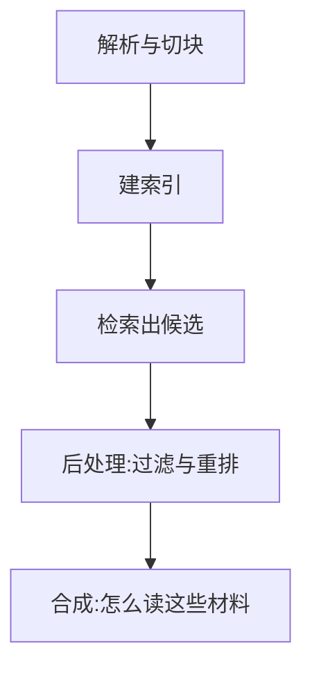

# Agent框架

一句话:这是一篇**选型篇**——不讲 Agent 的任何一项机制(规划、工具、记忆、多 Agent 各有专篇),只回答那个没有哪一篇专篇能回答的问题:**LangChain 与 LlamaIndex 今天各自长成了什么形状、重叠到了什么程度、给你一个项目该按什么依据选。**

阅读约定:规划循环怎么设计见 规划模式 篇;工具 schema、五道校验闸与重试策略见 工具调用 篇;上下文预算与记忆分层见 记忆与上下文 篇;多 Agent 怎么连线、怎么算账见 多智能体 篇;用强化学习去训「什么时候调工具」见 AgenticRL 篇。本篇不下沉到任何一家的内部实现。

> **时效口径**:这两个框架改名与重构的频率高于本知识库其他任何主题。下文凡是「默认」「主推」「已弃」「归到某个包」这类断言,一律取 **2026-09 的官方文档与 PyPI 口径**,对应版本为 langchain 1.4.0、langgraph 1.2.11、langchain-classic 1.0.8、llama-index-core 0.14.24、llama-index-workflows 2.23.3。**读到这篇时先把版本重核一遍**;官方文档没写死的地方,本篇写「官方文档未明确」,不猜。

## 一、先泼一盆冷水:「一个做编排、一个做检索」已经过期

2023 年这道题好答:要串多步流程就用 LangChain,要喂私有文档就用 LlamaIndex。**这条分界线现在不成立了**,因为两家都把对方那一半补齐,而且都写进了各自的首页自述——LlamaIndex 自称「面向你的数据构建 Agent 与工作流的框架」,LangChain v1 则把包收窄成了一个 Agent 骨架。

下面这些件,**两家都有**:

| 骨架件 | 干什么用 | 现在的状态 | 机制去哪篇看 |
|---|---|---|---|
| 结构化工具调用 | 模型吐出调用意图,宿主执行 | 都封装好了 | 工具调用 篇 |
| 单 Agent 循环 | 想 → 调 → 看 → 再想 | 都有开箱即用的实现 | 规划模式 篇 |
| 多 Agent 协作 | 派活、交接、汇总 | 都有一等公民抽象 | 多智能体 篇 |
| 会话记忆 | 短期历史加长期事实 | 都有内置件 | 记忆与上下文 篇 |
| 持久化与断点续跑 | 崩了能从上次接着跑 | 都有,但语义差得远 | 第四节 |
| 人工介入 | 敏感动作先等人点头 | 都有 | 第四节 |
| 向量检索 | 嵌入加近邻召回 | 都有,深度差很多 | 第三节 |
| 流式事件 | 中间步骤实时推给前端 | 都有 | —— |

所以第一条纪律:**别再拿「支不支持 Agent」「支不支持 RAG」当选型问题**,那等于问一辆车支不支持四个轮子。该问的是第二节起的那几条。

## 二、两家今天的形状:各自都做过一次大手术

### LangChain:v1 把自己削成了一个 Agent 骨架

LangChain 1.0 与 LangGraph 1.0 于 2025-10-22 同时发布。这次改动不是版本号往前跳一格,而是**把包的职责重新切了一遍**:

| 包 | 现在负责什么 |
|---|---|
| `langchain-core` | 最底层抽象:消息、`Runnable` 组合接口、模型与向量库的基类 |
| `langgraph` | 官方自述是「low-level orchestration framework and runtime」,负责有状态、可恢复、可长跑的执行 |
| `langchain` | 只剩 Agent 主干:`create_agent` 加中间件。官方原话是这个函数「uses LangGraph under the hood to run this loop」 |
| `langchain-classic` | 老的 chains、retrievers、indexing API、hub 全部搬到这里,只为向后兼容 |

这次瘦身从安装命令的形状上就看得出来——想用老东西,得**额外**装一个包:

```bash
pip install langchain          # v1 主包:只有 create_agent 与中间件这一套
pip install langchain-classic  # 老 chains / retrievers / indexing API 在这里
pip install langchain-chroma   # 向量库集成按厂商分包,不再走 langchain-community
```

**中间件是 v1 的定义性设计**:它把「摘要历史、限制可见工具、拦 PII、要人审批、模型降级、给循环上止损闸」这些横切关注点从业务代码里剥出来,做成可以自由组合、挂在 Agent 循环固定钩子上的插件。这一步的意义是**把上下文工程从「拼提示词的手艺」变成了可复用、可测试的组件**。

顺带把一个高频问法钉死:**LangChain Expression Language(LCEL)不是语法糖**。它能用 `|` 把组件串起来的前提,是所有组件都实现同一个 `Runnable` 接口;串起来之后你一次性拿到同步、异步、批量、流式四种调用方式,加上并行分支,以及每一段都能被单独追踪、替换和缓存。普通顺序调用要拿到这些,得为每一段各写一遍。代价也很实在:出错时栈是框架的栈,不是你的代码。**v1 之后它不再是写 Agent 的推荐姿势**(Agent 走 `create_agent`),但 `Runnable` 仍在 `langchain-core` 里,官方 v1 迁移文档也没把它列进搬家清单——**没被废弃,只是不再是默认写法**。

### LlamaIndex:从索引库长成了「数据」和「流程」两条腿

LlamaIndex 官方把自己定位成「上下文增强型 LLM 应用的框架」,并明确说 RAG 只是上下文增强里最流行的那一个例子。它的四块组成是:数据连接器、索引、查询与对话引擎、Agent 与工作流。

关键变化在编排这一侧:**Workflows 已经被拆成独立包**(`llama-index-workflows`),可以脱离 `llama_index` 单独用,`llama_index` 只是把它重新导出一遍。它和图式编排的差别是设计取向上的:**事件驱动,不是先声明拓扑**——官方文档写得很直白,分支就是普通的 `if` 返回不同的事件类型,循环就是某一步返回一个更早的步骤会接住的事件。Agent 侧则给了三种现成实现:`FunctionAgent` 用模型原生的工具调用,`ReActAgent` 靠提示词兜底那些没有原生工具调用的模型,`CodeActAgent` 让模型写代码来动作;多 Agent 用 `AgentWorkflow` 加交接工具。部署侧的老组件 `llama_deploy` 已被弃用,仓库首页直接写着「用 llama-agents 代替」。数据侧另有商业的托管服务 LlamaCloud/LlamaParse,做的是复杂版式、表格与手写体的解析、抽取与建索引——**这一块是它和另一侧最大的非对称,也是「文档很脏」的项目最该先算的那笔账**。

### 同一件事,两家的形状对照

| 同一件事 | LangChain 侧 | LlamaIndex 侧 | 形状差在哪 |
|---|---|---|---|
| 编排原语 | LangGraph 的图与节点 | Workflow 的事件与步骤 | 图要先把拓扑声明出来;事件驱动的分支就是 `if`,循环就是回吐一个早先的事件 |
| 单 Agent | `create_agent` 加中间件 | `FunctionAgent` / `ReActAgent` / `CodeActAgent` | 一个靠钩子插切面,一个靠换 Agent 类 |
| 多 Agent | 自己连图,或挂子 Agent 中间件 | `AgentWorkflow` 加交接工具 | 一个偏「你画拓扑」,一个偏「让 Agent 自己交接」 |
| 跨进程恢复 | checkpointer 加 durability 三档 | 自己序列化 Workflow 的上下文 | 一个是运行时兜底,一个是把决定权交给你 |
| 检索 | 向量库抽象在 core,集成按厂商分包 | 索引族 → 后处理 → 合成一整条链 | 见第三节 |

一句话概括重叠格局:**两家的 Agent 循环已经是同一件东西,差异全在循环外面——一边往「流程可控、可恢复、可审计」长,一边往「数据可解析、可索引、可评测」长。**

## 三、检索这一侧:选索引就是在选「答案要读多少材料」

这是 LlamaIndex 仍然明显更厚的地方。它把检索拆成了四段,每一段都有独立的可替换件:



### 索引类型:按「问题的形状」选,不是按数据量选

| 索引 | 检索时实际做什么 | 适合的问题形状 | 代价 |
|---|---|---|---|
| 向量索引 | 嵌入后取 top-k 近邻 | 「文档里怎么说 X」,答案落在少数几段里 | 要跨全库聚合的问题必漏 |
| 摘要索引 | 顺序过所有节点,不用嵌入 | 「把这份材料通读后总结」,必须读全 | token 与延迟随语料线性涨 |
| 文档摘要索引 | 先按文档级摘要选文档,再回到原文节点 | 「哪份报告讲了 X」,文档级相关性重于段落级相似度 | 建库时每篇要额外过一次 LLM |
| 树索引 | 从根到叶逐层收敛 | 长文本本身有层级(章 → 节 → 段) | 上层摘要错了,下面整条路全错 |
| 关键词表索引 | 抽关键词建倒排,按字面命中 | 型号、错误码、法条编号这类必须精确命中的 | 同义改写全丢 |
| 属性图索引 | 抽实体与关系建图,再按图游走 | 多跳、「A 和 B 是什么关系」 | 建库最贵,抽取质量直接决定上限 |

**这张表最该记走的一条:索引类型决定的不是「准不准」,而是「一次查询要读多少材料、烧多少 token」。** 向量索引只读 k 段,摘要索引读全部,文档摘要索引读「先选中的那几篇的全部」。所以「数据量大就上向量索引」是个错误的推理路径——真正的判据是**这个问题的答案是集中在几段里,还是必须扫过全体**。生产上常见的做法是按问题类型路由到不同索引,而不是指望一种索引通吃。

### 检索之后还有两层,它们才是常见的性能旋钮

第一层是**节点后处理**:相似度阈值过滤、重排模型、按时间加权。它的价值在于把召回和精确解耦——**检索这一步可以故意放宽 top-k 多捞一些,再靠重排把噪声压回去**,这比死磕嵌入模型省事得多。

第二层是**答案合成模式**,它决定「这些材料怎么读」,也直接决定 LLM 调用次数:`compact` 是默认档,尽量把材料塞进一次调用;`refine` 一段一段迭代改写答案;`tree_summarize` 两两归并往上收;`accumulate` 每段各答一次再汇总。**这一层是延迟与成本账的大头**,compact 通常一次调用就结束,后三种的调用次数随材料量增长。

LangChain 侧对应的是什么?向量库基类在 `langchain-core`,`as_retriever()` 出来的检索器本身就是一个 `Runnable`,可以直接串进链或包成工具挂给 Agent;向量库集成拆成了一个个 `langchain-<厂商>` 分包,而 `langchain-community` 已被官方文档标注为不再维护——老教程里 `from langchain_community...` 的写法要按分包重写。但**索引结构的选择、节点后处理、合成模式这三层,LangChain 没有对应的一等公民抽象**,得自己拼。评测也是同一个格局:LlamaIndex 内置了忠实度(有没有幻觉)、正确性(对标准答案)、上下文与答案相关性等一组评估器,以及跑命中率、MRR 这类排序指标的检索评估器;LangChain 侧对应的是商业产品 LangSmith。

## 四、容错与持久化:两家的抓手不在同一层

这是「工具调用失败了怎么办」这类问题在框架层面的答案,注意它只覆盖一半。

### LangChain:切面在中间件,恢复在运行时

与容错直接相关的内置中间件有这几件:`ToolErrorMiddleware` 把工具异常转成给模型看的错误消息,而不是让整条链炸掉;`ToolRetryMiddleware` 与 `ModelRetryMiddleware` 做退避重试;`ModelFallbackMiddleware` 在主模型不可用时换备用模型;`ToolCallLimitMiddleware` 与 `ModelCallLimitMiddleware` 给死循环上一个止损闸;`HumanInTheLoopMiddleware` 让敏感动作先停下等人。

进程崩了那一层归 LangGraph:配上 checkpointer 之后,`durability` 有三档——`exit` 只在整轮退出时落盘,最快,但中途崩了这一轮全丢;`async` 在下一步执行的同时异步落盘;`sync` 每步开始前同步落盘,最稳。**这是墙钟时间与可恢复粒度之间的跷跷板,不是越稳越好**:一轮几十步的长任务用 `sync` 会多出几十次写;而只要这轮任务重跑一次的代价低于持续写盘的代价,`exit` 就是对的。另外内存版 checkpointer 只能用于本地调试,进程一没,状态就没了。

### LlamaIndex:重试挂在步骤上,恢复由你自己决定

重试的粒度是**单个步骤**:每个步骤可以单独配一份重试策略,声明等多久、试几次、什么错才重试。跨进程恢复的做法是把 Workflow 的上下文序列化出来自己存,重启后反序列化接着跑。这里有两条官方写死、也最值得记住的语义:**恢复是 at-least-once**;**已完成的步骤不会重跑,重新派发的是当时还在飞的事件**。at-least-once 的直接含义是:**步骤里的副作用必须可以安全重复**,否则一次恢复就是一次重复扣款。这条不是缺陷,是把决定权交给你的代价——你自己决定在哪个点快照,也就自己承担快照之间那段的重复风险。

### 两套都不管的那一半

框架给的是「重试」和「恢复」这两个动作,**不给判断**:哪类错误该重试、哪类该换等价工具、哪类根本就是有效的业务结果(「查无此单」)、幂等键怎么带、熔断阈值和全链路 deadline 怎么配——一条都不在框架里,全要你在工具层自己做(见 工具调用 篇)。所以「哪家容错更强」这个问法本身是错的,该问的是:**这家的重试与恢复语义,跟我的副作用模型对不对得上。**

## 五、选型:先定「最难维护的那部分」

### 决策表

第三列比第二列重要——面试官要的是依据,不是名字。

| 场景 | 倾向 | 依据(真正在起作用的那一条) |
|---|---|---|
| 企业知识问答,材料是复杂 PDF、表格、多来源 | LlamaIndex 打底 | 最难的部分在数据侧:解析质量、索引结构、评测口径。这三件它是一条打通的链,另一侧要自己拼 |
| 业务流程型 Agent,要审计、要人工审批、要断点续跑 | LangGraph 加 LangChain | 最难的部分在状态:跨进程恢复是运行时的主干能力,人工介入是内置中间件 |
| 两边都要,比如知识密集型客服 | 组合,但**只留一份状态** | 把检索侧包成一个工具挂进 Agent,检查点只由一侧持有。**两套运行时各存各的状态,是这类系统最常见的翻车方式** |
| 流程就是固定几步,团队只有几个人 | 干脆不用框架 | 抽象层本身就是维护成本。Anthropic 的公开建议是先用基础组件搭,上生产时反而要**减**抽象层 |
| 已经在某一家的商业面上 | 跟着走 | 迁移成本不在代码,在观测数据、评测集和线上基线 |
| 要追新模型、新协议 | 先查这一条再谈别的 | 主线支持速度经常盖过所有能力差异,而且版本迁移本身要计价——v1 那次搬家就是现成的账单 |

### 另外三类不在同一条赛道上

| 项目 | 截至 2026-09 的位置 | 什么前提下才轮到它 |
|---|---|---|
| AutoGPT | 已从「自主循环的开源脚本」转成**可视化搭建加托管运行的平台**,原始形态留在仓库的 classic 目录 | 你要的是低代码搭工作流,不是一个可嵌入的库 |
| AutoGen | 官方仓库 README 已标 **maintenance mode**,只修缺陷不加功能,并指向后继的 Microsoft Agent Framework | 新项目别从它起步;微软技术栈直接看后继者 |
| CrewAI | 独立框架,官方声明不依赖 LangChain;两套抽象配合——Crews 走角色自治协作,Flows 走事件驱动的确定性编排 | 角色边界天然清楚的原型阶段;上生产仍要自己补终止条件与护栏 |

**多 Agent 不是一个框架特性,是一次成本决策。** 多付的 token、墙钟延迟、失败面与调试难度,以及什么时候干脆是负优化,见 多智能体 篇。别因为某个框架「支持多 Agent」就去用多 Agent。

### 选型前先问自己五个问题

顺序很重要,前两问答完通常答案就浮出来了:

1. **这个项目最难维护的部分是什么?** 数据脏、口径多、要评测,就数据面优先;流程长、有审批、要审计,就控制面优先。**按最难的那部分选,不要按品牌列功能清单**——这是本篇最该背走的一句。
2. **状态要不要跨进程活下来?** 不用,那一个循环写完就够,框架的价值大打折扣;要,就直接进到第四节那道题:它的恢复语义跟我的副作用模型对不对得上。
3. **谁来兜观测、评测和部署?** 没有追踪和评测集,任何选型讨论都是在比手感。两家在这一层的形状不同:评测方面 LlamaIndex 把评估器直接放进了开源框架,LangChain 侧对应的是商业的 LangSmith;部署方面两家都既有可自托管的服务组件、也有各自的托管产品。**这一条常常决定要不要接商业面、接哪一家的。**
4. **团队能不能跟主线版本?** 这两家都做过不兼容的大改。锁版本要接受错过新能力,跟主线要接受定期修集成。
5. **出事时你读不读得懂底下发生了什么?** 抽象层越厚,「模型这一轮到底看到了什么提示词」越难回答,而这恰恰是排障的第一问。

收尾一句:**选型的产出不是一个名字,是一份依据**。把「最难维护的部分、恢复语义、观测方案、版本策略」四条写下来,再做一个最小原型去比任务成功率、P95 延迟、可恢复性和团队上手成本——这比任何功能对照表都管用。

## 面试考点串联

| 高频问法 | 本文哪一节 |
| --- | --- |
| 比较 LangChain/LangGraph、LlamaIndex、AutoGPT 的技术定位、核心能力、RAG 与工具集成方式、适用场景和局限,项目里怎么选型?AutoGen、CrewAI 一类处在什么位置? | 一、二、三、五 |
| 从零设计电商客服 Agent,你会选哪个框架、怎么改造? | 五(决策表第 1、3 行)+ 四 |
| 这些框架在工具调用失败时的容错机制有什么不同? | 四 |
| 项目里该选 LangChain/LangGraph、LlamaIndex,还是组合使用? | 五(「只留一份状态」那一行) |
| AutoGen、CrewAI 一类多 Agent 框架适合解决什么问题? | 五(三类对照表) |
| LangChain Expression Language 和普通顺序调用有什么区别? | 二(LCEL 那一段) |
| LlamaIndex 的不同索引和检索结构该按数据特点怎么选? | 三 |
| 补充题:2023 年选框架是在选能力,现在你会拿什么问题代替「支不支持 RAG」? | 一 + 二(形状对照表) |
| 补充题:你们用的 LangChain 是哪个版本?v1 之后包结构变了,对你们有什么影响? | 二 + 五(第 4 问) |
| 补充题:检索回来的东西为什么还要过一层后处理和合成?这两层各影响什么? | 三 |
| 补充题:恢复语义是 at-least-once,这对你的工具设计提出了什么要求? | 四 |
| 补充题:落盘粒度开成每步同步和只在退出时落盘,差别是什么?你按什么选? | 四 |
| 补充题:什么情况下你干脆不用框架?为什么? | 五(决策表第 4 行 + 第 2、5 问) |

延伸阅读顺序:本篇(会选框架)→ 规划模式(循环怎么控)→ 工具调用(动作怎么落)→ 记忆与上下文(状态放哪)→ 多智能体(要不要拆)。

## 相关文献

- LangChain 官方文档(v1 的包边界、`create_agent` 与内置中间件清单的当前口径)— https://docs.langchain.com/
- LangChain 与 LangGraph 1.0 发布说明(2025-10-22,包收窄与 langchain-classic 的由来)— https://www.langchain.com/blog/langchain-langgraph-1dot0
- LangChain v1 迁移指南(哪些模块搬去了 langchain-classic)— https://docs.langchain.com/oss/python/migrate/langchain-v1
- LangGraph 持久化与 durable execution(checkpointer 与 durability 三档)— https://docs.langchain.com/oss/python/langgraph/durable-execution
- LlamaIndex 官方文档(自我定位、索引族、节点后处理、合成模式与评测模块)— https://developers.llamaindex.ai/
- LlamaIndex Workflows(事件驱动编排、按步骤的重试策略、上下文序列化与 at-least-once 恢复)— https://developers.llamaindex.ai/python/llamaagents/workflows/
- LlamaCloud / LlamaParse(商业托管的解析、抽取与建索引,本篇「数据侧非对称」的出处)— https://www.llamaindex.ai/llamacloud
- llama_deploy 仓库(「本项目已弃用,请改用 llama-agents」的原文)— https://github.com/run-llama/llama_deploy
- AutoGen 仓库(README 的 maintenance mode 声明与后继者指引)— https://github.com/microsoft/autogen
- AutoGPT 仓库(平台化后的自述与 classic 目录)— https://github.com/Significant-Gravitas/AutoGPT
- CrewAI 仓库(Crews 与 Flows 的定位,以及不依赖 LangChain 的声明)— https://github.com/crewAIInc/crewAI
- Building Effective Agents(Anthropic:先用基础组件、上生产时减抽象层;workflow 与 agent 的分界)— https://www.anthropic.com/engineering/building-effective-agents
