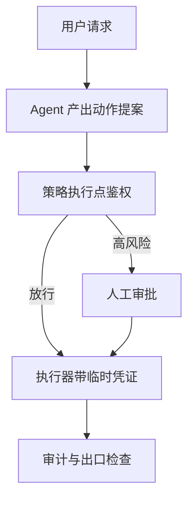
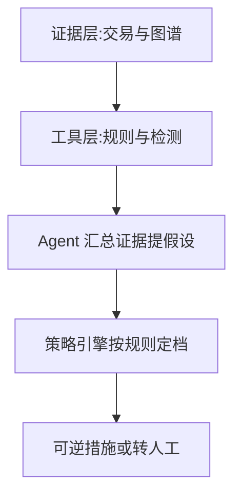

# Agent选型与治理

一句话:这篇只回答两个问题——**这件事该不该交给 Agent**(提示、微调、RAG、Agent 四条路按什么判据选,上了 Agent 要多付哪几笔),以及**交了之后怎么让它不闯祸**(权限与审批收口在哪、监控分几层、连人都判不准的场景怎么受控)。

> **边界**:Agent 由哪些零件组成、怎么转,见 Agent架构 篇。四类机制一律引到专篇——循环与护栏见 规划模式 篇,工具契约、五道校验闸、重试与延迟分段见 工具调用 篇,上下文预算与记忆分层见 记忆与上下文 篇,拆成多个 Agent 的成本账见 多智能体 篇,LangChain 与 LlamaIndex 怎么选见 Agent框架 篇。

## 一、五条路各补哪一块能力

先拆掉一个常见误解:**这五样不在同一层,也没有谁是谁的增强版**。它们补的是完全不同的东西。

| 路线 | 补的是什么 | 知识时效 | 能给出处吗 | 边际成本落在哪 | 什么时候不选它 |
|---|---|---|---|---|---|
| 提示工程 | 把已有能力约束成你要的格式与口径 | 不改 | 不能 | 每次请求的输入 token | 模型压根没有这个能力时 |
| 上下文学习(ICL) | 用几条示例临时对齐任务形态 | 不改 | 不能 | 示例常驻前缀,每轮都付 | 示例多到吃掉上下文,或要求风格长期稳定 |
| 微调 | 稳定的行为、风格、领域语感、调用习惯 | 冻在权重里 | 不能 | 一次性训练,加每次基座升级的重训 | 要保存频繁变化的事实 |
| RAG | 运行时注入可更新、可引用的事实 | 跟着库走 | 能 | 每次请求的检索延迟与输入 token | 缺的是行为而不是知识 |
| Agent | 多步决策、调工具、改外部系统 | 取决于工具 | 取决于工具 | 步数乘以每步的生成与往返 | 路径能在开发期枚举完 |

**判断缺的是知识还是行为,有一个当场就能做的动作:把正确答案原样贴进提示,看模型答不答得对。** 答对了说明它有能力、只是不知道事实,该上检索;仍然答不对说明缺的是行为或格式,该改提示或微调。这一步能省掉大量"到底该微调还是该 RAG"的空对空争论。

### RAG 还是微调:四条可算的判据

1. **这条知识多久变一次。** 变更周期短于你的微调交付周期(造数据、训练、评测、灰度,现实里通常是几天到几周),就只能走检索——训练还没上线,知识已经旧了。
2. **要不要出处,要不要能撤回。** 需要引用来源、需要回答"这条从哪来"、需要下架某一条知识时,只有检索做得到;微调把知识摊进权重,既指不出出处,也删不掉单独一条,要删只能重训。
3. **知识注入的效率本来就不对等。** 公开对照实验的结论很直白:知识密集任务上,无监督微调注入新事实的效果明显不如检索,模型很难靠继续训练学会新的事实(见相关文献)。
4. **成本结构不同,按 QPS 摊。** 微调的钱花在训练与重训,推理侧几乎不加价;检索的钱是**每次请求都要付**的一跳延迟加多出来的输入 token。所以高 QPS、知识稳定倾向微调,低 QPS、知识常变倾向检索,分界点就是把训练成本摊到请求数上,再和每请求的增量成本比大小。

**组合才是常态**:RAG 负责"知道什么",微调负责"怎么用"。典型分工是用领域数据微调出"会读证据、会按格式引用、证据不足会拒答"的行为,运行时再由检索提供事实;把带干扰文档的检索场景直接写进训练数据,就是 RAFT 那条线。微调机制见 SFT 篇与 LoRA 篇,切块、索引、重排与检索评测见 切块与索引 篇、检索优化 篇、Embedding 篇、RAG评测 篇。

### 延迟预算与长文本:两道常被问的硬闸

选型的最后一问是预算,而**延迟这一项经常直接把方案否掉**。粗口径:一次在线大模型调用的首字延迟在生产上通常是几十到几百毫秒,随输入长度、模型大小和前缀缓存命中情况变动(口径见 推理服务指标 篇)。所以"端到端低于 100 ms"这类要求下,结论是硬的:**100 ms 里放不下一次在线大模型生成,更放不下 Agent 循环。** 可行的只有三条:把大模型挪出关键路径(离线预计算、结果做成缓存或索引、异步补写);在线那一段换成小模型或判别式模型做分类、排序、召回,大模型只做离线与兜底;或者先在预算内给一个确定性结果,大模型的补充异步追加。答之前先问清**这 100 ms 算到哪里**——指首字节,流式还能救一部分;要完整结构化结果,基本只剩前两条。长文本那一问同理是三条叠加:**放得下不等于找得到**(关键信息落在中段最容易被漏读)、prefill 成本与首字延迟随长度上涨、超限时截掉哪一段不受控。所以产品侧的解法是切块检索加预算分配,而不是一味加窗口;机制见 记忆与上下文 篇与 长上下文训练 篇。

### 落到业务上:知识库与客服

- **企业知识库问答:默认 RAG,不默认 Agent。** 判据是统计真实问题里"一次检索就能答"的占比,占比高就别上循环,剩下的走专门入口或转人工更划算。只有当问题要跨系统取数、要写操作、或者下一跳查什么依赖上一跳的结果时,才在 RAG 之上包一层受控循环——是加一层,不是换掉 RAG。
- **客服(网约车与电商同构):组合,但先分流。** 第一刀按"要不要读写业务系统"切:政策与规则答疑走 RAG;查订单、改派、退款这类要取数和写动作的走受控工具流程;不可逆动作转人工。分流之后两条链路的评测口径、延迟预算和权限模型都不一样,混在一起做必然两头不讨好。

## 二、该不该上 Agent:先算多付的几笔,再看止损线

Anthropic 的公开工程文章把话说得很直:**流程明确的任务用工作流,需要模型自己做决定且要规模化时才用 Agent,而且只在必要时增加复杂度**。落到可操作的层面是这五问:

1. **分支能不能在开发期枚举完?** 拿最近一批真实请求分桶,看头部几个桶盖住了多少。长尾占比低,就写固定流程,长尾转人工。
2. **下一步依不依赖上一步的结果?** 不依赖就是工作流,依赖才需要循环(展开见 规划模式 篇;架构形态的谱系见 Agent架构 篇)。
3. **每一步有没有可程序化的校验?** 没有校验器,错误只会一路滚下去。
4. **延迟预算除以单跳耗时,允许几步?** 算出来小于 2,就不要 Agent。
5. **一次做错的业务代价有多大?** 代价高且不可逆的动作,不管选什么方案都要人在环。

### 多付的四笔,和错误累积的算术

| 多付的 | 具体是什么 |
|---|---|
| token | 每一跳都要把此前的全部历史重新 prefill 一遍,所以总输入 token 大致随步数**平方**增长,不是线性 |
| 延迟 | 下界是步数乘以「一次生成 + 一次工具往返」,串行部分压不掉;怎么分段测、哪些能并行见 工具调用 篇 |
| 失败面 | 见下面那个乘积 |
| 不可复现 | 同一输入两次跑出不同轨迹,排障、回归和事故复盘都要重做一遍方法论 |

$$
P_{\text{一次做对}} = \prod_{i=1}^{n} p_i
$$

人话:每一步单看 95% 靠谱、串 20 步,整体只剩约 36%。它有两个推论——**把步数压小比把单步做准更划算**(单步从 95% 提到 97%,20 步整体也只从 36% 涨到 54%);以及**必须在每一步就截断错误**,否则乘积会替你把小错放大成事故。并行多个 Agent 时的同类算账见 多智能体 篇。所以错误与幻觉不累积靠三条,按有效程度排:**每一步都过可程序化的校验**(schema、业务不变量、结论有没有被取回的证据真正支持),不合格就地截断,不许进事实层;**结论与证据分离**,只有校验过的事实能被后续步骤引用(做法见 记忆与上下文 篇);**主动压步数**,能一次问清的别分两轮,总是一起调的两个工具合成一个。一条必须说死的边界:**别把"再让模型自查一遍"当主要防线**,没有外部信号时,模型的自我纠正经常把本来对的改错(见 规划模式 篇)。

### 值不值:两组数,一条口径纪律,三条止损线

智能程度不该用步数、工具数、参数量衡量,要用**任务完成**:按任务类型分层的端到端成功率、一次通过率与允许追问后的成功率、**多次重跑的一致性**(同一任务连跑 k 次都成功的比例,τ-bench 提出的 pass^k 就是干这个的,它的公开数字很说明问题——零售域 pass^8 低于 25%)、人工接管率、自主完成的步数中位数。用户价值是另一组数:相对基线流程省下的时间或人力、生成动作的采纳率、重复使用率、单位任务成本与人工成本的比值。纪律是**任何成功率都要报口径**——任务集合、允不允许人工介入、重试几次、时限多少;不报口径的成功率不可比,面试里也最容易被追问穿。

收益换得回来要三条同时成立:真实请求里"必须看了中间结果才知道下一步"的比例足够高;每一步都有可验证的成败信号;任务价值撑得起单位任务成本加上失败的期望代价。**止损线要在上线前就写下来**,三条任一触发就退回固定流程或收窄作用域:人工接管率长期高于预设阈值;实际步数的中位数是 1–2 步,说明绝大多数请求根本用不上循环;单位任务成本高于同一件事的人工处理成本。**多 Agent 只有在角色权限不同、掌握信息不同或任务真能并行时才可能值得,角色数量不是智能程度**;它那一层的账与止损线(加速比接近 1 而通信占比又高就退回单 Agent)见 多智能体 篇。

### 兜底三段式,趋势,以及没有公开证据的问题怎么答

容错与回退是三段式,一段接不住才降到下一段:**自动恢复**(重试、换等价工具、降级,判据见 工具调用 篇)→ **收缩目标**(交出部分结果并明说缺了什么,见 规划模式 篇)→ **转人工**。最容易漏的是第三段的**交接契约**:接手的人得一次拿到任务目标、已执行的动作及其副作用(哪些已生效、哪些还可撤销)、当前状态快照、失败原因,以及一个"从这里继续"的入口。没有这份交接,人工接管等于从头做起,接管率一涨人力就崩;所以**接管率本身要进监控并设 SLO**。

趋势能说的是有依据的方向:更强的流程约束与外部验证器、可观测与评测基建、人机协作接口的标准化。避开两个坑:**别把预测说成事实**;**"单工具 → 多步规划 → 多 Agent"是能力层次,不是历史版本**,今天这三档同时在生产里跑着。被问到某公司内部的 Agent 案例而你手上没有公开证据时,分三段答:先说清哪些是公开可查的(官网、技术博客、公开分享,带上时间口径),再说哪些是你的推测以及推测依据,最后落到你自己做过、能负责的部分。**不要把推测说成事实,也不要因为不知道就不答**——这道题考的是有没有事实与推测的分界感。

## 三、通用还是垂直:护城河要经得起换基座

**真正的分界不在领域词表,而在环境封不封闭、"做完了没有"判不判得定。** 垂直 Agent 的工具集有限、状态空间可枚举、结果通常能程序化校验;通用 Agent 面对开放环境,连终止条件都难判。这条差别决定了后面所有工程选择——通用 Agent 赌的是基座泛化,随基座升级水涨船高;垂直 Agent 赌的是环境与评测的确定性,正因为封闭,才有可能把工具做深、把失败模式穷举、把评测做成可回归的集合。开放任务的难度有公开标尺:GAIA 那类真实助理任务上,人类约 92%,当时带插件的 GPT-4 只有 15%(论文自报口径)。

| 竞争力 | 怎么验证 | 假的长什么样 |
|---|---|---|
| 工具深度 | 领域动作封装到什么粒度、错误语义分不分得开、能不能自动重试与降级 | 只报"接了多少个 API" |
| 私有数据与反馈闭环 | 有没有把"失败 → 标注 → 回流 → 回归验证"真正跑通 | 只有日志,既没标签也没回流 |
| 领域评测集 | 能不能一键回归,长尾覆盖到什么程度 | 几十条手写样例,每次上线靠人眼看 |
| 失败兜底 | 做错的代价是什么,系统怎么检测、拦截、回滚、交人 | 只讲成功路径 |

反过来,**只靠提示词和流程编排堆出来的优势最脆弱,基座每升一代就吃掉一截**。而**这一截被吃掉了多少是可以量化的**:固定同一份评测集和同一套工具,跑三档——只用基座加通用提示、基座加你的提示与编排、完整系统(含私有工具与数据)。三档之间的差值就是各层的边际贡献;换基座后重跑一遍,**中间那一段缩了多少,就是被吃掉的部分**。判据也就从"现在比通用产品好多少"换成了"换个更强基座之后还剩什么"。

### 长尾评测集怎么建,私有数据什么时候才是壁垒

评测集不能靠"想出来的例子",三个来源缺一不可:**线上真实失败轨迹**按失败模式分层抽样,不是随机抽——随机抽只会抽到高频形态;**组合覆盖**,把工具、错误类别、用户意图交叉成格子,空格子就是没覆盖的长尾;**红队与对抗构造**,专门造没见过的形态。三条纪律:每条样本必须带**可判定的成功判据**,否则回归跑不起来;常见与长尾**分层报告**,别混成一个平均分把问题盖住;评测集**只做回归门禁,不做调参目标**,否则会过拟合到已知形态。

私有轨迹则要同时满足四条才算壁垒:带**结果标签**(没有对错标记的轨迹只是日志)、覆盖的是**基座学不到的分布**(私有工具、私有流程、领域长尾)、有**合规的使用权**、并且闭环真的跑起来了。缺任何一条,它就只是存储成本。而"通用底座 + 垂直工具"这条主流路线的风险集中在三处:**供应商风险**,涨价、限流、下线、行为悄悄变更都会砸到你,所以提示与评测要做成可换模型的、并常备第二家;**自己那一层可能最薄**,提示与编排恰恰是最容易被下一代基座吃掉的一层;**数据出域与合规**,私有数据要过第三方推理。

## 四、安全:系统架构层的那几道防线

工具层那一层已经写完了,本节不重复:三处输入都不可信、数据与指令分离、最小权限加白名单、副作用动作走确认、全量审计,以及"沙箱只能隔离执行、防不住提示注入"这条边界,全部见 工具调用 篇。**本节讲它上面那一层——身份、租户、权限模型、审批链、隐私治理和越权阻断。** 总纲一句话:**模型只能提出动作,可信执行层才有权批准动作。** 算法层负责识别风险,系统层负责强制执行;即使模型被注入,越权请求也不能穿过策略边界。

### 身份、租户与按步回收的权限

一次请求里有三种身份必须分开:**终端用户**、**Agent 自己的服务身份**、**下游系统看到的身份**。生产上最常见的越权根因,就是拿 Agent 的服务账号代替用户身份去取数——它通常权限最大,于是"用户 A 的会话读到了用户 B 的数据"。正确做法是**把用户身份一路传下去**,行级与字段级授权在数据源侧执行,而不是取回来之后在 Agent 侧过滤;因为 Agent 侧的过滤发生在数据已经进过上下文之后,审计上那已经算泄漏了。租户隔离则要注意**隔离面比想象的宽**:除了业务库,还有检索索引、缓存键、向量记忆、日志和离线评测集,任何一处漏掉租户维度就是一条越权通道(缓存键该带哪些字段见 工具调用 篇,记忆侧的分片与查询侧强制过滤见 记忆与上下文 篇)。

授权对象是一个四元组:**主体**(用户、Agent 类型、会话)乘以**客体**(工具、数据域、字段)乘以**动作**(只读 / 可逆写 / 不可逆)乘以**条件**(金额、地域、时间窗、频次);实现上是角色打底、属性做条件、动作按可逆性分级。还有一条结构要求:**策略执行点必须是唯一收口**——只要有第二个地方能发起工具调用,你就有了两套互相不知道对方存在的策略。而长链路的权限不能一次性发全,做法是两级令牌:任务开始时签一张**任务级令牌**,带 scope、TTL 和最大调用次数;每一步再从它**派生步骤级令牌**,只含这一步要用的工具与数据域,有效期以秒计、用完即废。两条不变量决定它有没有用:**派生只能收窄不能放宽**,子令牌的权限必须是父令牌的子集,这样即使某一步被注入,它拿到的权限也不会超过父任务;**令牌短到不需要撤销**,再配一张集中吊销表兜底,这比"把撤销广播到所有节点"可靠得多。

### 审批链按风险分级,别一刀切

**摩擦要花在高风险那一小撮请求上**,这也是"安全严格性与用户体验怎么平衡"的正解。定阈值还有一条可操作的做法:**先定"每天最多打断用户多少次"这个假阳性预算,再反推策略阈值**,而不是先拍一个阈值再看打断了多少人。

| 风险档 | 典型动作 | 系统怎么做 |
|---|---|---|
| 只读、无外发 | 查询、检索、汇总 | 静默放行,只记审计 |
| 可逆写 | 建草稿、加备注、预占 | 放行,结果对用户可见且可撤销 |
| 有外部副作用 | 发送、下单、改配置 | 先展示即将发生的事,取得确认,带幂等键 |
| 不可逆或高金额 | 转账、封号、删除、对外披露 | 升级认证,加双人或多信号授权 |

### 隐私四个检测点,日志是最大的漏斗

检测点有四处——**用户输入、检索片段、工具参数、最终输出**,少一处就漏一类。手机号、证件号、卡号这类走规则与校验位,姓名、地址、机构这类走实体识别或分类模型;**大模型只能辅助判断上下文,不能当唯一防线**,因为它的判定既不可复现也不好审计。处置分三档:掩码(不可还原)、删除、令牌化(可还原,但还原要单独授权),并把数据来源和敏感级别一路带着走。最容易被忽略的泄密点是**日志本身**——它是全链路里 PII 最集中的地方,纪律是落盘前脱敏、按敏感级分级访问、设保留期与删除凭证,不存密钥、不存完整参数、不存原始私密上下文,也**不存模型的私有思维链**,它既最容易夹带原文,又常被误当成可信解释。

### 第三方内容注入外泄:拦得住的是出口;越权阻断分四道

调用第三方 API、抓网页、读邮件时,注入的**目的通常是把数据带出去**,所以最可靠的防线不是"再叮嘱模型别听它的",而是**把出口管住**:出站域名白名单,不在名单上的地址一律连不通;可外发的数据字段做成显式白名单;凭证与系统提示绝不允许进入任何工具参数;出站请求体过一次 DLP。这条思路和学术界给出的方向一致——把可信的控制流与不可信的数据流显式分开,再用能力约束堵死外泄通道,才谈得上"可证明的抗注入",而不是靠提示词对抗(见相关文献里的两篇设计模式工作)。OWASP 的 LLM 应用清单把 `LLM01:2025 Prompt Injection`、`LLM02:2025 Sensitive Information Disclosure` 和 `LLM06:2025 Excessive Agency` 分列成三条,提醒的正是"注入 → 越权 → 外泄"这条完整链路。

越权阻断本身分四道:预防(最小权限加出口白名单)→ 准入(策略执行点硬拒)→ 运行时异常检测(单会话数据访问量、跨租户访问、非常规工具序列、出站流量突增)→ 事后审计回溯(定期扫日志,找"放行了但不该放行"的模式)。**前两道是确定性的,后两道是统计的;能提供保证的只有前两道**,后两道的价值是发现你的策略本身写漏了什么。

## 五、可观测性:分层监控与故障定位

延迟怎么分段打点、链路怎么追踪见 工具调用 篇;多个 Agent 之间怎么用同一个 task ID 把消息、工具调用和裁决串成一棵调用树、怎么把结论归因到具体子 Agent,见 多智能体 篇。**本节讲分层监控与故障诊断:分几层看什么、一次失败怎么定位到是模型、工具还是编排、什么该报警。**

**Agent 坏在边界上,不坏在中间。** 五个高发点:计划停不下来;上下文被截断,关键约束悄悄丢了;检索给回了错证据;工具超时或返回结构变了;以及最容易被忽略的一条——**上游模型或提示模板悄悄换版,整体行为漂移**。只盯着显卡和 QPS 的监控,这五样一个都发现不了。

| 层 | 看什么 | 能发现什么 |
|---|---|---|
| 基础设施 | 资源、队列深度、吞吐、分位延迟 | 容量问题与依赖故障 |
| 运行时 | 步数、重复动作率、token 与上下文裁剪量、检索命中、工具成功率与重试、终止原因分布 | Agent 特有的失控形态 |
| 业务效果 | 任务成功率、事实错误率、用户放弃率、人工接管率、单位任务成本 | 用户到底有没有被服务好 |

阈值来自自己的 SLO 与历史基线。**"10 轮""5%"这类数字没有通用值**,拿别人的数字当阈值,只会得到一堆没人看的告警。

### 一次失败,怎么定位到是谁的问题

方法只有一句:**先按 span 的成败与耗时把嫌疑面缩到一个 span,再看这个 span 的三份快照——输入上下文、输出原文、策略结论。** 缺了输入上下文快照,模型侧的问题永远查不下去,因为"这一轮模型到底看到了什么"是排障第一问。

| 症状 | 结论落在哪一层 |
|---|---|
| 工具返回是对的,最终答案却和它矛盾 | 模型侧:读岔了,或被更早的上下文带偏 |
| 工具报错、超时,或返回结构与 schema 对不上 | 工具侧:看错误类别分布与工具版本变更时间 |
| 每一步都成功,任务却没完成 | 编排侧:进展信号不涨、动作重复、终止条件写错 |
| 检索命中率正常,但引用支持不了结论 | 证据组织与预算分配(见 记忆与上下文 篇) |
| 只有部分租户或部分时段坏 | 数据或配置,不是模型 |

每个 span 至少记:trace 与 span ID、Agent 与步骤号、**模型与提示版本**、工具名与版本、输入输出的 schema 与脱敏摘要、策略结论、token 数、耗时、终止原因。字段命名可以直接对齐 OpenTelemetry 的 GenAI 语义约定,省得每换一次可观测后端就重做一遍埋点。

### 什么该报警,循环失控怎么自愈,盲区怎么查

**只对用户可感知的坏报警**:任务成功率、P99、错误预算的消耗速度。运行时指标(步数、重复率、裁剪量)进看板,不进呼叫,否则值班很快就学会忽略它们。还有一条常被忘记:**报警要带分母,按任务类型和租户分组**——一个低频任务类型全挂了,在总量里是看不出来的。循环失控的处置顺序是**先中止还没提交的副作用**,再压缩状态、换一条策略,仍不行就降级或转人工;检测手段(最大步数、deadline、重复动作、进展信号)见 规划模式 篇,监控侧要做的是把**终止原因**当成一等指标记下来、按原因看分布趋势——撞闸本身不是异常,**撞闸的构成突变才是**。

监控体系自己也要被验收,三件事加两个数:**合成故障注入**,把工具改成超时、返回脏 schema、返回一段注入文本,看告警响不响;**告警演练**,定期真触发一次,确认能路由到人;**采集链路自监控**,span 丢失率、上报延迟、采样率——采集挂了和系统健康长得一模一样。两个数是**从故障发生到告警的时间**和**从告警到定位的时间**,没有它们,"有没有盲区"只能靠感觉。再补一条:拿历史失败案例回放,看新监控标不标得出来。

## 六、高风险决策:人也判不准的时候怎么受控

以新型欺诈为例。**人工审核都判不准,就说明系统没有随手可得的真值,这时让模型直接封禁或放行,等于把语言流畅度当成了证据。** 所以第一步是改目标:不是"模型替人定罪",而是**收集证据、估计风险、选择下一项调查动作,并在成文政策下执行可逆措施**。

| 模型可以 | 模型不可以 |
|---|---|
| 汇总多源证据,指出冲突在哪 | 直接决定封禁或放行 |
| 提出假设,选择下一个检测工具 | 绕过策略引擎 |
| 输出结构化风险因素与证据引用 | 把自报的分数当成欺诈概率 |
| 给出人可复核的调查线索 | 把自己的判定写回标签库 |

"为什么不直接让 LLM 输出一个欺诈概率、按阈值封禁"的答案有四层:**它输出的数字不是校准过的概率**,同一份证据换个措辞分数就变,自报置信度的分辨力也差(展开见 多智能体 篇);**不可复现**,而封禁是不可逆动作;**可被操纵**,证据里本来就有对方写的文本,注入面直接连到了处置动作;**给不出可申诉的理由**,而欺诈处置通常有说明理由和申诉的合规要求。所以概率交给能校准的统计模型——在有延迟标签的历史数据上训练并做概率校准,动作交给策略引擎,模型只负责证据侧。

### 两类错的代价怎么权衡,人在环放三个位置

$$
\text{期望损失} = P(\text{漏放}) \cdot C_{\text{欺诈}} + P(\text{误伤}) \cdot C_{\text{误伤}}
$$

人话:阈值该定在两类错误的**边际代价相等**处,而不是 F1 最大处。这一步逼你去问业务要两个数——放过一笔欺诈的资金损失,和错拦一个正常用户的代价(客诉、流失、赔付、监管);要不到绝对值,至少要一个比值。它还解释了为什么高风险场景一定要设计**中间档动作**:在"放行"和"封禁"之间插入二次验证、限额、延迟交易,能把误伤代价压到远低于封禁,于是同一个风险分数下可以把拦截面开得更宽。

人在环放三个位置。**拒判升级**:证据不足、工具结论冲突、或明显超出已知分布时,Agent 应当拒判并申请补充验证,而不是硬给一个分数。**提交前审批**:不可逆动作一律走人工,重大动作用双人或多信号授权——高风险 AI 系统要能被人有效监督、能被否决、能被中止,这在监管口径里是明确写着的(欧盟 AI 法案第 14 条)。**抽样复核**:高置信区间也要按比例抽查,否则你永远不知道"系统很确定"的那一段真实错误率是多少。

### 标签、漂移、反馈污染,以及留什么证据

标签来自事后退款、拒付、投诉、司法或银行确认、调查结论,天然是**延迟**的,而且必须区分"**确认无欺诈**"和"**还不知道**"——把"未知"当负样本训练,是这类系统最经典的静默错误。信用卡风控的经典工作把这个领域的三件难事写在一起:概念漂移、类别极度不平衡,以及**验证延迟**,只有很小一部分交易能被及时核实。

由此得到"怎么区分模型进步和攻击分布变化"的可操作做法:**两个轴各锁一边。** 一边固定一份冻结的历史回放集当标尺,模型变、数据不变,只有它涨了才算模型进步;另一边固定模型版本按时间窗看线上指标,数据变、模型不变,回放集没动而线上掉了,那就是分布变了。再叠一层**不依赖标签的输入侧漂移监控**(特征分布、新设备指纹、新话术的聚类突增),它通常比任何标签都早报警。

伪造证据和反馈污染按来源治理。证据一律带**来源与可信级别**,用户可控的输入(自填资料、上传凭证、对话文本)默认最低级,交叉验证只用攻击者改不动的信号,例如银行侧结算记录、设备指纹、关系图上的历史结构。标签同样**分可信度等级**:司法或银行确认 > 拒付与退款 > 客服判断 > 模型自标,而且**模型自标的样本永远不许进正样本**,否则闭环就变成了自我确认。再加两道:限制单一账户、设备或团伙在训练集里的占比,防止攻击者靠批量制造"正常"样本把边界推过去;留一份**只由高可信来源构成的冻结验收集**,训练集一旦被污染,它会先掉下来。

最后是留什么证据:每次决策落一条不可变记录——证据快照(带来源、版本与取数时间)、用到的工具与版本、模型与提示版本、策略引擎命中的规则与阈值版本、人工审批人与理由、最终动作与可撤销窗口。**判据只有一个:事后能不能只凭这条记录把同一个结论重放出来。** 重放不出来就等于没有证据,申诉、审计和事故复盘全都无从做起。

## 面试考点串联

| 高频问法 | 本文哪一节 |
| --- | --- |
| 提示工程、上下文学习、微调、RAG 与 Agent 的原理、能力边界、成本和适用场景分别是什么?怎么结合具体产品做选型和改进?企业知识库问答该选 RAG 还是 Agent,客服系统又更适合哪种? | 一 |
| 微调与 RAG 怎么组合,分别解决什么问题? | 一(四条判据 + RAFT 那条线) |
| 端到端延迟要低于 100 ms 时方案怎么取舍?大模型产品处理长文本又有哪些瓶颈? | 一(两道硬闸) |
| Agent 的核心价值、局限和适用条件是什么?和 RAG、固定 Workflow、多 Agent 怎么权衡?趋势怎么谈?Agent 与固定 Workflow 的优劣具体怎么比较? | 一、二(五问 + 多付的四笔) |
| 复杂任务里的错误或"幻觉"累积怎么解决? | 二(乘积算术 + 三条治法) |
| Agent 的容错、回退和人工接管怎么设计? | 二(三段式与交接契约) |
| 多 Agent 协作什么时候才优于单 Agent? | 二(止损线那一段);算账与拓扑见 多智能体 篇 |
| 高并发下 Agent 的成本比一问一答多在哪?怎么压? | 二(token 随步数平方增长,先压步数);延迟侧见 工具调用 篇 |
| 怎么量化评估 Agent 产品的智能程度和用户价值? | 二(两组数与口径纪律) |
| 被问到某公司内部的 Agent 案例、手上又没有公开证据时怎么答? | 二(分三段答) |
| 通用 Agent 与垂直 Agent 的技术边界在哪?垂直 Agent 的竞争力来自哪些可验证的东西? | 三 |
| 基座升级后,怎么量化"哪部分优势被吃掉了"? | 三(三档对照实验) |
| 领域评测集怎么覆盖长尾而不只是常见样例?私有轨迹数据在什么条件下才真正构成壁垒?通用底座加垂直工具的方案,风险又集中在哪里? | 三 |
| 部署 Agent 时怎么从算法和系统架构两层防隐私泄露与越权?权限、脱敏、审计和日志怎么设计? | 四 |
| Agent 调第三方 API 时,怎么防提示注入导致敏感信息外泄? | 四(出口管控);工具层的三处不可信输入见 工具调用 篇 |
| 执行链很长时,细粒度的权限回收怎么做? | 四(任务级与步骤级两级令牌) |
| 安全策略的严格性和用户体验怎么平衡? | 四(风险分级表 + 假阳性预算) |
| Agent 哪些模块最容易出稳定性或性能问题?监控体系和诊断方法怎么设计? | 五 |
| Agent 陷入"思考—行动"循环时,监控怎么发现、熔断后怎么自愈? | 五(终止原因当一等指标);四道闸见 规划模式 篇 |
| 怎么评估监控体系有没有盲区?多 Agent 协作时怎么追踪跨 Agent 链路并定位责任? | 五(后半转交 多智能体 篇的 task ID 调用树) |
| 人工也难判断的新型欺诈场景,怎么设计数据、证据、工具、决策边界、拒判升级和持续评测? | 六 |
| 为什么不能直接让 LLM 输出一个欺诈概率并按阈值封禁? | 六(四层理由) |
| 没有即时真值时怎么区分模型进步和攻击分布变化?怎么防伪造证据与反馈污染? | 六 |
| 补充题:怎么当场判断模型缺的是知识还是行为? | 一(把答案贴进提示试一次) |
| 补充题:固定流程还是 Agent,你能给出一个数而不是"看情况"吗?步数一多就做不对,先压步数还是先提单步准确率? | 二 |
| 补充题:Agent 的服务账号权限最大,为什么不能拿它替用户取数? | 四(三种身份必须分开) |
| 补充题:一次 Agent 任务失败了,你第一步先看哪个信号? | 五(缩到一个 span,再看三份快照) |

延伸阅读顺序:本篇(该不该用、怎么兜)→ Agent架构(怎么搭)→ 规划模式(循环怎么控)→ 工具调用(动作怎么落)→ 记忆与上下文(状态放哪)→ 多智能体(要不要拆)。

## 相关文献

- Building Effective Agents(Anthropic 工程博客:工作流与 Agent 的分界、只在必要时增加复杂度)— https://www.anthropic.com/engineering/building-effective-agents
- Fine-Tuning or Retrieval? Comparing Knowledge Injection in LLMs — [arXiv:2312.05934](https://arxiv.org/abs/2312.05934)
- RAFT: Adapting Language Model to Domain Specific RAG(把干扰文档写进训练数据)— [arXiv:2403.10131](https://arxiv.org/abs/2403.10131)
- Retrieval-Augmented Generation for Knowledge-Intensive NLP Tasks — [arXiv:2005.11401](https://arxiv.org/abs/2005.11401)
- GAIA: a benchmark for General AI Assistants(人类 92% 对 GPT-4 加插件 15% 的出处)— [arXiv:2311.12983](https://arxiv.org/abs/2311.12983)
- τ-bench: A Benchmark for Tool-Agent-User Interaction in Real-World Domains(提出 pass^k,零售域 pass^8 低于 25%)— [arXiv:2406.12045](https://arxiv.org/abs/2406.12045)
- AgentDojo: A Dynamic Environment to Evaluate Prompt Injection Attacks and Defenses for LLM Agents — [arXiv:2406.13352](https://arxiv.org/abs/2406.13352)
- Design Patterns for Securing LLM Agents against Prompt Injections — [arXiv:2506.08837](https://arxiv.org/abs/2506.08837)
- Defeating Prompt Injections by Design(CaMeL:控制流与数据流显式分离,加能力约束堵外泄)— [arXiv:2503.18813](https://arxiv.org/abs/2503.18813)
- OWASP Top 10 for LLM Applications 2025(LLM01 Prompt Injection、LLM02 Sensitive Information Disclosure、LLM06 Excessive Agency 的原文条目)— https://genai.owasp.org/llm-top-10/
- OpenTelemetry GenAI 语义约定(GenAI 与 MCP 的 span、指标与事件字段)— https://github.com/open-telemetry/semantic-conventions-genai
- EU AI Act Article 14: Human Oversight(高风险系统要可被有效监督、可否决、可中止)— https://artificialintelligenceact.eu/article/14/
- Credit Card Fraud Detection: A Realistic Modeling and a Novel Learning Strategy(概念漂移、类别不平衡与验证延迟三难)— https://ieeexplore.ieee.org/document/8038008/
