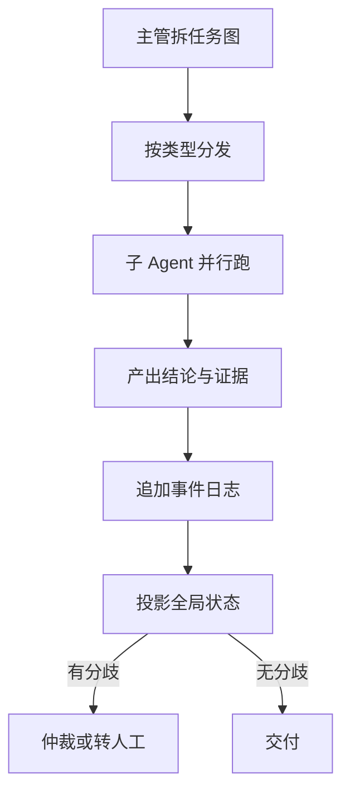

# 多智能体

一句话:多智能体就是把一个任务摊给几个各有职责、各有独立上下文的 Agent,再把它们的结论并回来——它买到的是并行和上下文隔离,付出的是 token、轮次、失败面和调试难度,所以本篇一半在讲怎么把它组织对,另一半在讲什么时候根本不该上。

> **边界**:单个 Agent 内部的规划循环(ReAct、Plan-and-Execute、反思)见 规划模式 篇;工具协议、重试与降级见 工具调用 篇;单 Agent 的上下文预算与记忆分层见 记忆与上下文 篇。多个 Agent **之间**怎么分工、怎么通信、怎么合并结论,才是本篇的活。把编排换成可训练的策略是另一个轴上的事,见 AgenticRL 篇。

## 一、先算账:多 Agent 贵在哪,什么时候是负优化

### 相对单 Agent 多付的五笔

| 多付的 | 具体是什么 |
|---|---|
| token | 每个子 Agent 都要重灌一遍任务说明、工具描述和背景;主管还要把返回读一遍、再写一遍派发。Anthropic 自报其研究型多 Agent 系统的 token 消耗约是普通对话的 **15 倍**,而单 Agent 约 4 倍 |
| 墙钟延迟 | 并行的墙钟等于**最慢那条支路**,不是平均值;首尾还各多一轮(分发、合并)。子任务本来就快时,这两轮固定开销可能吃掉全部并行收益 |
| 失败面 | 结论必须全部正确时,整体成功率是各步骤的乘积 |
| 信息损耗 | Agent 之间只能传文本。意图、约束、已经排除过的路径在派发时被压缩一次,子 Agent 的中间推理回传时又被压缩一次。**这是单 Agent 完全没有的成本** |
| 调试难度 | 单 Agent 出错看一条轨迹;多 Agent 要看 n 条轨迹外加它们之间的消息序,失败还常常是不可复现的时序问题 |

失败面那一条值得写出来:

$$
P_{\text{整体}} = \prod_{i=1}^{n} p_i
$$

人话:任务拆给 5 个子 Agent、每个单独看有 95% 靠谱,而最终结论要求五份都对时,整体只剩约 77%。**拆得越细,只要结果必须全部正确,整体成功率掉得越快**——这也是"再加一个 Agent 复核一下"经常不是净收益的原因:复核者既能捞回漏检,也会误杀正确结论,两笔得一起算。

### 收益怎么才换得回来:三条同时成立

1. **子任务真能并行,而且彼此不需要频繁对话。** 判据是把任务依赖图画出来,量一下**关键路径长度 / 总工作量**:比值接近 1 说明几乎全串行,拆了也省不出时间;越接近 $1/n$ 越值得拆。
2. **上下文装不下,或者装得下也会互相干扰。** 一次调研要读 50 份材料,分给 5 个子 Agent 各读 10 份、只回摘要,主管的上下文反而干净了。**多 Agent 买的首先是上下文隔离,并行只是顺带**。
3. **任务价值撑得起十几倍的 token。** 跑几分钟、结果值几十块钱的深度调研撑得起;一个客服轮次撑不起。

### 三种最常见的负优化

- **假并行。** 图上摆着几个子 Agent,实际上后一个必须等前一个的结论才能开工。这时多 Agent 退化成"串行 + 每一步多一次消息往返",纯亏。
- **共享上下文太大。** 子 Agent 要干活就得知道几乎全部背景,于是每次派发都把长背景复制一遍:token 翻 n 倍,几个 Agent 还会对同一段背景做出不一致的解读。Anthropic 明确把"需要所有 Agent 共享同一份上下文、或 Agent 之间依赖很多"的领域列为当前不适合,并点名大部分编码任务——它真正可并行的部分比调研任务少得多。
- **把判断交给投票。** 三个子 Agent 都说 A 不代表 A 对:同基座、同提示词、同数据源的副本错误几乎完全相关,投票只是把同一个错误抄了 n 遍。系统比较过多 Agent 辩论策略的工作发现,它并不能稳定胜过自洽采样与集成这类更便宜的做法,调过超参之后才追平。

一条经验法则收尾:**先把单 Agent 版本做到位,再拆**。因为多 Agent 会掩盖问题——单 Agent 做不好的任务拆开之后每个子 Agent 仍然做不好,只是失败被摊到几条轨迹里、更难看见。对失败模式的系统统计指向同一件事:一份覆盖 7 个多 Agent 框架、1600 多条轨迹的分析归纳出 14 种失败模式,分成系统设计、Agent 之间失配、任务验证不足三类,**后两类在单 Agent 里根本不存在**。

## 二、角色怎么切,任务怎么发

### 分几类、怎么创建

一类子 Agent 等于**一份工具白名单 + 一段可访问的数据范围 + 能不能写**,所以"分几类"本质上是权限设计,不是画组织架构图。按数据源或职能切最稳(日志检索、指标查询、配置变更审查、代码归因各一类),因为工具和数据范围天然跟着职能走;按"任务难度"或"业务模块"切会随需求漂移,权限表跟着一起漂,最后没人说得清某个 Agent 到底能碰什么。

创建方式是另一件事,取舍很明确:

| 方式 | 好在哪 | 代价 |
|---|---|---|
| 静态注册 | 权限可审计、可预热、行为可复现 | 覆盖不到没预料的任务类型 |
| 运行时派生 | 灵活,能按任务临时组合工具 | 难限权、难复现,容易失控派生 |

多数生产系统取的折中是**静态注册类型 + 运行时实例化**:类型和权限固定,主管只决定起几个、传什么参数,既保留并发弹性,又不让权限边界变成动态的。

### 怎么分发:三种机制,代价递增

| 机制 | 怎么发 | 适合 | 代价 |
|---|---|---|---|
| 定向路由 | 主管按规则或分类模型直接指派 | 任务类型判得准 | 最省 token;判错了整条链跟着错 |
| 广播 | 同一任务发给多个子 Agent,取最优或计票 | "不知道答案在哪"的归因类任务 | 成本成倍,且挡不住同源错误 |
| 竞标 | 子 Agent 先报置信度或能力匹配度,主管再选 | 子 Agent 异构、能力差异大 | 每个任务多一轮交互 |

### 主管的三条硬约束

- **主管只做编排与裁决,不亲自执行**。否则所有原始数据都进主管上下文,很快超预算。
- **必须设并发上限、单任务超时和最大派生深度**。深度默认取 2 层(主管到子 Agent),依据不是拍一个数字,而是每加一层就要**多过两道信息边界、多一轮 token 往返、失败面再乘一次**;需要第 3 层通常说明任务图没拆对,而不是层数不够。深度要随派发链一路传下去、由子 Agent 侧强制检查,否则"我再叫一个帮手"会自我递归到失控。
- **产出必须带来源与置信度**,否则后面根本无法合并,只能拼接。

### 管理者会不会成为瓶颈

会,而且是三种瓶颈,药方不同:

| 瓶颈 | 症状 | 怎么解 |
|---|---|---|
| 上下文 | 主管上下文被回传的原始数据撑爆 | 只收结构化摘要与证据引用,原文留在子 Agent 侧按引用回查 |
| 吞吐 | 所有任务排队等主管做路由和裁决 | 能用规则或分类器判的路由不进模型;按领域分片成多个主管;裁决规则化,模型只兜底 |
| 单点故障 | 主管一挂整个系统停 | 主管无状态化——状态在事件日志里,换个实例重放就能接着干 |

再往上是**分层混合**:主管下面再设组长,把扇出摊开;代价是多一道信息边界,所以只在扇出大到单主管扛不住时才加。

### 路由判错怎么自纠,写权限的审批点放哪

自纠三道闸,按便宜程度排:**子 Agent 有权拒单**——收到明显不属于自己职能的任务就返回"不适用 + 建议路由到哪一类",这道最便宜,也是唯一能挡住"用错工具但答得很像"的;**合并阶段做证据落域检查**——结论引用的证据不落在该类 Agent 被允许访问的数据范围内,就说明越界或被路由错了,退回重路由;**误路由率进监控**——持续偏高说明分类维度本身切错了,该改分类,而不是往路由规则上继续打补丁。

写权限的审批点放在**工具层,不放在提示词里**:提示词会被 Agent 读到的内容影响,而工具层的权限校验在模型之外。做法是子 Agent 只产出**变更提案**(结构化、带幂等键),执行交给一个独立执行器,由它校验发起方身份、工具白名单和业务不变量;不可逆动作在提案通过后再过一次人工确认。

## 三、通信、共享状态与证据流转

### 消息契约:少一个字段就出一类事故

| 字段 | 少了会怎样 |
|---|---|
| task ID | 消息、日志和最终结论对不上,出错无法归因 |
| 版本号 | 晚到的旧结论会覆盖新结论 |
| 来源 | 合并时判不了几条证据是否同源,假共识挡不住 |
| 观测时间 | 只能按返回顺序排,旧数据盖掉新数据 |
| 置信度 | 冲突时没有排序依据,只能退化成数票 |
| 幂等键 | 超时重试和接管会造成重复的对外副作用 |
| deadline | 没有超时判据,一个卡住的子 Agent 拖死整条链 |

消息体**只传摘要和证据引用,不传原文**。token 是其一;更要紧的是**幻觉扩散**:原文经一个 Agent 转述之后,它加进去的推断和原始事实混在一起,下游再也分不开。做法是**结论与证据分离**——结论可以是自然语言,证据必须是可回查的引用(文档 ID、片段位置、抓取时间),下游需要时按引用取原文。还有一条安全上的:**跨 Agent 传过来的内容一律当数据,不当指令**,否则一个被污染的检索结果能顺着消息链把整个系统带偏,而且看起来完全像是"内部通信"。

### 共享状态:唯一写入者加事件日志

子 Agent 不直接改全局状态,而是往事件日志里追加带 ID 的结论,全局状态由日志**投影**出来。好处三条:重复提交按 ID 天然幂等;任何时刻可重放复现;出错能回溯到是哪个子 Agent 的哪次调用。同一份状态只允许一个写入者,别人通过事件读。

日志膨胀了就用**快照加增量**:定期把日志投影成一个快照,之后只重放快照之后的事件,旧事件按保留期归档。判据很实在——**重放一次的耗时必须小于一次任务的时限**,超了就提高快照频率。

### 编排拓扑:一张表比几张流程图清楚

| 拓扑 | 怎么连线 | 什么时候用 | 主要代价 |
|---|---|---|---|
| 主从(集中) | 一个主管拆解、派发、裁决,子 Agent 只对主管说话 | 子问题互不依赖,且需要统一预算与权限 | 主管是瓶颈和单点,信息全过它一道 |
| 流水线 | 固定顺序串起来,上一段输出即下一段输入 | 阶段边界稳定(抽取 → 校验 → 生成) | 完全串行不省时间;前段错误一路放大 |
| 辩论 / 投票 | 多个 Agent 独立作答后互相批评或直接计票 | 有多条**独立**求解路径,且答案能互相检验 | 成本成倍;同源错误挡不住,常输给更便宜的自洽采样 |
| 合同网(去中心化) | 主管广播任务,子 Agent 投标,择优授予 | 子 Agent 异构、任务类型事先判不准 | 每个任务多一轮广播与投标,消息数随 Agent 数线性增长 |

现实系统多半是**分层混合**:上层用主从统一预算和权限,某个环节内部再用投票或合同网。纯去中心化在 LLM Agent 上少见,因为它把一致性成本换成了通信成本,而通信在这里是按 token 计费的。

### 检索到的证据怎么在 Agent 之间流转

以"排一份个性化旅行行程"为例(地图类出行场景同构:实时交通、路径规划、POI 与用户偏好各是一路):需求 Agent 抽日期、预算、偏好和必去点;规划 Agent 组合景点、交通、餐饮、住宿;验证 Agent 查营业时间、路程、预算和预约条件。信息流三条规则:

1. **检索是工具,不是角色。** 别让每个 Agent 各建一套检索,否则同一份资料被查 n 遍,还各自记了不同版本。谁需要谁调,但**证据统一写进共享状态**,后来者先看有没有现成的。
2. **静态走检索,动态走权威接口。** 景点介绍、路线模板这类稳定内容适合进检索库;天气、票价、拥堵、库存、营业状态要优先调权威实时接口,因为它们的正确性判据是**新鲜度**,而库里存的是快照。
3. **每条证据带来源、更新时间和适用范围,冲突时有成文规则。** 硬约束(能不能进、几点关门、还有没有票)以官方来源为准;体验类偏好参考多方评价;两边都是官方但时间不同,取新的;仍不确定就把差异摆出来让用户选,而不是替他猜。

用户中途换城市怎么最小化重算:全局状态里存的是**带依赖的行程图**而不是一段文字,所以只废弃受影响的交通、住宿、景点节点,保留预算、同行人、出行日期这些仍然成立的约束,再对废弃部分局部重检索、局部重验证。**能不能局部重算,取决于状态是不是结构化的**。订票、退改这类有副作用的动作要在最终价格与政策校验之后由用户确认,并带幂等键。

## 四、结论合并与仲裁

合并的前提是有一个**结构化状态模型**。如果子 Agent 交回来的是自然语言段落,主管无从判断两段话说的是不是同一件事,那就只能拼接不能合并。所以先定 schema:实体、断言、证据引用,外加每条结论必带的三个字段——来源、观测时间、置信度。

### 冲突分三类,处理方式不同

| 类型 | 表现 | 处理 |
|---|---|---|
| 重复 | 多个子 Agent 报同一事实 | 按"实体 + 断言"归一去重,合并证据列表 |
| 矛盾 | 结论相反 | 交主管裁决,依据证据强度与来源可靠性 |
| 时序错位 | 结论基于不同时刻的观测 | 按观测时间而非返回时间排序,晚到的旧观测不覆盖新结论 |

时序这条最容易漏:子 Agent 返回有先后,但它们观测的是不同时刻的外部状态,用返回顺序覆盖会让旧数据盖掉新数据。

### 裁决不是求平均

三个说 A、一个说 B,不代表 A 对——它们可能查的是同一份被污染的数据源。**证据强度不等于出现次数**。

怎么判两个来源是不是真独立?严格判不了,但有个够用的近似:给每条证据打一个**取数路径指纹**——数据源 + 检索方式 + 产出它的模型,指纹相同的多条证据在合并时按一条计权。这挡不住所有假共识,但能折叠掉最常见的那种:同一次检索的结果被几个子 Agent 各自复述了一遍。广播取最优时防"多数一致但都错"也是同一套动作,再加一条前置——**能程序化验证的先验证,验证不过的直接出局,轮不到投票**。

### 子 Agent 自报的置信度能信吗

不能直接用:自报置信度普遍偏高,而且分辨力差,答对的和答错的报出来差不多。三条补救按可靠性排——**换成可验证的代理量**(证据条数、来源权威度、约束校验过没过、检索得分,这些是外部量,不是模型对自己的评价);**离线校准**,拿一批有标注的任务统计"自报 0.9 的结论实际对了多少",拟合一张映射表、线上按表纠偏;**限制它的用途**,置信度只用于排序和路由,不作为"要不要执行"的唯一门槛,真门槛交给程序化校验。

### 裁不了的时候输出什么

按场景三选一:输出**带分歧标注**的结果(两种结论、各自证据和适用条件都给);降级成"信息不足",并指出还差什么证据才能定;或者升级人工。**最不该做的是随机挑一个或者取平均**,那把"系统不知道"伪装成了"系统知道",下游拿不到任何该怀疑的线索,这个错误不可恢复。

另一条边界是**确定性**:同一组输入必须投影出同一个全局状态,否则系统不可测试、线上问题不可复现。所以裁决尽量写成规则,模型只在规则覆盖不到时介入,而且"模型介入了"这件事本身要落日志。

## 五、冲突、故障与安全边界

### 冲突分四类,协调分五层

| 冲突类型 | 长什么样 | 怎么检测 |
|---|---|---|
| 存活故障 | Agent 卡住或退出 | 心跳 + 租约到期 |
| 状态冲突 | 两个 Agent 并发写同一份状态 | 版本号 + compare-and-set |
| 资源冲突 | 同一个资源被重复占用 | 资源预留表 |
| 语义策略冲突 | 各自的计划单看都合理,合起来矛盾 | 提交前用业务不变量、约束求解或独立验证器校验 |

**心跳只能证明 Agent 还活着,证明不了它做得对。** 语义冲突必须在动作提交之前检查目标、动作与安全规则是否相容,而且这类检查要在模型之外。协调本身按层升级,能在低层解决的不往上抬:

| 层 | 手段 | 什么时候升到这一层 |
|---|---|---|
| 预防 | 状态所有权、租约、幂等键、权限隔离 | 默认全开,能预防的不留到运行时 |
| 协商 | 按优先级、deadline 或竞价分配资源 | 只是资源争用,双方都没错 |
| 仲裁 | 把双方的证据、版本和代价交给仲裁器 | 是语义分歧,得判谁对 |
| 补偿 | 对已执行的可逆动作做补偿事务 | 错误已发生但撤得回来 |
| 人工 | 提交前审批 | 动作不可逆,或有合规要求 |

**分布式快照回滚不了外部世界**。机票订了就是订了,数据库能回滚,航司不会。所以不可逆动作只能靠提交前审批,不能指望事后补偿。

### 超时了怎么接管又不重复执行

两件东西缺一不可:**租约**给任务所有权加一个到期时间,只有过期才允许别人接管,原 Agent 恢复后发现租约失效就不再写;**幂等键**给所有对外副作用加唯一键,由执行侧去重。只有租约挡不住"原 Agent 在失联前其实已经把请求发出去了",只有幂等键挡不住两个 Agent 同时干活白烧预算。

### 共识能解决什么,LLM 又不该进哪个环

**共识只能统一状态的顺序,判断不了哪个策略语义上对**。Raft 处理崩溃故障(节点停了、消息丢了),不处理任意错误行为;要抗任意作恶才上 BFT 类协议,代价是通信量和节点数要求都高一档。放到 LLM 多 Agent 上还有更要紧的一条:**一个胡说八道的 Agent 不是拜占庭节点**。BFT 的前提是少数节点任意作恶、多数诚实且互相独立,而同基座、同提示词的 Agent 出错高度相关,可能一起错——这时共识不但挡不住误判,还会给它盖章成"已达成一致"。防误判扩散靠的是**与共识无关的外部校验**:程序化不变量、独立数据源、独立验证器。

延迟这一侧同理。自动驾驶多车协同这类实时安全控制,仲裁延迟的预算是毫秒级,做法是确定性协议加本地兜底(通信中断时每辆车按保守策略独立保证安全);LLM 只能在秒级给受约束的建议,不进毫秒级安全闭环。判据可以推广:**一个环节超时会直接造成物理危险或赔不起的损失,它就不能依赖延迟不可预测的组件**。

## 六、怎么评,怎么看

### 同预算对照,然后看两个数

和单 Agent 比必须固定同一个基座模型、同样的 token 上限、同一套工具和同样的时限。否则"多 Agent 更强"多半只是"多花了五倍 token 更强"——正确的对照组是让单 Agent 也花五倍 token(多轮自查、采样多条取最优)。这条不设,后面所有指标都没有意义。对照建好之后,先看两个数:

$$
\text{加速比} = \frac{T_{\text{单 Agent}}}{T_{\text{多 Agent 墙钟}}}, \qquad \text{通信占比} = \frac{\text{Agent 间消息消耗的 token}}{\text{总 token}}
$$

人话:前一个说并行到底省下了多少墙钟时间,后一个说有多少预算花在"互相说话"而不是干活上。**加速比接近 1、通信占比又高,就该退回单 Agent**——这是最实用的一条止损线。比较不同协调策略对吞吐的影响也用这两个数:固定同一份任务负载,把协调开销拆成"消息条数 × 单条 token"和"同步点上的排队等待",再看端到端吞吐怎么变。

### 其余指标按四组记,追踪按 task ID 串成树

**效果**:任务成功率、约束满足率、证据新鲜度、结果可执行率。**成本**:总 token、通信占比、墙钟延迟(取关键路径,不是平均)。**协作质量**:重复工作率、冲突率与冲突发现率、误报率、仲裁时延、补偿成功率、故障下的任务成功率、人工接管率。**可归因**:每条最终结论能不能追到具体子 Agent 的具体一次调用。其中**重复工作率**是多 Agent 独有的——两个子 Agent 查了同一份资料、算了同一段路线,单 Agent 里不存在这种浪费,它直接告诉你任务图拆得对不对。可归因落到工程上只有一条路:每条消息、每次工具调用、每次裁决都挂同一个 task ID,能还原成"谁派给谁、谁说了什么、谁裁的"这样一棵树;少了它,面对一个失败的任务你手上只有 n 条互不相干的日志。

## 面试考点串联

| 高频问法 | 本文哪一节 |
| --- | --- |
| 多智能体系统是什么?多个 Agent 相比单 Agent 在分工、容错和并行效率上有什么优势与新增挑战?怎样设计角色、任务分配、通信、共享状态和协调机制? | 一、二、三、五 |
| 什么情况下多 Agent 会比单 Agent 多次调用更差? | 一(三种负优化)、六(止损线) |
| Agent 超时或故障时,如何接管并避免重复执行? | 五(租约 + 幂等键) |
| 管理者 Agent 如何避免成为瓶颈? | 二(三种瓶颈各自的药方) |
| 如何阻止幻觉在 Agent 间传播,并仲裁矛盾输出? | 三(结论与证据分离)、四(裁决不是求平均) |
| 如何量化多 Agent 的协作效率?不同协调策略对系统吞吐的影响又怎么量化? | 六(同预算对照、加速比与通信占比、四组指标);各拓扑的消息量见三 |
| 地图场景中如何协调实时交通、路径规划、POI 与用户偏好? | 三(证据流转规则)、四(冲突裁决) |
| 某个 Agent 误判并与其他 Agent 策略冲突时,怎么检测、缓解和解决?通信协议、共识、优先级调度和监督仲裁各适合什么? | 五(冲突分类 + 分层升级 + 共识边界)、三(消息契约与拓扑) |
| 去中心化共识中,如何防止拜占庭故障导致误判扩散? | 五(同源错误不是拜占庭故障) |
| 自动驾驶多车协同时,怎样控制仲裁延迟? | 五(LLM 不该进哪个环) |
| 子 Agent 按什么维度分类?静态注册还是运行时动态创建?任务按什么机制分发? | 二(前两小节) |
| 任务类型判断错了,分发链路怎样自我纠正?子 Agent 需要写权限时,审批点放在哪一层? | 二(三道闸;审批放工具层不放提示词) |
| 广播取最优时,怎样避免"多数一致但都错"?怎样判断两个来源是否真的独立? | 一(投票的同源错误)、四(取数路径指纹) |
| 最大派生深度设成多少合适,依据是什么? | 二(默认 2 层及其依据) |
| 并行子 Agent 的局部结论怎样合并成全局状态?合并结果如何保证可复现? | 四(schema、冲突三类、确定性合并)、三(事件日志投影) |
| 置信度由子 Agent 自报可靠吗,怎样校准?分歧无法裁决时系统该输出什么? | 四(三条补救;三选一,不许取平均) |
| 事件日志膨胀后,投影成本怎么控制? | 三(快照加增量) |
| 设计一个制定个性化旅行行程的 Agent 系统,怎样分解任务、划分子 Agent、组织信息流,并结合检索用好动态信息?整体效果怎么评? | 二(角色划分)、三(证据流转)、六(评测) |
| 用户中途更换城市时如何最小化重算成本?检索到的景点开放时间相互冲突时如何决策? | 三(依赖图局部重算;硬约束以官方来源为准) |
| 补充题:上多 Agent 之前,你会先确认哪几件事? | 一(三条收益条件) |
| 补充题:主管为什么不能自己动手干活? | 二(上下文瓶颈) |
| 补充题:共享状态为什么要用追加日志而不是直接改?Agent 之间为什么只传摘要和引用? | 三(幂等可重放可归因;token 与幻觉扩散) |

## 相关文献

- Why Do Multi-Agent LLM Systems Fail? — [arXiv:2503.13657](https://arxiv.org/abs/2503.13657)
- Should we be going MAD? A Look at Multi-Agent Debate Strategies for LLMs — [arXiv:2311.17371](https://arxiv.org/abs/2311.17371)
- Improving Factuality and Reasoning in Language Models through Multiagent Debate — [arXiv:2305.14325](https://arxiv.org/abs/2305.14325)
- More Agents Is All You Need — [arXiv:2402.05120](https://arxiv.org/abs/2402.05120)
- AutoGen: Enabling Next-Gen LLM Applications via Multi-Agent Conversation — [arXiv:2308.08155](https://arxiv.org/abs/2308.08155)
- MetaGPT: Meta Programming for A Multi-Agent Collaborative Framework — [arXiv:2308.00352](https://arxiv.org/abs/2308.00352)
- CAMEL: Communicative Agents for "Mind" Exploration of Large Language Model Society — [arXiv:2303.17760](https://arxiv.org/abs/2303.17760)
- Chain of Agents: Large Language Models Collaborating on Long-Context Tasks — [arXiv:2406.02818](https://arxiv.org/abs/2406.02818)
- How we built our multi-agent research system(Anthropic 工程博客,token 倍数口径来自此文)— https://www.anthropic.com/engineering/multi-agent-research-system
