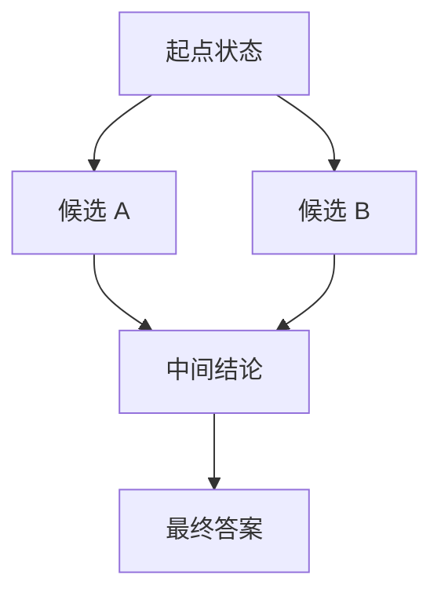

# 规划模式

一句话:规划模式管的是**一个 Agent 怎么决定还要不要再来一步、下一步做什么**——同一个模型、同一套工具,循环组织方式换一种,一次任务的成本能差十几倍;而「它到底停不停得下来」完全由这一层决定,不由模型决定。

> **边界**:本篇只管单个 Agent 的推理循环。工具的协议、schema、五道校验闸与重试预算见 工具调用 篇;观察结果和历史怎么存、上下文预算怎么分见 记忆与上下文 篇;多个 Agent 之间怎么分工与仲裁见 多智能体 篇;把「下一步做什么」从人写死的编排换成学出来的策略,见 AgenticRL 篇。

## 一、ReAct:把决定权推迟到看见结果之后

### 一步是三段:Thought / Action / Observation

**ReAct 的关键不是「让模型把想法说出来」,而是把「下一步做什么」的决定推迟到看见上一步的观察之后**。一次迭代固定三段:

- **Thought**:对当前状态的判断加下一步意图。它不产生任何副作用,唯一作用是把「为什么这么做」留在上下文里,让下一次生成有依据;它是模型的私有推理,对外落日志记一段摘要就够,不必原样展示给用户
- **Action**:一个结构化的动作——工具名加参数,或者一个显式的终止动作
- **Observation**:环境返回的结果,净化之后回填进上下文

为什么要交错,而不是一口气把计划想完?因为**很多信息是执行出来的,不是想出来的**。多跳检索里第二跳查什么,完全取决于第一跳查到了谁;实时数据类任务里,模型的先验根本不含今天那个数值。一次性规划在这类任务上只能猜,猜错了整条计划一起作废。

### 它和纯 Prompt、CoT、Function Calling 不在一个轴上

| | 有没有「下一步」 | 有没有外部反馈 | 一次任务的模型调用 |
|---|---|---|---|
| 纯 Prompt | 没有,一次生成到底 | 无 | 1 |
| CoT | 有,但只发生在一次生成的内部 | 无 | 1 |
| Self-Consistency | 同上,只是并行采 k 条链再投票 | 无 | k |
| ReAct | 有,每步看完观察再定 | 有 | 步数 n |

**Function Calling 不在这张表里,因为它回答的是另一个问题**:这一步的动作怎么表达成机器能解析的字段。ReAct 回答的是要不要有下一步。两者正交,默认组合就是外层 ReAct 循环控制步数、内层每个 Action 用 Function Calling 表达——因为纯提示式 ReAct 得从自由文本里正则抠动作,格式错误率明显更高。协议、schema 与校验见 工具调用 篇。

### 什么任务值得上,什么任务不值得

值得的是:多跳检索、需要实时信息、需要精确计算或跑代码、以及任何「路径依赖中间结果」的任务——工具返回空结果或可恢复错误时,循环还能改查询、换工具,或者回头向用户澄清。不值得的是:流程本来就固定的(填表、走审批)、一跳就能答完的、以及延迟预算很紧的。因为 ReAct 每多一步就多付一次「模型生成 + 工具往返 + 把新观察拼进上下文重新 prefill」,而最后一项还随历史长度往上涨。这笔延迟账怎么拆见 工具调用 篇。

还有一条必须说死:**ReAct 不解决幻觉**。它只是把「模型凭先验编」换成「模型基于观察编」,而观察本身可能陈旧、可能被注入、也可能就是错的;模型照样会选错工具、把观察读岔。所以不能拿「上了 ReAct」当正确性的保证。

### Observation 的字段契约

观察不能是一坨自由文本丢回去,至少这几个字段得有:

| 字段 | 少了会怎样 |
|---|---|
| 调用 ID | 一轮发了几个动作时,结果配不上动作,后续全串 |
| 状态:成功 / 失败 / 空结果 | 空结果是有效答案(「查无此单」),被当成失败就会换个工具再查,等于制造幻觉 |
| 数据本身,加上它的时间戳 | 模型不知道「现在」,不标时间就会把上周的数拿来当实时的用 |
| 来源与可信级别 | 决定这段文本能不能当事实用 |
| 错误类别(失败时) | 决定下一步是重试、换路还是终止 |

隔离不可信文本靠三条:观察以**数据**身份进上下文并标注来源,不和指令混在同一段自由文本里;超长的先截断但保留结构,别把半截 JSON 塞进去;**观察里的字符串绝不能不过校验就变成下一个动作的参数**。注入的完整防线见 工具调用 篇。

### Action 空间怎么定

动作集合必须**封闭且可枚举**,而且要显式包含两个特殊动作:「给出最终答案」和「向用户澄清」。**没有显式终止动作的循环没有干净的出口**——模型只能靠「这一轮不调工具了」隐式收尾,而这在格式上是判定不了的,解析器分不清它是想结束还是生成跑偏了。

粒度是个跷跷板:拆得太细(打开文件、读一行、关文件),步数直接翻几倍,每一步都是一次完整往返;合得太粗(一个带 mode 的万能动作),会把「选错工具」变成「选错分支」,更难观测也更难降级。工具描述本身怎么写才不让模型选错,见 工具调用 篇。

## 二、计划从哪来:先想再做,还是边做边想

### Plan-and-Execute:把「想」和「做」切成两段

先让模型一次性把任务拆成一张带依赖关系的步骤表,再交给执行器按表跑,执行阶段基本不用大模型。它买到三样东西:

1. **模型调用次数从「和步数成正比」降到常数级**。ReAct 每一步都要把全部历史重新 prefill 一遍,历史越长越贵;Plan-and-Execute 只在规划和最后汇总时用大模型。ReWOO 那条线更彻底——计划里的步骤用占位符互相引用,工具全跑完再一次性代入,观察压根不进规划那一轮的上下文
2. **计划是一个可审计的对象**。执行之前人能看、能改、能否决,这在金融、医疗这类场景是硬要求
3. **能并行**。计划本身就是一张 DAG,互不依赖的分支可以同时跑;ReAct 天然串行,因为下一步得等观察回来

代价只有一条,但很致命:**计划是在信息最少的那一刻做出来的**。任务只要有「查了才知道下一步」的分叉,预先的计划就是猜出来的。

### 计划中途失效:重规划还是回退

按「什么东西坏了」分三种,处理方式完全不同。ReAct 没有显式计划,但「这一步失败了要不要换方向」是同一个判断,所以这张表对两种循环都适用:

| 出了什么事 | 该做什么 | 因为 |
|---|---|---|
| 某一步失败,但目标和依赖没变 | 局部重试或换等价工具,计划不动 | 改计划要付一次大模型调用加整份上下文重读,不值得为一次超时付 |
| 观察推翻了计划里的某个前提 | **局部重规划**:只重做受影响的那棵子树 | 全量重规划会把已经做完、结果还有效的步骤一起扔掉 |
| 目标本身错了,或者信息根本不够 | 回退到澄清,或者明确失败 | 在错误方向上继续规划,只是把错误做得更深 |

一条必须单独设的护栏:**重规划次数要独立计数并封顶**,常见 2–3 次。因为重规划本身就是死循环的高发区——计划 A 失败,重规划出计划 B,B 踩同一个坑,再规划又绕回 A。而且每次重规划**必须把上一轮为什么失败写进输入**,否则模型拿到的信息和上次一模一样,大概率原样再生成一份同样的计划。

### 反思:把失败写成文字,不是写成梯度

把上面那句「把失败写进输入」做成稳定机制,就是反思(Reflexion):一轮任务或某一步失败后,让模型对着轨迹写一段自我批评,存进一块「经验」区,下一轮开头再读回上下文。

**名字里带 reinforcement,但它一个参数都不更新**——起作用的载体是上下文,不是权重。这也决定了它的两面:见效快,不用训练、改提示就能上;但能力不跨会话累积,经验区一清就回到原点。真要把经验固化进参数是另一件事,见 AgenticRL 篇。

它能不能成立只看一个条件:**有没有一个比模型自己更可靠的信号,告诉它「刚才那次失败了」**。有单元测试、编译器、执行器、环境成败标志的场景,反思是实打实有效的;只让模型自己判断自己对不对,收益经常是零甚至为负——已有工作明确指出,在拿不到外部反馈时,LLM 的自我纠正反而会把本来对的答案改错。

三条工程约束:反思文本**可累积但必须有上限**,否则几轮之后经验区就把上下文吃光了,怎么摘要、放在哪一层见 记忆与上下文 篇;反思要落成**可执行的下一步建议**(「这个接口要的是 ISO 日期」),不是「我下次应该更仔细」这种没信息量的复盘;反思结论**是推测不是事实**,不能直接写进长期记忆当事实用。

## 三、搜索结构:一条链、一棵树、一张图

### 差别只有两件事:留几条候选、能不能合并

**CoT、ToT、GoT 的区别不是「模型想得深不深」,而是同时保留几条候选推理路径、这些路径之间能不能汇合**。它们和 ReAct 也不互斥:ReAct 决定的是「要不要再和环境交互一步」,搜索结构决定的是「作决定之前同时留几个候选」,所以复杂任务里既可以在 ReAct 的每一步内部展开一次小搜索,也可以反过来让搜索树的每个节点本身就是一次 ReAct 交互(LATS 走的是后一条路)。

对着图看:只走 S→A→C→R 一条线,是 CoT;同时留住 A 和 B、发现 A 不行还能退回 S 换分支,是 ToT;A 和 B 汇进同一个 C 的那两条边,只有 GoT 有。

| | 同时保留几条 | 走错了能回头吗 | 能合并复用吗 | 模型调用量级 | 什么时候用 |
|---|---|---|---|---|---|
| CoT | 1 | 不能,只能一路错到底 | —— | 1 | 步数少、单条路大概率走得通 |
| Self-Consistency | k 条互不相干的链 | 不能 | 只在末端投票 | k(常见 5–40) | 答案短、能归一化比较 |
| ToT | 每层 b 个,搜 d 层 | 能,评价器打分后回溯 | 不能 | $d \cdot b$ 起步 | 状态可打分、可验证的搜索题 |
| GoT | 图上任意多个 | 能 | **能**,靠合并边复用中间结果 | 由边数决定,通常最贵 | 中间结果值得聚合复用 |

成本别只记「更贵」,记这个形状:

$$
N_{\text{calls}} \approx d \cdot b \cdot (1 + c)
$$

$d$ 是搜索深度,$b$ 是每层生成并评价的候选数,$c$ 是每个候选平均要几次评价调用(用同一个 LLM 当评价器时 $c \approx 1$,用执行器验算时 $c = 0$)。人话说就是:**树搜索的开销是深度乘宽度,再乘上评价那一份**。把 $b$ 从 1 提到 5、评价再各来一次,一道题的模型调用就从 1 次涨到几十次,端到端延迟同比例往上走——这就是它在实时场景基本用不了的原因。

### ToT:BFS 还是 DFS,还有哪些剪枝

| | BFS(逐层保留 top-b) | DFS(一条路走到底再回溯) |
|---|---|---|
| 峰值占用 | 大,b 个状态同时挂着 | 小,只挂当前这一条路径 |
| 适合 | 深度浅、每层分支多、**同层候选之间可比较** | 深度大、**中途能判定这条路已经死了** |
| 最坏情况 | 宽度爆炸,预算全花在浅层 | 在一条错路上钻到底才回头 |
| 预算耗尽时 | 至少手里有一批同深度的半成品 | 可能一条完整路径都没走完 |

判据就一句:**能不能在中途判定「这条路已经死了」**。能,就 DFS 加早停,省内存也省调用;不能,就只剩同层横向比分这一条路,那就 BFS 加 beam。剪枝手段按代价从低到高排,顺序不能乱:

1. **硬约束先剪**——格式非法、超出权限、参数越界、违反业务规则。这一步纯规则、不花模型调用,所以必须排最前面,一分钱不花就砍掉一大批
2. **去重**——把状态归一化后取内容哈希判等,防止同一个中间状态被反复展开
3. **换成可验证的分数**——能跑执行器、测试、求解器的,就别用 LLM 打分
4. **beam / top-k**——只留分最高的 b 个继续展开
5. **总预算封顶**——调用次数、token 数、墙上时间三个都要有上限,先撞到哪个就停哪个

### GoT:合并靠内容哈希,复杂度靠三个上限

GoT 比 ToT 只多一样东西:**合并边**。两个分支各算出一部分,可以汇成一个新节点再往下走。它的收益场景很窄但很明确——中间结果**可以被聚合或复用**的任务:多文档各自抽取再合并、大集合分片处理后汇总、排序归并。中间结果没法复用的任务上,GoT 只是更贵的 ToT。

工程上要给节点定契约:输入、输出、产生它的操作与版本、依赖哪些父节点。**判等必须用内容哈希,不能用文本相等**,因为同一个中间结论换个说法就成了新节点,图会迅速膨胀成一堆近似重复,合并这件事就白做了。复杂度则靠三个显式上限压住:**最大深度、最大边数、同一节点的最大迭代次数**。最后一条最容易漏——GoT 允许「refine 之后再回到同一个节点」,那在图上就是一个环,不封次数它就是死循环换了个形状。

### 评价器才是天花板

**搜索的效果上限由评价器决定,不由展开宽度决定。评价器是错的,把 b 从 3 加到 10 只是更快地选出更多错答案**。

| 任务 | 靠谱的评价器 |
|---|---|
| 数学计算 | 代码执行器或符号求解器验算 |
| 写代码 | 编译加跑单元测试 |
| 带约束的规划(排班、路径) | 约束求解器检查可行性 |
| 检索问答 | 结论有没有被取回的证据真正支持 |
| 开放式写作 | **没有**——这类任务不适合靠搜索硬堆 |

让同一个模型给自己的候选打分,分数和正确性的相关性通常很弱,还带系统性偏置(偏好更长的、偏好自己生成的)。所以结论很实用:**有外部验证器才值得上 ToT 或 GoT;没有的话,Self-Consistency 往往性价比更高**,因为投票只依赖多条独立链的答案一致不一致,不依赖模型自评的绝对分数。代价是它要求答案短且能归一化比较(一个数、一个选项、一段能标准化的代码),开放式长文本没法投票——两段说法不同但都对的答案会互相稀释票数。

### 实时场景怎么办

三档,按代价从低到高上:

1. **缓存**:同一个、或语义相同的子问题直接复用结果,做法见 检索优化 篇
2. **预算自适应**:默认先跑一条 CoT,只有校验没过或置信度低时才展开搜索。因为绝大多数请求根本不需要搜索,预算应该花在少数难题上
3. **确定性规则兜底**:高频、意图闭合的请求直接走写死的流程,压根不进 LLM 搜索

一条硬边界:**安全关键的实时闭环——自动驾驶控制、工业控制这一类——不能把决策交给开放式 LLM 搜索**,因为它的延迟没有上界、结果不可复现,也给不出形式化的安全保证。这类系统里 LLM 只能待在可被规则否决的建议层。

## 四、护栏:让循环一定停得下来

**默认的 Agent 循环是不停机的**——「模型觉得还没做完就继续」这条规则本身不含任何终止保证。所以护栏不是加分项,是循环能上线的前提。

### 四道闸,少一道都拦不住

| 闸 | 怎么定 | 拦的是哪种失控 | 触发后做什么 |
|---|---|---|---|
| 最大步数 | 拿真实任务的步数分布定,常见 10–30 | 无边界地试探 | 停下,把已有的部分结果交出去 |
| 全链路 deadline | 从用户能等多久倒推 | 每步都不超时、累加起来超时 | 剩余时间不够就跳过可选步骤 |
| 成本预算 | token、调用次数、金额 | 步数不多但每步很贵 | 降级到便宜路径 |
| 重复检测 | 见下一小节 | 原地打转 | 强制换策略或终止 |

为什么四道都要:**它们拦的是形状完全不同的失控**。只设最大步数,一个 30 步、每步展开 5 个候选的任务照样能烧穿预算;只设 deadline,一个飞快循环调同一个缓存工具的 Agent 能在 deadline 内空转几百圈。

deadline 还有一条实现要求:**它必须随调用往下传**,每一跳拿到的超时等于剩余 deadline 减去留给收尾作答的时间。这样前面慢了,后面自动被压缩,而不是各跳按各自的超时把总时间累加成用户等不起的数。级联超时和重试预算的具体算法见 工具调用 篇。

### 死循环有三种形状,检法不一样

| 形状 | 长什么样 | 怎么检 |
|---|---|---|
| 完全重复 | 同一个工具、同一份参数连着调 | 对「工具名 + 规范化参数」取哈希,窗口内重复 2–3 次就拦 |
| 换汤不换药 | 参数只改了措辞,语义没变 | 参数先归一化再哈希;或对动作序列算嵌入相似度 |
| 无进展的振荡 | A→B→A→B,每步都合法但状态不前进 | 定义**进展信号**,连续 k 步没有增量就判停滞 |

第三种最难也最重要,因为**前两种只看动作就够了,第三种必须看状态**。进展信号得是可数的东西:新拿到的证据条数、被标记完成的子目标数、验证器分数、待办队列的长度。没有它,一个模型可以「合法地」永远忙下去——每一步都在做不同的事,只是没有一件事让任务更接近完成。

参数归一化要覆盖大小写、空白、字段顺序、分页参数,以及相对时间(「明天」在入口就解析成具体日期,做法见 记忆与上下文 篇),漏掉一项就漏掉一类重复。检出重复之后**不能只是重试**,必须改变模型看到的输入,否则上下文几乎没变、输出也就几乎不变。四招有效:把「你刚才用这些参数调过 X,结果是 Y」显式写进上下文;调高采样温度换一条路径;把这一轮可用的动作集合缩小,逼它换手段;或者干脆停下来向用户澄清。

### 撞上护栏之后输出什么

- **必须明说没做完,以及做到了哪一步**。因为默默交一个不完整的结果比直接失败更糟——用户会把它当成完整答案用,错误就这么流到下游去了
- 把能用的部分结果和证据交出去,并标注哪些是缺的
- 落一条结构化的终止记录:终止原因、步数、耗时、花费、最后的状态。它是排障的唯一入手点,也是后面做评测和策略改进的数据来源

## 五、选型:先问三个问题

**决策线就三步:能写死就别让模型规划;必须让模型规划,先问「下一步依不依赖上一步的结果」;要上搜索,先问「有没有靠谱的评价器」**。

| 模式 | 什么时候选 | 主要代价 | 靠什么停机 |
|---|---|---|---|
| 固定流程 | 流程稳定、要逐步审计、错一次代价高 | 长尾分支覆盖不过来 | 流程图本身是有限的 |
| CoT 单次生成 | 一次就能答完,不需要外部信息 | 中途错了没有纠正机会 | 生成结束即停 |
| Self-Consistency | 答案短且可比较,准确率比延迟重要 | k 倍成本 | 采样次数写死 |
| Plan-and-Execute | 步骤能提前拆清、依赖稳定、要并行或要审批 | 计划在信息最少时做出 | 计划长度有限,再加重规划次数封顶 |
| ReAct | 下一步依赖上一步的观察 | 步数不可预测,最贵也最容易跑飞 | **完全靠第四节那四道闸** |
| ToT / GoT | 有可验证的评价器,且值得多花十几倍算力 | 成本和延迟上一个量级 | 深度、宽度、总预算三重封顶 |

现实系统很少单选。最常见的形状是**外层用 Plan-and-Execute 出一张粗计划,某个不确定的步骤内部再开一个小 ReAct 循环**,高风险步骤前面插人工确认。把任务摊给几个 Agent 是另一个轴上的事,见 多智能体 篇。

## 面试考点串联

| 高频问法 | 本文哪一节 |
| --- | --- |
| ReAct 的核心循环是什么?它和纯 Prompt、CoT、Function Calling、ToT 是什么关系?适合什么任务,又有哪些成本、错误和无限循环风险? | 一、三、四 |
| ReAct 和 Function Calling 怎么组合? | 一 |
| ReAct、CoT、ToT 和 Self-Consistency 的区别与成本分别是什么? | 三 |
| 多步复杂规划超过 ReAct 的能力时,怎么引入 Plan-and-Execute 或搜索? | 二、三、五 |
| Observation 应该包含哪些字段?怎么隔离不可信的工具文本? | 一 |
| 怎么设计 Action 空间,减少选错工具或参数? | 一(工具描述本身见 工具调用 篇) |
| 工具失败时,循环该重试、换路还是安全终止? | 二(计划失效三分法)、四 |
| 怎么用最大步数、deadline 和重复检测打断死循环? | 四 |
| CoT、ToT、GoT 的原理、适用场景、优缺点和工程局限分别是什么?复杂多步任务怎么选型? | 三、五 |
| ToT 用 BFS 还是 DFS?还有哪些剪枝手段? | 三 |
| GoT 的图怎么建、怎么维护?复杂度怎么控住? | 三 |
| 实时性要求高的时候,搜索的延迟和效果怎么权衡? | 三 |
| 补充题:Plan-and-Execute 的计划中途失效了,该重规划还是回退? | 二 |
| 补充题:反思到底改了什么?为什么它有时候完全没用? | 二 |
| 补充题:搜索宽度从 3 加到 10,效果一定更好吗? | 三(评价器是天花板) |
| 补充题:最大步数已经设了,为什么还要单独做重复检测? | 四 |
| 补充题:Agent 撞上步数上限的时候,应该输出什么? | 四 |

延伸阅读顺序:本篇 → 工具调用(每一步怎么调)→ 记忆与上下文(观察和历史放哪)→ 多智能体(要不要拆成多个)→ AgenticRL(怎么把编排换成学出来的策略)。

## 相关文献

- ReAct: Synergizing Reasoning and Acting in Language Models — [arXiv:2210.03629](https://arxiv.org/abs/2210.03629)
- Chain-of-Thought Prompting Elicits Reasoning in Large Language Models — [arXiv:2201.11903](https://arxiv.org/abs/2201.11903)
- Self-Consistency Improves Chain of Thought Reasoning in Language Models — [arXiv:2203.11171](https://arxiv.org/abs/2203.11171)
- Least-to-Most Prompting Enables Complex Reasoning in Large Language Models — [arXiv:2205.10625](https://arxiv.org/abs/2205.10625)
- Plan-and-Solve Prompting: Improving Zero-Shot Chain-of-Thought Reasoning by Large Language Models — [arXiv:2305.04091](https://arxiv.org/abs/2305.04091)
- ReWOO: Decoupling Reasoning from Observations for Efficient Augmented Language Models — [arXiv:2305.18323](https://arxiv.org/abs/2305.18323)
- Tree of Thoughts: Deliberate Problem Solving with Large Language Models — [arXiv:2305.10601](https://arxiv.org/abs/2305.10601)
- Graph of Thoughts: Solving Elaborate Problems with Large Language Models — [arXiv:2308.09687](https://arxiv.org/abs/2308.09687)
- Reflexion: Language Agents with Verbal Reinforcement Learning — [arXiv:2303.11366](https://arxiv.org/abs/2303.11366)
- Self-Refine: Iterative Refinement with Self-Feedback — [arXiv:2303.17651](https://arxiv.org/abs/2303.17651)
- Large Language Models Cannot Self-Correct Reasoning Yet — [arXiv:2310.01798](https://arxiv.org/abs/2310.01798)
- Language Agent Tree Search Unifies Reasoning Acting and Planning in Language Models — [arXiv:2310.04406](https://arxiv.org/abs/2310.04406)
