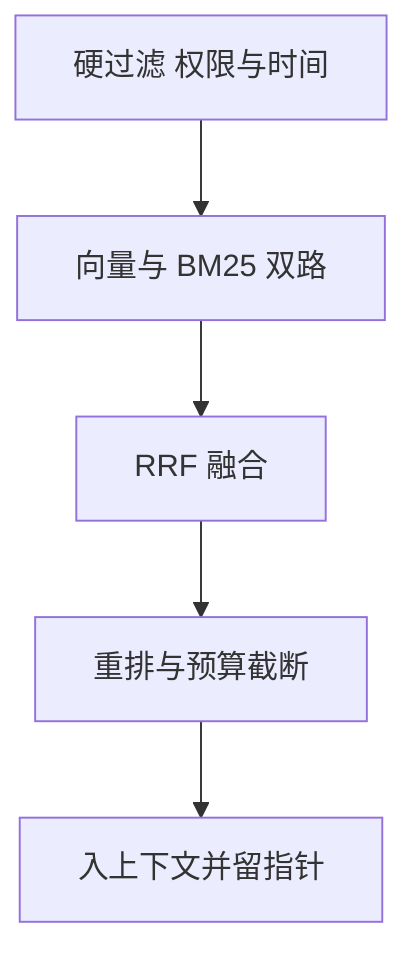

# 记忆与上下文

一句话:Agent 的上下文窗口是**每一轮重新装配出来的一张读取视图**,不是存储——所以「记忆」真正要设计的是三件事:事实落在哪一层、怎么把该用的那几条捞回来、以及在有限的 token 预算里按什么顺序摆进去。

## 一、上下文是视图,不是存储

### 为什么不能把历史全塞进去

几千轮对话或者跨天任务,历史很快长到几十万 token。三条约束同时卡着,单独解决一条没用:

| 约束 | 具体表现 | 把窗口放大能解决吗 |
|---|---|---|
| 窗口长度 | 超上限直接截断,而且截掉哪一段不受控 | 能,但只买到「放得下」 |
| 注意力稀释 | 关键那一条淹在几千条同质内容里,读不出来 | 不能 |
| 成本与延迟 | prefill 算力与 TTFT 随长度涨,每轮重付一次 | 不能,反而更糟 |

第二条最容易漏。**「放得下」和「找得到」是两件事**:同一个模型在同一长度下,把关键信息从开头挪到中间,准确率会走出一条 U 形曲线——开头结尾最好,中间最差,专门标榜长上下文的模型也一样(见 长上下文训练 篇的中间迷失一节)。所以历史越长,硬堆进去的边际收益越低,噪声的边际伤害越高。顺手澄清两个常见误答:这不是「Softmax 必然把注意力摊平」的必然结果;也不是 KV cache 能解决的——KV cache 省的是重复计算,不改变模型能从长序列里读出什么(见 KVCache 篇)。

### 显式记忆库和隐式压缩怎么选

**隐式压缩**是把历史反复改写成摘要再塞回上下文,便宜、无额外检索延迟,但有损、不可回查、不能跨会话复用,而且**误差会叠加**——每次摘要都建立在上一次摘要之上,压三轮以后原始细节已经无处追回。**显式记忆库**把事实写进外部存储、用时检索,能回查、能审计、能跨会话跨坐席复用,代价是一次召回延迟加一整套治理成本。

电商客服的答法就落在一条判据上:**这条信息下一次会话还要不要用**。同一次会话内话题集中、时长短,滚动摘要够用;而用户的忌口、常用收货地址、历史投诉与退款记录必须进显式记忆库,因为下一通电话、另一个坐席、风控侧都要复用它。

### 换个模型结构能不能免掉这件事

- **稀疏 / 滑窗注意力**:仍是有限窗口,而且改了信息路径,擅长「一篇长文档一次读完」,不解决跨天跨会话(见 稀疏注意力 篇、SWA 篇)。
- **RWKV、Mamba 这类循环与状态空间结构**:推理是常数显存、线性时间,适合流式输入、超长序列、对精确回查要求不高的场景;但它的状态是**有损压缩而且不可寻址**——你没法要求它把三天前那句原话逐字还给你(见 线性注意力 篇)。

所以两者正交:**结构决定一次能读多长,记忆系统决定什么能被精确回查**,谁也替不了谁。

## 二、分层:哪一层放什么,谁是事实源

| 层 | 保存什么 | 写入时机 | 读取方式 | 丢了会怎样 |
|---|---|---|---|---|
| 原始事件日志 | 每条消息、每次工具调用与返回的原文 | 实时追加写 | 按指针精确回查 | 不可恢复,这是事实源 |
| 长期记忆 | 跨会话事实、偏好、历史事件 + 原文指针 | 会话结束或事实变更时抽取 | 混合检索后重排 | 可从日志重建 |
| 短期记忆 | 本会话摘要、关键事件、任务检查点 | 阶段完成或话题切换时 | 按任务与时间选取 | 可从日志重建 |
| 工作记忆 | 当前目标、未决约束、未完成步骤、最近工具结果 | 每一步更新 | 每轮直接注入 | 当前任务立刻失败 |

### 写入路径:先落原文,再抽事件,最后才是摘要

顺序不能反。原文先追加落盘,再从中抽结构化事件与状态,摘要排最后。**摘要是索引,不是事实源**——因为摘要有损且不可逆,一旦让它当事实源,任何一次抽取失误都追不回来。增量摘要只在任务完成、话题切换、预算不足这三个时机做,而且是在上一段摘要之上**追加新段**,不是把全历史重摘一遍——重摘既让误差反复累积,成本也是重复付的。

由此就有了「三天前的细节被摘要漏了怎么办」的答案:每条摘要句都带原文指针(会话 ID 加轮次区间),用户追问时用这个指针加时间窗对原始日志做一次二次检索,直接把原文取回来贴进上下文。**留着原文的唯一理由就是这一刻**;只存摘要的系统在这里必然翻车。

### 话题切换时短期记忆怎么隔离

检测到话题切换后,给当前短期记忆封一个检查点、打上话题标签归档进长期记忆,新话题起一个干净的工作集。三条纪律:

1. **归档不是删除**。用户过几轮说「回到刚才那个」,靠话题标签把归档段整段拉回来。
2. **别用「清空上下文」做隔离**。未决的用户约束(预算、地址、已确认的选项)会跟着一起丢。
3. 切换判定宁可保守——误判为切换的代价(丢上下文)比误判为不切换(多带一点噪声)大得多。

## 三、上下文预算:这一轮装什么、砍什么

### 预算分成几档

| 档位 | 内容 | 能不能砍 |
|---|---|---|
| 系统约束与角色 | 身份、边界、安全规则 | 绝不能 |
| 当前目标与未决约束 | 用户已提的硬条件、未完成步骤 | 绝不能 |
| 最近若干轮原文 | 保证指代与语气连贯 | 可缩条数 |
| 滚动摘要 | 本会话已完成部分的压缩件 | 可再压 |
| 检索到的长期记忆 | Top-K 条记忆 + 指针 | 可调 K |
| 工具结果 | 本轮及近几步的观察 | 抽字段后可折叠 |

**各档的占比没有通用数字**,必须按任务类型和延迟预算用自己的标注集校准;任何写死「摘要占 20%、检索占 30%」的方案,换个业务就是错的。超限时的砍位顺序是:已被摘要覆盖的完成片段折叠成摘要加指针 → 体积大的工具原始返回只留抽取字段加指针 → 同质内容去重 → 时间久远且与当前目标无关的检索记忆。判据一句话:**砍掉之后还能靠指针取回来的先砍,取不回来的最后砍**;系统约束、未决的用户约束、当前目标与未完成步骤一条都不能动。

### 位置也是预算的一部分

- 中间迷失是真的:把当前目标和最强的那条证据放在**头部或尾部**,检索结果按分数降序摆,别把最相关的那条塞在中间。
- **前缀必须逐字节稳定**。系统提示、工具定义、早期历史保持不变才能命中前缀缓存,多轮会话的 TTFT 才降得下来(机制见 KVCache 篇、RadixAttention 篇、PagedAttention 篇)。这条和第五节「要注入当前时间」直接冲突,解法是把时间戳放在**末尾那条用户消息里**,而不是系统提示开头——放开头等于每一轮把整条前缀缓存打掉。

### 海量同质证据:先确定性降噪,再交给模型

一次故障产生几千条告警,能不能全量给主管 Agent?不能,而且拦住你的不只是窗口:关键那条会淹没在同质告警里,故障场景还偏偏对延迟最敏感。关键观察是:**告警的信息量远小于它的条数**——一个根因会触发同一服务的多个实例、同一调用链的上下游、同一指标的连续采样点。所以要做的是去冗余,不是抽样。四步都由确定性代码完成,模型只看压缩后的结果:

1. **按结构化维度分组**:服务与实例、指标类型、时间窗、调用链拓扑位置。**不做文本向量聚类**——文本相似不代表同源,两个不同根因的告警模板可能长得几乎一样,结构化字段才可靠。
2. **组内归约**:每组保留首发时间、条数、受影响实例数、极值样本和一条代表原文,其余折叠成计数。
3. **按拓扑收敛**:上下游同时告警时优先保留上游,下游标为疑似传导。
4. **排序**:按首发时间与异常幅度排,最可能是根因的放在上下文靠前位置。

三个容易被追问的兜底:

- **孤立告警反而要优先保留**。分组后大小为 1 的组全部原文透传,不折叠——没有同伴恰恰说明它稀有,稀有告警的信息量最高。
- **压缩比不是调参目标**。按回放集上的两个指标调:根因告警是否还在输出里(召回)、排在第几位(排名)。先钉住这两个,再在满足的前提下把条数压进预算。
- **排序错位要有向下钻取的出口**。给主管 Agent 一个「展开某组原文」的工具,并在靠前几条都解释不了现象时强制触发;压缩层本身必须可审计,它漏掉的东西后面再强的推理也救不回来。

### 工具中间结果不能直接当事实

多步执行里最脏的污染源是工具输出。三道闸:每条观察带步骤号、版本和校验状态;写回结构化状态前过一次校验(schema、值域、与已有事实是否冲突);最终答案只允许引用**已校验的事实加原文指针**。未校验的结果可以留在上下文里当观察,但不能进事实层——否则一次接口超时返回的空值,会被后面几十步当成真相反复引用。

## 四、向量记忆:表示、索引、召回与治理

### 向量库解决什么,不解决什么

它解决的是:用户这次的说法和当初记录的说法字面完全不一样时,关键词检索会漏,而语义近邻能捞回来。它不解决当前任务状态(要强一致,放关系库或 KV)、权限与租户(要精确过滤)、审计(要原文)。**向量库是检索索引,不是记忆系统**——一套记忆系统等于事实源加索引加治理,向量库只占中间那一格。

### 表示:模型怎么选,块怎么切

Embedding 模型不看排行榜,看**自己的 query-memory 对**:目标语言、领域词汇、记忆块的典型长度、吞吐,以及向量维度——维度直接决定索引内存和重建成本,不是越大越好。通用模型接不住领域说法时,再用人工复核过的正负例微调,难负例与温度这些机制见 对比学习 篇。

记忆的切块单位不是「512 token」,而是**一个能独立读懂的事件**:一次完整问答、一个决策连同它的理由、一条偏好连同它的来源。太小会丢语境(只存下「他说好」,不知道好的是什么),太大会丢定位精度(召回一整天的会话占满预算,里面只有一句有用)。每一块必须带元数据:用户 ID、会话 ID、事件时间、写入时间、生效区间、来源、权限标签、embedding 版本号——**没有元数据的向量块是不可治理的**,后面的过滤、仲裁、删除、重建全都做不了。文档类材料怎么切、父子块怎么做,见 切块与索引 篇。

### 索引选型:百万级怎么摆延迟、内存和召回

| 索引 | 内存 | 召回 | 更新友好度 | 适用 |
|---|---|---|---|---|
| HNSW | 高,图边开销叠在向量之上 | 高 | 删除多为软删,高频更新要定期重建 | 百万级、延迟敏感 |
| IVF-PQ | 低,乘积量化压掉一个数量级 | 下降,靠加大探查簇数换回来 | 需训练码本,分布漂移要重训 | 千万级、内存吃紧 |
| 磁盘索引 | 内存只放图的一部分 | 接近内存索引 | 重建成本高 | 十亿级、延迟可放宽 |

但换索引往往不是第一手段。**先按用户或租户分片**才是:记忆天然按人切开,全库百万级不代表单次查询要扫百万,硬过滤之后单个用户的记忆量通常只有几千条。之后再考虑降维和冷热分层(近 N 天在内存索引、更早的落磁盘索引)。

### 召回四步

**硬过滤必须在前,不能在后**。权限与租户过滤放在向量检索之后,会出现 Top-K 全被过滤光、召回为空;而且越权数据进过一次候选集,审计上就已经算泄漏。混合召回两路各有分工:向量抓语义,BM25 抓专名、编号、型号——用户说「上次那个 SKU 8812」时向量检索基本无效。两路名次用 RRF 融合:

$$
\text{RRF}(d) = \sum_{r \in R} \frac{1}{k + r(d)}
$$

每条候选在每一路里的名次取倒数再相加,$k$ 是平滑常数(原论文取 60),名次越靠前贡献越大。它只用名次不用原始分数,所以余弦相似度和 BM25 分数不在一个量纲上也能直接融合——这正是混合召回最常用它的原因。记忆场景还要多一层:**排序不能只看相关性**。

$$
\text{score} = w_1 \cdot \text{relevance} + w_2 \cdot \text{recency} + w_3 \cdot \text{importance}
$$

三项各自归一化到 0–1 再加权。Generative Agents 给了一个可以照抄的基线:relevance 用 query 与记忆的余弦,recency 用 $0.995$ 的「距上次访问小时数」次幂做指数衰减,importance 让模型给这条记忆打 1–10 分,三个权重都取 1。**这套权重不是通用最优**,Top-K、融合权重、相似度阈值都得用自己的标注集校准;「余弦大于 0.7 才算命中」这种数字换个 embedding 模型就失效,因为余弦分布本身随模型而变。用户表达差异大时,混合召回是第一道防线;还不够再上查询改写(把「上次那个便宜的」补成带实体和时间的查询),改写与重排模型的选型见 检索优化 篇。

### 冲突仲裁与多跳

检索到互相矛盾的记忆,不能靠「取相似度最高的那条」。按三级优先:**先看生效时间**,新事实覆盖旧事实;**再看来源可信度**,用户明说 > 系统推断 > 模型抽取;还打平就把两条一起给模型,要求它把冲突显式说出来,或者直接向用户澄清。**旧版本不删,标记为已被取代并写上失效时间**——因为「用户改过口」本身是有用信息,审计和回滚也都要它;只覆盖文本、不留版本,是记忆系统最常见的静默错误。

跨时间段的复杂关联(「我上个月投诉的那个订单后来怎么处理的」)一次检索答不了,要走多跳:先召回实体锚点(订单号),用锚点做一次结构化二次查询,再拉这个实体在时间窗内的全部事件按时序拼起来。把实体抽成图节点、在图上走多跳是另一条路线,本篇不展开。

### 治理:漂移、重建、删除、隔离

**语义漂移有两种**,要分开处理:换模型或换版本导致向量空间整体变了,以及用户表达随时间自然变化。检测靠两条——固定一个金标 query-memory 集每天跑 Recall@K,掉了就报警;同时监控线上召回结果的相似度分布,分布整体平移是更早的信号。

重建走双写加影子索引:新模型的向量写进新索引,老索引继续服务;灌完后按流量灰度,金标集和线上指标都不退化才切,老索引保留一段时间随时回滚。**embedding 版本号必须写在每条记忆上**,否则新旧向量混进同一个索引,距离根本没有可比性。删除则要认清 ANN 索引大多只支持软删,真删必须重建分片:合规删除的完整动作是删原文、删元数据、标记向量失效、排期重建,并且要能出具删除凭证。

隔离按用户或租户分片,权限过滤在查询侧强制注入,不能靠调用方老实传参。多 Agent 场景下的记忆可见性按三档定:任务级中间状态可共享,用户级偏好与敏感事实按角色授权共享,凭证与密钥一律不共享。多个 Agent 之间怎么合并与同步这些状态,见 多智能体 篇。

## 五、时间:几类时间戳必须分开记

### 模型不知道「现在」

位置编码只表示 token 在序列里的先后,不携带日历时间、时区和节假日(见 RoPE 篇)。时间感知要靠系统显式给,而且下面四件事必须分开:

| 概念 | 是什么 | 混在一起会怎样 |
|---|---|---|
| 当前时间 | 这一轮请求发生的时刻加用户时区 | 「今天」算错,所有相对时间跟着错 |
| 事件时间 | 事情实际发生的时刻 | 三个月前的订单被当成刚下的 |
| 写入时间 | 这条记忆被记录或更新的时刻 | 分不清是事实变了还是补录了 |
| 有效期 | 这条事实从什么时候到什么时候成立 | 过期价格、过期制度被当成现行的 |

### 相对时间在入口归一化,新鲜度按类型配置

「上周五」「三天后」在解析阶段就绑定到**本轮请求时刻**加用户时区,变成带区间的结构化时间,同时保留原文和不确定性(「下周」是区间不是点)。特别注意「今天」要绑定这一轮的请求时刻,不是会话创建时刻——跨零点的长会话会整整错一天。

稳定偏好(忌口、母语、常用地址)不该因为记得久就降权,实时状态(当前订单、库存、余额)才需要强调新鲜度,所以时间参与排序的方式要**按记忆类型分别配置**,给全库一个统一衰减系数是典型错解。检索时把时间条件写进**元数据过滤**这条硬约束,而不是只写进 query 文本这条软约束。「上周说的那个方案」的完整链路是:归一化时间区间 → 用实体加语义召回候选 → 用事件时间与会话关系过滤 → 命中多条时取最新版本并说明有哪些旧版。还要专门查未来信息泄漏:事件时间晚于当前时间的证据不允许被召回。

### 日期算术交给确定性工具

时区换算、闰年、工作日、交易截止时间这类问题调日历或时间工具,模型只负责解析意图和解释结果。因为模型做多步日期算术的错误率不低,而且**错了不会报错**,下游没有任何机会发现。工具协议本身见 工具调用 篇。

## 六、并发下的会话状态:唯一事实源与写入协议

### 存储怎么摆,写入怎么保序

原始消息与工具事件追加写进持久库;活跃会话的近期状态放缓存;任务检查点与结构化实体放事务库;跨会话记忆放向量库加元数据库。**模型上下文不是这四者之一,它是按本轮预算从这几个库里现生成的读取视图**,可以随时丢弃重建。

每次写携带三样东西:顺序键(轮次号)、幂等键、版本号。版本号配 CAS 或事务拒绝乱序覆盖;幂等键让重试不产生重复——多轮场景里网络重试和客户端重发是常态,一次下单工具被执行两遍就是两个订单。关键检查点必须**先落盘再向用户确认**,异步持久化只能用于允许短暂不一致的数据。

### 粘性路由不能代替一致性,读己之写要单独保

按会话 ID 路由到固定节点只是提高缓存命中率,不提供任何正确性保证。节点宕机后的恢复思路是让状态压根不在节点上:新节点按会话 ID 从追加日志重放到最后一个检查点,再按轮次号补齐尾部,正在执行的工具调用靠幂等键决定重放还是跳过。一句话:**节点无状态,顺序靠轮次号,重复靠幂等键**。

Redis 主从有复制延迟,用户刚发的消息可能在从库读不到。三种办法:关键读走主库、写完带版本号读(版本小于期望就重试或回源)、写后在本节点缓存一份会话尾巴。判据是分清哪些读必须满足读己之写——同一会话的最近消息和刚写的检查点必须,历史记忆检索可以容忍秒级延迟。

### 生命周期与压测

生命周期至少定义创建、活跃、挂起、恢复、归档、删除六态,每一态说清 TTL、能不能被检索、数据落在哪一层,以及隐私策略。

「你压测过多少并发」这道题考的是**你有没有真做过**,分不在数字大小,在负载模型说不说得清:并发会话数和 QPS 是两回事、对话长度分布、读写比、记忆检索命中率、是否带工具调用。要报的是吞吐、P95/P99(端到端和记忆检索这一段分开报)、冲突重试率、陈旧读比例、数据丢失。瓶颈出现的典型顺序是:向量检索尾延迟 → 热点会话打爆单个缓存分片 → 检查点写放大 → 模型侧排队。

## 七、怎么验收

### 三层指标,少一层就说不清

| 层 | 指标 | 用来发现什么 |
|---|---|---|
| 检索层 | Recall@K、MRR、nDCG,跑金标 query-memory 集 | 该捞的记忆有没有捞回来 |
| 记忆层 | 事实恢复率、冲突率、过期答案率、时间归一化与事件先后推理准确率 | 捞回来的对不对、新不新 |
| 端到端 | 任务成功率、纠错率、P95/P99、每轮成本 | 记忆到底有没有帮上忙 |

必须三层齐全的理由:检索 Recall 高但答案错,说明证据组织或预算分配有问题;Recall 低而答案对,说明模型在猜,换个 case 就崩。只看一层这两种情况区分不出来。

### 消融加回放,才说得清收益归谁

关掉长期记忆跑一遍看任务成功率掉多少,只关时间过滤跑一遍看过期答案率涨多少。**因为记忆系统的收益很容易被模型自身能力掩盖**,不做消融就说不清是谁的功劳,上线后也无从判断该继续投入哪一块。

现成基准可以用 LongMemEval 那类多会话集,它覆盖信息抽取、跨会话推理、时间推理、知识更新和拒答五类能力,给的警醒数字是:含商用助手在内的系统在持续交互上有约 30% 的准确率下降(论文自报口径)。但自建回放集不可替代——告警降噪的根因召回、真实用户的跨会话追问,只能用自己的历史数据回放。两条纪律:回放集**只做回归门禁,不做调参目标**,否则会过拟合到已知形态;同时持续用新发生的真实 case 扩充,并补一批在已知拓扑上人工注入的合成故障,覆盖还没见过的形态。

## 面试考点串联

| 高频问法 | 本文哪一节 |
| --- | --- |
| 数千轮或跨天任务为什么不能把历史全塞进上下文?工作/短期/长期记忆怎么分层? | 一、二 |
| 电商客服 Agent 怎么权衡显式记忆库和隐式上下文压缩? | 一 |
| 稀疏 Attention 与 RWKV、Mamba 这类结构各适合什么场景? | 一 |
| 用户追问三天前被摘要遗漏的细节,怎么从原始记录补救? | 二 |
| 用户突然切换话题,短期记忆怎么隔离和归档?长对话怎么组合短期与长期记忆? | 二、三 |
| 对话超过上下文上限时,怎么决定保留和丢弃什么? | 三 |
| 一次故障几千条告警能全量给主管 Agent 吗?怎么聚类降噪、怎么保证没丢关键信息? | 三 |
| 压缩比按什么指标调?孤立告警和被排错位的根因怎么兜? | 三 |
| Agent 多步执行中怎么防止中间状态污染最终答案? | 三 |
| Agent 为什么常用向量库检索长期记忆?切块、索引、过滤、时间和重排怎么设计,边界在哪? | 四 |
| 记忆到百万级时怎么平衡延迟、内存和召回率? | 四 |
| 用户表达差异很大时,怎么用混合检索和查询改写提高召回? | 四 |
| 检索到互相矛盾的记忆怎么仲裁?新旧冲突怎么保留版本? | 四 |
| 跨时间段的复杂关联怎么做多跳检索? | 四 |
| Embedding 语义漂移怎么检测、双写重建和回滚? | 四 |
| 多 Agent 场景下哪些记忆共享、哪些必须隔离? | 四 |
| 对话系统怎么建模时间?当前时间、事件时间、知识更新时间为什么要分开? | 五 |
| 「上周说的那个方案」怎么跨会话解析和检索?带「上周」约束的偏好怎么过滤排序? | 五 |
| 多轮会话状态怎么存?分布式高并发下的一致性怎么设计? | 六 |
| 粘性路由节点宕机时怎么恢复会话并保证顺序?Redis 副本有延迟怎么保障读己之写? | 六 |
| 你实际压测过多少并发?负载模型、P95/P99 和瓶颈是什么? | 六 |
| 怎么评估上下文管理策略对任务完成率的影响?离线与在线检索评测怎么设计? | 七 |
| 怎么评估时间归一化、顺序推理和过期答案?回放集怎么避免过拟合? | 五、七 |
| 补充题:摘要为什么只能当索引,不能当事实源? | 二 |
| 补充题:多轮会话里为什么当前时间戳不能放在系统提示开头? | 三、五 |
| 补充题:记忆召回为什么不能只按相似度排序? | 四 |
| 补充题:检索 Recall 很高但答案还是错,你先查哪里? | 七 |

## 相关文献

- Lost in the Middle: How Language Models Use Long Contexts — [arXiv:2307.03172](https://arxiv.org/abs/2307.03172)
- MemGPT: Towards LLMs as Operating Systems — [arXiv:2310.08560](https://arxiv.org/abs/2310.08560)
- Generative Agents: Interactive Simulacra of Human Behavior — [arXiv:2304.03442](https://arxiv.org/abs/2304.03442)
- Mem0: Building Production-Ready AI Agents with Scalable Long-Term Memory — [arXiv:2504.19413](https://arxiv.org/abs/2504.19413)
- HippoRAG: Neurobiologically Inspired Long-Term Memory for Large Language Models — [arXiv:2405.14831](https://arxiv.org/abs/2405.14831)
- LongMemEval: Benchmarking Chat Assistants on Long-Term Interactive Memory — [arXiv:2410.10813](https://arxiv.org/abs/2410.10813)
- Evaluating Very Long-Term Conversational Memory of LLM Agents(LOCOMO)— [arXiv:2402.17753](https://arxiv.org/abs/2402.17753)
- Efficient and robust approximate nearest neighbor search using Hierarchical Navigable Small World graphs(HNSW)— [arXiv:1603.09320](https://arxiv.org/abs/1603.09320)
- Reciprocal Rank Fusion outperforms Condorcet and individual Rank Learning Methods(RRF,SIGIR 2009)— http://cormack.uwaterloo.ca/cormacksigir09-rrf.pdf
- SUTime: A library for recognizing and normalizing time expressions — https://aclanthology.org/L12-1122/
- TIMEDIAL: Temporal Commonsense Reasoning in Dialog — https://aclanthology.org/2021.acl-long.549/
