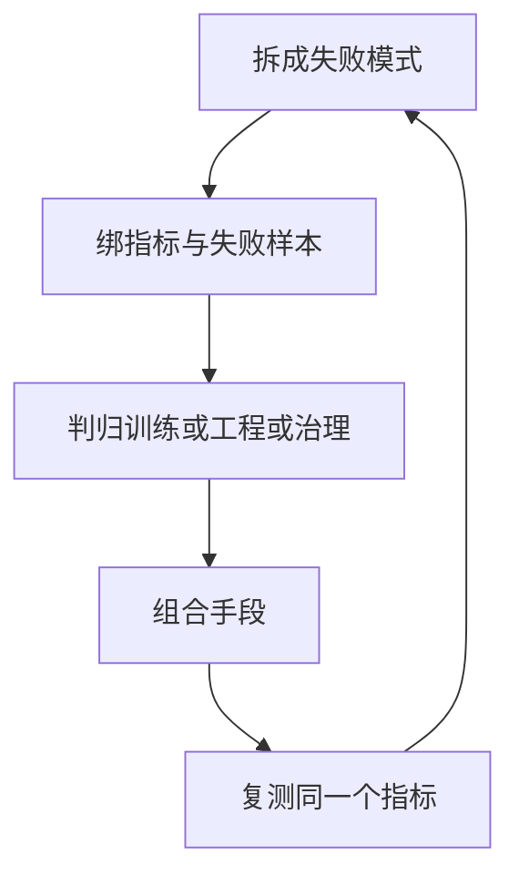

# 大模型局限

一句话:大模型的局限**不是一张能用「方法排行榜」打赢的清单**,而是一组各自可测的失败模式——本篇只做一件事:把六类局限拆成「失败模式 → 指标 → 归哪一层管」,讲清训练改进、工程缓解、治理措施三层各能做什么、做不了什么,再把那几组常被横向比较、其实不在同一层级的东西(RAG 与长窗口、MoE 与投机解码与 Mamba 与 FlashAttention)之间的真实关系摆正。

阅读约定:本篇是**串讲篇**。每一项机制都有自己的专篇,下文每提到一项只给一句定位加一个篇名,机制细节一律去那一篇看;写成技术综述会把十几篇专篇各抄一段,那不是本篇的活。

## 一、为什么「局限」不能靠一张方法排行榜解决

「大模型有哪些局限、怎么解决」这道题最常见的错答,是背一张表:幻觉上 RAG、知识过时上微调、长上下文上长窗口、成本上量化、安全上 RLHF。它错在两个前提上:

- **它假设所有局限是同一种病。** 其实幻觉是「说了没依据的话」,知识过时是「依据本身旧了」,长上下文是「依据在但读不到」——三个失败模式的检测方法、可用手段、验收指标完全不同,一张表把它们并列,等于给三种病开同一张处方。
- **它假设所有手段在同一层级上可比。** RAG 是把证据放到模型外面的工程手段,RLHF 是改模型行为的训练手段,审计日志是出事之后追责的治理手段——它们不是「谁更好」的关系,而是**各管一段、缺一段就有一类事故没人管**。

正确的形状是一个三步循环:

**第一步,拆成失败模式,而且每个失败模式必须绑一个可观测指标和一批失败样本。** 因为没有指标,「缓解了」这句话就没法验收;没有失败样本,就没法做回归——上了一个手段、修好了这一类、悄悄弄坏另一类,是这类系统最常见的事故形态。指标要按层分开报(检索层、生成层、端到端各一套),理由与口径见 RAG评测 篇。

**第二步,判它主责归哪一层。** 三层各自能做什么、做不了什么,是本篇最该记牢的一张表:

| 层 | 代表手段 | 它改的是什么 | 它做不了什么 |
|---|---|---|---|
| **训练改进** | 数据治理、SFT、RLHF/DPO、长上下文训练、架构选择(MoE、GQA、线性混合) | 模型**知道什么、怎么说、能读多长、每 token 多贵**——这些写进权重之后部署期改不了 | 提供训练截止之后的事实;按「谁在问」区分答案;把责任落到某个人 |
| **工程缓解** | RAG、工具核验、上下文预算、拒答与 Fallback、推理加速、检测点 | 模型面前**摆什么证据、查什么、兜什么、跑多快** | 补上模型本来没有的推理能力;在没有权威语料的领域凭空造出证据 |
| **治理措施** | 数据权限、审计日志、人工复核、制度责任 | **谁能看什么、出了事怎么复盘、谁负责** | 让任何一条答案变得更对——它管的是「错了之后」,不是「怎么不错」 |

这张表最重要的读法:**「主责层」不等于「唯一层」**。幻觉主责在工程(RAG 给证据、核验兜确定性、拒答挡剩下的),但训练层的对齐负责「证据不足时愿意说不知道」,治理层负责「高风险声明必须过人工」——三层缺一段都会漏一类事故。所以第三步是**组合**,组合完回到第一步**复测同一个指标**,因为每上一个手段,失败样本的分布都会挪位置(这条纪律在推理侧的完整版见 推理加速 篇第一节)。

先动哪一层有一条朴素判据:**先动不改模型输出的、能回滚的、验收成本最低的。** 工程手段(加检索、加核验、加拒答)大多满足这三条;训练手段每改一次都要重跑全套评测;治理手段改的是流程,收益最慢但最不可替代。

## 二、六类局限:失败模式、指标、归哪一层

这张表是本篇的核心交付。第三列比第四列重要——**没有指标的「解决方案」不能验收**。

| 局限 | 典型失败模式 | 可观测指标 | 主责层(其余层补什么) | 机制去哪篇 |
|---|---|---|---|---|
| **幻觉与不忠实** | 事实性幻觉(违背世界事实)与忠实性幻觉(违背给定材料)会分道扬镳:证据错了模型忠实复述,忠实度满分事实错 | 事实正确率、忠实度**分开报**;引用支持率拆成引用召回与引用精度;拒答准确率 | 工程(证据、核验、拒答);训练补「愿意说不确定」;治理补声明级人工复核 | 幻觉与事实性 篇 |
| **知识过时** | 训练截止后的事实答成旧版;同一知识多版本时取错时点 | 过期答案率;时效敏感问题的正确率;一次更新到可查的时延;废止条款仍被引用的探针命中数 | 工程(外部库、版本化索引);训练只适合稳定知识;治理定「谁有权改库」 | 切块与索引 篇、本篇第八节 |
| **长上下文** | 「放得下」和「找得到」是两件事:信息埋在中间读不出来;多针、多跳任务随长度塌 | 关键信息位置铺满窗口的准确率曲线;多针/多跳基准的有效长度;短能力回退;目标长度上的 TTFT 与 KV 显存 | 训练(扩窗、合成长依赖);工程补检索缩材料与上下文预算 | 长上下文训练 篇、记忆与上下文 篇 |
| **成本与延迟** | TTFT 高在空载与高并发下是两个病;TPOT 随并发与上下文变差;省显存被调度器自动吃成 batch | TTFT、TPOT、ITL 尾部、吞吐(含不含 prompt 要说清)、goodput、显存、单位请求成本 | 工程(推理加速);架构侧(KV 头数、MoE、注意力结构)是训练期定死的 | 推理服务指标 篇、推理加速 篇 |
| **安全、偏见与隐私** | 越权取数;PII 从输入、检索片段、工具参数、输出四处泄露;某个群体切片上系统性错;误拒把系统拒到没用 | 越权率、泄露率(四个检测点分别报)、有害输出率、按群体切片的误差、误拒率 | 治理(权限、审计、脱敏);训练补行为边界;工程补检测点与策略执行点 | Agent选型与治理 篇、RLHF与RM 篇 |
| **多模态可靠性** | 视觉幻觉在「转述成文字」那一步被漂白成事实;数字、坐标、时序错了下游查不出 | 对象幻觉的二分探针(随机/高频/共现三档分开报);OCR 与定位的逐字段准确率;跨模态一致性 | 训练(偏好信号必须带视觉证据);工程补结构化证据与定向复查 | 多模态推理系统 篇、多模态训练 篇 |

读这张表的三条纪律:

1. **指标必须分开报,不能合成一个分。** 忠实度和事实正确率会分道扬镳,TTFT 和 TPOT 会互相打架,总均值会把小群体的崩塌平均掉——每一类局限里都有一对「合起来就看不见」的指标。
2. **失败样本要按类型分桶。** 「库里压根没有」「有但没召回」「召回了排错了」「读到了没用对」是四种不同的修法(诊断表见 检索优化 篇第一节),混在一起就会去修一个没坏的东西。
3. **主责层判错,后面全白做。** 拿 DPO 去治知识过时、拿 RAG 去治越权、拿审计日志去治幻觉,都是把手段放错了层——各层能做什么、做不了什么,回第一节那张表。

## 三、RAG 与长窗口:各解决什么、各付什么代价、为什么都不保证「正确使用证据」

先把两者摆正:**RAG 解决的是「证据在哪」,长窗口解决的是「证据放不放得下」**——一个是取材料,一个是读材料,本来就不是二选一。

| | RAG | 原生长窗口 |
|---|---|---|
| 解决什么 | 把会变的、要溯源的、量大的知识放在模型外面,按问题取回 | 一次把更多材料放进模型面前,省掉切块与检索 |
| 代价 | **索引维护**(新文档要走解析、切块、编码、建索引、版本切换才可查,这条链路本身有时延);**漏召**(没进候选的证据再强的模型也变不出来);**噪声**(一条不相关但语气笃定的证据足以把答案带偏) | **prefill 计算随长度涨**(注意力那部分占比只由「序列长比隐藏维」决定,8K 时约 14%、128K 时约 73%,见 长上下文训练 篇第五节);**KV 显存**(Llama-3-8B 一个 128K 请求的 KV cache 约 16 GiB,和整份 fp16 权重一样大,见 KVCache 篇);**远处信息利用不稳**(下面单说) |
| 失效形态 | 检索指标涨了、任务成功率不动——瓶颈本来不在检索 | 不报错:输入 128K 不炸,中间那段就是看不见 |
| 适合 | 频繁更新、需溯源、可检索的知识;语料远大于窗口 | 文档量小、一次读完、跨段归纳 |

**远处信息利用不稳**是长窗口最该记的一条:Lost in the Middle 在多文档问答和键值检索上系统地挪动关键信息的位置,得到一条 U 形曲线——放在开头或结尾时最好,放在中间时显著下降,**连专门标榜长上下文的模型也一样**。所以「窗口够大就不用检索了」这句话不成立:窗口买到的是「放得下」,不是「找得到」。训练侧为什么会训出这种偏科、怎么用合成长依赖补,见 长上下文训练 篇第四、六节。

### 为什么两者都不保证「正确使用证据」

因为它们都只管**证据到模型面前之前**的事。RAG 决定的是证据的上限(Retriever 捞到什么),长窗口决定的是能摆多少;而**证据到了面前之后模型忠不忠实**是另一口井——证据被埋在中间被忽略、两版冲突挑了错的一条、参数知识悄悄覆盖了证据还照样附引用,这些在两条路上都会发生。所以忠实度必须作为独立指标单独报,不能用「检索命中了」或「材料都塞进去了」代替;生成侧怎么诊断「模型忽略了证据」,见 RAG系统设计 篇第三节。

### 常见组合,以及检索噪声放在哪一步

生产上的标准形态是**先检索缩小材料,再在足够的窗口内推理**:检索当粗筛,把几百万块砍到几十块;窗口当阅读,让模型在这几十块里做跨段推理。长文档除了直接切片还有父子块、层级摘要、迭代检索、多轮分解、图索引几条路,选型菜单见 RAG系统设计 篇第二节。

追问「检索噪声怎么处理」,机制全在 检索优化 篇,本篇只说它在整机里落在哪三步:**召回之后重排**(把对的排到前面,但重排救不回漏召)→ **上下文组装**(去重、冲突按元数据显式并列、压缩不能删限定条件、最强证据放两端)→ **生成侧强制引用并核验**(引用格式对不等于引用正确)。三步各挡一类噪声,少一步就漏一类。

**边界怎么定不是拍脑袋**,按语料规模、更新频率、延迟预算、证据需求四个量测出来:语料远大于窗口、每天在变、答案必须指回出处——RAG 没得选;文档量小到一次读完、只求归纳不求溯源——直接塞窗口更省事;多数系统在中间,那就先检索再读。

## 四、推理成本:prefill 和 decode 是两种病

「推理慢」不是一个可执行的诊断,因为一条请求的两段时间卡在完全不同的地方:

| | prefill(算整段 prompt) | decode(每步吐 1 个 token) |
|---|---|---|
| 矩阵形状 | 一批几千行,胖大 GEMM | 一批几十行(等于并发数),瘦长 |
| 瓶颈 | **计算受限**:算术强度约等于行数,几千远在拐点之上 | **访存受限**:每步要把整份权重读一遍却只算几十行;KV cache 每个请求各读一份,随并发线性涨、摊不薄 |
| 一个数 | Llama-3-8B fp16,一批 4096 token,每 token 摊到的权重字节约 3.4 MB | 同一份权重,并发 32,每 token 摊到约 438 MB——差 128 倍 |
| 主要指标 | **TTFT**(空载时约等于 prefill 时间;高并发时约等于排队时间) | **TPOT**(平均每 token)与 **ITL 尾部**(卡不卡顿) |
| 加速手段(各一句) | FlashAttention 不让中间矩阵落显存(见 FlashAttention 篇);chunked prefill 切块混批稳住在跑请求(见 连续批处理 篇);前缀缓存跳过公共前缀的 prefill(见 RadixAttention 篇);加 TP 摊算力(见 并行策略 篇) | 权重量化少搬字节(见 量化 篇);压 KV 字节——位宽走 KV 量化(见 KVCache量化 篇)、头数走 GQA/MQA(见 KV共享注意力 篇)、每头表示走 MLA(见 MLA 篇);连续批处理摊薄权重读取(见 连续批处理 篇);CUDA Graph 消下发开销(见 CudaGraph 篇);投机解码砍串行步数(见 投机解码 篇) |

形状为什么差这么多、算术强度怎么塌缩,定量推导见 Prefill与Decode的矩阵形状 篇;怎么判一个算子卡在算力还是带宽,见 Roofline与Bound分析 篇。

**指标各量什么**(定义与口径全在 推理服务指标 篇,这里只给一句话):TTFT 量「多久开始有反应」,TPOT 量「整体读起来多快」,ITL 的 P99 量「会不会卡」,吞吐量「机器有多忙」(必须说清含不含 prompt token,否则数字没有可比性),goodput 只数同时满足所有 SLO 的请求,**单位请求成本**把前面所有数换算成钱——最终的成本讨论要落在它上面,而不是落在峰值吞吐上。

两条最容易被追问的边界:**几乎每个手段都在 TTFT 与 TPOT 之间搬跷跷板**,两边都改善的只有权重量化、前缀缓存命中和加副本;**省下来的显存会被调度器自动变成 batch**,于是吞吐上去了、TPOT 一毫秒没降。上手顺序、手段之间怎么打架,整条线在 推理加速 篇,本篇只负责把「两种病」分清。

## 五、不在同一层级的四样东西:MoE、投机解码、Mamba、FlashAttention

题干把它们并列,面试官等的就是你把它们拆开。判据只有一个问题:**它改的是模型的哪一部分?**

| | 它是哪一层的东西 | 改的是模型的什么 | 解决什么 | 不解决什么 | 什么时候定死 |
|---|---|---|---|---|---|
| **MoE** | 架构:把 FFN 拆成 N 个专家,每个 token 只算 top-k 个 | 「总参数」与「每 token 计算量」的关系——两者从此可以分开拧 | 同等质量下每 token FLOPs 更低;容量可以做到激活参数的几十倍 | **不省显存**(没被选中的专家照样常驻);**不自动降延迟**(小 batch decode 每个专家只分到个位数 token,算力空转,还多两趟 all-to-all);注意力一动不动 | 预训练期 |
| **投机解码** | 解码流程:小模型先猜 k 个,大模型一次前向验证 | 生成一段输出要走的**串行步数** | 低并发 decode 的延迟;经典算法严格保持 target 的输出分布,原论文在 T5-XXL 上报 2–3 倍 | 不改权重、不改每一步的耗时、不改模型会什么;**高并发下算力被打满就变负收益** | 部署期,而且要按负载动态开关 |
| **Mamba** | 另一类序列模型:选择性状态空间模型 | 历史怎么存——不留 KV,只维护一个固定大小的状态就地改写 | 每步计算与长度无关、缓存不随长度涨;论文自报推理吞吐比 Transformer 高 5 倍、序列长度线性扩展 | 状态装不下全部细节,**精确回溯任意历史位置是天生弱项**;所以现代模型都是「大部分线性层 + 少数 softmax 层」的混合 | 预训练期 |
| **FlashAttention** | 精确注意力的**实现优化**:分块 + online softmax,四个算子融成一个 kernel | 中间那张 L×L 矩阵的读写方式——不落显存 | 注意力的 HBM 往返与激活显存;结果与标准实现只差浮点舍入 | **不降 FLOPs、不减 KV cache、不改模型任何数值语义**——它既不是稀疏也不是线性 | 任何时候都能用,纯赚 |

机制各去各家:MoE基础 篇、投机解码 篇、线性注意力 篇、FlashAttention 篇。

**为什么不能互相替代**:四样东西各改一个维度——参数与计算的关系、串行步数、历史的存法、中间矩阵的读写。拿 MoE 和投机解码比「谁加速更多」没有意义,一个改的是每步算多少,一个改的是要走几步;拿 Mamba 和 FlashAttention 比更错,一个换了整个序列模型,一个连结果都没变。

**能不能叠加**:大多能,因为改的维度正交——MoE 的注意力层保持稠密,FlashAttention 照用;MoE 上开投机解码也行,只是 decode 小 batch 下专家已经退化成矩阵向量乘,草稿模型的开销比更要压小;Mamba 混合模型里的 softmax 层照样跑 FlashAttention。叠不上的地方在**缓存语义**:投机解码拒绝草稿后,KV cache 只需把长度指针退回;递推状态是就地改写的,退回得靠事先存的状态快照——这是从机制推出的工程复杂度,不是某个引擎的实测数字。

追问「MoE 与投机解码分别适合解决什么问题」的一句话答法:**MoE 解决的是「算力预算固定、想要更大容量」**,是训练期的选择,收益体现在同等质量下每 token 更便宜;**投机解码解决的是「低并发、延迟敏感、算力闲着」**,是部署期的开关,收益体现在单请求的 TPOT,高并发下要关掉。

## 六、RLHF/DPO 能改善什么,不能替代什么

**它们改的是「怎么说」,不是「知道什么」。** 因为偏好信号只表达「同一题下 A 比 B 好」,这条信号能教会拒答、格式、语气、不确定时的措辞,教不会昨天发布的政策——范文和偏好对里都没有那条事实(信号本质见 RLHF与RM 篇第一节)。

能改善的,InstructGPT 给了一手数字:1.3B 的对齐模型在人类偏好上胜过 175B 的 GPT-3,真实性有改善,有害输出减少;但论文同时写明它**仍会犯简单错误**,公开 NLP 任务上有小幅回退。所以对齐能压低的是**有害输出率、误拒率、行为边界的违反率**这些「行为」指标,以及「证据不足时愿意说不确定」这条对幻觉治理最关键的行为。

不能替代的四件事,每件都有一条机制上的理由:

| 不能替代 | 为什么 |
|---|---|
| **事实库** | 参数知识没有时间戳、不可溯源、改一次要重训;而且对齐可能让幻觉更难被发现——模型学会更笃定的语气,评审更容易给自信的答案打高分(见 幻觉与事实性 篇第二节) |
| **隐私控制** | 模型对「这段话含不含 PII」的判定既不可复现也不好审计,只能当辅助;规则、校验位、实体识别放在输入、检索片段、工具参数、输出四个检测点上才是防线 |
| **访问权限** | 权限是「谁在问」的函数,而模型根本不知道谁在问;它只能提出动作,可信执行层才有权批准,权限必须在检索前、在数据源侧生效(见 Agent选型与治理 篇第四节) |
| **制度责任** | 出了事要能重放这次用了哪些证据、哪个模型版本、谁审批的——这些是日志和流程,不是权重里的东西 |

两条边界一并记住:**安全侧该做约束不做奖励**——线性加权下一个足够大的有用性分可以把安全违规抵消掉,所以合规、资金操作这类条件要门控,违反即否决(见 RLHF与RM 篇第三节);**DPO 只在数据点上约束**,离线偏好对没覆盖到的回答不受任何约束,所以它压不住训练数据里没出现过的越界形态(见 DPO 篇第四节)。

## 七、高风险领域的可靠问答系统怎么搭

金融、医疗这类场景的差别不在「更小心」,而在**每一层都要有确定性的东西兜住模型**。系统性框架是四道闸,按请求经过的顺序:

| 闸 | 做什么 | 为什么必须是确定性的 |
|---|---|---|
| **数据权限** | 圈定允许使用的权威来源;每个块带版本、生效区间、法域或科室、权限标签;权限在检索前生效,用户身份一路传到数据源 | 后过滤等于「先读出来再遮住」,只要有一条代码路径忘了遮就是泄露;越权数据进过一次候选集,审计上就已经算泄漏 |
| **数值与关键事实调确定性工具** | 金额、剂量、利率、日期、条款号这类字段,由模型解析意图,交给计算器、数据库、日历工具算,模型只解释结果 | 模型做多步算术的错误率不低,而且**错了不报错**,下游没有任何机会发现;工具的错误是可复现、可修的 |
| **按风险拒答或转人工** | 证据门槛设在**声明级**:每条关键声明都要能指回具体证据;证据不足、来源冲突、超出授权三种情况一律不自行作答;阈值按「错答比误拒贵多少」校准 | 整条回答通过不算数——三句对一句错,放行就是事故;阈值不拍脑袋,扫一遍「拒答率—错答率」曲线按代价比选点(公式见 RAG系统设计 篇第四节) |
| **来源、模型与决策日志** | 每次决策落一条不可变记录:证据快照(来源、版本、取数时间)、索引版本、模型与 prompt 版本、命中的规则与阈值、审批人、最终动作 | 判据只有一个:事后能不能只凭这条记录把同一个结论重放出来;重放不出来等于没有证据 |

四道闸对应第一节的三层:第一、四道是治理,第二、三道是工程,而训练层在这里只负责一件事——把「证据不足就说不足、关键字段必须引用」训成稳定行为(判据是「改一次要不要重训」:要重训的就不该放进微调数据)。

评测要在通用指标之外加五项:**引用支持率、过期知识命中率、越权率、拒答准确率**,以及按人群、科室、法域分层的**高风险误答率**——最后一项不能只看总均值,高风险场景通常是小样本,平均一下就看不见了。

三件事落到邻篇:Fallback 的四级阶梯、阈值校准公式、垂直领域的数据治理与「什么放 RAG、什么稳定行为要 SFT」归 RAG系统设计 篇第四、五节;身份、租户、两级令牌与隐私四个检测点归 Agent选型与治理 篇第四节;工具的 schema 契约与校验闸归 工具调用 篇。本篇只负责把四道闸和它们「为什么必须确定性」讲清。

## 八、知识更新的三条路

「知识过时」的解法不是一个,而是按**知识的形态**分三条路,每条的适用范围和验证方式都不一样:

| 路 | 适用范围 | 怎么生效 | 怎么验证 | 失效形态 |
|---|---|---|---|---|
| **外部知识库(RAG)** | 频繁变、量大、答案必须指回出处的事实 | 改文档 → 走建库链路 → 可查;不动模型 | 过期答案率;时效敏感问题的正确率;新文档从入库到可查的时延 | 建库链路有时延;旧块的派生物(向量、缓存)没跟着失效 |
| **版本化索引** | 同一知识有多个时点版本、且问题会指定时点(法规、指南、制度) | 每块存生效**区间**而不是单个时间戳;检索按查询时点过滤;失效标记沿派生物传播 | **探针查询**:准备一组「应该再也检不到」的 query,每次更新后跑一遍 | 「取最新一条」在这里是错的——问「2019 年的规定」时最新版恰恰是错答案 |
| **知识编辑** | 少量、稳定、不需溯源的事实修正,不想重训 | 直接改参数里的事实关联:ROME 定位并改写单条,MEMIT 把批量编辑扩到数千条(论文自报,GPT-J 6B 与 GPT-NeoX 20B 上) | 四个维度分开测:**可靠性**(改的那条对了没)、**泛化**(换个问法还对不对)、**局部性**(没改的有没有被带坏)、**可迁移性**(改完之后能不能做一跳推理) | Yao 等人的基准报告:可迁移性普遍偏低,MEMIT 批量编辑到高数量级时局部性下降;而且编辑过的事实没有出处可指 |

选路判据一句话:**会变、要溯源、量大 → 外部库;有多个时点版本 → 版本化索引;个位数到几千条稳定修正、不需溯源 → 知识编辑**。第四条路「把事实微调进参数」是低效的:事实一变就要重训,训完仍不可溯源,它只适合稳定的行为规范,不适合事实(判据见 RAG系统设计 篇第一节)。前两条路的建库链路、增量更新与派生物一致性,见 切块与索引 篇。

三条路的共同验证纪律:**先准备失败样本再更新**。过期答案的探针、废止条款的探针、编辑前后无关问题的对照集,更新前就要在手上;没有它们,「更新成功」只是一句没法验收的话——这正好回到第一节的主线。

## 九、面试考点串联

| 高频问法 | 本文哪一节 |
| --- | --- |
| 大模型有哪些主要局限?请从幻觉、知识更新、长上下文、推理成本、安全伦理和多模态等方面说明可测指标与解决路径,并讨论 RAG、长窗口和推理加速的边界。 | 一(三层各能做什么)+ 二(六类大表)+ 三、四、五(三组边界),下面按方面拆开 |
| 幻觉:可测指标与解决路径 | 二(第一行);机制见 幻觉与事实性 篇 |
| 知识更新:可测指标与解决路径 | 二(第二行)+ 八 |
| 长上下文:可测指标与解决路径 | 二(第三行)+ 三 |
| 推理成本:可测指标与解决路径 | 二(第四行)+ 四 |
| 安全伦理:可测指标与解决路径 | 二(第五行)+ 六、七 |
| 多模态:可测指标与解决路径 | 二(第六行) |
| RAG、长窗口和推理加速的边界 | 三(RAG 与长窗口)+ 四(prefill 与 decode)+ 五(不在同一层级的四样东西) |
| RAG 的检索噪声怎样处理,RAG 与长上下文如何组合? | 三(噪声落在哪三步;先检索缩材料再在窗口内推理) |
| Prefill 与 Decode 的成本瓶颈和加速方法有何差异? | 四 |
| MoE 与投机解码分别适合解决什么问题? | 五(对照表 + 末段一句话答法) |
| RLHF 与 DPO 能改善哪些安全行为,又不能替代什么? | 六 |
| 如何设计金融或医疗领域的可靠问答系统? | 七(四道闸 + 五项加测) |
| 补充题:「上了 RAG 幻觉就没了」这句话错在哪?那你怎么知道 RAG 到底有没有帮上忙? | 三(都不保证正确使用证据)+ 二(忠实度与事实正确率分开报) |
| 补充题:知识更新为什么不直接微调进模型?什么时候知识编辑反而是对的选择? | 八 |
| 补充题:FlashAttention 和 Mamba 都说自己解决长序列,它们能一起用吗?一起用的话各自还剩什么作用? | 五(各改一个维度;混合模型里 softmax 层照跑 FlashAttention) |
| 补充题:同一个失败模式训练侧和工程侧都能压,你按什么判据决定先动哪一层? | 一(末段:不改输出、能回滚、验收最便宜的先动) |

延伸阅读顺序:幻觉与事实性(先分清两类幻觉)→ RAG系统设计(整机与 Fallback)→ 推理服务指标 + 推理加速(会看数、会排顺序)→ 本篇(把所有局限放到同一张三层图上)。

## 相关文献

- Retrieval-Augmented Generation for Knowledge-Intensive NLP Tasks(把证据放到模型外面这条路线的起点)— [arXiv:2005.11401](https://arxiv.org/abs/2005.11401)
- Lost in the Middle: How Language Models Use Long Contexts(关键信息位置的 U 形曲线,标榜长上下文的模型也不例外)— [arXiv:2307.03172](https://arxiv.org/abs/2307.03172)
- FlashAttention: Fast and Memory-Efficient Exact Attention with IO-Awareness(精确注意力的 IO 实现优化,不是近似)— [arXiv:2205.14135](https://arxiv.org/abs/2205.14135)
- Mamba: Linear-Time Sequence Modeling with Selective State Spaces(选择性 SSM,固定状态、长度线性,自报推理吞吐 5 倍)— [arXiv:2312.00752](https://arxiv.org/abs/2312.00752)
- Fast Inference from Transformers via Speculative Decoding(草稿加验证,输出分布不变,T5-XXL 上 2–3 倍)— [arXiv:2211.17192](https://arxiv.org/abs/2211.17192)
- Training language models to follow instructions with human feedback(InstructGPT:1.3B 对齐模型胜过 175B GPT-3,真实性改善、有害输出减少,仍会犯简单错误)— [arXiv:2203.02155](https://arxiv.org/abs/2203.02155)
- Direct Preference Optimization: Your Language Model is Secretly a Reward Model(免显式 RM 的离线偏好优化)— [arXiv:2305.18290](https://arxiv.org/abs/2305.18290)
- A Survey on Hallucination in Large Language Models: Principles, Taxonomy, Challenges, and Open Questions(幻觉的分类体系与成因)— [arXiv:2311.05232](https://arxiv.org/abs/2311.05232)
- Locating and Editing Factual Associations in GPT(ROME,定位并改写单条事实关联)— [arXiv:2202.05262](https://arxiv.org/abs/2202.05262)
- Mass-Editing Memory in a Transformer(MEMIT,批量编辑扩到数千条)— [arXiv:2210.07229](https://arxiv.org/abs/2210.07229)
- Editing Large Language Models: Problems, Methods, and Opportunities(知识编辑的可靠性、泛化、局部性、可迁移性四维评测)— [arXiv:2305.13172](https://arxiv.org/abs/2305.13172)
