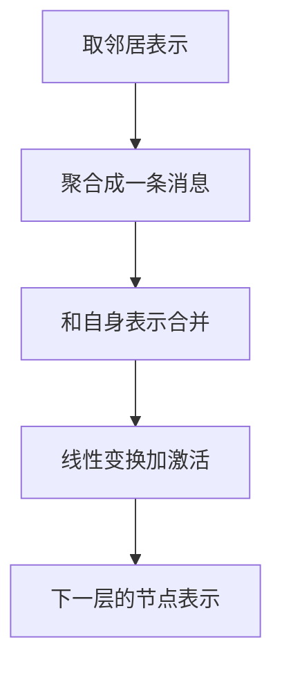

# 知识图谱表示学习

一句话:知识图谱表示学习是**把实体和关系压成向量,让「这条边该不该存在」变成一次向量运算**——TransE、RotatE 这一族给三元组设计打分函数,GNN 这一族从邻居里聚合出节点表示;两族回答的问题不同,所以不能只按模型名横向排名。本篇讲每一族怎样建模关系、适合什么任务、边界在哪,以及大模型时代图谱还剩下什么独立价值。

## 一、先立住:两族方法回答的是两个不同的问题

知识图谱就是一堆三元组 $(h, r, t)$——头实体、关系、尾实体,比如(北京,首都,中国)。它最常见的任务是**链接预测**:给 $(h, r, ?)$ 或 $(?, r, t)$,在全部实体里把缺的那个排出来。图谱永远是不完整的(R-GCN 论文开篇就是这句),所以补边是刚需。

两族方法从一开始就站在不同的假设上:

| | 平移 / 旋转类嵌入(TransE、RotatE、DistMult、ComplEx) | 图神经网络类(GCN、GAT、GraphSAGE、R-GCN) |
|---|---|---|
| 输入 | 只有三元组;实体就是一个 ID | 图结构 + 节点属性(文本、数值、类型) |
| 学什么 | 每个实体、每个关系各一个向量,外加一个**打分函数** | 一个**聚合函数**:怎么把邻居的表示汇总到自己身上 |
| 关系怎么进模型 | 直接写进打分函数(平移、旋转、双线性) | 普通 GCN / GAT 压根没有关系类型;R-GCN 才按关系分权重 |
| 输出 | 一条候选边的分数 | 一个节点的表示,后面再接分类头或打分器 |
| 没见过的实体 | 没有向量,**答不了** | 只要有属性和邻居,归纳式(GraphSAGE)能现算 |

**为什么不能按模型名排名?** 因为三件事在这张表里是交织的。一是它们常常不是竞争而是**串联**——R-GCN 做链接预测时,编码器是 R-GCN、解码器就是 DistMult,评的是「加了编码器之后 DistMult 好了多少」(论文自报 FB15k-237 上 filtered MRR 从 0.191 提到 0.248)。二是训练配方的影响常常比模型本身大:RotatE 论文自己的表里,TransE 换上同一套自对抗负采样后在 FB15k-237 上 MRR 0.332,RotatE 是 0.338,几乎打平;Ruffinelli 等人(ICLR 2020)把老模型的超参认真搜一遍,结论是模型之间的差距会**缩小甚至反转**。三是数据集决定了哪种关系模式占主导(第三节会看到),同一个模型换个数据集名次就换了。所以面试里正确的答法是:**先说任务和数据形态,再说哪一族,最后才是具体模型。**

## 二、TransE:把关系当成一次平移

### 打分与训练

TransE 把实体和关系都放进同一个 $k$ 维实数空间,要求:

$$
h + r \approx t
$$

意思是:从头实体出发,沿关系向量走一步,应该落到尾实体附近。打分就是距离 $d(h + r,\ t)$(L1 或 L2),越小越像真的。训练用带间隔的排序损失:正三元组的距离要比负三元组小至少一个间隔 $\gamma$,负三元组由**随机替换头或尾**(不同时换)造出来。论文在 FB15k 上的配置是 $k = 50$、$\gamma = 1$、L1 距离。

**为什么简单高效?** 因为参数量只有 $(|E| + |R|) \times k$,一次打分就是一次向量加减加一次范数,没有矩阵乘;一万五千个实体、50 维就是论文的 FB15k 配置,一百万实体、一千七百万条训练三元组的 FB1M 也能跑——这在 2013 年是它最大的卖点。

### 一对多为什么冲突

关系按两端的基数分四类:一对一、一对多、多对一、多对多。TransE 的麻烦出在「多」的那一侧。取一个一对多关系,比如(某作者,写过,书 1)(某作者,写过,书 2)……,TransE 要求:

$$
h + r \approx t_1,\quad h + r \approx t_2,\quad \cdots
$$

意思是:同一个 $h + r$ 是一个固定的点,要同时贴近所有尾实体,唯一的办法是**让这些尾实体挤到一起**——书 1 和书 2 的向量趋于相同,它们各自和别的实体的关系就被抹掉了。反过来,多对一关系里是头实体被挤到一起。论文自己的分表(FB15k、filtered Hits@10)把这条暴露得很清楚:预测「多」那一侧时,一对多关系补尾只有 19.7%,多对一关系补头只有 18.2%;而预测「一」那一侧分别是 65.7% 和 66.7%。**差三倍以上,不是调参能救的,是模型形状决定的。** 而 FB15k 里只有 26.2% 的关系是一对一,其余近四分之三都带「多」。

对称关系也是同一类病:若 $r(x, y)$ 和 $r(y, x)$ 同时成立,$x + r \approx y$ 与 $y + r \approx x$ 逼着 $r \to 0$、$x \approx y$,于是所有靠这个关系相连的实体全塌成一个点(RotatE 论文明确指出了这一点)。

修补方向一句话:**TransH**(Wang 等,AAAI 2014)先把实体投到每个关系专属的超平面上再平移,让同一实体在不同关系下有不同的「投影」;**TransR** 更进一步,给每个关系一个投影矩阵把实体投到关系空间。它们都在给「同一实体在不同关系里该长得不一样」腾出自由度,代价是参数和计算量随关系数上升。

## 三、RotatE:把关系当成一次旋转

### 复数空间逐维旋转

RotatE 把实体和关系都放进 $k$ 维**复数**空间,关系不再是加上去的向量,而是逐维的旋转:

$$
t = h \circ r,\qquad |r_i| = 1
$$

意思是:$\circ$ 是逐元素相乘;每个 $r_i$ 的模长钉死为 1,所以它只能写成 $e^{i\theta_{r,i}}$——在复平面上把 $h_i$ 逆时针转 $\theta_{r,i}$ 弧度,**只改相位、不改模长**。距离仍是 $\|h \circ r - t\|$,损失仍是带间隔的负采样损失。

**为什么转比平移强?** 因为旋转这个操作自带三条代数性质:转两次等于转角度之和(组合),反着转就是逆(逆关系),转 0 或 $\pi$ 再转一次回到原地(对称)。平移只有前两条——对称在平移里等价于 $r = 0$,那正是第二节里塌缩的那种情况;而旋转里 $r_i = \pm 1$ 就是一个合法的对称关系,实体不用塌,不同的对称关系还能用不同的向量区分开。

### 四种关系模式:谁能表达谁

RotatE 论文把常见的关系模式分成四种,并给出下面这张对照(论文 Table 2;✓ 能表达,✗ 不能):

| 关系模式 | 例子 | TransE | DistMult | ComplEx | RotatE |
|---|---|---|---|---|---|
| 对称 | 配偶、同义 | ✗ | ✓ | ✓ | ✓ |
| 反对称 | 父亲、上级 | ✓ | ✗ | ✓ | ✓ |
| 逆关系 | 上位词 ↔ 下位词 | ✓ | ✗ | ✓ | ✓ |
| 组合 | 我母亲的丈夫 = 我父亲 | ✓ | ✗ | ✗ | ✓ |

各家卡在哪:DistMult 的打分 $\sum_i h_i r_i t_i$ 对 $h$、$t$ 完全对称,所以它**只会**对称关系;ComplEx 用复数与共轭分出了方向,但 RotatE 论文的分析表明它推不出组合模式;RotatE 把模长钉成 1、只留相位,相位相加恰好就是组合。论文顺手指出,哪种模式占主导是数据集决定的:FB15k 与 WN18 以对称和逆关系为主,FB15k-237 以组合为主,WN18RR 以对称为主——这就是第一节说「换数据集名次就换」的来源。

### 代价:词表、负采样、自对抗

RotatE 没有改掉嵌入类方法的两条根本限制。**一是实体仍是词表里的一个 ID**:训练时没出现的实体没有向量,新实体一律要重训或至少增量训。**二是仍靠负采样**,而且比 TransE 更依赖负例质量,论文为此提出**自对抗负采样**:

$$
p(h'_j, r, t'_j) = \frac{\exp\big(\alpha f_r(h'_j, t'_j)\big)}{\sum_i \exp\big(\alpha f_r(h'_i, t'_i)\big)}
$$

意思是:用**当前模型自己**给一批负例打分,分高的(模型觉得像真的)权重大,$\alpha$ 是温度;这个权重直接乘进损失里,不用真的按分布去采。动机和对比学习里的难负例一样——均匀采出来的负例训着训着就都太容易、没梯度了(见 对比学习 篇)。效果不小:论文报告 TransE 在 FB15k-237 上 MRR 从均匀采样的 0.242 涨到 0.298。代价是它会把假负例一起放大(第五节),所以温度不能太高,论文的搜索范围只有 $\alpha \in \{0.5, 1.0\}$。

## 四、GNN:从邻居里聚合出表示

### 通用形状:聚合邻居,再更新自己

所有消息传递 GNN 一层都做同一件事:

叠 $L$ 层,节点就看到了 $L$ 跳以内的邻居。各家改的都是「怎么聚合」和「怎么合并」这两步:

| 模型 | 聚合权重从哪来 | 区分关系类型吗 | 新节点能推吗 | 改的是哪一步 |
|---|---|---|---|---|
| GCN(Kipf & Welling 2016) | 按度数归一化的固定权重 $1/\sqrt{d_i d_j}$ | 否 | 原文是转导式,全图一起算 | 聚合权重由图结构写死 |
| GAT(Veličković 等 2017) | **学出来的注意力** | 否 | 能(权重只看两端特征) | 聚合权重改成可学的 |
| GraphSAGE(Hamilton 等 2017) | 均值 / LSTM / 池化,**采样**固定数量的邻居 | 否 | **能**,这是它的目标 | 聚合函数可换、邻居抽样 |
| R-GCN(Schlichtkrull 等 2017) | 按关系类型各一套变换矩阵 $W_r$ | **是** | 否 | 消息变换按关系分开 |

### GAT:学邻居的权重,但看不见关系类型

GAT 给每条边算一个分数 $e_{ij} = \mathrm{LeakyReLU}\big(a^{\top}[W h_i \,\|\, W h_j]\big)$,再在节点 $i$ 的邻居上做 softmax 得到权重 $\alpha_{ij}$。它和 Transformer 的自注意力是一回事——只不过打分用的是拼接后过一个向量,而不是点积,而且 softmax 只在**邻居**上做,不是全序列(打分与掩码见 注意力基础 篇)。论文第一层用 8 个头,隐藏层把各头拼接、输出层取平均。

面试常问的边界是:**原始 GAT 不知道关系类型**。它的打分只看两端节点的特征,「父亲」边和「同事」边在它眼里是同一种边;知识图谱上要用它,得把关系信息塞进边特征或分关系跑注意力,否则和把图谱压成无向同构图没区别。

### R-GCN:按关系类型定义变换

R-GCN 的一层是:

$$
h_i^{(l+1)} = \sigma\Big(\sum_{r \in \mathcal{R}} \sum_{j \in \mathcal{N}_i^r} \frac{1}{c_{i,r}} W_r^{(l)} h_j^{(l)} + W_0^{(l)} h_i^{(l)}\Big)
$$

意思是:对每种关系 $r$,把该关系下的邻居各自过**这个关系专属的** $W_r$、按邻居数归一化后加起来,再加一条自环 $W_0 h_i$ 保住自己。方向靠**逆关系**解决:关系集合里同时放进 `born_in` 和 `born_in_inv`,一条有向边就变成两个方向各走一次消息。

关系一多,每个关系一个 $d \times d$ 矩阵会爆参数、稀有关系还过拟合,论文给了两种压法:**基分解**——所有 $W_r$ 都是 $B$ 个共享基矩阵 $V_b$ 的线性组合,只有系数 $a_{rb}$ 随关系变,相当于让稀有关系借用常见关系的参数;**块对角分解**——把 $W_r$ 限制成对角线上 $B$ 个小块,相当于说「特征分成几组,组内耦合、组间不耦合」。论文报告 FB15k、WN18 上用基分解(两个基)、FB15k-237 上块对角更好。链接预测时 R-GCN 是编码器、DistMult 是解码器,每个正例配 1 个负例、随机替换主语或宾语、用交叉熵训;实体分类则直接在最后一层接 softmax。

### GraphSAGE:学一个聚合函数,新节点现算

GraphSAGE 的两个关键动作:**采样**——每一跳只随机抽固定数量的邻居(论文用第一跳 25、第二跳 10),让每个节点的计算量有上界,大图才训得动;**学函数不学表**——训练出来的是聚合器和变换矩阵,不是每个节点的向量,所以一个训练时没见过的节点,只要有自己的特征和邻居,前向跑一遍就有表示。这就是「归纳」的意思。它适合的场景是**节点持续新增、且节点自带属性**:新用户、新帖子、新商品、新蛋白质;论文的评测就是在 Reddit 上对没见过的帖子、在 PPI 上对整张没见过的图做分类。反过来,**没有节点属性的纯三元组图谱**它没有优势——邻居聚合的原料只有随机初始化的 ID 向量,那还不如直接学一张表。

### 知识图谱上 GNN 还得处理什么

| 图谱特有的东西 | 为什么普通 GCN / GAT 接不住 | 常见处理 |
|---|---|---|
| 边方向 | 邻接矩阵一对称化,「A 是 B 的父亲」和「B 是 A 的父亲」就一样了 | 加逆关系当独立关系(R-GCN 做法) |
| 关系类型 | 一个 $W$ 给所有边,类型信息丢光 | 按关系分 $W_r$ 加基分解 / 块对角;或把关系向量和实体向量先组合再聚合(CompGCN 那一路) |
| 时间 | 三元组带时间戳时,「现任 CEO」和「前任 CEO」不能混 | 把时间做成边特征,或按时间切片建多张图 |
| 属性 | 数值、文本这些信息不是边 | 当节点初始特征喂进去——这正是 GNN 比嵌入类多出来的输入 |

## 五、训练与评测:负采样、假负例与 filtered 协议

### 负样本从哪来

链接预测没有天然的负例——图谱里只记录了「有」的边,从不记录「没有」的边。通行做法是**替换头或尾**:拿一条真三元组 $(h, r, t)$,把 $h$ 或 $t$ 换成随机实体(TransE 与 R-GCN 原文都是每个正例配 1 个负例),然后要求模型给真的打高分、给假的打低分。损失有两种常见形状:带间隔的排序损失(TransE),或对正负例分别过 sigmoid 的负采样损失(RotatE、R-GCN)。负例的数量、难度与批大小怎么权衡是通用问题,见 对比学习 篇;本节只讲图谱上特有的问题。

### 开放世界假设:未记录不等于错

图谱遵循**开放世界假设**——没写进去的三元组只是「不知道」,不是「假」。于是随机替换造出来的负例里必然混着真的:把(某作者,写过,书 1)的尾换成书 2,而书 2 恰好也是他写的、只是没收录。这就是**假负例**:模型被要求把一条真边推开。对一对多、多对多关系尤其严重,因为「多」那一侧的真实候选越多,随机抽中一个真的概率越高。三条缓解:**按关系统计决定换哪一头**(TransH 提出的做法:一对多关系多换头、多对一多换尾,因为「一」那一侧的替换更不容易撞上真例);**把训练集里已有的三元组从负例里剔掉**;**自对抗采样的温度别开太高**,因为模型打分高的负例正是最可能其实为真的那批(和 对比学习 篇里「最难的负例也是假负例最集中的地方」是同一件事)。

### 评测:MRR、Hits@K,以及 raw 与 filtered 的差别

评测就是把测试三元组的头(或尾)换成**词表里每一个实体**,按打分排序,看正确答案排第几。**MRR** 是正确答案排名倒数的平均(排第 1 得 1,排第 10 得 0.1),**Hits@K** 是排进前 K 的比例。

问题在于:候选里有些三元组本身就是真的、只是不是这条测试三元组——它们排在前面不该算错。TransE 论文因此提出 **filtered 协议**:把训练、验证、测试集里出现过的其它真三元组从候选里移走再排名;不移的叫 **raw**。filtered 的数字一定更好看(R-GCN 论文在 FB15k-237 上自报 raw MRR 0.158、filtered 0.248,同一个模型差 0.09),所以**两个协议的数字混在一张表里比,毫无意义**。

还有两个坑同样决定数字能不能比:

- **数据集泄漏**。ConvE 论文引述的统计是,WN18 和 FB15k 里分别有约 94% 和 81% 的测试三元组能靠训练集里的逆关系直接反推(测试有(猫,上位词,猫科),训练里已有(猫科,下位词,猫)),模型只要记住「谁是谁的逆」就能得高分。FB15k-237(Toutanova & Chen 2015,清掉逆关系与冗余关系后只剩 237 种)和 WN18RR(ConvE 论文给出的去泄漏版)就是为堵这个洞造的,今天报 FB15k 上的数字已经没人认。
- **同分怎么排**。Sun 等人 2020 年的复查发现,一些模型输出里大量候选的分数完全相同;若把正确答案放在同分组的最前面(TOP),ConvKB 在 FB15k-237 上 MRR 是 0.396,改成随机放(RANDOM)就掉到 0.243。他们建议一律用随机排位。

所以「固定候选集、说明 filtered 还是 raw、说明同分规则、说明数据集版本」这四件事说清楚,数字才能比;少一件,你都不知道差距是模型带来的还是协议带来的。

## 六、选型:按任务和数据形态,不按论文年份

| 你的任务 | 数据形态 | 先试哪一族 | 因为 |
|---|---|---|---|
| 补边(链接预测) | 纯三元组,实体固定 | 嵌入类:RotatE,或调好参的 TransE / ComplEx | 便宜,一张向量表加一个打分函数;也没有属性可以给 GNN 吃 |
| 补边,关系模式复杂 | 组合、逆关系多 | RotatE | 第三节那张表,四种模式全能表达的只有它 |
| 补边,节点有丰富属性 | 三元组 + 文本 / 数值 | R-GCN 编码器 + 嵌入类解码器 | R-GCN 论文的实验就是这个形状:编码器吃邻域与属性,解码器仍是 DistMult |
| 实体分类(补类型、补属性) | 多关系图 | R-GCN | 目标是节点级表示,三元组打分函数派不上用场 |
| 新实体不断进来 | 节点自带特征 | GraphSAGE 这类归纳式 | 嵌入类对没见过的 ID 无能为力 |
| 多关系推理(多跳) | 需要沿路径走 | 嵌入类靠组合模式隐式推,GNN 靠层数看多跳 | 两族都只给相似度,给不出「凭什么」;路径要可解释就走符号规则或图遍历 |

两族**叠加**是常态而不是例外:GNN 负责把邻域和属性编码进节点表示,嵌入类的打分函数负责给一条边打分。反过来的组合也有——先用嵌入类训好的实体向量当 GNN 的初始特征。

## 七、大模型时代:知识图谱还剩什么独立价值

Pan 等人 2023 年的路线图把两者的关系分成三类:图谱增强大模型(预训练与推理时注入)、大模型增强图谱(抽取、补全、问答)、两者协同。抛开分类,图谱在大模型面前站得住的理由就五条,每条都是大模型自己给不了的:

| 图谱有的 | 大模型没有的 | 典型场景 |
|---|---|---|
| 显式的实体与关系 | 参数里的知识是隐式的,问不出「它到底知道哪些边」 | 需要枚举「A 的全部下游」 |
| 约束与规则推理 | 「一个人只有一个生父」这类硬约束模型不保证 | 数据一致性校验 |
| 可追溯来源 | 生成的每句话没有出处 | 审计、合规 |
| 可更新的结构 | 改一条事实要重训或靠 RAG | 组织架构、价格、库存 |
| 权限与审计 | 模型无法按用户裁剪自己知道的东西 | 多租户、分级授权 |

在系统里它有三种用法。**当检索源**——图索引这条 RAG 路线怎么建、Local 与 Global 两条查询路径的成本,见 GraphRAG 篇,本篇不重复。**当校验器**——模型生成后把关键声明(人名、金额、日期)拆出来对图谱查一遍,这是 幻觉与事实性 篇里「系统验证」那一层的具体落地,图谱能确定性地兜住能被查表判定的部分。**当工具**——把图查询封装成带 schema 的函数供模型调用,校验与鉴权放在宿主侧(见 工具调用 篇)。

反过来,大模型确实能替图谱干最贵的活:从文本里抽候选三元组。但**写入前仍要过实体消歧和事实验证两道闸**,因为抽取是生成式的——同一段文本抽两次结果不一样,「张三」「张总」可能是一个人也可能是两个;错合并的实体会把两个人的事迹拼进一个节点,再顺着邻域扩展与社区摘要被放大(错误怎么放大见 GraphRAG 篇)。图谱的价值恰恰在「写进去的都是经过验证的」,把未验证的候选直接灌进去,它就退化成另一份会幻觉的文本。

## 八、面试考点串联

| 高频问法 | 本文哪一节 |
| --- | --- |
| 知识图谱表示学习中的 TransE、RotatE、GNN、R-GCN、GraphSAGE 和 GAT 分别怎样建模关系? | 一(两族假设)、二、三、四 |
| 它们适合哪些任务,又有哪些边界? | 一(对照表)、三(代价)、四(GAT 与 GraphSAGE 的边界)、六 |
| 大模型时代知识图谱还有什么价值? | 七 |
| TransE 为什么难以处理一对多关系,RotatE 改善了什么? | 二(冲突推导与分表数字)、三 |
| 知识图谱 GNN 与普通 GCN 有何差异,R-GCN 怎样处理关系类型? | 四(GAT 的边界、R-GCN 一层与两种分解、图谱特有表) |
| GraphSAGE 的归纳能力适合什么场景? | 四(GraphSAGE)、六 |
| 负采样和 filtered 评价协议为什么会影响链接预测结果? | 五 |
| 大模型时代知识图谱还能提供哪些独立价值? | 七 |
| 补充题:为什么不能拿 TransE、RotatE、R-GCN 直接横向排名?你会先问什么? | 一 |
| 补充题:RotatE 为什么能表达对称关系而 TransE 不能?模长钉成 1 是在干什么? | 三 |
| 补充题:自对抗负采样是怎么回事?它和假负例是什么关系? | 三、五 |
| 补充题:GAT 的注意力和 Transformer 的注意力是一回事吗?它在知识图谱上缺什么? | 四 |
| 补充题:同一个模型 raw 和 filtered 的 MRR 为什么会差一截?为什么现在没人报 FB15k 的数字了? | 五 |
| 补充题:LLM 已经能抽三元组了,为什么写进图谱前还要消歧和验证? | 七 |

InfoNCE 与难负例的一般机制见 对比学习 篇;向量检索与 ANN 索引见 Embedding 篇;图索引 RAG 的建图与查询见 GraphRAG 篇;幻觉的检测与分层缓解见 幻觉与事实性 篇;工具契约与校验见 工具调用 篇;注意力打分与掩码见 注意力基础 篇。

## 相关文献

- Translating Embeddings for Modeling Multi-relational Data(TransE,NeurIPS 2013)— https://proceedings.neurips.cc/paper/2013/hash/1cecc7a77928ca8133fa24680a88d2f9-Abstract.html
- Knowledge Graph Embedding by Translating on Hyperplanes(TransH,AAAI 2014)— https://ojs.aaai.org/index.php/AAAI/article/view/8870
- Embedding Entities and Relations for Learning and Inference in Knowledge Bases(DistMult)— [arXiv:1412.6575](https://arxiv.org/abs/1412.6575)
- Complex Embeddings for Simple Link Prediction(ComplEx)— [arXiv:1606.06357](https://arxiv.org/abs/1606.06357)
- RotatE: Knowledge Graph Embedding by Relational Rotation in Complex Space — [arXiv:1902.10197](https://arxiv.org/abs/1902.10197)
- Semi-Supervised Classification with Graph Convolutional Networks(GCN)— [arXiv:1609.02907](https://arxiv.org/abs/1609.02907)
- Graph Attention Networks(GAT)— [arXiv:1710.10903](https://arxiv.org/abs/1710.10903)
- Inductive Representation Learning on Large Graphs(GraphSAGE)— [arXiv:1706.02216](https://arxiv.org/abs/1706.02216)
- Modeling Relational Data with Graph Convolutional Networks(R-GCN)— [arXiv:1703.06103](https://arxiv.org/abs/1703.06103)
- Composition-based Multi-Relational Graph Convolutional Networks(CompGCN)— [arXiv:1911.03082](https://arxiv.org/abs/1911.03082)
- Observed versus latent features for knowledge base and text inference(FB15k-237 的来源)— https://aclanthology.org/W15-4007/
- Convolutional 2D Knowledge Graph Embeddings(ConvE,指出 WN18 / FB15k 的逆关系泄漏)— [arXiv:1707.01476](https://arxiv.org/abs/1707.01476)
- A Re-evaluation of Knowledge Graph Completion Methods(同分排位对指标的影响)— [arXiv:1911.03903](https://arxiv.org/abs/1911.03903)
- You CAN Teach an Old Dog New Tricks! On Training Knowledge Graph Embeddings(ICLR 2020,调参后模型差距缩小)— https://openreview.net/forum?id=BkxSmlBFvr
- Unifying Large Language Models and Knowledge Graphs: A Roadmap — [arXiv:2306.08302](https://arxiv.org/abs/2306.08302)
