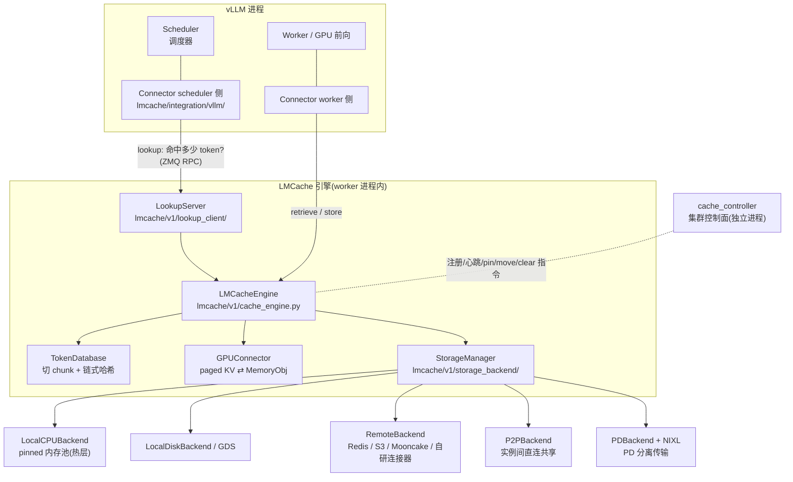

# LMCache 总览

一句话:**vLLM/SGLang 生态的 KV cache 分层存储与复用层**——把算好的 KV cache 从 GPU 显存搬出去(CPU 内存 → 本地磁盘 → Redis/S3/Mooncake 等远端),下次遇到同样的文本直接搬回来,跳过重复 prefill,从而**降 TTFT、提吞吐**;默认按前缀 chunk 复用,配合 CacheBlend 还能复用**任意位置(非前缀)**的文本,同时兼任 PD 分离的 KV 传输层。

## 一、为什么需要它(30 秒版本)

vLLM 自带的 prefix caching 只活在**单实例的 GPU 显存**里:容量小、实例重启就没、多实例之间互不相认。而多轮对话、RAG、长系统提示词这些场景,同一段文本会被反复 prefill——GPU 在大量重复劳动。

LMCache 的思路是把 KV cache 当成"数据"来管理:切成固定大小的 chunk、算哈希当 key、按冷热分层存放、跨实例共享。类比:vLLM 的 prefix cache 是 CPU 的 L1 cache,LMCache 给它补上了 L2/L3 乃至"分布式文件系统",并配了一个集群管理面。

## 二、全景架构

进入这个项目,先记住五个角色:vLLM 通过 **connector** 接入,**cache engine** 是大脑,**token database** 负责把 token 变成 key,**GPU connector** 负责搬运,**storage backends** 负责存,**controller** 是集群控制面。

几个关键关系:

- vLLM v1 的 connector 是**双侧**的:scheduler 侧只做"查命中 + 组元数据",worker 侧才真正搬 KV。scheduler 进程里没有 GPU 也没有存储,所以查询要通过 ZMQ RPC 问 worker 进程里的 LookupServer。
- **LocalCPUBackend 地位特殊**:它既是热层缓存,又是所有其他后端的中转 buffer(磁盘/远端读上来先落 pinned CPU 内存),所以永远最先创建(`lmcache/v1/storage_backend/__init__.py:142-169`)。
- controller 是可选的独立进程,管跨实例的注册、心跳、全局 lookup 与运维指令(pin/move/compress/clear),P2P 共享靠它牵线。

## 三、仓库目录导览

版本沿革一句话:顶层 `lmcache/storage_backend/` 等旧目录是 v0 遗留(现在只剩 CacheGen 序列化残件),**当前主实现全部在 `lmcache/v1/`**,阅读以 v1 为准。

顶层:

| 目录 | 职责 |
| --- | --- |
| `lmcache/` | Python 包主体(见下表) |
| `csrc/` | CUDA/C++ 内核:`mem_kernels.cu` 按 slot_mapping 搬 KV,`ac_enc.cu`/`ac_dec.cu` 是 CacheGen 算术编码 |
| `rust/` | raw_block:Rust 写的本地块存储组件 |
| `operator/` | Kubernetes Operator(Go),集群化部署 |
| `benchmarks/` | long_doc_qa / multi_round_qa / rag 等负载脚本 |
| `examples/` | disagg_prefill、blend_kv、cache_controller 等可跑示例 |
| `docker/` `tests/` `docs/` | 镜像 / 测试 / 文档(`docs/design/` 与代码树镜像的设计文档) |

`lmcache/` 包内:

| 目录 | 职责 |
| --- | --- |
| `integration/vllm/` | vLLM 接入层:connector 薄壳 + `vllm_v1_adapter.py` 主实现(见 01 篇) |
| `integration/sglang/` | SGLang 接入适配器 |
| `v1/cache_engine.py` | LMCacheEngine:store/retrieve/lookup 三大 API + Builder 单例 |
| `v1/token_database.py` | ChunkedTokenDatabase(前缀链式哈希)/ SegmentTokenDatabase(blend 分段) |
| `v1/storage_backend/` | StorageManager + CPU/Disk/GDS/Remote/P2P/PD 各后端;`connector/` 下 Redis、S3、Mooncake、InfiniStore 等远端连接器;`naive_serde/` 序列化(naive/kivi/cachegen) |
| `v1/gpu_connector/` | GPU ⇄ CPU 搬运:VLLMPagedMemGPUConnectorV2/V3、layerwise 变体、SGLang 版 |
| `v1/memory_management.py` | MemoryObj 抽象与 pinned CPU 内存池分配器 |
| `v1/lookup_client/` | scheduler 侧查询客户端:ZMQ / bypass / async / Mooncake 多种实现 |
| `v1/cache_controller/` | 控制面:controller_manager + KVController + 每 worker 的 LMCacheWorker 代理 |
| `v1/compute/` | CacheBlend 计算路径(blend/、attention/、positional_encoding) |
| `v1/config.py` | `_CONFIG_DEFINITIONS` 单一配置中心,yaml/环境变量/extra_config 三路加载 |
| `v1/distributed/` `v1/transfer_channel/` | 跨实例分层缓存适配与 NIXL/socket 传输通道 |
| `v1/multiprocess/` `v1/server/` `v1/standalone/` | MP 模式(缓存独立进程)/ 独立缓存服务器 / standalone 入口 |
| `storage_backend/serde/` | v0 遗留:CacheGen 编解码旧版残件 |

## 四、一次带缓存命中的请求:完整数据流

设 chunk_size=256(默认),用户发来 1000 token 的 prompt,其中前 512 token 此前算过并存进了 LMCache:

1. **调度期查命中**:vLLM scheduler 调 connector 的 `get_num_new_matched_tokens()`,scheduler 侧 LookupClient 自己把 token 切 chunk、算链式哈希,只把 `hashes + offsets` 通过 ZMQ 发给 worker 进程的 LookupServer(`lmcache/v1/lookup_client/lmcache_lookup_client.py:86-127`)。
2. **引擎查存在性**:LookupServer 调 `LMCacheEngine.lookup(pin=True)`(`lmcache/v1/cache_engine.py:1058`),StorageManager 逐后端 `batched_contains`,返回**前缀连续命中** 512 token,同时把命中的 chunk pin 住防止查完到取之间被驱逐。
3. **调度决策**:vLLM 给这 512 token 分配 KV block;connector 在 `build_connector_meta()` 里打包 ReqMeta(token_ids、slot_mapping、LoadSpec/SaveSpec),随 SchedulerOutput 发给 worker。
4. **前向前装载**:worker 侧 `start_load_kv()` 调 `LMCacheEngine.retrieve()`(`lmcache/v1/cache_engine.py:754`):token database 重算 key → StorageManager 定位在哪层(CPU 命中直接拿;磁盘/远端则先读进 CPU buffer)→ GPUConnector 的 CUDA kernel 按 slot_mapping 把 KV scatter 进 vLLM 的 paged 显存。
5. **只算增量**:vLLM 前向只需 prefill 剩下的 488 token——TTFT 的节省就发生在这一步。
6. **前向后保存**:`wait_for_save()` 调 `LMCacheEngine.store()`(`lmcache/v1/cache_engine.py:363`):新算的 KV 按 256 对齐切 chunk,GPUConnector gather 成 CPU 上的 MemoryObj,StorageManager 异步下沉到各级后端;随后 `lookup_unpin` 解除第 2 步的 pin。
7. **后台闲事**:LocalCPU 池满了按 LRU(可换策略)驱逐到下层;若开 controller,LMCacheWorker 上报 admit/evict 事件维护全局索引,供 P2P 与运维指令使用。

## 五、面试考点串联

1. LMCache 与 vLLM prefix caching 的关系、为什么要跨出显存 →「一、动机」
2. 五大组件各自干什么、lookup 为什么走 RPC →「二、全景架构」
3. 一次命中请求经过哪些步骤、TTFT 省在哪 →「四、数据流走读」
4. chunk 哈希怎么算、pin 解决什么竞态 → 01 篇与后续 cache engine 篇展开

## 相关链接

- GitHub:https://github.com/LMCache/LMCache
- 官方文档:https://docs.lmcache.ai/
- CacheGen(KV cache 压缩与流式传输,SIGCOMM'24)— [arXiv:2310.07240](https://arxiv.org/abs/2310.07240)
- CacheBlend(非前缀 KV 复用/选择性重算,EuroSys'25)— [arXiv:2405.16444](https://arxiv.org/abs/2405.16444)
