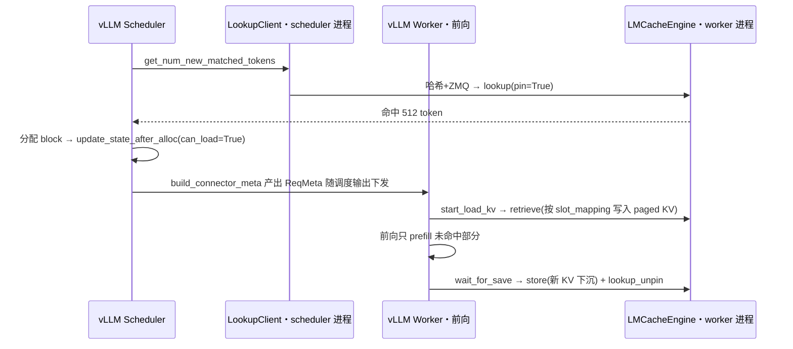

# vLLM 集成与接入层

职责一句话:实现 vLLM v1 的 **KV connector 接口**,把"查命中、装载 KV、保存 KV"三件事挂进 vLLM 调度与前向的生命周期钩子,是整个 LMCache 的总入口(代码都在 `lmcache/integration/vllm/`)。

## 一、vLLM v1 connector:一个接口、两侧插槽

vLLM v1 把外部 KV 系统抽象成 `KVConnectorBase_V1`,并按**角色**拆成两半(`KVConnectorRole.SCHEDULER` / `WORKER`):scheduler 侧参与调度决策(该给这个请求分多少 block),worker 侧真正搬数据。LMCache 的实现类是 `LMCacheConnectorV1Dynamic`(`lmcache/integration/vllm/lmcache_connector_v1.py:30`)——一个纯转发的薄壳,所有逻辑委托给 `LMCacheConnectorV1Impl`(`lmcache/integration/vllm/vllm_v1_adapter.py:443`)。

各钩子一览(方法名即 vLLM v1 connector API,行号为薄壳文件):

| 侧 | 方法 | 干什么 |
| --- | --- | --- |
| scheduler | `get_num_new_matched_tokens` (:149) | 查 LMCache 里命中多少前缀 token(超出 vLLM 本地 prefix cache 的部分) |
| scheduler | `update_state_after_alloc` (:171) | vLLM 分好 block 后确认"可以装载了"(置 can_load) |
| scheduler | `build_connector_meta` (:179) | 把本步所有请求的装载/保存计划打包,随调度输出发给 worker |
| scheduler | `request_finished` (:193) | 请求结束时的收尾(是否需异步保存、回传附加参数) |
| worker | `register_kv_caches` (:50) | 拿到 vLLM 分配好的 paged KV tensor 引用,触发引擎补全初始化 |
| worker | `start_load_kv` (:60) | 前向开始前,把命中的 KV 从 LMCache 装进 paged 显存 |
| worker | `wait_for_layer_load` (:72) | layerwise 流水线:attention 层内等"这一层已装好" |
| worker | `save_kv_layer` (:85) | layerwise 流水线:边前向边逐层保存 |
| worker | `wait_for_save` (:108) | 前向结束时阻塞收尾保存(防止 paged 显存被下一步覆写) |
| worker | `get_finished` / `get_block_ids_with_load_errors` (:118/:134) | 异步完成通知 / 上报装载失败的 block 让 vLLM 重算 |

一个请求走一遍(scheduler 在上、worker 在下):



## 二、初始化链路:从 vLLM 启动到引擎就绪

`LMCacheConnectorV1Impl.__init__`(`vllm_v1_adapter.py:444-484`)做四件事:

1. `lmcache_get_or_create_config()`(`lmcache/integration/vllm/utils.py:75`)读配置(见第五节),进程级线程安全单例;
2. `_apply_extra_config`(`vllm_v1_adapter.py:486`)用 vLLM `kv_connector_extra_config` 里 `lmcache.` 前缀的键覆盖配置;
3. 构造 `VllmServiceFactory` 并交给 `LMCacheManager`(`lmcache/v1/manager.py:40`)——统一的生命周期管家,按角色决定创建哪些组件:LMCacheEngine、LookupClient(scheduler 侧)、LookupServer(worker 侧)、内部 API server、插件等;任何一步失败进入**降级模式**(标记 unhealthy,vLLM 正常跑、只是全部重算,`manager.py:104-111`);
4. worker 侧真正的重头戏延迟到 `register_kv_caches`(`vllm_v1_adapter.py:721`):拿到 paged KV tensor 后 `manager.post_init()` 才创建 StorageManager 并分配 pinned CPU 池——因为此前不知道 KV 的 shape/dtype。

## 三、lookup:命中查多少(scheduler 侧)

`get_num_new_matched_tokens` 的实现(`vllm_v1_adapter.py:1307-1441`)有几处很值得读:

- **scheduler 进程算哈希、worker 进程查存在**。scheduler 里没有引擎实例,`LMCacheLookupClient` 自带一份 ChunkedTokenDatabase,把 token 切 chunk 算出 `hashes + offsets` 走 ZMQ 发给 worker 的 `LMCacheLookupServer`,后者调 `engine.lookup(pin=True)`(`lmcache/v1/lookup_client/lmcache_lookup_client.py:86-127, 234-249`)。只传哈希不传 token,消息更小,还顺带省了 worker 重复哈希。
- **pin 防竞态**:lookup 命中即 pin,防止"查到了、取的时候已被驱逐";与之配对的 unpin 在 worker 侧 `wait_for_save` 里做(`vllm_v1_adapter.py:1104`),形成跨调度步的引用计数闭环。
- **结果缓存与幂等**:先查 `lookup_cache`(:1344),没有才真查——同一请求被抢占后重新调度时不会二次 lookup、二次 pin。
- **全命中减 1**(:1396-1397):若整个 prompt 都命中,故意少报 1 个 token,强制 vLLM 重算最后一个——因为 vLLM 至少要跑一个 token 的前向才能产出 logits 去采样下一个词。
- **`min_retrieve_tokens` 门槛**(:1402-1416):命中太少就不装载(搬运开销大过重算收益),但命中数仍记入 LoadSpec,让后面 save 时跳过这些已存在的 chunk。

## 四、chunk 对齐与元数据构建(scheduler 侧)

四个核心数据结构(都在 `vllm_v1_adapter.py`):

| 结构 | 行号 | 内容 |
| --- | --- | --- |
| `LoadSpec` | :61 | vllm_cached_tokens / lmcache_cached_tokens / can_load |
| `SaveSpec` | :71 | skip_leading_tokens(已存过的跳过)/ can_save |
| `RequestTracker` | :107 | 每请求累积状态:token_ids、block_ids、num_saved_tokens、是否进入 decode |
| `ReqMeta` | :274 | 发给 worker 的最终计划:token_ids + slot_mapping + load/save spec |

`build_connector_meta`(:1518)每个调度步遍历新请求与续跑请求,更新 tracker 并产出 ReqMeta;其中 `ReqMeta.from_request_tracker`(:294)是 chunk 对齐规则的集中地:

- **save 只在跨过 chunk 边界时发生**(:329-343):`chunk_boundary = cdiv(num_saved+1, 256) * 256`,不足一个新 chunk 就先攒着;chunked prefill 的中间步只存到 256 的整数倍,尾巴留给下一步(:354-359)。decode 阶段默认不存(`save_decode_cache=False`)。
- **slot_mapping 把"逻辑 token 序"翻译成"物理显存槽位"**(:397-404)。vLLM 的 KV 按 block 分页,第 $i$ 个 token 的槽位:

$$
\text{slot}[i] = \text{block\_ids}[\lfloor i / B \rfloor] \times B + (i \bmod B)
$$

其中 $B$ 是 vLLM block_size。worker 侧的 CUDA kernel 拿着它做 gather/scatter,LMCache 因此完全不用理解 vLLM 的页表结构。

- **retrieve 侧向下对齐**:vLLM 本地已命中的 token 数向下取整到 chunk 边界作为装载掩码起点(`vllm_v1_adapter.py:786-791`),整 chunk 装载可能与 vLLM 已有内容重叠几十个 token,直接覆写同值数据换取"永远整 chunk 搬运"的简单性(`lmcache/v1/cache_engine.py:873-884` 注释里有个 288 vs 512 的具体例子)。
- token database 层的保险丝:掩码里 False 的个数必须是 chunk_size 的整数倍,否则直接抛错(`lmcache/v1/token_database.py:380-383`)。

## 五、worker 侧:load 与 save 的两条路

**装载**(`start_load_kv`,:730):遍历 ReqMeta,对 can_load 的请求调 `engine.retrieve()`,拿回布尔掩码;若实际取回数少于预期(远端超时、条目损坏),`record_failed_blocks`(:861)把差集换算成 block id 集合,vLLM 下一步通过 `get_block_ids_with_load_errors`(:1291)取走并安排重算——**缓存失败退化为重算,不是请求失败**。

**保存**(`wait_for_save`,:1065):对 can_save 的请求,skip_leading_tokens 向下对齐 chunk 后调 `engine.store()`;PD 分离里 `kv_consumer` 角色只 unpin 不保存(:1071-1081);PP 并行时只有最后一个 rank 更新"已存进度",保证每个 stage 都存了自己那份层(:1200-1206)。

**layerwise 流水线**(`use_layerwise=True`):`retrieve_layer`/`store_layer` 是生成器,`wait_for_layer_load`(:936)与 `save_kv_layer`(:963)在每个 attention 层 `next()` 一步——第 i 层在算,第 i+1 层的 KV 在传,把 IO 藏进逐层计算里。

## 六、配置入口:四层覆盖

| 层 | 形式 | 例子 |
| --- | --- | --- |
| 配置文件 | 环境变量 `LMCACHE_CONFIG_FILE` 指向 yaml | `chunk_size: 256`、`max_local_cpu_size: 5.0` |
| 环境变量 | `LMCACHE_` + 字段名大写(`lmcache/v1/config_base.py:224,264`) | `LMCACHE_LOCAL_DISK=file://...` |
| vLLM 启动参数 | `--kv-transfer-config` 的 `kv_connector_extra_config` 里 `lmcache.` 前缀键(`vllm_v1_adapter.py:486-501`) | `{"lmcache.chunk_size": 512}` |
| 单请求 | `sampling_params.extra_args["kv_transfer_params"]` 里 `lmcache.` 前缀键(:94-103) | `lmcache.skip_save: true` |

所有配置项集中定义在 `lmcache/v1/config.py:62` 起的 `_CONFIG_DEFINITIONS`(类型/默认值/env 转换器一处声明)。最小启动命令:

```bash
vllm serve <model> --kv-transfer-config \
  '{"kv_connector":"LMCacheConnectorV1","kv_role":"kv_both"}'
```

## 七、设计取舍

- **薄壳 + Impl 分离**:vLLM connector API 迭代很快,仓库里同时躺着 `lmcache_connector_v1_085.py`(旧版 vLLM)、`lmcache_mp_connector_0180.py`(缓存独立进程的 MP 模式)多个壳,共享同一套 Impl/adapter;adapter 内部还有大量 if/hasattr 兼容 block_ids 从 `list` 变 `tuple[list]`(vLLM 0.9.0)、CachedRequestData 从 list 变对象(0.9.2)这类上游变更。代价是 adapter 读起来"补丁感"重,换来对多版本 vLLM 的即插即用。
- **查询前置到调度期**:lookup 在 scheduler 里同步发生(默认几毫秒级 ZMQ 往返),换来 vLLM 能精确地只给命中部分分配 block、只调度未命中的计算;`enable_async_loading` 则把装载也改成异步,靠 `get_num_new_matched_tokens` 返回 None 表示"还在查"。
- **一切按 chunk 说话**:save 攒边界、retrieve 整块搬、哈希按块链式算——牺牲了尾部不足 256 token 的复用机会(`save_unfull_chunk` 可开),换来 key 空间小、传输批量大、pin/驱逐的粒度统一。
- **失败永远降级为重算**:初始化失败、装载失败都不阻塞 vLLM,只是变慢。缓存系统的第一美德是"坏了也不影响正确性"。

## 八、面试考点串联

1. vLLM v1 KV connector 为什么拆 scheduler/worker 两侧、各有哪些钩子 →「一」
2. LMCache 怎么知道命中多少 token、lookup 为什么要 pin →「三」
3. 全命中为什么要少报一个 token →「三」
4. slot_mapping 是什么、LMCache 如何对接 PagedAttention 的分页显存 →「四」
5. chunk 对齐在存取两侧分别怎么处理、部分命中会不会重复搬运 →「四」
6. 缓存装载失败了请求会怎样 →「五」
7. layerwise 流水线怎么把 IO 藏进计算 →「五」
