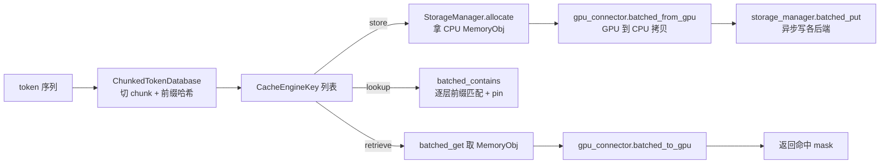

# 缓存引擎与 Key 体系

一句话:`LMCacheEngine` 是 v1 的总调度——把 GPU 上的 KV cache 按 token 切成 chunk、用**前缀哈希链**给每个 chunk 造一个全局唯一的 `CacheEngineKey`、封装成带引用计数的 CPU 内存对象(`MemoryObj`),再交给存储层;取回时反向执行。可以把它理解成"KV cache 的图书馆管理员":token 序列是书稿,chunk 是装订好的分册,Key 是索书号,MemoryObj 是书架上的实体书。

## 一、核心类与三条主路径

核心类 `LMCacheEngine` 在 `lmcache/v1/cache_engine.py:78`,对外三个动词:

- **store**(`cache_engine.py:363`):GPU KV → 切 chunk → 分配 CPU 内存 → 异步写入各存储后端;
- **retrieve**(`cache_engine.py:754`):按 Key 找回 MemoryObj → 通过 GPU connector 拷回 paged KV buffer,返回命中 mask;
- **lookup**(`cache_engine.py:1058`):只查存在性(命中多少前缀 token),供 vLLM 调度器决定跳过多少 prefill,可顺带 `pin` 防止查完被淘汰。

另有 layerwise 变体 `store_layer`/`retrieve_layer`(`cache_engine.py:568/902`):按层流水化,边算边存/边取边算,用 generator 与 vLLM 的逐层前向交错执行。

## 二、token 怎么切 chunk

`TokenDatabase` 抽象在 `lmcache/v1/token_database.py:38`,两种实现:

- **ChunkedTokenDatabase**(`token_database.py:269`,默认):按固定 `chunk_size` 硬切,`_chunk_tokens`(`token_database.py:305`)从头每 256 个 token 一刀。`chunk_size` 默认 **256**(`lmcache/v1/config.py:64`);`save_unfull_chunk` 决定结尾不满一个 chunk 的零头存不存(默认存)。
- **SegmentTokenDatabase**(`token_database.py:423`):按特殊分隔符切段,是 CacheBlend(非前缀复用)的入口,普通路径用不到。

mask 约定:`FFFF TTTT`,False 只允许出现在前缀(表示 vLLM 已有这段 KV),且 False 数必须是 chunk_size 的整数倍——否则切出来的 chunk 边界对不上,直接抛 `ValueError`。

## 三、前缀哈希链与 CacheEngineKey

### 哈希链怎么算

`_prefix_hash`(`token_database.py:329`)是一条链式哈希:

$$
h_i = \mathrm{hash}\big(\,(h_{i-1},\ \text{tokens}_i,\ \text{extra\_keys})\,\big),\qquad h_0 = \mathrm{NONE\_HASH}
$$

第 $i$ 个 chunk 的哈希把**前一个 chunk 的哈希**当作输入的一部分,所以同样的 256 个 token 出现在不同前缀之后,哈希不同——这正是"前缀缓存"语义:Key 隐含了从头到这里的完整上下文,查到第 $i$ 个 chunk 命中就意味着前 $i$ 个 chunk 全部命中。这与 vLLM 内部 prefix caching 的 block hash 思路同构,并且哈希函数直接复用 vLLM 的 `get_hash_fn_by_name`(sha256_cbor 等,由 `pre_caching_hash_algorithm` 配置,默认 builtin)。

**跨进程一致性的坑**:builtin hash 受 `PYTHONHASHSEED` 影响,多实例共享缓存或 PD 分离时必须 `export PYTHONHASHSEED=0`,否则两边对同一段 token 算出不同 Key,缓存永远不命中。代码里对 remote/PD 场景专门打了 warning/error(`token_database.py:282-297`)。

### Key 的组成

`CacheEngineKey` 是 `@dataclass(slots=True)`,在 `lmcache/utils.py:340`:

| 字段 | 含义 | 为什么要进 Key |
| --- | --- | --- |
| `model_name` | 模型名 | 不同模型的 KV 不通用 |
| `world_size` | 并行世界大小 | TP=2 和 TP=4 的 KV 切分方式不同 |
| `worker_id` | 当前 rank | 每个 TP rank 只存自己那份 KV 分片 |
| `chunk_hash` | 前缀哈希链的值 | 内容寻址的主键 |
| `dtype` | KV 数据类型 | fp16 与 fp8 的缓存互不兼容 |
| `request_configs` | 请求级配置 | 其中 `lmcache.tag.*` 会提取成 `tags` 参与相等性判断 |

序列化格式 `model@world_size@worker_id@chunk_hash_hex@dtype[@tag%value]`(`to_string`,`utils.py:389`),远端存储直接拿它当对象名。两个细节:

- `split_layers`(`utils.py:399`)把一个 Key 裂成 num_layers 个 `LayerCacheEngineKey`(多一个 `layer_id` 字段),layerwise 模式按层寻址;
- MLA + `save_only_first_rank` 时,Key 的 `world_size` 强制写 1(`token_database.py:212-216`)——MLA 的 KV 每个 rank 一模一样,只存 rank0 一份,把 world_size 从 Key 里"抹掉"后,TP=4 存的缓存 TP=8 也能认。

## 四、lookup 流程与 lookup_client

engine 侧 `lookup`(`cache_engine.py:1058`)把 token 切成 Key 列表后调 `storage_manager.batched_contains` 做**跨层级前缀匹配**,返回连续命中的前缀 token 数;`pin=True` 时把命中的 Key 记进 `lookup_pins[lookup_id]`,防止"查的时候在、取的时候被淘汰",取完由 `lookup_unpin` 释放。

但真正被 vLLM 调度器调用的是 `lmcache/v1/lookup_client/` 里的客户端(调度器进程和 worker 进程是分离的):

- `LookupClientInterface`(`lookup_client/abstract_client.py:10`)定义 `lookup / lookup_cache`;
- **LMCacheLookupClient**(`lookup_client/lmcache_lookup_client.py:24`):同步版。在调度器进程本地就把哈希算好(`process_tokens(make_key=False)` 只出 hash 不造 Key),把 `hashes + offsets` 发给**所有 TP/PP rank** 上的 `LMCacheLookupServer`(同文件 `:171`),收齐后取 `min`——某个 rank 缺了分片就等于整体没命中;
- **LMCacheAsyncLookupClient**(`lookup_client/lmcache_async_lookup_client.py:34`):异步版,配合 `async_lookup_and_prefetch`(`cache_engine.py:1248`)"查到即预取",结果通过 `LMCacheAsyncLookupServer` 回调调度器;
- 工厂 `LookupClientFactory`(`lookup_client/factory.py:36`)按配置套娃:可包一层 `HitLimitLookupClient`(限流)/`ChunkStatisticsLookupClient`(统计),PD 场景有 `MooncakeLookupClient` 与 bypass 版本。

## 五、内存对象与分配器

### MemoryObj:带引用计数的一块钉住内存

`MemoryObjMetadata`(`lmcache/v1/memory_management.py:101`)记录 shape/dtype/物理地址/物理大小/**ref_count**/**pin_count**/格式;`MemoryObj` 接口在 `:177`,主实现 `TensorMemoryObj`(`:465`)。生命周期规则:

- 分配即 `ref_count=1`;每多一个使用方 `ref_count_up`,用完 `ref_count_down`(`:550`)——降到 0 且 `pin_count=0` 时**自动归还给分配器**,没有显式 free;
- `pin/unpin`(`:577/590`)是淘汰保护:lookup 命中即 pin,retrieve 完成后 unpin,`PinMonitor` 做超时兜底防止泄漏;
- 能否被淘汰看 `can_evict`(`:671`):**未被 pin 且 ref_count==1**(只有 hot_cache 自己持有)。

MemoryFormat(`:49`)决定张量排布:整存 `KV_2LTD = [2, L, T, D]`,layerwise `KV_T2D`,blending `KV_2TD`,MLA `KV_MLA_FMT`。一个 chunk 的字节数:

$$
\text{bytes} = \text{kv\_size} \times L \times \text{chunk\_size} \times D \times \text{sizeof(dtype)}
$$

(`local_cpu_backend.py:800`;kv_size 常规为 2,MLA 为 1。7B 模型 fp16 一个 256-token chunk 约 128 MB 量级,这是分层存储必要性的直接原因。)

### 分配器家族

| 类 | 位置 | 干什么 |
| --- | --- | --- |
| `AddressManager` | `memory_management.py:942` | 虚拟地址空间管理:SortedList 显式空闲链表,**first-fit** 找块、free 时前后合并,4KB 对齐 |
| `TensorMemoryAllocator` | `:1267` | 在一整块预分配大 tensor 上切片,地址管理交给 AddressManager |
| `PagedTensorMemoryAllocator` | `:1556` | 定长页式版本:chunk 大小固定时 O(1) 分配、零外碎片 |
| `MixedMemoryAllocator` | `:2051` | **LocalCPUBackend 默认**:一大块 cudaHostAlloc 钉住内存(NUMA 感知)跑 TensorMemoryAllocator,另配 `BufferAllocator` 管 BINARY_BUFFER 小对象 |
| `GPUMemoryAllocator` / `CuFileMemoryAllocator` | `:2228/:2405` | GPU 显存池 / GDS 注册显存,给 GdsBackend 用 |

预分配 + 钉住(pinned)是性能关键:H2D/D2H 拷贝要走 DMA 必须钉住内存,运行中反复 cudaHostAlloc 又极慢,所以启动时一次性把 `max_local_cpu_size`(默认 5 GB)全部申请好,之后所有分配都是指针运算。

## 六、设计取舍

- **定长 chunk vs 变长语义块**:256 定长让 Key 计算、内存分配、淘汰全部规整(页式分配零碎片);代价是复用粒度粗——255 个 token 的公共前缀命中数为 0。chunk 调小命中率升,但 Key 数量、哈希开销、每 chunk 传输的固定开销全部上涨。
- **前缀哈希链 vs 独立哈希**:链式哈希天然保证"命中即前缀连续",lookup 只需从头扫到第一个 miss;代价是中间缺一块,后面全部作废(见 03 节 prefetch 对这条假设的利用)。
- **引用计数 vs GC 托管**:MemoryObj 在多线程、多后端间穿梭,Python GC 管不了钉住内存池的槽位;手工 ref count 换来确定性回收,代价是泄漏风险——代码里 `__del__` 兜底告警、负数计数强行归零、PinMonitor 超时解 pin,都是为这个模型打的补丁。
- **lookup 在调度器进程本地算哈希**:省一次 worker 往返,但要求调度器与 worker 的哈希函数/种子严格一致(PYTHONHASHSEED 约束的另一来源)。

## 七、面试考点串联

1. LMCache 的 Key 怎么保证"命中即可用"→ 前缀哈希链 + Key 里带 model/world_size/worker_id/dtype,任何一项不同都是不同缓存;
2. chunk size 为什么默认 256、调大调小的 trade-off → 「二、token 怎么切 chunk」+「六、设计取舍」;
3. 为什么跨实例共享缓存要设 PYTHONHASHSEED → builtin hash 随机化,两边 Key 对不上;
4. KV cache 复用为什么只能复用前缀 → 哈希链语义 + attention 因果性(中间变一个 token,后面 KV 全变);
5. MemoryObj 的 ref_count 和 pin 各解决什么问题 → ref 管生命周期(降 0 自动还池),pin 管淘汰保护(lookup 到 retrieve 的窗口期);
6. 预分配钉住内存池怎么管理 → first-fit 显式空闲链表 + 4KB 对齐 + free 时合并,或定长页式;
7. TP 场景 lookup 为什么取各 rank 的 min → 每个 rank 只存自己的 KV 分片,少一片就得整段重算;
8. MLA 为什么能只存一份 KV → 各 rank KV 相同,save_only_first_rank + Key 的 world_size 归一成 1。
