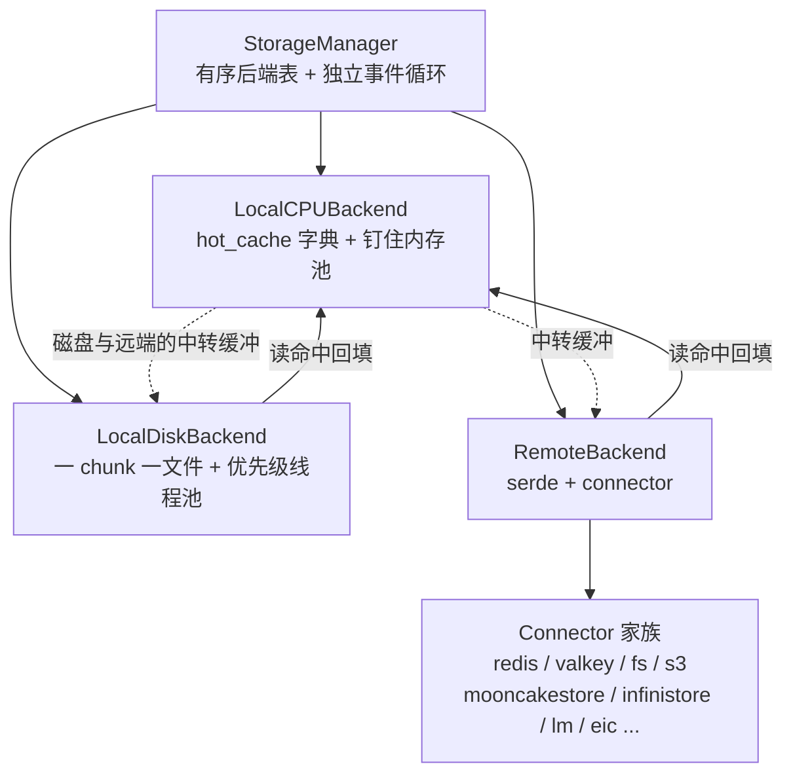
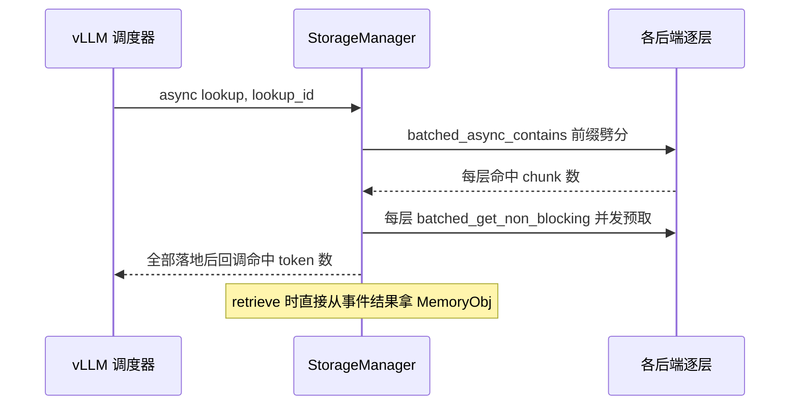

# 存储后端体系

一句话:`StorageManager` 带着一串**有序排列**的存储后端(CPU 热缓存 → 本地磁盘 → 远端存储……)做分层存储,像 CPU 的 L1/L2/L3——越靠前越快越小,查找按顺序做前缀匹配,读到深层数据会自动回填到 CPU 层。

## 一、层次结构总览

`StorageManager` 在 `lmcache/v1/storage_backend/storage_manager.py:216`,持有 `OrderedDict[str, StorageBackendInterface]`,并自建一个跑在独立线程上的 asyncio 事件循环(`storage_manager.py:231-238`)承载所有异步 IO。后端由工厂 `CreateStorageBackends`(`lmcache/v1/storage_backend/__init__.py:113`)按固定顺序装配,**插入顺序就是查找顺序**:

| 顺序 | 类名(文件) | 触发条件 | 角色 |
| --- | --- | --- | --- |
| 1 | `PDBackend`(`pd_backend.py:171`) | `enable_pd` | PD 分离的 KV 传输通道 |
| 2 | `LocalCPUBackend`(`local_cpu_backend.py:38`) | 默认开(`max_local_cpu_size` 默认 5 GB) | CPU 热缓存,**也是全局内存分配器** |
| 3 | `P2PBackend`(`p2p_backend.py:158`) | `enable_p2p` | 实例间点对点共享 |
| 4 | `NixlStorageBackend`(`nixl_storage_backend.py:487`) | `enable_nixl_storage` | NVIDIA NIXL 传输层对接 |
| 5 | `LocalDiskBackend`(`local_disk_backend.py:98`) | `local_disk` + `max_local_disk_size>0` | 本地磁盘 |
| 6 | `GdsBackend`(`gds_backend.py:178`) | `gds_path` | GPU Direct Storage,cuFile 直写文件系统 |
| 7 | `MaruBackend`(`maru_backend.py:31`) | `maru_path` | Maru 分布式存储(需外部包) |
| 8 | `RemoteBackend`(`remote_backend.py:26`) | `remote_url` 或 `remote_storage_plugins` | 远端 KV 存储,可多实例 |
| 9 | 动态插件 | `storage_plugins` | 用户自定义后端(module_path + class_name 反射加载) |

`audit_backend_enabled` 时非 CPU 后端还会被 `AuditBackend` 包一层做操作审计。注意两点:LocalCPUBackend **几乎总是被创建**——就算不当缓存用,其他后端也要靠它当中转缓冲(磁盘/远端读出的数据先落进它的钉住内存池);`allocator_backend` 的选择在 `storage_manager.py:312`(PD 场景用 PDBackend,否则 LocalCPUBackend)。

## 二、LocalCPUBackend:热缓存 + 全局分配器

数据结构极简:`hot_cache` 就是一个 `Key → MemoryObj` 的 OrderedDict(由淘汰策略提供,`local_cpu_backend.py:59`),放入即 `ref_count_up`,写入是**同步的**(`submit_put_task`,`:141`)——因为数据本来就在它的内存池里,"存"只是登记指针。

它同时是全局分配器:`allocate`(`:550`)失败时进入**淘汰-重试循环**——问淘汰策略要 `can_evict` 的候选(未 pin 且无人引用)→ 逐出 → 再试分配;逐不出东西且 `busy_loop=True` 就睡 0.1s 重试。busy_loop 的约定:store 失败允许放弃(丢缓存不丢正确性),retrieve 必须等到(`:564-575` 注释解释了并发 store 一起 busy loop 会死锁)。

一个精巧细节:lookup 命中时 Key 按 chunk 顺序 append 进 `keys_in_request`,`touch_cache`(`:128`)**倒序**逐个 `move_to_end`——最终前缀 chunk 排在 MRU 端、后缀排在 LRU 端,于是内存紧张时**先淘汰后缀**。这与 prefetch 的假设(前缀比后缀存活率高)首尾呼应。

## 三、LocalDiskBackend:一 chunk 一文件

- **布局**:内存里只留 `Key → DiskCacheMetadata`(路径/大小/shape/dtype/pin 计数);数据落盘为 `<key.to_string()>.pt` 一个文件(`local_disk_backend.py:186-190`),多路径可按 GPU 分片(`PathSharder`)。
- **写入**(`submit_put_task`,`:303`):先在锁内做容量核算,`current_cache_size + required > max_cache_size` 就循环问淘汰策略要候选、删文件腾地方;腾够后 `ref_count_up` 并把真正的写文件任务丢进 `LocalDiskWorker`——一个 4 线程的**优先级线程池**(`AsyncPQThreadPoolExecutor`),优先级 prefetch(0)> delete(1)> put(2):读路径永远插队,写盘慢了最多丢缓存。写完 `ref_count_down` 归还内存并登记元数据。
- **读取**:`get_blocking`(`:392`)与 `batched_get_non_blocking`(`:422`)都先向 LocalCPUBackend 的内存池要一块 staging MemoryObj,再把文件读进去;prefetch 路径用 `busy_loop=False` 防止在事件循环线程上自旋死锁。支持 O_DIRECT 绕过 page cache(`use_odirect`)。

## 四、RemoteBackend 与 connector 家族

`RemoteBackend`(`remote_backend.py:26`)= 序列化层 + 连接器:

- **serde**:`remote_serde` 默认 `"naive"`(裸 bytes 零拷贝视图),另有 CacheGen 压缩编码(`naive_serde/` 目录);
- **connector**:工厂 `CreateConnector`(`connector/__init__.py:378`)按 URL scheme 分发,实际存在的适配器(`connector/*_adapter.py`):redis 系(`redis://`、`rediss://`、`redis-sentinel://`、redis-cluster)、`valkey://`、`fs://`(共享文件系统)、`s3://`、`mooncakestore://`(Mooncake Store)、`infinistore://`、`lm://`(自带 lmcache server,`lmcache/v1/server/`)、`eic://`、SageMaker HyperPod、`external://`(外部自定义类)、`blackhole://`/`mock://`/`audit://`(测试与审计)。**没有 GDS connector**——GDS 是独立的 `GdsBackend`,不走 remote 这条链。
- **写入**(`submit_put_task`,`:222`):`ref_count_up` → 序列化 → 投递到事件循环异步 put → 完成回调清理 `put_tasks` 集合(该集合防同 Key 重复在途写)。连接器声明 `support_batched_put` 时走真批量(`batched_submit_put_task`,`:282`),否则逐个降级。断连后按 `min_reconnect_interval=10s` 节流重连,期间 put/get 直接跳过——远端只是加速层,挂了不影响正确性。

## 五、读写路径与层级间数据流

**写(fan-out 广播)**:`batched_put`(`storage_manager.py:384`)把同一批 MemoryObj 发给**所有**在册后端(或 `location` 指定的一个)。各后端 `batched_submit_put_task` 都是非阻塞投递,提交完 manager 统一 `ref_count_down`;写入期间对象活在 CPU 池里,由各后端自行 up/down。不同分配器体系的后端(如 GDS 要显存)会先 `allocate_and_copy_objects` 拷一份。去重由各后端自理:CPU 查 hot_cache,磁盘/远端查在途 `put_tasks`。

**读(逐层前缀 + 回填)**:`batched_get`(`:480`)按后端顺序问,第一个能给出数据的后端赢;若数据来自 CPU 之外的层,会**自动回填**(write-back)到 LocalCPUBackend(`:494-511`)——热数据向上爬,和 CPU cache 的行为一致。`contains/batched_contains`(`:883/:915`)同样逐层做**前缀劈分**:CPU 命中前 3 个 chunk、磁盘接着命中 2 个、远端再 2 个,返回总命中数与 `{后端: keys}` 的 block_mapping。

**prefetch(异步预取)**:`async_lookup_and_prefetch`(`:637`)是 `enable_async_loading` 的核心——lookup 的同时就把各层数据向 CPU 搬:

关键规则在 `prefetch_all_done_callback`(`:555`):逐层核对实际取到的 chunk 数,某层比 contains 时少了(中途被淘汰),**后续层全部作废并释放**——保证返回给调度器的命中长度是严格连续前缀,宁可少报不能虚报。

## 六、淘汰策略

策略与容器解耦在 `storage_backend/cache_policy/`:`get_cache_policy` 按名取 **LRU(默认,`config.py` 的 `cache_policy`)**/LFU/FIFO/MRU,CPU 和磁盘各持有一套独立实例。以 `LRUCachePolicy`(`cache_policy/lru.py:16`)为例:容器就是 OrderedDict,命中 `move_to_end`,淘汰时从队头扫、**跳过 `can_evict=False` 的**(被 pin 或有人正在读)。两层的触发时机不同:CPU 是"分配失败才淘汰"(池满即触发),磁盘是"写入前先腾够字节数"(显式容量核算)。此外还有整层开关:freeze 模式冻结写入并只查 CPU 层、hot_cache 可动态启停、健康检查失败的后端进 bypass 名单(`get_active_storage_backends`,`:1109`,统一过滤)。

## 七、设计取舍

- **有序线性探测 vs 统一索引**:没有全局"哪个 Key 在哪层"的索引,查找就是按层顺序问一遍。实现极简、层与层完全解耦,可热插拔(动态增删后端只改 OrderedDict);代价是深层 miss 要穿透所有浅层,且前缀劈分假设"越浅的层存的越是前缀"——靠 touch_cache 的后缀先淘汰来近似维持。
- **写全部后端 vs 逐级下沉**:store 一次写穿所有层(write-through fan-out),换取读路径简单和远端立即可共享;代价是写放大——磁盘和远端各写一份全量。
- **CPU 池当全局中转**:所有层的数据进出都借道 CPU 钉住内存(磁盘读、远端读、GPU 拷贝共享同一个池),零散分配归零;代价是 CPU 池成为吞吐瓶颈与死锁高发区(busy_loop 约定、prefetch 的 `busy_loop=False`、chunk budget 信号量都是为它打的补丁)。
- **淘汰策略插件化但无全局配额**:每层独立 LRU,简单可控;但层间没有联动(CPU 淘汰的东西不会主动降级写到磁盘,靠的是当初 write-through 已经写过)。

## 八、面试考点串联

1. LMCache 的存储层级怎么组织、查找顺序谁定 → 「一、层次结构」:OrderedDict 插入序 = 探测序;
2. 三层(CPU/磁盘/远端)的写入各是同步还是异步 → CPU 同步登记指针、磁盘优先级线程池异步写文件、远端事件循环异步 put;
3. 淘汰策略是什么、pin 住的怎么办 → 默认 LRU,`can_evict` 跳过 pin/在用对象;CPU 分配失败触发 vs 磁盘写前腾空间;
4. 为什么前缀 chunk 要比后缀活得久 → touch_cache 倒序 move_to_end + prefetch 的前缀连续性假设,两处互为因果;
5. 磁盘读为什么比写优先级高 → 读在请求关键路径上(决定 TTFT),写丢了只是少一份缓存;
6. 远端支持哪些系统、怎么扩展 → connector 家族清单 + `external://` 与 storage_plugins 反射加载;
7. 深层命中的数据之后会变快吗 → 会,batched_get 自动回填 CPU 层(write-back 变热);
8. prefetch 中途有 chunk 被淘汰怎么办 → 逐层核对,断点之后整体作废,保证连续前缀语义;
9. 远端挂了系统会怎样 → bypass + 节流重连,退化为本地两层,正确性不受影响(缓存永远只是加速)。
