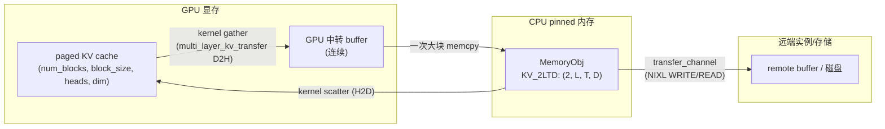

# GPU 连接器与传输通道

一句话:**gpu_connector 解决"最后一厘米"搬运**——vLLM/SGLang 的 paged KV 显存(按 block 打散)与 LMCache 的连续 MemoryObj 之间的双向拷贝;**transfer_channel 解决"跨机一公里"搬运**——两台机器的 LMCache buffer 之间的字节传输(NIXL/RDMA)。

类比:paged KV cache 像超市货架——同一个请求的商品(token)散落在各个格子(block)里;LMCache 的存储要求"整箱连续打包"。GPU 连接器就是拣货机器人:拿着一张格子清单(slot_mapping),一次性把所有层的 K/V 拣进整箱(CUDA kernel 做 gather/scatter);transfer channel 则是仓库之间的传送带,只认"箱子编号"(buffer 页索引),不关心箱子里装什么。

## 一、整体数据通路

store(D2H)方向为什么要过一道 GPU 中转 buffer:paged 布局下直接 D2H 是几千次小块散乱拷贝,PCIe 带宽吃不满;先用 kernel 在显存内 gather 成连续块,再一次大块拷到 CPU,快得多。`lmcache/v1/gpu_connector/utils.py:111` 的 `need_gpu_interm_buffer` 决定开关——PD 分离模式下关闭(数据直接落 NIXL 注册好的 buffer,不需要二次中转)。

## 二、连接器家族与选择逻辑

统一接口 `GPUConnectorInterface`(`lmcache/v1/gpu_connector/gpu_connectors.py:39`):`to_gpu`/`from_gpu`(单 chunk)+ `batched_to_gpu`/`batched_from_gpu`(批量或 layerwise 生成器)+ `get_shape`。工厂 `CreateGPUConnector`(`lmcache/v1/gpu_connector/__init__.py:14`)按 **引擎类型 × 是否 layerwise × 是否 blending × 平台** 四个维度选实现:

| 连接器 | 选中条件 | MemoryObj 格式 | 特点 |
| --- | --- | --- | --- |
| VLLMPagedMemGPUConnectorV2(:142) | vLLM + CUDA 默认 | KV_2LTD `[2,L,T,D]` | 一次 kernel 搬所有层 |
| VLLMPagedMemGPUConnectorV3(:417) | 配 `use_gpu_connector_v3` | 按 layer group 多张量 | 支持异构层分组(KVLayerGroupsManager),MLA |
| VLLMPagedMemLayerwiseGPUConnector(:1028) | `use_layerwise` | KV_T2D token 主序 | 逐层生成器,流水线 |
| VLLMBufferLayerwiseGPUConnector(:615) | layerwise + `enable_blending` | KV_2TD | 层驻留 buffer + fused RoPE,供 CacheBlend 读 |
| SGLangGPUConnector / SGLangLayerwise(:1400/:1607) | SGLang | KV_2LTD / KV_T2D | K、V 指针分离(每层两个指针) |
| xpu_connectors.py / hpu_connector.py | Intel XPU / HPU | — | 平台分支 |
| MockGPUConnector | 测试 | — | 无真实显存 |

关键数据结构:连接器持有 `kv_cache_pointers`——把每层 KV 张量的 `data_ptr()` 收进一个 int64 张量再拷上 GPU(:240 `_initialize_pointers`),kernel 里按层号取指针,避免 Python 循环逐层发 kernel。

## 三、拷贝算子:csrc 的 CUDA kernel

没有魔法零拷贝——本质是**自定义 gather/scatter kernel + 尽量大块的异步 memcpy**。绑定在 `csrc/pybind.cpp:33-95`,核心在 `csrc/mem_kernels.cu`:

- `multi_layer_kv_transfer`:grid 为 `(num_tokens, num_layers, 2)`(:554),每个 thread block 负责一个 (token, layer, K/V) 三元组;`slot_mapping[token] → block_idx = slot / block_size, offset = slot % block_size` 算出 paged 地址,与连续 buffer 互拷。方向由 `TransferDirection.H2D/D2H` 参数控制,同一 kernel 双向复用。
- 布局适配:`GPUKVFormat` 枚举覆盖 flash-attn NHD/HND、flashinfer、vLLM MLA、SGLang MLA 等(`csrc/mem_kernels.cu:32-44` 的 `is_mla`/`is_hnd`);Python 侧 `normalize_kv_and_discover_format`(`lmcache/v1/gpu_connector/utils.py`)自动探测格式,HND 的非连续视图先 permute 回物理连续(:139)。
- `single_layer_kv_transfer` / `single_layer_kv_transfer_sgl`:layerwise 模式的单层版本。
- `lmcache_memcpy_async`(`lmcache/v1/gpu_connector/gpu_ops.py:12`):对 LazyMemoryAllocator 分配的对象按 PIN_CHUNK_SIZE 分块 pin 后异步拷贝;普通对象退化为 `copy_(non_blocking=True)`。
- 流管理:每个连接器一对 `store_stream`/`load_stream`(:198),读写走独立 CUDA stream;`to_gpu` 里 `skip_prefix_n_tokens` 跳过 vLLM 已有 prefix cache 的部分,避免读写同一 block 的流竞争(:309-313)。

## 四、layerwise 流水线:边算边取

非 layerwise 模式必须等**所有层**的 KV 到齐才能开始 prefill;layerwise 把粒度切到单层,让"从 CPU 取第 i+1 层"与"GPU 计算第 i 层"重叠。实现是 Python 生成器的 ping-pong:

- 引擎侧:`lmcache/v1/cache_engine.py:902` `retrieve_layer` 生成器——先从 storage 异步取第 0 层,循环里 `mem_obj_consumer.send(mem_objs_layer)` 把每层对象喂给连接器,同时预取下一层(:996 `layerwise_batched_get` 返回逐层 future)。store 方向对称(:568 `store_layer`)。
- 连接器侧:`VLLMPagedMemLayerwiseGPUConnector.batched_to_gpu`(:1150)共 `num_layers + 2` 次 yield:每轮把收到的第 i 层 MemoryObj 拷进 GPU buffer 再 scatter 进 paged 内存,`load_stream` 与主计算流用 `wait_stream` 衔接。
- blending 版本(:749)是**三级流水线**:同一轮内(1)load 第 i 层 CPU→GPU、(2)对第 i-1 层做 fused RoPE 位置修复、(3)把第 i-2 层写回 paged 内存,双 buffer ping-pong(:846-850),`buffer_mapping` 暴露 `get_kv(layer_id)` 给 CacheBlend 读(:726)。

## 五、transfer_channel:跨机字节通道

抽象 `BaseTransferChannel`(`lmcache/v1/transfer_channel/abstract.py:21`)定义两组语义:`batched_send/recv` 必须两边配对调用;`batched_read/write` 是**单边**操作(RDMA 风格,对端不参与)。工厂 `CreateTransferChannel`(`lmcache/v1/transfer_channel/__init__.py:10`)目前**只支持两种**(:41 有显式 assert):

- **NixlChannel**(`lmcache/v1/transfer_channel/nixl_channel.py:66`):生产实现。启动时把整块预分配 buffer 注册进 NIXL agent,按 `align_bytes` 切成页生成传输描述符表(:661-673);连接建立是**两阶段 ZMQ 握手**——先交换 agent 元数据、再交换内存描述符,注释明确说一步到位会让 NIXL 卡在 PROC 状态(:310-316);数据面 `make_prepped_xfer("WRITE"/"READ") → transfer → 轮询 DONE/PROC/ERR`(:419 起)。底层后端由 `nixl_backends` 配置,默认 `["UCX"]`,即走 RDMA/共享内存等 UCX 支持的介质。
- **MockMemoryChannel**(`mock_memory_channel.py:23`):测试用,进程内存模拟。

大纲里问的 GDS 与 TCP,以代码实况为准:**GDS 不是 transfer channel**,它是存储后端 `lmcache/v1/storage_backend/gds_backend.py`(GPU 直读文件);**TCP 数据面还没有**——`py_socket_channel.py:1-6` 的 TODO 写明 PySocketChannel 目前只有 ZMQ 控制面骨架,数据面留给子类(MockMemoryChannel 就是继承它实现的)。使用方只有两个:PD 分离的 `pd_backend.py:251` 与 P2P 共享的 `p2p_backend.py:225`,由配置 `transfer_channel` 字段选择。

## 六、设计取舍

- **kernel gather vs 逐层 memcpy**:一次 kernel 搬全部层,launch 开销 O(1);代价是 kernel 必须理解每种引擎的 paged 布局,于是有 GPUKVFormat 枚举和 layout 探测这层复杂度。
- **GPU 中转 buffer 换带宽**:多花一块 `chunk_size` 大小的显存 + 一次显存内拷贝,换 PCIe 大块连续传输;PD 模式下省掉(buffer 即 NIXL 注册区)。
- **生成器做流水线**:用 Python generator 的 send/yield 表达逐层依赖,代码直观;代价是控制流分散在引擎与连接器两处,`num_layers + 2` 的 yield 次数约定脆弱(注释里反复强调)。
- **单边 RDMA 语义**:read/write 只需一端发起,对端零 CPU 参与,适合"我知道你 buffer 页号"的场景;代价是必须先做重量级握手注册内存,连接是有状态的。

## 七、面试考点串联

1. paged KV 怎么高效搬出显存 →「kernel gather + slot_mapping 寻址 + GPU 中转 buffer」
2. 为什么 D2H 前要先在显存里聚合 → PCIe 对大块连续传输友好,散拷吃不满带宽
3. layerwise 加载怎么和计算重叠 →「生成器 ping-pong + 独立 CUDA stream」
4. CPU offload 的 KV 回填会拖慢 TTFT 吗 → layerwise 把等待摊进逐层计算,首层到达即可开算
5. NIXL 是什么、为什么不用裸 TCP →「单边 RDMA 语义 + 内存预注册;TCP 数据面在本仓库尚未实现」
6. 一套代码怎么同时支持 vLLM/SGLang/MLA →「GPUKVFormat 枚举 + 指针数组 + 格式探测」
