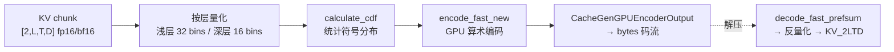
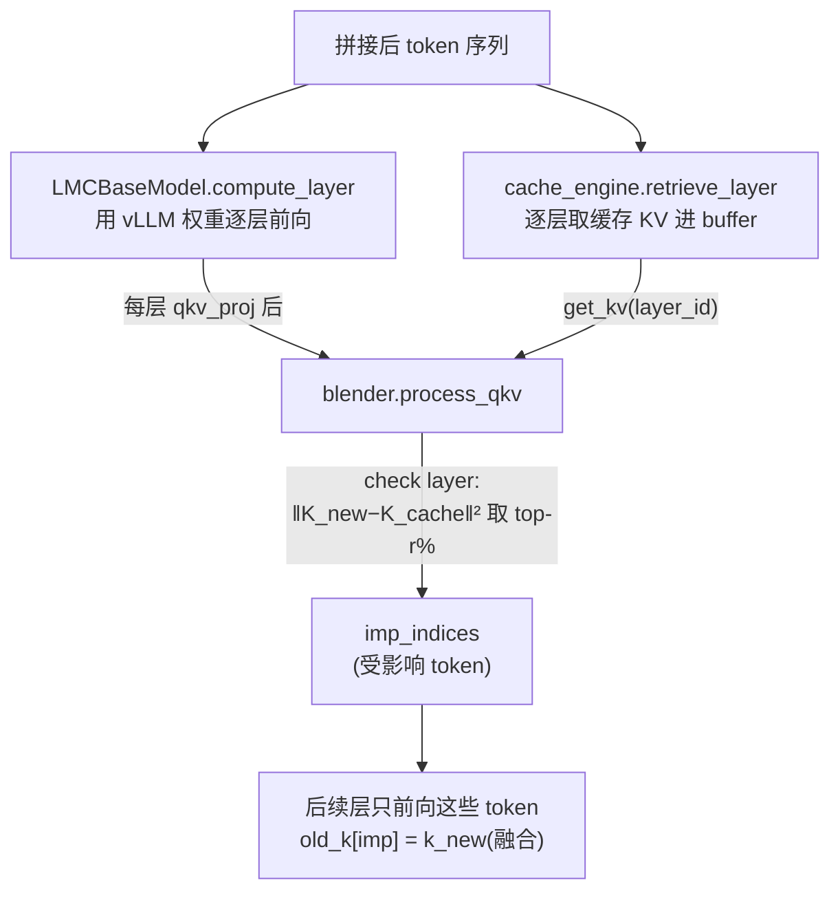

# 压缩与 CacheBlend

一句话:这一页讲两个"让缓存更值钱"的组件——**serde 压缩**决定 KV 离开本机时的形态(原样字节流,还是 CacheGen 风格的有损压缩码流,换存储与网络带宽);**CacheBlend** 让非前缀位置的缓存段也能复用(RAG 拼文档场景),代价是选择性重算一小撮 token。

## 一、serde:KV 的序列化与压缩

接口在 `lmcache/v1/storage_backend/naive_serde/serde.py`:`Serializer.serialize(MemoryObj) → MemoryObj` 与对称的 `Deserializer`。工厂 `CreateSerde`(`naive_serde/__init__.py:21`)注册了三种,实现完成度差异很大,如实列出:

| serde | 状态 | 行为 |
| --- | --- | --- |
| naive | 完整 | 直通:引用计数 +1 原样返回(`naive_serde.py:12`),即"不压缩" |
| kivi | **空壳** | serialize/deserialize 均为 `TODO` 直通(`kivi_serde.py:11-22`),KIVI 量化未实现 |
| cachegen | 可用 | 有损压缩:量化 + 算术编码,产出字节流 |

### CacheGen 在 v1 的真实位置

CacheGen(论文思想:把 KV 张量当"图像"做量化 + 熵编码)在 v1 中是个**薄封装**:`lmcache/v1/storage_backend/naive_serde/cachegen_encoder.py:18` 的 `CacheGenSerializer` 只做布局变换(KV_2LTD → `[L, 2, T, H, D]`),真正的编码函数 `encode_function` 复用自 **v0 遗留模块** `lmcache/storage_backend/serde/cachegen_encoder.py`,底层 CUDA kernel 在 `csrc/ac_enc.cu`、`csrc/ac_dec.cu`、`csrc/cal_cdf.cu`(pybind 导出 `encode_fast_new`/`decode_fast_prefsum`/`calculate_cdf`,`csrc/pybind.cpp:54-57`)。

两个值得记的细节:

- **量化精度按层深分配**:`CacheGenConfig.from_model_name`(`cachegen_basics.py:27`)给浅层更多 bins(K 前 10 层 32 bins、之后 16;V 只有前 2 层 32)——浅层 KV 对误差更敏感,这是 CacheGen 论文的经验结论直接写死成配置;未知模型 fallback 到按 `num_hidden_layers` 套同款模板。
- **解码输出是"游离" MemoryObj**:`cachegen_decoder.py:122-133` 直接包一个新 GPU 张量、`ref_count=-1` 防误释放,不走统一分配器——压缩路径和主内存池是解耦的。

### 挂载点:谁会真正调用压缩

- **远端后端**:`remote_backend.py:68-71` 按配置 `remote_serde` 创建 serde,KV 发往远端存储前过一道 serialize;默认值是 `"naive"`(`lmcache/v1/config.py:88`),即**默认不压缩**。
- **控制面触发的冷数据压缩**:`lmcache/v1/cache_engine.py:1333/1391` 的 `compress()`/`decompress()`——lookup 并 pin 住目标 chunk → 逐个 serialize → 原地 remove + put 回同一 location。方法白名单目前只有 `["cachegen"]`,由集群控制器的 CompressMsg/DecompressMsg 远程下发(见第 6 节),用于"这批 KV 暂时不用了,压一压省 CPU 内存"。
- 本地 CPU offload 的**热路径不压缩**:热路径要的是微秒级 memcpy,压缩的收益场景是跨节点带宽和长期存储。

## 二、CacheBlend:非前缀复用

动机:prefix caching 只认"完全相同的前缀"。RAG 场景下 prompt = 查询 + 文档 A + 文档 B,换个问题变成 文档 B + 文档 A,每段文档的 KV 都算过,但因为位置变了、前缀哈希对不上,全部白算。CacheBlend 的做法:**每段独立缓存,拼接时修位置、重算少量"受影响最深"的 token**。

类比:一摞乐高模块换了拼装顺序——不用全拆重搭,只需把接缝处最受力的几块重新咬合。

### 实现三件套(以代码为准)

**1. 分段哈希**:`enable_blending` 时 token database 换成 `SegmentTokenDatabase`(`lmcache/v1/cache_engine.py:1954`,实现在 `lmcache/v1/token_database.py:423`)——按配置的分隔串 `blend_special_str`(默认 `" # # "`)把 prompt 切段,每段**独立**做 chunk 哈希,段与段互不影响,这就是"非前缀也能命中"的根基。同时强制 `save_unfull_chunk=True`(`config.py:565-571`),段尾的不满 chunk 也要存。

**2. 位置修复(RoPE 重旋转)**:缓存里的 K 带着旧位置的旋转。存储时把旧位置记进 metadata(`gpu_connectors.py:1013-1014` `cached_positions`);载入时 `VLLMBufferLayerwiseGPUConnector` 在层间流水线里调 `fused_rotary_emb(old_positions, new_positions, k)`(:855-859),kernel 是 `rotary_embedding_k_fused`(`csrc/pos_kernels.cu`)——一次 kernel 从旧角度直接旋到新角度,不用先转回零位。`lmcache/v1/compute/positional_encoding.py:145` 的 `get_fused_rope` 初始化时会拿随机张量做**自校验**(正转→反转误差 < 0.1,:109),失败或遇到 rope scaling / partial rotary 直接禁用 blending——宁可退化也不算错。

**3. 选择性重算 + 融合**:核心在 `lmcache/v1/compute/blend/blender.py`。

- `process_qkv`(:59)在 `blend_check_layers` 指定的层(通常第 1 层)算新旧 K 的逐 token L2 差,取 `blend_recompute_ratios[0]` 比例(论文经验 ~15%)差异最大的 token 作为 `imp_indices`(:88-113);此后 q/residual/attn_output 全部裁剪到这个子集,**后续所有层只为这 15% 的 token 做前向**,其余 85% 直接用缓存 KV。融合就一行:`old_k[imp_indices] = k`(:116-117)。
- `LMCBaseModel.compute_layer`(`lmcache/v1/compute/models/base.py:66`,`@torch.compile`)手动展开 vLLM 模型的每层:input_layernorm → qkv_proj → `blender.process_qkv` → LMC 自己的 attention(`compute/attention/flash_attn.py` 连续布局版,或 `flash_infer_sparse.py` 稀疏版)→ o_proj → mlp,每层 `yield` 一次,与 `retrieve_layer` 在 `blend_layer`(blender.py:124)里交替驱动——**取第 i+1 层缓存与算第 i 层重叠**,复用第 4 节的层间流水线。

### 现状边界(如实)

- 模型白名单:仅 Llama / Qwen2 / Qwen3(`compute/models/utils.py:14`,其余 `NotImplementedError`);TP、PP、多模态在 `models/base.py:13` 标注"待测试/支持"。
- `blend_thresholds`(按阈值而非固定比例选 token)只有配置项,blender.py:43 注明 TODO 未实现;`recomp_ratios` 只用第一个元素(:96-97 硬编码 `[0]`)。
- 触发门槛 `blend_min_tokens`(默认 256):太短的段重算收益覆盖不了流水线开销。

## 三、设计取舍

- **压缩放在 serde 层而非分配器层**:压缩是"按需的形态转换"而不是常态——热路径零开销,冷路径/远端才付 CPU/GPU 编解码成本;代价是压缩后的对象脱离统一内存池管理。
- **CacheBlend 用"一层的 diff"当全网代理**:只在 check layer 算一次差异就决定所有层的重算集合,省掉逐层判断;赌的是"位置扰动大的 token 在各层都大",这是论文验证过的统计规律,不是保证。
- **有损换空间**:CacheGen 与 blend 都是有损优化(量化误差 / 85% token 用旧注意力),LMCache 把"开不开"完全交给配置,默认路径全部无损。

## 四、面试考点串联

1. KV cache 怎么压缩、压缩比与精度怎么平衡 →「CacheGen:按层深分配量化 bins + 算术编码」
2. 为什么浅层量化要更细 → 浅层误差会被后续所有层放大,对输出质量影响最大
3. prefix caching 的局限是什么 →「只认相同前缀;CacheBlend 用分段哈希绕开」
4. 换了位置的 KV 为什么不能直接用、怎么修 →「K 带 RoPE 旋转;fused kernel 旧位置→新位置一步转」
5. CacheBlend 重算哪些 token、比例多少 →「check layer 的 K-diff top ~15%,后续层只前向该子集」
6. 这类近似复用什么时候会翻车 → 跨段强依赖(答案藏在两段交界)时 diff 代理失效,输出质量下降
