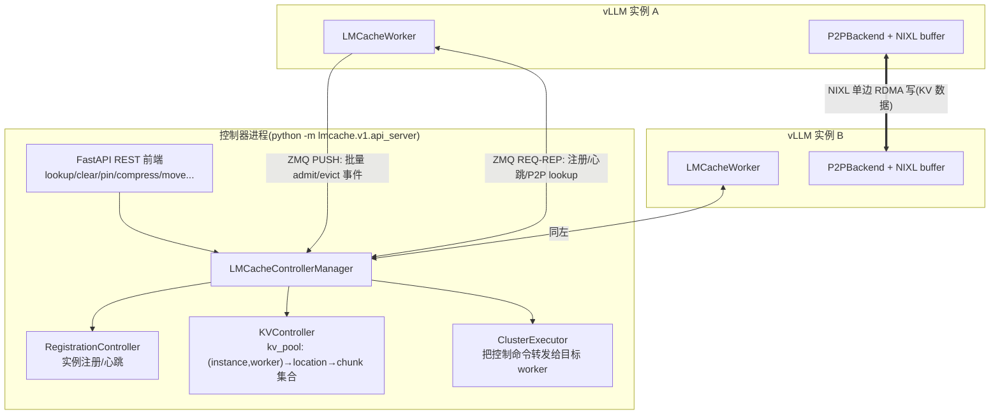

# 控制面与跨实例共享

一句话:`cache_controller` 是集群的"图书馆总目录"——只记"哪个实例有哪些 KV chunk",不碰数据本身;查到之后,实例之间通过 P2P 后端用 NIXL **馆际直送**,数据面完全不经过控制器。

## 一、集群架构总览

## 二、消息协议与三个微控制器

整套控制面是 **msgspec tagged-union over ZMQ**(带类型标签的 msgpack,零手写解析)。`lmcache/v1/cache_controller/message.py:25-30` 把消息按方向分四类:`WorkerMsg`(worker→controller,PUSH-PULL 单向不等回)、`WorkerReqMsg`(worker→controller,REQ-REP 要回执)、控制命令(controller→worker)、`OrchMsg`(REST 编排请求→controller)。`LMCacheControllerManager`(`controller_manager.py:65`)按类分发到:

- **RegistrationController**(`controllers/registration_controller.py:37`):实例注册(RegisterMsg 携带 instance_id / worker_id / ip / port / `peer_init_url`,message.py:51)、心跳与超时踢除。
- **KVController**(`controllers/kv_controller.py:55`):集群级元数据的核心。kv_pool 结构是 `(instance_id, worker_id) → {location → set[chunk_hash]}`;worker 每次 store/evict 通过 `BatchedKVOperationMsg` 批量上报(message.py:138,公共字段提到 batch 级、单条只剩 op/key/seq,省网络);`lookup`(:388)对 token 序列逐 chunk 找最长前缀命中,`batched_p2p_lookup`(:403)返回 `(instance_id, location, 命中 chunk 数, peer_init_url)` 四元组——这是 P2P 借数据的关键一跳。文件头注释(:46-52)坦白了取舍:正向索引 lookup 是 O(实例数),实例多了会退化,反向索引是文档里提的改进方向。
- **LMCacheClusterExecutor**(`executor.py:48`):把 REST 下发的 clear/pin/compress/decompress/move 翻译成对目标 worker 的控制命令(第 5 节的 `compress()` 就是这条链触发的)。

### 最终一致性:增量事件 + Full Sync 兜底

增量 admit/evict 走 PUSH 单向通道,丢了就丢了(seq_num 不连续会被计数进 Prometheus 指标)。兜底机制是 **full sync**:worker 侧 `FullSyncSender`(`full_sync_sender.py:49`)把本地全量 key 清单分批重报;controller 侧流程(kv_controller.py:176-378)是 Start(REQ-REP 确认、清空旧记录、标记 SYNCING)→ Batch(PUSH 分批灌 key,期间**丢弃增量事件**)→ End(校验总数)→ Status(查询缺失批次触发重传)。同步期间引擎可进入 freeze 模式(`cache_engine.py:310`),暂停新 store 保证清单稳定。这是典型的"事件流 + 周期快照"一致性方案。

## 三、P2P 共享路径走读

实例 A 收到请求、本地 miss,从实例 B 借 KV 的完整链路(`lmcache/v1/storage_backend/p2p_backend.py`):

1. **问总目录**:`batched_async_contains`(:284)把 chunk 哈希列表打包成 `BatchedP2PLookupMsg` 发给 controller,拿回 B 的 `peer_init_url` 和连续命中数(目前只支持单个 peer 命中,:315 注释)。
2. **建通道(懒)**:`_ensure_peer_connection` 对 B 做 NIXL 两阶段握手 + 内存注册(第 4 节),顺带用 side message 交换 B 的 `peer_lookup_url`(数据请求专用 ZMQ 地址)。
3. **要数据**:`batched_get_non_blocking`(:550)——A **先在本地 CPU pool 预分配**好 MemoryObj,把这些 buffer 的页索引(`mem_indexes`)连同 key 列表塞进 `BatchedLookupAndGetMsg` 发给 B。
4. **单边直写**:B 的 `_handle_batched_lookup_and_get`(:384)从本地 CPU 后端取出并 pin 住命中 chunk,调 `transfer_channel.async_batched_write`(:424)把数据 RDMA 写进 **A 预分配的 buffer 页**,回执只有一个数字 `num_hit_chunks`。
5. 反方向还有 `BatchedLookupAndPutMsg`(:78):A 主动把 KV 推给 B,B 端用 `async_batched_read` 拉取(:478),用于 PD/迁移类场景。

设计要点:**控制面(ZMQ 小消息)与数据面(NIXL 大块)彻底分离**;"接收方分配、发送方单边写"意味着传输期间 B 不需要 A 的任何回调,一次 RTT 完成。

## 四、distributed/:MP 模式的新一代多层存储

`lmcache/v1/distributed/` 不是"多机分布式训练"的意思,而是配合 `lmcache/v1/multiprocess/`(MP 模式,LMCache 独立进程化)重写的**多层存储管理器**(`storage_manager.py:49`):L1Manager 管本地 CPU/GPU 层;L2 通过统一的 `L2AdapterInterface` 接一排外部存储——`l2_adapters/` 下有 fs、S3、Mooncake store、NIXL store、Redis(resp)、插件式 adapter 等 15 个文件;`storage_controllers/` 拆出 store / prefetch / eviction 三个策略控制器。键结构 `ObjectKey`(`distributed/api.py`)带 chunk_hash + model_name,天然支持多模型共池。可以把它理解为:老 `storage_backend/` 体系(进程内、每 worker 一套)的架构升级版,与本页控制器体系并行演进。

## 五、四个服务进程/线程的角色

| 组件 | 代码路径 | 角色 |
| --- | --- | --- |
| api_server | `lmcache/v1/api_server/__main__.py:93` | **独立进程**,控制器的壳:FastAPI 把 REST 请求转成 OrchMsg 交给 ControllerManager,还挂了 `cache_controller/frontend/static` 的网页面板 |
| internal_api_server | `lmcache/v1/internal_api_server/api_server.py:27-31` | **每个 vLLM 进程内**的调试/管理 FastAPI,注册 common/vllm/controller 三组 API;端口 = 起始端口 + 1 + worker_id(scheduler 占 0) |
| offload_server | `lmcache/v1/offload_server/zmq_server.py:22` | 进程内 ZMQ REP 小 RPC:接收 `OffloadMsg(hashes, slot_mapping, offsets)` 调引擎做 offload,由 `manager.py:97` 按集成方需要创建(如 SGLang 集成) |
| LMCacheWorker | `lmcache/v1/cache_controller/worker.py:64` | 每实例常驻协程:注册、心跳、上报 KV 事件、代收控制命令并回调引擎 |

## 六、可观测性(一句带过)

`lmcache/v1/mp_observability/` 是 MP 模式的事件总线:业务代码 `event_bus.publish(Event)`,订阅者分别翻译成 OTel 指标 / 日志 / trace span(README 里有架构图);`lmcache/v1/health_monitor/` 是周期巡检框架(`base.py:35` HealthCheck ABC + checks/ 下的具体检查 + fallback 策略),引擎在每次 store/retrieve 前查 `is_healthy()`(`cache_engine.py:240`),不健康直接跳过操作而不是抛错——缓存挂了退化成"没有缓存",绝不拖垮推理主链路。

## 七、设计取舍

- **中心目录 + 数据面直传**:controller 单点只承载小消息,容量瓶颈在元数据不在带宽;代价是 lookup 多一跳 RTT,且 controller 挂掉时 P2P 失效(本地缓存仍可用,退化不致命)。
- **最终一致而非强一致**:PUSH 事件可能丢、可能乱序,靠 seq 监控 + full sync 收敛;换来的是 store 热路径上报零阻塞。强一致(每次 store 等 controller ack)对 KV 缓存这种"错了大不了 miss"的场景是过度设计。
- **接收方预分配**:P2P get 由请求方先占好内存再把页号给对方,单边写一步到位;代价是握手注册重、buffer 是固定大小的页(对齐 `align_bytes`),灵活性让位给零拷贝路径。
- 同类对比:Mooncake 走"全局 KVCache 池 + 中心调度"的池化路线,LMCache 这套是"各实例自治 + 目录撮合"的联邦路线;后者部署轻,前者全局利用率上限更高。

## 八、面试考点串联

1. 多实例怎么共享 KV cache →「controller 目录撮合 + NIXL 单边直写」五步走读
2. 元数据服务怎么保证和实际缓存一致 →「增量事件 + seq 监控 + full sync + freeze」
3. 控制面数据面为什么分离 → 小消息与大块传输的带宽/延迟画像完全不同
4. P2P 传输为什么接收方先分配内存 → RDMA 单边写需要预知远端地址,换一次 RTT 完成
5. 缓存系统怎么做到"挂了不拖垮推理" →「health_monitor + is_healthy 短路,退化为无缓存」
6. LMCache 与 Mooncake 的集群化思路差异 →「联邦目录 vs 池化调度」
