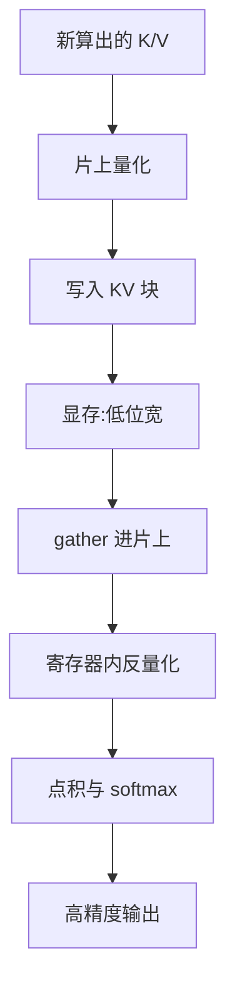

## 题目

KV cache 量化之后,attention 的计算流程是怎样的?算子要做哪些改动?

## 要点

- 一句话钉死:反量化绝不能是一个独立 kernel
- 量化的全部收益在 "HBM → 片上" 这一段,反量化必须发生在过了这道门之后
- 写侧:量化要和"把新 token 的 K/V 写进块"融进同一个 kernel
- 读侧:gather 进来还是低位宽,在寄存器/shared 里展开;一次宽事务装的元素数翻倍
- 块池布局:同样的 block_size 对应的物理块小一半,可分配块数翻倍

## 答案

### 先钉死一件事

**反量化绝不能是一个独立 kernel。** 若先起一个 kernel 把低位宽 KV 从显存读出、反量化成 bf16 再写回显存,再让 attention 去读,每个元素的 HBM 流量就从 2 字节变成 1(读)+ 2(写)+ 2(读)= **5 字节,比不量化还差**。

量化的全部收益就在 "HBM → 片上" 这一段,所以**反量化必须发生在数据已经过了这道门之后**,也就是在 shared memory 或寄存器里;写侧同理,量化必须和"把新 token 的 K/V 写进块"融进同一个 kernel。

### 三处具体改动

在分页 gather 与 online softmax 之上,改动集中在三处:

| 位置 | 原本做什么 | 量化后多做什么 |
|---|---|---|
| **写侧 kernel** | RoPE + 按 slot 散写 | 定 scale + 量化(动态时规约也在这里融掉) |
| **读侧 kernel** | gather 低位宽数据进片上 | 一次 128-bit 宽事务原本装 8 个 fp16、现在装 **16 个 fp8**,进寄存器再展开反量化 |
| **块池布局** | 按 `block_size` 分配 | 同样的 `block_size`(按 token 计)对应的物理块小一半,可分配块数翻倍 |

第二行那句就是"带宽减半"在 kernel 里的具体形态——不是抽象的省了一半,而是同一条访存指令搬回来的有效元素数翻倍。

另外两条纪律:**softmax 必须在 fp32 里做**;**动态 scale 时那份元数据也要一起 gather**,而它是按块表散点访问的,decode 本来就被访存卡死,这一次不合并的访存不是零成本——这也是静态量化在工程上更受欢迎的原因之一。

## 知识点

反量化的位置决定收益是否成立、HBM 流量账、写侧与读侧的融合、宽事务装载元素数翻倍、块池物理大小减半、scale 的散点访存代价。

## 追问

- 能不能直接开 int8/fp8 MMA 算 $QK^\top$ 和 $PV$?省的是算力还是访存?
- 动态 scale 那份元数据存在哪?塞块尾还是另开 scale 池,各有什么代价?
- 分页的块表本身要不要跟着改?前缀共享时 scale 怎么办?

## Note
