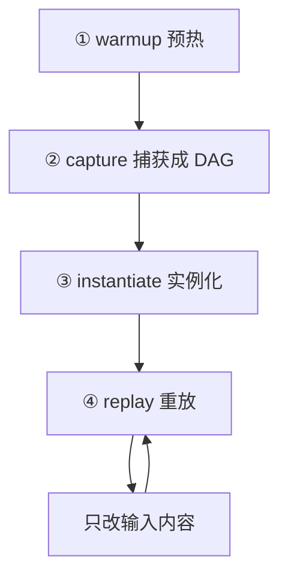

## 题目

cudagraph 的原理是什么,具体是怎么做的?捕获出来的到底是个什么东西?

## 要点

- 四步:warmup → capture → instantiate → replay
- capture 记的是一张 DAG,节点是 kernel/memcpy/memset,边是依赖
- 「所有参数按值记录」:grid/block 尺寸、指针的具体地址、标量的当下数值
- instantiate 提前把下发描述与依赖解析好,省的就是重放时不用再组装
- 最典型的静默 bug:换指针而不是原地写回

## 答案



**capture**:进入捕获模式后,下发到这条流上的操作**不再真正执行**,而是被记录成一张有向无环图——节点是 kernel / memcpy / memset,边是依赖(同流的先后顺序即依赖链,跨流依赖靠 event 表达)。关键性质是**一切按值记录**:grid/block 尺寸、每个指针参数的**具体地址**、每个标量参数的**当前数值**,全被冻进图里。

**instantiate**:把 DAG 编译成可执行图,提前准备好每个节点的下发描述、解析好依赖。省时间就省在这——重放时驱动不必再逐个组装。

**replay**:一次 `cudaGraphLaunch` 把整张图交给 GPU,CPU 从此不参与逐个下发。

```python
# ① warmup:侧流上 eager 跑几步,把一次性初始化全部触发掉
s = torch.cuda.Stream()
s.wait_stream(torch.cuda.current_stream())
with torch.cuda.stream(s):
    for _ in range(3):
        out = model(static_input)

# ② capture:static_input 的地址从此被冻结
g = torch.cuda.CUDAGraph()
with torch.cuda.graph(g):
    static_out = model(static_input)

# ③ replay:每步只做「原地改内容 + 重放」
static_input.copy_(new_input)   # 必须写回同一块地址
g.replay()                      # 结果永远落在同一块 static_out 里
```

最容易犯的错在倒数第二行:写成 `static_input = new_input` 就是换了指针,图里录的还是老地址——**不报错,但每步都在算同一批陈旧数据**。这是 CUDA Graph 最典型的静默 bug。

## 知识点

流捕获(stream capture)、DAG 节点与依赖边、按值冻结、可执行图实例化、原地写回 vs 换指针。

## 追问

- capture 时怎么复用 HBM?多张图能共用一块显存吗?
- 捕获前为什么必须 warmup?不做会怎样?
- 拓扑不变但参数要改,有没有不重新实例化的办法?

## Note
