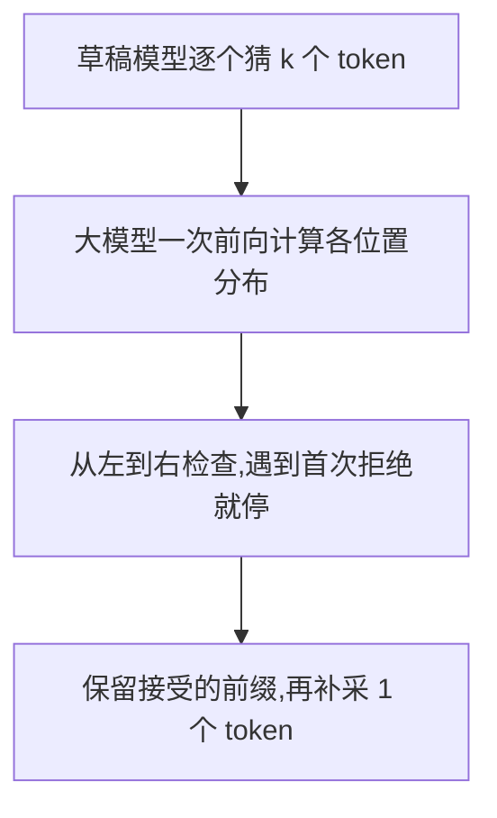

## 题目

解释下推测性解码的原理?

## 要点

- 小模型先猜,大模型批量验证,减少大模型逐个生成的轮数
- 按顺序接受草稿;首次拒绝后舍弃余下草稿并补采,全接受则多采一个
- 接受概率与拒绝后的补采配合,经典算法保持目标模型的输出分布
- 能否加速还取决于草稿的开销与接受率,验证也需要时间

## 答案

**投机解码让便宜的小模型先打草稿,大模型一次检查多个候选 token,减少大模型逐个生成的轮数。** 下面讲经典的「草稿模型 + 接受/拒绝采样」算法。

### 为什么可能更快

小批量、访存受限时,大模型花不少时间读权重,算力还没用满。草稿提供了候选序列,大模型就能一次前向计算多个位置的条件概率,把读权重的成本分摊给更多 token。

### 一轮怎么生成

拒绝后,余下草稿全部作废,从修正分布补采;如果全接受,则从大模型的下一位置分布多采一个。不考虑提前结束,一轮输出 **1 到 $k+1$ 个 token**。

### 怎样保持输出分布

在同一前缀下,记大模型给 token $x$ 的采样概率为 $p(x)$,草稿模型为 $q(x)$。草稿采出 $x$ 后:

$$
P(\text{接受 }x)=\min\left(1,\frac{p(x)}{q(x)}\right)
$$

例如,假设草稿给某词 0.4、大模型只给 0.2,就只接受一半,避免这个词出现过多。拒绝时从残差分布补采:

$$
p'(x)\propto\max\bigl(0,p(x)-q(x)\bigr)
$$

也就是把草稿少给的概率补回来:负差归零,再归一化为总和 1。接受与补采两条路径合起来,最终分布仍是 $p$;**分布相同不要求两次随机生成的句子逐字相同**。

草稿和验证都有开销。接受率低、草稿太慢时可能反而变慢,不能把「一轮产出更多」直接当成加速。

## 知识点

草稿模型(draft)、目标模型(target)、批量验证、接受/拒绝采样、残差分布。

参考:[经典算法论文 §2、§3 与附录 A.1](https://proceedings.mlr.press/v202/leviathan23a/leviathan23a.pdf)。

## 追问

- 原题追问:draft 模型的什么指标能反映加速效果?见 [加速比指标](081-投机解码-加速比指标.md)。
- 自拟:拒绝之后,为什么不能直接从大模型原来的分布重新采样?
- 自拟:如果改成每次都选概率最大的 token,接受条件会变成什么?

## Note
