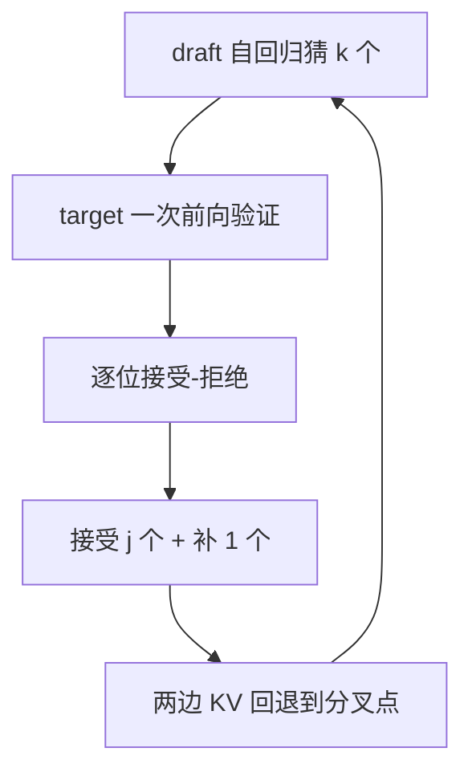

## 题目

解释下推测性解码的原理?

## 要点

- 起点是 decode 访存受限:一次算 1 个和一次算 k 个几乎同价
- 流程:draft 自回归猜 k 个 → target 一次前向验证 → 逐位接受/拒绝 → 两边 KV 回退
- 保底产出 1 个 token,全中则是 $k+1$ 个
- 无损保证:接受概率 $\min(1, p/q)$ + 拒绝后从残差分布采
- 它不是近似方法,和量化/剪枝有本质区别

## 答案

### 为什么「顺手多算几个」几乎不要钱

decode 每生成 1 个 token 都要把整个模型权重从显存读一遍。以 7B fp16 在 A100 上为例:搬权重 14 GB ÷ 约 2 TB/s ≈ **7 ms**,而算 1 个 token 约 14 GFLOPs ÷ 312 TFLOPS ≈ **0.045 ms**,差 150 倍——GPU 99% 的时间在等数据。

把输入从 1 个 token 变成 8 个:权重还是只搬那一遍,计算变成 0.36 ms,总耗时 7.045 → 7.36 ms,**只贵约 4% 却把 8 个位置全算完了**。问题是 decode 自回归,后面 7 个是什么并不知道——**所以先猜**,猜错了作废重来,反正验证本身免费。

「补 1 个」是关键:哪怕 draft 一个都没猜中,target 的验证前向本身也会在第一个位置给出预测,**这一轮保底产出 1 个 token**;全中则是 $k+1$ 个,多出来那个是白送的。

### 为什么输出分布不变

设该位置 target 分布 $p(x)$、draft 分布 $q(x)$,draft 采出 $x$:

$$
\text{以概率}\ \min\left(1,\ \frac{p(x)}{q(x)}\right)\ \text{接受}\ x
$$

人话:draft 高估了就按比例打折,没高估就照单全收。拒绝后不能随便重采,必须从**残差分布** $p'(x) \propto \max(0,\ p(x)-q(x))$ 里采——两条路径加起来正好还原成 $p(x)$。所以投机解码是**严格无损**的,这是它和量化、剪枝的本质区别。

## 知识点

访存受限与免费算力、draft/target 分工、保底产出、推测采样(接受-拒绝 + 残差分布)、无损性。

## 追问

- 拒绝之后为什么不能随便重采一个?
- greedy(温度 0)时这套规则退化成什么?
- 哪些变体不是严格无损的?

## Note
