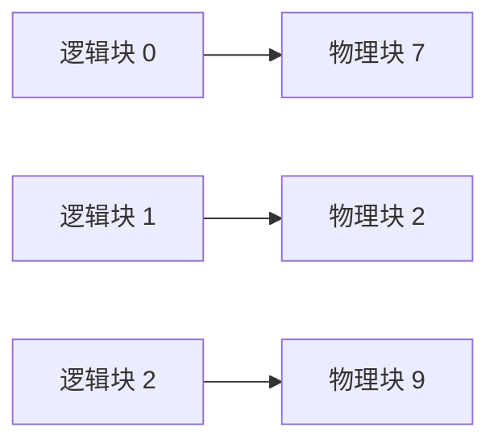

## 题目

在视觉语言模型（VLM）的推理框架中，如何设计并实现Page Attention的固定分块策略？请详细说明其工作机制、内存管理优势、对推理效率的影响，并结合实际场景分析该策略在现代大模型推理系统中的应用价值。

## 要点

- 标准名称是 PagedAttention，存储块与 FlashAttention 的计算 tile 不是一回事
- KV cache 被切成固定 token 数的物理块，逻辑块表负责地址映射
- 按需分配让变长请求不必按最大长度预留连续显存
- 连续批处理每步分配、释放块；共享前缀时可用引用计数与写时复制
- VLM 的图像和文本 token 数量不同，但进入同一自回归序列后可按统一位置分页

## 答案

**题面里的 “Page Attention” 通常指 PagedAttention。它不是一种新的注意力公式，而是 KV cache 的内存管理方法：把一条长缓存切成固定大小的小块，散着存，再用块表把逻辑位置映射到物理块。**

### 三个核心对象

| 对象 | 作用 |
|---|---|
| 物理块池 | 预先切好的等大 KV 存储块，块内 token 连续 |
| 块表 | 每个请求的“逻辑第几块”对应哪个物理块 |
| slot mapping | 本轮新 token 的 K/V 应写到哪个具体槽位 |

请求开始时不用按 `max_seq_len` 预留整段连续显存，只领取当前需要的块；生成新 token 时，最后一块没满就继续写，满了再领一块；请求结束后把块归还空闲池。

逻辑上仍是一段连续序列，物理上不必连续。这样消除了“必须找一大段连续空间”的要求，尾部浪费最多只剩最后一个未填满的块。

### 为什么适合 VLM

VLM 的图像预处理会产生数量不同的视觉 token，再与文本 prompt 拼接；不同图片分辨率、张数和文本长度会让每个请求的 prefill 长度相差很大。分页恰好允许每个请求按实际 token 数领块。

若视觉 token 和文本 token 最终进入同一个自回归 Transformer，它们在 KV cache 里只是不同位置，分页规则相同。若模型还有独立视觉编码器或 cross-attention 缓存，那部分状态要单独记账，不能假设全都属于同一个自回归 KV 池。

共享与 copy-on-write 也有边界：只有 token 化结果、图像预处理结果和模型前缀完全相同，多个请求才能指向相同物理块。请求分叉并要写共享块时，才复制最后相关块。普通互不相同的请求不会自动触发 COW。

### 怎样配合 Continuous Batching

连续批处理会在每个 decode step 加入新请求、移出完成请求。调度器根据空闲块数和每个请求下一步所需块数做准入；完成请求立刻释放块，其他请求无需搬家。分页解决“存在哪里”，调度器解决“这一步让谁运行”，两者职责不同但配合紧密。

### 块大小怎么选

| 块太小 | 块太大 |
|---|---|
| 块表更长，地址查询和调度元数据更多 | 尾块内部浪费更大 |
| kernel 一次读取的连续数据较短 | 短请求也要占整块 |
| 分配粒度细，利用率好 | 块数少，管理简单、连续读取更友好 |

最佳块大小取决于 KV 布局、head dimension、dtype、kernel 接口和请求长度分布。16 token 是一些实现的常见选择，不是算法规定。应在目标硬件和真实流量上同时测 KV 利用率、吞吐、TPOT 和块表开销。

## 知识点

固定物理块、逻辑块表、slot mapping、按需分配、前缀共享、写时复制、连续批处理与 VLM 变长序列。

## 追问

- PagedAttention 如何处理图像 token 与文本 token 混合的变长序列？
- 与 Continuous Batching 结合时，怎样处理不同序列长度的调度？
- 固定分块过大或过小分别有什么代价？

## Note
