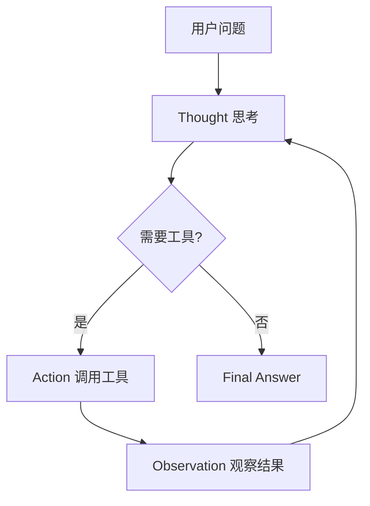

## 题目

请解释 Agent 中 ReAct 模式的工作流程,画出其核心循环,并说明它相比"一次性生成答案"的优势与代价。

## 要点

- Thought → Action → Observation 循环的三要素
- 显式推理对可解释性与纠错的价值
- 多轮循环带来的时延与 token 成本

## 答案

ReAct(Reasoning + Acting)把推理与行动交织进行:模型先显式思考(Thought),再决定是否调用工具(Action),拿到结果(Observation)后继续思考,循环直到能给出最终答案。

**优势**:

- 每一步行动都以显式思考为前提,轨迹可解释、可调试
- 工具调用失败或结果异常可以被观察到并当场纠正
- 天然支持多跳任务(先查 A 再用 A 的结果查 B)

**代价**:多轮 LLM 调用带来时延和成本;循环可能发散,需要最大步数、超时等护栏。

## 知识点

ReAct、工具调用(Function Calling)、Agent 循环护栏(最大步数/超时/重复检测)。

## 追问

- ReAct 与 Plan-and-Execute 的取舍?
- 如何检测并打断 Agent 的死循环?

## Note
