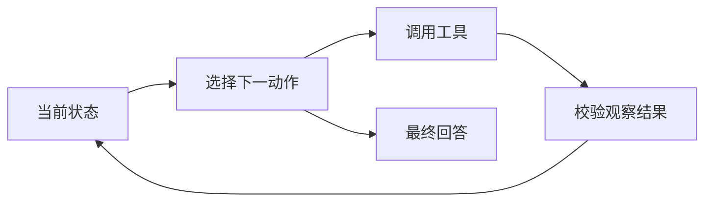

## 题目

请解释 ReAct（Reasoning + Acting）的核心循环，并说明它与纯 Prompt、CoT、Function Calling 和 ToT 的关系。在什么任务中有优势，又有哪些成本、错误和无限循环风险？

## 要点

- 规划、工具动作、环境观察交错推进
- Function Calling是调用接口，ReAct是控制循环
- 外部反馈能修正计划，但不保证正确或减少幻觉
- 简单任务未必需要多轮ReAct
- 用步数、deadline、重复检测、权限和结果校验约束循环

## 答案

**ReAct 的关键是“根据观察再决定下一步”，而不是一次性生成完整答案。** 工程上可记录简短规划摘要、结构化 Action 和 Observation，不必向用户展示模型私有思维链。

纯 Prompt 只使用当前上下文一次生成；CoT组织文本推理；Function Calling提供受 schema 约束的工具调用接口；ToT保留多个候选分支。ReAct可用Function Calling执行Action，也可在复杂规划时结合分支搜索，它们不是互斥技术。

它适合多跳检索、实时信息、计算和需要环境反馈的任务：工具无结果或返回可恢复错误时，可改查询、换计划或澄清用户。但Observation可能陈旧、被注入或本身错误，模型也可能选错工具、重复调用；因此不能把ReAct写成“解决幻觉”或必然优于普通调用。

生产系统应为每个工具定义输入、输出、错误和副作用，校验状态码、schema、来源、时效和权限，并设置最大步数、全链路deadline、重复动作检测、成本预算、熔断与人工升级。简单、低延迟或确定性流程优先使用固定工作流。

## 知识点

ReAct、Action、Observation、Function Calling、CoT、ToT、循环护栏。
- 论文：[ReAct](https://arxiv.org/abs/2210.03629)。
- 本批真实面经：[B005-Q049](../../docs/references/面经原题.md#b005-g01-q049)、[B005-Q050](../../docs/references/面经原题.md#b005-g01-q050)、[B005-Q051](../../docs/references/面经原题.md#b005-g01-q051)、[B005-Q052](../../docs/references/面经原题.md#b005-g01-q052)、[B005-Q056](../../docs/references/面经原题.md#b005-g01-q056)。
- 本批老师参考：[P008-Q049](../../docs/references/平台题/P008-Agent-031-059.md#p008-q049)、[P008-Q050](../../docs/references/平台题/P008-Agent-031-059.md#p008-q050)、[P008-Q051](../../docs/references/平台题/P008-Agent-031-059.md#p008-q051)、[P008-Q052](../../docs/references/平台题/P008-Agent-031-059.md#p008-q052)、[P008-Q056](../../docs/references/平台题/P008-Agent-031-059.md#p008-q056)。

## 追问

以下均为平台页面参考追问，不作为面经原话：

- ReAct 与 Function Calling 如何组合？
- ReAct、CoT、ToT 和 Self-Consistency 的区别与成本是什么？
- 多步复杂规划超过ReAct能力时，怎样引入Plan-and-Execute或搜索？
- Observation 应包含哪些字段，怎样隔离不可信工具文本？
- 如何写工具描述和Action空间，减少选错工具或参数？
- 工具失败时，ReAct怎样重试、换路或安全终止？
- 如何用最大步数、deadline和重复检测打断死循环？

## Note
