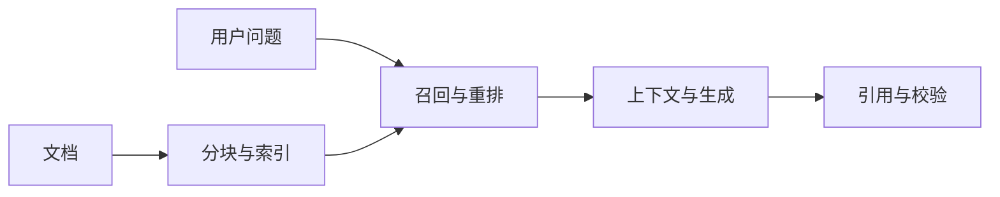

## 题目

什么是RAG，它的完整工作流和核心模块是什么？它为什么适合知识密集型任务，又有哪些能力边界？

## 要点

- RAG在推理时先检索外部知识，再把候选证据交给模型生成
- 离线链路负责解析、分块、表示、索引和版本管理
- 在线链路负责理解查询、召回、重排、组织上下文、生成与核验
- 优势是知识可更新、证据可追踪，不需要把每条事实写入模型参数
- 检索和生成都可能出错，RAG只能增加有证据作答的机会

## 答案

**RAG是“先查资料，再让模型依据资料回答”。** 它把易更新的知识放在外部库中，推理时按问题取回证据，因此适合企业知识、客服、法规和文档问答等知识密集型任务。

离线链路解析文档、清洗分块、生成表示并建立带版本和权限的索引。在线链路理解或改写查询，执行稀疏、稠密或混合检索，再重排、去重、压缩证据，构造Prompt并生成答案，最后核验引用和拒答条件。

原始 RAG 论文把检索到的文档作为生成的隐变量，并讨论联合训练检索器与生成器；今天很多生产系统则采用可独立替换和评测的模块化流水线。因此，“RAG”不等于所有模块都能端到端反向传播，判断架构时要看具体实现。

它的优势是知识库可独立更新，也能展示来源；微调更适合改变表达、任务行为或稳定能力，两者可以组合。RAG不保证真实：没有权威语料、检索漏召回、证据冲突或模型误读都会出错；高风险业务还需要规则、工具或人工审核。知识更新也要经过解析、建索引和版本切换，并非即时生效。

## 知识点

检索增强生成、离线索引、在线检索、重排、上下文融合、引用核验、RAG与微调。

- 一手依据：[RAG 原论文](https://arxiv.org/abs/2005.11401)

## 追问

- RAG与微调在知识更新场景下怎样选择或组合？
- 检索到的资料相互矛盾时，系统应怎样处理？
- 召回不足时可以从哪些环节优化？
- 怎样分别评估检索质量和生成质量？
- 长文档除了直接切片，还有哪些检索方案？

## Note
