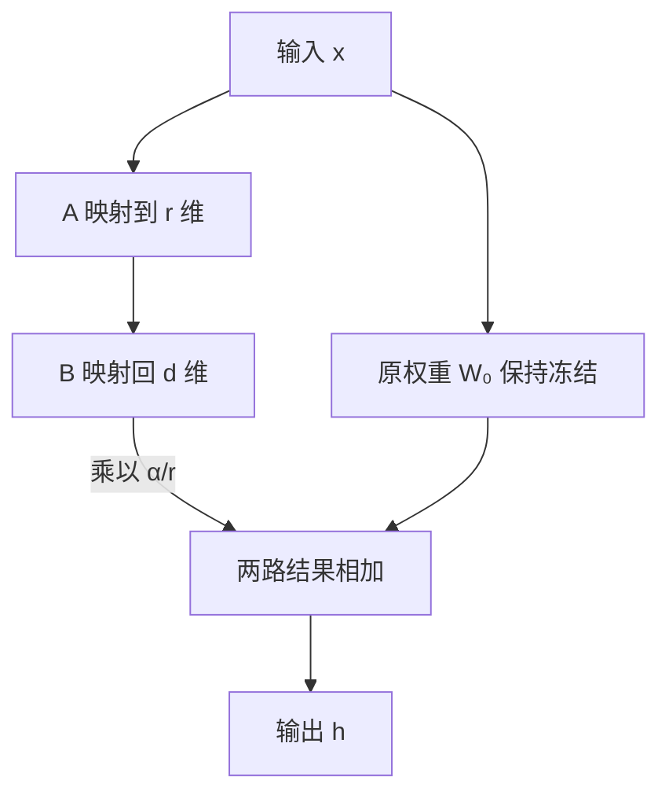

## 题目

请详细阐述 LoRA(Low-Rank Adaptation)在大模型微调中的基本原理,包括其数学形式、低秩矩阵 A 和 B 的结构与初始化策略,并系统分析秩 $r$ 参数的选择如何影响模型性能、训练效率、过拟合风险以及实际应用中的权衡。

在 Transformer 等架构中,如何决定冻结和适配哪些注意力或前馈层?请结合理论依据与实验经验,说明选层策略对训练效率和模型性能的影响。

## 要点

- 冻结原权重,用两个小矩阵的乘积学习权重增量,不是分解原权重
- 写清 A/B 的形状、前向公式及缩放系数
- 经典初始化是 A 随机、B 为零,初始增量为零;两者都为零会导致梯度为零
- 可训练参数为 $r(d+k)$,秩增加会扩大可表示的更新范围,也增加训练开销
- 用验证集比较效果与过拟合,不能认定秩越大越好
- 区分冻结基座与选择适配层,在相近预算下比较模块、深度与秩

## 答案

**LoRA 保留原模型,只训练一份小的权重增量。** 它用两个小矩阵相乘表示这份增量,因此要训练的参数更少。

设原权重 $W_0$ 把 $k$ 维输入 $x$ 变成 $d$ 维输出 $h$。冻结 $W_0$,只训练 $A\in\mathbb R^{r\times k}$ 和 $B\in\mathbb R^{d\times r}$:

$$
h=W_0x+\frac{\alpha}{r}B(Ax)
$$

$r$ 是中间维度,限制增量的秩;$\alpha$ 控制缩放。两条路径使用同一个输入,最后把结果相加:

**经典初始化是 A 高斯随机、B 全零。** 这样 $BA=0$,开始训练时不改变原模型的计算结果。首步 A 的任务梯度为零,B 可先更新,后续 A 才能得到梯度;两者都置零会一直训不动。它避免了起点的随机扰动,不保证后续无震荡或收敛更快。反向初始化、两边随机及 Kaiming/He 的区别见 [初始化梯度](004-lora-初始化梯度.md)。

可训练参数从 $dk$ 变为 $r(d+k)$。举例:一个 $4096\times4096$ 的矩阵取 $r=8$,新增 65,536 个参数,约为原矩阵的 0.39%。这省的是可训练参数及其梯度、优化器状态;原模型仍需加载。

### 秩与目标层怎么选

**小 $r$ 省开销,但可能装不下任务需要的变化;大 $r$ 容量更大,也可能更容易拟合噪声。** 参数与优化器开销随 $r$ 线性增加,实际训练时间还受基座计算影响。选秩时固定数据、目标层等条件,记录缩放与学习率,比较验证效果、显存和耗时;验证效果不再提高就没必要继续增大。

标准 LoRA 冻结原权重,选层指在哪些投影与深度添加 A/B;若解冻原权重,就是混合微调。Q/K/V/O 和 FFN 均可适配,没有通用冻结优先级。冻结层不求参数梯度,但仍可能为更早的适配器传播梯度,并非免掉全部反向计算。

显存紧时先查瓶颈:减小秩或减少适配层省可训练状态;量化基座省权重,梯度检查点省激活。优先保留实测有效的模块,不能一律只训最后两层。冻结高层与低层的条件、候选方案如何验证见 [超参数调优](031-lora-超参数调优.md)的“目标层与深度怎么验证”。

低秩有效是任务相关的假设,不等于与全参微调普遍等价。冻结基座也不保证启用增量后的通用能力不下降,仍需保留能力评测。

### 追问怎么接

- **LoRA 与 Adapter、Prefix-tuning 怎么选?** LoRA 学权重增量,可以合并回权重;这里的 Adapter 指插入网络的非线性小模块,推理仍要经过它;Prefix-tuning 学供注意力使用的连续前缀,相当于可训练的虚拟上下文。若希望部署时去掉新增分支,LoRA 有优势;任务效果与实际延迟仍需实测。
- **Q/K/V/FFN 中挂哪一层最好,有理论保证吗?** 没有通用最优层。原论文在特定实验中发现 Q/V 组合有效,不能推广到所有模型。应在相近参数预算下比较目标层组合与秩。
- **权重怎么合并,为什么推理没有新增分支?** 在部署前算好 $W'=W_0+(\alpha/r)BA$,推理只做 $W'x$。合并后的矩阵形状不变,大小秩都能合并;收益是省去独立 LoRA 路径,不保证比原基座更快。多任务共用一个基座时也可保留分支,换取切换方便。

进一步的真题追问按角度展开:秩与数据诊断见 [超参数调优](031-lora-超参数调优.md);自适应秩、Embedding/LM Head、FFN 与长上下文选层见 [适用层与非线性](078-lora-非线性层扩展.md);非零起点与其他零门控方法见 [改进初始化](046-lora-改进初始化.md);量化与遗忘见 [LoRA 与 QLoRA](051-lora与qlora.md);全参差距及多适配器组合见 [LoRA 与全参数微调](066-lora与全参数微调.md)。

## 知识点

低秩权重增量、参数高效微调、冻结基座、零增量初始化。

- 依据:[LoRA 原论文](https://arxiv.org/abs/2106.09685)、[Adapter 原论文](https://proceedings.mlr.press/v97/houlsby19a.html)、[Prefix-tuning 原论文](https://aclanthology.org/2021.acl-long.353/)。

## 追问

- LoRA 与 Adapter、Prefix-tuning 怎么选?
- Q/K/V/FFN 中挂哪一层最好,有理论保证吗?
- 权重怎么合并,为什么推理没有新增分支?
- 为什么 B 不能也用高斯初始化,两者都从零开始训练有什么问题?
- 如果 A 也用零初始化会出现什么问题,从梯度流动角度如何分析?
- LoRA 的初始化策略与标准线性层 Kaiming/He 初始化有什么联系与区别?
- 如果 r 设置过大或过小会有什么影响?
- 如果显存非常受限,你会选择只微调哪些层?
- 在哪些任务场景下冻结高层比冻结低层效果更好?
- 如何验证你的层选择策略是否最优?

## Note
