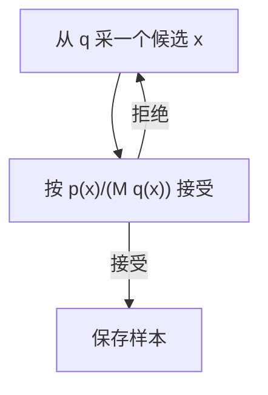

## 题目

拒绝采样的原理和流程是什么,何时有效、何时效率低?大模型中的候选答案筛选、PPO 裁剪和它有什么区别?

## 要点

- 提议分布必须覆盖目标分布,并有有效包络上界
- 接受概率与条件分布的推导
- 接受率取决于包络紧密程度,高维可能加重失配
- 区分精确采样、重要性加权和质量筛选

## 答案

**先从容易采样的分布里生成候选,再按特定概率保留。保留概率设计得正确,留下来的样本就服从目标分布。**

记目标密度为 $p(x)$,容易采样的提议密度为 $q(x)$。需要找到有限常数 $M$,保证所有位置都满足 $p(x)\le Mq(x)$。尤其是目标有概率的地方,提议不能为零。

为什么正确?采到 $x$ 又接受它的概率密度是:

$$
q(x)\frac{p(x)}{Mq(x)}=\frac{p(x)}{M}
$$

对全部位置积分,总接受率为 $1/M$;除以这个接受率,留下样本的条件密度恰好为 $p(x)$。若只知道未归一化密度 $\tilde p$,可用覆盖它的包络;不必先算归一化常数,但接受率就不能直接写成 $1/M$。

### 一个小例子

想让 A、B 的概率分别为 0.8、0.2,但只能各以 0.5 生成。取 $M=1.6$:A 每次都保留,B 以 0.25 的概率保留。每轮保留 A、B 的概率是 0.5、0.125,归一化后正好是 0.8、0.2。平均接受率为 0.625。

### 为什么高维容易慢

若 $q$ 与 $p$ 的尾部或相关结构不匹配,为了处处盖住目标,$M$ 可能很大,大多数候选被扔掉。独立维度的失配还可能累乘,但“高维必然指数低效”不是无条件结论:若 $q=p$,再高维也可全部接受。

优化重点是选更贴近目标且仍易采样的提议、找更紧的有效包络,以及批量生成与评估。自适应修改提议后仍需保证接受规则正确;设拒绝次数上限后随便返回候选,通常会破坏精确分布。重要性重采样、MCMC 是另一些方案,有各自的近似误差或收敛条件。

### 大模型里哪些名字容易混

| 做法 | 目标和区别 |
|---|---|
| 按奖励筛掉低分答案,或选候选中的最好答案 | 常用于构建训练数据或提高推理答案质量;结果受生成器与评分器影响,不自动满足上面的精确分布保证 |
| 重要性采样 | 用概率比给样本贡献加权,通常不靠逐个丢弃来产生目标分布样本 |
| PPO 裁剪 | 限制策略概率比进入代理目标后的激励,不等于按接受概率丢弃样本,也不保证概率比被硬限制在区间内 |
| Top-p | 截断词表概率尾部后重新归一化,主动改变解码分布 |
| Gumbel-Softmax | 对离散采样作可微松弛,服务于梯度估计;不同于包络拒绝采样 |

若目标是在某个约束下采样,需明确条件分布和拒绝单位。逐 token 过滤与整段答案过滤,一般不能当成同一个分布。投机解码也使用接受/拒绝步骤,但还配有拒绝后的修正采样,详见 [投机解码原理](../AI%20Infra/080-投机解码-原理.md)。

## 知识点

提议分布、包络、支持集、条件分布、接受率、加权与筛选。

- 来源:[老师平台](https://course.terminiai.com/interview),P002-Q121。
- 依据:[CMU 采样课程讲义](https://www.math.cmu.edu/~gautam/c/2024-387/notes/02-sampling.html)、[PPO 原论文](https://arxiv.org/abs/1707.06347)。

## 追问

- 拒绝采样与重要性采样本质上有什么区别,为什么 PPO 用裁剪?
- 高维下拒绝采样为什么可能很慢,工程上怎样改善?
- 与 Gumbel-Softmax、Top-p 相比,拒绝采样在解码中适合解决什么问题?

## Note
