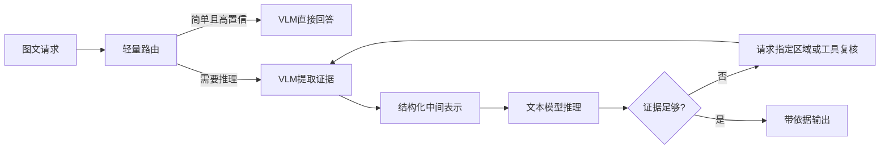

## 题目

给定一个能力有限的多模态模型和一个推理能力更强的纯文本模型，怎样设计协同推理系统？请说明模块分工、信息传递、动态路由、纠错和性能优化，并分析它的收益与风险。

## 要点

- VLM 负责可验证的视觉提取，文本模型负责语言知识和多步推理
- 中间表示要保留原始证据位置、置信度和缺失项，不能只传一段自然语言描述
- 路由按任务需求和不确定性分层，复杂请求才进入高成本链路
- 文本模型无法凭文字摘要发现所有视觉错误，需要回看区域或再次调用视觉工具
- 用分层指标分别评估感知、路由、推理、时延和成本

## 答案

**协同系统的关键是让两个模型各做自己能被验证的部分，并给错误留下回查原图的路径。** 如果 VLM 只输出一段流畅描述，视觉幻觉会被文本模型当成事实继续推理；因此中间结果应包含对象、属性、文字、坐标或时间段、证据引用、置信度和未识别项。

### 模块怎样分工

- **VLM/视觉工具**：OCR、对象与属性识别、空间关系、帧选择和区域裁剪；输出事实候选及其位置。
- **文本模型**：规则、领域知识、多步计算、解释和答案组织；它只能在收到的证据范围内推理。
- **路由器**：判断是否需要视觉、是否需要强模型、是否需要二次取证。可先用规则和轻量分类器，再用线上数据校准。
- **验证器**：检查价格求和、JSON 结构、引用区域等可执行条件；高风险请求可进入人工复核。

路由至少保留三条路径：纯文本或简单视觉任务直接返回；视觉提取后单次调用强文本模型；证据冲突或置信度低时，强模型提出具体补充请求，例如“放大右下角价格区域”，再调用 VLM。不要让两个模型无目标地来回对话。

### 怎样提速且守住质量

图像哈希、视觉特征和 OCR 可以缓存；用户上传后可提前编码；相同尺寸请求可批处理；强模型调用可并发准备检索材料。是否值得使用这些手段，要看端到端 P95/P99 时延和实际命中率。缓存必须绑定图片版本与预处理配置，不能复用过期结果。

评测应拆成五层：视觉事实正确率、证据定位正确率、路由漏判和误判、最终答案质量、每请求时延与成本。最危险的失败是“高置信但视觉事实错误”；应对方法是保留原始区域、使用独立 OCR/检测结果交叉核验，并允许文本模型发起定向复查。纯文本模型看不到原图时，不能期待它仅凭语言常识纠正所有视觉幻觉。

## 知识点

模型级联、动态路由、结构化中间表示、证据回查、视觉幻觉、缓存、批处理与分层评测。

- 真实面经：[B004-Q003](../../docs/references/面经原题.md#b004-g01-q003)
- 老师参考：[P007-Q003](../../docs/references/平台题/P007-MultiModal-001-020.md#p007-q003)

## 追问

- 路由器的训练样本和标签应怎样构造？
- 怎样区分“文本模型推理错”和“VLM最初看错”？
- 强文本模型看不到原图时，能采用哪些可靠的纠错机制？
- 直播等低时延场景怎样缩短协同链路？
- 两个模型升级后，怎样发现中间表示发生了不兼容变化？

## Note
