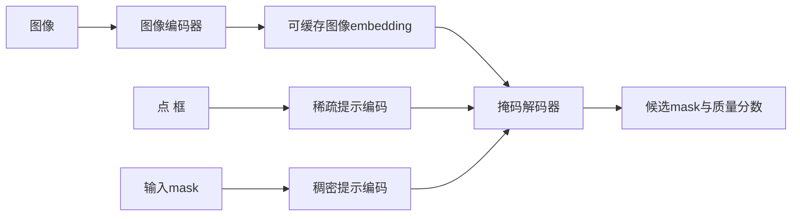

## 题目

Segment Anything Model（SAM）怎样工作？请说明图像编码器、提示编码器和掩码解码器的输入输出、协作流程，以及它为什么能支持交互式和零样本分割。

## 要点

- 重型图像编码器只运行一次，图像embedding可以被多个提示复用
- 点和框属于稀疏提示，已有mask属于稠密提示，编码方式不同
- 轻量掩码解码器让提示token与图像embedding双向交互并预测mask质量
- 多mask输出用于处理歧义，不是三个固定语义层级
- 零样本迁移来自可提示任务设计、数据引擎和大规模多样分割数据

## 答案

**SAM 把分割改成“给图像加提示，再返回提示对应的掩码”。** 它将昂贵的图像理解与频繁变化的用户提示分开，因此同一张图可以先编码一次，之后快速尝试不同点、框或已有mask。

### 三个组件

1. **图像编码器**使用ViT类主干把整张图变成空间特征。它是主要计算开销，但输出可缓存，所以交互时不用为每个新提示重新看图。
2. **提示编码器**把点和框的位置连同提示类型编码成稀疏token；输入mask经卷积形成稠密特征，并与图像embedding在空间上结合。具体开源接口是否支持自然语言提示要看实现，不能默认原始 SAM API 可直接输入文本。
3. **掩码解码器**让提示token和图像特征通过轻量Transformer交互，再用动态mask预测头产生候选掩码，同时预测每个掩码的质量。

单个点可能指整个人、衣服或身体的一部分。SAM 可以输出多个候选mask来表达这种歧义，再依据预测质量或用户后续提示选择；这些mask不是永远固定为“整体、部分、子部分”三个标签。

SAM 的零样本能力来自 promptable segmentation 任务、数据引擎和 SA-1B 的规模与多样性。论文报告的数据集包含约 1100 万张获许可并考虑隐私的图像、超过 10 亿个掩码。这里的“零样本”表示无需为每个新分割类别单独训练专用头，不保证所有领域和小目标都能准确分割。

图像编码器可以替换，但要重新考虑特征尺寸、提示解码器接口、速度和迁移精度。视频还需要跨帧记忆与对象一致性，不能简单逐帧运行后就认为解决了视频分割；3D场景也要加入多视角几何或三维表示。

## 知识点

可提示分割、图像embedding缓存、稀疏与稠密提示、双向Transformer、掩码歧义、数据引擎和零样本迁移。

- 真实面经：[B004-Q018](../../docs/references/面经原题.md#b004-g01-q018)
- 老师参考：[P007-Q018](../../docs/references/平台题/P007-MultiModal-001-020.md#p007-q018)
- 一手依据：[Segment Anything](https://arxiv.org/abs/2304.02643)

## 追问

- 为什么SAM适合先缓存图像embedding，再交互式输入多个提示？
- 点、框和mask分别怎样编码，为什么不能完全共用一种表示？
- 为什么要输出多个mask，预测质量分数有什么作用？
- SAM与CLIP都能零样本迁移，它们的任务和输出有什么根本区别？
- 从图像扩展到视频分割时，需要新增哪些状态和一致性机制？

## Note
