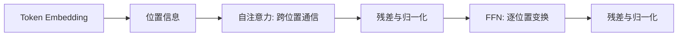

## 题目

请系统说明 Transformer 的整体架构：Embedding、位置编码、自注意力、前馈网络、残差连接和归一化分别做什么？Encoder 与 Decoder 如何协作，各模块为什么能共同完成序列建模？

## 要点

- 注意力负责跨位置交换信息，FFN 负责逐位置变换
- 位置编码补充顺序，残差与归一化帮助深层训练
- Encoder、Decoder 与 Cross-Attention 的数据流
- 区分原始 Post-LN、现代常见 Pre-LN 以及训练和推理并行性

## 答案

**Transformer 的核心是交替执行“跨 token 通信”和“逐 token 计算”。** 输入先变成 Embedding，并加入或注入位置信息；自注意力让每个位置按内容读取其他位置；FFN 再独立处理每个位置的表示。残差连接保留原信息和梯度通道，归一化控制表示尺度。

原始 Encoder 每层是双向自注意力加 FFN。原始 Decoder 每层先做因果自注意力，再用 Cross-Attention 读取 Encoder 输出，最后经过 FFN。每个子层都有残差与归一化。原论文采用 $\operatorname{LN}(x+F(x))$ 的 Post-LN；很多现代模型改用 $x+F(\operatorname{LN}(x))$ 的 Pre-LN，不能把两者顺序写反。

### 常见追问简答

- **为什么比 RNN 更易并行？** 同一层内各位置可同时计算；层与层仍顺序执行，自回归推理也仍逐 token 生成。
- **长序列瓶颈在哪？** 稠密注意力的序列项是 $O(n^2d)$，显式注意力矩阵占 $O(n^2)$ 元素。
- **为何常用 LayerNorm？** 它按单个 token 的隐藏维归一化，不依赖 batch 内其他样本或 padding 统计。
- **GPT 与 BERT 为什么结构不同？** GPT 用因果 Decoder 适配生成，BERT 用双向 Encoder 适配表示学习；具体边界见架构选型题。

## 知识点

Transformer = 表示输入 + 位置信息 + 注意力通信 + FFN 变换 + 残差/归一化；“层内并行”不等于总复杂度 $O(1)$。

- 来源：[老师平台](https://course.terminiai.com/interview)，采集编号 P004-Q001、P004-Q041、P004-Q052、P004-Q079、P004-Q095、P004-Q097、P004-Q114、P004-Q128、P004-Q148、P004-Q154、P004-Q168、P004-Q173、P004-Q313。
- 依据：[Attention Is All You Need](https://arxiv.org/abs/1706.03762)。

## 追问

- 为什么 Transformer 比 RNN 更容易并行，复杂度代价是什么？
- LayerNorm 为什么比 BatchNorm 更适合常见 Transformer？
- GPT、BERT 和原始 Encoder-Decoder 的结构差异是什么？
- Pre-LN 与 Post-LN 的计算顺序和训练差异是什么？

## Note
