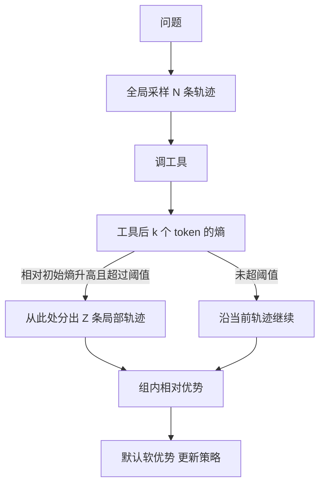

# ARPO：工具反馈后熵升高，就在那一步多采样

<!-- release-date: 2025-07-26 -->

**本文依据**：`Agentic Reinforced Policy Optimization`，arXiv 2507.19849v1（2025-07-26，38 页）。作者 Guanting Dong、Hangyu Mao、Kai Ma、Licheng Bao、Yifei Chen、Zhongyuan Wang、Zhongxia Chen、Jiazhen Du、Huiyang Wang、Fuzheng Zhang、Guorui Zhou、Yutao Zhu、Ji-Rong Wen、Zhicheng Dou；Renmin University of China 与 Kuaishou Technology（封面把 1 标为人大、2 标为快手；第一作者等标注实习于快手，通讯含周国瑞、窦志成）。代码 `dongguanting/ARPO`。首发日取本地 PDF 头已是 v1 的 26 Jul 2025。文中数字都标 PDF 页码；标「外部补充」的段落不来自本文。

## 一句话

单轮可验证奖励（RLVR）能把模型练成「自己想完再交答案」。一旦要多轮调搜索、浏览器、Python，现成的轨迹级 GRPO / DAPO 只比较整条轨迹，几乎不看「工具刚吐回一段话之后」那几步。作者先量 token 熵：每次工具返回后的前约 **10–50** 个 token 熵会猛升（PDF p.4）。ARPO 因此做两件事：熵升高就从当前节点再分出几条局部轨迹（entropy-based adaptive rollout）；共享前缀与分叉后半段用不同的优势归属（advantage attribution）。13 个基准上它压过轨迹级 RL；工具调用次数大约只要对照方法的一半（PDF p.1、p.11 图 7）。

## 一、矛盾：整条轨迹比完了，工具那一步还是没被练到

可验证奖励把数学、代码这类「答案能对错」的单轮推理推得很远（PDF p.2）。开放环境里模型还要跟工具来回：搜网页、点开链接、跑代码、读报错再改。Agentic RL 把这件事写成（PDF p.3 式 1）：

$$
\max_{\pi_\theta}\ \mathbb{E}_{x\sim\mathcal{D},\, y\sim\pi_\theta(\cdot\mid x;T)}\bigl[r_\phi(x,y)\bigr]-\beta D_{\mathrm{KL}}\bigl[\pi_\theta(y\mid x;T)\,\|\,\pi_{\mathrm{ref}}(y\mid x;T)\bigr]
$$

$T$ 是工具集合，$y$ 里夹着工具反馈。现成做法大多仍是轨迹级：用特殊 token 采完整工具轨迹，只看最终输出给奖励；再为「工具用太多、奖励太稀」改奖励形状（PDF p.2）。漏掉的是循环本身：每一轮工具返回都是新的、实时的观察，值得单独发现「这一步该怎么用」。

作者把 rollout 拆成两段乘积（PDF p.3 式 2）：前面是夹着工具反馈的 agentic reasoning $R$，后面才是最终答案 $y$。问题变成：梯度该不该同等对待「第一次开口」和「读完搜索结果之后的开口」。

图是按 PDF p.5 图 3、p.6 图 4 与附录算法 1（PDF p.32）重画的机制示意，不是实测时间线。

## 二、先看熵：工具一回来，模型就不确定

token 在第 $t$ 步的生成熵是整份词表分布的不确定度，不是某一个字有多怪（PDF p.3 式 3）：

$$
H_t=-\sum_{j=1}^{V}p_{t,j}\log p_{t,j},\quad p_t=\mathrm{Softmax}(z_t/\tau)
$$

试探实验用两类 agent：搜索引擎做知识任务、Python 解释器做计算任务。图 2 与正文三条观察（PDF p.4）：

1. 每次工具调用之后，前 **10–50** 个 token 熵急剧升高。
2. 推理早期熵也会升，但通常仍低于「刚接到工具反馈」之后。
3. 搜索反馈带来的不确定度大于 Python：网页是长文本，Python 多半是确定数字或报错。

图 1 左把 GAIA 上的熵画成热力图：三次 tool-call 之后，开头那一截都亮（PDF p.1）。作者的解释是分布偏移：外部观察和模型内部推理不在同一处，这段偏移往往比原问题本身更「吵」。轨迹级 RL 却把比较预算花在整条轨迹的开头，等于正好错过最该探索的位置。

工具侧本文只认三种，用来验证算法而不是发明新工具（PDF p.4）：搜索引擎、网页浏览器 agent（把搜索返回的链接抓下来摘要）、代码解释器（跑通给结果，失败给编译错误）。

## 三、ARPO：高熵的工具步，允许再分叉

核心原则一句话：策略在高熵的工具轮上自适应地分支采样，用来对齐步级工具行为（PDF p.2、p.5）。

### 1. 基于熵的自适应 rollout

全局 rollout 大小 $M$。先按轨迹级采 $N$ 条，剩下 $M-N$ 条预算留给局部采样。对每条轨迹算开头 $k$ 个 token 的熵，得到 $H_{\mathrm{initial}}$（PDF p.5）。

工具第 $t$ 次返回后，再生成 $k$ 个 token，得到步级熵 $H_t$，相对初始状态的归一化变化（PDF p.5 式 4）：

$$
\Delta H_t=\mathrm{Normalize}(H_t-H_{\mathrm{initial}})
$$

正文写归一化是把 $\Delta H$ 各维加总再除以词表大小 $V$。$\Delta H>0$ 表示工具之后更不确定。

分支概率（PDF p.5 式 5）：

$$
P_t=\alpha+\beta\cdot\Delta H_t
$$

$P_t>\tau$ 就从当前节点分出 $Z$ 条局部路径，否则沿原轨迹走。$\alpha$ 是基础采样概率，$\beta$ 是熵项系数。分叉条数用尽 $M-N$、或路径提前结束再补独立轨迹，保证组大小仍是 $M$（PDF p.5–6）。

作者声称：若全局扩展规模和每条轨迹 token 数都记作 $n$，轨迹级 RL 每次 rollout 是 $O(n^2)$，ARPO 落在 $O(n\log n)$ 到 $O(n^2)$ 之间；token 熵计算的开销被他们忽略（PDF p.6 脚注）。这是复杂度上界讨论，不是墙上时钟。

### 2. 优势归属：硬切一刀，还是让重要性权重自己对齐

分叉之后，若干轨迹共享前缀、后半段各走各的。硬优势：分叉后的 token 用该条轨迹自己的组内归一化奖励；共享段把含这段前缀的 $d$ 条轨迹的优势取平均（PDF p.6）。软优势：不显式改 $A$，继续用 GRPO 目标（PDF p.6 式 6）。共享前缀上重要性比 $r_{i,t}(\theta)$ 相同，组内平均优势会把共享段「对齐」到接近硬估计的 $A^{\mathrm{shared}}$（PDF p.6–7 式 7）。附录 D.1 把软目标写成「从分叉点起的标准 GRPO」加上前后目标的长度加权差（PDF p.29 式 19）。

图 5 在 Qwen2.5-7B 上比硬/软：纵轴 Reward Score 大约从 $-0.2$ 升到 $0.4$ 以上；软曲线全程更高、更稳。默认因此用软设置（PDF p.7）。

奖励跟 Tool-Star：格式对且准确率大于 0 时取 $\max(\mathrm{Acc.}+r_M,\mathrm{Acc.})$；格式对但答错为 0；格式错为 $-1$。同时用了 `<search>` 和 `<python>` 且答对，才给 $r_M=0.1$（PDF p.7 式 8）。

### 3. 理论：把一段 token 当成宏动作

自适应分叉等于把输出切成 $K$ 段宏动作 $MA_i$，宏状态由输入再拼接前面的宏动作得到。作者给出面向 Transformer 策略的广义策略梯度（PDF p.7 式 9），单 token 的经典策略梯度是它的特例。附录 D.2 的关键一步：对 Transformer，$s_{t+1}=[s_t,a_t]$，转移概率为 1，才能把 token 串收成宏动作的乘积（PDF p.30–31）。这是「允许按特殊 token 切段」的许可证明，不是新的收敛保证。

算法 1 把上述步骤写成循环：采 $N$ 条 → 工具 → 算 $\Delta H$ → 超阈值分叉 $Z$ 条 → 凑满 $M$ → 组相对优势 → 若干次 GRPO 更新（PDF p.32）。实现上，工具返回的 token **不算进 loss**，只优化推理文本和工具请求（PDF p.26）——和 Search-R1 的检索 mask 是同一类纪律。

## 四、怎么训、怎么测

目标是算法对比，不是刷分。训练框架和数据都来自公开资源；范式是 **cold-start SFT 再 RL**，减轻 RL 开头的奖励崩（PDF p.8）。

| 阶段 | 数据与设定 | 出处 |
|---|---|---|
| SFT | Tool-Star 开源 **54K**，再加 STILL **0.8K** 数学 | PDF p.8 |
| 深度推理 RL | 计算 + 多跳知识，Tool-Star **10K** RL 样本 | PDF p.8 |
| 深度搜索 RL | SimpleDeepSearcher 与 WebSailor 混难样本 **1K** | PDF p.8 |

SFT 写在附录：Qwen2.5-3B-Instruct、LLaMA-Factory、学习率 $7\times 10^{-6}$、ZeRO-3、FlashAttention2、batch 128、weight decay 0.1、3 epoch、BF16、最大输入 4096（PDF p.26）。RL 基于 VERL。深度推理 7B：总 batch 128、PPO mini-batch 16、全局 rollout $M=16$、初始采样 $N=8$、单轮回复 4096；ARPO 熵权重 0.2、$\alpha=0.5$、阈值 0.5、GRPO 的 KL 系数 **0**；2 epoch；**8×H800**（PDF p.26）。深度搜索把回复扩到 8192；8B 设定同左，14B 用 **16×H800**；1K 数据训 **5** epoch（PDF p.26–27）。

训练加速：Bing 搜索 top-10 snippet、沙箱 Python、正确性用 token 级 F1（PDF p.8）。评测改用带浏览器的搜索，对齐「标准推理」；知识四 QA 用 F1，其余用 Qwen2.5-72B-Instruct 做 LLM-as-Judge；pass@1、温度 0.6、top-p 0.95；答案从 `\box{}` 里抽（PDF p.9）。训练/测试检索都是 Bing US-EN、每查询 10 页；数学与知识评测只用 snippet，深度搜索每页最多抓 **6000** token，再用与推理模型同规模的浏览器 agent 提炼（PDF p.27）。

13 个基准怎么数：数学 AIME24 / AIME25 / MATH500 / GSM8K / MATH；知识 WebWalker、HotpotQA、2Wiki、MuSiQue、Bamboogle；深度搜索再加 GAIA、HLE、xbench-DeepSearch（WebWalker 在表 1 与深度搜索表里都会出现，独特任务是 13 个）（PDF p.7–8）。

基线三档：直接推理（Qwen2.5 / Llama3.1 Instruct；深度搜索换 Qwen3，并引用 QwQ、DeepSeek-R1、GPT-4o、o1-preview）；轨迹级 GRPO / DAPO / REINFORCE++；深度搜索再加 RAG、Search-o1、WebThinker、ReAct（PDF p.8）。

## 五、主结果：十个推理任务 + 深度搜索

表 1（PDF p.9）。下面只留平均和关键对照。

| 骨干 | 直接 | TIR 提示 | GRPO | REINFORCE++ | DAPO | **ARPO** |
|---|---:|---:|---:|---:|---:|---:|
| Qwen2.5-3B-Instruct | 26.1 | 25.1 | 50.4 | 49.7 | 50.6 | **52.8** |
| Llama3.1-8B-Instruct | 28.8 | 36.3 | 51.1 | 51.1 | 50.4 | **55.3** |
| Qwen2.5-7B-Instruct | 32.0 | 31.0 | 56.5 | 54.9 | 54.8 | **58.3** |

作者三点（PDF p.9）：

1. 只靠 TIR 提示，Qwen 上平均甚至低于直接生成。提示带不动最优工具行为，还可能搅乱原有推理。
2. DAPO 在单轮推理里强，多轮工具尤其知识任务上并不占优——和「轨迹级看不见步级」的预实验一致。
3. 同一设置下 ARPO 在 10 个数据集上平均准确率大约再高 **4%**，Qwen 与 Llama 都涨。逐格不是处处第一：例如 3B 的 MATH500 是 GRPO 72.0 对 ARPO 71.4，MuSiQue 是 DAPO 30.0 对 ARPO 28.7（PDF p.9）。赢在平均和多数格，不是每格。

深度搜索只用 **1K** RL 样本训 Qwen3（PDF p.10 表 2，LLM-as-Judge）：

| 设定 | GAIA Avg. | WebWalker Avg. | HLE Avg. | XBench Avg. |
|---|---:|---:|---:|---:|
| Qwen3-8B | 20.4 | 2.0 | 4.6 | 9.0 |
| + GRPO | 32.0 | 29.0 | 7.8 | 20.0 |
| **+ ARPO** | **38.8** | **30.5** | **8.8** | **25.0** |
| Qwen3-14B | 19.4 | 4.0 | 6.8 | 14.0 |
| + GRPO | 36.9 | 30.0 | 8.6 | 27.0 |
| **+ ARPO** | **43.7** | **36.0** | **10.0** | **32.0** |

大模型参考（灰色行，PDF p.10）：GPT-4o 的 HLE 平均 2.6，DeepSeek-R1-671B 的 HLE 8.6、GAIA 25.2。正文把 14B ARPO 写成 HLE **10.0%**、GAIA **43.2%**（PDF p.10）；表 2 的 GAIA 是 **43.7**。以表格为准，正文四舍了。相对 GRPO，GAIA 与 WebWalker 大约再高 **6** 个点（PDF p.10）。

Pass@k（图 6，PDF p.10–11）。14B ARPO 的 Pass@5：GAIA **61.2**、HLE **24.0**、xbench-DR **59**。图上还能读到 8B GAIA Pass@1/3/5 为 38.8 / 52.4 / 56.3；14B 为 43.7 / 59.2 / 61.2。脚注：xbench-DR 全是中文题，Pass@k 分析改用中文提示，所以会高于表 2（PDF p.11）。

## 六、工具预算大约一半，以及超参怎么折

图 7 在 Qwen2.5-7B 上对比训练期总工具调用（PDF p.11，读自该图）：横轴训练 step 0–100，纵轴 Total Calls 约 200–500。GRPO 从约 500 降到大约 380–410 一带震荡；ARPO 从约 350 很快落到大约 250 附近。正文结论是：整体准确率更高，工具次数大约只要一半。机制解释是只在高熵工具步才分支，探索空间变大、调用次数反而少。

浏览器消融表 3（PDF p.11）：

| 方法 | GAIA | HLE | WebWalk. | Avg. |
|---|---:|---:|---:|---:|
| 8B + 仅 snippet | 33.0 | 7.5 | 29.0 | 23.2 |
| 8B + 同尺寸浏览器 | 38.8 | 8.8 | 30.5 | 26.0 |
| 8B + QwQ-32B 浏览器 | 38.8 | 8.2 | 33.0 | 26.6 |
| 14B + 仅 snippet | 35.0 | 8.4 | 31.0 | 24.8 |
| 14B + 同尺寸浏览器 | 43.7 | 10.0 | 36.0 | 29.9 |
| 14B + QwQ-32B 浏览器 | 47.6 | 32.3 | 38.4 | 39.4 |

没有浏览器最差；浏览器变强，深度搜索跟着涨。14B 换 32B 浏览器时 HLE 从 10.0 跳到 32.3，说明分数里有一部分是「读网页的那个模型」贡献的，不是推理策略单独变聪明。

图 8 用 Qwen2.5-7B 扫三个旋钮（PDF p.12；附录 C.4 默认 $M=16$、$N=8$、熵权重 0.2、$\alpha=0.5$、阈值 0.5）：

- 熵相关权重：表现随熵线索上升，在 **0.4** 见顶；到 **1.0** 下降。太听熵会伤害采样多样性，所以要留基础概率 $\alpha$。
- 初始采样 $N$：升高到 **8** 最好（$M=16$ 时全局:局部从 1:15 变成约 1:1）；$N=16$ 变成纯全局，动态平衡被破坏，成绩大掉。图上 Val. Score 在 $N=8$ 约 **58.3**，$N=16$ 掉到约 **54**。
- 全局 $M$：加大仍涨，作者以此声称算法可扩展。图右 $M=16$ 约 **58.3**。

附录案例（PDF p.33）：HLE 一道五个平方和等于 2024 的非负整数解，标签 29010；14B ARPO 用 Python 暴力枚举到 44，跑出 29010。这是「会调解释器」的展示，不是算法消融。

## 七、论文没单独开「局限」，但边界已经写在实验里

全文没有 Limitations 节。能从正文读出的边界：

- 预印本，38 页，实验是 SFT+RL，不是从 base 零奖励长出来。
- 深度搜索只喂 **1K** 样本；Pass@k 的 xbench 还换了中文提示，不能直接和表 2 的 pass@1 横比。
- 浏览器能力与分数强相关，换更大浏览器会把 HLE 拉很高——算法增益和环境增益要分开看。
- 轨迹级对照是 GRPO / DAPO / REINFORCE++，不是 Search-R1 那种「检索 token mask + EM」的完整配方对照。
- GPG 证明依赖 Transformer 状态拼接、转移为 1；复杂度 $O(n\log n)$–$O(n^2)$ 是作者口径。
- 图 1 右栏「一半工具预算」在图 7 上是训练曲线量级对比，正文没有给出精确的总调用次数比。

## 八、可迁移的几条

1. **观察落在策略动作之外时，先看熵落在哪一段。** 工具、检索、沙箱返回都是环境 token。ARPO 的贡献不是「熵高就好」，而是指出高峰出现在工具返回后的前几十个 token，探索预算应该打在那里。
2. **分叉要花工具费，所以只在高峰分。** 一半调用次数来自「不是每步都 beam」。自己做 agent RL 时，分支条件可以换成别的不确定度，但「按步分配、而不是按整条轨迹平均分配」这条值得搬。
3. **共享前缀不要假装成独立样本。** 硬平均或软重要性权重，都是在避免同一段前缀被复制计算多次。组内相对算法一旦允许 partial rollout，这条就变成实现 bug 而不是论文细节。
4. **环境返回必须 mask。** 附录写工具结果不进 loss（PDF p.26）。和 Search-R1 一致：学的是何时调、调什么，不是模仿搜索引擎的用词。
5. **浏览器不是免费的上下文。** 表 3 说明「同策略换更强读页模型」可以单独抬分。评自己的 deep search 数字时，要写清检索器、是否抓全文、读页模型是谁。

## 关键词回看

**RLVR** 是答案可自动核对的强化学习；**轨迹级 RL** 整条工具轨迹采完再比；**token 熵** 是下一步词表分布的不确定度；**自适应 rollout** 在高熵工具步从当前节点再采样；**优势归属** 让共享前缀与分叉后半段吃到不同的优势信号；**GPG** 把一段输出当成宏动作的策略梯度。ARPO 把这四者串成：先发现工具后熵升，再把采样和优势都对准那一步。

## 参考资料

- 论文 PDF（本地）：`readings/_src/Agent 训练与工具使用/ARPO.pdf`
- arXiv：https://arxiv.org/abs/2507.19849
- 代码：https://github.com/dongguanting/ARPO
- 前作 Tool-Star（奖励形状来源）：arXiv 2505.16410
