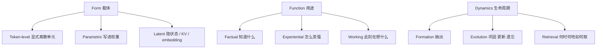

# Agent Memory：一张不再用长/短切的地图

<!-- release-date: 2025-12-15 -->

**本文依据**：封面正式标题 **Memory in the Age of AI Agents: A Survey**（副标题 Forms, Functions and Dynamics），arXiv 2512.13564v2（2026-01-13），107 页。核心作者字母序（†）：Yuyang Hu、Shichun Liu、Yanwei Yue、Guibin Zhang；组织者 Guibin Zhang（NUS）；第一作者联系 yuyang.hu@ruc.edu.cn，属 Renmin University of China。封面还列 Fudan、PKU、NTU、Oxford 等多家单位，本文不把它们写成第一作者机构。首发日取 arXiv v1 提交日 2025-12-15；本地读的是 v2，数字与页码均对应该 PDF。论文列表仓 [Shichun-Liu/Agent-Memory-Paper-List](https://github.com/Shichun-Liu/Agent-Memory-Paper-List)。标「外部补充」的段落不来自本文。

## 一句话

Agent 记忆研究已经碎成一堆互相叠着的词：长/短、episodic/semantic、RAG、KV cache、context engineering。这篇综述不补一本百科，而是换三把正交的刀——**载体（form）**、**用途（function）**、**生命周期（dynamics）**——把「存什么、干什么、怎么变」拆开。旧的长/短切不够用，因为短/长往往只是同一容器上不同调用频率，不是两种架构。作者自己的判断集中在第 7 节：检索会让位给生成，手工流水线会让位给 RL 管记忆，信任与多模态共享记忆还几乎没产品化。

## 一、这张地图切了几刀

### 为什么旧刀钝了

作者给两个动机（PDF p.4–5）：

1. **旧分类跟不上 2025**。先前综述还来不及收「从轨迹蒸馏可复用工具」和「记忆增强的 test-time scaling」。
2. **词太多、边界糊**。同一篇工作，RAG 社区叫 HippoRAG，记忆社区也叫长期记忆；MemGPT / MemoryBank 当年自称 LLM memory，按今天的 Agent 定义更像 Agent memory。

他们要回答五件事（PDF p.5）：记忆怎么定义、和 LLM memory / RAG / context engineering 差在哪；记忆长什么样；为什么需要；怎么运转；前沿在哪。

### 形式化：一个容器，三种算子

Agent 集合 $I=\{1,\ldots,N\}$，$N=1$ 是单 Agent，$N>1$ 是辩论或规划–执行。环境按 $s_{t+1}\sim\Psi(s_{t+1}\mid s_t,a_t)$ 走。每个 Agent 的策略是

$$a_t=\pi_i(o_t^i,m_t^i,Q)$$

其中 $m_t^i$ 是从记忆读出来的信号，$Q$ 是任务规格（PDF p.6–7）。

记忆状态是一个**不预先规定内部结构**的 $M_t\in\mathcal{M}$：文本缓冲、KV、向量库、图、混合都可以。长短不是两个模块，而是同一 $M_t$ 上形成 / 演化 / 检索的**调用节奏**（PDF p.7–8）：

| 算子 | 记法 | 人话 |
|---|---|---|
| 形成 | $M_{t+1}^{\mathrm{form}}=\mathcal{F}(M_t,\phi_t)$ | 从工具输出、推理迹、环境反馈里抽出**将来可能有用**的东西，不是整段日志入库 |
| 演化 | $M_{t+1}=\mathcal{E}(M_{t+1}^{\mathrm{form}})$ | 合并、消冲突、丢掉低效用、重组索引 |
| 检索 | $m_t^i=\mathcal{R}(M_t,o_t^i,Q)$ | 按当前观察和任务造查询，吐给策略 |

有的系统只在 $t=0$ 检索一次，后面 $m_t=\bot$；有的每步都取。所以「短期」可以只是轻量记账，「长期」可以只在任务边界更新——**现象来自时序，不是来自两套硬件**（PDF p.8）。

### 和三个近亲怎么划界

图 2 是韦恩图，例子只是示意，不是刚性分类（PDF p.9）。

**相对 LLM memory**（PDF p.9–10）：2023–2024 大量「LLM 记忆」其实是对话状态、用户偏好、跨轮经验，今天应算 Agent memory（MemoryBank、MemGPT）。真正留在 LLM memory 里的，是改 Transformer 内部：KV 管理、长上下文架构（RWKV、Mamba）、稀疏注意力。目标是扩模型表征容量，不是给决策 Agent 一个可演化的外存。

**相对 RAG**（PDF p.10–11）：两边都用向量索引和图。经典 RAG 面向**静态外源知识、单次推理**（HotpotQA、2WikiMQA、MuSiQue）；Agent memory 面向**多轮、时间依赖、环境驱动**（LoCoMo、LongMemEval、GAIA、SWE-bench Verified、StreamBench）。灰区很大：不少自称记忆的论文仍在 HotpotQA 上评，不少自称 RAG 的系统其实在蒸馏技能。更实用的分界是**任务域**，不是组件名。图结构在 RAG 里常常是死的索引，在 Agent memory 里被当成活的经验图（A-Mem、Zep、G-Memory、Mem0g）。

**相对 context engineering**（PDF p.11–12）：context engineering 把上下文窗口当**稀缺计算资源**来调度；Agent memory 管的是**持久认知状态**（知道什么、经历过什么、身份怎么变）。工作记忆这一层两边几乎同一套压缩 / 滚动摘要 / 剪枝。一旦跨出会话，差别就清楚：一边优化这一次怎么塞进窗口，一边决定下次还该记得什么。

### 三把正交刀

图是机制示意，对应 PDF p.1 图 1 与第 3–5 节。三轴可交叉：同一套 Mem0 在 form 上是 1D token，在 function 上是用户事实，在 dynamics 上走摘要形成。**轴本身是这篇综述的主贡献**，收了多少篇是副产品。

判据：

- Form 看**记忆住在哪、人能不能直接改**。
- Function 看**回答哪句问题**，故意不用长/短当第一刀（PDF p.31）。
- Dynamics 看**对原始交互做了哪类变换**，五种形成方式可以叠用（PDF p.48）。

## 二、每一区里有什么

### Form：token 仍是主力，参数和隐状态在补洞

**Token-level**（PDF p.12–21）把记忆写成可读写的离散单元（文本、视觉 token、音频帧都算）。再按单元之间有没有拓扑切 1D / 2D / 3D（图 3，PDF p.14）：

| 拓扑 | 含义 | 代表 | 已收敛 / 还在打 |
|---|---|---|---|
| Flat 1D | 袋或序列，单元间无显式边 | MemGPT、MemoryBank、Mem0、ExpeL、Voyager、ReasoningBank | 对话事实和经验池几乎都从这里起步；检索噪声和冲突是老问题 |
| Planar 2D | 单层图或树 | A-Mem、Mem0g、Zep、MemTree、D-SMART | 多跳关系有用，图要不要「活着长」仍无统一协议 |
| Hierarchical 3D | 跨层链接 | G-Memory、HippoRAG、CAM、HiAgent | 抽象层能压上下文，最优三维布局作者承认为难题（PDF p.22） |

表 1 把方法标成 Fact / Exp / Work，并标是否多模态（PDF p.15–16）。经验类（ExpeL、AWM、ReasoningBank、Voyager 技能库）和事实类（MemGPT、Mem0）共用扁平仓库，功能不同、拓扑可以相同——这正是「不要用长/短当第一刀」的证据。

**Parametric**（PDF p.22–25）分内部（改原权重）和外部（Adapter / LoRA / 旁路小模型）。内部：预训练注入检索先验（LMLM）、中训注入 Agent 经验（Early Experience）、后训角色或知识编辑（MEND、ROME/MEMIT 谱系、SELF-PARAM）。外部：WISE 双参数记忆加路由、ELDER 多 LoRA 路由、Retroformer 用 RL 记成败。共识：内部结构简单、无额外推理开销，但更新贵、易忘；外部可插拔，但要通过注意力间接起作用（PDF p.24–25）。

**Latent**（PDF p.26–30）按隐状态从哪来切 Generate / Reuse / Transform：另训模块造 gist token（Gist、MemoryLLM、M+、MemGen）；复用 KV；选择 / 合并 / 投影压缩。作者认为它密度高、可读性差，适合隐私和端侧，但和 parametric 的边界要靠「产出的是可复用独立单元还是直接写进权重」来判（PDF p.26、p.31）。

### Function：事实、经验、工作记忆

长/短仍作为时间域出现，但第一刀是三个功能柱（图 6，PDF p.32）。

**Factual：Agent 知道什么。** 从认知科学借 declarative：先记 episodic 痕迹，再摘要 / 反思 / 抽实体，变成语义事实库（PDF p.32–33）。要的是一致性、连贯、可适应。再按实体切：

- 用户事实：对话连贯（MemGPT、MemoryBank、mem0、RMM）与目标连贯（A-Mem、M3-agent、RecurrentGPT）。
- 环境事实：知识持久（HippoRAG、Zep、MemoryLLM、WISE）与共享访问（MetaGPT、Generative Agents、G-Memory、OASIS）。

表 4 显示优化手段仍以提示工程为主，RL / SFT 是少数（PDF p.33–34）。

**Experiential：Agent 怎么变强。** 案例（MapCoder、ExpeL 轨迹）、策略（H2R、ReasoningBank、AWM 工作流）、技能（Voyager 可执行代码、DGM 自改代码库、工具/MCP 库）。共识正在形成：**存可迁移策略比存原始成功轨迹更值**；仍在打的是失败要不要入库、技能要不要可执行。

**Working：此刻在想什么。** 单轮是压缩输入（LongLLMLingua 一类）；多轮是状态巩固、层次折叠、把计划当可读写核心（Mem1、ReSum、Context-folding、Agent-S、KARMA）。共识：多轮工作记忆的关键不是留住原文，而是造一个可操作的状态载体，把推理表现从交互长度上解耦（PDF p.46）。

### Dynamics：抽出、改库、取用

图 8 把生命周期画成形成–演化–检索闭环（PDF p.47）。

形成五类（表 7，PDF p.49），可叠加：

1. 语义摘要：MemGPT 增量合并、Mem0 的 LLM 摘要、Mem1/MemAgent 用 PPO/GRPO 优化摘要。
2. 知识蒸馏：对话抽 thought（TiM）、工作流（AWM）、对比反思（ExpeL）。
3. 结构化：实体图（Zep 三层时序 KG、AriGraph）、块级树（RAPTOR、MemTree）、笔记网络（A-Mem）、三层图（G-Memory）。
4. 隐表示：MemoryLLM、M+、MemGen、多模态 Q-Former。
5. 参数内化：MEND、ROME、MEMIT、ToolFormer。

演化是巩固 / 更新 / 遗忘。检索拆成时机与意图、查询构造、策略、取后处理（ComoRAG 的 Integration Agent、G-Memory 按角色定制）。共识：取回来的碎片必须再压一层，才能当推理上下文；还在打的是「何时检索」该不该学成策略。

### 资源和框架：评测两张脸

第 6 节不发明新基准，而是把已有套件按「是不是为记忆/终身/自演化设计」分开（表 8，PDF p.66）。

记忆向：MemBench（约 53,000 条）、LoCoMo（300）、LongMemEval（5 任务 / 500 条）、PersonaMem、PrefEval、HaluMem（3,467，记幻觉）、StreamBench（9,702，在线学习）、LifelongAgentBench（1,396）。旁路但很吃记忆：ALFWorld、WebArena、SWE-Bench Verified（500）、GAIA（466）、xBench-DS（100）、ToolBench。

开源框架（表 9，PDF p.68）大多有事实记忆，经验记忆在增加，多模态仍少。评测高度集中在 LoCoMo / LongMemEval：MemGPT、Mem0、MIRIX、MemoryOS、MemOS、Zep。向量库（Pinecone、Chroma、Weaviate）被作者放进同一张表，但结构列写的是数据库而不是 Agent 记忆抽象——读表时不要把它们和 Mem0 当同类产品。

## 三、作者的判断（与事实分开）

以下是第 7 节的立场，不是第 3–6 节的文献清点（PDF p.69–76）。

**检索 → 生成。** 过去假设库已经造好，优化的是召回。作者认为有效使用常常需要按当前任务**再合成**记忆：retrieve-then-generate（ComoRAG、G-Memory、CoMEM）和直接生成隐 token（MemGen、VisMem）。他们希望生成记忆可随上下文变粒度、能融异构信号，并且用长期任务信号学「何时生成」。隐记忆被点名为融合路径（PDF p.69–70）。

**手工流水线不够。** 固定阈值、遗忘曲线、提示让 LLM 写记忆条目，便宜且可解释，但泛化差。CAM 自动聚类、Memory-R1 用 memory manager 工具，仍偏窄任务。他们主张把增删改查收进 Agent 自己的工具环，让结构自组织（PDF p.70）。

**RL 会接管记忆管理。** 三阶段（图 11，PDF p.71）：RL-free（MemOS / Mem0 / ExpeL 提示）、RL-assisted（RMM 重排、Mem-α 写库、Memory-R1、Context Folding / Memory-as-Action 管工作记忆）、未来 fully RL-driven——少用人脑海马体类比当先验，让 Agent 发明存储格式；对形成、演化、检索整段端到端控制。作者写「有理由预期 fully RL-based 会成为主流」，这是展望不是已有实验结论。

**多模态还没有 omnimodal。** 视觉走得最远，音频几乎空白；另一条线是用记忆稳住生成世界的实体一致性，而不是记 Agent 经验（PDF p.72–73）。

**共享记忆要从黑板变成带角色与权限的集体表征。** 早期各记各的再传话，后来全局向量/黑板（MetaGPT），现在要解决写冲突和权限。作者看好按角色条件化的读写，以及用隐记忆做异构对齐（PDF p.73）。

**世界模型记忆：从缓存到状态仿真。** 帧采样和滑窗会漂；2025 下旬转向 SSM 固定递归状态、显式记忆库（WorldMem、Context-as-Memory）、稀疏检索。他们设想快系统（SSM 物理）+ 慢系统（VLM / 显式库）和按任务主动丢弃（PDF p.74）。

**可信是部署门槛。** 记忆比 RAG 更存用户痕迹。MEXTRA 显示间接提示可漏私；需要可验证遗忘、审计更新、权限。可解释性不能停在「日志可见」：要能追哪条记忆影响了哪次生成。长期类比成带分段、版本、审计的 OS（PDF p.75）。

**和人类认知：结构像，动力学不像。** 上下文窗口 + 外存像 Atkinson–Shiffrin；日志 / 世界知识 / 技能像 Tulving 的情景 / 语义 / 程序。但人是**重构**记忆，Agent 多半是**原样检索**。作者希望引入类似睡眠的离线巩固（互补学习系统），以及生成式记忆，把情景流压成参数直觉（PDF p.76）。

结论段收束：记忆不是附属存储，而是时间连贯、持续适应、长程能力的基底（PDF p.76）。

## 四、这张地图指向哪几篇值得单读

正文不排队；下面几篇是轴上的锚点，不是「引用次数最高」。

1. **MemGPT: Towards LLMs as Operating Systems**（arXiv 2310.08560）——token-level 工作记忆与 OS 分层的原型；综述拿它当「早期自称 LLM memory、今天应算 Agent memory」的标本。
2. **A-MEM: Agentic Memory for LLM Agents**（arXiv 2502.12110）——2D 笔记网络，形成与演化都由 Agent 自己连边；对照扁平 Mem0 看拓扑到底换来什么。
3. **ReasoningBank: Scaling Agent Self-Evolving with Reasoning Memory**（arXiv 2509.25140）——经验记忆从「存轨迹」转到「存可迁移推理策略」，并接到 test-time scaling。
4. **Memory-R1: Enhancing Large Language Model Agents to Manage and Utilize Memories via Reinforcement Learning**（arXiv 2508.19828）——把 ADD/UPDATE/DELETE/NOOP 学成策略，是 RL-assisted 记忆的可读入口。
5. **Mem-α: Learning Memory Construction via Reinforcement Learning**（arXiv 2509.25911）——奖励直接来自下游 QA，训练写库而不是只训检索；综述把它和 Memory-R1 并列。
6. **MemGen: Weaving Generative Latent Memory for Self-Evolving Agents**（arXiv 2509.24704）——第 7 节「生成式 / 隐记忆」的代表：trigger + weaver，不显式查库。

HippoRAG（综述反复用来标 RAG–记忆灰区）、Generative Agents（共享 / 社会模拟）、ExpeL（经验反思）是上述六篇的前作背景，需要时再下钻，不必六篇之外再铺开。

## 读完带走

做 Agent 记忆时先问三句：这段东西是显式 token、权重还是隐状态？它是为了记住用户/世界、为了下次更会做、还是为了撑过这一局？它现在处于抽出、改库还是取用？长/短、RAG、context 窗口可以当实现细节，不要当分类法。若只能做一件工程，综述的文献分布暗示：先把 token 事实库做对，再决定要不要上图、RL 写库或隐 token——后三者论文多、产品共识少。
