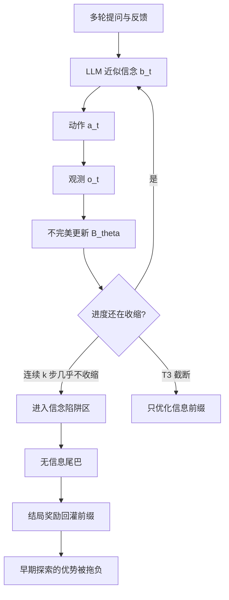

# Belief-Deviation：信念偏了，结局奖励会把前半段探索一起骂掉

<!-- release-date: 2025-10-14 -->

**本文依据**：封面正式标题 *Reducing Belief Deviation in Reinforcement Learning for Active Reasoning of LLM Agents*，arXiv 2510.12264v2（2026-03-03），35 页 letter。封面已印 **Published as a conference paper at ICLR 2026**。作者 Deyu Zou†、Yongqiang Chen†、Jianxiang Wang、Haochen Yang、Mufei Li、James Cheng‡、Pan Li‡、Yu Gong；第一单位 The Chinese University of Hong Kong，合作 ByteDance、Georgia Institute of Technology。共同一作 Zou / Chen，通讯 Cheng / Li。首发日取 arXiv v1 提交日 2025-10-14；本地读的是 v2，数字与页码均对应该 PDF。实现仓 [unimpor/T3](https://github.com/unimpor/T3)。标「外部补充」的段落不来自本文。

## 一句话

主动推理要多轮问环境、自己维护「现在还剩哪些可能」。LLM 的信念更新不准，轨迹会滑进 **信念陷阱区（Belief Trap Region，BTR）**：后面几步不再收缩假设、动作重复或越界，结局奖励却还要回头给前半段打分。结局式 RL 里尾巴足够长，早期探索的优势估计会被拖成负的，梯度方向甚至反了。**T³**（Truncating Belief-Trapped Trajectories，截断信念受困轨迹）用可观察的进度代理检测「连续若干步没有信息增益」，把训练轨迹在进陷阱时截断，保住前缀信用。五任务上接到 PPO / GRPO / GSPO 都能用；摘要写最多提升 30 点、token 最多省 34%（PDF p.1）。主表里更大的一格是 GSPO 在 MovieRecommendation 上 **+41.0** 点（14.67 → 55.67，PDF p.6 表 1）；token 那句对应 CD 上 PPO 达到奖励 0.65 时消耗 vanilla 的 **66.4%** 总 token，即约省 33.6%，摘要四舍五入成 34%（PDF p.8）。

## 一、矛盾：多轮主动推理不是「把题答完」，是「信念会漂」

单轮数学、代码：题面完整，结局对错打在这一条回答上。主动推理不是这样：信息一开始就不齐，智能体必须自己提问、根据反馈改内部对隐状态的估计（PDF p.1）。作者把这件事写成 POMDP：隐状态空间 $S$、动作（提问）$A$、观测 $O$，每步按信念 $b_t\in\Delta(S)$ 选 $a_t$，环境按真状态 $s^\star$ 给 $o_t$（PDF p.3）。经典 POMDP 假设信念能用贝叶斯滤波精确更新；LLM 没有这套算子，信念只藏在推理痕迹里，更新规则 $B_\theta$ 会错（PDF p.2）。

经验上，多轮交互会出现冗余、无关、循环提问，RL 训完仍可能全局次优、换任务就不稳（PDF p.1）。作者问的不是「再换一个 RL 算法」，而是：

> 为什么 LLM Agent 会在主动推理里卡住，以及怎样拦住它？

贯穿全文的机制是 **belief deviation（信念偏离）**：内部信念漂离真实问题状态，状态意识丢了，动作不再提供信息。这些坏尾巴写进 RL 轨迹后，信用分配被污染，探索被压住（PDF p.1）。

封面例子（PDF p.2 图 1）：情景谜题里已经问出「是不是孪生兄弟被处决」，vanilla 还在换说法重复同一问题，法官一直 Yes，轨迹进入 BTR；T³ 在早期截断，后面的信用只打在真正缩小假设的那几步上。

图是机制示意，对应 PDF p.2 图 1。

## 二、把进度写成势函数，再定义陷阱

真状态 $s^\star$ 一集内固定，只作分析用，智能体看不见（PDF p.3）。oracle 用贝叶斯算子 $B^\star$ 更新 $b^\star_t$；LLM 用 $B_\theta$ 更新 $b_t$（PDF p.3 式 (1)）。

**势函数**（人话：离「确信真答案」还有多远）：

$$\Psi(b):=-\log b(s^\star)$$

$\Psi=0$ 当且仅当 $b(s^\star)=1$；越小越好（PDF p.3）。一步更新误差 $c_\theta(b_t)$ 是 LLM 更新后的 $\Psi$ 相对贝叶斯更新的期望差（PDF p.3 式 (2)）。

**假设 1（更新误差会放大）**：当 $\Psi(b)\ge U_0$ 时，$c_\theta(b)\ge m_\theta\Psi(b)-c_0$。不确定度已经高时，错更新至少随 $\Psi$ 线性变差（PDF p.3）。附录 C 在 PreferenceEstimation 上用 $\lVert w_t-w^\star\rVert_2^2$ 当 $\Psi$ 的代理、线性高斯当 oracle 更新，对 Qwen-2.5-7B / 32B 拟合下包络：7B 取 $\hat U_0=10$，拟合 $\hat c_\theta=0.0969\times\hat\Psi-3.0478$；32B 取 $\hat U_0=2$，拟合 $0.4655\times\hat\Psi-1.5158$（PDF p.25 图 7）。这是作者自己的经验拟合，不是证明假设成立。

**定理 1（非正式）**：观测非退化、策略对信念 Lipschitz、再加假设 1，则一旦 $\Psi_t$ 越过阈值 $U$，期望进度不再下降：$\mathbb{E}[\Psi_{t+1}\mid b_t]\ge\Psi_t$。进入时刻 $t_S$ 还有上界（PDF p.3）。

**定义 1 · BTR**：对参数 $\theta$ 的信念陷阱区 $R_\theta\subseteq\Delta(S)$ 是吸收的，且进去之后期望进度非正（PDF p.4）。

有限可枚举假设集上，若信念在 $H_t$ 上均匀且真解还在里面，则 $\Psi(b_t)=\log|H_t|$，候选集大小就是可观察的势（PDF p.5）。

## 三、为什么尾巴会把前缀梯度拧反

训练是 **outcome-based RL**：中间步奖励为 0，只有终点给非零奖励（PDF p.4、p.32）。优势用 GAE：

$$\hat A_t=\sum_{j=0}^{T-t-1}(\gamma\lambda)^j\delta_{t+j},\qquad \delta_t=r_t+\gamma V_{t+1}-V_t$$

**定理 2（非正式）**：价值是 $b_t(s^\star)$ 的递增可微函数，且 BTR 内信念质量以速率 $\rho_b$ 往下掉，则早期步的期望优势被「前缀几何和 $S_{\mathrm{pre}}$ 减尾巴几何和 $S_{\mathrm{tail}}^{\ominus}$」卡住。$\gamma\lambda\to 1$（长程 agentic RL 常用）时，拧反的充分条件变成 $\kappa_V\rho_b>\Delta/L$，其中 $\Delta$ 是前缀长度、$L$ 是尾巴长度（PDF p.4）。尾巴越长，$L$ 越大，越容易把前缀梯度拧到惩罚探索的方向。

**推论 1**：在 $t_S$ 截断后，$\mathbb{E}[\hat A_t^{\mathrm{pre}}]\ge\mathbb{E}[\hat A_t]+\gamma\kappa_V\rho_b S_{\mathrm{tail}}^{\ominus}(t)$，偏差更小（PDF p.4）。

失败 rollout 上，CD / PE 的早期 token 平均 GAE 在无截断时有负漂，T³ 后漂减弱（PDF p.3 图 2c–d、p.25 图 8）。尾巴从 6 轮拉到 15 轮，早期优势压得更狠；窗口 $k$ 越小（截得越狠），前缀优势越干净（PDF p.25 图 8c–d）。假阳性截断（成功轨迹在第 3 轮被随机砍）会反过来削掉早期优势（PDF p.26–27 图 9）——截错也有代价。

理想规则不可直接用：信念不显式、$U$ 与 $m_\theta$ 测不到（PDF p.4）。于是换成可观察代理。

## 四、T³：连续 k 步「假设集几乎不收缩」就停

**定义 2 · T³ 条件**：假设空间 $H_t$，细化度量 $d(H_\tau,H_{\tau+1})$，最小进度 $\Delta_{\min}\ge 0$，窗口 $k$。若窗口 $[t-k,t)$ 内每步 $d\le\Delta_{\min}$，在 $t$ 截断（PDF p.4）。

**命题 1**：BTR 外真进度有正裕量 $\rho$，代理是有偏高斯噪声。若 $\Delta_{\min}<\rho-M_d$，则 $k(\rho-M_d-\Delta_{\min})^2\ge 2\sigma^2\log(1/\delta)$ 时，任意 $k$ 步非 BTR 段上的假截断概率低于 $\delta$（PDF p.5）。减小代理偏差、加大 $k$、减小 $\Delta_{\min}$，假截断指数下降。

它是 **meta-wrapper**：不改 PPO / GRPO / GSPO 目标，只改 rollout 何时停（PDF p.5）。正文一处把 GRPO 误写成 GPRO（PDF p.2），后文与附录一律是 GRPO。

### 五个任务上的代理（PDF p.5–6）

| 任务 | 来源 | $H_t$ | 截断规则 | 主实验 $k$ |
|---|---|---|---|---|
| GuessNumbers（GN） | 作者构造，规则反馈 | 与历史一致的候选数字 | 猜测落在 $H_{t-1}$ 外（逻辑越界） | $k=1$ |
| SituationPuzzles（SP） | AR-Bench | 对话下仍合理的解释（可无界） | 法官连续答 unknown | $k=5$ |
| CircuitDecoding（CD） | Multi-Turn Puzzles | 仍存活的电路候选 | $\|H\|$ 连续不收缩 | $k=3$ |
| PreferenceEstimation（PE） | 同上 | 连续偏好向量子空间 | 与真偏好相似度连续下降 | $k=2$ |
| MovieRecommendation（MR） | PE 的推广 | 同上，最后推荐未见电影 | 与 PE 相同 | $k=2$ |

GN 的 $d:=|H_\tau|-|H_{\tau+1}|$。SP 主实验用 Qwen2.5-14B-Instruct 当法官；§3.3.3 另测无法官的问句嵌入相似度（PDF p.6、p.8）。PE/MR 训练时代理用到 $v^\star$；附录 D.3 给出只看 $\hat v_t$ 滑动平均更新幅度的无真值规则（PDF p.6、p.27–28）。

## 五、实验怎么摆

主模型 Qwen2.5-7B-Instruct。对照：零样本 o3-mini、Gemini-2.5-Pro；PPO、GRPO、GSPO（PDF p.6）。GN / CD / PE / MR 规则反馈；SP 用 14B 模拟用户（PDF p.6）。

指标：GN / CD / MR 用 Exact Match；SP 用词级与字符级 F1；PE 用 Binary Similarity——余弦阈值 **0.88**，超过为 1（PDF p.7）。附录表 5：阈值 0.85 / 0.88 / 0.90 / 0.95 时 vanilla PPO 为 55.33 / 42.00 / 33.67 / 4.33，PPO+T³ 为 63.00 / 49.00 / 37.67 / 3.67（PDF p.27）。0.95 几乎学不动；主实验取 0.88 是作者选的稳健区，不是唯一最优。

数据规模（PDF p.31 表 9）：

| 任务 | 训练 | 测试 |
|---|---:|---:|
| SP | 400 | 100 |
| GN | 1526 | 382 |
| CD | 1000 | 300 |
| PE | 700 | 300 |
| MR | 700 | 300 |

最长轮次：GN 10、SP 15、CD 10、PE 10、MR 5。奖励只在终点：GN/CD/MR 为 EM，SP 为 F1，PE 为 Binary Similarity（PDF p.32）。200 步，学习率 $1.0\times 10^{-6}$，FSDP + BF16，vLLM TP=1。GN/SP 在 8×H100，CD/PE/MR 在 8×B200，后端 Verl（PDF p.32）。PPO：GAE $\lambda=1$、$\gamma=1$，KL $\beta=0.001$，clip $\varepsilon=0.2$。GRPO：每 prompt 5 条。GSPO：无 KL，$\varepsilon_{\mathrm{low}}=0.0003$、$\varepsilon_{\mathrm{high}}=0.0004$（PDF p.32）。温度：SP 1.0、GN 0.6；top-p 全 0.95。

GN 为控第一步随机，固定一个不等于答案的初猜，并按 $(a,b,x_0,y_0)$ 分组（PDF p.30）。

## 六、五任务主结论：表 1 为准

表 1 指标已 ×100（PDF p.6）。摘要「最多 30 点」对上 GRPO 在 GN 的 **+30.1**（61.26 → 91.36）；同一张表 GSPO 在 MR 是 **+41.0**（14.67 → 55.67），比摘要更大。GSPO 在 SP 的 F1-char 为 **82.08 ↓ 0.1**（相对 82.17），18 格里唯一下降。作者说 14/18 格有非边际增益（PDF p.7）。

| 方法 | CD EM | SP F1-word | SP F1-char | GN EM | PE BinarySim | MR EM | 平均排名 |
|---|---:|---:|---:|---:|---:|---:|---:|
| o3-mini | 92.67 | 20.64 | 39.35 | 95.28 | 44.67 | 83.33 | 4.67 |
| Gemini-2.5-Pro | 92.23 | 24.12 | 49.28 | 90.84 | 16.67 | 83.00 | 5.67 |
| Qwen-2.5-7B-Inst. 零样本 | 12.50 | 19.46 | 41.62 | 20.94 | 23.67 | 27.67 | 8.17 |
| PPO | 61.67 | 28.77 | 74.56 | 91.62 | 42.00 | 24.33 | 6.50 |
| PPO w/ T³ | 77.83 ↑16.2 | 36.85 ↑8.1 | 81.50 ↑6.9 | 93.98 ↑2.4 | 49.00 ↑7.0 | 38.00 ↑13.6 | 4.50 |
| GRPO | 79.33 | 36.46 | 83.73 | 61.26 | 51.67 | 12.00 | 5.50 |
| GRPO w/ T³ | 81.33 ↑2.0 | 39.45 ↑3.0 | 84.58 ↑0.8 | 91.36 ↑30.1 | 52.33 ↑0.7 | 32.67 ↑20.7 | 3.17 |
| GSPO | 77.67 | 36.63 | 82.17 | 96.07 | 59.00 | 14.67 | 4.33 |
| GSPO w/ T³ | 81.00 ↑3.3 | 36.96 ↑0.3 | 82.08 ↓0.1 | 99.74 ↑3.7 | 62.00 ↑3.0 | 55.67 ↑41.0 | 2.50 |

有限可枚举任务（GN、CD）上，前沿推理模型零样本已经很强；无界 / 连续假设空间（SP、PE）上，带 T³ 的 7B RL 可以超过它们（PDF p.7）。作者据此说：只靠大规模结局 RL 不够对付无界假设空间，信用分配机制是补丁。

训练曲线：vanilla 方差大、部分收敛后塌；T³ 更接近单调、少骤降（PDF p.7 图 3）。回复长度随截断变短（PDF p.7 图 4）。相对训练步，早期奖励爬坡可能略慢；相对 token，更省。CD 上 PPO 到奖励 0.65：T³ 消耗 vanilla **66.4%** token；GN 上 GSPO 到 0.96：消耗 **76.3%**。T³ 还能继续把 CD 推到约 0.8、GN 到约 0.99，vanilla 往往停住（PDF p.8）。$1-0.664=0.336$，即文内可核对的最大 token 节省约 33.6%，摘要写 34%。

## 七、OOD、消融、尺度

表 2（PDF p.8），PPO。PE 用 7B，CD 用 14B。训练：CD 隐电路 2、候选 10；PE 参考电影 10、均匀采样。

PE 参考集大小 $S$：vanilla 在 $S=5/10/15/20/30$ 为 40.0 / 42.0 / 39.3 / 41.0 / 42.3，T³ 为 44.3 / 49.0 / 47.0 / 53.7 / 46.3，最大增益 $S=20$ 的 **+12.7**。采样：min-max / uniform / max 上 T³ 为 +10.3 / +7.0 / +10.7。CD 候选 $S=10$–$30$：T³ 为 +18.5 / +13.0 / +7.7 / +10.8 / +4.2；隐电路 $C=2/3/4$：+18.5 / +15.0 / +6.6。更难时绝对分下降，增益仍在。附录表 6：参考集从 10 增到 30，截断比例总体上升（7B：50.67% → 56.67%），作者把它当作冗余诱发 BTR 的旁证（PDF p.27）。

表 3 消融（PDF p.8）：

- SP（GRPO）：$k=5$ 最好（39.45）；$k=9$ 相对 vanilla **↓0.50**。问句相似度 $\alpha=0.9/0.93/0.96$ 仍高于 vanilla，嵌入用 E5-large-v2。
- CD（PPO）：$k=3$ 为 +16.2，$k=4$ 为 +17.6。随机截断 $\beta=0.1$ 仍 +7.33；$\beta=0.2$ 为 **↓4.17**，$\beta=0.5$ 为 **↓48.5**（13.17）。
- PE（PPO）：$k=2$ 最好（+7.00）；$\beta=0.8$ 为 ↓3.00。

图 5：无界任务（SP、PE）高且稳的截断比例往往对应更好终绩；有限任务（CD）中等偏低比例更好，$k=1,2$ 截太狠会伤（PDF p.9）。PE 上随机截断 $\beta=0.5,0.8$ 的截断比例能接近 $k=2$，终绩却差——比例相似不等于进的是 BTR。

尺度（PDF p.9–10 图 6）：Qwen-2.5 3B 增益有限，7B / 14B 更明显。作者猜测小模型 $m_\theta$ 更大，更快掉进 BTR，截断也救不出信息前缀。架构：LLaMA-3.1-8B-Instruct 上 T³ 边际小，Qwen-2.5-7B 与 DeepSeek-R1-Distill-LLaMA-8B 更大；蒸馏版加 T³ 总体最好。这是作者观察，不是因果实验。

无真值 PE（附录表 7，PDF p.28）：$\varepsilon$ 取离线更新幅度 60% / 75% / 85% 分位数（0.18 / 0.28 / 0.36），BinarySim 44.33 / **50.67** / 49.00，对照 vanilla 42.00、带 $v^\star$ 的 T³ 49.00。75% 分位数超过主文 oracle 代理。自适应阈值每 6 步用在线未截断 rollout 更新（表 8）：$\alpha=0.6$ 时 **60.33**，高于 T³-gt 49.00；$\alpha=0.9$ 时 39.67，低于 vanilla（PDF p.28）。非单调，作者留给未来。

## 八、和相关工作差在哪

主动推理前作多在澄清提问、不确定性度量（Proactive CoT、UoT）；多轮仍难（PDF p.10）。信用分配一侧：中间奖励塑造、CURIO 在**有限可枚举**信念上做势、Sotopia-RL 用专有模型标奖励、SPA-RL 用和约束训过程奖。T³ 不另训过程奖，只在信念偏离压过信用之前停 rollout（PDF p.10）。

未来工作（附录 E.1）：语义冗余（问句相似、偏好向量停更）已有初步正结果；隐状态连续高相似仍是开放方向，尤其开放域没有结构化 $H$（PDF p.29）。

## 九、没写清的、以及可迁移的

原件没有把 T³ 接到网页浏览、工具调用或开放域对话的主实验；代理大多吃任务结构，PE 主规则训练时看得到 $v^\star$。假截断会伤前缀（附录 C.3）。3B 与原版 LLaMA-Instruct 增益薄。GSPO 在 SP F1-char 上有一格小跌。仓库路径给了，本文不核代码是否与论文一致。

可直接搬走的不是「再发明一个 RL」，而是：

1. **先画假设集有没有在收缩**，再决定这条轨迹还值不值得把结局奖励广播回每一个 token。
2. **结局奖励 + 长尾巴** 时，先检查早期优势是否被失败尾巴拖负；截断是便宜的第一刀，随机截断偶尔也有正效应，说明问题在尾巴，不在某个算法商标。
3. **窗口 $k$ 要跟 $H$ 的结构匹配**：无界空间可以截得更勤，有限空间截太狠等于掐死还在消元的探索。
4. 代理可以先任务特化，再换成问句相似或信念更新幅度；无真值、自适应分位数在 PE 上已经能打平或超过 oracle 代理。
5. 小模型信念跟踪弱时，截断救不了「前缀里根本没有信息」——先把更新误差降下来，再谈信用。

## 关键词回看

- **主动推理（active reasoning）**：信息不齐时多轮向环境要证据。
- **信念偏离（belief deviation）**：内部信念漂离真状态。
- **信念陷阱区（BTR）**：吸收、期望进度非正的信念集合。
- **T³**：用假设收缩代理检测持续停滞并截断训练轨迹。
- **势 $\Psi(b)=-\log b(s^\star)$**：离确信真解的距离。
