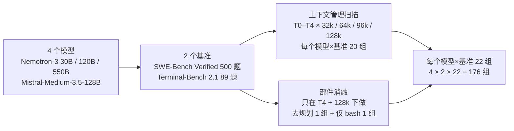

# 拆开编码 Agent 的 harness：上下文管理、规划和工具集各在什么条件下值钱

<!-- release-date: 2026-09-17 -->

> 本文依据 **An Empirical Study of Harness Design for Coding Agents**，arXiv 2609.20804v1（2026-09-17），共 43 页，页码均指这份 PDF。作者 Run-Ze Fan、Zihao Zhang（共同一作）、Simin Ma、Yebowen Hu、Shouju Wang、Kaiqiang Song、Fei Liu、Hamed Zamani、Xiaoyang Wang；机构为 UMass Amherst、Zoom、Emory University、UNC Charlotte，脚注说明 3 位作者的工作在 Zoom Video Communications 实习期间完成（PDF p. 1）。正文把三层分开：**论文明确写了什么**、**我们如何解释或验算**、**外部补充**。

## 读前先把几个词说成人话

- **Harness（外壳、脚手架）**：把大模型变成能干活的 Agent 的那层软件。它决定模型每一轮看到什么、能调用哪些动作、历史太长时怎么办。Claude Code、Codex、OpenHands 都属于这一层（PDF p. 15）。
- **ReAct 循环**：每一轮「想一下 → 做一个动作 → 看结果」，结果追加进历史，下一轮再来（PDF p. 3）。
- **上下文窗口预算（context-window budget）**：模型一次最多能读的 token 数。本文人为把它卡在 32k、64k、96k、128k 这 4 档（PDF p. 2）。
- **上下文管理（context management）**：历史越滚越长时，删哪些、压哪些、存哪些。本文拆成 3 个机制：**省略**（elision，M1）把旧工具输出换成一行占位符；**召回**（recall，M2）把被省略的原文存到外部，模型可以用 `recall_event` 取回；**摘要**（summarization，M3）把老历史折成一段自然语言总结（PDF p. 5）。
- **规划（planning）**：让模型维护一份显式待办清单，每轮都把它重新喂回去（PDF p. 3）。
- **动作空间（action space）**：模型能调用的工具集合。「预定义工具集」是 `read_file`、`edit_file`、`grep_text` 这类带类型参数的专用工具；「仅 bash」是只给一个 shell（PDF p. 3）。
- **SWE-Bench Verified**：500 个经人工核实的真实 GitHub issue，要求在仓库里改代码修好；**Terminal-Bench 2.1**：89 个命令行环境里的端到端任务（PDF p. 6）。
- **成功率（SR）与单题成本**：成功率是解决的题目比例；成本按 OpenRouter 的公开价把 token 数折成美元（PDF p. 6）。

## 一句话先说清

同一个模型换一套 harness，分数可以差很多；可比较两套完整 harness 时，你分不清功劳属于规划、工具设计、上下文管理，还是它们与模型的相互作用（PDF p. 2）。这篇论文自己搭了一个轻量 harness，把执行循环钉死，只拧 3 个旋钮，在 4 个模型、2 个基准上跑了 176 组配对设置（PDF p. 1）。

结论不是「哪个部件最好」，而是「每个部件在什么条件下值钱」（PDF p. 1、p. 15–16）：

1. **上下文管理的价值随窗口收紧而变大**，它的收益主要来自防止窗口溢出导致任务中途被掐断。
2. **先规则省略、再 LLM 摘要（T4）最省钱**，成功率与其他管理策略相当；让省略可以撤销的召回机制几乎没人用，也不涨分。
3. **规划对弱模型是保命绳，对强模型是省钱器**：弱模型靠它撑到第一次改代码，强模型靠它少做冗余验证。
4. **预定义工具帮 bash 不熟的模型，仅 bash 让 bash 熟练的模型更便宜**，而且这个交叉点还取决于任务有多偏命令行。

论文最后一句话把全篇收成一个判断：harness 设计是一个条件性的系统问题，每个部件都应按目标模型、任务类型和资源预算挑选，而不是当成默认配置照搬（PDF p. 16）。

### 一条阅读路线

1. **p. 4 Figure 2 与 p. 5 Algorithm 1**：先看清 harness 长什么样，以及 T4 在每一轮怎么压历史。
2. **p. 6 的实验设定**：176 组是怎么数出来的，成本怎么算，显著性怎么检验。
3. **p. 7–8 Table 3、Table 4**：全部主结果，其余图都是这两张表的不同切法。
4. **p. 9 Figure 3**：上下文管理的收益和 T0 溢出率几乎一起消失。
5. **p. 10 Figure 5**：T4 为什么最便宜。
6. **p. 11 Table 5、p. 12 Figure 8、p. 13 Table 6**：规划在弱模型和强模型上是两种完全不同的作用。
7. **p. 11 Figure 7、p. 14 Table 7**：仅 bash 改变的是写代码的粒度。

附录 A、B 把全部提示词和工具描述原样贴出（PDF p. 19–28），附录 C 是轨迹标注与全量统计（PDF p. 26–43），第一遍可以只当查表用。

## 主要矛盾：整套比较，分不清功劳是谁的

论文开场举的例子是一次跨 harness 评测：Claude-Opus-4.5 在 OpenHands 里表现最好，Claude-Sonnet-4.5 却在 SWE-Agent 里表现最好（PDF p. 2，引 Cao 等人 2026）。这说明 harness 偏好会随模型变化。但两套完整 harness 同时在规划、工具、上下文管理上都不一样，分数差了，你不知道是哪一块造成的。

已有的消融研究也没补上这一块。论文点名的最接近工作是 Liu（2026），它在短程推理任务上做提示层面脚手架的全因子实验，但没有碰上下文窗口压力（PDF p. 15）。这篇要补的空白有两个维度同时拉开（PDF p. 2）：

- **一条显式的上下文窗口扫描**：从 32k 到 128k；
- **一条同家族的模型规模轴**：Nemotron-3 的 30B、120B、550B。

于是问题被写成：

> harness 部件是普遍有用的，还是每个部件的效果取决于模型能力、任务类型和资源预算？（PDF p. 2）

## 全景：一个钉死的 ReAct 循环，加 3 个旋钮

上图上半部分是整个 harness 的一轮（PDF p. 4）。每一轮先拼输入：系统提示、任务描述、动作 schema、当前计划、经过管理的上下文历史。模型发出工具调用，在 Docker 或 E2B 容器里执行，结果作为观察追加进历史 $H$；模型不再发动作时，输出最终答案。

3 个旋钮各从一个入口插进来（PDF p. 4，Figure 2 图注）：

- **规划**从「当前计划」这一块进来。它每轮注入，但单独存放，不写进对话历史；
- **动作空间**从「动作 schema」这一块进来，决定模型能看到哪些工具；
- **上下文管理**从「管理后的历史」进来，决定模型能看见多少过去。

下半部分是 T4 策略的完整流程，放到核心设计一再细讲。

实验矩阵这样数出来（PDF p. 6）：

这张图按 PDF p. 6 的「Ablation Settings」一段重画，是实验设计示意，不是论文原图。要注意的是：上下文管理扫描时，规划和预定义工具集都是开着的；规划和动作空间的消融**只在 T4/128k 这一个点上做**（PDF p. 6）。作者在限制一节承认，这是算力所限，要知道它们在别的组合下是否成立得做全因子实验（PDF p. 16）。

### 被钉死的底座：不在实验里拧，但每组都有

为了让 3 个旋钮的效果可以单独估计，下面这些部件在所有消融里保持不变（PDF p. 5–6）：

- **安全三道闸**：路径守卫拒绝任何跳出项目根目录的路径（包括经由符号链接）；读后才能写，本会话没读过的文件拒绝编辑或覆盖，并用内容哈希发现外部改动；权限层把每个动作分成允许、询问、拒绝。工具错误作为观察返回给模型，不抛异常，失败的动作不会让循环崩掉。
- **改后诊断**：模型编辑或写入 Python 文件后，harness 立刻用 ruff、pyflakes 或仅语法检查跑一遍，把结果附在工具输出后面，让模型在跑测试前先修掉语法错误、未定义名和多余导入。
- **卡死检测**：连续相同的工具调用（工具名和参数逐字节相同）达到 5 次，或连续 5 次相同的失败调用，插入一次换思路的提醒；相同的失败调用连到 8 次，直接以专门的停止原因结束，不再耗到步数上限（PDF p. 6、p. 21–22）。权限拒绝不算失败（PDF p. 22）。

实现细节同样写在 p. 6：harness 基于 LangGraph，基准由 Harbor 驱动，Harbor 管每题的容器和判分器；每题最多 300 步；工具结果截断到 24k 字符；每步最多并行 8 个只读工具。所有模型用 SGLang 在本地以 BF16 服务，温度 0，top-p 0.95，每轮输出上限 16,384 token（PDF p. 6）。

**我们如何解释它。** 模型是本地服务的，成本却按 OpenRouter 的公开价折算（PDF p. 6）。所以文中的「成本」本质上是**按标价加权的 token 用量**，不是真实账单。它适合比较同一个模型在不同 harness 下的相对变化；跨模型比绝对值时，价差会直接混进来——Mistral-Medium-3.5 的输入价是 Nemotron-3 550B 的 3 倍、输出价约 3.4 倍（每百万 token 输入 1.50 对 0.50 美元，输出 7.50 对 2.20 美元，PDF p. 6）。

### 怎么判定「显著」

每个基准内部分 3 个比较族：各管理策略对 T0、规划开对关、全工具集对仅 bash。族内用题目配对的双侧精确 McNemar 检验比成功率，再用 Benjamini–Hochberg 方法把错误发现率控制在 0.05（PDF p. 6）。McNemar 检验的意思是：只看「这题 A 做对 B 做错」和「这题 A 做错 B 做对」这两类不一致的题目，判断两边是否真有差别。

## 主结果总表

下面两张表是 Table 3 与 Table 4 的完整转录（PDF p. 7、p. 8）。每格写成「成功率 % / 单题成本 $」，† 表示与配对基线相比在 BH 校正后 $q<0.05$ 显著（原表用 * 号）。上下文管理各行的配对基线是同窗口的 T0；最后两行的配对基线是 128k 的 T4。

**SWE-Bench Verified**（Table 3，PDF p. 7）：

| 窗口 | 设置 | Nemotron-3 30B | Nemotron-3 120B | Nemotron-3 550B | Mistral-3.5-128B |
|---|---|---:|---:|---:|---:|
| 32k | T0 | 9.40 / 0.04 | 11.40 / 0.05 | 6.40 / 0.26 | 12.60 / 0.87 |
| 32k | T1 | 20.60† / 0.09 | 43.00† / 0.35 | 51.40† / 2.57 | 64.40† / 2.16 |
| 32k | T2 | 20.80† / 0.09 | 42.20† / 0.36 | 53.60† / 2.70 | 66.20† / 2.12 |
| 32k | T3 | 23.80† / 0.11 | 39.60† / 0.18 | 58.40† / 1.25 | 63.20† / 2.52 |
| 32k | T4 | 21.20† / 0.11 | 42.20† / 0.17 | 55.60† / 1.45 | 63.80† / 2.04 |
| 64k | T0 | 20.80 / 0.07 | 34.00 / 0.10 | 29.40 / 0.97 | 52.80 / 2.47 |
| 64k | T1 | 23.40 / 0.09 | 45.40† / 0.39 | 63.80† / 2.22 | 69.00† / 2.65 |
| 64k | T2 | 24.40 / 0.09 | 43.20† / 0.32 | 64.60† / 2.17 | 67.80† / 2.61 |
| 64k | T3 | 26.40† / 0.10 | 43.60† / 0.23 | 65.80† / 1.78 | 68.40† / 2.66 |
| 64k | T4 | 25.80† / 0.08 | 41.80† / 0.21 | 63.40† / 1.78 | 66.00† / 2.48 |
| 96k | T0 | 24.00 / 0.09 | 39.60 / 0.20 | 51.00 / 1.60 | 66.20 / 3.01 |
| 96k | T1 | 23.20 / 0.09 | 43.20 / 0.33 | 65.00† / 2.25 | 68.80 / 3.13 |
| 96k | T2 | 23.60 / 0.09 | 45.40† / 0.37 | 67.20† / 2.33 | 66.20 / 3.15 |
| 96k | T3 | 23.60 / 0.09 | 46.20† / 0.36 | 66.80† / 2.32 | 67.60 / 3.12 |
| 96k | T4 | 24.80 / 0.09 | 43.40 / 0.30 | 66.80† / 1.97 | 68.60 / 2.85 |
| 128k | T0 | 24.80 / 0.09 | 40.20 / 0.25 | 59.80 / 2.08 | 67.40 / 3.27 |
| 128k | T1 | 25.00 / 0.10 | 44.40 / 0.39 | 65.20† / 2.47 | 68.60 / 3.25 |
| 128k | T2 | 26.00 / 0.10 | 45.20† / 0.35 | 67.40† / 2.64 | 67.00 / 3.10 |
| 128k | T3 | 23.60 / 0.11 | 44.00 / 0.35 | 65.80† / 2.54 | 66.60 / 3.26 |
| 128k | T4 | 25.20 / 0.09 | 44.00 / 0.34 | 65.80† / 2.33 | 68.60 / 3.14 |
| 128k | T4 去规划 | 13.60† / 0.02 | 46.60 / 0.25 | 67.80 / 3.31 | 69.00 / 4.65 |
| 128k | T4 仅 bash | 10.20† / 0.03 | 42.40 / 0.35 | 69.40† / 1.11 | 45.40† / 1.72 |

**Terminal-Bench 2.1**（Table 4，PDF p. 8）：

| 窗口 | 设置 | Nemotron-3 30B | Nemotron-3 120B | Nemotron-3 550B | Mistral-3.5-128B |
|---|---|---:|---:|---:|---:|
| 32k | T0 | 6.74 / 0.04 | 19.10 / 0.09 | 28.09 / 0.26 | 21.35 / 0.76 |
| 32k | T1 | 11.24 / 0.12 | 33.71† / 0.44 | 33.33 / 1.97 | 39.33† / 2.15 |
| 32k | T2 | 7.87 / 0.12 | 25.84 / 0.46 | 33.33 / 1.80 | 35.96† / 2.45 |
| 32k | T3 | 14.61 / 0.11 | 22.47 / 0.13 | 38.20† / 0.74 | 42.70† / 1.91 |
| 32k | T4 | 17.98† / 0.11 | 21.35 / 0.14 | 32.58 / 0.82 | 42.70† / 1.88 |
| 64k | T0 | 11.24 / 0.08 | 20.22 / 0.13 | 30.34 / 0.66 | 30.34 / 1.78 |
| 64k | T1 | 14.61 / 0.12 | 29.21 / 0.28 | 41.57 / 2.11 | 37.08† / 2.74 |
| 64k | T2 | 11.24 / 0.12 | 26.97 / 0.32 | 40.45 / 2.35 | 37.08 / 2.17 |
| 64k | T3 | 14.61 / 0.12 | 26.97 / 0.20 | 43.82† / 1.61 | 42.70† / 2.51 |
| 64k | T4 | 13.48 / 0.10 | 25.84 / 0.22 | 44.94† / 1.16 | 38.20 / 2.51 |
| 96k | T0 | 12.36 / 0.11 | 19.10 / 0.28 | 33.71 / 1.14 | 33.71 / 2.60 |
| 96k | T1 | 15.73 / 0.14 | 22.47 / 0.23 | 42.70 / 2.47 | 37.08 / 3.00 |
| 96k | T2 | 11.24 / 0.15 | 21.35 / 0.37 | 43.82† / 2.71 | 38.20 / 3.12 |
| 96k | T3 | 17.98 / 0.16 | 28.09 / 0.32 | 34.83 / 2.14 | 39.33 / 2.84 |
| 96k | T4 | 13.48 / 0.13 | 25.84 / 0.25 | 44.94† / 1.66 | 35.96 / 2.79 |
| 128k | T0 | 11.24 / 0.12 | 25.84 / 0.27 | 34.83 / 1.65 | 34.83 / 3.32 |
| 128k | T1 | 10.11 / 0.15 | 22.47 / 0.40 | 40.45 / 2.68 | 40.45 / 3.71 |
| 128k | T2 | 16.85 / 0.15 | 25.84 / 0.32 | 40.45 / 2.37 | 37.08 / 4.16 |
| 128k | T3 | 12.36 / 0.16 | 26.97 / 0.30 | 37.08 / 2.26 | 38.20 / 3.65 |
| 128k | T4 | 13.48 / 0.14 | 28.09 / 0.28 | 44.94† / 2.43 | 37.08 / 2.22 |
| 128k | T4 去规划 | 8.99 / 0.08 | 28.09 / 0.38 | 46.07 / 2.52 | 39.33 / 3.71 |
| 128k | T4 仅 bash | 3.37† / 0.02 | 23.56 / 0.41 | 50.56 / 1.70 | 43.82 / 2.75 |

读表先记住三件事：

- 32k 的 T0 一栏几乎全军覆没，SWE-Bench 上 550B 只有 6.40%（PDF p. 7）。这不是模型不会修 bug，是窗口装不下。
- Terminal-Bench 的 † 少得多。它只有 89 题，每组每题只跑 1 次，很多对比过不了配对检验；作者明说那边的结论靠的是跨模型、跨预算方向一致，而不是单格显著（PDF p. 16）。
- 规划和仅 bash 两行只有 128k 这一个窗口，别把它们外推到 32k。

## 核心设计一：上下文管理，主要是在防溢出

### 旧问题：窗口一满，任务就被掐断

编码 Agent 要读代码、跑测试、看报错，历史里塞满大段工具输出。T0 不做任何跨轮压缩，历史超出窗口就报错终止（PDF p. 5）。窗口越小，越多任务死在半路。

### 论文怎么量：管理收益 = 管理策略与 T0 的成功率差

作者把「上下文管理的价值」定义成同窗口下 T1–T4 平均成功率减去 T0 成功率，再对 4 个模型取平均（PDF p. 7）。结果是一条干净的下降线（PDF p. 7）：

| 窗口 | SWE-Bench 管理收益（百分点） | Terminal-Bench 管理收益（百分点） | SWE-Bench T0 溢出率 | Terminal-Bench T0 溢出率 |
|---|---:|---:|---:|---:|
| 32k | 35.7 | 9.5 | 78.7% | 61.0% |
| 64k | 15.9 | 7.5 | — | — |
| 96k | 5.5 | 4.8 | — | — |
| 128k | 2.7 | 2.8 | 8.7% | 12.1% |

溢出率一栏正文只给了两端（PDF p. 7），中间两档只画在 Figure 3 里。所有管理策略在所有预算下的溢出数都是 0（PDF p. 7、p. 9）。

我们用 Table 3 验算了 32k 那一格：4 个模型 T1–T4 的平均成功率是 45.6%，T0 平均 9.95%，差 35.7 个百分点，与原文一致（PDF p. 7）。

Figure 3 上最值得看的是黑线和橙线的镜像关系：T0 溢出率往下走多少，黑线就往上追多少，灰色阴影（管理收益）跟着收窄（PDF p. 9）。论文的判断是：上下文管理之所以有价值，主要是因为在窗口吃紧时避免了过早截断；当越来越多不做管理的轨迹也能装进窗口时，它的边际收益就缩小，且变得依赖模型（PDF p. 7）。

**我们如何解释它。** Figure 3 上还有一个没被原文单独点出的细节：32k 下，550B 在 SWE-Bench 上的 T0 溢出率读图接近 95%，30B 只有约 55%（读自 PDF p. 9 Figure 3）。至少在 SWE-Bench 上，越强的模型越容易溢出，一个合理的解释是它更愿意多读、多跑、多验证，轨迹更长（Terminal-Bench 上各模型的溢出率没有这么清楚的顺序）。所以「模型越强越不需要上下文管理」这个直觉在小窗口的 SWE-Bench 上是反的。

### 管理不改变 Agent 的做事方式，只让它活得更久

第 4 节用轨迹标注回答「管理到底改了什么」。LLM 判官在 SWE-Bench 上给每一轮标 5 个阶段之一（定位、复现、修复、验证、其他），在 Terminal-Bench 上给每一次工具调用标 10 种动作之一，再归成 4 个阶段（理解、写代码、验证、其他）（PDF p. 13、p. 28–29）。

32k 下，不做管理时 4 个模型的 SWE-Bench 中位轨迹只有 20–30 轮，多数死在定位阶段，很少走到验证；开了任何一种管理，中位长度涨到约 50–180 轮，而且在可比的轮次上，阶段的先后顺序和比例基本不变（PDF p. 13）。128k 下各策略的差别几乎消失：30B 中位 39–42 轮，550B 中位 70–74 轮，重复打补丁的次数差不到 2 次，4 个模型中有 3 个的「没改代码就结束」比例相差不到 4 个百分点（PDF p. 13），120B 约差 8 个百分点（PDF p. 32）。

所以论文说：上下文管理主要是**延长执行轨迹**，并没有实质改变 Agent 的行为（PDF p. 13）。这也是后续分析把上下文管理固定在 T4/128k 的理由。

### 可迁移启发

先量一下你的任务在当前窗口下有多少被截断，再决定要不要花力气做上下文管理。窗口够大、溢出率很低时，各种管理策略的成功率差异很小（Table 3 的 128k 行里，显著差异只出现在 550B 的 4 个管理行和 120B 的 T2 一行，PDF p. 7）；这时它更像保险，而不是涨分手段。

## 核心设计二：T4，先便宜地删，再昂贵地摘要

### 两类老办法各有代价

论文把已有方法分成两类（PDF p. 4–5）：

- **有损**：省略和摘要。省 token，但可能删掉以后用得上的信息；
- **无损**：把内容存到外部、需要时取回。可恢复，但要额外机制，还得指望模型自己记得去取。

这篇的做法是把 3 个机制做成可组合的积木，然后排列出 5 种策略（Table 2，PDF p. 5）：

| 策略 | M1 省略 | M2 召回 | M3 摘要 | 触发点 |
|---|:---:|:---:|:---:|---|
| T0 | ✗ | ✗ | ✗ | 不管理，超窗报错终止 |
| T1 | ✓ | ✗ | ✗ | 硬阈值 $B_2$ |
| T2 | ✓ | ✓ | ✗ | 硬阈值 $B_2$ |
| T3 | ✗ | ✗ | ✓ | 硬阈值 $B_2$ |
| T4 | ✓ | ✓ | ✓ | 软阈值 $B_1$ 省略，硬阈值 $B_2$ 摘要 |

触发点一列来自正文：T1–T3 各只有一个动作，所以都在硬阈值 $B_2$ 触发；只有 T4 分两级（PDF p. 5）。

### T4 每一轮做什么

Algorithm 1 把 T4 写成每轮 6 步（PDF p. 5）：

1. 把本轮的思考、动作、观察追加进历史 $H$；
2. 如果模型本轮调用了 `recall_event(id)`，把那条原文从外部存储读回 $H$（M2）；
3. 前言（系统提示加初始任务描述）和一段按 token 预算的最近窗口（至少最后 2 轮）原样保留，其余叫中间区；
4. 若 $H$ 的 token 数 $\ge B_1$，把中间区每一条大块工具观察的原文存到外部（M2），正文换成一行短桩（M1）；
5. 若这之后仍 $\ge B_2$，把中间区最老的事件折进一份滚动摘要（M3）；
6. 返回 $H$。

阈值取值在 p. 6：$B_1$、$B_2$ 分别是可用窗口的 0.6 和 0.85，最近窗口预算 0.3、下限 2 轮（PDF p. 6）。

两个细节决定了它在工程上的形状：

- **摘要由被评测的同一个模型来写**，单独调用一次、不给工具，提示词要求按「目标、改过的文件、已完成、待办、错误与修复、当前状态、下一步」这 7 个固定标题写；已有旧摘要时，要求更新而不是重写（PDF p. 5、p. 22）。
- **短桩会告诉模型删了多少**。带召回时，桩的内容是「工具输出已省略：N 行 / M 字符，用 `recall_event(ID)` 取回完整输出，或重新读、重新跑」；不带召回（T1）时只说「重新读或重新跑」（PDF p. 23）。

### 收益：成功率持平，成本最低

Figure 4 显示 T4 的成功率与 T1–T3 相当，但在 8 个「模型 × 基准」面板中有 7 个成本最低（PDF p. 7）。上面 Figure 5 把原因拆成 3 步（PDF p. 7–8、p. 10）：

- **(a) 峰值上下文**：32k 时，T1 和 T2 的轨迹仍会顶到接近整个窗口（读图约 0.9），T3 和 T4 明显低于它（T4 读图约 0.6）；在 4 档窗口上，T4 的平均峰值占比都是最低（PDF p. 8，读自 PDF p. 10 Figure 5a）。
- **(b) 机制调用次数**：32k、64k 下 T4 的省略次数少于 T1、T2，更大窗口下同样很低；每一档预算上，T4 的摘要调用都比 T3 少（PDF p. 8）。
- **(c) 单题成本**：8 组等权平均下，T4 在每一档预算上都最便宜（PDF p. 8）。

论文的解释是：T4 的早期省略在需要摘要之前就消化了很多情况，于是少调用了昂贵的 LLM 摘要（PDF p. 8）。

**我们如何解释它。** 省略是字符串替换，几乎零成本；摘要要让模型再读一遍老历史再写一段，是一次完整的额外推理。T4 用软阈值先做便宜的事，把贵的事推迟到真的不够用时——这是缓存系统里「先淘汰大对象，再做压缩」的同一个思路。Figure 5(c) 还有一个反直觉的走向：窗口越大，每题成本越高（读自 PDF p. 10 Figure 5c）。窗口大了，每次调用要重复读的输入 token 更多，按输入计费的成本随之上升。

### 代价与边界

- T4 的优势是**成本**，不是成功率。它在成功率上和 T1–T3 差不多，Table 3、Table 4 里各格互有胜负（PDF p. 7–8）。
- 阈值、最近窗口比例都是一组固定值，作者承认只研究了「一种基于阈值的策略、一套固定压缩设置」（PDF p. 16）。换一组阈值结论是否还成立，论文没做。

## 核心设计三：召回机制，造了但几乎没人用

### 旧问题：省略是不可逆的

T1 省略之后原文就丢了。直觉上，让它可以取回（T2）应该更安全。T1 与 T2 只差 M2 这一项，正好是一组干净的配对比较（PDF p. 8）。

### 结果：打平，而且几乎不被调用

在 32 组「模型 × 基准 × 窗口」比较里，T2 赢 15 组、输 14 组、平 3 组；等权平均差 −0.36 个百分点（SWE-Bench +0.40，Terminal-Bench −1.12）（PDF p. 8）。

调用频率更说明问题（PDF p. 8，Table 13 在 PDF p. 40）：

- 64 组 T2 与 T4 设置中，有 36 组（56.3%）一次都没调用过 `recall_event`，中位调用率是 0；
- 等权平均的每题调用次数从 32k 的 0.540 降到 64k 的 0.069、96k 的 0.011、128k 的 0.007；
- T4/128k 下的 16 组规划与动作空间消融，一次调用都没有。

召回几乎全部集中在 Nemotron-3 30B 身上，550B 和 Mistral 基本不用（PDF p. 9）。用得最多的一组是 30B 在 Terminal-Bench、32k、T2 下，每题平均 4.326 次，成功率反而比 T1 低 3.37 个百分点（PDF p. 9）。

Table 13 的节选（每题平均调用次数，PDF p. 40）：

| 模型 | 策略 | SWE 32k | SWE 128k | TB 32k | TB 64k | TB 128k |
|---|---|---:|---:|---:|---:|---:|
| Nemotron-3 30B | T2 | 0.146 | 0.000 | 4.326 | 0.674 | 0.045 |
| Nemotron-3 30B | T4 | 0.472 | 0.002 | 2.708 | 0.360 | 0.067 |
| Nemotron-3 120B | T4 | 0.318 | 0.000 | 0.022 | 0.000 | 0.000 |
| Nemotron-3 550B | T4 | 0.006 | 0.000 | 0.090 | 0.000 | 0.000 |
| Mistral-Medium-3.5-128B | T4 | 0.010 | 0.000 | 0.045 | 0.011 | 0.000 |

论文的判断：无损存储加了一套大多数模型很少用的机制，取回被省略的观察也不能稳定地转化成完成的任务（PDF p. 9）。

**我们如何解释它。** `recall_event` 的工具描述自己就写了「很多时候你可以直接重新读文件或重新跑命令，只有输出不容易复现时（比如一份过去的测试日志）才用它」（PDF p. 28）。在编码任务里，文件还在磁盘上，命令可以重跑，环境本身就是一份无损存储。召回机制与环境重复了，模型自然倾向于更熟悉的 `read_file` 或 `cat`。这一条的可迁移结论不是「无损记忆没用」，而是**当环境本身可重放时，不必再给上下文另做一份备份**；对不可复现的外部状态（一次性的网页、线上日志），论文没有测。

## 核心设计四：规划，对弱模型是保命绳，对强模型是刹车

### 这里的「规划」到底是什么

它不是一般意义上「让模型先想清楚」的推理策略，而是一套持续存在的脚手架（PDF p. 3、p. 19）：

- 系统提示要求：大约 3 步以上的非平凡任务，**第一个动作必须**调用 `update_plan` 把任务拆成具体步骤；同一时刻恰好 1 项是进行中；做完一项立刻标完成，不要攒着批量标（PDF p. 21）；
- 还没建计划时，第一轮插一条提醒，要求先建计划再做别的（PDF p. 21）；
- 之后每一轮开头，把当前计划重新注入一次，但不追加到持久历史里（PDF p. 22）；
- `update_plan` 每次必须发送完整清单，整体替换旧清单，只存在内存里，不写磁盘（PDF p. 28）。

关闭规划时，这 3 段提示和 `update_plan` 工具一起去掉，其他都不动（PDF p. 3、p. 19）。作者特意强调，结果估计的是这套持久规划脚手架的效果，不是「规划」作为通用推理策略的效果（PDF p. 3）。

### 结果：同一个部件，两种作用

在 T4/128k、全工具集下比较规划开关（PDF p. 9）：

- **Nemotron-3 30B**：规划让成功率在 SWE-Bench 上涨 11.6 个百分点，在 Terminal-Bench 上涨 4.5 个百分点，两边成本都更高；
- **Nemotron-3 120B**：成功率没有一致的收益；SWE-Bench 上成本变高，Terminal-Bench 上变低；
- **Nemotron-3 550B 与 Mistral**：两个基准上成本都降，成功率小幅下降。SWE-Bench 上成本分别降约 30% 和 32%，成功率分别降 2.0 和 0.4 个百分点。

执行统计 Table 5 给出规划开启相对关闭的百分比变化（PDF p. 11）：

| 模型 | SWE 轮数 | SWE 工具调用 | SWE 平均输入 token | TB 轮数 | TB 工具调用 | TB 平均输入 token |
|---|---:|---:|---:|---:|---:|---:|
| Nemotron-3 30B | +293.2% | +474.0% | +104.1% | +66.7% | +83.8% | +24.0% |
| Nemotron-3 120B | +20.1% | +42.7% | +10.3% | −15.0% | −23.1% | −12.0% |
| Nemotron-3 550B | −24.3% | −24.5% | −12.4% | +6.8% | +7.9% | −1.7% |
| Mistral-Medium-3.5-128B | −23.2% | −23.3% | −15.1% | −22.5% | −21.9% | −13.0% |

「平均输入 token」指每次 Agent 调用的平均输入 token 数（PDF p. 11）。

### 弱模型：规划让它撑到第一次改代码

看 Figure 8 左列上两格（PDF p. 12）。30B 去掉规划后，SWE-Bench 中位轨迹从 40 轮塌到 5 轮（PDF p. 13）。Table 6 把「怎么死的」写成数（PDF p. 13）：

| 模型 | 没改代码就结束（关） | 没改代码就结束（开） | 卡死在定位（关） | 卡死在定位（开） |
|---|---:|---:|---:|---:|
| Nemotron-3 30B | 68.6% | 27.8% | 58.4% | 10.4% |
| Nemotron-3 120B | 15.6% | 24.4% | 11.0% | 17.8% |
| Nemotron-3 550B | 1.4% | 2.4% | 0.2% | 0.6% |
| Mistral-Medium-3.5-128B | 2.0% | 1.2% | 1.0% | 0.6% |

「卡死在定位」指该轨迹所有标注轮次都还停在定位阶段（PDF p. 13）。30B 不开规划时，近 7 成的运行一行代码都没改就结束了，近 6 成甚至没走出定位（PDF p. 13–14）。失败阶段归因给出同一方向：30B 未解决的运行里，最早失败在「文件定位」的比例从 56.3% 升到去规划后的 73.8%（PDF p. 29–30）。

论文的解释：规划帮最弱的模型把执行维持到第一次尝试修改，多出来的轮次带来更高成本（PDF p. 14）。120B 的轨迹长度分布几乎重合，和它没有精度收益一致（PDF p. 14）。

### 强模型：规划砍掉的是改完之后的反复验证

看 Figure 8 第 3、4 列的上两格。规划让 550B 的中位轨迹从 108 轮降到 74 轮，Mistral 从 68 轮降到 53 轮；阶段构成显示，减少的主要是验证（橙色），不是定位或修复（PDF p. 14）。图上在 550B「去规划」那一格的标注是「分数相近，运行长约 50%，多出来的都转去验证」（PDF p. 12）。这些模型没改代码就结束、或卡在文件定位的比例几乎不变（PDF p. 14）。

论文的判断是：规划主要改善了**停止行为**，减少改后冗余验证，而不是加快定位或修复（PDF p. 14）。

### Terminal-Bench 上：两种效果在拔河

Terminal-Bench 上规划同时做两件相反的事：把本会过早结束的轨迹拉长，把过长的尾巴截短（PDF p. 14）。净效果因模型而异（PDF p. 14）：

- 120B：截掉长尾，成本降约 26%；
- 550B：探索尾巴压得少，成本只降 3.6%；
- Mistral：中长轨迹都变短，成本降约 40%；
- 30B：防止过早结束，成本升 75%。

**我们如何解释它。** 同一套提示在两种模型上起的作用恰好相反，线索在提示词里：「做完一项立刻标完成」「恰好 1 项进行中」（PDF p. 21）。对容易放弃的模型，清单上还有未完成的项，它就不会提前宣布结束；对容易过度验证的模型，清单上的「验证」一项一旦打勾，就有了一个明确的停止信号。规划在这里的本质是一个**外部化的停止条件**。

### 可迁移启发

规划部件先问模型的失败模式是「太早停」还是「停不下来」。前者要它保命，后者要它当刹车。两种都不是时（本文的 120B），它基本是中性的，只改变成本方向。别把规划当成强模型也一定需要的精度增益。

## 核心设计五：预定义工具集还是只给 bash

### 这个消融改的是一整套界面，不只是工具数

预定义工具集包括 `read_file`、`write_file`、`edit_file`、`list_files`、`glob_files`、`grep_text`、`web_fetch` 和 `bash`（Table 1，PDF p. 4）：

| 工具 | 只读 | 主要参数 | 作用 |
|---|:---:|---|---|
| `read_file` | ✓ | path, offset, limit | 带行号读文件 |
| `write_file` | ✗ | path, content, overwrite | 新建或覆盖文件 |
| `edit_file` | ✗ | path, old_text, new_text, replace_all | 精确字符串替换 |
| `list_files` | ✓ | path, recursive | 列目录 |
| `glob_files` | ✓ | pattern, path | 按 glob 找文件 |
| `grep_text` | ✓ | query, path, include | 按正则搜内容 |
| `bash` | ✗ | command, timeout_seconds, cwd | 执行 shell 命令 |
| `web_fetch` | ✓ | url, format | 抓网页为文本或 markdown |
| `update_plan` | ✗ | plan | 创建或更新计划 |
| `recall_event` | ✓ | id | 取回某事件原文（仅 T2、T4） |

不给网页搜索，因为 SWE-Bench 的题来自公开 GitHub issue，搜索可能直接搜到对应的 PR 与标准补丁（PDF p. 3）。

仅 bash 条件去掉文件、搜索和网页工具，只留 `bash`，规划与上下文管理的辅助工具不变（PDF p. 3）。但作者强调，变的不只是工具列表（PDF p. 3、p. 16）：

- 预定义文件工具强制「读后才能写」，更新 harness 的文件状态，并在编辑后触发自动诊断；
- 通过 bash 做的等价修改不进入这条状态追踪与诊断路径（PDF p. 23）；
- 系统提示和 bash 工具描述也跟着换。仅 bash 版本的 bash 描述明写「这是你触碰代码库的唯一工具」「没有任何东西会验证你的编辑，改完请读回确认」（PDF p. 27）。

所以这一组比较应理解为**完整动作界面**的效果，不能单独归因于工具数量或动作粒度（PDF p. 3）。

### 结果：随模型能力出现交叉

以下都在 T4/128k、规划开启下（PDF p. 10–12）。原文把成功率差写作「%」，按 Table 3、Table 4 相减，实际是百分点差。

- **Nemotron-3 30B**：预定义工具集让成功率在 SWE-Bench 上高 15.0、在 Terminal-Bench 上高 10.1（PDF p. 10）。原因不是 bash 能力差这么简单：没有预定义工具时，模型会退回训练中学到的工具调用习惯，发出 harness 注册表里根本不存在的调用，harness 无法执行（PDF p. 11）。Terminal-Bench 上 66% 的仅 bash 轨迹在这种「界面外调用」之后终止，平均轨迹从 71 轮缩到 15 轮（PDF p. 11–12）。
- **Nemotron-3 120B**：精度收益缩到 SWE-Bench 1.6、Terminal-Bench 4.5，但执行更高效：预定义工具把平均轨迹从 101 轮缩到 77 轮（SWE-Bench），从 96 轮缩到 70 轮（Terminal-Bench），成本不增加（PDF p. 12）。
- **Nemotron-3 550B**：仅 bash 反而让成功率在 SWE-Bench 高 3.6、在 Terminal-Bench 高 5.6，成本分别降 53% 和 30%；工具调用分别少 32% 和 24%（PDF p. 12）。论文的读法是：它会写更密、更复合的 shell 命令，预定义工具对它来说是额外的选择与交互开销（PDF p. 12）。
- **Mistral-Medium-3.5-128B**：交叉点取决于任务类型。全工具集在 SWE-Bench 上高 23.2，仅 bash 在 Terminal-Bench 上高 6.7（PDF p. 12）。

Mistral 的反转，Figure 7(c) 给了解释：全工具集可用时，它在 Terminal-Bench 上仍有 71.9% 的工作区动作走 bash，在 SWE-Bench 上只有 40.4%；预定义工具的使用从每题 31.4 次降到 13.1 次（PDF p. 12）。Terminal-Bench 本来就偏 shell，去掉竞争的工具更贴合模型的偏好；SWE-Bench 上预定义的读、搜、改仍然重要（PDF p. 12）。Mistral 在 SWE-Bench 仅 bash 下有 32.8% 的运行一个文件都没改就结束，全工具集下只有 1.2%（PDF p. 12，Table 12 在 PDF p. 40）；未解决运行里最早失败在文件定位的比例从 16.0% 升到 41.4%，作者据此判断它的 23.2 个百分点主要掉在修复之前（PDF p. 29–30）。

### 工作机制：仅 bash 改变的是写代码的粒度

Table 7 把「动作粒度」量化出来（PDF p. 14）：

| 模型 | 重复补丁（工具集） | 重复补丁（bash） | 最大单次编辑行数（工具集） | 最大单次编辑行数（bash） | 新建或整体替换占比（工具集） | 新建或整体替换占比（bash） |
|---|---:|---:|---:|---:|---:|---:|
| Nemotron-3 30B | 3.3 | 0.4 | 26 | 13 | 28% | 64% |
| Nemotron-3 120B | 2.8 | 2.2 | 22 | 24 | 39% | 76% |
| Nemotron-3 550B | 4.6 | 1.5 | 18 | 54 | 51% | 76% |
| Mistral-Medium-3.5-128B | 3.0 | 1.3 | 87 | 68 | 28% | 57% |

前两组来自 SWE-Bench：「重复补丁」是每题对已经改过的文件再改的平均次数，「最大单次编辑行数」是中位数；最后一组来自 Terminal-Bench，指写文件动作里「新建或整体替换」的占比（PDF p. 14）。

4 个模型在仅 bash 下重复补丁都变少，写文件都更偏向整块新建或替换（PDF p. 14）。550B 在 Terminal-Bench 上最明显：换成仅 bash 后中位轨迹从 47 个动作降到 31 个，写代码动作的占比从 16% 升到 27%（PDF p. 14，对应 PDF p. 13 Figure 9）。编辑大小的变化则因模型而异：550B 从 18 行涨到 54 行，30B 从 26 行降到 13 行，Mistral 在工具集下本来就编辑得很大（PDF p. 32）。

论文的结论是：预定义工具降低了每个动作的复杂度，但代价常常是用更多次交互和更多轮增量修补来表达同一件事（PDF p. 14）。

**我们如何解释它。** `edit_file` 要求 `old_text` 在文件里逐字节唯一匹配，且必须先完整读过文件（PDF p. 25）。这套约束对不稳定的模型是护栏，每一步都可验证；对能一口气写出 heredoc 整段替换的模型，它把一次操作拆成了「读 → 改一小段 → 看 diff → 再改」的多轮往返，每一轮都要重新读一遍越来越长的上下文。强模型用 bash 省下的不是工具数，而是往返次数。

### 可迁移启发

1. 先看模型「会不会说 bash」。若它在工具不在场时会凭训练习惯发出不存在的调用，就必须给它熟悉的工具名，否则它连动作都发不出去。
2. 对 bash 熟练的强模型，专用编辑工具可能是纯开销。仅 bash 在 550B 上同时拿到更高成功率和更低成本，SWE-Bench 上成本降约一半、Terminal-Bench 上降 30%（PDF p. 12）。
3. 交叉点取决于任务形态。偏 shell 的任务（Terminal-Bench）更适合精简界面；需要大量读、搜、改仓库代码的任务（SWE-Bench）预定义工具仍然有价值。

## 轨迹标注可信吗

第 4 节的行为解释全建立在 LLM 判官的逐轮标注上。判官用 GPT-5.5，推理强度设为 high，解码温度 0.6（PDF p. 28）。作者用 3 名人工标注员做了验证：抽 200 条轨迹分成 3 份不重叠的子集，共 15,610 个标注单元，其中 Terminal-Bench 动作标签 5,306 个、SWE-Bench 动作标签 10,254 个、SWE-Bench 失败阶段诊断 50 个（PDF p. 29）。

一致性（PDF p. 29）：

| 标签类型 | 原始一致率 | Cohen's κ |
|---|---|---|
| 按子集的总体 | 88.7%–98.4% | 0.858–0.980 |
| 3 份汇总 | 约 94.2% | 加权平均 0.929 |
| SWE-Bench 动作 | 92.7%–99.0% | 0.881–0.984 |
| Terminal-Bench 动作 | 79.8%–97.3% | 0.758–0.965 |
| 失败阶段诊断 | 87.5%–100.0% | 0.813–1.000 |

**我们如何解释它。** 动作标签的一致性足够支撑「多出来的轮次是验证」这类判断。失败阶段诊断只抽了 50 个样本，区间也宽，Table 10 那类「最早失败在文件定位」的百分比更适合看方向，不适合抠小数点。

## 限制、边界，以及不要补进去的实现

论文自己写明的（PDF p. 16）：

- **结论只针对这里的具体实现**：规划只有一套提示加更新机制，上下文管理只有一种基于阈值的策略和一套固定压缩设置；不是在找一个普遍最优的 harness。
- **动作空间是打包改动**：同时改了工具可用性、界面提示、文件状态追踪和自动诊断，分不出工具数量或动作粒度的单独效果。
- **设计空间覆盖与统计功效有限**：规划与动作空间只在 T4/128k 下消融；每个设置每题只跑 1 次；Terminal-Bench 只有 89 题，很多对比不显著。
- **外部效度有限**：只测了 Nemotron-3 的 3 个尺寸和 Mistral-Medium-3.5-128B，SWE-Bench Verified 只有 Python。模型尺寸只是能力的不完美代理，训练方式、对工具界面的既往接触、原生 shell 熟练度都可能起作用，Mistral 随基准变化的界面偏好就是例子。交叉点迁移到其他模型家族、harness 实现或软件工程以外的任务前应先验证。

读完我们要补的判断：

- **没有公开代码**。PDF 里没有给出 harness 的仓库链接，附录给了全部提示词与工具描述（PDF p. 19–28），但阈值以外的实现（例如「大块工具输出」怎么判定、最近窗口怎么按 token 截）没有写到可复现的程度。
- **成本是标价折算**，不是实际 GPU 花费（PDF p. 6）。跨模型比较成本时，价差本身会主导结果。
- **规模轴只有一个家族**。「30B 弱、550B 强」这条轴是否对别的家族同样成立，论文没有证据；Mistral 作为跨家族对照，恰好在动作空间上表现出与 550B 不同的偏好（PDF p. 12）。
- **Terminal-Bench 的分母没有交代**。表中一些成功率（如 33.33%、23.56%）不是 89 题的整数比（PDF p. 8），原文没有说明是否有题目因故剔除。
- **召回的「无用」有前提**：编码环境里的文件和命令可以重放。对不可重放的外部状态，这篇没有测。
- **p. 12 有一处排版截断**：Mistral 文件定位失败的「16.0」之后句子断掉，完整数字要到附录 Table 10 读（16.0% → 41.4%，PDF p. 29–30）。

## 可迁移启发

1. **按溢出率决定要不要做上下文管理。** 管理收益和 T0 溢出率几乎同步消失（PDF p. 7、p. 9）。先统计任务在目标窗口下的截断比例；很低时，管理是保险，不是涨分项。
2. **便宜的压缩先上，贵的压缩后上。** 省略是字符串替换，摘要是一次额外推理。软阈值先省略、硬阈值再摘要，成功率不掉而成本最低（PDF p. 8、p. 10）。
3. **环境可重放时，不必给上下文再做一份备份。** 召回机制几乎没人用，也不涨分（PDF p. 8–9）。重读文件、重跑命令就是最自然的「召回」。
4. **规划是停止条件，不是推理加速器。** 对太早放弃的模型，它让轨迹活下去；对停不下来的模型，它截掉冗余验证（PDF p. 13–14）。先诊断失败模式，再决定开不开。
5. **工具界面要匹配模型的动作词汇。** 弱模型离开熟悉的工具名就发不出有效动作（PDF p. 11）；强模型用 bash 把多步合成一步，省下的是往返次数（PDF p. 12、p. 14）。
6. **任务形态决定交叉点。** 同一个 Mistral，在偏 shell 的任务上要精简界面，在仓库修复上要专用工具（PDF p. 12）。
7. **评估 harness 时，把「整套比较」换成「钉死循环、只拧一个旋钮」。** 这篇的实验框架本身就是可复用的方法：固定模型、任务、执行循环和未被消融的部件，只改一处，并加上窗口预算这条轴。

## 关键词回看

- **Harness**：把模型变成 Agent 的那层软件，包括控制循环、工具界面与上下文管理。
- **T0–T4**：5 种上下文管理策略。T0 不管理，T1 省略，T2 省略加召回，T3 只摘要，T4 三者分两级组合。
- **M1 / M2 / M3**：省略、召回、摘要这 3 个可组合机制。
- **软阈值 $B_1$ / 硬阈值 $B_2$**：T4 在可用窗口的 0.6 处开始省略，0.85 处开始摘要（PDF p. 6）。
- **管理收益**：同窗口下 T1–T4 平均成功率减 T0；SWE-Bench 从 32k 的 35.7 降到 128k 的 2.7 个百分点（PDF p. 7）。
- **`recall_event`**：按事件编号取回被省略的原文；64 组设置里 36 组从未调用（PDF p. 8）。
- **`update_plan`**：整体替换的待办清单，每轮重新注入但不进历史。
- **界面外调用**：模型发出注册表里不存在的工具调用；30B 在仅 bash 下的主要死因。
- **重复补丁 / 新建或整体替换占比**：衡量写代码粒度的两个指标；仅 bash 让前者降、后者升。
- **176 组**：4 个模型 × 2 个基准 × 22 组设置（PDF p. 6）。

## 资料与阅读边界

### 本文依据的版本

- 原件：arXiv [2609.20804](https://arxiv.org/abs/2609.20804) v1，封面页边标注 `arXiv:2609.20804v1 [cs.AI] 17 Sep 2026`，共 43 页。截至 2026-09-23 核验，arXiv 上只有 v1，提交时间 2026-09-17 17:58:07 UTC，主分类 cs.AI，交叉 cs.CL、cs.LG、cs.SE。
- `release-date` 取 **2026-09-17**，即 arXiv v1 提交日。未发现更早的官方公开事件。

### 论文明确写了、本文覆盖了的部分

摘要与 Figure 1；第 1 节研究问题与 4 条主要发现；第 2 节 harness 设计、Figure 2、Table 1、Algorithm 1、Table 2 与固定部件；第 3.1 节实验设定与统计检验；第 3.2 节 Table 3、Table 4、Figure 3–7、Table 5；第 4 节轨迹分析、Table 6、Table 7、Figure 8–9；第 5 节相关工作；第 6 节结论与限制；附录 A 提示词、附录 B 工具描述、附录 C 标注方案、判官一致性、Table 10–13。

### 外部补充（不是 PDF 原文）

- 版本与提交时间来自 arXiv 官方元数据。
- 除此之外没有引入外部资料。文中「我们如何解释它」段落是基于原文数据的推断，不是作者原话。

### 原文没有公开、本文也不补的缺口

- harness 源码与复现脚本；
- 「大块工具输出」的判定标准与最近窗口按 token 截断的具体算法；
- 规划与动作空间在 128k 以外窗口、T4 以外策略下的效果；
- 每组设置多次运行的方差；
- Terminal-Bench 各格成功率对应的实际分母；
- 真实硬件上的推理开销（成本只按 OpenRouter 标价折算）。
