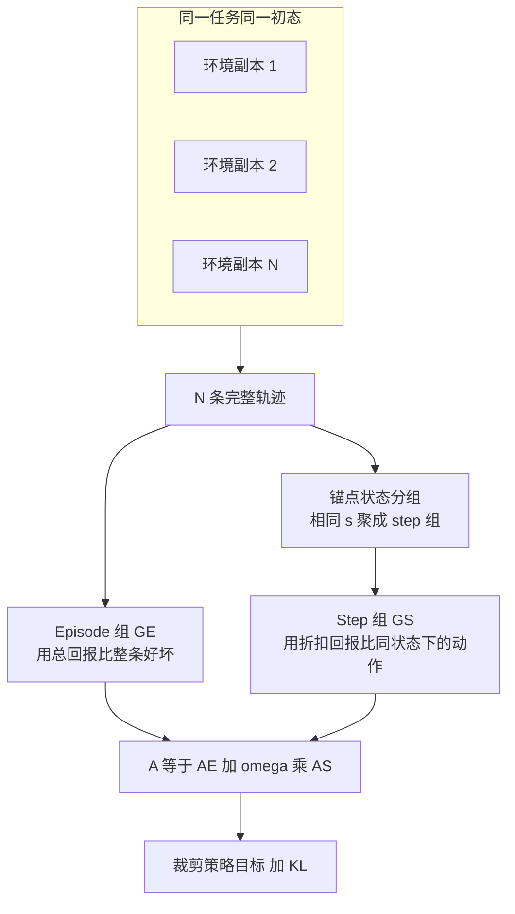

# GiGPO：组里再分组，给多轮 Agent 补上逐步信用

<!-- release-date: 2025-05-16 -->

**本文依据** ：`Group-in-Group Policy Optimization for LLM Agent Training`，arXiv 2505.10978v3（2025-10-28），NeurIPS 2025，27 页。作者 Lang Feng、Zhenghai Xue、Tingcong Liu、Bo An；Nanyang Technological University 与 Skywork AI（通讯 Bo An）。首发日取 arXiv v1 提交日 2025-05-16；本地读的是 v3 / NeurIPS 正式版，数字与页码均对应该 PDF。代码仓 [langfengQ/verl-agent](https://github.com/langfengQ/verl-agent)。标「外部补充」的段落不来自本文。

## 一句话

GRPO 一类「组内比相对好坏」的强化学习，在数学、代码这种单轮任务里很省显存、也不要 critic。但 Agent 一走出几十步、奖励往往只在结局才给，整条轨迹只得一个分数，中间哪一步该奖、哪一步该罚就糊掉了。GiGPO 不另训价值网络、也不对每个状态额外再 rollout：同一任务、同一初始状态滚出一组轨迹，**episode 组**比谁整条更好，再把跨轨迹撞上的同一环境状态当成锚点，**step 组**比同一状态下谁的动作更好。ALFWorld 上相对 GRPO 超过 12 个百分点、WebShop 超过 9 个百分点；检索增强问答上 3B 平均 42.1%、7B 平均 47.2%。显存与 LLM rollout 与 GRPO 相同。

## 一、矛盾：组相对优势在多轮里被摊成一张饼

大模型当 Agent，不是答一道题就结束。它要在环境里看状态、出动作、拿观察，循环几十轮。论文举的量级：一条 ALFWorld 轨迹可以到 50 步、超过 2 万 token（PDF p.2）。奖励常常稀疏，甚至只有最后的成败。某一步点错商品、走进死房间，要过很久才在结局里体现。

组相对策略优化（Group Relative Policy Optimization，GRPO）以及 RLOO 一类方法，成功处在于：对同一 query 采一组样本，用组内均值和方差估优势，**不要价值网络（critic-free）**，显存低、能上大模型。但这些成功主要发生在数学推理、代码生成：奖励立刻到、信用分配几乎就是「这条答案好不好」（PDF p.2）。

把同一套做法原样套到 Agent 上，等于把整条长轨迹当成一个样本打一个分。图 1 左栏就是这件事：组里比的是整条 $\tau$，中间每一步分到的是同一条宏观优势，步与步之间的差别被抹平（PDF p.4 图 1）。

中间那一栏是「想细一点」的朴素办法：每个状态 $s_t$ 再单独采一堆动作。细是细了，代价是每步额外 LLM 前向，而且那些没真正执行过的动作，环境奖励也难评（PDF p.4）。

贯穿全文的问题就一句（PDF p.2）：

> 能不能保住组方法「无 critic、低显存、收敛稳」的性质，同时给多轮 Agent 补上逐步的信用分配？

## 二、方法：一组套一组

GiGPO 的前提和 LOOP、RAGEN 一类工作一样：同一任务描述 $x$、同一初始环境状态，并行滚出 $N$ 条完整轨迹（PDF p.4）。关键洞察是：任务和初态相同，轨迹里会反复撞上同一网页、同一房间、同一游戏画面——无效动作和循环尤其会制造这种重复。这些共享状态就是天然的逐步对照组，不必再花钱重采。

图是机制示意，对应 PDF p.4 图 1 右栏与 PDF p.5 图 2。颜色相同的状态表示同一环境状态。

输出格式是 `<think>…</think><action>…</action>`（检索任务另有 `<search>` / `<answer>`），策略 $\pi_\theta(a_t \mid s_t, x)$（PDF p.3、图 2）。

### Episode 相对优势：整条好不好

对每条轨迹用总回报 $R(\tau_i)=\sum_t r_t^{(i)}$。若只有结局成败，就成功 1、失败 0（PDF p.4）。组成 episode 组 $G^E$，再做组内标准化：

$$
A^E(\tau_i)=\frac{R(\tau_i)-\mathrm{mean}\{R(\tau_j)\}}{F_{\mathrm{norm}}\{R(\tau_j)\}}
$$

GRPO 默认 $F_{\mathrm{norm}}=\mathrm{std}$。论文指出这会引入难度偏差：方差特别小的组（极简单或极难）梯度会被放大；长视野 Agent 里这种现象更常见（PDF p.4–5，引用 Dr. GRPO）。备选是 $F_{\mathrm{norm}}=1$，附录 C 证明它与 RLOO 只差常数倍 $N/(N-1)$，可吸收进学习率（PDF p.16–17）。实验里两个变体都报：`GiGPO w/ std` 与 `GiGPO w/o std`。

这一层只回答宏观问题：这整条执行有没有把任务做完。

### 锚点状态分组：不额外 rollout 的逐步组

令 $\mathcal{U}$ 为这 $N$ 条轨迹里出现过的全部互异环境状态。每个 $\tilde{s}\in\mathcal{U}$ 当锚点，把所有 $s_t^{(i)}=\tilde{s}$ 的 $(a_t,r_t)$ 收进

$$
G^S(\tilde{s})=\bigl\{(a_t^{(i)},r_t^{(i)}) \mid s_t^{(i)}=\tilde{s}\bigr\}
$$

完全离线，hashmap 按键聚合，没有额外 LLM 前向（PDF p.5）。

即时奖励仍可能全是零。于是对组内每一步改用折扣回报

$$
R_t^{(i)}=\sum_{k=t}^{T}\gamma^{k-t}r_k^{(i)}
$$

再在同一锚点组里对 $\{R_t\}$ 做与 episode 层同构的相对优势 $A^S(a_t)$（PDF p.5–6 式 (5)–(7)）。

图 3 用 WebShop 把这件事讲成人话（PDF p.6）：两条轨迹都停在同一张搜索结果页。$\tau_1$ 先点错第 2 件、退回、再点对第 1 件，成功；折扣后「先点错」的回报低于「后点对」。$\tau_2$ 点了 Next Page，最终失败。三者进同一 step 组后排序变成：

$$
A^S(\text{第 1 件})>A^S(\text{第 2 件})>A^S(\text{Next Page})
$$

整条轨迹只打一个分时，这种「同页三种点击谁更值」是看不见的。稠密奖励时，逐步即时分同样能进这个比较。

检索问答里，重复模式 `query1 → info1 → query1 → …` 会被收进同一 step 组，训练时压掉多余调用（PDF p.8–9）。

QA 实验还用了相似度分组：最长公共子序列相似度超过 0.9 就当作同一锚点，缓解「几乎同一页但字符串不完全相等」（PDF p.7）。

### 合在一起的目标

$$
A(a_t^{(i)})=A^E(\tau_i)+\omega\,A^S(a_t^{(i)})
$$

$\omega\ge 0$ 主实验固定为 1、不再调（PDF p.6–7）。目标是对逐步重要性比做 PPO 式裁剪，再加相对参考策略的 KL（PDF p.6 式 (9)）。伪代码见附录 D（PDF p.17）。

## 三、实验设定

基座是 Qwen2.5-1.5B / 3B / 7B-Instruct（PDF p.7）。

**ALFWorld**：文本家务，3,827 个实例，六类：Pick、Look、Clean、Heat、Cool、Pick2；最多 50 环境步。提示最长 2048、回复 512。规则奖励：成功 10、失败 0、非法动作 −0.1。组大小 $N=8$，每轮 16 组，共 128 个环境。$\gamma=0.95$，KL 系数 0.01，actor 学习率 $1\times 10^{-6}$。历史窗口长度 2（PDF p.7、p.17–18）。

**WebShop**：超过 110 万商品、1.2 万用户指令；最多 15 步；提示 4096。其余组大小与奖励口径与 ALFWorld 同类（PDF p.7、p.18）。指标同时报 Score（属性覆盖）和成功率。

**检索增强问答**：单跳 NQ / TriviaQA / PopQA，多跳 HotpotQA / 2Wiki / MuSiQue / Bamboogle。设定跟 Search-R1：检索器 E5，$N=5$，最多 4 轮，在 NQ 与 HotpotQA 上训练；$\dagger$ 域内、$\star$ 域外（PDF p.7–8）。成功 1、失败 0、非法 −0.01；KL 0.001；mini-batch 512（PDF p.18）。

对照：闭源 GPT-4o、Gemini-2.5-Pro；提示 ReAct、Reflexion；RL 侧 PPO（带 critic）、RLOO、GRPO。问答侧还有 R1-Instruct、Search-R1、ZeroSearch、StepSearch（PDF p.7）。ALFWorld / WebShop 上所有 RL 方法超参对齐。

算力：1.5B 用 2×H100、7B 用 4×H100，各 150 轮；问答 3B 用 4×H100、7B 用 8×H100，各 200 轮（PDF p.18）。表 1 数字是 3 个随机种子平均（PDF p.7 表 1 题注）。

## 四、主结果：长视野控制

表 1（PDF p.7–8）：

闭源提示并不强。Gemini-2.5-Pro 在 ALFWorld 成功率 60.3%、WebShop 成功率 35.9%；GPT-4o 分别是 48.0% 与 23.7%。开源只提示更弱：1.5B 原模型 ALFWorld 仅 4.1%，ReAct 12.8%，Reflexion 21.8%。

RL 把曲线拉开。1.5B 上 PPO 把 ALFWorld 拉到 54.4%，7B 到 80.4%，但要单独价值网络。GRPO / RLOO 已经很强且更省：1.5B GRPO 的 ALFWorld 全体 72.8%、WebShop 成功率 56.8%；7B 分别是 77.6% 与 66.1%。

GiGPO 两变体都压过 GRPO 与 RLOO。正文点名的相对 GRPO 增益（`w/o std`）：1.5B 上 ALFWorld **+13.3**、WebShop **+10.6**；7B 上 ALFWorld **+12.6**、WebShop **+9.1**（PDF p.7）。这就是摘要里「>12% / >9%」的来源。

分任务看更清楚（只摘全体与难点）：

| 设定 | 方法 | ALFWorld All | WebShop Score | WebShop Succ. |
|---|---|---:|---:|---:|
| 闭源 | GPT-4o | 48.0 | 31.8 | 23.7 |
| 闭源 | Gemini-2.5-Pro | 60.3 | 42.5 | 35.9 |
| 1.5B | ReAct | 12.8 | 40.1 | 11.3 |
| 1.5B | PPO | 54.4±3.1 | 73.8±3.0 | 51.5±2.9 |
| 1.5B | GRPO | 72.8±3.6 | 75.8±3.5 | 56.8±3.8 |
| 1.5B | GiGPO w/ std | 86.7±1.7 | 83.1±1.6 | 65.0±3.2 |
| 1.5B | GiGPO w/o std | 86.1±4.7 | 83.5±1.8 | 67.4±4.5 |
| 7B | ReAct | 31.2 | 46.2 | 19.5 |
| 7B | PPO | 80.4±2.7 | 81.4±3.1 | 68.7±5.1 |
| 7B | GRPO | 77.6±5.2 | 79.3±2.8 | 66.1±3.7 |
| 7B | GiGPO w/ std | 90.8±1.3 | 84.4±2.9 | 72.8±3.2 |
| 7B | GiGPO w/o std | 90.2±2.3 | 86.2±2.6 | 75.2±3.8 |

（PDF p.8 表 1）

$F_{\mathrm{norm}}$ 不是万能开关。Look、Pick2、WebShop 这类偏难或组内不平衡的任务上，用标准差会把难样本梯度放大，`w/o std` 成功率更高；别的任务两者接近，方差稳定时 `std` 仍可能有用（PDF p.8）。结构上，两层优势比选哪种归一化重要得多——见下一节消融。

1.5B 上若干子任务（`w/o std`）：Pick 96.0、Look 76.5、Clean 91.8、Heat 91.3、Cool 71.7、Pick2 79.5。7B `w/ std` 的 Clean 到了 98.8，`w/o std` 的 Look 88.6、Pick2 85.2（PDF p.8）。

附录 F 给了一条 7B 热鸡蛋再放到台面的完整轨迹：先按常识去冰箱，没有蛋就换 countertop 2，找到后再加热——作者把它写成训练后出现的推理行为，不是定量指标（PDF p.20–21）。

## 五、检索问答：短视野也吃逐步信号

表 2，GiGPO 用 $F_{\mathrm{norm}}=\mathrm{std}$，在 NQ 与 HotpotQA 上训练（PDF p.8）：

| 模型 | 方法 | NQ | TriviaQA | PopQA | HotpotQA | 2Wiki | MuSiQue | Bamboogle | Avg. |
|---|---|---:|---:|---:|---:|---:|---:|---:|---:|
| 3B | Search-R1 | 34.1 | 54.5 | 37.8 | 32.4 | 31.9 | 10.3 | 26.4 | 32.5 |
| 3B | ZeroSearch | 41.4 | 57.4 | **44.8** | 27.4 | 30.0 | 9.8 | 11.1 | 31.7 |
| 3B | GiGPO | **42.0** | **59.5** | 42.4 | **36.9** | **37.0** | 12.6 | **64.1** | **42.1** |
| 7B | Search-R1 | 39.3 | 61.0 | 39.7 | 37.0 | 40.1 | 14.6 | 36.8 | 38.5 |
| 7B | ZeroSearch | 43.6 | 61.8 | **51.5** | 34.6 | 35.2 | 18.4 | 27.8 | 39.1 |
| 7B | GiGPO | **46.4** | **64.7** | 46.1 | **41.6** | **43.6** | 18.9 | **68.9** | **47.2** |

StepSearch 只报多跳、不报平均：3B HotpotQA 34.5 / 7B 38.6，低于 GiGPO 的 36.9 / 41.6；但 7B MuSiQue 上 StepSearch 22.6 高于 GiGPO 的 18.9（PDF p.8）。PopQA 上 ZeroSearch 仍更高。平均分的拉升很大一块来自 Bamboogle（3B 64.1 vs Search-R1 26.4）。

工具次数：每问最多 3 次调用时，7B 单跳平均约 0.9 次、多跳约 1.6 次，与 OTC 论文报的约 1.0 / 1.7 同一量级（PDF p.8）。作者把效率归因于 step 组压重复查询。

## 六、消融、组大小动力学、开销

图 4 在 1.5B 上拆掉一层（PDF p.9）：去掉 $A^E$（没有整条轨迹信号）全面掉；去掉 $A^S$（没有逐步信号）在 Cool、Pick2、WebShop 上掉得尤其狠。两种归一化之间的差距，远小于拆掉任一层。结论：层次结构才是主因。

图 5 跟踪 ALFWorld 训练中 $|G^S(\tilde{s})|$ 的分布（PDF p.9）。全程大小为 1 的组不到 35%，也就是超过 65% 的状态会在轨迹间重复，锚点分组不是空转。第 10 轮时 $|G^S|\ge 10$ 超过 20%（其中 $10\le|G^S|<50$ 占 16.2%，$|G^S|\ge 50$ 占 5.6%），早期政策大量无效动作和死循环。第 75 轮这两档降到 12.1% 与 3.1%。第 140 轮集中在 6–8；因为 $N=8$，意味着组内 8 条轨迹行为已经齐，成功率进入 >80% 的平台。

图 6 把每轮时间拆开（PDF p.10）。与 GRPO 共用的 rollout、旧策略/参考策略概率、策略更新合计 **362.83 s**。GiGPO 多出来的：锚点 hashmap **0.01 s**，逐步优势算术 **0.53 s**。作者写这两项占每轮时间 **<0.002%**。按给出的秒数，0.54 / 362.83 约 0.15%，0.01 / 362.83 才落到 0.003% 量级——文中百分比更像只强调 hashmap 相对主导项可忽略。定性结论不变：显存与 LLM rollout 与 GRPO 相同，额外墙钟可忽略。

附录 E.5 扫 $\omega$（WebShop，1.5B，PDF p.20 表 5）：$\omega=0$ 时成功率 56.6（接近纯 episode / GRPO）；0.8 时 Score 84.9、成功率 68.3 最高；1.0 为 83.5 / 67.4；到 1.4 掉回 56.3。区间 [0.4, 1.2] 都还稳。主实验 $\omega=1$ 不是最优点，但是平台内。

附录 E.4：把 DAPO 的动态采样与 clip-higher 接到 GiGPO 上得到 GiGPO$_{\mathrm{dynamic}}$，1.5B WebShop 成功率 75.0 vs DAPO 66.1 vs GRPO 56.8（PDF p.19–20 表 4）。层次结构与单轮组方法正交。

附录 E.3 把同一算法接到 Qwen2.5-VL-3B：Sokoban 6×6 上 `w/o std` 81.0 vs GRPO 67.1 vs 提示 11.7；EZPoints 100.0 vs GRPO 86.9（PDF p.19 表 3）。视觉状态同样能当锚点。

## 七、系统：verl-agent 不把历史整段拼接

附录 A（PDF p.16）发布 [verl-agent](https://github.com/langfengQ/verl-agent)，基于 veRL / HybridFlow。相对 RAGEN、Search-R1「每步把到目前为止的全部交互拼进上下文」，它逐步构造输入，用可定制 memory（关键事件、摘要、外部知识）卡住长度，否则 ALFWorld 这种 50 步会把上下文撑爆——相关工作里 RAGEN 就被点名有这个扩展性问题（PDF p.3）。还带并行 Gym 风环境、Qwen3 / Qwen2.5 / LLaMA3.2 / LoRA / Qwen2.5-VL，环境包括 Search、ALFWorld、WebShop、Sokoban、Gym Cards，算法包括 GiGPO、GRPO、PPO、DAPO、RLOO。

图 7 左是「历史越拼越长」，右是逐步输入加 memory（PDF p.16）。这是配套工程，不是算法本身的消融。

## 八、局限

作者自己写的下界很清楚（PDF p.10）：锚点依赖状态匹配。环境很噪、状态几乎从不精确重复时，$A^S=0$，GiGPO **退回 GRPO**，不会比组方法更差。相似度阈值（QA 上 0.9）只是缓解。更稳的匹配——嵌入、领域结构等价——列为未来工作。

没写的、不要补：没有把 GiGPO 接到真实浏览器或真机家务；没有相对 PPO 的显存墙钟全表（只强调与 GRPO 同架构）；$\omega$ 只在 WebShop 1.5B 上扫过；表 1 与闭源比的是提示闭源、不是把 GPT-4o 拿去 RL。Bamboogle 的巨幅领先没有单独误差分析。

## 九、可迁移启发

1. **长视野信用不一定要 critic，也不一定要逐步额外 rollout。** 同一任务同一初态下的状态重复，本身就是对照实验。能 hash 的离散状态（页面 DOM、房间名、棋盘）可以直接抄锚点分组。
2. **宏观与微观要叠，不要互相替代。** 消融显示只留逐步或只留整条都会塌。$\omega$ 过大（表 5 的 1.4）会压掉轨迹级信号，等于过拟合局部点击。
3. **组方差归一化在 Agent 里要小心。** 难任务、组内全成或全败时，`std` 会放大噪声；$F_{\mathrm{norm}}=1$ 更像 RLOO。不要默认「跟 DeepSeekMath 一样除标准差」。
4. **多轮训练框架不要无脑拼接全程。** verl-agent 的逐步输入加短历史（本文 ALFWorld/WebShop 只留 2 步）是能训到 50 步的前提。算法再细，上下文爆了也滚不动。
5. **重复查询可以被同一机制干掉。** 检索 Agent 里把相同 query 收进 step 组，等于免费的工具次数正则，不必另设 OTC 式奖励。

## 关键词回看

- **组相对策略优化（GRPO）**：同 query 一组样本，用组统计估优势，无 critic。
- **信用分配（credit assignment）**：稀疏、延迟奖励下，把结局分数分给中间逐步动作。
- **锚点状态（anchor state）**：组内重复出现的环境状态，用来 retroactively 建逐步对照。
- **Episode 相对优势 $A^E$ / Step 相对优势 $A^S$**：整条总回报的组内相对值，与同状态下折扣回报的组内相对值。
- **$F_{\mathrm{norm}}$**：优势分母；`std` 或常数 1。
- **verl-agent**：本文配套的多轮 RL 训练框架，逐步交互而非全程拼接。
