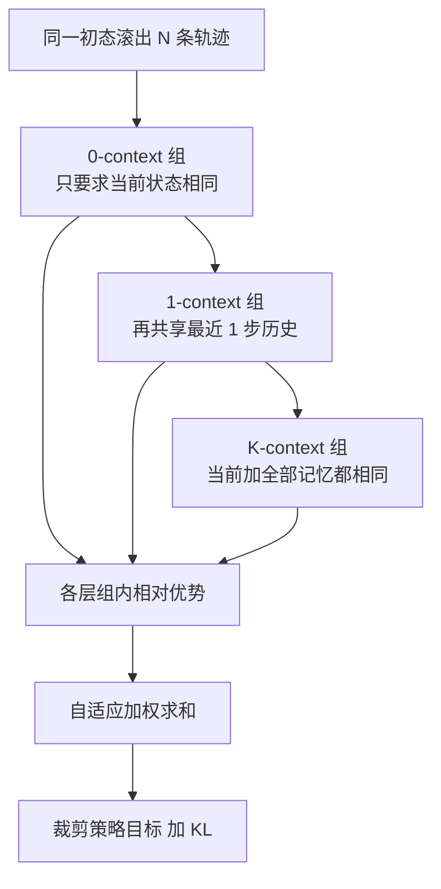

# HGPO：逐步组里历史不一致，再按上下文深度分层

<!-- release-date: 2026-02-26 -->

**本文依据** ：`Hierarchy-of-Groups Policy Optimization for Long-Horizon Agentic Tasks`，arXiv 2602.22817v1（2026-02-26），ICLR 2026，22 页。作者 Shuo He、Lang Feng、Qi Wei、Xin Cheng、Lei Feng、Bo An；Nanyang Technological University 与 Southeast University（通讯 Lei Feng）。首发日取 arXiv v1 提交日 2026-02-26；本地 PDF 已是 v1，数字与页码均对应该文件。代码仓 [langfengQ/verl-agent](https://github.com/langfengQ/verl-agent) 的 `recipe/hgpo`。标「外部补充」的段落不来自本文。

## 一句话

GiGPO 一类逐步组方法，把「当前环境状态相同」的步收进同一组，用组内相对优势做信用分配，不要 critic、也不额外 rollout。但同一房间、同一商品页，记忆模块里的前几步历史往往并不一样——论文把这件事叫 **历史上下文不一致（historical context inconsistency）**。组里比的其实不是同一条 prompt，优势会偏。HGPO 不丢掉这些步：同一当前状态先聚成 0-context 组，再按共享历史长度嵌套成 1-context、2-context……一直到 Oracle（当前状态和历史都相同）。每层各算一份相对优势，再用与层深相关的权重加总。ALFWorld / WebShop、Qwen2.5-1.5B 与 7B 上压过 GRPO 与 GiGPO；显存与 LLM rollout 与它们相同。

## 一、矛盾：逐步组比的是「同状态」，不是「同 prompt」

长视野 Agent 要在环境里走几十步。把整条轨迹拼进上下文（RAGEN、Search-R1 一类 **轨迹级策略优化**），有效长度随轮数涨，训不动（PDF p.1）。于是近年改成 **逐步策略优化**：每一步单独当前向，历史只留记忆模块里最近 $K$ 步，$K\ll T$，prompt 长度稳住（PDF p.2、p.4）。

组相对策略优化（Group Relative Policy Optimization，GRPO）在逐步框架里，通常把整条轨迹的总回报做成一份优势，再广播给轨迹上每一步——粗、偏（PDF p.4 式 (1)）。GiGPO 再加一层：跨轨迹把 **当前状态相同** 的步收成 step 组，用折扣回报比同一状态下谁的动作更好（PDF p.4 式 (2)）。

问题出在记忆。逐步框架里，真正进模型的是「当前状态 + 记忆里的历史」。图 1(b) 两条轨迹都走到紫色状态 $s_2$，GiGPO 把它们放进同一 step 组；但一条可能刚从厨房过来，另一条刚从客厅过来，记忆不同，prompt 不同（PDF p.2）。相对优势本该在 **同一当前状态且同一历史** 下比；历史一散，估计就偏。

作者定义 **Oracle 组**：当前状态相同、历史也逐字相同。训练 GRPO / GiGPO 时盯着这些 Oracle 组，拿它们的优势当地面真值。图 2(a)(b) 显示：轨迹级优势相对 Oracle 的偏差明显大于逐步级，但逐步级也不是零（PDF p.2）。只拿 Oracle 步更新呢？图 2(c)(d) 说不行：Oracle 步占比低、组很小，方差大、样本不够（PDF p.2）。

贯穿全文的问题就一句：

> 能不能在逐步组方法里，既用上几乎所有步（控方差），又尽量按历史一致性比（控偏差），而且不加 critic、不加 rollout？

## 二、方法：一组套一层历史

同一任务、同一初态滚出 $N$ 条轨迹。对每一步，先按当前状态对齐，再按共享历史深度嵌套分组。图 3 用 $K=2$、四条轨迹示意：紫色 $s_2$ 同时进 0-context、1-context、2-context 三层（PDF p.5）。

图是机制示意，对应 PDF p.5 图 3。颜色相同的状态表示同一环境状态。$K=0$ 时整棵树退化成 GiGPO 的 step 组（PDF p.5）。

输出格式仍是 `<think>…</think><action>…</action>`（PDF p.7）。

### 上下文感知的层级分组

记第 $i$ 条轨迹 $\tau_i$，记忆最长 $K$ 步。对第 $t$ 步定义 $k$ 步上下文算子 $C_k(s_t^{(i)})$：取当前状态前面最多 $k$ 个历史状态（步数不够就从 $s_0$ 起截）（PDF p.5 式 (3)）。$k\in[0,K]$。

第 $k$ 层组是所有满足 $C_k$ 相同的步：

$$
G^H_k(s_t^{(i)})=\bigl\{(j,n)\in I \mid C_k(s_t^{(i)})=C_k(s_n^{(j)})\bigr\}
$$

于是有嵌套（PDF p.5 式 (5)）：

$$
G^H_0(s_t)\supseteq G^H_1(s_t)\supseteq\cdots\supseteq G^H_K(s_t)
$$

层越深，历史越齐，组越小。全程离线 hashmap，没有额外模型、没有重采（PDF p.5）。

### 自适应加权的优势

每层用与 GiGPO 同构的组内标准化（PDF p.6 式 (6)）：组均值作基线，再除组标准差。逐步回报仍是从当前步起的折扣和 $r_t=\sum_{j=t}^{T}\gamma^{j-t}r_j$（PDF p.6）。

$K+1$ 层加总：

$$
A^H(s_t)=\sum_{k=0}^{K} w_k\,A^H_k(s_t),\qquad
w_k=\frac{(k+1)^\alpha}{\sum_{k'}(k'+1)^\alpha}
$$

$\alpha\ge 0$。$\alpha$ 越大，越偏向深层（历史更一致、偏差更小、组更小、方差更大）。主实验 $\alpha=1$，并丢掉优势为零的层再归一化（PDF p.6–7）。$\alpha=0$ 就是均匀加权。

策略目标是逐步重要性比的 PPO 式裁剪加相对参考策略的 KL（PDF p.6 式 (8)）。伪代码见附录 A（PDF p.17）。

### 偏差–方差夹在两头之间

命题 4.1 的假设是：轨迹级偏差最大、Oracle（$k=K$）最小；方差反过来，0-context 组最大、Oracle 组最小。加权之后（PDF p.6）：

$$
b_K\le\mathrm{Bias}[A^H]\le b_0\le B_T,\qquad
\frac{v_0}{K+1}\le\mathrm{Var}[A^H]\le v_K\le V_T
$$

也就是夹在「只比当前状态」和「只比 Oracle」中间。附录 B 还假设层间协方差为零，并用柯西–施瓦茨给出 $\sum w_k^2$ 的界（PDF p.17–18）。这是在假设下的插值论证，不是从图 2 拟合出来的数。

## 三、实验设定

基座 Qwen2.5-1.5B-Instruct 与 Qwen2.5-7B-Instruct。组大小 $N=8$，每轮 16 组，共 128 个环境；PPO 同样 128 个环境但带 critic。Rollout 温度 1.0、验证 0.4。奖励：成功 10、失败 0、非法动作 −0.1。$\gamma=0.95$，KL 系数 0.01，actor 学习率 $1\times 10^{-6}$。验证集 512。1.5B 用 2×H100、7B 用 4×H100，各 160 轮。表 1 多数是 3 个测试种子的均值±标准差（PDF p.7、p.19）。

**ALFWorld**：文本家务，附录写 4,639 个实例、六类 Pick / Look / Clean / Heat / Cool / Pick2；最多 50 环境步。提示最长 2048（括号里另写 4096）、回复 512。mini-batch 256（PDF p.18–19）。

**WebShop**：超过 110 万商品、1.2 万用户指令。正文评测最多 30 步；提示 4096、回复 512；mini-batch 64。附录旧版 verl-agent 表 7 题注写的是 15 步，不要和表 1 混用（PDF p.7、p.19、p.21）。

提示把最近 `history_length` 步观察与动作塞进记忆；附录 C.5 写实验里历史长度设为 2，主表则同时报 $K=2$ 与 $K=4$（PDF p.19–20）。$K$ 就是记忆窗口，也是层级深度。

对照：闭源 GPT-4o、Gemini-2.5-Pro；提示 ReAct、Reflexion；RL 侧 PPO（带 critic）、RLOO、GRPO、GiGPO。超参对齐。附录 C.1 把 GiGPO 写成「Grouped Incremental GPO」，与正文引用的 Feng et al. 2025b 不一致——以正文为准。

表 1 的 GiGPO / HGPO 跑在 **新版 verl-agent**（veRL 更新后）；附录表 7 是旧 `paper_version`。作者声明只改框架实现、不改算法，两表方向一致，但绝对数字不同，正文以表 1 为准（PDF p.19–21）。

## 四、主结果

表 1（PDF p.7）：

闭源提示不强。GPT-4o 的 ALFWorld In-Success 48.0、OOD 46.0，WebShop Score 31.8 / 成功率 23.7；Gemini-2.5-Pro 分别是 60.3 / 50.5 与 42.5 / 35.9。

开源只提示更弱：1.5B 原模型 ALFWorld In-Success 4.1，ReAct 12.8，Reflexion 21.8。RL 把曲线拉开。1.5B 上 PPO 54.4±3.1，GRPO 72.8±3.6 / OOD 70.1±2.5，WebShop 成功率 56.8±3.8。

GiGPO 已经很高。HGPO 再往上抬。正文点名的 1.5B 相对 GiGPO 平均增益：ALFWorld $K=2$ 为 **4.01%**、$K=4$ 为 **1.08%**；WebShop $K=2$ 为 **2.81%**、$K=4$ 为 **4.36%**（PDF p.7）。7B 上 HGPO 的 ALFWorld In-Success 最高 **95.96%**，WebShop 成功率最高 **79.29%**（PDF p.7）。

| 设定 | 方法 | ALF In | ALF Out | WS Score | WS Succ. |
|---|---|---:|---:|---:|---:|
| 闭源 | GPT-4o | 48.0 | 46.0 | 31.8 | 23.7 |
| 闭源 | Gemini-2.5-Pro | 60.3 | 50.5 | 42.5 | 35.9 |
| 1.5B | GRPO | 72.8±3.6 | 70.1±2.5 | 75.8±3.5 | 56.8±3.8 |
| 1.5B | GiGPO $K=2$ | 90.16±0.22 | 84.76±2.83 | 84.95±2.57 | 66.53±1.92 |
| 1.5B | HGPO $K=2$ | 92.77±1.08 | 90.16±0.78 | 85.56±2.86 | 71.54±4.00 |
| 1.5B | GiGPO $K=4$ | 93.29±1.07 | 91.53±1.99 | 86.80±1.60 | 73.24±2.25 |
| 1.5B | HGPO $K=4$ | 94.85±0.92 | 92.12±1.63 | 90.64±1.05 | 78.12±2.06 |
| 7B | GRPO | 78.64±0.73 | 76.82±1.47 | 79.3±2.8 | 66.1±3.7 |
| 7B | GiGPO $K=2$ | 93.29±0.40 | 92.18±0.39 | 88.93±1.49 | 77.60±1.68 |
| 7B | HGPO $K=2$ | 95.44±0.62 | 92.05±0.22 | 88.96±1.04 | 78.51±1.40 |
| 7B | GiGPO $K=4$ | 95.63±0.49 | 95.18±0.98 | 89.51±0.59 | 77.79±0.92 |
| 7B | HGPO $K=4$ | 95.96±0.49 | 94.87±1.24 | 88.49±0.41 | 79.29±1.17 |

（PDF p.7 表 1）

两处不要读成「全面碾压」。7B、$K=2$ 的 ALFWorld OOD：HGPO 92.05 略低于 GiGPO 的 92.18；7B、$K=4$ 的 WebShop Score：HGPO 88.49 低于 GiGPO 的 89.51。作者强调的是总体与 OOD 掉点更小，以及小模型增益更大。

小模型增益：相对 GiGPO，1.5B 平均 +3.41%（$K=2$）/ +2.72%（$K=4$），7B 只有 +0.74% / +0.13%（PDF p.8）。解释是 1.5B 更容易走出又长又冗余的轨迹，优势偏差更大，分层更值钱；7B 步数更少、更准，分层的边际变小。加大 $K$，GiGPO 与 HGPO 都涨，记忆本身也有用（PDF p.8）。

旧版 verl-agent 表 7（PDF p.21）方向相同、数字更低，例如 1.5B HGPO $K=4$ 的 ALFWorld In-Success 92.45 vs 表 1 的 94.85。引用时标明版本。

## 五、组有多大、步用了多少、额外开销多小

图 4：1.5B、第 160 轮，层级组大小分布（PDF p.8）。0-context 大组比例最高，因为它不看历史。$K$ 加大后质量从大组移向小组——Oracle 步往往挤在小组里，这正是「只训 Oracle 会方差爆炸」的来源。$K=4$ 的补充分布在图 9（PDF p.22）。

表 2 逐步利用率（1.5B，PDF p.9）：

| 环境 | $K$ | 0-C | 1-C | 2-C | 3-C | 4-C |
|---|---:|---:|---:|---:|---:|---:|
| ALFWorld | 2 | 0.97 | 0.75 | 0.52 | — | — |
| ALFWorld | 4 | 0.98 | 0.77 | 0.54 | 0.34 | 0.19 |
| WebShop | 2 | 0.92 | 0.64 | 0.44 | — | — |
| WebShop | 4 | 0.90 | 0.59 | 0.40 | 0.21 | 0.09 |

几乎所有步都能进 0-context；进得了 Oracle 的，WebShop、$K=4$ 只剩 0.09。层级的意义就是：浅层保覆盖，深层纠偏差。

表 3 在 ALFWorld、1.5B 上测 hashmap 的墙钟与峰值显存（PDF p.9）。公共部分（多轮 rollout、旧策略/参考概率、裁剪更新）第 40 / 80 / 120 / 160 轮分别是 297.8 / 288.6 / 284.7 / 282.5 秒，随策略变短而下降。额外 hashing：

| 方法 | 40 | 80 | 120 | 160 |
|---|---:|---:|---:|---:|
| GRPO 时间 (s) | 0.048 | 0.027 | 0.018 | 0.013 |
| GiGPO 时间 (s) | 0.126 | 0.080 | 0.055 | 0.034 |
| HGPO 时间 (s) | 0.693 | 0.601 | 0.456 | 0.246 |
| GiGPO 峰值 (MB) | 0.1035 | 0.0967 | 0.0605 | 0.0391 |
| HGPO 峰值 (MB) | 0.1393 | 0.1229 | 0.1078 | 0.0406 |

作者写：相对 GRPO / GiGPO 平均多约 **0.425 s / 0.472 s**，占整轮 **不到 0.001%**。按表中秒数，0.5 / 280 大约是 0.2% 量级——百分比更像强调「相对主导项可忽略」，定性结论不变：无 critic、同 rollout、同 GPU 显存，多出来的是哈希。峰值显存多的是 hashmap，单位是 MB。

## 六、$\alpha$、消融、训练曲线

表 4（1.5B，PDF p.9）：$\alpha$ 控制权重有多尖。

| $\alpha$ | $K$ | ALF In | ALF Out | WS Score | WS Succ. |
|---:|---:|---:|---:|---:|---:|
| 0 | 2 | 94.33±1.08 | 90.03±2.58 | 88.40±2.20 | 73.95±4.21 |
| 0 | 4 | 92.12±0.40 | 89.58±1.00 | 87.96±2.48 | 73.82±3.26 |
| 1 | 2 | 92.77±1.08 | 90.16±0.78 | 85.56±2.86 | 71.54±4.00 |
| 1 | 4 | 94.85±0.92 | 92.12±1.63 | 90.64±1.05 | 78.12±2.06 |
| 2 | 2 | 90.36±0.96 | 86.91±2.03 | 88.29±2.88 | 72.00±3.03 |
| 2 | 4 | 93.55±0.51 | 86.78±2.26 | 88.28±2.24 | 75.39±2.95 |

$K=2$ 时均匀加权（$\alpha=0$）往往更好；$K=4$ 时要把权重交给更深的层，$\alpha=1$ 最好。$\alpha=2$ 再尖就伤方差。默认 $\alpha=1$ 不是每一格的最优点，但跨 $K$ 能用。作者把「按各层不确定性再自适应」列为未来工作（PDF p.9–10）。

表 5 消融（1.5B，PDF p.10）：

- **去掉 $G^H_{1:K}$**（只留 0-context，等于退回 GiGPO 式逐步组）：ALFWorld $K=2/4$ 的 In-Success 掉到 90.88 / 91.14，相对完整 HGPO 约 **2.8** 个百分点；OOD 约 **5.8** 个百分点。WebShop 在 $K=2$、$\alpha=1$ 时反而略升（73.24 vs 71.54），$K=4$ 仍掉。
- **去掉自适应权重**（$\alpha=0$）：与表 4 第一块相同——$K=2$ 略升、$K=4$ 下降。
- **再叠轨迹级优势式 (1)**：ALFWorld 全面掉（$K=2$ In-Success 88.21）；WebShop $K=2$ 成功率 76.82 反而高，其余下降。作者认为轨迹级又偏又扁，多数时候帮不上。
- **只训 Oracle 步**：实验失败，正文没有给出数字。

附录图 7、图 8 是 1.5B 上 ALFWorld / WebShop 的训练动力学（PDF p.21）。六条曲线：平均优势、策略梯度损失、KL、裁剪比例、平均回报、回合成功率。作者读图：HGPO 的 clip fraction 更适中；GRPO 的 KL 过低（学得慢）、GiGPO 的 KL 偏高（过猛）。这是观察，不是假设检验。W&B 日志声称已公开，本文 PDF 未附链接。

## 七、局限

作者自己写的下界（PDF p.10）：层级切分依赖 **可按历史步切开的原始上下文**。很多 Agent 会把历史摘要进记忆，摘要不可逐层对齐时，这套 $C_k$ 不好用；他们点名的出路是记忆的 **嵌入相似度**。权重也还是幂次模板，不是按层内不确定性估出来的。

没写的、不要补：没有真实浏览器或真机家务；没有检索问答；没有视觉状态实验；表 1 与闭源比的是提示闭源、不是把 GPT-4o 拿去 RL；「不到 0.001%」与表 3 秒数对不上精确百分比；只训 Oracle 失败没有报数；7B 上若干格子并未超过 GiGPO。

外部补充：同一仓库线的 GiGPO 论文（arXiv 2505.10978）在旧设定下报过 ALFWorld 相对 GRPO >12 个百分点。本文表 1 的 GiGPO 已经换了新 verl-agent，不能拿那篇的 86.1 / 90.2 直接和这里的 90.16 / 93.29 做同一表格比较。

## 八、可迁移启发

1. **逐步组的锚点如果只 hash 当前观察，比的就不是同一条 prompt。** 网页 DOM、房间名相同但「怎么走到这儿」不同时，先检查记忆是否进了组键。能切历史就分层；切不了就不要假装 Oracle。
2. **覆盖和纯度要叠，不要互相替代。** 0-context 几乎吃掉全部步，Oracle 往往不到两成。只留深层会方差爆炸（只训 Oracle 失败）；只留浅层就是 GiGPO 的偏差。$\alpha$ 过大（表 4 的 2）会把小样本层抬过头。
3. **小模型、长冗余轨迹，分层更值钱。** 1.5B 的相对增益明显大于 7B。若 rollout 已经又短又齐，别指望再挖出几个点。
4. **轨迹级优势不是免费的正则。** 消融里再加式 (1) 多数变差。宏观信号已经通过折扣回报进了逐步组，不必默认再广播一份整条分数。
5. **工程成本可以忽略，前提是状态能 hash。** 多出来的是查找表，不是第二张网。摘要记忆、连续视觉、几乎不重复的状态，这篇的 $C_k$ 直接失效——那是作者写进结论的边界，不是实现细节没公开。

## 关键词回看

- **历史上下文不一致**：同一当前状态进了同一逐步组，但记忆模块里的前缀不同，等于拿不同 prompt 的动作比相对好坏。
- **Oracle 组 / Oracle 步**：当前状态与历史都相同；偏差最小、样本最少。
- **$k$-context 组**：共享当前状态以及最近 $k$ 步历史；嵌套，层深则组小。
- **自适应加权**：$w_k\propto(k+1)^\alpha$，深层权更大；$\alpha=0$ 均匀。主实验丢掉零优势层。
- **逐步策略优化**：每步独立前向，历史只留长度为 $K$ 的记忆，避免把整条轨迹拼进上下文。
- **verl-agent `recipe/hgpo`**：与 GiGPO 同一仓库；表 1 用新 veRL 封装，表 7 用旧 `paper_version`。
