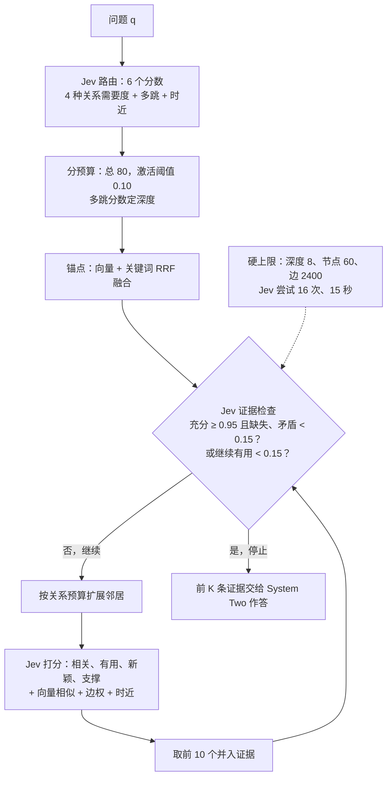

# 记忆里的小决定交给快系统，大模型只管最后作答

<!-- release-date: 2026-09-21 -->

> 本文依据本地 `readings/_src/Agent 训练与工具使用/Jev-Mem.pdf`，即 **Jev-Mem: System-One-Controlled Agentic Memory for Efficient AI Agents**，作者 Dongming Jiang、Yi Li、Bingzhe Li（通讯作者），均属 The University of Texas at Dallas 计算机系，arXiv:2609.23986v1，共 16 页（PDF p. 1）。正文 9 页，其后是参考文献与附录 A（相关工作）、附录 B（控制器提示词与运行参数）。页码均指 PDF 自身页码。文中区分三件事：**论文明确写了什么**、**我们怎么解释它**、**哪些是外部补充或本文推算**。

## 读前先把几个词说成人话

- **Agent 记忆（agentic memory）**：让一个长期运行的 Agent 把过去的对话、偏好、事件存下来，需要时再取回来的外挂存储。它不是模型参数，而是一个会被 Agent 自己不断写入、整理的库。
- **记忆控制（memory control）**：围绕这个库要做的一连串小判断。写入时：这条记忆是什么类型？和哪几条旧记忆有关系？是因果还是先后？读取时：这个问题该去哪类关系里找？找几步？这个候选有没有用？证据够不够、该不该停？
- **System One / System Two（快系统 / 慢系统）**：来自心理学双过程理论（Evans 2008）的说法。前者快、自动、轻量；后者慢、审慎、费力（PDF p. 2）。论文在附录里明说：这只是「计算怎么分配」的类比，不声称底层机制与人脑对应（PDF p. 13）。
- **Jev**：论文引用的一个外部组件，出自 TypeSafe AI（2026），能「不经自回归生成、直接给出带类型的概率判断」（PDF p. 2）。它在 Jev-Mem 里扮演 System One。
- **Noul / Choice**：Jev 接口里的两种问题。Noul 是一个二元命题，返回 $[0, 1]$ 之间的分数；Choice 是在几个互斥选项里挑一个，返回选中的标签和选项分布（PDF p. 13）。
- **LoCoMo**：一个超长、多会话对话的记忆评测集，考时间、因果和跨会话推理（PDF p. 7）。
- **LLM-as-a-Judge**：让一个大模型对照参考答案，判生成的答案对不对（PDF p. 7）。

放在本库里对照：Agent-Memory-Survey 一篇给过 Agent 记忆整张地图（载体、用途、生命周期三把刀）。Jev-Mem 落在那张地图的「生命周期」一格，但它问的不是「存什么」，而是「谁来做那些管理判断」。

## 一句话先说清

越来越「主动」的 Agent 记忆，要在写入和检索的每一步做语义判断：打类型、连关系、选路由、给候选打分、决定停不停。现有系统要么用写死的启发式（快但僵），要么每一步都调一次自回归大模型（灵活但慢），于是**记忆控制本身成了延迟的大头**（PDF p. 2）。

Jev-Mem 的主张是：这些判断**要语义，但不要生成**。它们的输出是标签、概率、分数，不是自由文本（PDF p. 3）。所以把它们交给一个只出概率、可批量调用的轻量控制器（System One），大模型（System Two）只在最后看证据、写答案（PDF p. 4、p. 7）。

在 LoCoMo 上，论文报告（PDF p. 1、p. 8）：

- LLM-as-a-Judge 总分 0.777，最强基线 MAGMA 是 0.700，相对提升 11.0%（PDF p. 7）；
- 记忆构建总耗时 158 秒，最快的对手 Nemori 是 1044 秒，快 6.6 倍（PDF p. 8）；
- 平均每问延迟 0.93 秒，最快的记忆基线 MAGMA 是 1.47 秒，降 36.7%（PDF p. 8）。

读这篇之前要先知道它的证据有多薄：**只有一个数据集、一张准确率表、一张效率表，没有消融，也没有交代 Jev 到底是个什么模型**。下文把机制讲清，把这些缺口在最后一并摊开。

### 一条阅读路线

1. **p. 2–3**：为什么记忆控制会成为瓶颈，「语义但不生成」这个观察。
2. **p. 4 的 Figure 2**：三层结构，一张图看全。
3. **p. 5 式 (7)–(10)**：写路径——先保留原文、打多标签、候选限流、再判关系。
4. **p. 5–7 式 (11)–(27)**：读路径——路由、分预算、锚点、打分、停止。
5. **p. 8 Table 1–2**：准确率与效率。注意正文与表格有几处数字对不上。
6. **p. 13–16 附录 B**：真正的运行参数都在这里，正文公式里的阈值要到这里找。

## 主要矛盾：记忆越聪明，管记忆越贵

论文先用三个式子把 Agent 记忆写成一个闭环（PDF p. 2–3）：

$$
E_t = R(q_t, M_t),\qquad o_t = L(q_t, E_t),\qquad M_{t+1} = U(M_t, q_t, o_t)
$$

意思是：第 $t$ 步拿问题 $q_t$ 去记忆 $M_t$ 里检索出证据 $E_t$；语言模型看证据给出回应 $o_t$；这次交互再更新记忆。$R$ 是检索，$L$ 是推理作答，$U$ 是更新。

早期系统里 $R$ 就是一次相似度检索，$U$ 就是追加一条。后来的系统越做越主动：有选择地保留、合并重复观察、分层存储、用知识图或多张图表示语义、时间、因果、实体关系（PDF p. 1）。于是 $U$ 和 $R$ 里都塞满了语义判断（PDF p. 3）：

- 构建时：新信息该怎么刻画，该和哪些旧知识连起来；
- 检索时：去哪里找，哪些候选有用，还值不值得多找，证据什么时候算够。

论文认为，这一层「谁来执行管理判断」的问题一直被当成附属品，要么埋在提示词里，要么写成固定规则（PDF p. 3）。用自回归大模型做这些判断的代价在于：哪怕一个是非题，也要逐 token 生成、再按格式解析；而这些判断反复出现在记忆的关键路径上，开销就会累积（PDF p. 3）。

论文把这件事和推理系统里的老思路放在一起：级联与路由按成本把请求分给不同模型，投机解码让小模型起草、大模型只验证（PDF p. 3）。Jev-Mem 做的是更细一层的切分——**不是在整条请求之间选模型，而是把记忆生命周期里的那些有界小判断，从开放式生成里剥出来**（PDF p. 3、p. 13）。

## 先看全景：一个控制面、一个数据面、一个推理面


*图：引自原文 Figure 2（PDF p. 4）。黄色方块是 Jev（System One）做的判断，橙色是 System Two；「Evidence Check」框没有着色，但带同样的大脑图标。*

图上三件事要先看出来：

1. **黄色块全是 System One**。写路径上有两处（Jev Typing、Jev Relations），读路径上有两处（Jev Routing、Jev Scoring），证据检查（Evidence Check）框在图上没有涂黄，但按正文同样由它做（PDF p. 6–7）。
2. **记忆面只有一套节点**。语义、时间、因果、实体是四张「视图」，共享同一批规范节点，外加一套共享的向量与关键词索引（PDF p. 4）。
3. **System Two 只出现一次**，在读路径「stop」之后。它不参与路由、扩展和停止（PDF p. 7）。

形式上，一条观察写成 $o_t = (x_t, \tau_t, \mu_t)$：内容、可选的时间戳、来源。记忆写成（PDF p. 4，式 4–6）：

$$
\mathcal{M}_t = \bigl(V_t,\ \{E_t^{g}\}_{g \in \mathcal{G}},\ I_t^{\mathrm{vec}},\ I_t^{\mathrm{lex}}\bigr),\qquad
\mathcal{G} = \{\text{semantic}, \text{temporal}, \text{causal}, \text{entity}\}
$$

$V_t$ 是规范节点集；$E_t^{g}$ 是第 $g$ 种关系的边；$I^{\mathrm{vec}}$ 与 $I^{\mathrm{lex}}$ 是向量索引和词法索引，给检索提供两个互补的入口。同一对记忆之间可以同时有好几种类型的边（PDF p. 4）。

**我们如何解释它。** 这套多关系图记忆本身不是这篇的新东西：基线 MAGMA 是本文三位作者都参与的前作（参考文献，PDF p. 9），「用语义、时间、因果、实体四种关系组织记忆」（PDF p. 7、p. 12）。Jev-Mem 的新意在于**把谁来建这张图、谁来走这张图，换成了一个只出概率的控制器**。论文自己也这样定位：Jev 是 System One 的一种具体实现，关键新意是架构上的分离（PDF p. 2）。

## 核心设计一：把记忆控制写成「一批是非题」

### 旧问题：自由文本提示，贵在生成和解析

让大模型判断「这两条记忆有没有因果关系」，常规做法是写一段提示、让它生成一段话或 JSON、再解析。输出空间其实只有「是 / 否」，却要付生成的钱。

### 新设计：类型化的 System One 控制器

论文的核心抽象是一个控制器 $\mathcal{J}(S, \mathcal{Q})$：$S$ 是结构化状态，$\mathcal{Q}$ 是一批显式的决策问题（PDF p. 4）。它只输出两种东西：

- 对**相互独立的命题**，各给一个概率（例如「两条记忆语义相关吗」「候选和问题相关吗」「证据够了吗」）；
- 对**互斥的选项**，给一个分布（例如时间关系选 before / after / during 之一）。

两个性质让它便宜（PDF p. 4）：

1. 每个决策的输出空间小而已知，所以控制可以直接用概率表示，不需要先生成自然语言推理再解析；
2. 共享同一状态的多个决策，可以**打包成一次批量调用**。

附录 B 把接口落到实处（PDF p. 13）：Jev-Mem 通过 `TypeSafeClient.system_one` 提交一个共享状态对象和一批问题。每个 Noul 由一条指令加明确的 true / false 判据组成。有三条细节值得记住：

- 返回值是模型报告的分数，**论文明说不假定它们是校准过的概率**；
- 同一批里的多个 Noul 是独立命题，不是互斥标签，一条观察可以同时是 episodic 和 semantic；这里的「独立」指问题的写法，不是统计独立；
- 同一批里的问题不互相读答案；问题 ID 只是记账键，不送进模型，所以每条指令都要自己点名它用到的状态字段。

### 同一个接口管两条路

写路径上它管记忆类型与关系构建，读路径上它管路由、候选评估与停止。论文强调这是关键的架构性质：记忆不是一套启发式来建、另一套来取，而是整个生命周期共用同一种决策抽象（PDF p. 4–5）。

### 可迁移启发

回头看自己的 Agent 流水线，凡是「让大模型输出一个布尔、一个标签、一个分数」的调用，都可以问一句：它需要生成吗？如果输出空间有界，就值得换成分类式接口，并把共享上下文的几个问题合成一次调用。**判据要写成 true / false 两侧的明确标准**，这是附录 B 每一条提示词的共同形状。

## 核心设计二：写路径——先全留，再有选择地连

### 旧问题：入库时丢弃，丢了就回不来

很多记忆系统在写入时就判断「值不值得存」。问题是：一条现在看来无关紧要的信息，可能要等到将来某个问题出现才显出价值。

### 新设计：每条观察都保留成一个规范节点

Jev-Mem 当前的设计是**对每条有效观察都建一个规范节点**，不在摄入时做不可逆的学习式「存或丢」决定；选择性放在建结构和检索两步（PDF p. 5）。附录 B 印证了这一点：运行配置里准入过滤是关闭的（`admission_enabled=false`），每条非空观察都进入写路径，类型分数不决定是否保留（PDF p. 14）。

写路径是（PDF p. 5，式 10）：

$$
o_t \rightarrow \text{type} \rightarrow \text{candidates} \rightarrow \text{relations} \rightarrow \mathcal{M}_t
$$

**第一步，打类型。** 控制器给出四个可重叠的特征分数（PDF p. 5，式 7）：

$$
t(v) = (t_{\text{episodic}},\ t_{\text{semantic}},\ t_{\text{procedural}},\ t_{\text{preference}})
$$

情景、语义、程序、偏好四个分数是节点上的注释，不是把它分进唯一一类。节点保存原始观察、来源、时间戳、向量、实体和类型分数（PDF p. 5）。这一步是一次批量请求，状态只有 `observation`，四个 Noul（PDF p. 14）。

**第二步，找候选——不用模型。** 新节点如果和全库每条记忆都比一遍，控制器成本会随库大小线性上涨。所以论文把「发现候选」和「判断关系」拆开：先用确定性检索，综合向量相似度、词法重叠、共享实体、时间邻近，取至多 $K_w$ 个候选（PDF p. 5，式 8）。附录给出运行值：至多 10 个（PDF p. 14）。

**第三步，判关系——只在候选对上。** 对每对 $(v, u)$，Jev 估计语义相关、带方向的因果影响、是否同一情节，必要时再估计实体是否同一（PDF p. 5）。能用确定信息的地方就不调模型（PDF p. 5）：

- 有时间戳，直接按先后建时间边；
- 实体标识符完全相同，直接建实体边；
- 时间顺序隐含在文字里时，才让控制器在 before、after、during、contains、overlaps、same_time、unknown 这 7 个选项里挑。

一条推断边只有在 $P(g \mid v, u) \ge \theta_{\text{rel}}$ 时才插入（PDF p. 5，式 9），运行值 $\theta_{\text{rel}} = 0.60$（PDF p. 14）。整批关系判断是一次请求，覆盖至多 $K_w$ 对（PDF p. 7）。

### 论文自己给的写入示例

附录 B 用一个虚构的小例子演示请求结构（PDF p. 13–14）。以下两条记忆与问题都是论文原文里的示例，论文特意声明：它们只示意请求形状，**不是**实测的 Jev 预测值。

```text
m1  观察于 2024-05-14 10:00  "Mira: My old bicycle broke."
m2  观察于 2024-05-16 10:00  "Mira: I bought a new bicycle yesterday because my old one broke."
实体标识符：两条都含 Mira、bicycle
问题："When did Mira buy a new bicycle, and why?"
```

写入 m2 时，`new_memory` 是 m2，`candidates[0]` 是 m1。一次请求里打包语义关联和两个方向的因果判断；因为实体标识符已经完全匹配，实体别名消解的提示就省掉了（PDF p. 14）。因果那一问的判据写得很细（PDF p. 14）：

- `caused_by` 问「候选事件是否导致、促成或解释了新记忆里的事件」，方向是候选指向新记忆；`causes` 测反方向；
- false 一侧明确列出「只是相似、只是先后、只是共享实体、或因果证据不足」。

另一个细节：时间戳记录的是**这句话被观察到的时间**，不一定是事件发生时间（PDF p. 14）。比如 m2 里的「yesterday」，事件其实发生在观察日的前一天。附录说，时间类问题的证据和候选会额外带上 `timestamp_role` 与 `temporal_references` 两个字段，标明时间戳是观察时间，并附上带精度的时间表达，避免把每个对话日期都当成事件日期（PDF p. 16）。

### 周期整合：只加链接，不删原文

论文还有一个周期维护步骤：检查有界邻域里的冗余、矛盾、过时和可补的链接，只丰富结构、不删原始证据（PDF p. 5）。附录给出运行方式（PDF p. 14–15）：

- 每成功写入 20 次触发一次；
- 4 个 Noul 评估冗余、矛盾、过时、链接有用性，再用一个 Choice 在 keep_separate、merge、promote、uncertain 中挑表示方式；promote 用于「多次重复的不同情节支持一个稳定的一般模式」；
- 常规路径只记录决策和链接，不自动替换源记忆；
- 只有当选中 merge 或 promote 的概率至少 0.85、且矛盾分数低于 0.85 时，才可以调用调用方提供的 System Two 摘要器生成新表示。

也就是说，**生成是结构化控制判断的可选后果，不是记忆维护的默认机制**（PDF p. 5）。

### 代价与边界

「全留」意味着库只增不减，候选检索和图扩展的规模会跟着涨。论文没有报告库的规模增长、存储开销，也没有测试长期运行下的表现。

### 可迁移启发

1. **便宜的召回在前、贵的判断在后**：先用向量、词法、实体、时间把候选压到 10 个，再让模型判。这和检索里「粗排 + 精排」是同一件事，只是用在写入。
2. **能确定就别推断**：时间戳和精确实体匹配直接建边，模型只补隐含的部分。
3. **不可逆操作要高门槛**：整合时改写记忆需要 0.85 以上的置信，并且原始观察永远保留。

## 核心设计三：读路径——一个会自己停下来的检索循环

### 旧问题：固定 top-k，要么不够，要么太多

固定 top-k 或固定深度的图遍历，对所有问题花一样的力气。停得太早会漏掉必要证据，扩展不加控制又会把无关记忆带进来干扰作答（PDF p. 6）。论文沿用自适应 RAG（IRCoT、FLARE、Self-RAG、Adaptive-RAG）的观点，把检索看成受控的决策过程，并把它从「取证」推广到整个记忆生命周期（PDF p. 3、p. 12）。

### 第一步：路由——这个问题需要哪几种关系

控制器对问题 $q$ 预测每种关系视图的需要度 $p_g(q)$，外加一个多跳需求 $h(q)$ 和一个时近重要性 $r(q)$（PDF p. 5，式 11）。这是一次请求，状态只有 `query`，6 个 Noul（PDF p. 15）。因为是独立概率，一个问题可以同时激活多张图，而不是被分进唯一一个意图。

需要度过阈值的关系才激活（PDF p. 5，式 12）：$p_g(q) \ge \theta_{\text{act}}$，运行值 0.10（PDF p. 15）。

### 第二步：分预算——按需要度切一块总预算

给定图扩展总预算 $B$，先按需要度算权重（PDF p. 6，式 13）：

$$
w_g(q) = \frac{p_g(q)^{\gamma}}{\sum_{j \in A(q)} p_j(q)^{\gamma}}
$$

$A(q)$ 是激活的关系集合，$\gamma$ 控制分配有多集中。然后每个激活关系先保底 $m$，剩下的按比例分（PDF p. 6，式 14）：

$$
b_g = m + \mathrm{LRound}_g\bigl[(B - m\,|A(q)|)\,w_g(q)\bigr]
$$

运行值：$B = 80$，保底 $m = 1$，指数 $\gamma = 1.0$，取整用最大余数法（PDF p. 15）。论文特意说明，预算不等于每条边一次模型调用（PDF p. 15）。

**本文推算的例子，不是论文数字。** 假设只有时间和因果被激活，需要度分别为 0.9 和 0.6。那么权重是 0.6 和 0.4；两者先各拿保底 1，剩余 $80 - 2 = 78$ 份按比例是 46.8 和 31.2；最大余数法先各取整数部分 46 和 31，余下 1 份给小数部分更大的时间关系，得 47 和 31。加回保底，最终时间 48、因果 32，合计 80。

多跳需求决定遍历深度（PDF p. 6，式 15）：

$$
D(q) = \min\bigl\{D_{\max},\ \max\bigl(1, \lceil D_{\max}\, h(q) \rceil\bigr)\bigr\}
$$

即至少走 1 步，越像多跳题走得越深，封顶 $D_{\max}$。附录列出的深度上限是 8（PDF p. 16），但没有明说它就是式中的 $D_{\max}$。

### 第三步：锚点——先用便宜的混合检索找起点

图遍历之前，先把向量检索和关键词检索的排名用倒数排名融合（Reciprocal Rank Fusion，RRF）合起来（PDF p. 6，式 16）：

$$
s_{\mathrm{RRF}}(v, q) = \sum_{L \in \{L_{\mathrm{vec}}, L_{\mathrm{lex}}\},\ v \in L} \frac{1}{\kappa + \mathrm{rank}_L(v)},\qquad \kappa = 60
$$

排在最前的节点成为已访问集合和搜索前沿（PDF p. 6）。取多少个锚点，论文没写。

### 第四步：证据检查——够了就停，没用也停

每轮检索后，控制器对当前证据集 $E_d$ 估四个量（PDF p. 6，式 17–20）：证据充分度 $s_d$、继续检索的预期效用 $u_d$、缺失的必要证据 $m_d$、未解决的矛盾 $c_d$。

两种停止条件（PDF p. 6，式 21–22）：

$$
s_d \ge \theta_{\text{suff}} \ \wedge\ m_d < \theta_{\text{cont}} \ \wedge\ c_d < \theta_{\text{cont}}
\qquad\text{或}\qquad
u_d < \theta_{\text{cont}}
$$

前者是「证据够了」，后者是「证据虽然不全，但再找也不太会变好」。运行值：充分度至少 0.95，缺失与矛盾都低于 0.15，继续有用低于 0.15 也停（PDF p. 16）。

附录里「充分」的判据写得很严：证据要支撑答案的**每一个**事实部分，能不编造地作答；只有相关话题不算（PDF p. 15）。而「继续有用」要求能指出一个具体缺口或冲突（PDF p. 15）。

此外有一组与模型判断无关的硬上限（PDF p. 16）：深度 8、访问节点 60、检查边 2400、Jev 尝试（attempts）16 次、检索时间 15 秒。它们可以在证据不全时强制终止；时间预算只在操作之间检查，不保证能抢占本地计算。

### 第五步：扩展与打分——四个模型分数加两个确定信号

需要继续时，按各关系预算 $b_g$ 扩展邻居节点。每个候选 $v$ 由控制器在四个维度打分：与问题的相关性 $a_v$、关系有用性 $\ell_v$、信息新颖度 $n_v$、对当前证据的支撑 $c_v$（PDF p. 6）。这四个是一次批量请求（PDF p. 7、p. 15）。

对经由关系 $g$ 到达的候选，转移分数是（PDF p. 6，式 23）：

$$
s(v \mid q, E_d) = \frac{\lambda_1 z_v + \lambda_2 a_v + \lambda_3\, p_g(q)\, \ell_v + \lambda_4 n_v + \lambda_5 (\pi_e + c_v)/2}{\sum_{i=1}^{5} \lambda_i}
$$

$z_v$ 是向量相似度，$\pi_e$ 是存下来的边权。注意关系有用性 $\ell_v$ 要乘上这类关系对当前问题的需要度 $p_g(q)$——走一条因果边到达的候选，只有在问题真需要因果时才占便宜。五个权重 $\lambda_i$ 的取值论文没给。

有时间戳时再做时近调整（PDF p. 6，式 24–25）：

$$
\rho_v = \frac{1}{1 + \max(0,\ \tau^{*} - \tau_v)/\text{day}},\qquad
\tilde{s}(v) = \frac{s(v) + 0.1\, r(q)\, \rho_v}{1 + 0.1\, r(q)}
$$

$\rho_v$ 按天衰减，越新越接近 1；$r(q)$ 是路由时预测的「这个问题看不看重新近」。系数 0.1 让时近只是一个小修正。$\tau^{*}$ 是什么时刻，论文没有定义。

每轮取分数最高的 $W$ 个作为下一轮的束（beam），并入证据（PDF p. 6）；运行值 $W = 10$（PDF p. 15）。附录强调，单凭高相关分并不能无条件进入证据集，要看综合分（PDF p. 15）。

### 整个循环



*按 PDF p. 5–7 正文与 p. 15–16 附录重画的流程示意，数字是附录给出的运行参数，不是实测时间。*

循环停下后，得分最高的 $K$ 条记忆交给 System Two：$y = \mathrm{SystemTwo}(q, E)$（PDF p. 7，式 27）。$K$ 取多少，论文没写。System Two 只做最后的综合，不参与常规的路由、扩展和停止（PDF p. 7）。附录还说明，标准答案与评测证据标注都不进入 Jev 的状态（PDF p. 16）。

### 控制开销是有上界的

论文把每次操作的控制器调用数写死了（PDF p. 7）：

| 操作 | Jev 请求数 |
|---|---|
| 一次常规写入 | 1 次批量打类型；有候选时再加 1 次批量关系判断，至多 $K_w$ 对 |
| 一次查询 | 1 次路由；每轮至多 1 次证据评估 + 1 次批量候选打分 |

再加上扩展数、边数、节点数、深度、调用数、时间的独立上限，控制过程本身不会无限增长（PDF p. 7）。

**我们如何解释它。** 按这张表和 16 次 Jev 尝试的上限推算：一次查询扣掉路由那 1 次，剩 15 次，每轮「检查 + 打分」占 2 次，最多 7 轮扩展，外加最后 1 次检查。这是本文推算，前提是每次尝试对应一次请求、不含重试；论文没有报告实际平均轮数或平均调用次数。

### 可迁移启发

1. **停止判据要拆成两问**：「够不够」和「再找有没有用」是不同的问题，后者能在证据注定不全时及早止损。
2. **先分预算再走图**：让问题类型决定每种关系能花多少步，而不是每种关系平均走。
3. **模型分和确定性信号混合打分**：向量相似、边权、时近都是免费的，模型只补语义判断。
4. **所有控制循环都要有与模型无关的硬上限**：深度、节点、调用次数、墙钟时间，一个都不能少。

## 实验：一个数据集上的准确率与效率

### 设置

论文写「在两个广泛使用的基准上」评测长期对话记忆，但只介绍并报告了 LoCoMo 一个（PDF p. 7）。对比对象（PDF p. 7）：

- **Full Context**：把完整对话历史直接给大模型，不用外部记忆；
- **A-MEM**：按 Agent 经验动态组织、演化记忆；
- **Nemori**：按情节切分对话，再用图检索；
- **MemoryOS**：分层多级的持久记忆；
- **MAGMA**：用语义、时间、因果、实体多种关系组织记忆（本文三位作者都参与的前作）。

论文说在适用时各方法用同一个作答骨干（PDF p. 7）；Table 1 表注写「LLM model is based on gpt-4o-mini」（PDF p. 8）。评测指标是 LLM-as-a-Judge，外加记忆构建总时间与平均每问延迟；延迟包括检索证据和生成答案两部分（PDF p. 7）。

### 准确率

Table 1（PDF p. 8），LoCoMo，LLM-as-a-Judge 分数，越高越好：

| 方法 | Multi-Hop | Temporal | Open-Domain | Single-Hop | Adversarial | Overall |
|---|---:|---:|---:|---:|---:|---:|
| Full Context | 0.468 | 0.562 | 0.486 | 0.630 | 0.205 | 0.481 |
| A-MEM | 0.495 | 0.474 | 0.385 | 0.653 | 0.616 | 0.580 |
| MemoryOS | 0.552 | 0.422 | 0.504 | 0.674 | 0.428 | 0.553 |
| Nemori | 0.569 | 0.649 | 0.485 | 0.764 | 0.325 | 0.590 |
| MAGMA | 0.528 | **0.650** | 0.517 | 0.776 | 0.742 | 0.700 |
| Jev-Mem | **0.623** | 0.637 | **0.618** | **0.802** | **0.962** | **0.777** |

论文的读法（PDF p. 7–8）：总分 0.777 对 0.700，相对提升 11.0%；六列里五列最好；提升集中在需要更强检索与证据筛选的问题上，最大的一格是 Adversarial，0.962 对 0.742。作者把原因归到自适应控制：按问题估计哪些关系有用、据此分配检索力气、在遍历中评估候选、判断证据何时够用（PDF p. 8）。

**正文与表格有几处数字对不上**，读的时候以表为准：

| 项目 | 正文说法 | Table 1 |
|---|---|---|
| Jev-Mem Multi-Hop | 0.625（PDF p. 7） | 0.623 |
| Jev-Mem Open-Domain | 0.610（PDF p. 7） | 0.618 |
| Jev-Mem Single-Hop | 0.797（PDF p. 8） | 0.802 |
| Temporal | 「追平最佳 0.650」（PDF p. 7–8） | Jev-Mem 0.637，MAGMA 0.650 最高 |

Temporal 那一列，Jev-Mem 实际比 MAGMA 低 0.013，也略低于 Nemori 的 0.649。说它「五列最好、追平时间推理」，前半句对，后半句不对。

**我们如何解释它。**

- Adversarial 这一列拉开的差距最大，也最该追问。LoCoMo 的对抗题通常考「该答不知道的时候能不能不乱答」，这恰好对应 Jev-Mem 里「充分度要支撑每一个事实部分」那条严格判据。但论文没有做消融，没法把这 0.22 的差距归到停止判据、多关系路由还是别的什么上。Full Context 在这一列只有 0.205，原因论文没有讨论。
- Adversarial 之外，Jev-Mem 相对 MAGMA 的提升在 Multi-Hop、Open-Domain 大约 0.1，Single-Hop 约 0.03，Temporal 反而略低。总分的 0.077 里有相当一部分来自 Adversarial 一列。这是我们按表做的读法，论文没有按类别给样本数，无法精确拆分。
- MAGMA 与 Jev-Mem 作者高度重合、用同一套四种关系。两者的差别大体可以看成「控制器换成 Jev + 读写路径重新设计」。这是最接近消融的一组对照，但论文没有把它当消融来写，也没有交代两者在实现上还有哪些不同。

### 效率

Table 2（PDF p. 8）：

| 方法 | 记忆构建总时间（秒） | 平均每问延迟（秒） |
|---|---:|---:|
| Full Context | 不适用 | 1.74 |
| A-MEM | 3636 | 2.26 |
| MemoryOS | 3276 | 32.68 |
| Nemori | 1044 | 2.59 |
| MAGMA | 1404 | 1.47 |
| Jev-Mem | **158** | **0.93** |

论文的算法（PDF p. 8）：构建 158 秒对最快对手 Nemori 的 1044 秒，降 84.9%，即 6.6 倍；A-MEM 和 MemoryOS 都超过 3000 秒。延迟 0.93 秒对最快的记忆基线 MAGMA 1.47 秒降 36.7%，对 Full Context 1.74 秒降 46.6%。MemoryOS 每问 32.68 秒，作者用它说明复杂处理留在检索路径上时，记忆管理的运行开销能有多大。这几个比例与表中数字相符。

作者对效率来源的解释（PDF p. 8）：构建时，轻量类型化判断在有界候选集上批量完成，不反复调通用大模型做自由文本处理；检索时，路由、候选评估、证据检查都由 System One 做，图探索受显式预算约束，自适应停止避免多余遍历。并且效率提升没有以准确率为代价。

**我们如何解释它。**

- 构建时间的差距比延迟大得多：构建快 6.6 倍，延迟按表算只快约 1.6 倍（$1.47 / 0.93$，本文推算）。这说得通：写路径上每条记忆只要 1–2 次批量 Jev 调用，而基线在写入时往往要让大模型逐条生成摘要、笔记或关系；读路径上最后那次 System Two 生成谁都省不掉，是延迟的公共底座。
- 但效率数字**没有交代运行环境**：Jev 跑在哪里、是本地还是远程服务、单次调用多少毫秒；基线在什么硬件上跑、是否并发、大模型 API 的网络延迟怎么算；158 秒对应多少条对话、多少条记忆。这些都没写。跨系统比墙钟时间，这几项缺一项都很难复现。
- Full Context 的延迟 1.74 秒比 Jev-Mem 高，是因为每次都要把整段对话喂给大模型；这说明在 LoCoMo 这个规模上，长上下文的预填充已经比「一次轻量检索 + 短上下文作答」贵。

## 相关工作里的定位

附录 A 把 Jev-Mem 放在四条线的交叉点上（PDF p. 12–13）：

| 线索 | 代表工作 | 与 Jev-Mem 的关系 |
|---|---|---|
| 从存储到主动管理 | Generative Agents、Reflexion、MemoryBank、MemGPT；技能类的 Voyager、ExpeL、Agent Workflow Memory | 这些让记忆「主动」起来，Jev-Mem 问的是主动管理的判断由谁执行 |
| 结构化、演化的记忆 | A-MEM、Mem0、MemoryOS、Nemori、MAGMA、HAGE；检索侧的 RAPTOR、GraphRAG、LightRAG、HippoRAG | 后者面向给定语料，不维护 Agent 自己累积的经验，也没有这里的多关系语义 |
| 自适应检索 | IRCoT、FLARE、Self-RAG、Adaptive-RAG | 它们在单次生成里控制取证，语料不变；Jev-Mem 的控制器还负责写入与重组 |
| 记忆效率 | SimpleMem、LightMem、Zero-Mem；级联与路由（FrugalGPT、RouteLLM） | 三件不同的事：降记忆流水线成本、选哪个模型作答、控制生命周期内的细粒度判断；Jev-Mem 针对第三件 |

其中 Zero-Mem 与本文最接近：论文描述它「把大模型生成从中间记忆操作里拿掉，直接在结构化表示上检索」（PDF p. 13）。两者的区别，论文没有用实验比较，Zero-Mem 也不在基线里。

## 限制、边界，以及原件没写的东西

论文明确写了的边界：

- System One / System Two 只是计算分配的类比，不声称与人脑机制对应（PDF p. 13）。
- Jev 的分数不假定是校准概率（PDF p. 13），但附录给出的各项阈值（0.60、0.10、0.95、0.15、0.85，PDF p. 14–16）都直接作用在这些分数上。
- 时间预算只在操作之间检查，不是严格抢占（PDF p. 16）。
- 附录示例是虚构的，不代表实测预测（PDF p. 13、p. 15）。

读完必须留下的判断：

- **Jev 是一个黑箱。** 论文只说它能「不经自回归生成给出类型化概率判断」，并引用 TypeSafe AI 的网站（PDF p. 2、p. 11）。它是什么架构、多大、怎么训的、在记忆任务上是否微调过、单次调用多快，全都没写。论文的引言里提出「一个较弱的推理器怎样控制记忆而不伤下游准确率」这个问题（PDF p. 2），但没有单独测量 Jev 各项判断的准确率。
- **没有消融。** 多关系路由、预算分配、两种停止条件、候选打分的各项权重、周期整合，都没有逐项去掉看影响。「控制器换成大模型会怎样」「换成纯启发式会怎样」这两组最关键的对照也没有。
- **只有一个数据集。** 正文说两个基准，结果只有 LoCoMo 一个（PDF p. 7）。没有 LongMemEval 等其他记忆评测，也没有真实 Agent 任务（编码、网页）上的测试，虽然引言以这些场景开题（PDF p. 1）。
- **评测细节缺失。** 裁判模型是谁、LoCoMo 用了多少题、各类别题数、是否多次运行取均值、基线数字是自己重跑还是引自原文，都没写。表注的 gpt-4o-mini 是作答模型还是裁判模型，表述也不够清楚（PDF p. 8）。
- **正文与表格数字不一致**，见上面的对照表。
- **关键超参没给**：候选打分的五个权重 $\lambda_i$、送给 System Two 的证据条数 $K$、锚点数、$D_{\max}$ 与附录深度上限 8 的关系、$\tau^{*}$ 的定义、向量模型是哪个。
- **代码声明公开**，仓库地址是 `github.com/libingzheren/Jev-Mem`（PDF p. 1）。但 Jev 出自外部的 TypeSafe AI，调用接口是 `TypeSafeClient.system_one`（PDF p. 2、p. 13）；从这个客户端接口看，它更像一项外部服务（本文推断，论文没写部署方式），即便代码公开，拿不到 Jev 也难以复现控制器那一半。

## 可迁移启发

1. **给 Agent 流水线里的每次模型调用分类**：输出是自由文本，还是一个有界的标签、概率、分数？后者不必走自回归生成，这是本文最核心、也最容易迁移的一句话。
2. **把判断写成带正反判据的是非题并批量提交**：共享同一状态的问题一次问完，问题之间不互相读答案，每条指令点名它用到的字段。
3. **写入时别急着丢**：原始观察全留，选择性放在建边与检索两步；需要改写记忆时设高门槛并保留原文。
4. **确定性信号先行**：时间戳建时间边、精确实体匹配建实体边、向量加关键词找候选和锚点，模型只处理剩下的语义部分。
5. **检索要有两个停止理由和一组硬上限**：「证据够了」和「再找没用了」分开判断，再用深度、节点、调用数和墙钟时间兜底。
6. **读效率数字先问环境**：一个外部控制服务的墙钟收益，取决于它部署在哪里、调用多快。自己评估这类系统时，要把控制器调用次数和单次时延分开报。

## 关键词回看

- **记忆控制**：写入与检索中的一连串有界语义判断——打类型、判关系、路由、分预算、打分、停止。本文认为它是被忽视的延迟来源。
- **语义但不生成**：本文的核心观察。这些判断需要理解语义，但输出只是标签或分数。
- **System One 控制面**：Jev 充当，只出概率、可批量；System Two 是作答的大模型，只在最后出场。
- **Noul / Choice**：独立是非题 / 互斥多选，Jev 接口的两种问题。
- **规范节点 + 多关系视图**：每条观察一个节点，语义、时间、因果、实体四种边叠在同一批节点上。
- **候选限流**：写入时先用确定性信号取至多 10 个候选，模型只判这些对；关系分 ≥ 0.60 才建边。
- **预算分配**：总预算 80，激活阈值 0.10，保底 1，按需要度比例、最大余数取整。
- **双停止条件**：充分 ≥ 0.95 且缺失、矛盾 < 0.15；或继续有用 < 0.15。硬上限深度 8、节点 60、边 2400、Jev 尝试 16 次、时间 15 秒。
- **0.777 / 158 秒 / 0.93 秒**：LoCoMo 总分、构建时间、每问延迟。

## 资料与阅读边界

### 本文依据的版本

- 本地原件 16 页，页边标注 `arXiv:2609.23986v1 [cs.AI] 21 Sep 2026`（PDF p. 1）。
- 官方页 [arXiv:2609.23986](https://arxiv.org/abs/2609.23986) 截至核验只有 v1，提交于 2026-09-21 01:43:12 UTC。`release-date` 取 **2026-09-21**。
- 代码仓库地址见 PDF p. 1 脚注：<https://github.com/libingzheren/Jev-Mem>。仓库内容未能核实。

### 覆盖了的部分

摘要；第 1 节动机与四项贡献；第 2 节 Agent 记忆形式化（式 1–3）与 System One 机会；第 3 节架构与 Figure 2、类型化控制器、写路径（式 4–10）、读路径（式 11–27）与控制开销上界；第 4 节实验设置、Table 1–2；第 5 节结论；附录 A 相关工作；附录 B 全部提示词模板与运行参数。Figure 1 是通用的 Agent 记忆闭环示意，已改写为「主要矛盾」一节里的三个式子。

### 外部补充（不是 PDF 原文）

- 本库 Agent-Memory-Survey 一篇对 Agent 记忆的整体分类与 LoCoMo 的定位，可作背景对照。
- 「LoCoMo 对抗题考的是拒答能力」这句是对该评测集的一般理解，本 PDF 没有描述各类别的含义。

### 原文没有公开、本文也不补的缺口

- Jev 的模型架构、规模、训练方式、调用时延与部署方式；
- 各项 Jev 判断本身的准确率；
- 任何消融实验；
- 第二个评测集（正文提到「两个」却只报告一个）；
- 裁判模型、题目数量、运行次数、基线数字来源、硬件与并发设置；
- 候选打分权重 $\lambda_i$、证据条数 $K$、锚点数、$D_{\max}$、$\tau^{*}$、向量模型；
- 长期运行下的库规模、存储开销与性能变化。
