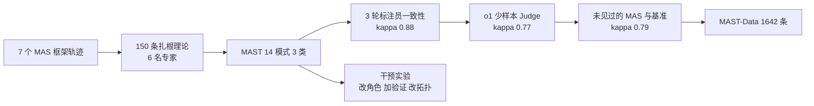

# MAST：多 Agent 系统为什么涨分很小

<!-- release-date: 2025-03-17 -->

**本文依据**：封面正式标题 **Why Do Multi-Agent LLM Systems Fail?**，arXiv 2503.13657v3（2025-10-26），NeurIPS 2025 Datasets and Benchmarks，47 页。作者 Mert Cemri*、Melissa Z. Pan*、Shuyi Yang*、Lakshya A. Agrawal、Bhavya Chopra、Rishabh Tiwari、Kurt Keutzer、Aditya Parameswaran、Dan Klein、Kannan Ramchandran、Matei Zaharia、Joseph E. Gonzalez、Ion Stoica；UC Berkeley 与 Intesa Sanpaolo（Shuyi Yang）。首发日取 arXiv v1 提交日 2025-03-17；本地读的是 v3 / NeurIPS 正式版，数字与页码均对应该 PDF。代码仓 [multi-agent-systems-failure-taxonomy/MAST](https://github.com/multi-agent-systems-failure-taxonomy/MAST)，数据集 [mcemri/MAST-Data](https://huggingface.co/datasets/mcemri/MAST-Data)，Python 包 `agentdash`（`pip install agentdash`）。标「外部补充」的段落不来自本文。

## 一句话

把若干大模型编成「公司」「流水线」或「星形调度」，在编程、数学、通用 Agent 基准上相对单 Agent 或 best-of-N 的涨分常常很小。这篇工作不问「再换一个编排框架」，而问失败长什么样：用扎根理论读 150 条超长轨迹，得到 14 种失败模式、3 大类；标注员间 Cohen’s $\kappa=0.88$。再用 LLM-as-a-Judge 扩到 **1642** 条标注轨迹（摘要写 1600+），覆盖 7 个开源多 Agent 框架。结论不是「底座模型再强一点就好了」，而是：大量失败来自系统设计、Agent 之间对彼此信息需求的误判、以及只会做表面检查的验证器；改提示和改拓扑最多拿到约 9–16 个百分点，剩下的需要结构级方案。

## 一、矛盾：编排越热闹，失败率仍可到八成

论文把 **LLM Agent** 定义成三件事：提示规格（初态）、对话轨迹（状态）、与环境交互（动作，含工具）。**多 Agent 系统（Multi-Agent System，MAS）** 则是一组经编排交互、指望出现集体智能的 Agent：任务拆分、并行、上下文隔离、专长模型集成、多方讨论（PDF p.1）。

热情很大，涨分很小。作者对照单 Agent 与 best-of-N 采样，指出流行基准上 MAS 的增益经常可以忽略（PDF p.1–2）。附录图 5 把这件事写死：在各自基准上，开源 SOTA MAS 的失败率从 **41.0%** 到 **86.7%**（PDF p.19 图 5；正文写 41%–86.7%，PDF p.2）。六套数字不能横比（任务不同），但量级够用：

| MAS | 基准 | 成功率 | 失败率 |
|---|---|---:|---:|
| MetaGPT | ProgramDev | 40.0% | 60.0% |
| ChatDev | ProgramDev | 33.3% | 66.7% |
| HyperAgent | SWE-Bench Lite | 25.3% | 74.7% |
| AppWorld | Test-C | 13.3% | 86.7% |
| AG2（MathChat） | OlympiadBench | 59.0% | 41.0% |
| Magentic-One | GAIA | 38.0% | 62.0% |

（PDF p.19 图 5；GPT-4o 与 Claude-3.7-Sonnet。图里没有 OpenManus。）

贯穿全文的问题就一句（PDF p.2）：

> 为什么 MAS 会失败？失败是不是同一种病？

没有统一失败定义，就没有可复用的诊断。这篇工作先造分类法，再造数据集，最后用分类法去看跨模型、跨任务的分布。

## 二、全景：先分类，再规模化标注

图是机制示意，对应 PDF p.5 图 2 与正文第 3–5 节。$\kappa$ 写作 kappa，避免图里出现特殊字符。

作者刻意把「任务没做成」当成失败，而不是只抓某条 API 报错。轨迹里的根因常常缠在一起：单个模型的幻觉、编排图、提示、状态管理会叠乘（PDF p.4）。所以不能靠「看最后一行 stderr」。

## 三、数据集：1642 条轨迹从哪来

**MAST-Data** 覆盖 7 个框架、编程 / 数学 / 通用 Agent，主模型族是 GPT-4 系列与 Claude 系列，后面又补了 Qwen2.5 与 CodeLlama（PDF p.2–3 表 1）。另有 **MAST-Data-human**：IAA 阶段 21 条轨迹，每条三名专家（PDF p.2）。

表 1 的标注标记：HE = 人核任务是否完成；HA = 人标失败模式；LA = LLM 标失败模式（PDF p.3）。

人标核验块（各 30 条，HE+HA+LA）：ChatDev / MetaGPT / OpenManus 配 ProgramDev 与 GPT-4o；HyperAgent 配 SWE-Bench Lite 与 Claude-3.7-Sonnet；AppWorld 配 Test-C 与 GPT-4o；AG2 MathChat 配 GSM-Plus 与 GPT-4；Magentic-One 配 GAIA 与 GPT-4o。

规模化块（多为 LA）：ChatDev 与 MetaGPT 在 ProgramDev-v2 上各跑 GPT-4o、Claude-3.7-Sonnet（仅 MetaGPT）、Qwen2.5-Coder-32B-Instruct、CodeLlama-7b-Instruct-hf，各 100 条；AG2 在 OlympiadBench（GPT-4o，206）、GSMPlus（Claude-3.7-Sonnet，193）、MMLU（GPT-4o-mini，168）；Magentic-One 再扩 GAIA 165 条（PDF p.3 表 1）。把表里 Trace # 加起来就是 1642。

ProgramDev 故意不难：30 道井字棋、国际象棋、数独一类网上解法很多的题，用来隔离失败动力学，而不是考「会不会写超难算法」。ProgramDev-v2 扩到 100 题，主要给图 8–9 做架构与模型对照（PDF p.21）。

闭源侧作者看过 Manus：ProgramDev 上人工核任务正确率 **60%**，但看不到完整轨迹，进不了主数据集（PDF p.20）。

## 四、分类法怎么长出来

### 扎根理论，而不是先列清单

先从 5 个框架抽 **150** 条轨迹（HyperAgent、AppWorld、AG2、ChatDev、MetaGPT；编程与数学），6 名专家用 Grounded Theory：开放编码、持续比较、备忘、理论化，直到理论饱和。每条轨迹平均超过 15,000 行文本；每位专家超过 20 小时（PDF p.2、p.5）。理论抽样是为了覆盖不同系统目标与交互图，而不是方便的同质样本。

### 把观察变成可复用标签

初步分类法要过 **标注员间一致性（Inter-Annotator Agreement，IAA）**：3 名专家独立标，每轮 5 条，共 3 轮、合计 15 条，讨论分歧后改定义、增删合并。仅消分歧就约 10 小时，不含标注本身。末轮平均 Cohen’s $\kappa=0.88$（PDF p.2、p.6）。作者不声称穷尽一切失败（PDF p.2、p.7）。

### LLM-as-a-Judge：才能标完 1600+

人工标 1600 条细粒度模式不现实。流水线用 OpenAI **o1**，输入轨迹 + MAST 定义 + 少样本（附录 N）。相对人标留出集（PDF p.6 表 2）：

| 模型 | Accuracy | Recall | Precision | F1 | Cohen’s $\kappa$ |
|---|---:|---:|---:|---:|---:|
| o1 | 0.89 | 0.62 | 0.68 | 0.64 | 0.58 |
| o1（few shot） | 0.94 | 0.77 | 0.833 | 0.80 | 0.77 |

正文写「与专家高一致，$\kappa=0.77$」，对应的是加了 few-shot 的那一行；零样本 $\kappa$ 只有 0.58，少样本才把准确率从 0.89 拉到 0.94（PDF p.6）。

再拿到两个**未见过**的 MAS（OpenManus、Magentic-One）和两个新基准（MMLU、GAIA，后者是新的通用 Agent 域）上做人标 IAA，$\kappa=0.79$（PDF p.6）。分类法不再改定义就能用。

Judge 不便宜。附录 K：全框架平均约 **$1.8** / 条，随轨迹长度变；OpenManus 最高 4.1409，AppWorld 最低 0.3740（PDF p.30 表 9）。

## 五、三张病历：14 个模式贴在对话时间轴上

图 1 把模式画在 Pre-Execution / Execution / Post-Execution 上，百分比来自 **1642** 条轨迹（PDF p.2 图 1）。三类合计：系统设计问题 **44.2%**、Agent 间错位 **32.3%**、任务验证 **23.5%**。图 4 只画每系统前 30 条（共 210 条），三类变成 41.8% / 36.9% / 21.3%（PDF p.8）——样本不同，不要混用。

下面百分比一律用图 1（1642 条）。

### FC1 · 系统设计问题（44.2%）

失败发生在执行中，根子多半在执行前：架构、提示、状态管理。

- **FM-1.1 不遵守任务规格**（11.8%）：约束没吃进去。
- **FM-1.2 不遵守角色规格**（1.50%）：干了别人的活，例如 CPO 没等 CEO 共识就结束对话。
- **FM-1.3 步骤重复**（15.7%）：已经做完的步骤再做一遍。
- **FM-1.4 对话历史丢失**（2.80%）：上下文被截断，退回更早状态。
- **FM-1.5 不知道何时该停**（12.4%）：完成条件认不出来，空转。

Wordle 例子把「像是不会听指令」拆开（PDF p.7）：用户要「每天随机五字母词、不要固定词库」，ChatDev 仍生成固定词典；把提示写得更死，还是固定列表外加新错误。作者拆成三种更深原因：角色与工作流设计、用户提示太差、底座 LLM 上限。他们认为好的 MAS 应能用**最少但清楚**的用户输入解释高层目标，从而减轻后两条。

**Insight 1**（PDF p.7）：失败不只是底座模型的函数；同一模型、改好 MAS 设计，可以涨分。ChatDev 只改角色规格、保证 CEO 说了算，任务成功率 **+9.4%**（PDF p.3、p.7）。

### FC2 · Agent 间错位（32.3%）

执行期关键信息流断了。

- **FM-2.1 对话重置**（2.20%）
- **FM-2.2 该问却不问**（6.80%）
- **FM-2.3 任务跑偏**（7.40%）
- **FM-2.4 藏信息**（0.80%；正文一处写 0.85%，图 1 为 0.80%，以图 1 为准）
- **FM-2.5 忽略其他 Agent 的输入**（1.90%）
- **FM-2.6 推理与动作不一致**（13.2%）

图 3 是 FM-2.4 的人话版（PDF p.6）：Phone Agent 知道登录用户名必须是电话号码，却不告诉 Supervisor；Supervisor 也不追问，拿邮箱去打 API，反复 Invalid credentials，任务失败。

表面都像「缺信息」，根因可能是藏着（2.4）、当没看见（2.5）或上下文管理坏了（1.4）。细粒度分类的用处在这里（PDF p.7）。

**Insight 2**（PDF p.7–8）：只上 MCP、A2A 这类消息格式协议不够。作者观察到的 FC2 错误，发生在**同一框架内部、自然语言对话**里。他们把它写成 **theory of mind** 塌缩：Agent 建不出对方「缺什么信息」的模型。底座模型通常也没为这种跨 Agent 沟通预训练。要动的是消息内容结构，以及模型侧的交际推理，而不是再统一一次 JSON schema。

### FC3 · 任务验证（23.5%）

- **FM-3.1 过早结束**（6.20%）
- **FM-3.2 没有或验证不全**（8.20%）
- **FM-3.3 验证做错**（9.10%）

有显式验证器的 MetaGPT、ChatDev 总失败次数往往更少（图 4），但成功率仍可以很低。ChatDev 生成的国际象棋能编译、能过表面审查，却不满足真实棋规，运行时是坏的（PDF p.8）。扎根阶段看到的验证器，哪怕提示写着「请彻底检查」，实际多半只看「能不能编译」「有没有 TODO」。

**Insight 3**（PDF p.8）：需要多层验证。不能只靠终局、低层检查。作者类比软件工程：提交前要测。ChatDev 加上高层任务目标验证，ProgramDev 成功率 **+15.6%**（PDF p.8；附录 H 表 5 里 ProgramDev-v0 从 25.0 到 40.6，相对基线 +15.6 个百分点）。

三类之间相关很低（0.17–0.32），支持「切三刀不是重复切」（PDF p.22 图 6）。细模式之间最高相关 0.63，症状相近时 Judge 可能把根因搅在一起（PDF p.22）。

## 六、跨系统、跨模型、跨任务：没有一种万能补丁

图 4 强调：任务不同，柱子只用来看**每个系统自己的病历**，不是排行榜（PDF p.8–9）。

- AppWorld：星形拓扑、没有预定工作流，**过早结束（3.1）** 突出。
- OpenManus：**步骤重复（1.3）** 偏多。
- HyperAgent：主导的是步骤重复（1.3）与错误验证（3.3）。

### 同一框架换模型

MetaGPT + ProgramDev-v2：GPT-4o 相对 Claude-3.7-Sonnet，FC1 失败显著更少，正文写 **少 39%**（PDF p.9）；图 8 显示 GPT-4o 在 FC1、FC2 都更干净，两边 FC3 都高（PDF p.23）。作者猜测 GPT-4o 在这套 SOP 流水线里更会跟指令、也更会一点「社交推理」；验证仍然是共同短板。

### 同一模型换架构

都用 GPT-4o、ProgramDev-v2：MetaGPT 相对 ChatDev，FC1 与 FC2 失败少 **60–68%**，但 FC3 是 ChatDev 的 **1.56 倍**（PDF p.9、图 9）。解释：MetaGPT 靠 SOP 钉规格，所以 FC1 好看；ChatDev 有专门的测试 / 审查阶段，验证病更少（PDF p.23–24）。换架构是在**搬病**，不是消病。

### 开源模型

400 条：ChatDev / MetaGPT × Qwen2.5-Coder-32B-Instruct / CodeLlama-7b-Instruct-hf（PDF p.28–29 表 6）。两条：Qwen 明显比 CodeLlama 少失败；两者整体仍比 GPT-4o / Claude-3 密。CodeLlama 上 1.3 步骤重复几乎每条都有（ChatDev 97、MetaGPT 99 / 100）。

### 失败模式不等于任务失败

表 7：成功轨迹里也有失败标签；失败轨迹里失败更密。1.5 与 2.4 几乎只出现在失败 run，偏「致命」；3.2 / 3.3 在成功 run 里也常见——任务能交差，验证器照样是破的（PDF p.29）。

### 同一 MAS 换基准难度

AG2 + GPT-4o（PDF p.30 表 8；按轨迹数归一化的类别发生率）：

| 基准 | FC1 | FC2 | FC3 |
|---|---:|---:|---:|
| GSM | 0.53 | 1.33 | 0.37 |
| MMLU | 1.06 | 1.01 | 0.60 |
| Olympiad | 1.19 | 1.21 | 0.67 |

更难的基准失败率更高；GSM 的规格问题与错位明显低于 MMLU / Olympiad。

## 七、当调试器：改提示、改拓扑能走多远

开发时总成功率会把优化效果糊掉。用 Judge + MAST 可以看「这个补丁打掉了哪一类，又抬起了哪一类」（PDF p.9、附录 H.3）。

附录 G 把对策分成两层（PDF p.25–26 表 4）：

**战术**：写清角色与任务、鼓励追问与自检、设计对话图与终止条件、模块化小 Agent、交叉验证、多数票。附录 H 证明这层**不稳定**。

**结构**：真验证（含单测）、标准化沟通协议、不确定性量化、记忆与状态管理；以及角色特定 RL（MAPPO、SHPPO、Optima 等，作者列为开放方向）。

### 案例 1：AG2 MathChat

基线是 Student + 能跑 Python 的 Assistant。GSM-Plus 随机 200 题，两套干预：把提示写清楚并加验证段；改成 Problem Solver（不用工具的思维链）+ Coder + 只有 Verifier 能结束对话。GPT-4 与 GPT-4o 各 6 次重复（PDF p.26–27 表 5）：

| 配置 | GSM-Plus GPT-4 | GSM-Plus GPT-4o |
|---|---:|---:|
| 基线 | 84.75±1.94 | 84.25±1.86 |
| 改进提示 | 89.75±1.44 | 89.00±1.38 |
| 新拓扑 | 85.50±1.18 | 88.83±1.51 |

GPT-4 上新拓扑 Wilcoxon $p=0.4$，增益不显著；GPT-4o 上提示与拓扑相对基线 $p=0.03$（PDF p.26）。同一战术，换底座就不成立。

### 案例 2：ChatDev

干预一：强化层级，只有上级能结束对话，验证器盯任务相关边界。干预二：拓扑从 DAG 改成有环，CTO 确认审查都满足才停，加最大迭代以免死循环。基准是自制 32 题 ProgramDev-v0（与正文 ProgramDev 略不同）和 HumanEval（PDF p.27 表 5）：

| 配置 | ProgramDev-v0 | HumanEval |
|---|---:|---:|
| 基线 | 25.0 | 89.6 |
| 改进提示 | 34.4 | 90.3 |
| 新拓扑 | 40.6 | 91.5 |

正文 **+9.4%** 对应提示级角色修复（25.0→34.4）；**+15.6%** 对应拓扑 / 高层验证（25.0→40.6）。HumanEval 已经 89.6，几乎 squish 不动。作者原话：干预成功，但不是实质改进，需要 G.2 那种综合方案（PDF p.27）。图 10–11 显示两类干预都会压低多种模式，拓扑往往比提示更有效——但没有一类被清零（PDF p.27–28）。

第 5.3 节把组织理论搬进来：一群能干的个体，组织结构坏了照样能灾难性失败。同模型下最大改进 15.6%，完成率仍低，说明要组合改组织与改模型（PDF p.9）。

## 八、七个框架各自在干什么

附录 B 表 3（PDF p.19）：

| MAS | 结构 | 用途 |
|---|---|---|
| MetaGPT | 流水线 | 把软件公司 SOP 写进角色提示 |
| ChatDev | 层次工作流 | 设计 / 编码 / 测试，CEO、CTO、程序员、审查、测试；「交际去幻觉」鼓励助理多轮追问 |
| HyperAgent | 层次工作流 | Planner 协调 Navigator / Editor / Executor，队列异步并行 |
| AppWorld | 星形 | 各服务一个专家 Agent，Supervisor 一对一多轮；专家应向 Supervisor 澄清凭证 |
| AG2 | 编程框架 | 灵活对话图、工具、自定义终止 |
| Magentic-One | 星形 | 通用、网页与文件、开放任务 |
| OpenManus | 层次 | 受 Manus 启发的开源协作框架 |

ChatDev 子任务里两名 Agent 多轮，一方编排、一方助理，哨兵标记结束（PDF p.20）。HyperAgent 消息固定 Context + Request 两字段（PDF p.20）。这些设计选择直接对上图 4 的病历。

## 九、局限、没写清的，以及可迁移的

**报告写了的边界**：MAST 不是穷尽清单（PDF p.2、p.7）；图 4 / 图 5 跨系统不可当排行榜；Judge 在症状相似的细模式上可能混淆（相关最高 0.63）；战术干预效果随底座模型变；闭源无轨迹者进不了 MAST-Data。作者承认部分失败来自幻觉与指令遵循，但分类法故意聚焦「改系统、改协调、改验证仍有空间」的那些（PDF p.7）。

**没写成完整局限节的缺口**：150 条的理论饱和没有定量停止准则；$\kappa=0.88$ 建立在 15 条上；few-shot Judge 用的是人标例子，大规模 1642 条没有第二套人标抽检比例；ProgramDev 偏「网上能搜到的题」，失败动力学可能不同于 SWE-Bench 级仓库；成本表是 o1 当时的价，不能当今天预算。

**对自己项目能搬走的**：

1. **先标失败再改编排。** 只看 pass@k 会把「验证器装了但形同虚设」藏起来。
2. **同一表面症状要拆根因。** 缺信息可能是 1.4 / 2.2 / 2.4 / 2.5，补丁完全不同。
3. **协议标准化解决不了 theory of mind。** 队内自然语言照样会藏需求。
4. **验证要分层。** 编译通过 ≠ 任务目标成立。
5. **提示与拓扑是战术。** 个位数到十几个百分点后，要准备改组织与改训练目标。
6. **成功轨迹也可以带病。** 3.2 / 3.3 在成功 run 里出现，说明系统债已经存在。
7. **现成工具**：`pip install agentdash`，把轨迹丢进 `annotator.produce_taxonomy`（PDF p.21）。那是诊断器，不是治疗器。

## 关键词回看

- **MAS**：多个 LLM Agent 经编排交互。
- **MAST**：14 模式 × 3 类的失败分类法。
- **MAST-Data**：1642 条带标注轨迹；human 子集 21 条。
- **FC1 / FC2 / FC3**：设计、错位、验证。
- **IAA 与 Cohen’s $\kappa$**：人与人、人与 Judge 是否在用同一套标签。
- **LLM-as-a-Judge**：o1 + 少样本，用来规模化。

## 参考资料

- 论文：arXiv [2503.13657](https://arxiv.org/abs/2503.13657)
- 仓库：[multi-agent-systems-failure-taxonomy/MAST](https://github.com/multi-agent-systems-failure-taxonomy/MAST)
- 数据：[mcemri/MAST-Data](https://huggingface.co/datasets/mcemri/MAST-Data)
- 包：`pip install agentdash`
