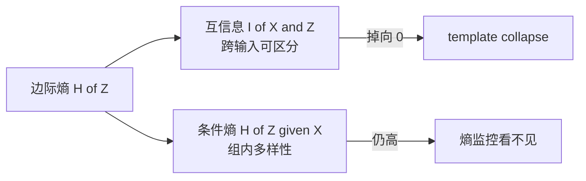
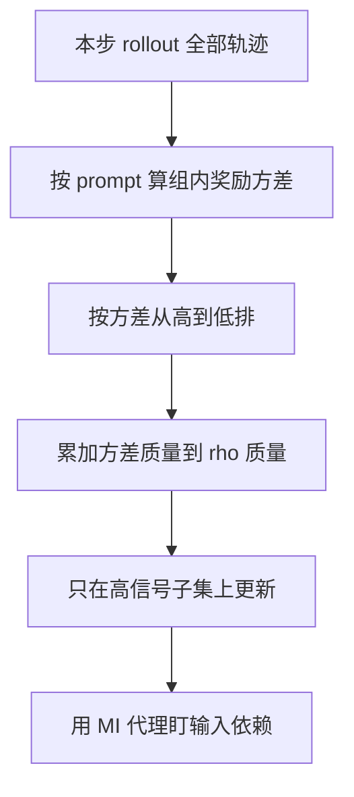

# RAGEN-2：熵还稳着，推理已经不看输入了

<!-- release-date: 2026-04-07 -->

**本文依据**：`RAGEN-2: Reasoning Collapse in Agentic RL`，arXiv 2604.06268v1（2026-04-07），44 页 A4。作者 Zihan Wang、Chi Gui、Xing Jin、Qineng Wang、Licheng Liu 等（前五位为核心贡献者，Zihan Wang 为项目负责人）；第一单位 Northwestern University，合作 UIUC、Imperial College London、Oxford、University of Washington、Microsoft、Stanford 等。通讯方向与前作一致，由 Manling Li 组主导。首发日取 arXiv v1 提交日 2026-04-07；本地 PDF 头已是 v1，页码均对应该文件。项目页 [ragen-ai.github.io/v2/](https://ragen-ai.github.io/v2/)。前作 `RAGEN` 只作边界：那边讲 Echo Trap（组内奖励方差悬崖、熵塌、梯度尖峰），这边讲一种**熵看不见**的失败。标「外部补充」的段落不来自本文。

## 一句话

多轮 Agent RL 里，大家用奖励盯结果、用熵盯推理过程。熵只量「同一个输入上话多不多」，量不出「换一道题，推理有没有跟着变」。RAGEN-2 发现：熵可以一直高，模型却在用一套看起来花、对所有输入都差不多的套话——他们叫 **template collapse（模板坍缩）**。信息论上把 $H(Z)$ 拆成跨输入可区分性 $I(X;Z)$（互信息）和组内多样性 $H(Z\mid X)$（条件熵）；后者稳、前者掉，就是这口井。机制是 **SNR**：组内奖励方差低时任务梯度变弱，KL / 熵正则仍均匀收缩所有链，把跨输入差别抹掉。对策 **SNR-Aware Filtering**：每步用组内奖励方差当 SNR 代理，只拿高信号 prompt 更新。规划、数学、网页、代码上都抬输入依赖和任务分；互信息与终绩的相关远强过熵。

## 一、矛盾：熵在盯多样性，不在盯「有没有听输入」

前作 RAGEN 已经说明：多轮闭环 RL 不稳，vanilla 轨迹优化会掉进 Echo Trap——方差先塌、熵乱、梯度尖。业界因此把奖励当结果稳定器、把熵当过程稳定器（PDF p.1）。

这篇要拆的是下一层误会。熵掉了，可能只是模型更专、更自信，RL 本来就会这样。熵一直高，也不等于推理健康：同一道题内部可以花样很多，换一道题却几乎同一套模板（PDF p.1 图 1）。稀疏结局奖励分不清「真按这盘棋想」和「套话碰巧赢了」；推理链又很难直接监督。于是 **template collapse 可以在训练全程不被熵和奖励看见**（PDF p.1–2）。

设定仍是闭环多轮 Agent RL。策略 $\pi_\theta$ 滚轨迹、再更新。每步观察 $o_t$，生成推理 token $z_t$ 和可执行动作 $a_t$，拿 $r_t$。$X$ 是生成这一轮推理前的全部上下文（系统提示、此前观察与动作、此前推理）；$Z$ 是这一轮推理 token，不含动作和 `</think>` 一类边界符（PDF p.2）。

PPO / GRPO 目标里的 KL、熵奖励对所有输入一视同仁（PDF p.3）：

$$
\mathcal{L}(\theta)=\mathbb{E}_{x,\tau}\bigl[A(\tau,x)\bigr]-\lambda_{\mathrm{KL}}D_{\mathrm{KL}}(\pi_\theta\parallel\pi_{\mathrm{ref}})+\lambda_H H(\pi_\theta)
$$

正则不看这道题是什么，只把分布往「别离参考太远、别太确定」推。任务梯度弱的时候，这股力就会把跨输入差别抹平。

## 二、两轴：组内多样性 vs 跨输入可区分性

边际熵恒等式（PDF p.3）：

$$
H(Z)=I(X;Z)+H(Z\mid X)
$$

- $H(Z\mid X)$：同一输入上推理有多花。现有熵指标大致在盯它。
- $I(X;Z)$：看见这段推理，能猜出它来自哪道输入。这才是「有没有听输入」。

四象限（PDF p.3 图 1）：

| | 高 $I(X;Z)$ | 低 $I(X;Z)$ |
|---|---|---|
| 高 $H(Z\mid X)$ | Diverse Reasoning：组内花、跨输入也分得开 | **Template Collapse：组内花、跨输入一套模板** |
| 低 $H(Z\mid X)$ | Compressed Reasoning：听输入，但过于死 | Low-Entropy Collapse：又死又不看输入 |

后一种熵会报警；**前一种熵可以一直好看**。这就是这篇相对前作 Echo Trap 的新井：Echo Trap 常伴熵乱或熵塌；template collapse 专门藏在「熵还行」里。

图是机制示意，对应 PDF p.3 图 1 的两轴分解。

## 三、怎么在线量 $I(X;Z)$：批次内交叉打分

真互信息对高维 token 序列没有闭式。直觉：若推理真听输入，$Z$ 在自己的 $X_i$ 下应该比在别的 $X_j$ 下更像；若塌成模板，$Z$ 对谁都差不多（PDF p.4）。

方法：**In-Batch Cross-Scoring**。一批 $P$ 个 prompt、每个 $G$ 条推理。对每个 $(Z_{i,k},X_j)$ 做 teacher-forced 对数似然，得到打分矩阵 $L_{i,k,j}=\log p_\theta(Z_{i,k}\mid X_j)$。长度归一后（PDF p.4 式 (1)）：

$$
\mathrm{matched}_{i,k}=\frac{L_{i,k,i}}{|Z_{i,k}|},\qquad
\mathrm{marginal}_{i,k}=\frac{1}{|Z_{i,k}|}\log\frac{1}{P}\sum_j\exp(L_{i,k,j})
$$

matched 是「在真源输入下每 token 有多像」；marginal 用批次均匀混合近似 $p_\theta(Z)$。

两个主代理（PDF p.4–5）：

1. **Retrieval-Acc（离散、好解释）**：看 $Z_{i,k}$ 的似然 argmax 是不是自己的 $X_i$。塌缩时逼近随机水平 $1/P$（$P=64$ 时 $1.56\%$）。
2. **MI-ZScore-EMA（连续、好盯训练）**：matched 减 marginal，再按批次标准差做 z-score，并用 EMA 平滑（$\epsilon=10^{-3}$，$\alpha=0.9$）。塌缩时 matched $\approx$ marginal，估计趋向 $0$。

表 1 还列了 Recall@$k$、未做长度归一的序列估计、只用第一轮 vs 整条轨迹抽样等变体。条件熵与边际熵可从同一套 matched / marginal 并行记下，并满足 $H(Z)=\hat I(X;Z)+H(Z\mid X)$。全部复用训练 rollout 的 $(X,Z)$，**不再另跑模型**（PDF p.4–5）。

实证：Trajectory MI-ZScore 与终绩 Spearman **$+0.39$**；推理熵 / 条件熵在 **$-0.11$ 到 $-0.14$**，方向甚至反了（PDF p.5、p.13 图 8）。

## 四、为什么会塌：SNR，不是「正则开太大」那么简单

核心句：更新被**与输入无关的噪声**压过**能区分任务的信号**时，推理会漂向「组内仍花、跨输入无差」的模板（PDF p.5）。

把 prompt 按组内奖励方差 $\widehat{\mathrm{Var}}(R\mid X)$ 分成六个等量桶，量任务梯度范数 vs 正则梯度范数（PDF p.6 图 3，PPO 与 GRPO 同形）：

1. $\|g_{\mathrm{task}}\|$ 随奖励方差单调升。
2. $\|g_{\mathrm{reg}}\|$（KL + 熵）**跨桶几乎一条平线**。
3. 最低方差桶里，任务梯度近乎没了，正则还在——更新几乎全是与输入无关的收缩。

对输入 $x$ 采 $G$ 条轨迹，优势 $A_g=R_g-\bar R(x)$，任务梯度

$$
g_{\mathrm{task}}(x)=\frac{1}{G}\sum_g A_g\nabla_\theta\log\pi_\theta(\tau_g\mid x)
$$

Cauchy–Schwarz 给出（附录 H，PDF p.7）：

$$
|g_{\mathrm{task}}(x)|\le\sqrt{\widehat{\mathrm{Var}}(R\mid X=x)}\cdot C
$$

方差一低，$g_{\mathrm{task}}$ 被掐死；$g_{\mathrm{reg}}$ 不动。$H(Z\mid X)$ 不必掉——熵奖励还能把组内花样撑着。

三噪声分解（PDF p.7 表 2）：

| 分量 | 来源 | 层级 | 能否直接调系数 | 缓解 |
|---|---|---|---|---|
| $g_{\mathrm{signal}}$ | 同一 prompt 不同轨迹上有意义的奖励差 | prompt | 否 | SNR-Aware Filtering |
| $g_{\mathrm{task\text{-}noise}}$ | 采样与环境随机 | prompt | 否 | 滤高噪声 prompt |
| $g_{\mathrm{reg}}$ | 每条链同样的 KL / 熵收缩 | 链 | 是 | 调 $\lambda_{\mathrm{KL}}$、$\lambda_{\mathrm{ent}}$ |

实践上 $g_{\mathrm{task}}=g_{\mathrm{signal}}+g_{\mathrm{task\text{-}noise}}$，

$$
\mathrm{SNR}(x)=\frac{\|g_{\mathrm{signal}}(x)\|}{\|g_{\mathrm{task\text{-}noise}}(x)\|+\|g_{\mathrm{reg}}\|}
$$

低 SNR 把更新推向与输入无关的方向。方差近 0 时优势塌零，$g_{\mathrm{task}}\approx 0$，但 $\|g_{\mathrm{total}}\|\approx\|g_{\mathrm{reg}}\|$——**梯度范数看起来不小，只是全在推模板**（PDF p.7）。

这和前作 StarPO-S 的「按不确定度滤 prompt」同族，但解释换了：那边是主动学习式「太易太难没信息」；这边是梯度分解——低方差样本不是「没梯度」，是**正则梯度在主导**。

## 五、SNR-Aware Filtering：每步只更新高方差 prompt

每步对每个 prompt 采 $G$ 条轨迹，算组内回报样本方差（PDF p.8）：

$$
\widehat{\mathrm{Var}}(R\mid X)=\frac{1}{G-1}\sum_{g=1}^{G}\bigl(R_g(X)-\bar R(X)\bigr)^2
$$

**Top-$p$**：按方差从高到低排，累加方差质量直到达到 $\rho\sum_i\widehat{\mathrm{Var}}(R\mid x_i)$，只拿这一子集算参数更新，损失再乘 $\rho$ 让步长可比（PDF p.8–9）。像 nucleus sampling，但排序键是组内奖励方差不是 token 概率。$\rho=0.9$ 是主设定。附录 G 还有 top-$k$、min-$p$。

图是机制示意，对应 PDF p.7 图 4。不另加模型、不另加 rollout；只要 $G\ge 2$ 才能估方差。

## 六、实验台：七个环境，正文主表四列

沿用 RAGEN 测试台 + veRL / HybridFlow。主模型 Qwen2.5-3B；对照 PPO、DAPO、GRPO、Dr.GRPO，最多 400 个 rollout–更新迭代。每环境每步 $K=P\times G=128$ 条轨迹，默认 $P=8$、$G=16$（PDF p.9）。Sokoban / FrozenLake：最多 5 轮、每轮 2 个动作（共 10 个动作）。Countdown / MetaMathQA：1 轮 1 动作。更新 batch 32，每 GPU mini-batch 4；GAE $(\gamma,\lambda)=(1.0,1.0)$；actor $1\times 10^{-6}$，critic $1\times 10^{-5}$；熵系数 $\beta=0.001$；PPO 非对称裁剪 $\varepsilon_{\mathrm{low}}=0.2$、$\varepsilon_{\mathrm{high}}=0.28$；缺 `<think>` / `<answer>` 格式罚 $-0.1$。验证：每环境固定 512 条 prompt，$T=0.5$（PDF p.29）。早停：奖励方差连续 5 步低于前 10 步均值的 10%，或验证成功率连续 5 个检查点低于 $1\%$（PDF p.29）。

七环境特征（PDF p.9 表 3）：

| 任务 | 随机转移 | 多轮 | 状态 | 奖励 |
|---|---|---|---|---|
| Sokoban | 否 | 是 | 网格 | 稠密 |
| FrozenLake | 是 | 是 | 网格 | 二元 |
| MetaMathQA | 否 | 是 | 文本 | 稠密（重试减半） |
| Countdown | 否 | 否 | 文本 | 二元（格式部分分） |
| SearchQA | 否 | 是 | 文本 | 稠密 |
| WebShop | 否 | 是 | 文本 | 稠密 |
| DeepCoder | 否 | 否 | 文本 | 稠密（过测例数） |

附录 FrozenLake 用 2% 滑步变体（意图动作 98% 执行），成功 $+1$ 其余 $0$（PDF p.28）。MetaMathQA 首次对满分 $1.0$，每次重试减半。Countdown 对了 $1.0$、数用对但算错 $0.1$。DeepCoder 来自 PrimeIntellect / TACO / LiveCodeBench v5。SearchQA 取 RLLM 的 Search-R1 变体。WebShop 仍是按属性匹配给分的购物站（PDF p.28）。

**正文主数字在 Sokoban / FrozenLake / MetaMathQA / Countdown。** SearchQA、WebShop、DeepCoder 进了测试台和网站叙述，**表 4 没有它们的单元格**；不要把封面「网页导航、代码执行」读成主表四列之外还有一张完整对照。

## 七、塌缩长什么样，过滤抬多少

图 5：无过滤时 **MI（Retrieval-Acc）先掉、任务分后掉、条件熵全程偏高**——这就是 template collapse 的时间签名。Top-$p$ SNR 过滤最能同时保住任务分和检索准确率（PDF p.10）。图 7：八个环境上推理长度单调变短，是行为侧的「套话变短」（PDF p.11）。图 6：Sokoban、FrozenLake、MetaMathQA、Countdown 上 Top-$p$ 优于固定 Top-$k$ 与无过滤；Top-$k$ 不管信号多差都硬留固定个数，会把弱更新灌进去（PDF p.10–11）。

表 4（PDF p.11）：单元格是「无过滤峰值（过滤增量）」，单位 %。

| 变体 | Sokoban | FrozenLake | MetaMathQA | Countdown | 平均 |
|---|---:|---:|---:|---:|---:|
| PPO，Qwen2.5-3B | 12.9（+16.0） | 67.0（+10.9） | 92.6（+0.6） | 97.9（+0.0） | 67.6（+6.9） |
| DAPO | 16.2（+5.1） | 66.8（+2.1） | 90.8（+2.8） | 95.7（+1.6） | 67.4（+2.9） |
| GRPO | 12.1（+9.0） | 70.9（−3.0） | 91.2（+1.2） | 95.7（+2.2） | 67.5（+3.7） |
| Dr.GRPO | 12.1（−0.4） | 23.2（+0.6） | 91.2（+1.4） | 96.5（+1.4） | 55.8（+0.8） |
| PPO 0.5B | 3.3（+22.9） | 19.5（+0.0） | 10.0（−0.2） | 23.0（−0.7） | 14.0（+5.5） |
| PPO 1.5B | 17.0（+6.2） | 36.5（+1.6） | 80.3（+7.0） | 56.6（+1.6） | 47.6（+4.1） |
| PPO 7B | 42.4（+4.9） | 85.0（−0.6） | 84.0（+11.7） | 97.7（+0.3） | 77.3（+4.1） |
| Qwen2.5-3B-Instruct | 22.5（+14.2） | 83.6（+2.3） | 91.2（+0.4） | 96.3（−0.6） | 73.4（+4.1） |
| Llama3.2-3B | 24.4（+18.8） | 84.6（−0.2） | 86.1（+3.7） | 99.2（−1.2） | 73.6（+5.3） |
| Qwen2.5-VL-3B 文本 | 53.0（+6.0） | 16.0（+53.5） | — | — | 34.5（+29.8） |
| Qwen2.5-VL-3B 图像 | 65.0（+12.0） | 19.5（+59.5） | — | — | 42.3（+35.8） |

读法：Sokoban 上 PPO 3B 从 12.9 拉到约 28.9；0.5B 从 3.3 拉到约 26.2，过滤在难规划上最值钱。数学两列基线已经很高，增量小甚至为零。**GRPO + FrozenLake 是 −3.0**：过滤不是免费午餐。作者把 DAPO 自带的接受步看成他们框架里 $\rho\to 1$ 的特例；表 4 的 DAPO「无过滤」是「原算法、不再叠一层 SNR 滤」（PDF p.12）。

算力：总 rollout 预算钉死 128 条。估 RV 要 $G\ge 2$。表 5 Sokoban、Qwen2.5-3B、$\rho=0.9$（PDF p.12）：

| $P\times G$ | 无过滤成功率 % | 过滤 % | 每步时间变化 | 显存 |
|---|---:|---:|---|---|
| $128\times 1$ | 23.6 | — | — | 约 202 GB |
| $64\times 2$ | 18.8 | 27.3（+8.6） | −29% | 几乎不变 |
| $32\times 4$ | 24.2 | 27.4（+3.2） | −41% | 几乎不变 |
| $8\times 16$ | 15.6 | 23.6（+8.0） | −26% | 几乎不变 |

RV 本身占迭代时间 $<0.1\%$。过滤后进梯度的组变少，墙钟反而降 26–41%。$G\ge 4$ 加过滤不差于、往往好于 $128\times 1$ 基线——**不是加算力换来的**（PDF p.12）。注意这里无过滤 23.6% 与表 4 的 12.9% 不是同一 $(P,G)$，不要横表对打。

附录表 9（Sokoban 3B 消融，PDF p.30）：无过滤任务分 0.17、MI 0.54、训练标成塌；RV 过滤 0.38 / 0.84 且稳住。按熵滤、按长度滤、按奖励和滤，要么 MI 掉、要么仍塌。Keep smallest 相对 keep largest：任务分 0.29 vs 0.44，MI 0.47 vs 0.89。Min-p = 0.2 任务分可以到 0.45，但 MI 掉到 0.36——高分不一定保住输入依赖。

## 八、四条因果压力测试

图 13：扫熵系数、KL 系数、过滤 keep rate。熵 / KL 主要挪 $H(Z\mid X)$，很少把模型送进高 $\hat I$ 且任务分明显更好的区；SNR 过滤沿 MI 与成功率单调往上走。把熵拧太高会不稳；KL 主要把策略钉在参考附近，不抬输入依赖（PDF p.12–13、p.18）。

1. **分位因果**（表 6，Sokoban 3B，$P=8$、$G=16$，每步留 25%）（PDF p.14）：只训最高方差四分位 Q1，任务分 21.1、MI 0.95、熵 2.02；Q4 最低方差则 11.0 / 0.73 / 1.87。表现和 MI 从 Q1 到 Q4 单调变差。配上 $\|g_{\mathrm{task}}\|\le\sqrt{\mathrm{RV}}$，链条是：奖励方差 → 梯度质量 → 听输入的推理。
2. **环境噪声**（图 9 FrozenLake）（PDF p.14）：滑步从 0% 加到 100%，Top-$p$ 与无过滤的中位成功率都降；0–50% 过滤仍明显领先，**80–100% 差距收掉**。噪声把组内方差吹大但没有任务信息，RV 不再是好代理。机制自己标出了失效边界。
3. **滤 prompt 还是滤轨迹**（表 7，Sokoban 3B）（PDF p.15）：无过滤 8/8 prompt、128 条、12.9%、MI 0.83；prompt 级 $\rho=0.9$ 约留 3.2/8 prompt、50.6 条、**23.6%、MI 1.80**；轨迹级仍用全部 prompt、每组只留奖励两极共 64 条，16.8%、MI **0.20**。在天生低方差的题上硬掏轨迹，会放大噪声。要选「天生能分出输赢」的题。
4. **何时该滤**（表 8）（PDF p.15）：用一批 rollout 就能算的 $\mathrm{Std}(\mathrm{RV})/\mathrm{Mean}(\mathrm{RV})$。Sokoban 14B 比值 1.29、过滤 $\Delta=+4.6\%$；Sokoban 3B 1.16、+3.2%；**FrozenLake 3B GRPO 比值 0.33、$\Delta=-5.0\%$**。比值高说明 RV 双峰，滤得开信号和噪声；近 0 则所有题差不多，过滤等于随机扔数据。这能解释表 4 里那格 GRPO FrozenLake 的负增量。

训练过程中：零方差 prompt 变多，有效保留比 $\rho_{\mathrm{eff}}$ 自动变严（图 10）。固定 $k$ 的 Top-$k$ 做不到这点。晚期 Sokoban 的 prompt 级奖励分布往中间挤，混合区变大、难度差被压扁（图 11）（PDF p.15–16）。格式合法率和塌缩几乎脱钩：合法率可以近满分，MI 照样低（图 12）（PDF p.16）。RV 与条件熵 Spearman −0.14、与回复长度 0.12、与任务奖励 **0.63**——它盯的是另一根轴，补的是 KL / 熵调不着的那一刀（PDF p.16）。

## 九、局限、和前作的边界、可迁移启发

作者自己写的边界（PDF p.18）：SNR 分解假定任务信号和正则噪声分得开，实践中梯度累加可能耦合；全是单 Agent，多 Agent 里模板怎么传不知道；强模型可能**故意把奖励方差做大**来骗过滤器；稀疏 / 高噪声奖励下 RV 不再可靠；滤得太狠会窄探索，$\rho$ 要按任务调。

和 RAGEN（StarPO / Echo Trap / StarPO-S）不要并成一篇：前作的崩法是方差悬崖 + 熵塌 + 梯度尖，对策是不确定度过滤 + 去 KL + Clip-Higher。这篇假定你已经会盯熵，然后指出熵的盲区，把「按方差滤」从启发式收成 SNR 机制，并加上不另跑模型的 MI 监控。StarPO-S 的 $U=\mathrm{Std}[R(\tau)]$ 和这里的 $\widehat{\mathrm{Var}}(R\mid X)$ 是近亲；新东西是互信息诊断、梯度分解证据、以及「熵 / KL 拧的是 $H(Z\mid X)$，滤 prompt 拧的是 SNR」这句分工。

**可直接搬家的：**

- 监控不要只看熵。同一套 rollout 做批次交叉打分，Retrieval-Acc 跌向 $1/P$、MI-ZScore 趋向 0，就是模板在形成；它往往比任务分更早掉。
- 组内奖励方差当 SNR 代理，Top-$p$ 质量过滤。先算 $\mathrm{Std}(\mathrm{RV})/\mathrm{Mean}(\mathrm{RV})$，太低就别滤。
- 滤 prompt，不要在低方差题上硬截轨迹。
- 格式对了不等于听输入；长度变短是旁证，不是诊断。

**依赖设定、别照搬数字的：** 表 4 的 +16.0 是 Sokoban + PPO 3B，不是网页 Agent 的通用涨幅；FrozenLake + GRPO 已经是负的。$G=16$、$K=128$、$\rho=0.9$ 是他们的预算切法。视觉 FrozenLake 那两格 +53.5 / +59.5 基线极低，读成「VL 上过滤神了」会过读。

## 外部补充

- arXiv abs `[Submitted on 7 Apr 2026]`，与 PDF 头 `2604.06268v1 … 7 Apr 2026` 一致。
- 项目页宣称 RAGEN-2 为 ICML 2026 Oral，作者栏误写 Zenus Wang；**正文身份以 PDF 封面为准**（Zihan Wang，Northwestern）。
- GitHub [mll-lab-nu/RAGEN](https://github.com/mll-lab-nu/RAGEN) 把 Echo Trap 与 reasoning collapse 并列，并写 V2 增加 SNR-Adaptive Filtering（论文用语是 SNR-**Aware**）与 MI 诊断；News 有 2026.3.12 发布句。本篇 `release-date` 仍取 arXiv v1，不回写成仓库 News 日。

## 关键词回看

- **Template collapse**：组内熵高、跨输入互信息低，套话对谁都像。
- **$H(Z)=I(X;Z)+H(Z\mid X)$**：多样性可以来自「听输入」也可以来自「固定模板的花腔」。
- **In-Batch Cross-Scoring / Retrieval-Acc / MI-ZScore-EMA**：不另开模型的输入依赖代理。
- **SNR**：$\|g_{\mathrm{signal}}\|$ 对 $\|g_{\mathrm{task\text{-}noise}}\|+\|g_{\mathrm{reg}}\|$；低组内奖励方差让正则主导。
- **SNR-Aware Filtering**：按组内 RV 做 Top-$p$ 质量过滤；$\mathrm{Std}/\mathrm{Mean}$ 预判该不该滤。
